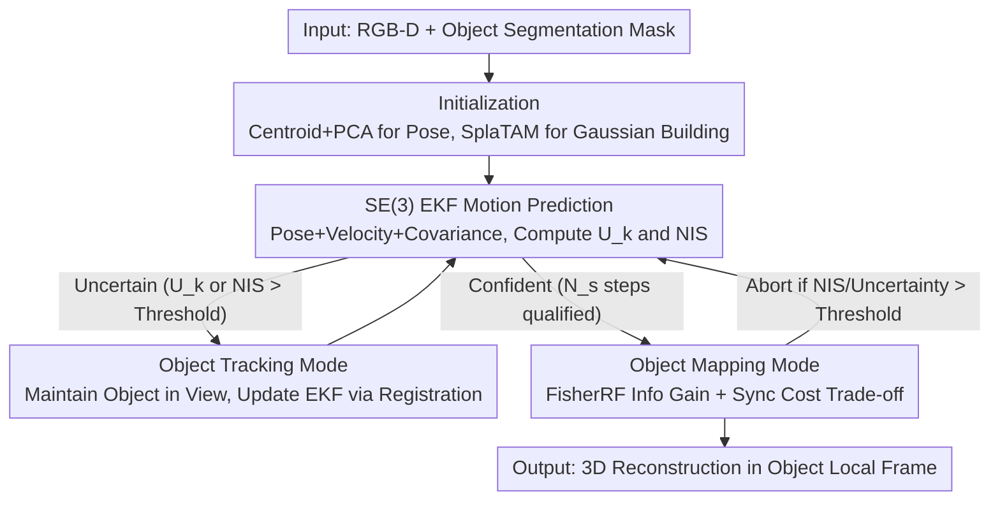

# Paparazzo: Active Mapping of Moving 3D Objects

**Conference**: CVPR 2026  
**Paper**: [CVF Open Access](https://openaccess.thecvf.com/content/CVPR2026/html/Allegro_Paparazzo_Active_Mapping_of_Moving_3D_Objects_CVPR_2026_paper.html)  
**Code**: [Project Page](https://davidea97.github.io/paparazzo-page/)  
**Area**: 3D Vision  
**Keywords**: Active Mapping, Moving Object Reconstruction, Extended Kalman Filter, Fisher Information, Gaussian Splatting

## TL;DR
Paparazzo introduces the novel task of "active reconstruction of moving objects" and proposes a training-free dual-mode framework. It utilizes an Extended Kalman Filter (EKF) to predict the trajectory of non-cooperative moving targets and selects optimal observation viewpoints using FisherRF information gain. By balancing "high information but unreachable" views with "lower information but synchronizable" ones, it achieves more complete and efficient 3D reconstruction compared to passive or random baselines.

## Background & Motivation

**Background**: Scene exploration and active mapping have been long-standing research topics in vision and robotics, gaining renewed interest with applications like UAVs and digital twins. Predominant approaches fall into two categories: traditional methods using heuristics (frontier exploration, next-best-view selection) with voxel/point cloud representations, and learning-based methods (MACARONS, NextBestPath, NARUTO, ActiveGS) using neural networks or NeRF/3DGS as intermediate scene states, selecting the next optimal pose based on coverage gain, confidence, or Fisher information.

**Limitations of Prior Work**: To the authors' knowledge, **all existing active mapping works assume a static scene**, where the task is to cover an immobile environment with the shortest possible trajectory. This assumption fails in many real-world scenarios, such as trucks on construction sites or mobile devices that constantly reshape the workspace, where operations cannot be halted for "static capturing."

**Key Challenge**: To reconstruct a **non-cooperative** object that moves independently of the mapping activity, the agent must both capture views that reveal new surfaces and compensate for the object's future motion during its own navigation. Consequently, viewpoint quality depends not only on geometric information but also on the ability to reach that viewpoint at the correct moment. A highly informative viewpoint might not be optimal if it moves with the object and requires an excessive travel time compared to a slightly less informative but much closer view.

**Goal**: (1) Define the new task of "active reconstruction of moving objects"; (2) Provide a training-free framework that generalizes to new scenes and objects; (3) Establish the first benchmark for this task.

**Key Insight**: The problem is decomposed into "predicting object motion" and "selecting maximum information views under synchronization constraints." The former uses an EKF (to fuse historical observations for prediction and detect unreliable states), while the latter uses FisherRF to quantify the contribution of views toward refining Gaussian Splatting parameters.

**Core Idea**: A training-free dual-mode framework that enters "Tracking Mode" to stabilize the EKF when motion estimation is uncertain and switches to "Mapping Mode" to select the next optimal viewpoint by weighing information gain against time-synchronization costs. The modes switch reactively based on EKF confidence.

## Method

### Overall Architecture
The agent is equipped with a fixed forward-looking RGB-D camera to reconstruct an object with unknown poses moving autonomously, assuming the agent's own pose is known. Paparazzo alternates between two modes based on the confidence of the object's motion estimation: **Object Tracking Mode** (when estimation is uncertain, keeping the object centered and updating the EKF via registration) and **Object Mapping Mode** (when confident, predicting future poses and selecting optimal synchronized views). The system initializes upon the first detection (centroid for translation, PCA for rotation, SplaTAM for Gaussian initialization). It operates as a reactive closed loop of "prediction → confidence check → tracking or mapping → reconstruction update → confidence re-check" at approximately 8 FPS without requiring training data.

### Key Designs

**1. SE(3) EKF Motion Prediction and Dual-Metric Confidence Discrimination**

To handle non-cooperative objects with unknown and erratic motion, an EKF is defined on $SE(3)$. The state includes the object pose $T^W_{O_k}$, linear velocity, angular velocity, and covariance $P_k$. The EKF fusion serves two purposes: predicting trajectories and **detecting unreliable predictions**. Confidence is quantified via two metrics: state uncertainty $U_k=\mathrm{tr}(P_k)$ and Normalized Innovation Squared $\text{NIS}_k=y_k^\top S_k^{-1}y_k$, where $y_k=\log((T^W_{O_k|k-1})^{-1}T^{W,\text{meas}}_{O_k})$ is the innovation on $SE(3)$ and $S_k=HP_{k|k-1}H^\top+R$ is the innovation covariance. Mapping mode is only active if $U_k<\theta_u$ and $\text{NIS}_k<\theta_n$ for **$N_s$ consecutive steps**; otherwise, it reverts to tracking.

**2. Object Tracking Mode: Prioritizing Motion Estimation Stability**

When the EKF is uncertain (e.g., sudden direction changes), this mode prioritizes frequent observations to refine motion estimates. The agent rotates to move the segmentation mask toward the image center and adjusts distance so the object occupies roughly half the frame. It estimates the measured pose $T^{W,\text{meas}}_{O_k}$ by aligning the current segmented cloud $P^{C_k}_{O_k}$ with the cumulative reconstruction using KISS-Matcher for coarse registration and Colored ICP for refinement. The result updates the EKF and integrates new points into the SplaTAM-based Gaussian model $G_O$.

**3. Object Mapping Mode: Balancing Info Gain and Sync Cost**

Once the EKF is stable, the goal is to reach a pose that improves reconstruction while remaining reachable. The agent samples a set of **foveated candidate views** $V$ that move relative to the object. The selection follows the cost function $B(x,i)=-w_{\text{eig}}\,\text{EIG}(x)+w_{\text{sync}}\,C_{\text{sync}}(x,i)$. Here, $\text{EIG}(x)$ is the expected information gain calculated via FisherRF for Gaussian parameters $\theta$. The synchronization cost $C_{\text{sync}}(x,i)=\big|\hat{s}_{\text{agent}}(x,i)-(i-k)\big|$ measures the timing mismatch: $\hat{s}_{\text{agent}}(x,i)$ is the number of A* steps for the agent to reach the viewpoint corresponding to the object's predicted pose at future time $i$, while $i-k$ is the time elapsed. The optimal candidate is $(x^*,i^*)=\arg\min_{x\in V,\,(i-k)\le N_h} B(x,i)$.

## Key Experimental Results

### Main Results
The benchmark is built in Habitat 3.0 with 6 indoor scenes (3 Matterport3D + 3 Gibson). Synthetic moving targets are injected with 4 motion patterns (Bouncing Ball / Curved BB / Forward & Backward / Stop & Go). Translation is 5 cm/step and rotation is 10°/step. Metrics include **3D Coverage (%)** within $\delta=1$ cm, **Completeness (cm)** representing average distance to the nearest reconstruction point, and **AUC** of the coverage curve.

Average Results for Bouncing Ball (BB) across 6 scenes (5 runs/500 steps each):

| Method | Coverage (%) ↑ | Completeness (cm) ↓ | AUC ↑ | Notes |
|------|------|------|------|------|
| Random Walk (RW) | 51.50 | 2.08 | 0.51 | Ignores object position |
| Random Informative Selection (RIS) | 67.07 | 1.12 | 0.60 | Informative views without sync |
| Tracking-Only (TO) | 75.89 | 0.90 | 0.70 | Passive tracking (baseline) |
| **Ours (Paparazzo)** | **81.51** | **0.77** | **0.75** | Dual-mode active mapping |

Paparazzo outperforms all baselines in coverage, completeness, and AUC, demonstrating faster and more comprehensive reconstruction.

### Ablation Study
RIS serves as an ablation of Paparazzo removing the sync cost and feasibility reasoning; TO serves as an ablation removing active viewpoint selection.

| Configuration | Key Capability | Avg. Coverage (BB) | Notes |
|------|---------|------|------|
| Paparazzo (Full) | Motion-aware + Time Feasibility | 81.51 | Full dual-mode |
| w/o Sync Cost (≈RIS) | Info-only selection | 67.07 | Drop of ~14.4%, often misses views |
| w/o Active Selection (≈TO)| Passive tracking | 75.89 | Lacks viewpoint diversity |
| w/o Object Awareness (≈RW)| Random walk | 51.50 | Practically unusable |

### Key Findings
- **Synchronization cost is the most critical component**: RIS performs worse than passive tracking (TO) because it attempts informative but unreachable views.
- **Motion complexity**: BB is relatively easy due to frequent direction changes helping visibility; **Stop & Go is the most difficult** as stopping in occluded areas disrupts EKF predictions.
- In narrow spaces (e.g., Ribera scene), Paparazzo sometimes matches or falls slightly behind TO by ~5% due to restricted maneuverability.

## Highlights & Insights
- **Defined a neglected task**: Most active mapping assumes static scenes. This work formalizes active reconstruction for "non-cooperative moving objects" and provides the first benchmark.
- **Training-free generalization**: Based on EKF, FisherRF, and A*, the system generalizes to new scenes and objects without data dependence.
- **The Sync Cost $C_{\text{sync}}$**: Integrating "information gain" with "temporal reachability" is a transferable concept for any chasing or dynamic observation task.
- **Reactive Switching**: Using the filter's own covariance and innovation as triggers allows the system to balance motion estimation and information gathering autonomously.

## Limitations & Future Work
- **Simulation-heavy**: All experiments use Habitat 3.0; sim-to-real gaps (noisy segmentation, depth, and irregular motion) remain unverified.
- **Mask Dependency**: Assumes object masks are available. Failure in segmentation directly impacts pose estimation and reconstruction.
- **Environmental Constraints**: In narrow spaces with fast curved motion, the benefits of active planning are diminished by reachability limits.
- **Latency**: Running at 8 FPS may be insufficient for extremely fast-moving targets.

## Related Work & Insights
- **Comparison to Static Mapping**: Unlike MACARONS or ActiveGS, Paparazzo must explicitly compensate for object motion, making "temporal feasibility" as important as "geometric information."
- **Comparison to Hand-held Scanning**: While some methods use Gaussians for objects moved by users (cooperative), Paparazzo handles non-cooperative motion where the agent must plan its own trajectory to capture new relative poses.
- **Tracking-Only Baseline**: TO maintains motion estimates but lacks viewpoint diversity; Paparazzo demonstrates that "active selection + synchronization" yields measurable improvements in completeness.

## Rating
- Novelty: ⭐⭐⭐⭐⭐ Pioneering task and benchmark for moving objects.
- Experimental Thoroughness: ⭐⭐⭐⭐ Extensive simulation across scenes/motions; lacks real-robot validation.
- Writing Quality: ⭐⭐⭐⭐ Clear motivation and well-explained reactive control loop.
- Value: ⭐⭐⭐⭐ Significant potential for digital twins and dynamic logistics.

<!-- RELATED:START -->

## Related Papers

- [\[CVPR 2026\] Uncertainty-driven 3D Gaussian Splatting Active Mapping via Anisotropic Visibility Field](uncertainty-driven_3d_gaussian_splatting_active_mapping_via_anisotropic_visibili.md)
- [\[CVPR 2026\] MAGICIAN: Efficient Long-Term Planning with Imagined Gaussians for Active Mapping](magician_efficient_long-term_planning_with_imagined_gaussians_for_active_mapping.md)
- [\[CVPR 2025\] ActiveGAMER: Active GAussian Mapping through Efficient Rendering](../../CVPR2025/3d_vision/activegamer_active_gaussian_mapping_through_efficient_rendering.md)
- [\[CVPR 2026\] Scene Reconstruction as Mapping Priors for 3D Detection](scene_reconstruction_as_mapping_priors_for_3d_detection.md)
- [\[CVPR 2026\] SunFaded: Illumination-Aware Gaussian Splatting for Dark Scenes with Camera-Mounted Active Lighting](sunfaded_illumination-aware_gaussian_splatting_for_dark_scenes_with_camera-mount.md)

<!-- RELATED:END -->
