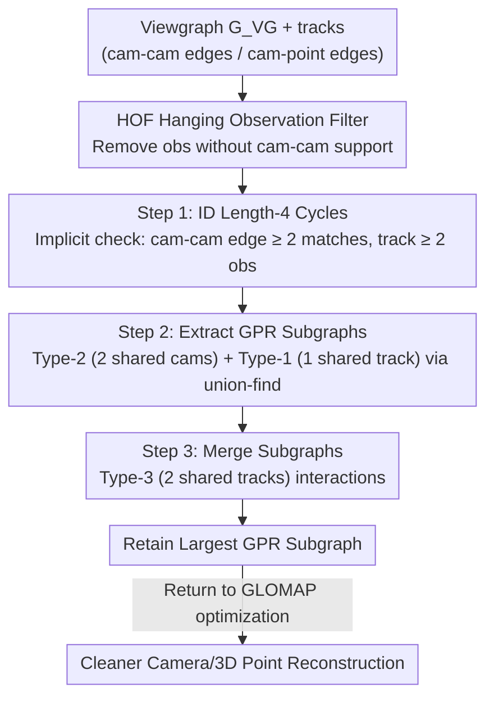

# Parallel Rigidity Matters for Bundle Adjustment

**Conference**: CVPR 2026  
**Paper**: [CVF Open Access](https://openaccess.thecvf.com/content/CVPR2026/html/Manam_Parallel_Rigidity_Matters_for_Bundle_Adjustment_CVPR_2026_paper.html)  
**Code**: None  
**Area**: 3D Vision  
**Keywords**: Bundle Adjustment, Parallel Rigidity, Structure from Motion, Unique Solvability, Viewgraph

## TL;DR
This paper employs "parallel rigidity" theory to systematically address the long-overlooked fundamental question of "when the solution to Bundle Adjustment (BA) is unique." By treating the joint optimization of camera translations and 3D points as a direction-constrained problem on a bipartite graph, the authors design the GPRBA algorithm. This algorithm efficiently extracts "generically parallel rigid" (GPR) subgraphs via the camera-to-camera viewgraph. Integrating this into the global SfM pipeline GLOMAP enables the clean removal of cameras and 3D points that are misplaced due to independent scaling.

## Background & Motivation

**Background**: Bundle Adjustment is the cornerstone of 3D reconstruction, widely used in SfM and SLAM to simultaneously solve for camera intrinsics/extrinsics and 3D point coordinates from 2D observations. For decades, the literature has focused almost exclusively on the "how-to" aspects—modifying camera models, integrating GPS/IMU, adding photometric constraints, refining optimizers (LM, Conjugate Gradient, Schur complement tricks), handling outliers, and implementing distributed versions.

**Limitations of Prior Work**: Fundamental questions regarding the existence and uniqueness of solutions have been largely ignored. Classic surveys like Triggs et al. provided only empirical "rules of thumb" regarding camera coverage to indirectly ensure reliable estimation, but the BA bipartite graph itself has never been analyzed under the framework of parallel rigidity. Practically, this neglect leads to reconstruction artifacts where entire sets of cameras and 3D points are "independently scaled" and misplaced (e.g., a wall facade flying off to the wrong position in Paper Fig. 1), as they occupy a different scale from the main reconstruction.

**Key Challenge**: BA treats every pixel observation as a direction in the camera's local coordinate system (projective mapping for pinhole cameras), while attempting to recover 3D vectors in a world coordinate system. The inputs are on the unit sphere $S^2$ while the outputs are in $\mathbb{R}^3$. This dimensionality mismatch necessitates the estimation of additional scale factors $\alpha_{ij}$ for each edge. If a subgraph's scale can expand or contract independently of the rest, the solution is no longer unique. This is precisely what parallel rigidity characterizes, though it originally requires all directions to be given in a unified global frame. In BA, camera rotations and intrinsics are also optimized, meaning directions are only known locally.

**Goal**: (1) Rigorously bridge parallel rigidity theory and BA to clarify that it constrains the unique solvability of "camera translations + 3D point coordinates" (under Sim(3) gauge freedom), rather than other camera parameters; (2) determine "generically parallel rigid (GPR)" subgraphs based solely on bipartite graph topology without prior knowledge of camera rotations/intrinsics, and efficiently extract the maximum GPR subgraph.

**Key Insight**: The authors note that the shortest cycle in a bipartite graph is of length 4 (two cameras + two 3D points), and cycles of length $\le 4$ are naturally GPR in $\mathbb{R}^3$. Thus, the problem of determining if the entire graph is GPR can be transformed into a combinatorial problem of "finding length-4 cycles and analyzing their overlaps." Since the number of 3D points is immense, the authors perform this indirectly through the much smaller camera-to-camera viewgraph.

**Core Idea**: Reduce the problem of "BA solution uniqueness" to "generic parallel rigidity of the bipartite BA graph," then use the viewgraph to efficiently extract the maximal GPR subgraph to excise parts of the reconstruction that would otherwise be independently scaled.

## Method

### Overall Architecture
The method is titled **GPRBA** (Generically Parallel Rigid Bundle Adjustment). It does not modify the BA optimization objective but serves as a "topological check + cleaning" module inserted into existing global SfM pipelines (GLOMAP is used in the paper). It is based on a theoretical conclusion: when BA optimizes camera translations $T_i$ and 3D points $P_j$ from 2D observations $o_{ij}$, the consistency relation $(P_j - T_i) \parallel (R_i^\top K_i^{-1}\tilde{o}_{ij})$ is isomorphic to the standard form of parallel rigidity. Therefore, "uniqueness of solution" is equivalent to "GPR property of the bipartite graph $G_{BA}$."

The pipeline is as follows: from the viewgraph $G_{VG}$ (cameras as nodes, matching observations as edges), tracks are constructed (camera-point subgraphs). First, **HOF** is used to remove "hanging observations" not supported by camera-camera edges. Then, the **three-step GPRBA algorithm** is applied: implicitly identifying length-4 cycles, merging GPR subgraphs via three types of interactions, and retaining only the largest GPR subgraph for input back into GLOMAP. Since GLOMAP filters tracks multiple times (5 times per run), HOF+GPRBA is re-invoked after each change.

### Key Designs

**1. Introducing Parallel Rigidity to BA: Revealing Unique Solvability of "Translations + 3D Points"**

This is the theoretical anchor. For a graph $G=(V,E)$, where nodes are 3D vectors $x_i\in\mathbb{R}^3$ and edges are relative directions $u_{ij}\in S^2$, the consistency relation is $(x_j-x_i)=\alpha_{ij}u_{ij}$, or $u_{ij}\times(x_j-x_i)=0$. Collecting all edges yields $S_U(B\otimes I_3)x=0$, where $B$ is the incidence matrix and $S_U$ is a block diagonal matrix of $[u_{ij}]_\times$. A graph is **parallel rigid (PR)** in $\mathbb{R}^3$ if and only if $\mathrm{rank}(S_U(B\otimes I_3))=3|V|-4$ (where 4 represents the gauge freedom of origin + global scale). A lower rank implies infinite solutions, meaning some $\alpha_{ij}$ can scale independently. The authors rearrange the pinhole projection $K_iR_i(P_j-T_i)=\beta_{ij}\tilde{o}_{ij}$ into $(P_j-T_i)\parallel(R_i^\top K_i^{-1}\tilde{o}_{ij}/\|\cdot\|)$, proving isomorphism with the PR standard form. Since directions are unknown due to optimized rotation/intrinsics, they utilize "generic parallel rigidity (GPR)," which depends only on graph topology and spatial dimensionality. This insight is significant: it is independent of the cost function, implying that pipelines like GLOMAP, which use non-reprojection costs, are still bound by these constraints.

**2. Viewgraph Proxy Analysis: Using Camera-Camera Graphs to Determine Length-4 Cycles**

Direct GPR analysis on a bipartite graph is computationally expensive—a naive approach requires intersecting all track pairs, resulting in $O(|V_P|^2)$ complexity, where the number of 3D points $|V_P|$ is massive. The key observation is that a track is composed of matching observations along adjacent camera-camera edges; thus, the bipartite topology can be inferred from the **viewgraph** $G_{VG}=(V_C,E_{VG})$. Since each cam-cam edge carries many matches, identifying length-4 cycles can be done by checking conditions on cam-cam edges rather than enumerating 3D points. This reduces the problem scale from $|V_P|$ to $|E_{VG}|$. Given that $|E_{VG}|\ll|V_P|\ll|E_{BA}|$, this makes the method scalable to datasets with approximately 9,000 cameras.

**3. Three-Step GPRBA Merging Algorithm: Building the Largest GPR Subgraph**

The theoretical basis is that "two GPR subgraphs sharing at least 2 nodes form a combined GPR subgraph." In a bipartite graph, overlaps between two length-4 cycles fall into three categories: Type-1 (sharing one camera-point edge/node), Type-2 (sharing two cameras), and Type-3 (sharing two 3D points). The algorithm proceeds in three steps: **Step 1** implicitly finds length-4 cycles on the viewgraph by recursively deleting cam-cam edges with $<2$ matching observations and tracks with $<2$ observations; **Step 2** extracts subgraphs by noting that all cycles from the same cam-cam edge are Type-2 overlaps, merging them into GPR components, and then using union-find to connect adjacent subgraphs sharing tracks (Type-1); **Step 3** merges components from Step 2 if they share $\ge 2$ tracks (Type-3). Although extracting the absolute maximum GPR subgraph is NP-hard, this heuristic is effective and efficient in practice.

**4. HOF Hanging Observation Filtering: Removing Isolated Observations**

Because pipelines modify tracks at different stages (removing high-residual observations, outlier rejection), some observations may remain in a track despite no longer having support from a cam-cam edge (see Paper Fig. 4). These are defined as **hanging observations**. Since the analysis relies on cam-cam edges, these observations are not considered and can pollute the estimate; therefore, they are deleted. Experiments show that using HOF alone can significantly increase the number of reconstructed 3D points, particularly when GLOMAP skips re-triangulation.

## Key Experimental Results

Experiments used IMC 2022 and 1DSfM datasets with GLOMAP as the baseline global SfM pipeline. Global pipelines were chosen over incremental ones because incremental pipelines inherently tend to produce GPR graphs by only incorporating cam-cam edges with reconstructed points. Results compare BA outputs without re-triangulation (w/o retri) and with re-triangulation (w/ retri).

### Main Results: HOF Gain + HOF+GPRBA Misplacement Removal

| Dataset | Configuration | Cams | 3D Pts (×10³, w/o retri) | 3D Pts (×10³, w/ retri) |
| :--- | :--- | :--- | :--- | :--- |
| Brandenburg Gate (IMC) | GLOMAP | 349 | 0.5 | 31 |
| Brandenburg Gate (IMC) | +HOF | 349 | 16 | 29 |
| Brandenburg Gate (IMC) | +HOF+GPRBA | 346 | 15 | 29 |
| Alamo (1DSfM) | GLOMAP | 1117 | 4.4 | 132 |
| Alamo (1DSfM) | +HOF | 1111 | 100 | 150 |
| Alamo (1DSfM) | +HOF+GPRBA | 724 | 73 | 119 |
| Yorkminster (1DSfM) | GLOMAP | 2014 | 10.8 | 318 |
| Yorkminster (1DSfM) | +HOF+GPRBA | 585 | 131 | 410→131 |

> **Interpretation**: ① **HOF significantly increases 3D point counts**—especially without re-triangulation (Brandenburg 0.5K→16K, Alamo 4.4K→100K), indicating that removing hanging observations allows many low-error observations to be reliably reconstructed. ② **HOF+GPRBA excises misplaced units**—1DSfM datasets often contain many cameras/points that do not form a GPR graph (Alamo cams 1117→724, Yorkminster 2014→585). Their scales are independent of the main reconstruction and cannot be merged, so they are cut. Removed cameras in GLOMAP show high average errors (e.g., Brandenburg "Removed cam. errs" = 1081.28 m), confirming they were misplaced.

### Ablation Study

| Metric | Meaning | Typical Phenomenon |
| :--- | :--- | :--- |
| Median Translation Error (m) | Precision after aligning to GT | HOF+GPRBA usually improves precision (e.g., Buckingham 0.69→0.17). |
| Camera Count with Error >5m | Number of misplaced/outlier cams | HOF+GPRBA consistently reduces these counts (Brandenburg 13→6). |
| HOF vs HOF+GPRBA (Visual) | Cleaning Responsibility | HOF alone does **not** remove misplaced units; GPRBA is required to excise them. |
| Computation Time $t_{GPR}/t_R$ | Overhead of 5 HOF+GPRBA calls | <2% of total reconstruction time across all datasets. |

### Key Findings
- **GPRBA is crucial for "field clearing"**: HOF alone leaves misplaced cameras and points; extracting the GPR subgraph is necessary to split configurations where independent clusters are weakly connected by incorrect edges. 
- **Scale independence vs. Outliers**: Higher camera errors can stem from independent scaling (parallel rigidity) or matching outliers. This method only addresses the former; thus, some high-error cameras may remain.
- **Negligible overhead**: Performing analysis on the viewgraph proxy makes the method highly efficient, taking <2% of runtime.

## Highlights & Insights
- **Revisiting fundamental questions**: While most research focuses on how to optimize BA, this paper asks if the solution is unique and provides a computable criterion.
- **Accurate characterization of dimension mismatch**: Identifying the root cause as the mismatch between $S^2$ inputs and $\mathbb{R}^3$ outputs is more profound than existing empirical rules.
- **Engineering efficiency through graph proxies**: Transforming an NP-hard problem into a scalable algorithm via viewgraph proxies and union-find is an exemplary model for theoretical application.
- **Portability**: The analysis is independent of the cost function and can theoretically be applied to any pipeline optimizing translations and 3D points.

## Limitations & Future Work
- **No outlier handling**: The method specifically removes scale-independent components; high-error cameras caused by matching outliers may still persist.
- **Suboptimal subgraphs**: Since extracting the maximum GPR subgraph is NP-hard, the current heuristic might miss high-order interactions, and discarding all but the largest subgraph might lose secondary structures.
- **Dependency on viewgraph quality**: The analysis relies on cam-cam matches; sparse or incorrect matches in the viewgraph affect the HOF/GPRBA results.

## Related Work & Insights
- **Comparison with GLOMAP**: GLOMAP uses non-reprojection costs but was unaware of its subjection to parallel rigidity. GPRBA complements its track filtering to yield cleaner results.
- **Vs. Translation Averaging**: Parallel rigidity was previously used for solvability in translation averaging. This work extends it to the bipartite BA graph.
- **Vs. Empirical Coverage Rules**: Traditional "rules of thumb" (Triggs et al.) are replaced here by a formal, verifiable topological criterion for unique solvability.

## Rating
- Novelty: ⭐⭐⭐⭐⭐ First rigorous application of parallel rigidity to bipartite BA graphs.
- Experimental Thoroughness: ⭐⭐⭐⭐ Solid results on standard IMC and 1DSfM datasets; could benefit from testing on more pipelines beyond GLOMAP.
- Writing Quality: ⭐⭐⭐⭐ Clear theoretical derivation, though the notation may be dense for those unfamiliar with rigidity theory.
- Value: ⭐⭐⭐⭐ Provides both a theoretical foundation and a practical, low-cost cleaning module for the SfM/SLAM community.

<!-- RELATED:START -->

## Related Papers

- [\[CVPR 2026\] HumanBA: Human-Aware Bundle Adjustment via Global Human-Camera Decoupling](humanba_human-aware_bundle_adjustment_via_global_human-camera_decoupling.md)
- [\[ECCV 2024\] Event-based Mosaicing Bundle Adjustment](../../ECCV2024/3d_vision/event-based_mosaicing_bundle_adjustment.md)
- [\[ECCV 2024\] Power Variable Projection for Initialization-Free Large-Scale Bundle Adjustment](../../ECCV2024/3d_vision/power_variable_projection_for_initialization-free_large-scale_bundle_adjustment.md)
- [\[ICCV 2025\] Back on Track: Bundle Adjustment for Dynamic Scene Reconstruction](../../ICCV2025/3d_vision/back_on_track_bundle_adjustment_for_dynamic_scene_reconstruction.md)
- [\[CVPR 2026\] Order Matters: 3D Shape Generation from Sequential VR Sketches](order_matters_3d_shape_generation_from_sequential_vr_sketches.md)

<!-- RELATED:END -->
