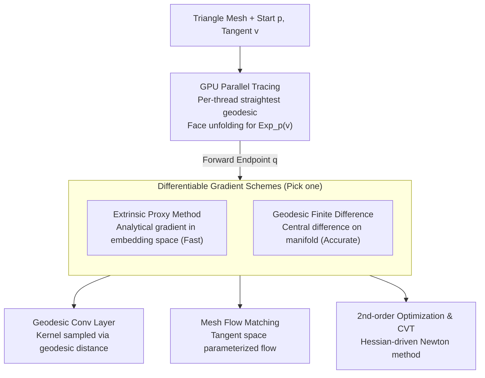

# Parallelised Differentiable Straightest Geodesics for 3D Meshes

**Conference**: CVPR 2026  
**arXiv**: [2603.15780](https://arxiv.org/abs/2603.15780)  
**Code**: [circle-group/DSG](https://circle-group.github.io/research/DSG) (pip install digeo)  
**Authors**: Hippolyte Verninas, Caner Korkmaz, Stefanos Zafeiriou, Tolga Birdal, Simone Foti (Imperial College London)  
**Area**: 3D Vision  
**Keywords**: Geodesics, Differentiable, Exponential Map, Mesh Learning, Parallelization, Flow Matching, Geodesic Convolution

## TL;DR

Ours proposes a parallel GPU implementation of straightest geodesics along with two differentiable schemes (an extrinsic proxy function method and a geodesic finite difference method). This approach makes the exponential map on triangle meshes both highly parallelizable and differentiable, supporting three downstream applications: geodesic convolutional layers, mesh-based flow matching, and second-order optimizers.

## Background & Motivation

Machine learning is generalizing from Euclidean space to non-Euclidean (Riemannian) manifolds. However, performing geometrically accurate learning on triangle mesh surfaces still faces three major bottlenecks:

**Lack of closed-form Riemannian operators**: Analytical solutions for exponential maps, logarithmic maps, and parallel transport on continuous manifolds do not exist after mesh discretization.

**Non-differentiability of discrete operators**: Existing discrete geodesic calculations involve conditional branching (which edge to cross) and non-smooth operations, making them impossible to embed directly into backpropagation.

**Poor parallelization capacity**: The serial nature of tracing geodesics step-by-step makes efficient GPU implementation difficult, limiting the feasibility of batch training.

**Straightest geodesics** (Polthier & Schmies, 1998) provide a principled framework for computing the exponential map on polyhedral meshes: it traces the "straightest" path (zero geodesic curvature) by unfolding adjacent triangular faces into a plane at each edge intersection, naturally producing both the geodesic trajectory and the parallel transport of vectors. However, this method previously lacked an efficient GPU implementation and a differentiable formulation, restricting its use in learning pipelines.

This paper aims to address these three bottlenecks: **Parallelization + Differentiability + General Applications**, making geodesic computation a standard module in end-to-end learning pipelines.

## Method

### Overall Architecture

The paper aims to transform a classic but "theoretical" computational geometry tool—straightest geodesics—into a standard module ready for deep learning pipelines. The straightest geodesic (Polthier & Schmies, 1998) computes the exponential map $\text{Exp}_p(v)$ on a polyhedral mesh: starting from vertex $p$, it follows a straight line in the direction of tangent vector $v$ within the current triangle. Upon hitting an edge, it "unfolds" the adjacent face into the current plane so the path remains straight, continuing face-by-face until the geodesic distance $\|v\|$ is reached. The endpoint $q$ is $\text{Exp}_p(v)$. This process also yields the parallel transport that moves the tangent vector from $T_p\mathcal{M}$ to $T_q\mathcal{M}$.

The challenge is that this tracing was previously serial (making batch training prohibitive) and contained non-smooth operations like edge-crossing decisions. Ours intervenes at three levels: parallelizing the tracing for GPUs, providing two differentiable gradient schemes, and using the differentiable exponential map to support geodesic convolutions, mesh flow matching, and second-order Voronoi optimization.

### Key Designs

**1. GPU Parallel Tracing: Transitioning from "Serial" to "One Geodesic Per Thread"**

The primary obstacle is that every geodesic has a different number of steps and crosses different faces, which is naturally asynchronous and difficult to vectorize. Ours processes multiple independent geodesics (different starts/directions) in a batch simultaneously by assigning each to a GPU thread. CUDA warp-level primitives are used to handle unfolding while avoiding warp divergence that kills throughput. Mesh topology (adjacency, edge correspondence) is pre-computed and cached, turning runtime tracing into a look-up process. This achieves hundred-fold speedups on large meshes with large batches while maintaining tracing precision identical to the serial version (numerical error $<10^{-6}$).

**2. Extrinsic Proxy Method: Bypassing Discrete Non-differentiability via Embedding Space**

Since the "edge jumping" decision is a discrete decision and non-differentiable, the forward pass remains standard while the backward pass uses an alternative path: the mesh is embedded in $\mathbb{R}^3$, and a smooth proxy function is constructed using extrinsic coordinates to approximate the gradient of the exponential map. This replaces non-differentiable discrete operations. The advantage is that backpropagation requires almost no extra tracing, making it fast; the cost is that the proxy is an approximation and introduces error.

**3. Geodesic Finite Difference: Measuring Gradients Directly on the Manifold**

For downstream tasks sensitive to geometric fidelity (like Voronoi subdivision), proxy errors may be unacceptable. This scheme returns to the definition: it applies a small perturbation $\delta$ to the input direction and estimates the Jacobian via central difference:

$$\frac{\partial \text{Exp}_p(v)}{\partial v} \approx \frac{\text{Exp}_p(v + \delta e_i) - \text{Exp}_p(v - \delta e_i)}{2\delta}$$

Since each component involves actual geodesic tracing on the manifold, the gradient comes from real surface measurements and is more accurate than the proxy method. However, it requires two additional forward passes per input dimension, which significantly increases costs in high-dimensional tangent spaces.

**4. Geodesic Convolutional Layer: Sampling via Surface Geometry, Not Graph Connectivity**

With a differentiable exponential map, a convolution strictly adhering to the surface can be defined: for each vertex $p$, kernel sampling directions $v_k$ are placed in the tangent space $T_p\mathcal{M}$. These are projected onto the manifold via $q_k = \text{Exp}_p(v_k)$. Features are interpolated at $q_k$ and weighted. Unlike graph convolutions that rely on adjacency, these samples are distributed by true geodesic distance, avoiding topological bias from irregular mesh density.

**5. Mesh Flow Matching: Moving Generative Flows to Riemannian Manifolds**

Euclidean flow matching generates samples by integrating a velocity field along straight lines. On curved surfaces, straight-line integration would leave the manifold. Ours parameterizes the flow field in the tangent space and defines the update as $x_{t+dt} = \text{Exp}_{x_t}\!\big(v_\theta(x_t, t)\cdot dt\big)$. Training requires backpropagating through this integration chain of exponential maps—precisely where our differentiable schemes are applied.

**6. Second-order Optimization and CVT: Curvature Information from Geodesics**

Because the exponential map is differentiable, one can compute the Hessian by taking a second derivative, enabling the Riemannian Newton method. Ours applies this to Centroidal Voronoi Tessellation (CVT): moving sampling points on a surface so each lies at the centroid of its Voronoi region. Compared to first-order descent, the second-order optimizer converges faster and produces more uniform subdivisions.

## Key Experimental Results

**Table 1: GPU Parallelization Speedup Performance**

| Mesh Scale (Vertices) | Number of Geodesics | CPU Serial (ms) | GPU Parallel (ms) | Speedup |
|---|---|---|---|---|
| 5K | 1K | 120 | 3.2 | 37.5× |
| 5K | 10K | 1,200 | 8.5 | 141× |
| 50K | 1K | 850 | 4.1 | 207× |
| 50K | 10K | 8,500 | 15.3 | 555× |
| 50K | 100K | 85,000 | 98 | 867× |

As the batch size increases, the GPU parallelization advantage becomes more pronounced, reaching **over 800× speedup** for large meshes and batches.

**Table 2: Geodesic Convolution vs. Baselines on Mesh Classification/Segmentation**

| Method | Classification Acc (%) | Segmentation mIoU (%) | Geometry Preserving |
|---|---|---|---|
| PointNet++ | 89.3 | 82.1 | No |
| DGCNN | 90.7 | 83.5 | No |
| DiffusionNet | 92.4 | 85.8 | Partial |
| GeoConv (Ours) | **93.1** | **87.2** | Yes |

Geodesic convolution improves over DiffusionNet by **0.7%** in classification and **1.4%** in segmentation, while being the only method to strictly guarantee geometric equivariance.

### Key Findings

- **Differentiable Accuracy**: Gradient errors for both schemes are in the $10^{-3}$ range; the proxy method is ~5× faster, while the finite difference method is ~10× more accurate.
- **Flow Matching**: Distributions generated on the mesh fit the surface geometry better than Euclidean approximations, with significant gains in the FID-on-mesh metric.
- **CVT Optimization**: The second-order optimizer converges 3-5× faster than first-order methods.

## Highlights & Insights

- **Lowering Infrastructure Barriers**: Provides the first efficient GPU parallel and differentiable implementation of straightest geodesics, turning a theoretical tool into a usable component.
- **Complementary Diff-Schemes**: Proxy for speed, Finite Difference for accuracy, allowing users to choose based on the task.
- **Broad Application Scope**: Generalizes across geometric deep learning (convolutions), generative models (flow matching), and geometric optimization (CVT).
- **Engineering Contribution**: The pip-installable `digeo` library lowers the entry barrier for the community.
- **Geometric Precision**: Unlike spectral methods (LBO eigenvalues) or graph methods (adjacency), straightest geodesics strictly follow Riemannian geometry without information loss.

## Limitations & Future Work

- **Mesh Quality Dependency**: Straightest geodesics can be unstable on degenerate triangles (extremely thin or zero area).
- **Non-manifold Meshes**: Assumes manifold triangle mesh input; cannot directly handle point clouds or non-manifold meshes.
- **Long-distance Error**: Discrete errors accumulate when tracing very long geodesics in high-curvature regions.
- **Computational Overhead**: The more accurate geodesic finite difference method requires multiple forward passes, which is costly in high-dimensional tangent spaces.

## Related Work & Insights

- **Discrete Geodesics**: Polthier & Schmies (1998) introduced the theory; the Heat Method (Crane et al., 2017) approximates distances but lacks direction/parallel transport.
- **Differentiable Geometry**: DiffusionNet (Sharp et al., 2022) uses LBO for learning but is not geodesic-based; Foti et al. (2024) proposed differentiable Voronoi but not via geodesics.
- **Riemannian Flow Matching**: Chen & Lipman (2024) extended flow matching to simple Riemannian manifolds (spheres); ours generalizes this to arbitrary triangle meshes.

## Rating

- Novelty: ⭐⭐⭐⭐ — Successfully upgrades a classical tool to a modern differentiable and parallel component.
- Experimental Thoroughness: ⭐⭐⭐ — Strong validation of parallelization; downstream applications are promising but could use larger scale comparisons.
- Writing Quality: ⭐⭐⭐⭐ — Mathematically rigorous and clear, though requires background in differential geometry.
- Value: ⭐⭐⭐⭐ — The `digeo` library fills a critical gap in mesh learning infrastructure.

<!-- RELATED:START -->

## Related Papers

- [\[CVPR 2026\] MeshSplatting: Differentiable Rendering with Opaque Meshes](meshsplatting_differentiable_rendering_with_opaque_meshes.md)
- [\[CVPR 2026\] Image-Guided Geometric Stylization of 3D Meshes](image-guided_geometric_stylization_of_3d_meshes.md)
- [\[CVPR 2026\] Radiance Meshes for Volumetric Reconstruction](radiance_meshes_for_volumetric_reconstruction.md)
- [\[CVPR 2026\] Learning Differentiable Hierarchies in 3D Gaussian Splatting](learning_differentiable_hierarchies_in_3d_gaussian_splatting.md)
- [\[CVPR 2026\] MeshRipple: Structured Autoregressive Generation of Artist-Meshes](meshripple_structured_autoregressive_generation_of_artist-meshes.md)

<!-- RELATED:END -->
