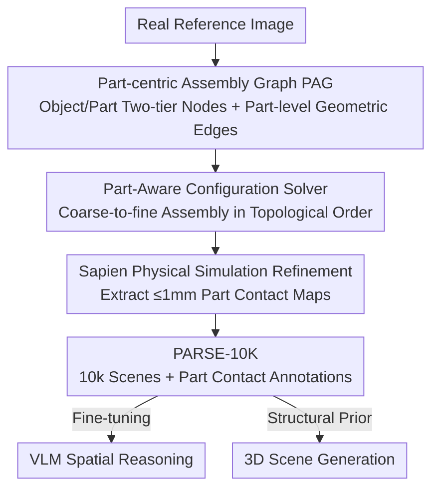

# PARSE: Part-Aware Relational Spatial Modeling

**Conference**: CVPR 2026  
**Paper**: [CVF Open Access](https://openaccess.thecvf.com/content/CVPR2026/html/Bai_PARSE_Part-Aware_Relational_Spatial_Modeling_CVPR_2026_paper.html)  
**Code**: None  
**Area**: 3D Vision  
**Keywords**: Part-level Scene Graph, 3D Indoor Scene Generation, Physically Plausible Layout, Spatial Reasoning, Dataset

## TL;DR
PARSE shifts object relations from coarse semantic prepositions/object-level scene graphs down to **part-level geometric constraints**. It describes a scene using a "Part-centric Assembly Graph (PAG)" and instantiates the graph into collision-free, physically plausible 3D indoor scenes via a coarse-to-fine solver. Based on this, a large-scale dataset, PARSE-10K, with part-level contact annotations is constructed, significantly boosting VLM spatial reasoning and controllable 3D scene generation.

## Background & Motivation
**Background**: To enable machines to "understand" or "generate" an indoor scene, the key lies not in what individual objects look like, but in **how they relate to each other**—which supports which, which is placed inside which, and which leans against which. Two main types of tools are used to represent these relations: verbal prepositions (on/in/against) and object-level scene graphs, both of which treat objects as indivisible units.

**Limitations of Prior Work**: This "object-level" granularity is too coarse to specify **which exact regions are in contact**. "A book on the table"—does its spine or its cover touch the tabletop? "A guitar leaning against the bookcase"—is it the headstock or the body? Verbal prepositions are inherently underdetermined, and object-level scene graphs similarly fail to designate specific contact points and support surfaces. Consequently, this leads to layout ambiguity and physical inconsistency. Solvers are forced to search blindly within giant feasible solution spaces, often producing scenes with interpenetration, floating objects, or unstable poses.

**Key Challenge**: A deep chasm exists between the semantic description of relations (prepositions/object-level edges) and the geometric configuration of the scene (the precise pose of each object). The former is too abstract to be directly translated into geometric constraints, missing an intermediate representation that can instantiate "leaning against" into "which surface touches which surface."

**Goal**: (1) Design a scene representation capable of precisely expressing part-level geometric relations; (2) achieve efficient, collision-free, and physically stable 3D scene generation given this representation; (3) mass-produce data with fine-grained contact annotations to power downstream VLM spatial reasoning and 3D generation tasks.

**Key Insight**: The authors observe that part-level relations act as a bridge between high-level language and low-level geometry—chairs stand on the floor with their **legs**, cups sit on tables with their **bottoms**, and brooms lean against walls with their **tips**. By anchoring relations to specific surfaces of specific parts, ambiguous prepositions are transformed into deterministic geometric constraints, drastically pruning the search space of feasible solutions.

**Core Idea**: Replace object-level relations with **part-level geometric edges**, encoding each relation as "surface of part of object A $\leftrightarrow$ surface of part of object B," and incrementally assemble this graph into a scene using a constraint solver.

## Method

### Overall Architecture
PARSE consists of two components: a **representation**—the Part-centric Assembly Graph (PAG), which represents the scene as a directed acyclic graph (DAG) where nodes represent objects/parts and edges represent relations; and a **solver**—the Part-Aware Spatial Configuration Solver, which instantiates the abstract PAG into concrete 3D poses object-by-object according to the topological order of the DAG. This pipeline serves as an "engine" to mass-produce 10,000 indoor scenes, forming the PARSE-10K dataset. These data with part-level contact annotations are then applied to two downstream tasks: fine-tuning Qwen3-VL for spatial reasoning and injecting PAG as a structural prior into a diffusion-based 3D scene generation network.

The overall data flow is a clear multi-stage sequential pipeline: Real image $\to$ Extract PAG $\to$ Solver-based step-by-step object assembly $\to$ Physical simulation refinement $\to$ 3D scene with contact maps $\to$ Downstream tasks.

### Key Designs

**1. Part-centric Assembly Graph PAG: Describing a Scene as a DAG of "Which Surface Touches Which Surface"**

This is the representation core of the paper, specifically addressing the ambiguity of object-level relations regarding contact locations. The nodes of PAG have a **two-tier structure**: the upper level consists of object nodes $V_O$, where each node only stores a "semantic query" (a category or a set of candidate categories) without binding to a specific 3D instance—postponing the model selection to the synthesis stage to maximize combinatorial diversity; the lower level comprises part nodes $V_P$, where each object node is the parent of its various geometric parts (e.g., "chair" connects to "legs/seat/backrest"). Each part is further characterized by a set of **labeled surfaces** (top/bottom/front/back/left/right, defined relative to the canonical pose), which serve as the geometric interfaces for alignment and contact.

Edges $E$ come in two granularities: **object-level spatial edges** $E_{obj}$ encode coarse macro layouts like "left of", "behind", or "near", acting as optional high-level constraints; **part-level geometric edges** $E_{part}$ form the core expressiveness of PAG. Each edge carries a spatial preposition (on/in/against/aligned with) and connects target **part nodes** belonging to different objects. For example, "a book falling forward on the table" is defined as an "on" edge connecting the "cover" part (front surface) of the book to the "tabletop" part (top surface) of the table. This part-surface anchoring transforms underdetermined prepositions into computable geometric constraints.

**2. Hierarchical Assembly Structure (DAG + Unique Supporter): Decomposing Full-Scene Constraints into Solvable Sub-problems**

A static 3D scene is a dense, interdependent collection of geometric relations; treating it directly as a massive constraint satisfaction problem leads to exponential search spaces. PARSE adopts an "assembly perspective"—viewing a stable scene as the result of a **sequential construction** and imposing two structural constraints: (a) The entire PAG must be a **Directed Acyclic Graph (DAG)**, which is the mathematically necessary structure for a sequential process without circular dependencies, ensuring physical feasibility (the existence of a valid assembly sequence); (b) Each object has a **unique physical supporter**, a rule that naturally organizes the scene into a clear hierarchical tree. Together, these constraints decompose the full-scene constraint satisfaction into a sequence of **local sub-problems**—one for each object in the assembly order—rendering the otherwise intractable full-scene problem highly computable.

**3. Coarse-to-fine Part-Aware Configuration Solver: Incrementally Shrinking the Feasible Pose Space with Near-Zero Blind Sampling Rejection**

Given a PAG, the solver instantiates objects sequentially in topological order (the assembly order induced by support relations). For each object, it performs a "coarse-to-fine progressive refinement," narrowing the feasible pose space in three steps:

- **Coarse Localization**: Since each object has a unique supporter, solving begins with a 2D candidate region on the support surface. It first excludes occupied areas and then applies object-level spatial edges—e.g., "left of" constrains the feasible translation range using a plane, shrinking the feasible zone into a smaller subspace.
- **Part-level Alignment**: A concrete 3D asset from the asset library, complete with part segmentation and labels, is instantiated based on the node's semantic query. The solver then solves part-level geometric constraints. If surface labels are explicitly provided by the edges, they are used directly; otherwise, the solver performs **geometric reasoning**—for instance, for an "on" relation, it dynamically identifies the lowest bottom surface of the supported part and searches for an upward-facing support plane on the target part, constructing new constraints (typically aligning the two surfaces to be parallel and in contact). Each new constraint is solved jointly with existing ones, further contracting the pose space to the minimum feasible subspace.
- **Final Pose Sampling and Validation**: A pose is randomly sampled from this narrowed subspace and verified for 3D collisions and physical-semantic plausibility (e.g., verifying wrapping depth via multi-directional ray casting for "in" relations). Because the entire solving process is a **deterministic accumulation of constraints**, any pose sampled from the final subspace priorly satisfies all non-collision geometric and spatial relations. This ensures a high success rate in the verification step, steering clear of costly "blind sampling-rejection" loops. Finally, the entire scene undergoes a brief dynamic simulation refinement in Sapien, and part-level contact maps are extracted by identifying adjacent part pairs within $\le 1$ mm in the stable configuration.

### A Complete Example
Let's walk through the assembly of "a book fallen on a table" as an example: In the PAG, the table is assembled first (positioned earlier in the topological order as the supporter), and the solver determines its pose within the floor candidate region. When it is the book's turn, object-level edges coarsely localize the book's feasible region to a sub-area above the tabletop. Moving to part-level alignment, the solver instantiates a specific book model with part segmentations. Recognizing an "on" edge connecting "book's cover (front) $\to$ tabletop (top)", it constructs a constraint to make these two surfaces parallel and touching. This shrinks the book's pose space to a nearly unique configuration. Finally, a pose is sampled from this subspace, verified to be collision-free via multi-directional checks, refined through physical simulation to reach stability, and the contact pairs within $\le 1$ mm between the book cover and tabletop are logged into the contact map. Throughout the process, the feasible solution space is pruned from "a wide area above the table" down to "a narrow subset touching the tabletop with the cover facing down," eliminating the need for repeated blind trials.

## Key Experimental Results

### Dataset Comparison (PARSE-10K vs Existing Indoor Scene Datasets)

| Dataset | # Scenes | Avg. Objects/Scene | Layout Generation | Physics Optimization | Part Annotations | Part Contact Annotations |
|--------|-------|--------------|--------------|---------|---------|-------------|
| 3D-FRONT | 18,968 | 6.9 | Manual Design | ✗ | ✗ | ✗ |
| FurniScene | 111,698 | 14.4 | Manual Design | ✗ | ✗ | ✗ |
| METASCENES | 706 | - | Real Scan | ✓ | ✗ | ✗ |
| **PARSE-10K (Ours)** | 10,000 | **49.9** | Real-image Guided | ✓ | **✓** | **✓** |

PARSE-10K leverages 17,372 part-segmented assets spanning 132 categories, covering 17 room types. It is the only dataset that simultaneously provides **physics optimization + part annotations + part contact annotations**, with the average number of objects per scene (49.9) far exceeding others.

### VLM Spatial Reasoning (Fine-tuning Qwen3-VL on PARSE-10K)

Three tasks: Visual Relation MCQ, Part-level Contact MCQ, and Scene Graph Generation (SGG).

| Model | Visual Relation ↑ | Part Contact ↑ | SGG-F1 (With/Without BBox Match) |
|------|----------|----------|------------------------|
| GPT-5 | 82.1 | 75.2 | 13.8 / 41.1 |
| Gemini-2.5-Pro | 85.0 | 75.6 | 44.2 / 47.3 |
| Claude-Opus-4 | 80.3 | 73.2 | 9.8 / 41.4 |
| Qwen3-VL (Base) | 86.2 | 60.4 | 33.2 / 37.9 |
| **Ours (Fine-tuned)** | **97.4** | **86.2** | **76.6 / 78.2** |

After fine-tuning, the model leads across all three tasks: 97.4% on Visual Relation MCQ, 86.2% on Part Contact MCQ, and SGG F1 (with bbox match) leaps from 33.2 to 76.6. The comparison between "with/without bbox match" metrics demonstrates that general large models like GPT-5 and Claude have **strong relational reasoning but weak visual localization**, causing their performance to plummet when bounding box matching is required. Contrarily, the gains in this work stem from both precise localization and stronger relation understanding (as shown by the leading grounding-agnostic score).

### 3D Scene Generation (User Study, 20 Voters)

| Method | Complexity ↑ | Realism ↑ | Contact Fidelity ↑ |
|------|--------|--------|------------|
| InstructScene (Trained on 3D-FRONT) | 7.5% | 33.8% | 28.8% |
| Ours (No PAG Conditioning) | 45.0% | 27.5% | 26.3% |
| **Ours (With PAG Conditioning)** | **47.5%** | **38.8%** | **45.0%** |

The generation network is a graph Transformer diffusion model inspired by InstructScene: Michelangelo encodes the geometry of each mesh, CLIP encodes the PAG into a relational embedding matrix, and the scene graph control is injected into attention layers via FiLM. The results indicate that training on PARSE-10K alone allows the generation of scenes with more objects and richer contacts. However, **without PAG conditioning**, the learned distribution often exhibits physically implausible configurations due to the high complexity and dense contact of the data, resulting in lower user preference. **With PAG conditioning**, performance across complexity, realism, and contact fidelity wins comprehensively.

### Key Findings
- PAG conditioning is the decisive factor for 3D generation quality: the unconditional version achieves only 26.3% contact fidelity, which jumps to 45.0% when conditioned on PAG—demonstrating that part-level relations, acting as structural prior, successfully infuse generation networks with physical plausibility.
- The bottleneck for general VLMs lies in visual localization rather than relational reasoning: there is a huge performance gap before and after bbox matching (e.g., Claude 9.8 $\to$ 41.4). PARSE-10K's dense part-level supervision bridges both localization and relational understanding gaps.
- The "deterministic constraint accumulation" design of the solver yields near-instant success for final pose sampling, avoiding the inefficiency of traditional procedural systems that repeatedly reject samples in vast solution spaces.

## Highlights & Insights
- **Shifting relations down to "part-surface" level is the true insight**: An ordinary observation—chairs stand on feet, cups sit on bottoms, brooms lean on tips—directly translates underdetermined prepositions into deterministic geometric constraints. This forms a crucial layer connecting language and geometry, generalizable to any task requiring precise contact (e.g., grasping, stacking, packing).
- **DAG + Unique Supporter = Decomposing an NP-hard full-scene constraint satisfaction into linear sub-problem sequences**: This structural constraint guarantees physical feasibility while containing solver complexity, serving as an elegant design that trades representation structure for solving efficiency.
- **Coarse-to-fine + Deterministic Constraint Accumulation**: The feasible pose space is progressively pruned to a minimal subset, ensuring arbitrarily sampled poses satisfy constraints *a priori*. This fundamentally eliminates blind sampling-rejection, offering more controllable precision than LLM-in-the-loop constraint programming regimes.
- **Data Closed-Loop**: Combining the representation (PAG) and the solver as a generative engine to build a dataset (PARSE-10K), which in turn feeds back into both VLMs and generation networks, forms a self-contained "representation $\to$ data $\to$ downstream" pipeline.

## Limitations & Future Work
- **Semi-manual PAG Construction**: Defining relations is complex, requires part-level spatial reasoning, and is highly sensitive to canonical poses. Currently, the assembly of the graph cannot be fully automated.
- **Procedural/Rule-based Solver**: The solver relies heavily on the quality of part segmentation and surface labeling in the asset library, making it difficult to process assets without clean part annotations.
- **Generative Paradigm**: The generation network remains an adaptation of the InstructScene architecture rather than exploring a more native part-level generation paradigm. Without PAG conditioning, the physical plausibility drops significantly, indicating that the model has not inherently mastered part-level constraints.
- **Future Directions**: Directly learning part-to-part relations from geometry, developing more flexible contact representations, expanding the diversity of PARSE-10K, and integrating PARSE into embodied AI tasks for part-level planning and physical manipulation.

## Related Work & Insights
- **vs. Object-level Scene Graphs (Scene Graph / 3D Scene Graph)**: Previous works treat objects as indivisible units, suitable for captioning/VQA/retrieval but incapable of resolving part-level contact and support. PARSE explicitly models contact, support, and attachment using part-to-part edges, establishing finer granularity and stronger physical consistency.
- **vs. Procedural Generation (ProcTHOR / Infinigen)**: ProcTHOR uses rigid placement rules and can only control coarse factors like room layouts. Infinigen uses human-readable rules to enhance controllability but remains **object-centric**, failing to capture part-level interactions and suffering from inefficient searches in large solution spaces. PARSE's PAG solver encodes explicit part-to-part constraints, yielding more aggressive pruning, superior geometric fidelity, and better physical consistency.
- **vs. LLM-mediated Layouts (Using LLMs to map language to placement/constraint programs)**: LLM mediators introduce semantic ambiguities and compromise geometric constraint precision. PARSE directly defines deterministic constraints at the part-surface level, bypassing language ambiguities.
- **vs. InstructScene (3D Generation Baseline)**: Both employ graph Transformer diffusion, but PARSE uses PAG as a structural prior combined with dense part-level supervision from PARSE-10K, leading to superior object density, contact richness, and physical plausibility in the generated scenes.

## Rating
- Novelty: ⭐⭐⭐⭐⭐ Lowering relation representation from object-level to part-surface level, combined with DAG assembly and deterministic constraint solving, presents a highly logical and fresh approach.
- Experimental Thoroughness: ⭐⭐⭐⭐ The dataset comparison, three VLM tasks, and 3D generation user study provide comprehensive evidence. However, the generation task lacks more objective physical/collision quantitative metrics beyond the user study.
- Writing Quality: ⭐⭐⭐⭐⭐ The logical flow from Motivation $\to$ Representation $\to$ Solver $\to$ Data $\to$ Downstream is progressive and clear. PAG and the solver are described with concrete, reproducible detail.
- Value: ⭐⭐⭐⭐⭐ Simultaneously delivering a new representation, a new solver, and a large-scale dataset with part-level contact annotations offers direct utility to both spatial reasoning and controllable 3D generation.

<!-- RELATED:START -->

## Related Papers

- [\[CVPR 2026\] Part$^{2}$GS: Part-aware Modeling of Articulated Objects using 3D Gaussian Splatting](part2gs_part-aware_modeling_of_articulated_objects_using_3d_gaussian_splatting.md)
- [\[CVPR 2026\] Context-Nav: Context-Driven Exploration and Viewpoint-Aware 3D Spatial Reasoning for Instance Navigation](context-nav_context-driven_exploration_and_viewpoint-aware_3d_spatial_reasoning_.md)
- [\[CVPR 2026\] Learning Hierarchical Hyperbolic Mixture Model for Part-aware 3D Generation](learning_hierarchical_hyperbolic_mixture_model_for_part-aware_3d_generation.md)
- [\[CVPR 2026\] Fresco: Frequency-Spatial Consistent Optimization for Fine-Grained Head Avatar Modeling](fresco_frequency-spatial_consistent_optimization_for_fine-grained_head_avatar_mo.md)
- [\[CVPR 2026\] ReLaGS: Relational Language Gaussian Splatting](relags_relational_language_gaussian_splatting.md)

<!-- RELATED:END -->
