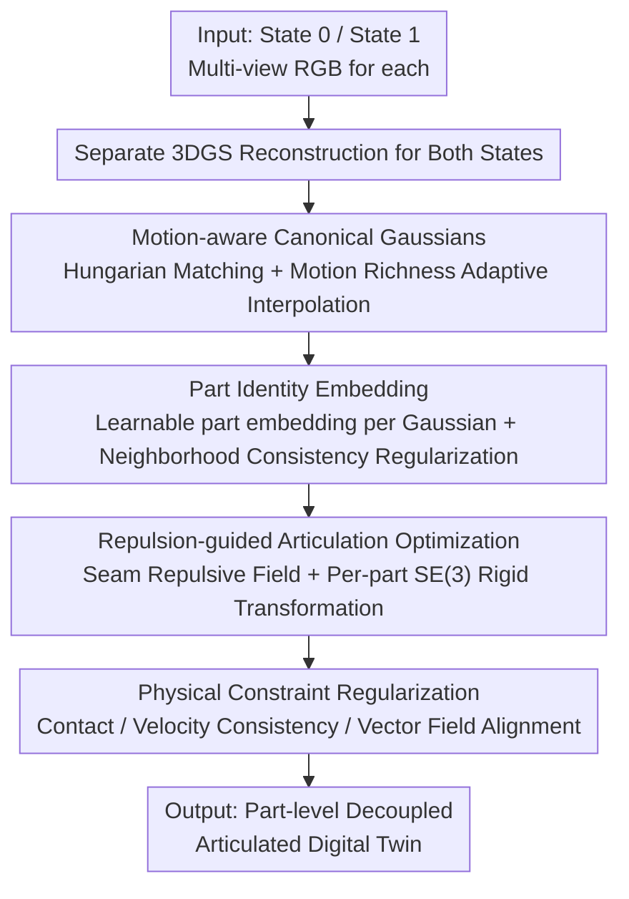

# Part$^{2}$GS: Part-aware Modeling of Articulated Objects using 3D Gaussian Splatting

**Conference**: CVPR 2026  
**Paper**: [CVF Open Access](https://openaccess.thecvf.com/content/CVPR2026/html/Yu_Part2GS_Part-aware_Modeling_of_Articulated_Objects_using_3D_Gaussian_Splatting_CVPR_2026_paper.html)  
**Code**: https://plan-lab.github.io/part2gs (Project Page)  
**Area**: 3D Vision  
**Keywords**: 3D Gaussian Splatting, Articulated Objects, Digital Twins, Part Decomposition, Physical Constraints  

## TL;DR
Part$^{2}$GS assigns a learnable "part identity embedding" to each 3D Gaussian. Combined with motion-aware canonicalization, repulsive points, and physical constraints, it simultaneously reconstructs high-fidelity geometry and physically consistent motion of articulated objects from multi-view images. It reduces Chamfer Distance by up to 10× for movable parts compared to Prev. SOTA.

## Background & Motivation
**Background**: Articulated objects (such as drawers, cabinets, and scissors with movable parts) are ubiquitous in interaction and manipulation tasks. However, high-quality articulated 3D assets are mostly created via manual modeling. Recent approaches have shifted toward using 3D Gaussian Splatting (3DGS) or NeRF to reconstruct articulated objects from real multi-view observations, modeling how an object moves between two articulated states.

**Limitations of Prior Work**: Existing methods fundamentally treat articulated motion as a **pure geometric interpolation** problem—performing state-to-state correspondence or clustering between two states without considering physical feasibility or semantic part understanding. Consequently, reconstructions often exhibit floating fragments, joint interpenetration, and non-physical motion artifacts, which are particularly evident in complex multi-part objects.

**Key Challenge**: The root of the problem lies in the disconnect between "geometric interpolation" and "rigid-body physical consistency." Existing methods either rely on unsupervised clustering for part segmentation (yielding blurry boundaries and collapse) or depend on external structural priors such as pre-defined part libraries, kinematic graphs, or category templates. Furthermore, they rigidly interpolate between two fixed states without recognizing which state contains "richer motion information."

**Goal**: To **simultaneously** recover differentiable part discovery, high-fidelity geometry, and physically consistent articulated motion from raw multi-view observations within a unified 3DGS framework, without relying on any external part templates.

**Key Insight**: Ours observes that if "part attribution" is implemented as a learnable attribute of each Gaussian, the part structure can **spontaneously emerge** from geometry, motion, and physical constraints, thereby bypassing clustering and template priors. Subsequently, repulsive forces and physical losses can pull the motion back into the physically feasible domain.

**Core Idea**: Add a part identity embedding to each Gaussian + a motion-aware canonical space + repulsive points + physical regularization, allowing part decomposition and articulated motion to be learned jointly from data rather than via post-processing clustering.

## Method

### Overall Architecture
The input to Part$^{2}$GS consists of multi-view RGB images of the same articulated object in two different articulated states $t\in\{0,1\}$. The output is a **part-level decoupled, physically consistent** articulated digital twin: the object is modeled as a static base $G_{\text{static}}$ plus a set of Gaussians for $K$ movable parts $\{G_k\}$. The pipeline consists of four steps: first, aligning and fusing two single-state reconstructions into a "motion-aware canonical Gaussian field" as a common coordinate system; second, learning a part identity embedding for each Gaussian to achieve unsupervised part segmentation; third, applying local repulsive forces along part seams via "repulsive points" to optimize the SE(3) rigid motion of each movable part to avoid interpenetration; finally, superimposing three physical constraints (contact, velocity, and vector field) to ensure motion conforms to rigid-body dynamics.

### Key Designs

**1. Motion-aware Canonical Gaussians: Biasing the Canonical Space Toward the "High-Motion" State**

Directly modeling correspondences between two states is hindered by occlusion and view inconsistency, making it difficult to maintain rigid geometry while learning articulated deformation. Part$^{2}$GS avoids hard-coded correspondences by first aligning and fusing two single-state reconstructions into a common canonical Gaussian field. Specifically, Hungarian matching is used to establish correspondences between $G^0_{\text{single}}$ and $G^1_{\text{single}}$ based on pairwise distances of Gaussian centers. For each pair, instead of simple averaging, a weighted interpolation based on "motion richness" is used. For each state, a motion richness score $D_{t\to\bar t}=\mathbb{E}_i[\min_j \|\mu_i^{(t)}-\mu_j^{(1-t)}\|_2]$ is estimated, representing the average minimum distance from each Gaussian in one state to its nearest neighbor in the other. A larger value indicates more significant part displacement and richer motion information. The canonical Gaussian center is defined as $\mu^c_i=\lambda\mu^0_i+(1-\lambda)\mu^1_i$, where $\lambda=\frac{D_{0\to1}}{D_{0\to1}+D_{1\to0}}$. This initialization encodes motion information into the canonical space, providing a clean starting point for subsequent part decomposition.

**2. Part Identity Embeddings: Emergent Parts via Gaussian Attributes instead of Heuristic Clustering**

Standard 3DGS possesses only geometry without part semantics. Ours adds a compact learnable part identity embedding $\rho_i$ to each Gaussian to encode potential part attribution and geometric affinity. To ensure consistent part labels for adjacent Gaussians on the same surface, a neighborhood consistency regularization is added: $\rho_i$ is projected via a shared linear layer $f$ to $K$ part categories followed by a softmax to obtain the distribution $F(G_i)$. Then, KL divergence is used to pull each Gaussian's distribution toward the mean of its $k$-nearest neighbors in 3D space: $L_{\text{part}}=\frac{1}{M}\sum_i D_{\mathrm{KL}}\big(F(G_i)\,\|\,\frac{1}{|N(G_i)|}\sum_{j\in N(G_i)}F(G_j)\big)$. Compared to heuristic clustering in ArtGS, part boundaries here are soft assignments **jointly optimized** with physical constraints, resulting in cleaner boundaries and minimal part drift.

**3. Repulsion-guided Articulation Optimization: Local Repulsion at Seams to Prevent Interpenetration**

Movable parts are prone to interpenetrating the static base or adjacent parts during relative motion. Ours places a set of repulsive points $R=\{r_j\}$ in the initial adjacent regions between static and movable parts. Each repulsive point generates a local repulsive field $F^k_{\text{repel},i}=\sum_{r_j\in R}\frac{k_r\,(r_j-\mu^k_i)}{\|r_j-\mu^k_i\|^3}$ (similar to Coulomb's force, decaying with the cube of the distance). Each movable part is modeled by an SE(3) rigid transformation $T_k=(R_k,t_k)$, iteratively refined from random initialization: at step $t$, the Gaussian position is first calculated by the current transformation $\mu^{k,(t)}_i=R^{(t)}_k\mu^{k,0}_i+t^{(t)}_k$, then updated with the repulsive correction $\mu^{k,(t)}_i\leftarrow\mu^{k,(t)}_i+F^k_{\text{repel},i}$. The articulation loss $L_{\text{art}}$ constrains both position alignment and rotational consistency (including the $\lambda_{\text{rot}}\,\text{Angle}(R^{(t)}_k,\hat R_k)$ term), optimizing motion trajectories to fit observations without interpenetration.

**4. Physical Constraint Regularization: Pinning Motion to the Rigid-body Feasible Domain**

To ensure physical plausibility, three auxiliary losses are superimposed. **Contact Loss** $L_{\text{contact}}=\frac{1}{|G_k|}\sum_i\max(0,-\cos\theta_i)$ penalizes interpenetration: for each movable part Gaussian, let $d_i$ be the vector pointing to the nearest static Gaussian and $d_k$ be the vector pointing to the centroid of the static base. If the angle between these vectors becomes obtuse ($\cos\theta_i<0$, implying the part has moved inside the base), a penalty is applied. **Velocity Consistency Loss** $L_{\text{velocity}}=\sum_k \mathrm{Var}(\{\Delta\mu_i\mid i\in G_k\})$ uses the intra-part variance of per-Gaussian displacement $\Delta\mu_i=\mu^1_i-\mu^0_i$ to force consistent motion of the same rigid part. **Vector Field Alignment Loss** $L_{\text{vector}}=\sum_k\sum_{i\in G_k}\|R_k\mu^0_i+t_k-\mu^1_i\|^2$ treats part transformations as SE(3) vector fields acting on canonical Gaussians, requiring predicted transformations to match observed motion. The final physical loss is $L_{\text{phys}}=L_{\text{contact}}+L_{\text{velocity}}+L_{\text{vector}}$.

### Loss & Training
The total loss integrates rendering fidelity, part regularization, articulation learning, and physical consistency: $L_{\text{Part2GS}}=L_{\text{render}}+\lambda_{\text{part}}L_{\text{part}}+\lambda_{\text{art}}L_{\text{art}}+\lambda_{\text{phys}}L_{\text{phys}}$, where $L_{\text{render}}$ is the standard 3DGS $\ell_1$ + D-SSIM rendering loss. The coefficients $\lambda_{\text{part}}, \lambda_{\text{art}}, \lambda_{\text{phys}}$ are weighting hyperparameters.

## Key Experimental Results

### Main Results
Ours is compared against Ditto, PARIS, ArtGS, and DTA on three datasets: PARIS (10 single-part synthetic objects), ARTGS-MULTI (5 objects with 3–6 parts), and DTA-MULTI (2 objects with 2 parts). Geometry is evaluated via Chamfer Distance (overall CD$_{\text{whole}}$ / static CD$_{\text{static}}$ / movable part CD$_{\text{movable}}$), and articulation accuracy is evaluated via joint axis angle error (Ang Err), joint position error (Pos Err), and part motion error (Motion Err).

| Dataset | Metric (Selected) | Ditto | PARIS | DTA | ArtGS | Part$^{2}$GS |
| :--- | :--- | :--- | :--- | :--- | :--- | :--- |
| PARIS·Real-Fridge | Ang Err ↓ | 1.71 | 9.92 | 2.08 | 2.09 | **0.03** |
| PARIS·Real-Storage | Ang Err ↓ | 5.88 | 77.83 | 13.64 | 3.47 | **1.24** |
| PARIS·Real-Storage | CD$_{\text{movable}}$ ↓ | 20.35 | 528.83 | 30.78 | 6.28 | **5.01** |
| DTA-MULTI·Storage (7 parts) | CD$_{\text{movable}}$ ↓ | — | — | 476.91 | 3.70 | **1.83** |
| ARTGS·Table (5 parts) | CD$_{\text{movable}}$ ↓ | — | — | 230.38 | 3.09 | **1.85** |

On PARIS, the average angle error for almost all synthetic objects is below $0.01^\circ$, two orders of magnitude lower than Ditto/PARIS. On multi-part DTA-MULTI/ARTGS-MULTI, the most challenging metric, CD$_{\text{movable}}$, is reduced by up to 10× compared to DTA and approximately 3× compared to ArtGS. A t-test (n=3) shows that among 111 "object × metric" pairs, 83 pairs are significantly better than ArtGS (p < 0.05).

### Ablation Study
Cumulative ablation of the three components on the most complex objects:

| Configuration | Ang Err ↓ | Motion Err ↓ | CD$_{\text{movable}}$ ↓ | Note (Table 5 parts) |
| :--- | :--- | :--- | :--- | :--- |
| Vanilla | 17.32 | 27.64 | 132.21 | Baseline 3DGS, nearly unusable |
| + Part Parameters | 0.28 | 2.35 | 28.35 | Err ↓ >90%, CD ↓ ~4.6× |
| + Repulsive Points | 0.05 | 0.18 | 4.47 | Motion Err ↓ ~92%, CD ↓ ~84% |
| + Physical Constraints (Full) | **0.03** | **0.01** | **1.85** | Motion Err ↓ ~94% |

### Key Findings
- **Part identity embeddings contribute most**: Adding part parameters alone reduces angle/motion error by over 90%. CD$_{\text{movable}}$ on the 7-part Storage drops from 497.17 to 15.68 (~32×). This indicates that accurate part segmentation is the foundation for geometric and articulation precision.
- **Repulsive points effectively handle interpenetration**: Motion error and CD$_{\text{movable}}$ drop significantly again with repulsive points, confirming that local repulsive fields effectively prevent parts from interpenetrating.
- **Physical constraints provide final regularization**: They further suppress motion error to 0.01 and continue to improve geometry, ensuring rigid-body consistency across states.

## Highlights & Insights
- **Parts as Gaussian attributes**: Allowing part decomposition to emerge spontaneously from geometry, motion, and physics bypasses heuristic clustering and templates. This is the fundamental difference from ArtGS and the root of cleaner boundaries.
- **Motion-aware adaptive interpolation**: Measuring "average distance to the nearest neighbor" to weight canonical initialization is a simple yet effective technique that directly improves part decoupling.
- **Coulomb-style repulsive points**: Turning "interpenetration prevention" from a soft constraint into a differentiable local force field is an idea transferable to any dynamic 3DGS/4D reconstruction task requiring part isolation.
- **Lightweight physical template**: The three physical losses are lightweight but collectively pull geometric interpolation back into the rigid-body feasible domain, providing a reusable template for "physics-aware reconstruction."

## Limitations & Future Work
- The method requires multi-view images for **two distinct articulated states** of the same object, and each state requires its own single-state reconstruction—high acquisition requirements make it difficult to learn directly from a single state or video clip.
- Parameters such as the number of parts $K$ and the number of repulsive points $N_R$ are preset hyperparameters. The paper does not fully discuss robustness when $K$ is set incorrectly (over- or under-segmentation), and the sensitivity of the repulsion coefficient $k_r$ is not detailed in the main text.
- Evaluation is primarily on synthetic datasets with few real-world objects. Generalization to large-scale, complex-textured, or flexible-part scenarios remains to be verified.
- **Future Work**: Relaxing requirements to any number of states or continuous video; making the number of parts adaptive; introducing physical simulators for collision detection as stronger physical supervision.

## Related Work & Insights
- **vs ArtGS**: ArtGS relies on heuristic Gaussian clustering. Ours uses learnable part embeddings + physical constraints for joint optimization, ensuring part boundaries "emerge" rather than being "post-clustered," leading to a 3–10× reduction in CD$_{\text{movable}}$.
- **vs PARIS / DTA**: These methods rely heavily on fixed geometric interpolation between states. Ours uses motion-aware canonicalization to adaptively bias toward motion-rich states, achieving articulation accuracy two orders of magnitude higher.
- **vs Ditto / Supervised Methods**: Ditto depends on pre-defined part libraries or templates. Ours requires no external structural priors and recovers decomposition from raw observations.
- **vs Dynamic/4D Gaussians**: Those methods target continuous non-rigid deformation (avatars, scene flow). Ours explicitly binds motion to automatically discovered part structures for part-level rigid articulated motion.

## Rating
- Novelty: ⭐⭐⭐⭐ Treats parts as Gaussian attributes + motion-aware canonicalization + repulsive points; the combination is novel and motivated, though components are clever adaptations of existing ideas.
- Experimental Thoroughness: ⭐⭐⭐⭐ Tested on three datasets with cumulative ablation and t-tests; real-world samples are limited, and hyperparameter sensitivity analysis is lacking.
- Writing Quality: ⭐⭐⭐⭐ The three major challenges are clearly identified, and formulas relate well to diagrams.
- Value: ⭐⭐⭐⭐ Articulated digital twins are highly practical for embodied AI/robotics; physics-aware losses and repulsive points are highly reusable.

<!-- RELATED:START -->

## Related Papers

- [\[ICLR 2026\] PD²GS: Part-Level Decoupling and Continuous Deformation of Articulated Objects via Gaussian Splatting](../../ICLR2026/3d_vision/pd2gs_part-level_decoupling_and_continuous_deformation_of_articulated_objects_vi.md)
- [\[CVPR 2026\] Clay-to-Stone: Phase-wise 3D Gaussian Splatting for Monocular Articulated Hand-Object Manipulation Modeling](clay-to-stone_phase-wise_3d_gaussian_splatting_for_monocular_articulated_hand-ob.md)
- [\[CVPR 2026\] SPARK: Sim-ready Part-level Articulated Reconstruction with VLM Knowledge](spark_sim-ready_part-level_articulated_reconstruction_with_vlm_knowledge.md)
- [\[CVPR 2026\] VAD-GS: Visibility-Aware Densification for 3D Gaussian Splatting in Dynamic Urban Scenes](vad-gs_visibility-aware_densification_for_3d_gaussian_splatting_in_dynamic_urban.md)
- [\[CVPR 2026\] Learning Hierarchical Hyperbolic Mixture Model for Part-aware 3D Generation](learning_hierarchical_hyperbolic_mixture_model_for_part-aware_3d_generation.md)

<!-- RELATED:END -->
