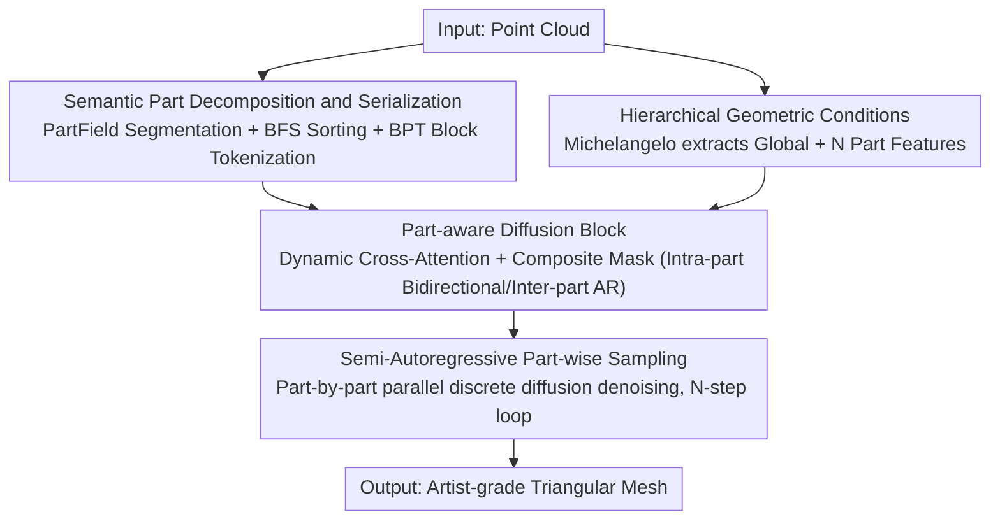

# PartDiffuser: Part-wise 3D Mesh Generation via Discrete Diffusion

**Conference**: CVPR 2026  
**Paper**: [CVF Open Access](https://openaccess.thecvf.com/content/CVPR2026/html/Yang_PartDiffuser_Part-wise_3D_Mesh_Generation_via_Discrete_Diffusion_CVPR_2026_paper.html)  
**Code**: TBD  
**Area**: 3D Vision  
**Keywords**: Artist-grade Mesh Generation, Discrete Diffusion, Semi-Autoregressive, Part-level Generation, Point Cloud to Mesh  

## TL;DR
PartDiffuser replaces the "per-token autoregressive mesh generation" with a semi-autoregressive framework characterized by "inter-part autoregression and intra-part parallel discrete diffusion." It injects hierarchical geometric conditions through part-aware cross-attention to refine local high-frequency details while ensuring global topology. On Objaverse, it reduces Chamfer Distance by approximately 27% compared to the second-best method.

## Background & Motivation
**Background**: Triangular meshes are the de facto standard 3D format for games, VR, and film. Inspired by Large Language Models (LLMs), the mainstream paradigm for "artist-grade" mesh generation has shifted to **Autoregressive (AR) sequence modeling**: models like MeshGPT and MeshAnything treat the mesh as a 1D token sequence (vertices + faces), generating them token-by-token to learn structured topology and produce coherent manifold meshes.

**Limitations of Prior Work**: Sequential token-by-token generation faces two fundamental bottlenecks. First, **long-sequence dependencies lead to error accumulation**, where an early error propagates and contaminates the subsequent generation chain. Second, the model is forced to make a trade-off between **global structural consistency** and **local high-frequency details**: to ensure correct global topology, it tends to over-smooth or simplify fine-grained geometric features.

**Key Challenge**: The conflict between "global vs. local" objectives, exacerbated by error accumulation, stems from coupling "maintaining global topology" and "depicting local details" into a single serial token chain—their requirements for generation order and parallelism are contradictory.

**Goal**: To decouple these two tasks—guaranteeing global structure through "part-level" dependencies while refining local details through "intra-part" modeling—while simultaneously reducing the number of autoregressive steps from the token level to the part level to mitigate error accumulation.

**Key Insight**: The authors noted that **semi-autoregressive (block-wise) sampling** in diffusion language models (such as BD3-LM) perfectly resolves this trade-off: inter-block autoregression and intra-block parallel diffusion. Replacing "blocks" with "semantic parts" naturally aligns with the artist's workflow of part-based modeling.

**Core Idea**: Use autoregression between parts to maintain global topology and parallel discrete diffusion within parts to preserve high-frequency details—generating one complete semantic part at a time.

## Method

### Overall Architecture
PartDiffuser takes a point cloud as input (condition) and outputs an artist-grade triangular mesh. The pipeline follows a "segment parts first, then generate parts via semi-autoregressive diffusion" approach. First, PartField is used to perform semantic segmentation on the mesh/point cloud to obtain $N$ parts. A BFS traversal based on adjacency relationships organizes the parts into a locality-preserving 1D sequence. BPT is then used to serialize each part into token blocks, padded to a uniform length. Simultaneously, a pre-trained Michelangelo point cloud encoder extracts **hierarchical geometric conditions** (one global feature + $N$ part features). Generation is performed part-by-part using a DiT-based discrete diffusion: when generating the $i$-th part, the cross-attention in the part-aware diffusion block only attends to the "global feature + $i$-th part feature." Self-attention uses a composite mask to achieve "intra-block bidirectional and inter-block autoregressive" behavior, denoising all tokens of that part in parallel. Once a part is denoised, the condition switches to generate the next part, cycling $N$ steps to assemble the full mesh.

### Key Designs

**1. Semantic Part Decomposition and Serialization: Partitioning Mesh into Locality-Preserving Part Token Blocks**

To enable discrete diffusion to learn the "intra-part local bidirectional context," the global mesh must first be partitioned into internally consistent semantic parts. This work uses PartField for semantic segmentation, with the target number of clusters randomly sampled from a predefined range to increase data diversity. Sampled point clouds follow the same segmentation as the mesh. After segmentation, an adjacency matrix is built based on part connectivity, and a **BFS traversal is initiated from a random starting point** to arrange parts into a 1D sequence. The layer-by-layer exploration of BFS naturally preserves locality, ensuring that spatially adjacent parts remain close in the sequence, which helps the model capture strong dependencies between physically neighboring parts. Each part is then serialized using BPT (Blocked and Patchified Tokenization), which groups adjacent faces into patches. Each patch is represented by a central vertex and its neighbors, using a dual-block vocabulary where "unique token types of central vertices" implicitly mark the start of a new patch, avoiding special delimiters. Finally, each part sequence is padded to a uniform length and assembled.

**2. Hierarchical Geometric Conditions: Global Features for Structure, Part Features for Local Refinement**

To guide both "assembly" and "details," a pre-trained Michelangelo point cloud encoder is used to derive a **hierarchical** condition $C_{\text{pc}}$ from the input: a global feature vector $C_{\text{global}}$ captures the overall shape, supplemented by $N$ part features $\{C_{\text{part}_1},\dots,C_{\text{part}_N}\}$, where each $C_{\text{part}_i}$ encodes the local geometry of the $i$-th semantic part. $C_{\text{pc}}$ is formed by concatenating the global vector with the $N$ part vectors, directly linking the geometric part decomposition to the structure of the generated output. Ablations show both levels are essential: using only global features loses local details, while using only part features loses global assembly capability.

**3. Part-aware Diffusion Blocks: Dynamic Cross-Attention and Composite Masks for Part-level Control**

A cross-attention module is inserted into standard DiT blocks. The forward pass is $Z'=\text{SelfAttn}(\text{LN}(Z))+Z$, $\hat Z=\text{CrossAttn}(Q=\text{LN}(Z'),K=C_{\text{dyn}},V=C_{\text{dyn}})+Z'$, followed by FFN+residual. The key lies in the **dynamic selection** of $C_{\text{dyn}}$: when processing the $i$-th part, $C_{\text{dyn}}=[C_{\text{global}},C_{\text{part}_i}]$. Cross-attention only considers the global + current part features, forcing the token block to align precisely with its corresponding part geometry. Self-attention uses a **composite mask** to achieve semi-autoregression: it allows full bidirectional attention within a block (to fully model intra-part context) while enforcing autoregression between blocks (part $i$ can only attend to generated $X_{<i}$). A Block-Aware Padding Mask is also used to manage the visibility of padding tokens. This "intra-block bidirectional, inter-block causal" logic is the execution mechanism that decouples global topology from local details.

**4. Semi-Autoregressive Part-wise Sampling: Parallel Training, Part-by-part Inference**

The generation is formalized as semi-autoregressive conditional diffusion: the mesh likelihood decomposes by parts $p_\theta(X|C_{\text{pc}})=\prod_{i=1}^N p_\theta(X_i|X_{<i},C_{\text{pc}})$. Each part distribution is modeled via discrete diffusion, where $p_\theta$ learns to predict clean tokens $X^0_i$ given noisy $X^t_i$, preceding parts $X_{<i}$ (handled by self-attention), and dynamic geometric conditions $C_{\text{dyn},i}$ (handled by cross-attention). Following the simplified objective of masked diffusion, the $i$-th part loss is $L_i=\mathbb{E}_{t,X^t_i}\big[w(t)(-\log p_\theta(X^0_i|X^t_i,X_{<i},C_{\text{dyn},i}))\big]$, with $w(t)$ being the time weight derived from the noise schedule. Training follows a parallel mode (similar to BD-LM) where the sequence is divided into noisy/clean blocks, efficiently teaching the model to associate token blocks with part-level geometric features. **Inference** follows a semi-autoregressive path, reconstructing across $N$ strides. Within each block, the LLaDA sampling strategy iteratively predicts and selectively remasks low-confidence tokens. Once a part is denoised, conditions are updated to generate the next part.

### Loss & Training
Training data consists of a filtered combination of Objaverse + 3DFront. Meshes are segmented via PartField, discarding samples where any single part sequence exceeds 1024 tokens, resulting in ~81K samples. The model has 0.3B parameters, a maximum sequence length of 4096 tokens, and a semi-autoregressive block size of 1024 (aligned with the 1024 threshold). Two-stage training: 3 days of pre-training on 8×H100 + 2 weeks of fine-tuning on 4×H100.

## Key Experimental Results

### Main Results
For point cloud conditional generation, the model is compared against three open-source SOTA methods: MeshAnythingV2, BPT, and TreeMeshGPT. The test set includes 300 random samples each from Objaverse, HSSD, and 3DFront. Metrics: Chamfer Distance (CD, ×$10^3$), Hausdorff Distance (HD), Earth Mover's Distance (EMD) (lower is better), and F1-Score (higher is better).

| Dataset | Metric | MeshAnythingV2 | BPT | TreeMeshGPT | PartDiffuser |
|--------|------|------|------|------|------|
| Objaverse | CD ×$10^3$ ↓ | 24.402 | 86.837 | 36.938 | **17.813** |
| Objaverse | F1 ↑ | 0.285 | 0.138 | 0.279 | **0.343** |
| HSSD | EMD ↓ / F1 ↑ | 0.077 / 0.383 | 0.093 / 0.369 | 0.061 / 0.441 | **0.059 / 0.471** |
| 3DFront | CD ×$10^3$ ↓ | 10.406 | 15.652 | 7.793 | **6.461** |

On the most complex and diverse dataset, Objaverse, PartDiffuser **achieves the best performance across all four metrics**: CD 17.813 is ~27% better than the runner-up MeshAnythingV2, and F1 0.343 is nearly 20% higher than the runner-up 0.285. It remains highly competitive on the more regular furniture datasets HSSD/3DFront (first in CD/HD/EMD on 3DFront). Qualitatively, BPT fails to produce coherent meshes on Objaverse; MeshAnythingV2/TreeMeshGPT maintain global structure but often exhibit local over-complexity or over-simplification artifacts and deviate from input due to AR error accumulation.

### Ablation Study
Ablations of hierarchical geometric conditions on the Objaverse test set (variants initialized with full model weights and trained for 30% additional steps for fair comparison):

| Configuration | CD ×$10^3$ ↓ | HD ↓ | EMD ↓ | F1 ↑ | Description |
|------|---------|------|------|------|------|
| Full (Global + Part) | **17.813** | **0.238** | **0.115** | **0.343** | Full hierarchical conditions |
| w/ Global only | 29.125 | 0.297 | 0.144 | 0.281 | Without part features, details degrade |
| w/ Parts only | 54.728 | 0.356 | 0.205 | 0.239 | Without global features, assembly fails (worst) |

### Key Findings
- **Global and Part features are synergetic and indispensable**: Using only global features lacks fine-grained guidance, resulting in inaccurate local reconstruction (CD 29.125). Using only part features lacks global context, leading to assembly failure and the largest performance drop (CD 54.728). This proves global features handle "structural integrity + correct assembly" while part features provide "high-fidelity local details."
- **Efficiency-Quality Trade-off**: Introducing an acceleration factor $k$ proportionally reduces diffusion steps $T$ per block. $k{=}4$ ($T{=}256$) speeds up generation by ~3.7× (63.8s→17.1s) compared to the default $k{=}1$ ($T{=}1024$), but CD rises from 17.813 to 44.720—global topology remains, but high-frequency details become irregular or broken. High fidelity requires sufficient sampling budget.
- Part-level (rather than token-level) autoregression confines error accumulation to part boundaries, preventing the topological errors common in AR methods from propagating along long sequences.

## Highlights & Insights
- **Transferring Semi-Autoregressive Diffusion from Language to Meshes**: Using "semantic parts" as blocks ensures global topology while allowing intra-block parallel refinement. This is a clean structural solution to the "global vs. local" trade-off.
- **Dynamic Cross-Attention $C_{\text{dyn}}=[C_{\text{global}},C_{\text{part}_i}]$** is clever: the same weights align each token block with its own geometry simply by "switching conditions," achieving part-level control with near-zero extra structural cost.
- **BFS Part Sorting** is an easily overlooked but effective trick: using graph traversal ensures sequence locality, keeping adjacent parts close in the 1D sequence and reducing the difficulty for the model to learn cross-part dependencies.
- The composite mask "intra-block bidirectional + inter-block causal" is the critical implementation detail for stitching "parallel diffusion" and "autoregressive global consistency" into a single attention mechanism.

## Limitations & Future Work
- **Dependency on Upstream Segmentation**: The entire process relies on PartField segmentation quality; segmentation errors propagate directly to generation. The authors propose end-to-end joint training as a future direction.
- **Scale/Context Constraints**: 0.3B parameters + 1024 block size / 4096 sequence length limits the overall scale and complexity of generated 3D assets; some samples are filtered out by the "single part ≤ 1024 tokens" constraint.
- **Slow Sampling**: The default high-fidelity setting takes ~63.8s per mesh; accelerating significantly degrades quality. The efficiency-fidelity trade-off is not yet fully resolved.
- ⚠️ The paper lacks a comparison against a pure autoregressive baseline using the same part segmentation (i.e., it is unclear how much gain comes from the semi-AR framework versus the part prior itself).
- Future directions: Expanding model and context windows, exploring better parallel sampling strategies, end-to-end joint segmentation + generation, and extending to multi-modal inputs.

## Related Work & Insights
- **vs. MeshGPT / MeshAnything / TreeMeshGPT (Per-token AR)**: These are token-level serial models suffering from error accumulation and global/local trade-offs. This work shifts AR to the part-level and uses intra-part parallel diffusion, improving CD by ~27% on Objaverse with sharper details.
- **vs. TSSR (Fully Parallel Discrete Diffusion)**: TSSR uses a two-stage approach (topology carving + shape refinement) to fix topology accuracy in parallel diffusion. This work avoids full parallelism, using semi-autoregression to balance global topology and local details at part granularity.
- **vs. BD3-LM / LLaDA (Diffusion LMs)**: This work adapts their block-level semi-autoregressive and intra-block sampling strategies, instantiating "blocks" as 3D semantic parts with hierarchical geometric conditions.
- **vs. PartCrafter / PartPacker / Continuous DiT Part Generation**: Those methods often rely on continuous latent spaces or intermediate representations, leading to information loss and difficulty in maintaining inter-part topological consistency. This work performs part generation directly on discrete tokens for better topological control.

## Rating
- Novelty: ⭐⭐⭐⭐ Transferring the semi-autoregressive diffusion paradigm to artist-grade mesh generation with dynamic part conditions is novel; the underlying block concept is adapted from diffusion LMs.
- Experimental Thoroughness: ⭐⭐⭐⭐ Comprehensive comparison across three datasets, condition ablations, and efficiency analysis; lacks a decoupled control for the "part prior vs. semi-AR" gain.
- Writing Quality: ⭐⭐⭐⭐ Motivation, decoupling logic, and execution mechanisms are clear; composite mask details are slightly tucked away in the appendix.
- Value: ⭐⭐⭐⭐ Artist-grade mesh generation is a high-demand area; the part-level semi-autoregressive framework provides general insights for mitigating error accumulation.

<!-- RELATED:START -->

## Related Papers

- [\[CVPR 2026\] ActionMesh: Animated 3D Mesh Generation with Temporal 3D Diffusion](actionmesh_animated_3d_mesh_generation_with_temporal_3d_diffusion.md)
- [\[CVPR 2026\] TokenHand: Discrete Token Representation for Efficient Hand Mesh Reconstruction](tokenhand_discrete_token_representation_for_efficient_hand_mesh_reconstruction.md)
- [\[CVPR 2026\] MeshFlow: Efficient Artistic Mesh Generation via MeshVAE and Flow-based Diffusion Transformer](meshflow_efficient_artistic_mesh_generation_via_meshvae_and_flow-based_diffusion.md)
- [\[CVPR 2026\] Learning Hierarchical Hyperbolic Mixture Model for Part-aware 3D Generation](learning_hierarchical_hyperbolic_mixture_model_for_part-aware_3d_generation.md)
- [\[CVPR 2026\] UniPart: Part-Level 3D Generation with Unified 3D Geom-Seg Latents](unipart_part-level_3d_generation_with_unified_3d_geom-seg_latents.md)

<!-- RELATED:END -->
