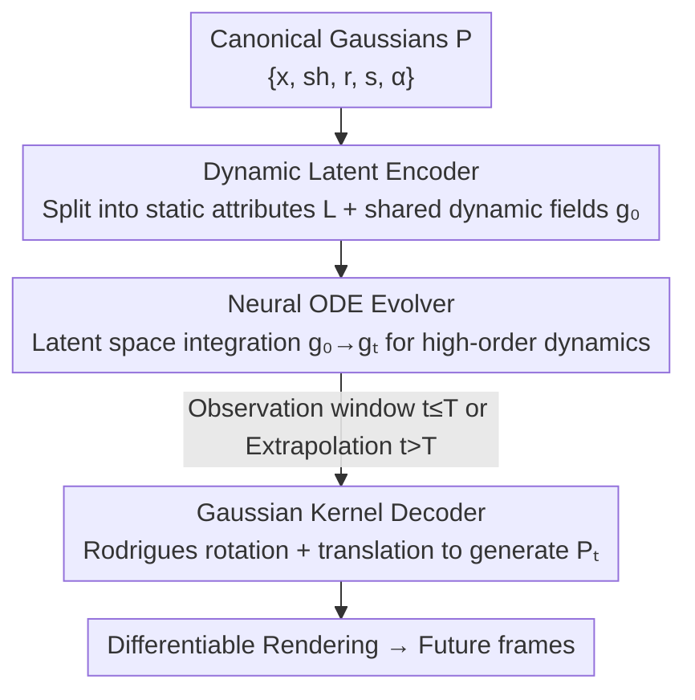

# ParticleGS: Learning Neural Gaussian Particle Dynamics from Videos for Prior-free Physical Motion Extrapolation

**Conference**: CVPR 2026  
**Paper**: [CVF Open Access](https://openaccess.thecvf.com/content/CVPR2026/html/Quan_ParticleGS_Learning_Neural_Gaussian_Particle_Dynamics_from_Videos_for_Prior-free_CVPR_2026_paper.html)  
**Code**: None  
**Area**: 3D Vision  
**Keywords**: Dynamic 3DGS, Motion Extrapolation, Neural ODE, Physical Modeling, Particle Dynamics

## TL;DR
ParticleGS treats each 3D Gaussian as a physics-driven "particle," utilizing a set of shared latent dynamic fields and Neural ODEs to learn continuous-time evolution. This enables physically consistent motion extrapolation beyond the observed time window, achieving over 5 dB higher extrapolation PSNR compared to time-conditioned methods and approximately 2.5 dB higher than velocity field methods across four dynamic scene datasets.

## Background & Motivation

**Background**: The current mainstream approach in dynamic 3D reconstruction (NeRF / 3DGS families) is to learn a **time-conditioned deformation field** $D(P, t) = P_t$: starting with a set of canonical Gaussians $P$, a network takes the timestamp $t$ as input to deform them into the state at any given moment. This paradigm has achieved high fidelity in **interpolation rendering within the observation window**.

**Limitations of Prior Work**: Expressing deformation as a "function of time" essentially forces the network to **memorize** what the deformation looks like at each discrete moment, without learning the underlying physical laws driving the motion. Consequently, when extrapolating to unobserved future frames ($t > T$), time-conditioned models struggle, producing physically implausible motions such as objects scattering, stagnating, or interpenetrating.

**Key Challenge**: Genuine motion is continuously driven by **physical states** (velocity, acceleration, force fields, etc.), whereas timestamps $t_1$ and $t_2$ are independent and do not carry historical system information. Using $t$ as a condition fundamentally discards the Markovian structure where "the current state determines the next," naturally preventing the learning of extrapolatable laws.

**Prior Attempts and Their Shortfalls**: Injecting physics into dynamic 3D typically follows two paths. One is explicit injection of physical priors (simulators, PINNs writing Navier–Stokes into the loss, built-in rigid body/spring constraints), which suffers from poor generalization due to manual external forces or restrictive assumptions. The second relies on geometric priors (preprocessed point clouds/meshes), failing to learn dynamics directly from raw RGB observations and often requiring multi-stage optimization. Recent works use **velocity/acceleration fields** to model rigid motion, but such **low-order dynamics** are insufficient for complex deformations.

**Core Idea**: Ours reformulates the dynamic 3D scene as a **physical particle system**—each Gaussian is a particle whose temporal evolution is driven by a latent **physical state vector**. Neural ODEs are used to learn the **continuous-time high-order evolution** of these states in the latent space, rather than memorizing deformation trajectories. By "integrating into the future following the learned physical laws," prior-free motion extrapolation is achieved without pre-defined physical equations or structured geometric inputs.

## Method

### Overall Architecture

ParticleGS is a three-stage **Encoder–Evolver–Decoder** framework. Unlike time-conditioned methods $R(D(P, t), v)$, its rendering is expressed as $R(D(P, Z_t), v) = \hat{I}_t^v$: Gaussian deformation is driven by a set of physical states $Z_t$ rather than the timestamp $t$. $Z_t$ evolves from an initial state $Z_0$, which is encoded from the canonical Gaussians $P$. The authors emphasize three inherent advantages of being "state-conditioned" over "time-conditioned": ① Spatio-temporal awareness—$Z_t$ implicitly encodes the entire system history from $0 \to t$, while $t$ only encodes temporal order; ② Physical plausibility—state-conditioning aligns better with real particle systems; ③ Markovian property—the evolution from $Z_t$ depends only on the current state, sufficient for predicting the next moment.

The pipeline is: Canonical Gaussians $P$ → (Encoder) Initial physical state $Z_0$ → (Neural ODE Evolver integration in latent space) $Z_t$ at any time → (Decoder) Deformation parameters $P_t$ for each Gaussian → Differentiable Rendering. The primary contributions lie in the Encoder (factoring states into **static attributes + shared dynamic fields**), the Evolver (using Neural ODEs for high-order evolution), and the Decoder (using Rodrigues rotation for physical deformation).

### Key Designs

**1. Factorized Latent Space Encoding: Compressing $N \times G$ states into static attributes + $F$ shared dynamic fields**

Directly assigning an independent, time-evolving state vector to each Gaussian results in $O(NG)$ complexity ($N$ being the number of Gaussians, potentially in the hundreds of thousands), which is prohibitive for the evolver. Borrowing physical intuition from the Material Point Method, ours recognizes that particles retain **static attributes** (mass, material) while their motion is driven by **dynamic fields shared across particles** (e.g., gravity). Thus, the state is factorized into two parts: $N$ particle-level static features $L \in \mathbb{R}^{N \times S}$ and $F$ system-level dynamic fields $g_t \in \mathbb{R}^{F \times G}$ shared by all Gaussians. The complete set of physical states is constructed by broadcasting the dynamic fields to each particle:

$$Z_t = \text{concat}[L,\ \mathbf{1}_N \otimes g_t^{\text{flat}}], \quad Z_t \in \mathbb{R}^{N \times (S + F\cdot G)}$$

where $g_t^{\text{flat}}$ is the flattened dynamic field, and $\mathbf{1}_N \otimes g_t^{\text{flat}}$ uses the Kronecker product to replicate the global field to all $N$ particles. Crucially, the evolution stage **only evolves the $F$ dynamic fields instead of all $N$ states**, reducing the complexity of dynamic evolution from $O(NG)$ to $O(FG)$ ($F \ll N$; $F=8$ in experiments). These $F$ fields can be interpreted as a **basis decomposition** of dynamics, with each field capturing a motion mode. The encoder $f_{\text{encoder}}$ uses linear layers to transform Gaussian features into static features $L$, then utilizes Mini-PointNet++ (farthest point sampling + kNN) to construct neighborhood patches for variable Gaussian counts, and finally employs cross-attention with $F$ learnable queries + self-attention for **hierarchical aggregation** of the initial dynamic field $g_0$, such that $f_{\text{encoder}}(P) = Z_0$.

**2. Neural ODE Dynamics Evolver: Learning high-order continuous dynamics rather than memorizing trajectories**

Low-order modeling (learning only velocity fields) cannot characterize complex deformations. However, real physical fields are often governed by **high-order differential equations** (e.g., Newton's laws), which discrete-step models like RNNs/MLPs struggle to capture smoothly for continuous-time, high-order dynamics. The solution is based on a classic equivalence: any $n$-order differential equation $\frac{d^n x}{dt^n} = f(x, \frac{dx}{dt}, \dots, \frac{d^{n-1}x}{dt^{n-1}}, t)$ can be rewritten as a first-order system $\frac{dX}{dt} = F(X, t)$ by **augmenting** the state with its derivatives $X = (x, \frac{dx}{dt}, \dots, \frac{d^{n-1}x}{dt^{n-1}})$. This means a first-order system defined on an augmented latent space is **sufficient to express any high-order dynamics**. Consequently, the dynamic field $g_t$ acts as this augmented state, and a Neural ODE network $f_{\text{evolver}}$ models its derivative:

$$\frac{d g_t}{dt} = f_{\text{evolver}}(g_t, t)$$

The dynamic field for any future time $t+\delta t$ is obtained through numerical integration:

$$g_{t+\delta t} = g_t + \int_t^{t+\delta t} f_{\text{evolver}}(g_\tau, \tau)\, d\tau = \text{ODESolver}(f_{\text{evolver}}, g_t, t, t+\delta t)$$

The numerical solver uses the standard fourth-order Runge–Kutta (RK4). Instead of "memorizing a trajectory," $f_{\text{evolver}}$ learns the **local high-order derivatives** (i.e., the physical laws themselves) of the dynamic fields. Thus, extrapolation simply continues the integration of this learned derivative field to obtain stable, physically consistent future states. Since evolution only acts on $F$ fields, each forward pass only evaluates $F$ fields rather than calculating velocities for all $N$ Gaussians, ensuring efficiency.

**3. Gaussian Kernel Space Physical Decoding: Translating states into deformations with Rodrigues rotation**

Latent states alone cannot be rendered; they must be translated back into deformations for each Gaussian. Ours **decomposes Gaussian kernel motion into translation + rotation** and uses the physically meaningful Rodrigues rotation formula to generate rotations, maintaining physical interpretability. The decoder is a multi-head MLP $f_{\text{decoder}}$ that maps the physical state $z_t$ of each particle into a translation vector $T$, a motion rotation vector $R$, and deformation terms $\{\delta r, \delta s\}$, which update the Gaussian parameters:

$$x_t = \text{Rod}(R)\, x + T, \quad r_t = r \circ \delta r, \quad s_t = s + \delta s$$

where $\text{Rod}(R)$ is the rotation matrix generated via the Rodrigues formula from $R$, and $\circ$ denotes quaternion multiplication. This "translation + rotation" factorization allows the model to learn physically meaningful motion components rather than fitting deformations as unstructured offsets.

### Loss & Training

Standard dynamic 3DGS rendering losses are used to jointly optimize the Gaussian kernels and the ParticleGS network: $\mathcal{L} = \mathcal{L}_1 + \mathcal{L}_{\text{D-SSIM}}$. To prevent the early propagation of errors in the ODE solver from destabilizing training, **progressive training** in three stages is employed: ① Geometry Warmup—Freeze ParticleGS, optimize Gaussian kernels only at $t=0$; ② Dynamics Warmup—Freeze Gaussian kernels, gradually expand the time window to let the network learn deformation trends; ③ Joint Optimization—Optimize both Gaussian kernels and ParticleGS simultaneously. Furthermore, since densification/pruning during training causes the Gaussian count $N$ to change, **online neighborhood regularization** is introduced: neighborhood patches are regenerated periodically instead of using a cached neighborhood graph, acting as data augmentation to improve encoder robustness to varying local particle structures.

## Key Experimental Results

### Main Results

ParticleGS leads across all extrapolation tasks (training on the first 75% of frames, testing on the last 25%) on four synthetic and real datasets. The following table compares extrapolation metrics (best results in bold):

| Dataset | Metric | ParticleGS | FreeGave | TRACE | DeformGS |
|--------|------|------------|----------|-------|----------|
| Dynamic Object | PSNR↑ | **39.78 / 36.47** | 38.64 / 33.63 | 38.01 / 33.36 | 37.38 / 26.16 |
| Dynamic Object | LPIPS↓ | **0.009 / 0.012** | 0.011 / 0.012 | 0.011 / 0.013 | 0.034 / 0.038 |
| Dynamic Indoor | PSNR↑ | **25.50 / 31.10** | 19.68 / 28.98 | 22.85 / 29.48 | 20.02 / 21.98 |
| Dynamic Multipart | PSNR↑ (Extrap.) | **36.14** | 33.53 | 33.46 | 27.99 |
| FreeGave-GoPro (Real) | PSNR↑ (Extrap.) | **26.79** | 26.51 | 25.92 | 21.67 |

> Note: For Dynamic Object / Indoor, columns represent "Reconstruction / Extrapolation" PSNR. Ours leads time-conditioned methods by >5 dB and velocity field methods (TRACE / FreeGave) by ~2.5 dB on average, performing optimally on real-world GoPro data as well.

In terms of speed (FPS, Table 3): ParticleGS achieves 44.3 FPS on Dynamic Object and 37.1 FPS on Indoor. Despite the inclusion of Neural ODEs, only $F$ dynamic fields are evaluated forward, resulting in rendering speeds comparable to velocity field methods (FreeGave at only 32.3 / 32.1 FPS).

### Ablation Study

Component-wise ablation on Dynamic Object / Indoor (extrapolation PSNR, full model 36.47 / 31.10):

| Configuration | Object PSNR↑ | Indoor PSNR↑ | Description |
|------|------|------|------|
| Full ($F=8$) | **36.47** | **31.10** | Full model |
| w/o Factorized Encoding (FE) | 36.39 | — | Minimal accuracy change; significantly higher memory |
| $F=1$ | 35.21 | 28.03 | Insufficient dynamic fields; significant drop |
| $F=4$ | 36.24 | 30.98 | Close to optimal |
| $F=16$ | 36.55 | 31.07 | Marginal gains |
| w/o Neural ODE (MLP instead) | 34.55 | 27.46 | **Largest performance drop** |
| w/o Physical Decoding (PD, Rodrigues) | 35.34 | 28.65 | Notable drop in extrapolation accuracy |
| w/o Progressive Training (PT) | 35.44 | 29.17 | Unstable training; performance drop |
| w/o Neighborhood Reg (NR) | 35.99 | 30.23 | Decreased robustness |

### Key Findings
- **Neural ODE is vital**: Replacing the evolver with an MLP of similar parameter count caused the most severe drop (Indoor 31.10 → 27.46), confirming that high-order continuous dynamics should be modeled with Neural ODEs and that discrete stepping models fail to learn extrapolatable rules.
- **Factorized encoding prioritizes efficiency**: Removing it barely changed accuracy (36.47 → 36.39) but caused memory usage to surge, demonstrating its value in compressing evolution complexity from $O(NG)$ to $O(FG)$. Correlation in motion means independent per-particle states can slightly degrade performance.
- **Sweet spot for dynamic field count $F$**: $F=1$ is clearly insufficient; $F=4 \to 8$ shows significant improvement, while $F=16$ hits diminishing returns. A small but sufficient number of fields captures standard motion modes.
- **Physically consistent decoding is effective**: Removing Rodrigues rotation deformation resulted in a visible drop in extrapolation accuracy, proving that factorizing motion into "physically meaningful translation + rotation" helps the model learn real dynamics.

## Highlights & Insights
- **The paradigm shift from "time-conditioned" to "state-conditioned"**: Changing deformation from $D(P, t)$ to $D(P, Z_t)$ clearly explains the source of extrapolation capability—$Z_t$ carries system history and satisfies the Markov property, whereas $t$ does not.
- **Theoretical support for Neural ODE**: Ours uses the classic high-order to first-order augmentation trick to justify why a first-order Neural ODE defined on the dynamic field latent space is sufficient to express high-order dynamics, providing a solid theoretical motivation.
- **Factorization (Static attributes + shared dynamic fields) is a transferable design**: Replacing "independent per-particle state" with "few shared fields + per-particle static attributes" is essentially using MPM-style physical intuition for dimensionality reduction—an $O(NG) \to O(FG)$ strategy applicable to any particle/point-cloud temporal modeling.
- **Value of prior-free modeling**: Directly learning from multi-view RGB videos without pre-defined physical equations or pre-processed point clouds/meshes makes it more practical than PINN and geometry-prior-based methods.

## Limitations & Future Work
- The authors acknowledge that ParticleGS **cannot learn motions that deviate significantly from observed physical dynamics** (e.g., sudden object fracturing/shattering) because it learns to "continue observed patterns."
- ⚠️ (Self-observation): Evaluation is focused on the NVFi/FreeGave protocol of "first 75% for training, last 25% for extrapolation." The extrapolation duration is relatively short; the paper does not fully demonstrate whether ODE integration errors accumulate or how long physical consistency is maintained over **longer durations**.
- The shared dynamic field $g_t$ assumes motion is driven by a **few global modes**. For scenes with many **local independent motions** (multiple agents or strong non-rigid local details), whether $F$ global fields suffice or require hierarchical/regional fields is an open question.
- Visualization of physical state $Z_t$ only qualitatively shows that Gaussians with similar motions have similar features, without quantitative comparison to real physical quantities (velocity/force). The claim that "physical laws are learned" is largely argumentative.

## Related Work & Insights
- **vs. Time-conditioned Dynamic 3DGS (DeformGS / Grid4D / TiNeuVox)**: These learn $D(P, t)$ as a function of time and can only interpolate. ParticleGS learns state evolution $D(P, Z_t)$, providing extrapolation with >5 dB improvement in PSNR.
- **vs. Physical Priors (NVFi PINN / GaussianPrediction GCN rigidity)**: These require explicit physical equations or rigid neighborhood relationships, limited to well-defined scenarios. ParticleGS learns dynamics directly from video.
- **vs. Velocity Field Methods (FreeGave / TRACE)**: These model low-order motion using velocity fields. ParticleGS uses Neural ODEs for general high-order dynamics, averaging ~2.5 dB higher PSNR while maintaining similar speeds via $F$ shared fields.
- **Insight**: The core methodology involves reframing "temporal fitting" as "state evolution of a latent dynamical system." Any task currently relying on "rote memorization conditioned on time/index" (e.g., trajectory prediction, temporal dimension in controllable generation) can benefit from "state-conditioning + Neural ODE integration" for better extrapolation and generalization.

## Rating
- Novelty: ⭐⭐⭐⭐⭐ Reframing dynamic 3DGS as "physical particles + Neural ODE evolution" fundamentally addresses the extrapolation failure of time-conditioned methods.
- Experimental Thoroughness: ⭐⭐⭐⭐ Covering 4 datasets (including real GoPro), three baseline categories, and 6 sets of ablations; however, extrapolation duration is short and lacks quantitative physical comparisons.
- Writing Quality: ⭐⭐⭐⭐⭐ Uses clear arguments for "state over time" and high-to-first order augmentation theory to clarify motivations; formulas and frameworks are self-consistent.
- Value: ⭐⭐⭐⭐⭐ Prior-free and independent of pre-defined physics or geometric priors, making it highly applicable for predictive modeling in games, autonomous driving, and robotics.

<!-- RELATED:START -->

## Related Papers

- [\[CVPR 2026\] Learning a Particle Dynamics Model with Real-world Videos](learning_a_particle_dynamics_model_with_real-world_videos.md)
- [\[CVPR 2026\] Node-RF: Learning Generalized Continuous Space-Time Scene Dynamics with Neural ODE-based NeRFs](node-rf_learning_generalized_continuous_space-time_scene_dynamics_with_neural_od.md)
- [\[CVPR 2026\] Learning Explicit Continuous Motion Representation for Dynamic Gaussian Splatting from Monocular Videos](learning_explicit_continuous_motion_representation_for_dynamic_gaussian_splattin.md)
- [\[CVPR 2026\] P2GS: Physical Prior-guided Gaussian Splatting for Photometrically Consistent Urban Reconstruction](p2gs_physical_prior-guided_gaussian_splatting_for_photometrically_consistent_urb.md)
- [\[ICCV 2025\] TRACE: Learning 3D Gaussian Physical Dynamics from Multi-view Videos](../../ICCV2025/3d_vision/trace_learning_3d_gaussian_physical_dynamics_from_multi-view_videos.md)

<!-- RELATED:END -->
