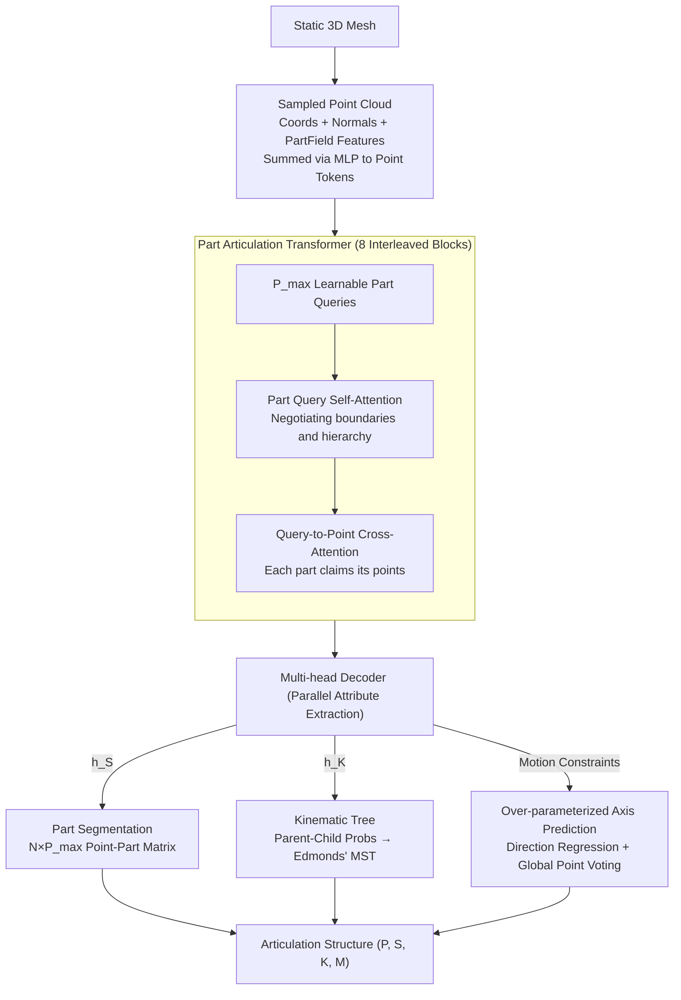

# Particulate: Feed-Forward 3D Object Articulation

**Conference**: CVPR 2026  
**arXiv**: [2512.11798](https://arxiv.org/abs/2512.11798)  
**Code**: [https://ruiningli.com/particulate](https://ruiningli.com/particulate)  
**Area**: 3D Vision  
**Keywords**: Articulated objects, 3D part segmentation, motion constraint prediction, feed-forward inference, Transformer

## TL;DR
Particulate proposes a feed-forward model that infers a complete articulated structure (part segmentation, kinematic tree, and motion constraints) from a static 3D mesh within seconds. Trained end-to-end on public datasets using a Part Articulation Transformer, it significantly outperforms existing methods that require per-object optimization and can be integrated with 3D generative models to enable articulation generation from single images.

## Background & Motivation

1. **Background**: Most real-world objects possess not only shape but also movement capabilities (e.g., rotating doors, sliding drawers). Understanding articulated structures is crucial for robotic manipulation, game simulation, and digital twins. Existing methods either rely on rule-based procedural generation which fails for long-tail objects, or require per-object multi-view optimization taking 10-20+ minutes.

2. **Limitations of Prior Work**: Learning-based methods fall into three categories: (a) 3D part segmentation methods predict semantic labels but do not model articulation; (b) 3D articulated object generation methods cover limited categories and assume known kinematic structures; (c) VLM-based methods (e.g., Articulate AnyMesh) generalize well but require lengthy per-object optimization and struggle with internal/occluded parts.

3. **Key Challenge**: How to achieve fast feed-forward inference while maintaining generalization and handling invisible internal components?

4. **Goal**: Directly predict complete articulation structures (part segmentation + kinematic tree + motion parameters) from static 3D meshes in a feed-forward manner, supporting multi-joint, multi-category, and AI-generated 3D assets.

5. **Key Insight**: Leverage the flexibility and scalability of Transformers by training end-to-end on large-scale multi-category articulated datasets, using learnable part queries and multi-head decoders to predict specific articulation attributes.

6. **Core Idea**: Utilize a standard Transformer with learnable part queries for end-to-end training on point clouds, predicting all articulation attributes—including part segmentation, kinematic tree, and motion constraints—in a single forward pass.

## Method

### Overall Architecture
The objective is to describe "how an object moves" using a single pass with no per-object optimization. This is formalized as a 4-tuple $\mathcal{A} = (P, S, K, M)$, representing the number of parts $P$, a segmentation mapping $S$, a kinematic tree $K$, and motion constraints $M$ (type, direction, axis, range). The pipeline samples the mesh into a point cloud, processes it through a Transformer backbone to encode both point and part representations, and utilizes parallel decoding heads to extract properties. Inference takes approximately 10 seconds, compared to minutes for VLM-based optimization.

### Key Designs

**1. Part Articulation Transformer: Handling Unknown Part Counts with DETR-style Queries**

The number of parts varies per object. Particulate uses $P_{max}$ learnable part queries $\mathcal{Q}$ (larger than any expected part count), allowing the network to determine which queries activate as real parts. Each point $\mathbf{p}_i$ combines coordinates, normals, and PartField semantic features via an MLP to form a point token $\tilde{\mathbf{p}}_i$. The PartField features introduce 2D semantic priors essential for generalizing to unseen categories and AI-generated assets. The backbone consists of 8 blocks interleaving self-attention among part queries and cross-attention from queries to point tokens.

**2. Multi-head Decoder: Decoupling Attributes into Independent MLP Heads**

After the backbone, attributes are processed by independent heads. Part segmentation $h_S(\tilde{\mathbf{p}}_i, \tilde{\mathbf{q}}_j)$ outputs an $N \times P_{max}$ logit matrix. The kinematic tree $h_K(\tilde{\mathbf{q}}_i, \tilde{\mathbf{q}}_j)$ outputs a $P_{max} \times P_{max}$ parent-child probability matrix; Edmonds' algorithm is used during inference to ensure a valid directed tree structure. Motion types, ranges, and prismatic directions are regressed by independent MLPs from corresponding part tokens.

**3. Over-parameterized Axis Prediction: Voting for Robustness**

Predicting rotation axes is difficult. The model regresses the orientation $\tilde{\mathbf{d}}_{ra}^i$ directly. For the axis position, instead of regressing a single coordinate, each point $\mathbf{p}_j$ belonging to a part predicts its orthogonal projection onto the axis via $h_{cp}(\tilde{\mathbf{p}}_j, \tilde{\mathbf{q}}_i)$. The median of all point votes within the part is taken as the final axis position. This geometric constraint ensures consistency across hundreds of points and is more robust than mean or direct regression.

### Loss & Training

A multi-task loss is used: $\mathcal{L} = \mathcal{L}_S + \mathcal{L}_K + \mathcal{L}_M$. Part segmentation uses cross-entropy, while the kinematic tree uses binary cross-entropy. Motion constraints include cross-entropy for types and L1 loss for ranges, directions, and axis parameters. Hungarian matching aligns $P_{max}$ predicted queries with $P$ ground truth parts. Training is performed on PartNet-Mobility and GRScenes using AdamW with a batch size of 128 on 8 H100 GPUs for 100K iterations.

## Key Experimental Results

### Main Results (Part Segmentation)

| Method | Lightwheel gIoU↑ | Lightwheel PC↓ | PartNet gIoU↑ | PartNet PC↓ |
|-----|------------------|----------------|---------------|-------------|
| Naive Baseline | 0.018 | 0.285 | 0.296 | 0.210 |
| PartField† | 0.079 | 0.106 | 0.183 | 0.123 |
| SINGAPO (1@10)† | -0.050 | 0.221 | 0.271 | 0.117 |
| Articulate AnyMesh† | 0.172 | 0.190 | 0.383 | 0.104 |
| **Ours†** | **0.332** | **0.168** | **0.880** | **0.003** |

†: Refined with mesh connectivity.

### Main Results (Full Articulation Geometry)

| Method | Lightwheel gIoU↑ | Lightwheel OC↓ | PartNet gIoU↑ | PartNet OC↓ |
|-----|------------------|----------------|---------------|-------------|
| SINGAPO (1@10)† | -0.056 | 0.019 | 0.264 | 0.041 |
| Articulate AnyMesh† | 0.158 | 0.010 | 0.378 | 0.022 |
| **Ours†** | **0.305** | **0.009** | **0.843** | **0.003** |

### Ablation Study

| Configuration | gIoU↑ | Description |
|------|-------|------|
| Full model | 0.332 | Complete model (Lightwheel, with connectivity) |
| w/o PartField features | Lower | Generalization drops without semantic features |
| w/o connected comp. refinement | 0.183 | Performance drops significantly without mesh connectivity |
| w/o over-parameterized axis | Lower | Direct axis position regression leads to offsets |

### Key Findings
- Ours achieves a gIoU of 0.880 on PartNet-Mobility, far exceeding Articulate AnyMesh (0.383).
- The performance gap remains significant on the challenging Lightwheel dataset (0.332 vs 0.172).
- Purely semantic methods like PartField do not align well with articulation-based segmentation.
- VLM-based methods fail to capture occluded internal components (e.g., microwave trays).
- Generalizes successfully to AI-generated 3D assets (e.g., from Hunyuan3D).

## Highlights & Insights
- **Geometric Voting**: The over-parameterized axis prediction utilizes the global consistency of point cloud projections, making it inherently more robust than single-point regression.
- **Query-based Articulation**: Adapting DETR-style queries allows the model to handle variable part counts and inter-part relationships within a unified Transformer architecture.
- **Data Augmentation**: Training on randomized articulation states provides significant augmentation, allowing the model to interpret various object poses.

## Limitations & Future Work
- The maximum part count is limited by $P_{max}=16$, which may be insufficient for highly complex robots.
- The model only supports rigid revolute and prismatic joints, not soft-body deformation.
- Scaling training data beyond 3,800 objects could further enhance generalization.
- Computing PartField features adds latency to the inference pipeline.
- The Lightwheel benchmark is relatively small at 243 objects.

## Related Work & Insights
- **vs SINGAPO**: SINGAPO relies on part retrieval and is limited by its library. Ours predicts articulation end-to-end without retrieval dependencies.
- **vs Articulate AnyMesh**: Articulate AnyMesh takes ~15 minutes per object and misses internal parts. Ours takes ~10 seconds and handles internal structures.
- **vs PartField**: PartField addresses semantic segmentation. Ours incorporates it as a feature to bridge the gap between semantics and physical articulation.

## Rating
- Novelty: ⭐⭐⭐⭐ First feed-forward method for full articulation inference from static meshes.
- Experimental Thoroughness: ⭐⭐⭐⭐⭐ Comprehensive evaluation across datasets with extensive ablations.
- Writing Quality: ⭐⭐⭐⭐⭐ Clear formal definitions and detailed method descriptions.
- Value: ⭐⭐⭐⭐ Significant for 3D understanding and downstream generative tasks.

<!-- RELATED:START -->

## Related Papers

- [\[CVPR 2026\] ForeHOI: Feed-forward 3D Object Reconstruction from Daily Hand-Object Interaction Videos](forehoi_feed-forward_3d_object_reconstruction_from_daily_hand-object_interaction.md)
- [\[CVPR 2026\] FUSER: Feed-Forward Multiview 3D Registration Transformer and SE(3)$^N$ Diffusion Refinement](fuser_feed-forward_multiview_3d_registration_transformer_and_se3n_diffusion_refi.md)
- [\[CVPR 2026\] Feed-Forward One-Shot Animatable Textured Mesh Avatar Reconstruction](feed-forward_one-shot_animatable_textured_mesh_avatar_reconstruction.md)
- [\[CVPR 2026\] PanoVGGT: Feed-Forward 3D Reconstruction from Panoramic Imagery](panovggt_feed-forward_3d_reconstruction_from_panoramic_imagery.md)
- [\[CVPR 2026\] PhysGM: Large Physical Gaussian Model for Feed-Forward 4D Synthesis](physgm_large_physical_gaussian_4d_synthesis.md)

<!-- RELATED:END -->
