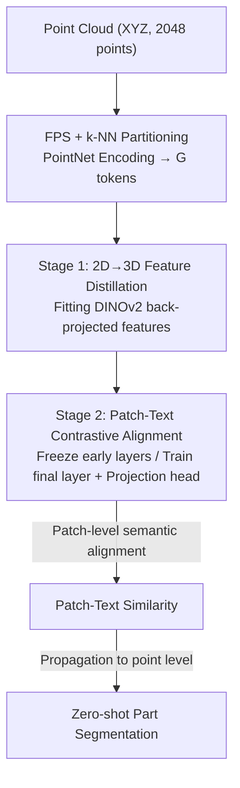

# PatchAlign3D: Local Feature Alignment for Dense 3D Shape Understanding

**Conference**: CVPR 2026  
**Paper**: [CVF Open Access](https://openaccess.thecvf.com/content/CVPR2026/html/Hadgi_PatchAlign3D_Local_Feature_Alignment_for_Dense_3D_Shape_Understanding_CVPR_2026_paper.html)  
**Code**: None (Project page only: souhail-hadgi.github.io/patchalign3dsite)  
**Area**: 3D Vision  
**Keywords**: 3D Part Segmentation, Zero-shot, Point Cloud Transformer, Feature Distillation, Multi-positive Contrastive Learning

## TL;DR
PatchAlign3D is the first pure encoder 3D model that directly outputs "language-aligned patch-level features" on point clouds. Through a two-stage pre-training process involving "DINOv2 feature distillation + patch-text contrast," it performs zero-shot 3D part segmentation in a single feed-forward pass without multi-view rendering. On ShapeNetPart, it achieves an mIoU +31.3% higher than the previous strongest rendering-based method, COPS.

## Background & Motivation
**Background**: Current 3D foundation models (OpenShape, Uni3D, etc.) are powerful for global tasks (retrieval, classification) but struggle with "part-level" dense predictions (3D part segmentation). The mainstream approach utilizes "multi-view rendering pipelines": rendering point clouds into multiple images, extracting features using 2D large models (DINOv2/CLIP), and fusing 2D predictions back into 3D (e.g., COPS, PointCLIPv2, PartSLIP).

**Limitations of Prior Work**: This multi-view paradigm suffers from three critical flaws. ① **Lack of geometric grounding**—predictions rely primarily on 2D appearance cues rather than true 3D structure; ② **Expensive inference**—it requires rendering multiple views, per-view inference, and complex geometric fusion (COPS takes 1.38s per shape, SATR takes 111s); ③ **Dependency on prompt engineering**—it relies heavily on using LLMs to tune captions for the test set, with performance dropping significantly when simple common part names (leg, wing, lid) are used.

**Key Challenge**: There is a trade-off between "supervised feed-forward 3D models" (geometric grounding and high speed, but closed-set) and "2D foundation models + multi-view" (open-vocabulary, but sacrificing geometry, speed, and robustness). Furthermore, part annotation data used for training 3D encoders (such as the 30K shapes automatically labeled via SAM+VLM in Find3D) is **inherently noisy**—a single 3D patch may be assigned conflicting part names, and segmentation masks are often fragmented or incomplete. Point-level supervision can easily be misled by this noise.

**Goal**: To train a pure encoder 3D model that directly processes point clouds and outputs language-aligned local features, enabling open-world part segmentation in a single feed-forward pass while bypassing the geometry loss, slow inference, and prompt dependency of multi-view methods, and remaining robust to noisy annotations.

**Key Insight**: The authors observe that since point-level annotations are unreliable, semantic alignment should **not be performed at the point level, but at the patch level**. Aggregating and averaging annotations within a local patch can smooth out label noise and provide better robustness against inconsistent boundaries.

**Core Idea**: A "2D to 3D feature distillation" stage injects dense visual priors from DINOv2 into the point cloud encoder as geometric initialization. Subsequently, "patch-text multi-positive contrastive learning" aligns these patch features with text space, operating entirely at patch granularity to combat noise.

## Method

### Overall Architecture
The input to PatchAlign3D is a 2048-point coordinate-only point cloud (XYZ only, no RGB/normals), and the output consists of language-aligned features for each patch token. During inference, the similarity between these features and the text features of target part names is calculated; labels with the maximum similarity are propagated back to the point level for zero-shot part segmentation.

The pipeline first partitions the point cloud into $G{=}128$ patches using Farthest Point Sampling (FPS), with each patch containing $k{=}32$ nearest neighbors. Each patch is encoded into a token via a lightweight PointNet. Patch centers are added as positional encodings after MLP embedding, followed by a standard 12-layer Transformer encoder. The core revolves around a **two-stage pre-training** strategy for this encoder: Stage 1 fits the encoder to dense visual features distilled from DINOv2 (self-supervised geometric foundation). Stage 2 initializes from Stage 1, freezes the initial layers, and trains only the final Transformer block and text projection head to align patch features with text space. During inference, Stage 1 is discarded, and only the Stage 2 model is used for a single feed-forward pass.

### Key Designs

**1. Patch-level Semantic Alignment: Robust Learning on Noisy Point Annotations**

The Find3D data engine uses SAM to segment regions and Gemini to assign single-word labels (leg, wing, lid) to each masked region, followed by back-projection to 3D to obtain point-level pseudo-labels. These labels are extremely noisy: a single point may receive conflicting labels from different views, and masks are often fragmented. Supervison at the point level would absorb all this noise. PatchAlign3D addresses this by **raising the granularity of semantic alignment from points to patches**—aggregating 32 points into a patch smooths out annotation noise through local averaging and stabilizes inconsistent boundaries. This design is the core mechanism of the paper, supporting both subsequent stages. While this limits boundary precision to patch resolution, experiments show that predicted boundaries are cleaner and more coherent than point-level models like Find3D.

**2. Stage 1: Distilling DINOv2 Dense Features into 3D Patches**

This step addresses the "lack of fine-grained visual priors in 3D encoders." First, DINOv2 extracts dense feature fields $F_r(u,v)$ for each rendered view. These are bicubically upsampled to the original resolution and back-projected onto the 3D surface. Each visible point inherits the mean feature from the views where it is observed:

$$d(x) = \frac{1}{|\mathcal{V}(x)|}\sum_{r\in\mathcal{V}(x)} F_r\big(u_r(x), v_r(x)\big)$$

where $\mathcal{V}(x)$ is the set of views observing point $x$. Points not captured by any view receive features via nearest-neighbor interpolation. Point-wise features are then aggregated into patch-level targets $d_i = \frac{1}{k}\sum_{m=1}^{k} d(x_m^{(i)})$ and cached. The Transformer encoder $f_\theta$ maps each patch to a token $z_i = f_\theta(P_i)$, which is projected to the 2D feature space via a linear head $h_{2D}$ and fitted using a cosine similarity regression loss:

$$\mathcal{L}_{2D} = \frac{1}{G}\sum_{i=1}^{G}\Big[1 - \frac{h_{2D}(z_i)^\top d_i}{\|h_{2D}(z_i)\|_2\,\|d_i\|_2}\Big]$$

This self-supervised stage transfers the rich representation of DINOv2 into the 3D encoder, providing a geometric initialization for the coarser language-based supervision in Stage 2.

**3. Stage 2: Multi-positive Sigmoid Contrastive Alignment with Fractional Labels**

This stage aligns patch features with text space. The challenge lies in performing alignment when a single patch may span multiple parts and annotations are inherently ambiguous. Starting from the Stage 1 checkpoint, the authors freeze all preceding layers to prevent catastrophic forgetting of geometric representations, training only the last Transformer block and the text head $h_{text}$. Patch-text similarity utilizes a SigLIP-style learnable temperature and bias:

$$s_{i,j} = \frac{1}{\tau}\big\langle h_{text}(z_i),\, t_j\big\rangle + b$$

where $\tau$ and $b$ are initialized to $0.1$ and $-10$, and $t_j$ is the text embedding for part $j$. Two key innovations are introduced. First, **fractional labels**: the label $y_{i,j}\in[0,1]$ for each patch-part pair is defined as the proportion of points in patch $P_i$ belonging to part $j$. This naturally accommodates multi-positive scenarios where one patch contains multiple part names. The loss is a sigmoid binary cross-entropy:

$$\mathcal{L}_{text} = \sum_{i=1}^{G}\sum_{j=1}^{C_s}\big[-y_{i,j}\log\sigma(s_{i,j}) - (1-y_{i,j})\log(1-\sigma(s_{i,j}))\big]$$

Second, **In-sample negatives**: negative samples are drawn only from within the same shape where $y_{i,j}{=}0$. Multi-sample batch negatives are avoided because "legs" of different chairs should not be negatives of each other, as this would harm open-world generalization.

### Loss & Training
The two stages are trained separately for 100 epochs with a batch size of 32, using a training set of 28,827 shapes (2M+ part annotations, 761 categories). Stage 1 uses the cosine regression loss $\mathcal{L}_{2D}$ to train the entire encoder. Stage 2 uses the sigmoid BCE loss $\mathcal{L}_{text}$ to train only the final block and projection head. The authors verified the necessity of this "decoupled two-stage" approach: joint training performed worse than Stage 2 alone, as the goals of dense feature distillation and text alignment are inherently different and interfere when optimized concurrently.

## Key Experimental Results

### Main Results
Evaluation across five zero-shot part segmentation benchmarks (ShapeNetPart, PartNetE, ScanObjectNN, FAUST, Objaverse-General) covers synthetic/scanned, rigid/non-rigid, and seen/unseen categories. PatchAlign3D sets new SOTAs on ShapeNetPart, leading in 15 out of 16 categories:

| Dataset | Metric | PatchAlign3D | COPS (Rendering) | Find3D (Feed-forward) | Gain vs Best |
|--------|------|------|------|------|------|
| ShapeNetPart | mIoU | **56.9** | 25.6 | 23.3 | +31.3 |
| ShapeNetPart | cIoU | **53.1** | 32.2 | 23.9 | +20.9 |
| FAUST (Non-rigid) | mIoU | **67.8** | 30.4 | 63.2 | +4.6 |
| PartNetE | mIoU | **41.4** | 27.0 | 16.4 | +14.4 |
| ScanObjectNN (Real) | mIoU | **22.7** | 17.7 | 18.8 | +3.9 |
| Objaverse-General | Unseen mIoU | **35.61** | — | 34.6 | +1.0 |

Notably, PatchAlign3D and Find3D were trained on the **exact same data**, yet PatchAlign3D leads significantly, indicating the gains stem from the training pipeline (patch-level + two-stage contrast) rather than data advantages.

Inference speed advantages are significant:

| Method | Type | Inference Time (s) |
|------|------|------|
| SATR (Mesh rendering) | Rendering | 111 |
| COPS | Rendering | 1.38 |
| PointCLIPv2 | Rendering | 1.20 |
| Find3D | Feed-forward | 0.4 |
| PatchAlign3D | Feed-forward | ~0.4 |

### Ablation Study
Contribution of the two-stage strategy (ShapeNetPart):

| Configuration | mIoU | cIoU | Description |
|------|------|------|------|
| Stage 2 only | 50.5 | 50.0 | Contrastive alignment only (already exceeds prior baselines) |
| Joint training | 50.2 | 48.6 | Simultaneous loss optimization (performs worse) |
| 2-Stage (Full) | **56.9** | **53.1** | Distillation followed by alignment (+6.4 mIoU) |

### Key Findings
- **Stage 2 alone is SOTA (50.5 mIoU)**: This indicates that patch-level multi-positive contrast is powerful on its own; Stage 1 geometric initialization adds an additional +6.4 mIoU.
- **Joint training leads to performance drops**: Interference between dense feature distillation and text alignment necessitates decoupling.
- **Feature Visualization (PCA→RGB)**: DINOv2 back-projected features are noisy; Stage 1 refines them into geometrically coherent clusters (e.g., distinguishing seat vs. backrest); Stage 2 maintains this structure while layering open-vocabulary semantics.
- **Robustness to Non-rigidity**: On FAUST, rendering-based COPS degrades significantly (30.4 mIoU) under deformation, whereas PatchAlign3D remains stable (67.8 mIoU), confirming that geometric grounding is superior to pure appearance cues.

## Highlights & Insights
- **Reducing granularity to combat noisy labels** is a broadly applicable trick: when point-level pseudo-labels are unreliable, moving supervision to the patch level for local aggregation is a simple yet effective way to counter weak-supervision noise.
- **Fractional labels elegantly handle multi-positive samples**: Using the ratio of points belonging to a part within a patch as a soft label naturally models boundary ambiguity.
- **In-sample negatives** is a critical detail: treating same-named parts in different batches as negatives destroys open-world generalization.
- The **decoupling of "distill geometry first, align language second"** is empirically validated: heterogenous objectives are far better handled in stages than jointly.

## Limitations & Future Work
- Pre-training uses a curated Objaverse subset (32K shapes), covering only a small portion of the 800K+ objects, and pseudo-labels from SAM+LM are imperfect.
- **Fixed patch partitioning** is a structural constraint: $G{=}128$ and $k{=}32$ are hardcoded, making the model non-adaptive to different point cloud densities or sizes; boundary precision is capped by patch resolution.
- On PartNetE, relying solely on patch-text similarity causes unlabeled points to be forced into the "body" label, which may introduce bias in datasets with fine-grained part definitions.
- The model currently focuses on local part understanding and lacks global shape understanding capabilities.

## Related Work & Insights
- **vs Multi-view Pipelines (COPS / PointCLIPv2 / PartSLIP)**: These methods suffer from weak geometric grounding, slow inference, and reliance on prompt engineering. PatchAlign3D processes point clouds directly, is significantly faster (~0.4s), and provides much stronger geometric grounding.
- **vs Find3D (Feed-forward baseline)**: Find3D is an encoder-decoder model performing point-level alignment. Despite using the same data, PatchAlign3D achieves higher mIoU and cleaner boundaries by using a pure encoder and patch-level alignment.
- **vs DITR / OV3D / PartDistill (2D→3D Distillation)**: These primarily target scene segmentation or single-category distillation. This work treats distillation as geometric initialization (Stage 1) and layers language contrast (Stage 2) to achieve cross-category open-world segmentation.

## Rating
- Novelty: ⭐⭐⭐⭐ First pure encoder 3D model with patch-level language alignment; the "granularity reduction + decoupling" strategy is clean and effective.
- Experimental Thoroughness: ⭐⭐⭐⭐⭐ Comprehensive coverage across five benchmarks (synthetic/real/rigid/non-rigid), speed benchmarks, and ablations.
- Writing Quality: ⭐⭐⭐⭐ Clear motivation, complete formulas, and easy-to-follow pipeline.
- Value: ⭐⭐⭐⭐ Advances open-world 3D part segmentation from slow multi-view pipelines to fast feed-forward inference.

<!-- RELATED:START -->

## Related Papers

- [\[CVPR 2026\] LoG3D: Ultra-High-Resolution 3D Shape Modeling via Local-to-Global Partitioning](log3d_ultra-high-resolution_3d_shape_modeling_via_local-to-global_partitioning.md)
- [\[CVPR 2026\] Selfi: Self-improving Reconstruction Engine via 3D Geometric Feature Alignment](selfi_self-improving_reconstruction_engine_via_3d_geometric_feature_alignment.md)
- [\[CVPR 2026\] TextFM: Robust Semi-dense Feature Matching with Language Guidance](textfm_robust_semi-dense_feature_matching_with_language_guidance.md)
- [\[CVPR 2026\] 3D-Aware Multi-Task Learning with Cross-View Correlations for Dense Scene Understanding](3d-aware_multi-task_learning_with_cross-view_correlations_for_dense_scene_unders.md)
- [\[CVPR 2026\] Cross-Instance Gaussian Splatting Registration via Geometry-Aware Feature-Guided Alignment](cross-instance_gaussian_splatting_registration_via_geometry-aware_feature-guided.md)

<!-- RELATED:END -->
