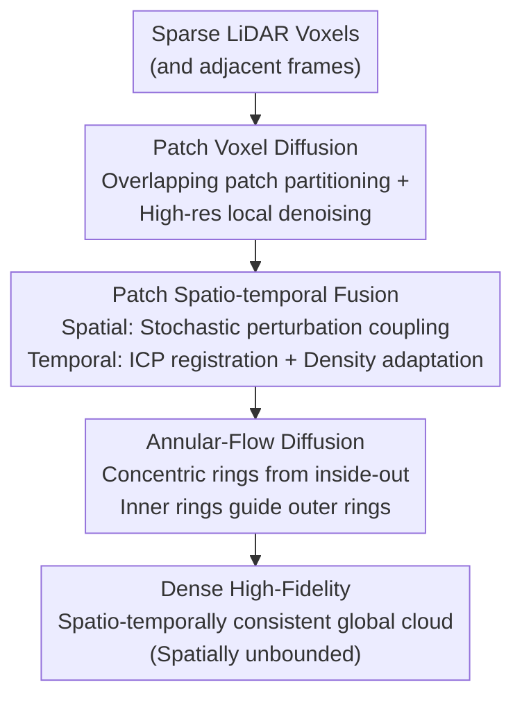

# PatchScene: Patch-based Voxel Diffusion Model for Large-Scale Scene Completion

**Conference**: CVPR 2026  
**Paper**: [CVF Open Access](https://openaccess.thecvf.com/content/CVPR2026/html/Xu_PatchScene_Patch-based_Voxel_Diffusion_Model_for_Large-Scale_Scene_Completion_CVPR_2026_paper.html)  
**Code**: Unreleased  
**Area**: 3D Vision / Diffusion Models  
**Keywords**: LiDAR Scene Completion, Voxel Diffusion, Patch-based Generation, Spatio-temporal Fusion, Autonomous Driving

## TL;DR
PatchScene decomposes large-scale LiDAR scene completion into a set of overlapping small voxel patches, performs explicit voxel diffusion on each, and synthesizes them into consistent global point clouds using confidence-guided spatio-temporal fusion. By adopting an "inside-out, annular-flow" diffusion sequence that propagates dense information from proximal to distal regions, it achieves SOTA results on SemanticKITTI and demonstrates zero-shot generalization from 20m training to 50m inference.

## Background & Motivation

**Background**: In autonomous driving, LiDAR provides 3D geometry with absolute scale. However, point clouds rapidly become sparse at distance and leave large voids due to occlusion. Consequently, "sparse-to-dense" scene completion is a critical requirement. Prevailing approaches are divided into discriminative models (learning a partial $\to$ complete voxel/SDF regression mapping) and recent generative diffusion models (point-based, voxel-SDF-based, or latent-based).

**Limitations of Prior Work**: Discriminative methods rely on one-step regression. Guided only by regression loss, they fail to capture geometric uncertainty and diversity, resulting in either artifacts or over-smoothed structures with lost details. Among diffusion models, point-based methods (e.g., LiDiff) directly predict point offsets; however, the unordered nature of point clouds leads to structural inconsistency, holes, and blurred details. Explicit voxel/SDF methods face cubic memory growth relative to resolution, making them impractical for large-scale scenes. Latent-based methods (e.g., XCube) compress voxels into low-dimensional latent spaces for diffusion, but multi-stage VAE encoding/decoding accumulates information loss and degrades geometric fidelity.

**Key Challenge**: There is an inherent conflict between "high geometric fidelity" and "computable overhead" in large-scale scene completion. High fidelity requires high voxel resolution, which leads to a cubic explosion in computation for full scenes. Conversely, bypassing computation by compressing latent spaces sacrifices fine details. Furthermore, most methods focus on single-frame completion, ignoring temporal correlations in LiDAR sequences, which results in flickering and discontinuities in dynamic scenes.

**Goal**: To achieve high-fidelity, spatially unbounded, and temporally consistent large-scale point cloud completion without exceeding computational limits.

**Key Insight**: The authors adopt a "divide and conquer" strategy. Since full-scene high-resolution voxel diffusion is computationally prohibitive, the scene is partitioned into fixed-size, overlapping small patches. Each patch is treated as an "object-level" completion task, enabling the use of high-resolution voxel diffusion. The complexity then shifts to seamless patch integration and the optimization of the generation sequence.

**Core Idea**: Execute patch-level diffusion in explicit voxel space, followed by stochastic coupled spatial fusion and density-adaptive temporal fusion to ensure global consistency. A "near-to-far annular-flow" generation sequence is designed based on the physical property of LiDAR (dense proximal, sparse distal), allowing high-quality completions from near regions to guide sparse distant areas.

## Method

### Overall Architecture
The input to PatchScene is a single-frame sparse LiDAR occupancy voxel $\tilde{X}$ (and adjacent frames), and the output is a dense, high-fidelity, spatio-temporally consistent global point cloud. The pipeline revolves around a cycle of "patch-based completion $\to$ fusion $\to$ annular-flow diffusion." The voxel space is partitioned into overlapping patches of a predefined size $(h,w,d)$. Each patch independently undergoes 3D U-Net diffusion denoising to generate local point clouds. During denoising, spatial fusion is performed in overlapping areas, and temporal fusion is applied across adjacent frames to merge fragmented patches into a unified global cloud. Finally, patches are categorized into concentric rings $\{R_1,\dots,R_L\}$ based on radial distance from the sensor, and conditional diffusion proceeds ring-by-ring from the innermost layer outward to enable unbounded expansion.

### Key Designs

**1. Patch Voxel Diffusion: Reducing Scene Completion to Patch-level Object Completion**

To address the cubic complexity of high-resolution full-scene voxels, diffusion is not performed on the entire scene. Instead, the full dense occupancy frame $X_0 \in \{0,1\}^{H \times W \times D}$ is partitioned into $N$ local patches using a predefined size $(h,w,d)$ and a stride that ensures overlap: $x_0^{(k)} = \text{Patch}(X_0, k)$, $\tilde{x}^{(k)} = \text{Patch}(\tilde{X}, k)$. Noise is added to each patch independently: $x_t^k = \sqrt{\bar\alpha_t} \, x_0^k + \sqrt{1 - \bar\alpha_t} \, \epsilon$. A network $f_\theta(x_t^k, t, p_k)$ is trained to directly predict the clean data $\hat{x}_0^k$ (predicting $x_0$ instead of noise improves stability), where $p_k$ is a learnable positional encoding providing spatial context sensitivity. The standard DDPM reverse sampling is then used to obtain $x_{t-1}^k$. During training, patches $k$ and timesteps $t$ are sampled randomly to minimize the MSE between predicted and ground truth occupancy voxels: $L_{\text{patch}}(\theta) = \mathbb{E}_{k,t} \big[ \lVert x_0^k - \hat{x}_0^k \rVert_2^2 \big]$.

**2. Patch Spatio-temporal Fusion: Unifying Independent Patches via Stochastic Coupling and Density-adaptive Weights**

Independent denoising causes boundary discontinuities and artifacts. This step employs two mechanisms. **Spatial Fusion** utilizes "stochastic perturbation coupling": after obtaining the predicted noise $\hat\epsilon_k$ for a patch at step $t$, predictions from all adjacent patches are aggregated into a global noise field $\hat\epsilon_{\text{global}}$. Within the overlap region $O_k$, each point $p$ is fused using a binary random mask: $\hat\epsilon_{\text{fused}}^k(p) = B(p) \cdot \hat\epsilon_{\text{global}}(p) + (1 - B(p)) \cdot \hat\epsilon_k(p)$, where $B(p) \sim \text{Bernoulli}(0.5)$. This stochastic coupling aligns with the statistical properties of diffusion models, effectively preventing blurring at fusion boundaries compared to deterministic averaging. **Temporal Fusion** operates across frames: adjacent frames $\tilde{X}_\tau, \tilde{X}_{\tau+1}$ are aligned via ICP to obtain the rigid transform $T_{\tau \to \tau+1}$. The denoising results from the previous frame are transformed and fused: $\hat{x}_t^{\tau+1} = \lambda \cdot \hat{x}_t^{\tau} + (1 - \lambda) \cdot \hat{x}_t^{\tau+1}$. The weight $\lambda$ is adaptively calculated on the BEV grid based on local density consistency: $\lambda(p) = \min \big( \frac{\rho_{\tau+1}(p)}{\rho_\tau(p) + \epsilon}, 1.0 \big)$, where $\rho(p)$ is the local point density.

**3. Annular-Flow Diffusion Completion: Inside-Out Guided Generation Based on LiDAR Physics**

Patch overlap makes the generation sequence critical. The authors leverage the physical characteristic that LiDAR points are dense near the sensor and thin out radially. Proximal voxels are more complete and provide higher completion quality. The patches are grouped into concentric rings $\{R_1, \dots, R_L\}$ based on distance from the sensor. Denoising proceeds ring-by-ring from the innermost $R_1$: at each timestep, the denoising of a patch in $R_\ell$ is guided by the completed results of the adjacent inner ring $R_{\ell-1}$. This "center-outward" guidance allows high-fidelity information to flow from the core to the periphery, enabling sparse outer regions to utilize rich semantic context. This mechanism explains the model's ability to generalize from 20m training to 50m inference.

### Loss & Training
The training objective is the patch-level occupancy MSE reconstruction loss $L_{\text{patch}}$, directly predicting $x_0$. Implementation is done on SemanticKITTI with a LiDAR range of 50m and a voxel resolution of 0.15625m. Training parameters: learning rate $4 \times 10^{-4}$, AdamW, 100 epochs. Diffusion uses a cosine noise schedule ($\beta_{10}=0.0001, \beta_T=0.02$) with $T=1000$. Each patch covers $20\text{m} \times 20\text{m}$, followed by $2\times$ upsampling, resulting in approximately 900,000 points per frame. Inference requires only 10 denoising steps.

## Key Experimental Results

### Main Results
Evaluated on SemanticKITTI against existing point cloud completion methods (using the LiDPM protocol). Metrics: CD (Chamfer Distance), JSD-3D / JSD-BEV (Jensen–Shannon Divergence), and Voxel IoU at 0.5/0.2/0.1 thresholds.

| Method | CD↓ | JSD-3D↓ | JSD-BEV↓ | IoU@0.5↑ | IoU@0.2↑ | IoU@0.1↑ |
| :--- | :--- | :--- | :--- | :--- | :--- | :--- |
| LiDiff(refine) | 0.376 | 0.573 | 0.416 | 32.4 | 23.0 | 13.4 |
| LiDPM(refine) | 0.377 | 0.542 | 0.403 | 36.6 | 25.8 | 14.9 |
| ScoreLidar(refine)† | 0.342 | 0.590 | 0.399 | 32.0 | 19.9 | 9.4 |
| **Ours (PatchScene)** | **0.319** | **0.444** | **0.371** | **45.3** | **38.2** | **19.7** |

PatchScene leads across all metrics. CD decreased to 0.319 from the best baseline 0.342, and JSD-3D dropped significantly. Voxel IoU@0.5 improved from 36.6 to 45.3.

### Ablation Study
**Spatial Fusion Strategy**:

| Configuration | CD↓ | JSD-3D↓ | JSD-BEV↓ | IoU@0.5↑ |
| :--- | :--- | :--- | :--- | :--- |
| w/o fusion | 0.348 | 0.451 | 0.383 | 43.9 |
| average addition | 0.351 | 0.439 | 0.381 | 44.6 |
| weight addition | 0.345 | 0.438 | 0.379 | 44.9 |
| **random coupling (Ours)** | **0.319** | 0.444 | **0.371** | — |

**Temporal Fusion**:

| Configuration | CD↓ | JSD-3D↓ | JSD-BEV↓ | RMSE t0→t1↓ | RMSE t1→t0↓ |
| :--- | :--- | :--- | :--- | :--- | :--- |
| w/o temporal | 0.319 | 0.444 | 0.371 | 0.155 | 0.159 |
| temporal fusion | 0.309 | 0.432 | 0.372 | 0.086 | 0.081 |

Temporal fusion nearly halved bidirectional RMSE, significantly improving inter-frame consistency while slightly improving CD/JSD-3D.

### Key Findings
- **Denoising steps**: 10 steps were found to be optimal. While metrics peaked at $T=5$, $T=10$ provided better cross-patch consistency and prevented visibility of patch boundaries.
- **Zero-shot Generalization**: Training on 20m and inferring at 50m worked effectively. The model maintained geometric fidelity and generated even more complete structures than Ground Truth in sparse regions.
- **Voxel Partitioning is the Primary Driver**: This enables high resolution without computational collapse, forming the foundation for SOTA performance.

## Highlights & Insights
- **"Divide and Conquer" swaps computational limits for stitching challenges**: High-res full-scene diffusion is impossible, but patch-level high-res is feasible. This converts a hard constraint (cubic scaling) into a solvable software problem (boundary fusion).
- **Stochastic Bernoulli Coupling**: Using a 50% probability to adopt global context matches the stochastic nature of diffusion, preventing blurring caused by average fusion.
- **Physical Priors in Generation Order**: Annular-Flow follows the "near-dense, far-sparse" gradient. Starting from the most reliable data (proximal) to guide the less reliable (distal) is a robust heuristic for any spatial generation task with quality gradients.

## Limitations & Future Work
- **Reliance on ICP**: Temporal fusion depends on precise registration; performance in highly dynamic or geometrically degraded scenes (where ICP fails) is not discussed.
- **Hyperparameter Sensitivity**: Patch size, stride, and ring counts are predefined. Analysis of their sensitivity across different sensors/scales is missing.
- **Inference Latency**: While patch computing is efficient, serial processing of patches and rings, plus multi-frame caching, may hinder real-time performance.
- **Dataset Diversity**: Validated only on SemanticKITTI; lacks proof of generalization to other datasets like nuScenes.

## Related Work & Insights
- **vs XCube (latent-based)**: XCube uses multi-stage VAEs. PatchScene works in explicit voxel space, avoiding information loss from encoding/decoding and resulting in sharper details, at the cost of managing patch stitching.
- **vs LiDiff / ScoreLiDAR (point-based)**: Point-based methods often produce oversmoothed results or holes due to lack of order. PatchScene's grid-based voxel approach yields superior structural consistency (higher IoU).
- **vs Single-frame methods**: PatchScene's density-adaptive temporal fusion significantly stabilizes the point cloud sequence.

## Rating
- Novelty: ⭐⭐⭐⭐
- Experimental Thoroughness: ⭐⭐⭐⭐
- Writing Quality: ⭐⭐⭐⭐
- Value: ⭐⭐⭐⭐

<!-- RELATED:START -->

## Related Papers

- [\[CVPR 2026\] CoLoR: The Devil is in Scene Coordinate Regression for Large-Scale Visual Localization](color_the_devil_is_in_scene_coordinate_regression_for_large-scale_visual_localiz.md)
- [\[CVPR 2026\] OLATverse: A Large-scale Real-world Object Dataset with Precise Lighting Control](olatverse_a_large-scale_real-world_object_dataset_with_precise_lighting_control.md)
- [\[CVPR 2026\] SpatialVID: A Large-Scale Video Dataset with Spatial Annotations](spatialvid_a_large-scale_video_dataset_with_spatial_annotations.md)
- [\[CVPR 2026\] iLRM: An Iterative Large 3D Reconstruction Model](ilrm_an_iterative_large_3d_reconstruction_model.md)
- [\[CVPR 2026\] Zero-Shot Depth Completion with Vision-Language Model](zero-shot_depth_completion_with_vision-language_model.md)

<!-- RELATED:END -->
