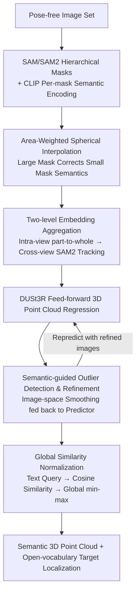

# PE3R: Perception-Efficient 3D Reconstruction

**Conference**: CVPR 2026  
**arXiv**: [2503.07507](https://arxiv.org/abs/2503.07507)  
**Code**: [https://github.com/hujiecpp/PE3R](https://github.com/hujiecpp/PE3R)  
**Area**: 3D Vision  
**Keywords**: 3D Semantic Reconstruction, Open-Vocabulary Segmentation, Tuning-Free, Feed-Forward Inference, Semantic Point Clouds

## TL;DR
PE3R proposes a tuning-free feed-forward 3D semantic reconstruction framework. By utilizing pixel embedding disambiguation, semantic point cloud reconstruction, and global view-aware perception modules, it directly generates semantic 3D point clouds from pose-free 2D images. It achieves 9x acceleration and reaches new SOTA in open-vocabulary segmentation and depth estimation.

## Background & Motivation

**Background**: Significant progress has been made in 2D-to-3D perception, with methods like NeRF and 3DGS capable of reconstructing 3D scenes and extracting semantic information from multi-view images. The emergence of 2D foundation models such as CLIP and SAM has also driven the development of open-vocabulary 3D segmentation.

**Limitations of Prior Work**: Existing methods face a triple dilemma: poor scene generalization (requiring per-scene training), cross-view semantic inconsistency (mismatched labels from different perspectives), and high computational costs (typically requiring tens of minutes to hours of training). For instance, LangSplat requires 149 minutes, and Feature-3DGS takes 648 minutes.

**Key Challenge**: The fundamental contradiction between semantic consistency and inference efficiency—ensuring cross-view consistency requires complex optimization, while efficient feed-forward methods struggle to guarantee semantic coherence. Moreover, most methods rely on extra inputs like known camera parameters and depth maps.

**Goal**: (1) How to achieve efficient 3D semantic reconstruction under pose-free and depth-free constraints? (2) How to maintain semantic consistency across views and hierarchical object levels? (3) How to support open-vocabulary natural language interaction?

**Key Insight**: It is observed that SAM/SAM2 can provide hierarchical object mask decomposition, CLIP can encode semantics, and feed-forward geometry estimators like DUSt3R can directly predict 3D point clouds from pose-free images. Integrating these three into a cohesive pipeline can simultaneously address semantic consistency and efficiency.

**Core Idea**: Zero-shot generalizable 3D semantic reconstruction is achieved through area-weighted spherical interpolation to eliminate cross-view semantic ambiguity, combined with feed-forward geometric prediction and global similarity normalization.

## Method

### Overall Architecture
The objective of PE3R can be summarized as: reconstructing semantic 3D point clouds rapidly from a set of unstructured photos without poses or depth. It avoids training and instead chains three pre-trained models into a feed-forward pipeline. First, SAM/SAM2 decomposes each image into hierarchical masks (e.g., "chair leg—seat—entire chair"), and CLIP generates semantic vectors for each mask. These are aggregated into cross-view consistent dense pixel embeddings via area-weighted spherical interpolation. Next, DUSt3R regresses 3D point clouds directly from multi-view images, using the semantic embeddings for outlier detection and denoising. Finally, text queries are encoded and compared with the 3D point features using cosine similarity, followed by global min-max normalization to localize target objects. The entire pipeline runs in under 5 minutes, nearly 9x faster than LERF (43 minutes). These stages correspond to the three modules: pixel embedding disambiguation, semantic point cloud reconstruction, and global view-aware perception.

### Key Designs

**1. Area-Weighted Spherical Interpolation: Correcting unstable features of small masks using reliable semantics of large masks**

A pain point in hierarchical masking is that small masks (e.g., chair legs) cover few pixels, leading to unstable CLIP embeddings that cause confusion during cross-view alignment. PE3R handles this by defining an interpolation coefficient $t = \frac{\text{area}_B}{\text{area}_A + \text{area}_B}$ for two unit embeddings $\mathbf{F}_A$ and $\mathbf{F}_B$, and performing Spherical Linear Interpolation (Slerp) along the hypersphere:

$$\hat{\mathbf{F}}_B = a\mathbf{F}_A + b\mathbf{F}_B,\quad a = \frac{\sin((1-t)\theta)}{\sin\theta},\quad b = \frac{\sin(t\theta)}{\sin\theta}$$

where $\theta$ is the angle between the vectors. Larger masks carry higher weight, pulling the semantics of parts (like chair legs) toward the reliable semantics of the whole object. Slerp is used instead of simple weighted averaging because it preserves the L2 norm, ensuring aggregated vectors remain on the CLIP unit hypersphere without distorting subsequent similarity calculations. This combination of norm preservation and large-area guidance is crucial for geometrically sound disambiguation.

**2. Two-level Embedding Aggregation: Resolving hierarchical ambiguity then view ambiguity**

Aggregation is split into intra-view and cross-view steps. Intra-view processing follows descending mask area, where small masks align to the larger masks covering them, ensuring part-to-whole consistency. Cross-view aggregation uses SAM2 trackers to link corresponding masks across perspectives, applying spherical interpolation to their embeddings. If a new mask appears (IoU < 0.1), it is treated as a new tracking target rather than being forced into an existing trajectory. This "hierarchy first, view second" sequence, coupled with a fallback to skip cross-view fusion when tracking is unreliable, prevents semantic drift in challenging scenarios like fast motion or large baselines.

**3. Semantic-guided Outlier Detection & Refinement: Indirectly fixing 3D noise via image-space smoothing**

Point clouds from DUSt3R often contain spatial noise, but direct 3D geometric regularization is slow. PE3R instead analyzes each pixel $P_{i,j}$ within a $k \times k$ window, calculating the average 3D Euclidean distance $L_{i,j}$ to neighboring pixels with the same semantic label. Points with abnormally large distances are deemed outliers. Refinement occurs back in the image space by blending the RGB of outlier pixels with the mean of the surrounding same-semantic region using $\hat{y} = \alpha x + (1-\alpha)y$. This "refined image" is re-fed into the point cloud predictor. This leverages the feed-forward model's sensitivity to input changes, using inexpensive image smoothing to achieve indirect 3D geometric correction.

**4. Global Similarity Normalization: Making open-vocabulary scores comparable across views**

Once reconstructed, the point cloud is queried using natural language. A text query $\mathbf{T}$ (e.g., "black chair") is encoded by CLIP and compared with dense pixel embeddings to generate similarity maps. Differing similarity scales across views often lead to inconsistent selection (e.g., a chair being selected in one view but missed in another under the same threshold). PE3R concatenates similarity scores from all views for a global min-max normalization, scaling them to $[0,1]$ before applying a uniform threshold. This ensures semantic consistency of the threshold across all perspectives.

### Loss & Training
PE3R is a completely tuning-free framework. SAM/SAM2, CLIP, and DUSt3R are used with pre-trained weights for inference without any parameter updates or per-scene optimization. The entire pipeline completes in under 5 minutes.

## Key Experimental Results

### Main Results

| Dataset | Metric | PE3R (Ours) | GOI (Prev. SOTA) | Gain |
|--------|------|------------|---------------|------|
| Mip-NeRF360 | mIoU | 0.8951 | 0.8646 | +3.5% |
| Mip-NeRF360 | mPA | 0.9617 | 0.9569 | +0.5% |
| Replica | mIoU | 0.6531 | 0.6169 | +5.9% |
| Replica | mP | 0.8444 | 0.8088 | +4.4% |
| ScanNet++ | mIoU | 0.2248 | 0.2101 (GOI emb) | +7.0% |

Running Time Comparison (Mip-NeRF360):

| Method | Pre-processing | Training | Total Time |
|------|--------|------|--------|
| Feature-3DGS | 25min | 623min | 648min |
| LangSplat | 50min | 99min | 149min |
| GOI | 8min | 37min | 45min |
| **PE3R** | **5min** | **—** | **5min** |

### Ablation Study

| Configuration | mIoU (Mip360) | mIoU (Replica) | Description |
|------|--------------|----------------|------|
| Full PE3R | 0.8951 | 0.6531 | Complete Model |
| w/o Area-weighted Interpolation | ~0.82 | ~0.59 | Semantic consistency drops |
| w/o Cross-view Aggregation | ~0.85 | ~0.61 | Single-view disambiguation insufficient |
| w/o Semantic Refinement | ~0.87 | ~0.63 | Point cloud noise affects segmentation |

Multi-view Depth Estimation (Average of 5 datasets):

| Method | Abs Rel↓ | delta<1.25↑ |
|------|----------|-------------|
| COLMAP | 9.3 | 67.8 |
| DUSt3R | 4.7 | 64.5 |
| MASt3R | 3.3 | 74.9 |
| **PE3R** | **2.5** | **79.1** |

### Key Findings
- Area-weighted spherical interpolation is the most critical component, resolving both hierarchical and view ambiguities simultaneously.
- On the large-scale ScanNet++ dataset, PE3R's embedding quality significantly outperforms baselines, indicating the advantage of the disambiguation strategy in complex scenes.
- The semantic refinement module indirectly improves 3D geometric quality via image-space smoothing, leading to significant gains in depth estimation.

## Highlights & Insights
- **Tuning-free + 9x Acceleration**: Leveraging pre-trained models exclusively allows completion in 5 minutes. This orchestrational innovation (SAM+CLIP+DUSt3R) validates that effective integration can be more impactful than module-level innovation.
- **Mathematical Elegance of Spherical Interpolation**: The area-weighted Slerp satisfies both norm preservation and semantic guidance, making it a genuinely elegant design transferable to other feature fusion scenarios.
- **Image-space Refinement instead of 3D Regularization**: Correcting 3D output via input modification cleverly exploits feed-forward predictor characteristics, bypassing expensive 3D post-processing.

## Limitations & Future Work
- SAM2 tracking may fail in fast-motion or large-baseline scenarios, limiting the robustness of cross-view aggregation.
- Currently supports only point cloud representations; lacks support for meshes or implicit surfaces.
- The mixing factor $\alpha$ for semantic refinement is manually set; adaptive strategies could be explored.
- mIoU on ScanNet++ remains at 22.48%, indicating room for improvement in complex indoor environments.

## Related Work & Insights
- **vs LangSplat**: LangSplat aligns CLIP embeddings with 3DGS but requires per-scene training (99min); PE3R achieves zero-shot generalization via feed-forward inference 9x faster.
- **vs GOI**: GOI enforces multi-view consistency via text-image alignment but requires 37min of training. PE3R outperforms it in both accuracy and speed.
- **vs LSM (Large Spatial Model)**: LSM also uses a feed-forward approach for open-vocabulary 3D segmentation, but PE3R's disambiguation strategy results in superior performance across all benchmarks.

## Rating
- Novelty: ⭐⭐⭐⭐ Innovation lies in the disambiguation strategy and pipeline design; module-level innovation is limited but the combined effect is strong.
- Experimental Thoroughness: ⭐⭐⭐⭐⭐ Covers 7 datasets and 2 tasks with comprehensive baselines.
- Writing Quality: ⭐⭐⭐⭐ Clear structure, standardized math, and informative visuals.
- Value: ⭐⭐⭐⭐⭐ Tuning-free, real-time 3D semantic reconstruction has high practical utility; code is open-source.

## Related Papers

- [\[CVPR 2026\] ESAM++: Efficient Online 3D Perception on the Edge](esam_efficient_online_3d_perception_on_the_edge.md)
- [\[CVPR 2026\] ConsisVLA-4D: Advancing Spatiotemporal Consistency in Efficient 3D-Perception and 4D-Reasoning for Robotic Manipulation](consisvla-4d_advancing_spatiotemporal_consistency_in_efficient_3d-perception_and.md)
- [\[CVPR 2026\] UniPR: Unified Object-level Real-to-Sim Perception and Reconstruction from a Single Stereo Pair](unipr_unified_object-level_real-to-sim_perception_and_reconstruction_from_a_sing.md)
- [\[CVPR 2026\] TokenHand: Discrete Token Representation for Efficient Hand Mesh Reconstruction](tokenhand_discrete_token_representation_for_efficient_hand_mesh_reconstruction.md)
- [\[CVPR 2026\] Long-SCOPE: Fully Sparse Long-Range Cooperative 3D Perception](long_scope_fully_sparse_long_range_cooperative_3d_perception.md)

<!-- RELATED:END -->

<!-- RELATED:START -->

## Related Papers

- [\[CVPR 2026\] ESAM++: Efficient Online 3D Perception on the Edge](esam_efficient_online_3d_perception_on_the_edge.md)
- [\[CVPR 2026\] ConsisVLA-4D: Advancing Spatiotemporal Consistency in Efficient 3D-Perception and 4D-Reasoning for Robotic Manipulation](consisvla-4d_advancing_spatiotemporal_consistency_in_efficient_3d-perception_and.md)
- [\[CVPR 2026\] 3D-Object Perception Transformer (3PT)](3d-object_perception_transformer_3pt.md)
- [\[CVPR 2026\] AREA3D: Active Reconstruction Agent with Unified Feed-Forward 3D Perception and Vision-Language Guidance](area3d_active_reconstruction_agent_with_unified_feed-forward_3d_perception_and_v.md)
- [\[CVPR 2026\] UniPR: Unified Object-level Real-to-Sim Perception and Reconstruction from a Single Stereo Pair](unipr_unified_object-level_real-to-sim_perception_and_reconstruction_from_a_sing.md)

<!-- RELATED:END -->
