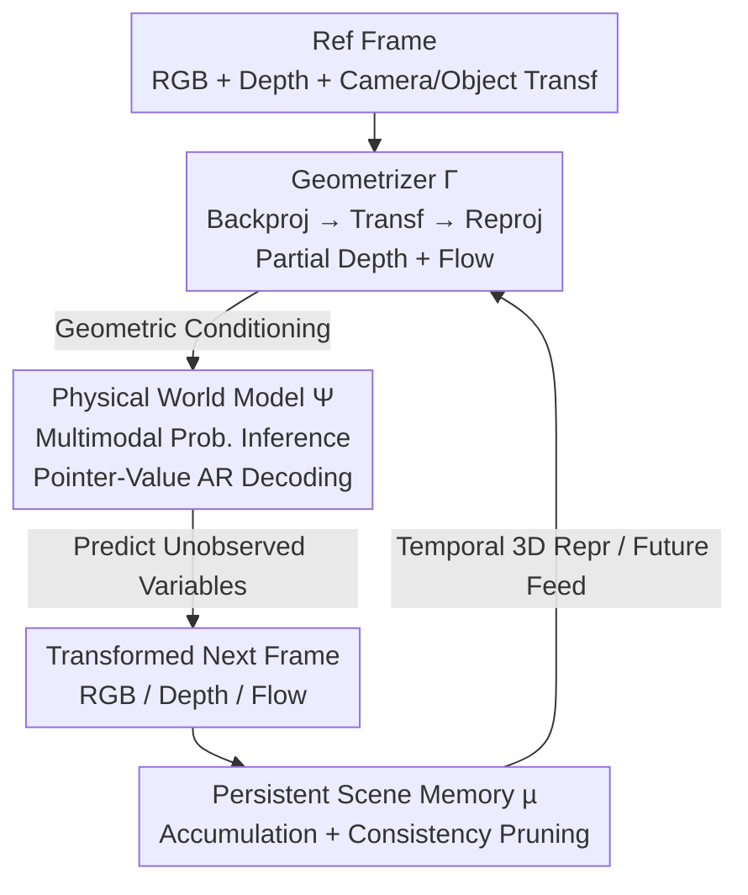

# P3Sim: Perceptual 3D Simulation with Physical World Modeling

**Conference**: CVPR 2026  
**Paper**: [CVF Open Access](https://openaccess.thecvf.com/content/CVPR2026/html/Lee_Perceptual_3D_Simulation_With_Physical_World_Modeling_CVPR_2026_paper.html)  
**Code**: None  
**Area**: 3D Vision / World Models  
**Keywords**: Perceptual 3D Simulation, World Models, Probabilistic Graphical Models, Autoregressive Sequence Modeling, Geometric Conditioning

## TL;DR
P3Sim models "predicting scene evolution from a single image" as probabilistic inference over multimodal scene variables (RGB / depth / optical flow). Utilizing a 7B autoregressive Transformer with pointer-value sequences for random-access decoding, combined with a geometric conditioning module and persistent scene memory, the system supports Novel View Synthesis (NVS), rigid/deformable manipulation, collisions, and multi-agent prediction, outperforming specialized baselines in NVS and 3D object manipulation benchmarks.

## Background & Motivation

**Background**: In ideal simulators like game engines, predicting how a scene evolves after a 3D transformation is straightforward, as the system possesses complete knowledge of geometry, materials, and physical dynamics. Achieving the same from raw images is a core objective of vision, graphics, and robotics, enabling applications like controllable video generation, interactive scene editing, and embodied reasoning.

**Limitations of Prior Work**: Existing methods are fragmented and suffer from significant drawbacks. Diffusion models for NVS (e.g., Zero-1-to-3, ViewCrafter, SEVA) exhibit unstable camera control and inflexible 3D transformations. Drag-based object editing (e.g., DragAnything, Diffusion Handles) relies on inverting real images into the Stable Diffusion latent space, which often fails. Trajectory or world model-based methods (e.g., Genie, GAIA-1, OpenVLA) use action conditions that are primarily semantic and do not enforce geometric consistency.

**Key Challenge**: Real-world perception is **inherently partial and incomplete**—large areas are occluded or unobserved, and complete 3D structures cannot be calculated directly once objects or cameras move. Local actions (lifting a corner of a cloth, pushing an object) reveal only a fraction of the global consequences. Consequently, three challenges arise: ① Geometry and transformations are only partially known, requiring **inference under uncertainty**; ② Certain priors (projective geometry, motion constraints) should be hard-coded while others (scene common sense) should be learned, necessitating a **balance between built-in geometric structures and learned knowledge**; ③ Perception-prediction must **run online**, updating continuously with new observations, which requires a persistent memory mechanism.

**Goal**: To build a unified system capable of simulating physically consistent scene evolution even when "geometric incompleteness" and "incomplete transformation signals" co-exist.

**Core Idea**: Treat both perception and simulation as probabilistic inference on a multimodal Scene Variable Probabilistic Graphical Model (PGM). Recast this PGM into a GPT-style autoregressive task using pointer-value sequences, thereby grafting "structured probabilistic reasoning" onto "large-scale generative models."

## Method

### Overall Architecture
P3Sim consists of three coordinating components: the **Physical World Model $\Psi$**, the **Geometrizer $\Gamma$**, and the **Persistent Scene Memory $\mu$**. Given a reference frame (RGB and depth) along with user/agent-specified camera poses and 3D object transformations, $\Gamma$ "translates" these transformations into explicit geometric evidence (partial depth and optical flow of the target frame). $\Psi$ treats this evidence alongside observed scene variables as conditions to probabilistically predict the unobserved or uncontrolled portions of the scene, rendering the transformed next frame. $\mu$ accumulates predictions from each frame into a global coordinate system, pruning geometry that contradicts new observations to maintain a temporally consistent 3D representation. Thus, the data-driven $\Psi$ provides flexibility, the hard-coded $\Gamma$ provides inductive bias, and $\mu$ ensures online consistency.

### Key Designs

**1. Physical World Model $\Psi$: Converting 3D Simulation into Probabilistic Inference**

A scene is represented as a set of random variables $\{x_p\}_{p\in P}$, where a pointer $p$ indexes a local scene element (spatial location + time + modality) and a value $v\in V$ encodes RGB, depth, or flow content. The observed state is a partial function $X:\mathrm{dom}(X)\subseteq P\to V$. The goal of $\Psi$ is to infer the conditional distribution of any unobserved variable: $\Psi:(X,\,p\notin\mathrm{dom}(X))\mapsto\{\Pr[(p,v)\mid X]\mid v\in V\}$. This essentially defines a PGM over scene variables.

Direct training is infeasible due to the combinatorial explosion of conditional subsets. The **Core Idea** is to rewrite it as **autoregressive sequence prediction**: serialize $X$ into interleaved pointer-value sequences $p_0,v_0,\dots,p_k,v_k$ and train a causal Transformer to model the distribution of the next value for any $p$. Unlike raster-order image generation, **pointer tokens allow the traversal order itself to be a controllable variable**, supporting random-access decoding. By selecting different multimodal subsets as conditions, the same formulation unifies geometric reconstruction, NVS, and motion prediction. The model is a 7B autoregressive Transformer; cross-entropy loss is applied only to content tokens.

**2. Geometrizer $\Gamma$: Translating Transformations into Geometric Evidence**

$\Gamma$ is a deterministic module that, given historical depth, intrinsics $K$, target pose $P_t$, and object transformations $\{\mathcal{T}_t^{(o)}\}$, outputs optical flow and sparse depth conditions: $(F_{t-1\to t},\,D_t^{\text{sparse}})=\Gamma(\{D_{0:t-1}\},K,P_t,\{\mathcal{T}_t^{(o)}\})$. 3D points from $D_{t-1}$ are transformed and reprojected to the target frame. Surfaces are validated based on the angle between the normal and view vector $\theta=\cos^{-1}(n\cdot(-v))<\theta_{th}$. In static scenes (NVS), it preserves rays hitting the surface before occlusion. In dynamic scenes with known motion, segmented objects are displaced with their "base grids" to maintain occlusion consistency. This ensures $\Psi$ receives physically consistent conditions rather than vague semantic prompts.

**3. Persistent Scene Memory $\mu$: Aggregating Per-frame Predictions into Consistent 3D Representations**

Per-frame inference can drift or conflict over time. $\mu_t$ stores surface elements, unobserved volumes, and 3D motion fields in a global coordinate system. Each step back-projects the frame geometry $\mathcal{G}_t=\text{BackProject}(D_t,T_t)$ and aligns it with memory via the motion field $\mathcal{M}_t$. Update $\mu_t=\text{Update}_\mu(\mu_{t-1},\mathcal{G}_t,\mathcal{M}_t,D_t,T_t)$ involves **two-way consistency checks**: projected old memory is compared against current observations to prune unobserved volumes that are now "closer" than observed depth, and new geometry is compared against historical views to prune structures denied by past observations. This mechanism supports scene-level mapping, object-centric completion, and amodal completion of occluded structures.

### Loss & Training
The 7B autoregressive Transformer is trained using next-token cross-entropy, **supervising only content tokens and not pointer tokens**. The training data consists of 3 million RGB video clips (approx. 1.4 trillion tokens). A batch size of 512 was used for 1.5M steps with a Warmup-Stable-Decay schedule, peaking at a learning rate of 3e-4. Sequence lengths started at 4096 and increased to 8192 in the final 20K steps.

## Key Experimental Results

### Main Results

NVS: Evaluated on the Reconfusion split of the SEVA benchmark across RE10K, LLFF, and DTU datasets using PSNR (higher is better).

| Dataset | ViewCrafter | SEVA | P3Sim (Ours) |
|---------|-------------|------|--------------|
| RE10K   | 20.88       | 18.11| **21.54**    |
| LLFF    | 10.53       | 14.03| **15.18**    |
| DTU     | 12.66       | 14.47| **15.50**    |

3D Object Manipulation: Evaluated on 3DEditBench for reconstruction quality (PSNR↑ / LPIPS↓) and Edit Adherence (EA↑).

| Model              | PSNR ↑    | LPIPS ↓   | EA ↑      |
|--------------------|-----------|-----------|-----------|
| DragAnything       | 15.13     | 0.443     | 0.517     |
| Diffusion Handles  | 17.82     | 0.344     | 0.619     |
| LightningDrag      | 19.52     | 0.184     | 0.722     |
| P3Sim (Ours)       | **23.12** | **0.121** | **0.827** |

### Key Findings
- Ours leads in PSNR across all NVS datasets, significantly improving scores on LLFF and DTU where ViewCrafter struggled. This suggests the combination of autoregression and explicit geometric conditioning is superior to pure diffusion for global scene coherence and camera control.
- In 3D object manipulation, Edit Adherence (EA) improved from 0.722 (LightningDrag) to 0.827. This indicates higher fidelity to specified 3D transformations, a direct benefit of avoiding Stable Diffusion latent space inversion.

## Highlights & Insights
- **Random-access decoding via pointer tokens**: Turning traversing order into a controllable variable allows the model to fit combinatorial PGM inference into the GPT training paradigm. One model naturally unifies reconstruction, NVS, and motion prediction.
- **Hard-coding when necessary**: Using deterministic projective geometry for conditions ($\Gamma$) and learned components for uncertainty ($\Psi$) balances hard-coded principles with data-driven knowledge at the module level.
- **Bi-directional consistency pruning**: This mechanism allows amodal completion and global mapping to emerge naturally from multi-view conflicts without requiring additional reconstruction networks.

## Limitations & Future Work
- Evaluation scope: Quantitative results are limited to NVS and 3D object manipulation. Complex capabilities like collisions and multi-agent dynamics are shown only through qualitative examples.
- Dependency on noisy inputs: The model relies on estimated depth and flow during training and assumes transformations are "known by task definition" during inference. Its performance in open-world scenarios with unknown motions remains to be fully verified.
- Computational cost: Training a 7B model on 1.4T tokens is expensive. Inference efficiency for long sequences in dense multi-object scenes was not extensively addressed.

## Related Work & Insights
- **vs. Diffusion NVS (ViewCrafter / SEVA)**: While diffusion models fill unobserved regions through sampling, they struggle with precise camera control. Ours achieves higher PSNR and robustness by using autoregressive random-access conditioning.
- **vs. Drag-based 3D Editing (DragAnything / LightningDrag)**: These methods often fail due to the inversion of real images into latent spaces. Ours bypasses inversion, performing local editing through the same probabilistic inference framework, leading to better EA and PSNR.
- **vs. World Models (Genie / GAIA-1)**: Previous world models often rely on semantic action conditions. Ours is perception-driven and uses depth and flow to enforce geometric consistency.

## Rating
- Novelty: ⭐⭐⭐⭐⭐ (Integrates PGM inference, random-access AR, and persistent memory into a unified simulator.)
- Experimental Thoroughness: ⭐⭐⭐ (Strong results on standard benchmarks, but qualitative for complex dynamics.)
- Writing Quality: ⭐⭐⭐⭐ (Clear division of components and well-explained formulations.)
- Value: ⭐⭐⭐⭐ (A significant step toward general physical world models with potential for controllable video and robotics.)

<!-- RELATED:START -->

## Related Papers

- [\[CVPR 2026\] 3D-IDE: 3D Implicit Depth Emergent](3d-ide_3d_implicit_depth_emergent.md)
- [\[CVPR 2026\] ActionMesh: Animated 3D Mesh Generation with Temporal 3D Diffusion](actionmesh_animated_3d_mesh_generation_with_temporal_3d_diffusion.md)
- [\[CVPR 2026\] Nope-SGS：从无位姿脉冲流重建 3D 高斯](3d_gaussian_splatting_from_unposed_spike_stream.md)
- [\[CVPR 2026\] AnchorSplat: Feed-Forward 3D Gaussian Splatting with 3D Geometric Priors](anchorsplat_feed-forward_3d_gaussian_splatting_with_3d_geometric_priors.md)
- [\[CVPR 2026\] 3D-Fixer: Coarse-to-Fine In-place Completion for 3D Scenes from a Single Image](3d-fixer_coarse-to-fine_in-place_completion_for_3d_scenes_from_a_single_image.md)

<!-- RELATED:END -->
