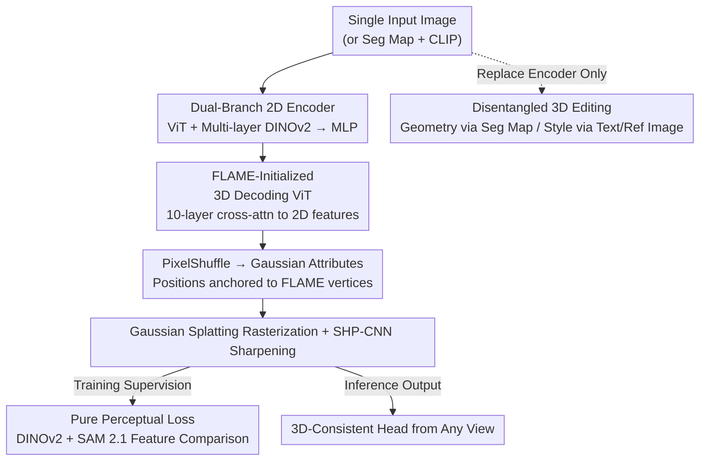

# PercHead: Perceptual Head Model for Single-Image 3D Head Reconstruction & Editing

**Conference**: CVPR 2026  
**Paper**: [CVF Open Access](https://openaccess.thecvf.com/content/CVPR2026/html/Oroz_PercHead_Perceptual_Head_Model_for_Single-Image_3D_Head_Reconstruction__CVPR_2026_paper.html)  
**Code**: https://antoniooroz.github.io/PercHead/ (Project page, containing training/inference code and interactive GUI)  
**Area**: 3D Vision  
**Keywords**: Single-image 3D Head Reconstruction, Perceptual Loss, DINOv2, Gaussian Splatting, Disentangled 3D Editing  

## TL;DR
PercHead reconstructs 3D-consistent heads from a single image that are robust to extreme viewpoints. The core mechanism is to discard pixel-level supervision such as L1/LPIPS, instead leveraging intermediate features of foundation models (DINOv2 + SAM 2.1) to construct a "pure perceptual loss." Combined with a ViT architecture (a 2D encoder and a 3D decoder initialized with a FLAME template, followed by Gaussian Splatting), it outperforms existing methods in LPIPS, DreamSim, and ArcFace on Ava-256 under extreme viewpoints. Furthermore, it easily extends to disentangled 3D editing ("geometry controlled by segmentation maps + style controlled by text/reference images") simply by replacing the encoder.

## Background & Motivation

**Background**: Reconstructing 3D heads from a single image is a gateway for applications like avatars, virtual telepresence, and controllable portraits. Mainstream pipelines are divided into several paradigms: 3DMM-mesh-based methods (e.g., ROME) offer geometric consistency but suffer from poor realism in complex regions like hair; GAN-based methods (e.g., EG3D, PanoHead, SphereHead) leverage large-scale 2D data and adversarial losses to achieve high realism, but suffer from difficult training and require latent inversion, which causes identity loss; Gaussian Splatting methods (e.g., GAGAvatar, LAM) are highly efficient and perform well in frontal views; multi-view diffusion methods (e.g., LGM) are highly generalizable but fail to deliver the high fidelity required for human heads.

**Limitations of Prior Work**: Almost all existing methods perform well near the input viewpoint but collapse when the camera moves significantly. There are two primary reasons for this. First, training data: real multi-view head datasets (e.g., NeRSemble) are either very small or synthetic (e.g., Cafca), while scaleable in-the-wild data is limited to single-view datasets (e.g., FFHQ), lacking viewpoint diversity. Second, supervision signals: humans are extremely sensitive to facial structure and appearance, but pixel-level accuracy in high-frequency regions like hair is impossible to predict from a single image. Low-level losses such as L1, SSIM, and LPIPS penalize "plausible but non-pixel-aligned" reconstructions as errors, providing noisy supervision in high-frequency regions, which leads to increasingly blurry results during training.

**Key Challenge**: 3D consistency requires large-scale multi-view priors, which are scarce for the human head domain. High fidelity requires strong supervision, yet pixel-level losses are detrimental in unobserved or high-frequency regions. These two constraints actively conflict with each other.

**Goal**: (1) Reconstruct a highly realistic head from an arbitrary input viewpoint that maintains 3D consistency even under extreme target views; (2) enable the general reconstruction model to extend to disentangled 3D editing with minimal cost.

**Key Insight**: The authors leverage the realization that since vision foundation models such as DINOv2 and SAM 2.1 already possess a "deep understanding" of images (capable of solving diverse tasks zero-shot), their intermediate features can compare rendered images and ground truth at a "perceptual/semantic level" rather than a pixel level, thereby providing more robust supervision in high-frequency regions such as hair.

**Core Idea**: Replace pixel-level losses with a "perceptual loss in the feature space of foundation models" to supervise 3D reconstruction, coupled with a ViT architecture to decouple 3D representations from 2D inputs, and leverage a hybrid training strategy of "multi-view + in-the-wild" data to simultaneously achieve 3D consistency and identity diversity.

## Method

### Overall Architecture
PercHead is a feed-forward pipeline that proceeds as "single image $\rightarrow$ 2D encoding $\rightarrow$ 3D Gaussians $\rightarrow$ rendering $\rightarrow$ sharpening." However, rather than using pixel-level differences between the rendered image and the ground truth during training, both are fed into frozen DINOv2 / SAM 2.1 models to compare their deep features. Specifically, the input image is first processed by a **dual-branch 2D encoder** (a trainable ViT + multi-layer DINOv2 features, concatenated and passed through an MLP, retaining only foreground patches) to obtain 2D features $F_{2D}$. In the decoder, 3D latent representations $F^0_{3D}$ are initialized from a FLAME template (up-sampled to 65k vertices, grouped into patches of 16 adjacent vertices each). A 10-layer decoding ViT repeatedly applies cross-attention to $F_{2D}$ to "complete" the 3D information (notably, **without using any self-attention** throughout). Then, PixelShuffle is used to expand each 3D patch into 16 Gaussian latent variables, which are linearly mapped to position, scale, rotation, opacity, and color. The positions are constrained offsets anchored at the FLAME vertices. After the Gaussian splatting rasterization generates the image, it passes through a **SHP-CNN** sharpening module. The entire pipeline is supervised by a **DINOv2 + SAM 2.1 perceptual loss**. For editing, the encoder is replaced with a "segmentation map + CLIP embedding," and the remaining weights are fine-tuned from the reconstruction model.

### Key Designs

**1. Dual-Branch 2D Encoding + Self-Attention-Free 3D Decoding: Decoupling 3D Representations from 2D Inputs**

The limitation of Gaussian Splatting methods (e.g., GAGAvatar, LAM) is that they directly "lift" Gaussians from 2D feature maps, tightly coupling the 3D representation with the input viewpoint, which collapses when the viewpoint changes. PercHead adopts a ViT architecture, allowing the 3D latent representation to exist independently and query the 2D features. On the encoder side, in addition to the "multi-layer DINOv2 features" validated by LAM, a trainable ViT branch is added to provide task-specific reconstruction features. The two branches have the same number of patches, which are concatenated and passed through an MLP: $F_{2D}=\mathrm{MLP}\big(\{F^i_{ViT},F^i_{DINOv2}\}_{i=1}^{|P|}\big)$, retaining only foreground patches. On the decoder side, $F^0_{3D}$ is initialized from a FLAME template, and updated layer-by-layer at the $i$-th layer as $F^i_{3D}=F^{i-1}_{3D}+\mathrm{MLP}_i\big(F^{i-1}_{3D}+\mathrm{ATTN}_i(F^{i-1}_{3D},F_{2D})\big)$. A key observation is that each 3D latent variable represents a local vertex group. Combined with the global context from the 2D features, **cross-attention alone is sufficient to reconstruct a coherent 3D head**, without requiring self-attention between 3D patches. This reduces computational cost while reinforcing the inductive bias that "3D structures are assembled locally from templates." The position prediction is anchored to the FLAME vertices: $X=X_{FLAME}+\mathrm{Tanh}(\mathrm{Linear}(F_{Gaussian})\cdot s_{init})\cdot s_{max}$, where $s_{init}$ controls the movement magnitude in early stages, and $s_{max}$ limits the maximum offset of Gaussians from their anchors, preventing them from scattering wildly during early training.

**2. Pure Perceptual Loss: Supervised Only by Deep Features from DINOv2 + SAM 2.1, Discarding All Pixel-Level Losses**

This is the core contribution of the paper. Since the model must reconstruct large, unobserved regions, pursuing pixel-level accuracy in high-frequency areas like hair is unrealistic. Under such regions, L1/SSIM/LPIPS only provide noisy supervision, ultimately smoothing out details. Consequently, PercHead relies entirely on the cosine distance in the feature space of foundation models. For the DINOv2 loss, intermediate layers $L=\{8, 11\}$'s class tokens and patch tokens are used to compare the L2-normalized cosine similarity between the rendered image $I_r$ and the ground truth $I_{gt}$: $L_D=\frac{1}{|L||T_D|}\sum_{l\in L}\sum_{t\in T_D}\big(1-CD_{l,t}(I_r)\cdot CD_{l,t}(I_{gt})\big)$, where $CD_{l,t}(I)=\mathrm{DINOv2}_l(I)_t/\lVert\mathrm{DINOv2}_l(I)_t\rVert_2$. Different layers serve different purposes: intermediate layers improve sharpness, while later layers focus on semantic concepts such as glasses and hair. The SAM 2.1 loss compares the **intermediate image encoding** (instead of the segmentation map itself): $L_S=\frac{1}{|T_S|}\sum_{t\in T_S}\big(1-\frac{\mathrm{SAM2.1}(I_r)_t\cdot\mathrm{SAM2.1}(I_{gt})_t}{\lVert\mathrm{SAM2.1}(I_r)_t\rVert_2\lVert\mathrm{SAM2.1}(I_{gt})_t\rVert_2}\big)$, encouraging the model to correctly "segment" details. The total loss consists of only these two terms: $L=\lambda_D L_D+\lambda_S L_S$, with $\lambda_D=\lambda_S=1.0$, shared across both the reconstruction and editing pipelines. The only exception is SHP-CNN, which is supervised by the DINOv2 8th-layer class token (empirically found to yield the sharpest results). Both foundation models use distilled smaller versions, totaling only 67M parameters. This loss acts as a plug-and-play replacement for standard losses, challenging the convention that "3D reconstruction must be trained with L1/LPIPS."

**3. 3D Consistency Training: Multi-View Data for Consistency, In-The-Wild Data for Diversity**

The authors require the model to be robust to three aspects: (1) self-consistent 3D representations, (2) robustness to profile view inputs, and (3) robustness to diverse identities. The first two are achieved via multi-view data: NeRSemble provides 270 real identities $\times$ 16 views, and Cafca provides 1500 synthetic subjects $\times$ 30 views (including back-of-head views, filtered using GAGAvatar Track's face detector). During training, the diversity of input views forces the model to handle profile faces, while comparisons against three additional target views enforce completion performance on unobserved regions. The third is addressed using in-the-wild FFHQ data—but using only 3k images (rather than the full 70k, with occluded samples filtered out), which is sufficient to make the model robust to extreme OOD inputs without disrupting 3D consistency. This strategy of "using a small amount of real in-the-wild data to add realism" is a key design choice verified in the ablation studies: pure 2D data completely fails to reconstruct 3D heads, whereas pure multi-view data cannot preserve input lighting due to monotone studio illumination. Mixing both yields the optimal result.

**4. Disentangled 3D Editing: Replacing the Encoder Only, Disentanglement Emerges Naturally**

To extend the general reconstruction model to editing, PercHead only alters the encoder, replacing the single-image input with two inputs: a 19-channel FaRL segmentation map (controlling geometry) + a single CLIP embedding (controlling style), formulated as $F_{Geom+Style}=\mathrm{MLP}\big(\{F^i_{ViT\text{-}Geom},F_{CLIP}\}_{i=1}^{|P|}\big)$. The rest of the pipeline is initialized with reconstruction weights and fine-tuned. Notably, the **disentanglement of geometry and style emerges naturally** without any auxiliary regularizations or constraints. The training data reuses the reconstruction dataset (excluding Cafca to prevent generating synthetic-looking faces), where the same image is fed to both CLIP and the model during training. During inference, the segmentation map controls the geometry (supporting hand-drawn edits in the GUI), while style can be controlled either by a reference image or **zero-shot** via text prompts utilizing the CLIP text encoder. Even though only images are used as style conditions during training, CLIP's aligned vision-language latent space enables the interpretation of text edits, adjusting both low-level attributes (e.g., hair color, curliness) and high-level concepts (e.g., age). Unlike LAM, which performs edits in 2D and then lifts them to 3D, PercHead directly attends to the segmentation map and CLIP features within the 3D space, which provides more direct control and lower computational cost.

### Loss & Training
The final objective is $L=\lambda_D L_D+\lambda_S L_S$ ($\lambda_D=\lambda_S=1.0$), without any adversarial loss, diffusion processes, or pixel-level losses. The SHP-CNN module is supervised independently by the DINOv2 8th-layer class token. The reconstruction and editing models share the same loss formulation, and the editing model is fine-tuned from the reconstruction weights.

## Key Experimental Results

### Main Results
Evaluated on the completely unseen Ava-256 dataset across two tasks: novel-view synthesis and extreme-view synthesis (rendering horizontal profile views, which tests the model's ability to make plausible predictions over large unobserved regions). Metrics include PSNR/SSIM (reconstruction), LPIPS/DreamSim (perceptual quality), and ArcFace distance (identity preservation, lower is better).

| Task | Method | PSNR↑ | SSIM↑ | LPIPS↓ | DSim↓ | ArcFace↓ |
|------|------|-------|-------|--------|-------|----------|
| Novel | PanoHead | 14.8 | 0.687 | 0.314 | 0.106 | 0.358 |
| Novel | GAGAvatar | 15.9 | **0.743** | 0.274 | 0.114 | 0.348 |
| Novel | LAM | 13.8 | 0.695 | 0.353 | 0.143 | 0.406 |
| Novel | **Ours** | **16.4** | 0.691 | **0.269** | **0.092** | **0.292** |
| Extreme | PanoHead | 14.2 | 0.658 | 0.349 | 0.131 | 0.416 |
| Extreme | GAGAvatar | 13.5 | 0.694 | 0.364 | 0.183 | 0.523 |
| Extreme | LAM | 11.4 | 0.634 | 0.455 | 0.219 | 0.568 |
| Extreme | **Ours** | **15.9** | 0.678 | **0.291** | **0.106** | **0.282** |

PercHead leads comprehensively in PSNR, LPIPS, DreamSim, and ArcFace; it only slightly underperforms GAGAvatar in SSIM, but sweeps all other metrics that align more closely with human perception and identity preservation. The gap is even more pronounced under extreme viewpoints: from novel to extreme views, the strongest baseline, PanoHead, deteriorates significantly across LPIPS, DreamSim, and ArcFace, whereas PercHead's ArcFace remains at 0.282 (with the extreme view slightly outperforms its own novel-view score of 0.292), demonstrating outstanding robustness. Qualitatively, PanoHead exhibits mirroring artifacts, SphereHead shows inconsistent glasses/hair/face shapes across views, GAGAvatar loses details when transitioning from frontal to profile views, LAM lacks 3D Gaussian consistency, and LGM hallucinates distorted, bluish geometry. In contrast, PercHead maintains fine details and consistency even under large viewpoint changes.

### Ablation Study
Ablation studies conducted on the Ava-256 extreme-view dataset across three configurations: data resources, losses, and sharpening.

| Group | Configuration | PSNR↑ | LPIPS↓ | DreamSim↓ | ArcFace↓ |
|----|------|-------|--------|-----------|----------|
| Data | 2D Data | 6.5 | 0.643 | 0.436 | 0.752 |
| Data | Multi-View | 15.6 | 0.299 | 0.111 | 0.308 |
| Data | 2D + MV (Ours) | 15.9 | 0.291 | 0.106 | 0.282 |
| Loss | LPIPS+L1 | 15.9 | **0.285** | 0.115 | 0.300 |
| Loss | DINOv2 | 15.4 | 0.383 | 0.149 | 0.340 |
| Loss | SAM2.1 | 15.9 | 0.309 | 0.107 | 0.311 |
| Loss | DINOv2+SAM2.1 (Ours) | 15.9 | 0.291 | 0.106 | 0.282 |
| SHP | w/o SHP-CNN | 15.9 | 0.301 | 0.116 | 0.282 |
| SHP | with SHP-CNN (Ours) | 15.9 | 0.291 | 0.106 | 0.282 |

### Key Findings
- **Data mixing is indispensable**: pure 2D data yields a PSNR of only 6.5 and fails completely to reconstruct 3D heads; pure multi-view data produces crisp details but struggles to preserve input lighting; the hybrid 2D+MV approach achieves the best performance across all metrics.
- **Loss selection is a trade-off rather than a single-point optimum**: LPIPS+L1 achieves the lowest LPIPS (0.285, because it directly optimizes this metric), but scores significantly worse on DreamSim and ArcFace, qualitatively leading to over-smoothed results with lost details in hair and face regions. Pure DINOv2 yields slightly blurry results but maintains good hair fidelity; pure SAM 2.1 recovers facial regions well but cuts off hair details (due to segmentation-oriented encoding providing insufficient supervision on noisy hair areas). Combining both strikes the best balance between perceptual quality and identity preservation.
- **SHP-CNN only affects sharpness**: it improves LPIPS and DreamSim but has no impact on PSNR and ArcFace (identity), acting as a highly localized, lightweight sharpener.
- **Additional generalization**: despite being trained only on single frames, when applied frame-by-frame to VFHQ videos, the model maintains temporal geometric and appearance consistency (with only minor flickering in unobserved regions).

## Highlights & Insights
- **"Perceptual loss" taken to the extreme**: instead of adding a perceptual regularization term to standard losses, the paper **completely replaces all pixel-level losses with foundation model features**, utilizing only distilled, lightweight models (67M parameters in total). This "less is more" conclusion challenges the convention that 3D reconstruction requires L1/LPIPS, making it transferable to any reconstruction task where supervising high-frequency or unobserved regions is difficult.
- **Using SAM's intermediate image encoding instead of the segmentation map itself is highly clever**: it sidesteps the non-differentiable or coarse nature of segmentation masks, directly leveraging SAM's discriminative power on details, while mutually complementing DINOv2 (where one manages semantic fidelity and the other manages detail boundaries).
- **"No self-attention in 3D" at the architectural level is counter-intuitive but effective**: 3D latent variables only cross-attend to 2D features and are assembled locally. This saves computational resources while reinforcing the template's inductive bias, acting as a key source of 3D consistency.
- **Editing capability is achieved at virtually zero cost**: changing only the encoder allows disentanglement to emerge naturally, and zero-shot text editing is supported via the CLIP text encoder. This paradigm of reusing a "general reconstruction model" as a foundation model is highly inspiring.

## Limitations & Future Work
- The authors acknowledge three limitations: (1) it does not support expression transfer, making it difficult to animate avatars; (2) it lacks temporal understanding, resulting in slight flickering in unobserved regions when applied frame-by-frame to video; (3) lighting is baked into the reconstruction, making it difficult to adapt to new environmental illumination (no relighting).
- Editing is constrained by single CLIP embeddings, leading to limited identity preservation (though the identity remains consistent during the editing process). While geometric editing outperforms NeRFFaceEditing on large-scale modifications, it is inferior to NFE for small local edits.
- Peer observation: The evaluation primarily relies on the single unseen Ava-256 dataset for the main experimental tables, offering limited evidence of generalization breadth (NeRSemble unseen identities and VFHQ videos are relegated to the supplementary material). The advantage of pure perceptual loss in hair regions is mainly validated via qualitative figures, lacking a direct quantitative metric for high-frequency areas. Future directions: introducing lightweight temporal modules or explicit relighting decomposition, or replacing the single CLIP embedding style condition with high-capacity representations to improve identity preservation.

## Related Work & Insights
- **vs GAGAvatar / LAM (Gaussian Splatting-Based)**: These methods directly lift Gaussians from 2D feature maps, tightly coupling 3D with the input viewpoint, which collapses on profile/extreme views. PercHead decouples the 3D representation via ViT and cross-attention, significantly leading under extreme views in ArcFace (0.282 vs 0.523 / 0.568).
- **vs PanoHead / SphereHead (3D GAN-Based)**: These methods perform 360° head generation using tri-planes or spherical tri-planes, but reconstruction requires expensive latent inversion and often suffers from mirroring artifacts. PercHead uses feed-forward reconstruction without inversion, yielding superior identity preservation.
- **vs LGM (Multi-view Diffusion-Based)**: LGM is highly generalizable but struggles to deliver high fidelity for heads. PercHead focuses specifically on the head domain and leverages perceptual loss to achieve high realism.
- **vs LAM Editing**: LAM edits in 2D and then lifts to 3D, which requires high computational resources and offers weak control over 3D structures. PercHead directly attends to segmentation maps and CLIP features within the 3D space, providing more direct and computationally efficient control.
- **vs Existing DINOv2-based Loss Work**: Previous works mostly focus on 2D tasks or overlook intermediate representations. PercHead leverages multi-layer DINOv2 intermediate features and SAM 2.1 encodings to specifically improve the high-frequency consistency of 3D heads.

## Rating
- **Novelty**: ⭐⭐⭐⭐⭐ Formulates "pure foundation model perceptual loss" as the sole supervision for 3D reconstruction and demonstrates its efficacy in replacing all pixel-level losses, which presents a highly distinct perspective.
- **Experimental Thoroughness**: ⭐⭐⭐⭐ The main tables and three sets of ablation studies are solid and self-consistent, but the primary quantitative evaluation is limited to a single unseen dataset, with broader generalization evidence left in the supplementary materials.
- **Writing Quality**: ⭐⭐⭐⭐ The logic tracing motivation-method-ablation is clear, with complete formulations for losses and architecture; some fine-grained details (such as the GUI and videos) rely on the supplementary material.
- **Value**: ⭐⭐⭐⭐⭐ Achieves SOTA in single-image 3D head reconstruction with low-cost disentangled editing. The insight of "replacing pixel-level loss with perceptual loss" is highly transferable to broader reconstruction tasks.

<!-- RELATED:START -->

## Related Papers

- [\[CVPR 2026\] Feed-forward Gaussian Registration for Head Avatar Creation and Editing](feed-forward_gaussian_registration_for_head_avatar_creation_and_editing.md)
- [\[CVPR 2026\] RelightAnyone: A Generalized Relightable 3D Gaussian Head Model](relightanyone_a_generalized_relightable_3d_gaussian_head_model.md)
- [\[CVPR 2026\] FlexAvatar: Flexible Large Reconstruction Model for Animatable Gaussian Head Avatars with Detailed Deformation](flexavatar_flexible_large_reconstruction_model_for_animatable_gaussian_head_avat.md)
- [\[CVPR 2026\] GeoDiff4D: Geometry-Aware Diffusion for 4D Head Avatar Reconstruction](geodiff4d_geometry-aware_diffusion_for_4d_head_avatar_reconstruction.md)
- [\[CVPR 2026\] Skullptor: High Fidelity 3D Head Reconstruction in Seconds with Multi-View Normal Prediction](skullptor_high_fidelity_3d_head_reconstruction_in_seconds_with_multi-view_normal.md)

<!-- RELATED:END -->
