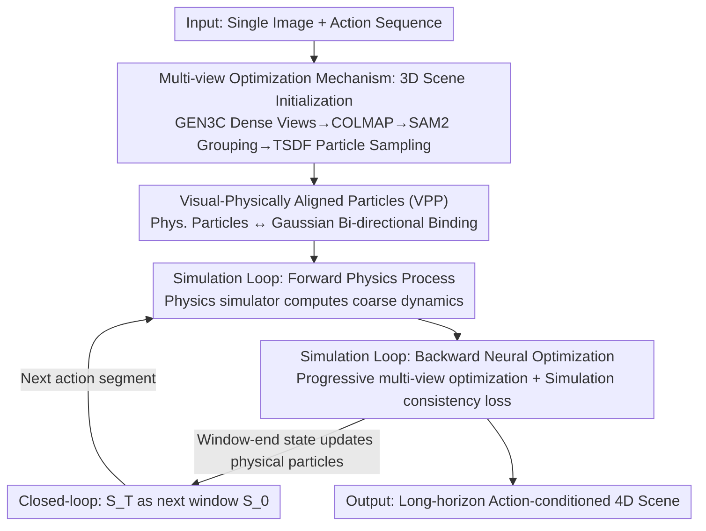

# PerpetualWonder: Long-horizon Action-conditioned 4D Scene Generation

**Conference**: CVPR 2026  
**Paper**: [CVF Open Access](https://openaccess.thecvf.com/content/CVPR2026/html/Zhan_PerpetualWonder_Long-horizon_Action-conditioned_4D_Scene_Generation_CVPR_2026_paper.html)  
**Area**: 3D Vision / 4D Scene Generation  
**Keywords**: 4D Scene Generation, Action-conditioned, Generative Simulator, Gaussian Splatting, Closed-loop Optimization

## TL;DR
PerpetualWonder proposes "Visual-Physically Aligned Particles" (VPP) as a unified representation that bi-directionally binds physical particles with Gaussian primitives. Combined with progressive multi-view optimization, it creates the first true closed-loop hybrid generative simulator—allowing visual corrections from video models to back-update physical states, enabling physically plausible 4D scene generation for long-horizon continuous actions starting from a single image.

## Background & Motivation

**Background**: Generating dynamic 4D scenes that "respond to actions" from a single image is a core capability for world models (VR/AR, gaming, embodied AI). Current mainstream approaches use **hybrid generative simulators**: a traditional physics simulator computes coarse, action-driven dynamics, and a video generation model acts as a "neural refiner" to add high-fidelity visual details, attempting to achieve both physical controllability and visual realism. A representative work is WonderPlay.

**Limitations of Prior Work**: Methods like WonderPlay can **only handle short-term interactions within a single time window** and fail at long-horizon continuous actions. The root cause is an **incomplete unidirectional** information flow: physical states can drive the video model, but results refined by the video model only flow back to the scene's **appearance representation**, rather than the underlying **physical state**.

**Key Challenge**: Physical representations (particle positions/velocities) and visual representations (Gaussian primitives) are **decoupled**. The physics simulator is "blind" to the generative corrections from previous steps. When a new action cycle begins, physical particles are reset to original positions rather than optimized ones, causing errors to accumulate over cycles—e.g., a sandcastle crumbling or distorting unnaturally after being poked by a shovel, breaking temporal continuity.

**Goal**: To enable the system to cycle **perpetually** between "user action → physical simulation → generative refinement." This requires solving two fundamental problems: (1) current physical states cannot be updated by video model corrections, necessitating a new representation that unifies the physical and visual domains; (2) to update this unified representation, video refinements must be **multi-view** to eliminate optimization ambiguity, yet video models do not naturally generate perfectly consistent videos from different views, requiring a robust update mechanism.

**Core Idea**: Utilize a set of "Visual-Physically Aligned Particles" to bind physical particles and Gaussians into a bi-directional bridge. This allows appearance optimization to back-correct dynamics, followed by progressive multi-view optimization to resolve ambiguity, thereby converting the open loop into a closed loop and supporting long-horizon sequential interactions.

## Method

### Overall Architecture
Given a single image $I$ and a sequence of user actions $\{A_t\}_{t=0}^{T-1}$ (global forces like gravity/wind $f(x,y,z,t)$ or local forces $f(t)$), PerpetualWonder outputs dynamic 4D scene sequences $\{S_t\}_{t=0}^{T}$. Each scene state $S_t=(B_t, F_t)$ is decomposed into a background $B_t$ and an interactive dynamic foreground $F_t$.

The system is a closed-loop hybrid generative simulator that iterates perpetually between a **forward physics process** $\Phi_p$ and a **backward neural optimization process** $\Psi_n$. The workflow is: reconstruct a 3D scene from the single image as the initial state → compute coarse dynamics for $T$ steps using a physics simulator (forward) → refine RGB/optical flow using a video model from multiple views and back-optimize VPP (backward) → update physical particles using optimized visual primitives and treat the window-end state $S_T$ as the next window's initial state $S_0$ (closed-loop) to connect the next action segment.

### Key Designs

**1. Visual-Physically Aligned Particles (VPP): Binding physical particles and Gaussians as a bi-directionally updatable bridge**

The key to the closed loop lies in the underlying representation. Previous hybrid simulators used **decoupled** sets—Gaussian Splatting for appearance and physical particles for dynamics—where binding was unidirectional (particles drove primitives). Consequently, visual corrections from video models never reached the underlying dynamics. **Ours** treats each physical particle $p_j$ as an anchor point, attaching $K$ Gaussian primitives $\{g_{j,k}\}$ so that physics and vision share the same set of optimizable parameters. The position of each Gaussian is determined by a small learnable offset relative to the anchor particle:

$$\mu_{j,k} = p_j + \tanh(\tilde p_{j,k})\cdot\delta$$

where $\delta$ is the physical particle size defined during simulator sampling, and $\tanh$ constrains the offset within one particle size. Inspired by spatio-temporal representations, each Gaussian also carries spatial opacity $o_s$ and temporal opacity $o_t(t)$, with the latter parameterized by center time $\mu_t$ and duration $s_d$:

$$o_t(t)=\exp\left(-\frac{1}{2}\left(\frac{t-\mu_t}{s_d}\right)^2\right),\quad o(t)=o_s\times o_t(t)$$

Thus, all dynamics and appearance are expressed by optimizable visual primitives. During the forward pass, the physical process updates $p_j$, moving all anchored Gaussians; during the backward pass, optimizing properties of $\{g_{j,k}\}$ corrects the final 4D scene under the "anchor particle" constraint—this bi-directional bridge is the foundation of the closed loop.

**2. Multi-view Optimization Mechanism: Reconstructing 3D scenes for arbitrary viewpoints followed by progressive multi-view supervision**

VPP provides an "updatable" representation, but **how to update consistently** remains difficult. WonderPlay only uses single-view video refinement for optimization, leading to ambiguity and artifacts from new views. **Ours** uses a two-step approach. The first is **3D scene initialization**: using the camera-controllable video model GEN3C to synthesize dense surrounding views (242 views used in implementation), COLMAP generates point clouds to initialize 3D Gaussians. Following Gaussian Grouping, each Gaussian is assigned a learnable feature, and SAM2 is used for object mask supervision across views to split the scene into background and foreground object sets. Foreground objects are converted to closed meshes via TSDFusion, and initial physical particles $P_0$ are sampled from within the meshes. Unlike WonderPlay's single-view depth back-projection, this builds the background and all objects in a **unified 3D coordinate system**, providing the prerequisite for arbitrary dense-view rendering.

The second is **progressive multi-view optimization**. Coarse 4D scenes are rendered into RGB and optical flow, then fed into a video generation model for refinement via dual-modality control to produce $V_t$. Since refined videos from different views are naturally inconsistent, they cannot be used for optimization directly. To address this, an overall loss with foreground masks $M$ is designed (separate L1+SSIM photometric loss $\mathcal{L}_p$ for foreground/background with consistency regularization), and a simulation consistency loss is introduced:

$$\mathcal{L}_{sim}=\frac{1}{T\cdot J}\sum_{t=1}^{T}\sum_{j=1}^{J}\left\|p_{j,t}-\frac{1}{K}\sum_{k=1}^{K}\mu_{j,k,t}\right\|_2^2$$

This penalizes visual primitives $\mu_{j,k,t}$ from drifting away from their corresponding physical particles $p_{j,t}$, acting as a strong regularizer to prevent visual primitives from "falling apart" from physical anchors. Furthermore, a **progressive strategy** is used: first optimizing only the video from the input image view, then refining other views with smaller control weights, and finally jointly optimizing all refined views to resolve ambiguity.

**3. Simulation Loop and Closed-loop: Writing optimized visual primitives back to physical particles for subsequent actions**

With VPP and multi-view optimization, a perpetual simulation loop is assembled. Each time window includes three phases. **Forward process**: starting from state $S_0$, physical operators are applied for each action $\hat S_{t+1}=\Phi_p(\hat S_t, A_t)$ to compute the coarse sequence $\{\hat S_t\}$. A suite of solvers covers materials including cloth, sand, snow, liquids, smoke, elastoplasts, and rigid bodies. **Backward optimization**: the coarse sequence is fed into $\Psi_n$ for appearance and dynamics correction using the progressive multi-view optimization over $T$ steps, yielding the refined sequence $\{S_t\}$. The **closed-loop** is the key innovation: the refined end-state $S_T$ of the current window becomes the initial $S_0$ for the next. This is done by averaging the positions of optimized visual primitives $\{g_{j,k}\}$ at time $T$ to back-write the position $p_j$ of the corresponding physical particle; velocities are directly inherited from the original velocity at $T$ (since $\mathcal{L}_{sim}$ keeps position updates minimal). This step is what WonderPlay lacks—it resets Gaussians to original positions each window, creating discontinuity artifacts. In contrast, **ours** uses the corrected physical states $\{P_T, V_T\}$ as input for the next forward process, preventing error accumulation.

### Loss & Training
The overall loss is composed of background photometric loss, foreground photometric loss, and the simulation consistency loss $\mathcal{L}_{sim}$ with weight $\lambda_{sim}$. $\mathcal{L}_p$ uses L1+SSIM. Background Gaussians also carry learnable spatio-temporal opacity to capture secondary visual effects like shadows. Implementation-wise, each time window spans 392 physical simulation steps, outputting 49 video frames (sampled every 8 steps) at a resolution of H=704, W=1280. Progressive multi-view optimization uses three key views (Front, Left, Right) for supervision, with typical experiments spanning three time windows.

## Key Experimental Results

### Main Results
On 10 scenes covering diverse materials (cloth, rigid body, elastoplast, liquid, gas, granular), evaluation was performed using WorldScore metrics (Camera Ctrl=Controllability, 3D Consist=Consistency, Imaging=Image Quality):

| Method | Camera Ctrl | 3D Consist | Imaging |
|------|------|------|------|
| Wan2.2 | 59.73 | 65.35 | 67.03 |
| GEN3C | 80.29 | 61.69 | 66.25 |
| WonderPlay | 75.95 | 63.93 | 36.80 |
| Tora | 51.80 | 60.77 | 54.37 |
| Wan2.6 | 64.75 | 70.49 | 66.09 |
| DaS | 78.96 | 62.18 | 60.23 |
| Veo3.1 | 60.61 | 73.93 | 67.82 |
| **Ours** | **93.26** | **80.41** | 66.98 |

**Ours** significantly leads in camera controllability and 3D consistency while maintaining high-level imaging quality. Conditional video models generally either ignore camera instructions (Wan2.2) or are 3D-aware but fail to respond to actions (GEN3C objects remain static). WonderPlay can apply actions but its single-view optimization suffers from severe artifacts and geometric inconsistency under new views.

Human Preference (2AFC double-blind comparison, win rate of **ours** against baselines in dynamic realism):

| Against | Physics Plausibility | Motion Fidelity |
|------|------|------|
| over Wan2.2 | 74.1% | 71.8% |
| over GEN3C | 93.5% | 83.5% |
| over WonderPlay | 80.8% | 86.3% |
| over Veo3.1 | 62.0% | 70.8% |
| over Wan2.6 | 68.5% | 77.3% |
| over Tora | 83.5% | 85.3% |
| over DaS | 80.9% | 81.9% |

Approximately 70%~90% of participants preferred **ours** in both physical plausibility and motion fidelity.

### Ablation Study
Ablations focused on qualitative visualizations, investigating the roles of VPP representation and progressive multi-view optimization:

| Configuration | Phenomena | Explanation |
|------|---------|------|
| Full (VPP + Progressive) | Plausible dynamics, multi-view consistent | Full model |
| w/o VPP (Standard 3DGS) | Chaotic dynamics, visual artifacts | Unconstrained Gaussians only minimize photometric loss, detaching from physics |
| w/o Progressive (Direct multi-view) | Blurry textures, temporal flickers | Inconsistent supervisions from different views cause optimization conflicts |

### Key Findings
- **VPP is the foundation of dynamic correctness**: Removing VPP in favor of unconstrained standard 3D Gaussians causes primitives to detach from physical particles to minimize photometric loss, leading to chaotic dynamics. Binding visual primitives to physical anchors is essential for faithfully rendering "dynamics computed by physical solvers."
- **Progressive optimization is key to multi-view consistency**: Video generators hallucinate conflicting details from different views. Merging these supervisions at once pollutes the representation (blurring/flickering). The progressive strategy (single-view first, then others) resolves this ambiguity.
- **Long-horizon advantage comes from closed-loop write-back**: WonderPlay accumulates errors each window because it resets physical particles. **Ours** uses $S_T \to S_0$ state write-back to avoid accumulation, enabling stable support for four consecutive interaction cycles in complex scenes like sandcastles.

## Highlights & Insights
- **VPP bi-directional bridge is a true "closed-loop" switch**: Treating physical particles as anchors and Gaussians as optimizable hulls, and clamping offsets via $\tanh\cdot\delta$ within one particle scale, solves both "whether appearance optimization can write back to dynamics" and "whether write-backs cause primitives to disintegrate."
- **$\mathcal{L}_{sim}$ provides engineering convenience**: By restricting particle position updates to a small range, the closed-loop can directly inherit velocities without re-estimation, bypassing a difficult velocity estimation problem.
- **The "progressive multi-view supervision" concept is transferable**: Any optimization task using generative models as supervision that faces multi-source inconsistency (e.g., 4D reconstruction, controllable generation distillation) can leverage this progressive disambiguation strategy.
- **Rigorous WonderPlay++ baseline design**: Applying the multi-view reconstruction initialization of **ours** to the baseline isolates the contribution of the "unified representation + closed-loop," ensuring gains are not merely attributed to better initialization.

## Limitations & Future Work
- **Reliance on a long chain of pre-trained models**: GEN3C, COLMAP, SAM2, TSDFusion, video models, and physics simulators (Genesis) are interlinked. A failure in any stage (e.g., GEN3C hallucinations, COLMAP failure) propagates downstream, with high system complexity and computational cost.
- **Simplified closed-loop write-back**: Averaging positions and inheriting velocities relies on $\mathcal{L}_{sim}$ keeping displacements small. For violent actions or large deformations, this "small update" assumption may break, a boundary not fully explored.
- **Small evaluation scale**: Only 10 scenes and 3 time windows were used. Long-horizon performance is mostly qualitative. Quantifying error accumulation over longer durations (e.g., dozens of cycles) is needed.
- **Physical fidelity constrained by priors**: Solvers use simplified physics, and video models provide "realistic-looking" rather than "strictly physical" results. The physical correctness lacks objective metrics beyond human preference.

## Related Work & Insights
- **vs WonderPlay (Most related Hybrid Generative Simulator)**: WonderPlay also uses "coarse dynamics + video refined appearance" but with decoupled representations and unidirectional flow, limiting it to short-term interactions. **Ours** upgrades this to a closed-loop system supporting long-horizon sequential actions through VPP and state write-back, improving 3D consistency (80.41 vs 63.93).
- **vs Conditional Video Generation (Wan2.2 / GEN3C / Veo3.1 / Tora / DaS)**: These methods generate video directly but often ignore camera trajectories or fail to respond to actions. They lack explicit 3D representations, making it impossible to guarantee physically accurate action conditioning and 3D consistency. **Ours** operates on complete 3D representations, balancing precise physical interaction with consistent multi-view rendering.
- **vs Dynamic 4D Scene Generation (Dynamic NeRF/Gaussians)**: These often only replay pre-captured events or generate passive animations. **Ours** is distinct in being interactive and simulatable under user-defined action conditions.
- **vs Pure Physics Simulation**: Traditional physics is precise but lacks realism. **Ours** supplements with video model priors to achieve realism while retaining physical controllability.

## Rating
- Novelty: ⭐⭐⭐⭐⭐ First truly closed-loop hybrid generative simulator; the VPP unified representation and state write-back are substantial breakthroughs.
- Experimental Thoroughness: ⭐⭐⭐⭐ Extensive baselines and well-designed WonderPlay++ baseline, though scene count is limited and ablations lack numerical tables.
- Writing Quality: ⭐⭐⭐⭐⭐ Clear problem decomposition (two challenges → two components → simulation loop), with tight correspondence between motivation and method.
- Value: ⭐⭐⭐⭐⭐ Directly addresses the demand for "interactive long-horizon simulation" in world models/embodied AI; the closed-loop and progressive disambiguation ideas are highly transferable.

<!-- RELATED:START -->

## Related Papers

- [\[CVPR 2026\] MANSION: Multi-floor Language-to-3D Scene Generation for Long-horizon Tasks](mansion_multi-floor_language-to-3d_scene_generation_for_long-horizon_tasks.md)
- [\[CVPR 2026\] Grounded Latents for Entity-Centric 4D Scene Generation](grounded_latents_for_entity-centric_4d_scene_generation.md)
- [\[CVPR 2026\] Text–Image Conditioned 3D Generation](text-image_conditioned_3d_generation.md)
- [\[CVPR 2026\] Layered 4D-Rotor Gaussian Splatting: A Compressed Representation for Long Dynamic Scenes](layered_4d-rotor_gaussian_splatting_a_compressed_representation_for_long_dynamic.md)
- [\[CVPR 2026\] tttLRM: Test-Time Training for Long Context and Autoregressive 3D Reconstruction](tttlrm_test-time_training_for_long_context_and_autoregressive_3d_reconstruction.md)

<!-- RELATED:END -->
