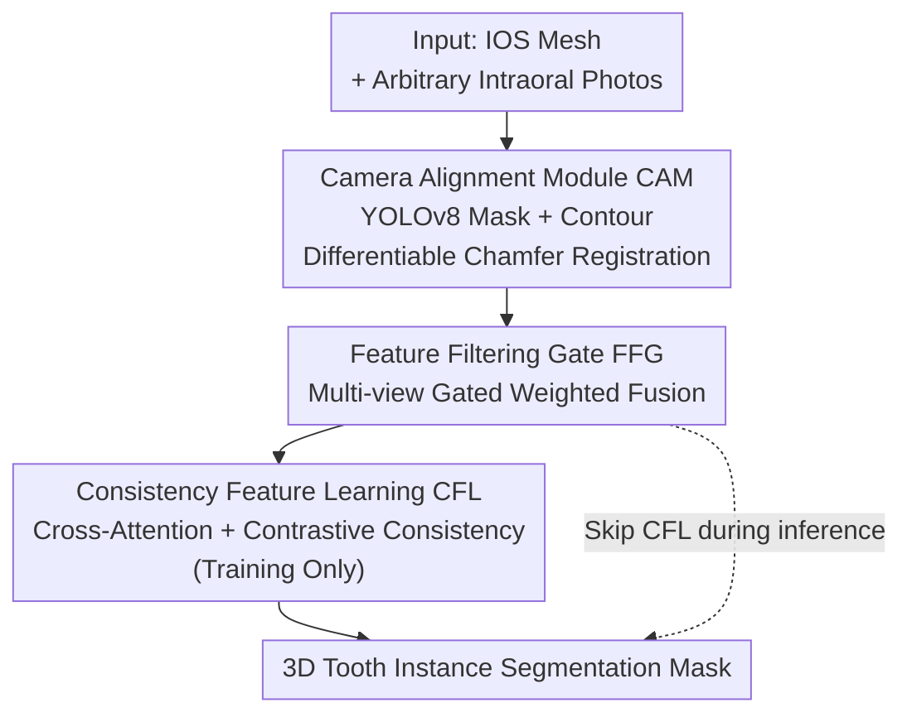

# Photo-Guided Tooth Segmentation on 3D Oral Scan Model

**Conference**: CVPR 2026  
**Paper**: [CVF Open Access](https://openaccess.thecvf.com/content/CVPR2026/html/Zhuang_Photo-Guided_Tooth_Segmentation_on_3D_Oral_Scan_Model_CVPR_2026_paper.html)  
**Code**: To be confirmed (the paper states the dataset will be made public)  
**Area**: 3D Vision / Segmentation / Cross-modal  
**Keywords**: Tooth segmentation, intraoral scan, cross-modal fusion, multi-view, contrastive learning

## TL;DR
PMTSeg, for the first time, feeds intraoral photos as "texture add-ons" to the tooth segmentation network of 3D intraoral scan (IOS) models. It aligns photos to the 3D mesh via a differentiable camera alignment module, adaptively fuses an arbitrary number of photos using a gated mechanism, and propagates semantics from visible to invisible regions via contrastive consistency. This approach achieves a new SOTA of 96.17 mIoU / 92.53 B-IoU, particularly excelling in geometrically challenging areas such as interproximal contacts and tooth-gingiva interfaces.

## Background & Motivation
**Background**: Tooth segmentation on Intraoral Scan (IOS) models is relatively mature. The mainstream methods consist of point cloud-based (PointNet++ family) and mesh-based approaches, both of which are meticulously designed to exploit the **geometric features** of teeth and dental arches for tooth recognition and instance-level segmentation.

**Limitations of Prior Work**: The issue lies in the fact that IOS models are almost entirely "colorless". First, many clinics employ a workflow of "impression-gypsum-3D scan", resulting in monochrome, textureless surfaces. Second, even if the scanner supports textures, they are often lost during export or format conversion. Consequently, existing methods only learn geometric details and ignore appearance information. However, when encountering **interproximal contacts** and the **tooth-gingiva interface**, local shape cues become extremely weak, making them geometrically indistinguishable—whereas these boundaries are easily recognizable in photos.

**Key Challenge**: Purely geometric methods inherently lack the dimension of "visual prompts". Conversely, intraoral photos are high-resolution, rich in color and shadowing, easily captureable using smartphones in clinical settings, and straightforward to annotate. The two modalities are complementary, yet no prior work has successfully "injected" photo textures into the learning process of 3D segmentation networks. Existing cross-modal dental research (such as registration of IOS crowns with CBCT, or orthodontic displacement monitoring utilizing photos) focuses solely on **alignment at the geometric level**, without enabling mutual feature learning across different modalities.

**Goal**: The goal is to inject intraoral photos as external guidance into the IOS segmentation backbone, with support for **an arbitrary number of photos and arbitrary viewpoints**. This requires addressing three sub-problems: (1) how to accurately align photos with the 3D model (uncalibrated camera, uncontrolled viewpoints and illumination); (2) how to adaptively select useful features while suppressing noise across multiple photos of varying quality; and (3) how to ensure that occluded/textureless regions benefit even though photos only capture visible tooth surfaces.

**Core Idea**: Utilizing a three-step pipeline of "alignment -> selective fusion -> consistency transfer", the semantic priors of 2D photos are migrated from visible points to invisible points to specifically solve segmentation under geometric ambiguity.

## Method

### Overall Architecture
PMTSeg takes an IOS mesh model and an arbitrary number of intraoral photos as input to output the tooth instance segmentation mask on the IOS. The entire pipeline consists of three sequentially dependent steps: first, the **Camera Alignment Module (CAM)** estimates the camera intrinsics and extrinsics for each photo, projecting 3D points onto the 2D image plane to establish "point-pixel" correspondences; second, the **Feature Filtering Gate (FFG)** adaptively weights and fuses multi-view 2D features into the 3D representations; and during training, the **Consistency Feature Learning (CFL)** module is applied to help the network learn implicit correspondences between textures and geometry, generalizing this semantic compensation capability to regions unobserved by the photos. The 3D backbone is PointNet++, the 2D backbone is UNet, and the tooth masks on the photo side are provided by a pre-trained YOLOv8.

### Key Designs

**1. Camera Alignment Module (CAM): Differentiably Aligning Uncalibrated Photos onto 3D Meshes via Contour Chamfer Loss**

Photos taken under uncontrolled viewpoints and illumination are difficult to align directly with 3D geometry without explicit landmarks. The key insight of CAM is to **leverage the segmentation priors of both modalities** for alignment: for each photo $I_i$, a pre-trained YOLOv8 is first used to extract a precise 2D tooth mask $M_i^{2D}$, from which a contour point set $C_i$ (representing semantically meaningful tooth boundaries like edges and cusps) is extracted. The 3D model $M$ is also pre-processed to obtain a coarse tooth-gingiva binary segmentation $M_{3D}$, allowing only tooth vertices to participate in the alignment to avoid ambiguities caused by the gingiva. Given $N$ images and 3D vertices $\{P_j\}$, CAM estimates the intrinsics $K_i$ and extrinsics $\{R_i, t_i\}$ for each view, projecting the 3D points onto the image plane $\pi(K_i, R_i, t_i, P_j)$ using standard perspective projection. The alignment is optimized via a **differentiable Chamfer distance loss**, constraining the shape-level alignment between the projected tooth point set $P_i=\{(u_j^i, v_j^i)\}$ and the contour pixels $C_i$:

$$\mathcal{L}_{cam}^i = \frac{1}{|P_i|}\sum_{p\in P_i}\min_{c\in C_i}\|p-c\|_2^2 + \frac{1}{|C_i|}\sum_{c\in C_i}\min_{p\in P_i}\|c-p\|_2^2.$$

Optimizing this loss with respect to $\{K_i, R_i, t_i\}$ obtains stable geometric cues without explicit landmarks, achieving differentiable registration. The "pixel-vertex" mapping established in this step serves as the foundation for all subsequent feature propagation.

**2. Feature Filtering Gate (FFG): Gated Sigmoid for Adaptive View Selection and Weighted Fusion of Arbitrary Photos based on Geometric Context**

Since photos come from arbitrary views with differing illumination and occlusion conditions, treating all 2D features indiscriminately would introduce redundant or conflicting information. FFG addresses this by learning a **gated weight** for each 3D point: each registered image is passed through a shared 2D backbone to obtain a dense feature map $f_{2d}^i$, and the 3D points are projected to each image using CAM's camera parameters to establish pixel-level correspondences. The gating module computes for each visible point $p$:

$$w_i(p) = \sigma\big(\text{MLP}([f_{2d}^i(p), f_{3d}(p)])\big),$$

where $\sigma$ is the sigmoid function that squashes weight values into $[0,1]$, representing the confidence or relevance of the perspective relative to the local geometry $f_{3d}(p)$. The final fused features are obtained by concatenating the geometric features with the normalized weighted 2D features:

$$f'_{3d}(p) = \text{concat}\Big\{f_{3d}(p),\ \frac{w_i(p)}{\sum_{j=1}^N w_j(p)} f_{2d}^i(p)\Big\},$$

For invisible points $\bar p$ that are unobserved in the photos, the corresponding weighted 2D feature is set to 0. This learnable weighting mechanism essentially acts as an attention gate, allowing the network to dynamically emphasize the most useful views while suppressing noise from poor alignment. It natively supports an arbitrary number of input photos while selectively passing "consistent and meaningful" appearance information to the 3D pipeline, specifically improving the discrimination of adjacent teeth and fine gingival boundaries.

**3. Consistency Feature Learning (CFL): Migrating Texture Semantics from Visible to Invisible Points via Contrastive Consistency**

FFG can only enhance visible points captured by the photos; occluded or textureless invisible points $\bar p$ still do not benefit from the photo's semantic context. CFL (enabled only during training) resolves this migration issue via a **teacher-student contrastive** mechanism. The **teacher branch** performs cross-attention for each visible point to enhance its geometric features with image semantics:

$$f^t_{3d} = f_{3d} + \text{softmax}\Big(\frac{(W_q f_{3d})(W_k f_{2d})^\top}{\sqrt{d}}\Big)(W_v f_{2d}),$$

yielding texture-enhanced features $f^t_{3d}$ that merge geometry and appearance. The **student branch** is a learnable sub-network $S$ that predicts semantically-aware geometric features $f^s_{3d}=S(f'_{3d})$ **using only 3D information**. During training, a contrastive loss is utilized to align the student's $f^s_{3d}$ with the teacher's $f^t_{3d}$ on visible points:

$$\mathcal{L}_{con} = -\log\frac{\exp(\text{sim}(f^s_{3d}, f^t_{3d})/\tau)}{\sum_k \exp(\text{sim}(f^s_{3d}, f^t_{3d,k})/\tau)},$$

where $\text{sim}$ denotes cosine similarity, and the temperature is set to $\tau=0.1$. This effectively forces the sub-network $S$ to learn to encode 2D semantics within the 3D geometric space even in the absence of texture inputs. Consequently, during inference, $S$ can generate semantically rich features for occluded or textureless regions, enabling the 3D backbone to indirectly benefit from 2D supervision. This upgrades the photographic guidance from "local visible enhancement" to "globally coherent segmentation", which is the key differentiator of CFL compared to simple RPVNet-style fusion.

### Loss & Training
The segmentation loss utilizes cross-entropy + Dice: $\mathcal{L}_{seg}=\mathcal{L}_{ce}+\mathcal{L}_{dice}$. The total objective appends a consistency term to the segmentation loss: $\mathcal{L}_{total}=\mathcal{L}_{seg}+\lambda_{con}\mathcal{L}_{con}$, with $\lambda_{con}=0.5$. Adam optimizer is used with a learning rate of $1\text{e}{-3}$ and a batch size of 16. End-to-end training takes approximately 2.5 days on 4×RTX 3090 GPUs. YOLOv8 in the CAM is pre-trained on an in-house dataset.

## Key Experimental Results

### Dataset & Metrics
The authors constructed an in-house multi-modal dental dataset (due to the lack of public alternatives) containing 1,240 samples from 620 patients. Each patient sample consists of frontal, maxillary, and mandibular view photos, along with maxillary and mandibular meshes. It covers children to adults, with an even gender split, and includes many anomalous cases such as missing teeth, crowding, tooth damage, misalignment, microdontia, and orthodontic attachments. Photos were taken with a mix of professional cameras and smartphones. An 8:2 patient-level split was implemented to prevent data leakage. Evaluation metrics include mIoU, DSC (Dice Similarity Coefficient), and B-IoU (Boundary IoU, where vertices within a 2mm neighborhood containing multi-class labels are classified as boundary points).

### Main Results
Compared against geometric methods (MeshSegNet, TSGCNet), centroid-based two-stage methods (ATSL, DBGANet), the general-purpose strong backbone PTv3, the multi-view rendering method CrossTooth, and the autonomous-driving cross-modal method RPVNet, PMTSeg consistently achieves peak performance across all three metrics:

| Method | mIoU | DSC | B-IoU |
|------|------|------|-------|
| MeshSegNet | 81.41 ± 7.7 | 89.48 ± 6.6 | 67.90 ± 7.5 |
| TSGCNet | 74.20 ± 4.8 | 85.09 ± 3.3 | 59.78 ± 5.4 |
| DBGANet | 92.81 ± 2.0 | 96.26 ± 1.1 | 86.12 ± 2.9 |
| PTv3 | 90.30 ± 3.8 | 94.86 ± 2.2 | 82.76 ± 4.5 |
| CrossTooth | 86.73 ± 10.1 | 92.49 ± 7.3 | 77.61 ± 9.7 |
| RPVNet | 92.99 ± 2.6 | 96.35 ± 1.4 | 86.87 ± 3.7 |
| ATSL (Prev. SOTA) | 95.28 ± 1.7 | 97.57 ± 0.9 | 90.53 ± 2.9 |
| **PMTSeg (Ours)** | **96.17 ± 1.8** | **98.04 ± 1.0** | **92.53 ± 2.5** |

Compared to the second-best method, ATSL, the overall improvement is approximately +0.89 mIoU / +0.47 DSC, while **the boundary B-IoU leads ATSL by more than +2**, indicating that the tooth-tooth and tooth-gingiva borders are characterized much more sharply and robustly. Notably, although RPVNet also integrates images, it lacks consistency mechanisms like CFL, leaving regions unreached by photos (e.g., attachments/microdontia) relatively weak.

### Ablation Study
Two sets of ablations (viewpoint combination + modules) are presented in a unified table. "arch" refers to occlusal/arch photos, "front" refers to frontal photos, and the first row represents pure geometry without photos:

| FFG Photo Input | CFL | mIoU | DSC | B-IoU |
|------|------|------|------|-------|
| None (Pure Geometry) | - | 81.94 | 89.92 | 78.45 |
| arch | - | 92.58 | 96.13 | 86.33 |
| arch + front | - | 93.82 | 96.78 | 88.81 |
| arch + front | ✓ | 96.17 | 98.04 | 92.53 |

### Key Findings
- **Photos themselves provide the largest contribution**: Incorporating just a single occlusal photo causes mIoU/DSC/B-IoU to surge by 10.64% / 6.21% / 7.88% (from 81.94 to 92.58 mIoU), demonstrating that photographic semantics directly resolve ambiguities in geometrically low-contrast regions like gingival borders and tight touches.
- **Complementary multi-view info**: Adding frontal photos further enhances segmentation quality (particularly on anterior teeth and the gingival margin), validating that FFG successfully selects and fuses complementary multi-view information to achieve more comprehensive coverage than any single view.
- **CFL targets boundaries and invisible regions**: Enabling CFL alongside dual-view fusion yields a further gain of 2.35% / 3.72% in mIoU/B-IoU (with the boundary metric showing the largest improvement). It successfully propagates semantics from visible areas to occluded or textureless surfaces, producing smoother and more continuous tooth contours—fully validating the goal of transforming photo guidance into globally consistent segmentation.
- **Geometric methods fail on anomalous teeth**: MeshSegNet/TSGCNet show high variance on crowded/misaligned teeth (with standard deviations around 7.7 and 9.7), while centroid-based ATSL/DBGANet suffer from cascading errors once initial seed points are misplaced. By utilizing photo guidance, PMTSeg minimizes dependency on centroid seeds and reduces sensitivity to rendering quality.

## Highlights & Insights
- **Treating "lost textures" as pluggable modalities**: This effectively addresses a real-world clinical deployment paint point of IOS—scans are frequently monochromatic, but photos can easily be captured with smartphones. Rather than stubbornly optimizing purely on geometry, leveraging accessible 2D appearance as external guidance is highly practical and solves a genuine problem.
- **Differentiable alignment using contours of segmentation masks in CAM**: Avoiding reliance on manual landmarks, the model employs YOLOv8 tooth mask contour points combined with a Chamfer loss for shape-level registration. This converts the challenge of "uncalibrated 2D-3D registration" into an end-to-end optimizable sub-module while restricting alignment to tooth vertices to bypass gingiva ambiguities—a highly practical engineering trade-off.
- **The teacher-student contrast in CFL is a masterstroke**: The teacher module enhances visible points with photos, while the student module, relying solely on geometry, is forced to align with the teacher's features. Consequently, during inference, the student can produce rich semantic features for invisible regions without requiring photos. This paradigm of "distilling cross-modal knowledge into a uni-modal branch via contrastive consistency" can be transferred to any "multi-modal in training, uni-modal in inference" scenario (e.g., RGB-D training, depth-missing inference).
- **Support for an arbitrary number of photos/viewpoints**: The normalized weighted fusion in FFG is inherently insensitive to the number of input views, allowing clinical deployment with whatever number of photos are available, rendering it highly flexible.

## Limitations & Future Work
- **Limitations acknowledged by the authors**: Motion blur or optical distortion in photos, if not addressed by deblurring or calibration, will concurrently degrade CAM alignment and fused feature quality.
- **In-house dataset lacks public validation**: All comparisons are conducted on self-collected single-source data, lacking cross-validation on public benchmarks (e.g., Teeth3DS+), and thus generalization needs external verification; YOLOv8 is also pre-trained on the same dataset, presenting a risk of distribution coupling.
- **CFL only active during training, gains heavily depend on photo coverage**: The semantics of invisible regions rely entirely on prior extrapolation learned from visible areas during training. If a specific structure (such as impacted teeth or unique attachments) never appears in the photos, the transfer may fail.
- **Future Work**: The authors plan to fuse IOS segmentation with other imaging modalities, such as CBCT, to introduce root-level contexts and voxel priors. A direct improvement resides in jointly optimizing CAM's camera estimation and deblurring to enhance robustness under real-world smartphone photographs.

## Related Work & Insights
- **vs. Geometric Methods (MeshSegNet / TSGCNet / PTv3)**: These methods rely purely on mesh geometry and fail in regions with weak shape contrast, such as interproximal contacts and the tooth-gingiva interface. Our method additionally injects photographic appearance to specifically reinforce these regions, leading to a substantial margin in boundary B-IoU.
- **vs. Centroid-based Two-stage Methods (ATSL / DBGANet)**: These work by first predicting tooth centroids and then refining boundaries, causing cascading errors once crowding/occlusion/scan defects result in misplaced seeds. PMTSeg reduces dependency on centroid seeds via photographic semantics.
- **vs. Multi-view Rendering Method (CrossTooth)**: Although also attempting to introduce semantics, its performance is tightly coupled with rendering quality and mesh fidelity; crowded and misaligned topologies can contaminate the rendered views. Our method directly aligns real photos and leverages CFL to guarantee performance on invisible regions.
- **vs. Cross-modal Fusion (RPVNet)**: While fusing images and point clouds benefits from complementary appearances, it lacks consistency mechanisms, leaving regions unreached by photos weak. CFL acts as the critical key differentiator that addresses this issue.

## Rating
- Novelty: ⭐⭐⭐⭐ First to inject intraoral photographic textures into the learning process of 3D IOS tooth segmentation. The teacher-student contrastive transfer in CFL is a concrete, novel design.
- Experimental Thoroughness: ⭐⭐⭐⭐ Compared with 7 representative methods alongside thorough viewpoint/module ablations, with high self-consistency across all three metrics. Points were deducted due to validation solely being on an in-house single-source dataset, lacking cross-validation on public benchmarks.
- Writing Quality: ⭐⭐⭐⭐ Motivation-method-experiments are logically clear, with complete equations and figures, and distinct responsibilities among the three modules.
- Value: ⭐⭐⭐⭐ Direct hit on the real-world pain point of textureless IOS in digital dentistry. The method is highly practical and the dataset has been promised to be made public, holding practical significance for orthodontics/prosthesis design.

<!-- RELATED:START -->

## Related Papers

- [\[CVPR 2026\] Long-Tail Internet Photo Reconstruction](long-tail_internet_photo_reconstruction.md)
- [\[CVPR 2026\] Spatial Matters: Position-Guided 3D Referring Expression Segmentation](spatial_matters_position-guided_3d_referring_expression_segmentation.md)
- [\[CVPR 2025\] 3D Dental Model Segmentation with Geometrical Boundary Preserving](../../CVPR2025/3d_vision/3d_dental_model_segmentation_with_geometrical_boundary_preserving.md)
- [\[CVPR 2026\] LangRef3DGS: Natural Language-Guided 3D Referential Segmentation from Partial Observations via 3D Gaussian Splatting](langref3dgs_natural_language-guided_3d_referential_segmentation_from_partial_obs.md)
- [\[CVPR 2026\] NG-GS: NeRF-Guided 3D Gaussian Splatting Segmentation](ng_gs_nerf_guided_3d_gaussian_splatting_segmentation.md)

<!-- RELATED:END -->
