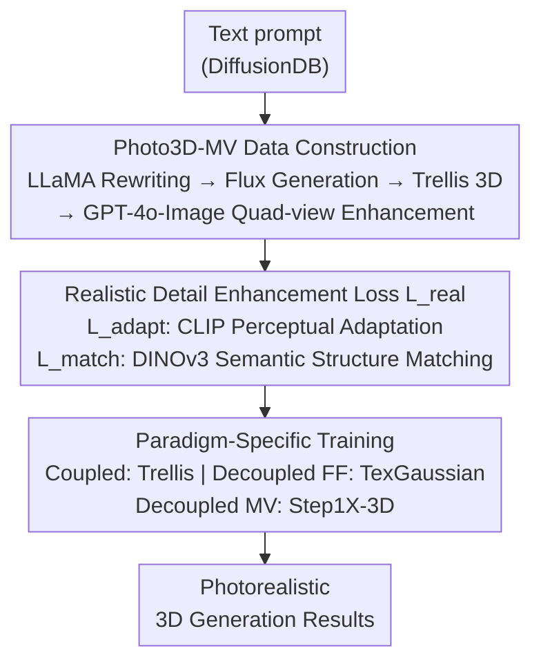

# Photo3D: Advancing Photorealistic 3D Generation through Structure-Aligned Detail Enhancement

**Conference**: CVPR 2026  
**Paper**: [CVF Open Access](https://openaccess.thecvf.com/content/CVPR2026/html/Liang_Photo3D_Advancing_Photorealistic_3D_Generation_through_Structure_Aligned_Detail_Enhancement_CVPR_2026_paper.html)  
**Code**: [Project Page](https://liangsanzhu.github.io/photo3d-page/)  
**Area**: 3D Vision / Diffusion Models  
**Keywords**: 3D Generation, Photorealism, Multi-view Dataset, Detail Enhancement, Structural Alignment

## TL;DR
Photo3D utilizes GPT-4o-Image to enhance 3D renderings into "structure-aligned, photorealistic" multi-views, constructing the Photo3D-MV dataset paired with 3D geometry. By employing a "relaxed detail enhancement loss" that combines CLIP-aware perceptual adaptation with DINOv3 semantic structure matching, it injects photorealistic appearance into three mainstream 3D-native generation paradigms without compromising geometric integrity, achieving SOTA photorealism.

## Background & Motivation

**Background**: 3D generation has transitioned from score-distillation and multi-view-based methods toward 3D-native paradigms—learning 3D distributions directly from large-scale 3D datasets for faster, more stable, and geometrically precise generation. 3D-native methods are categorized into geometry-texture coupled (joint learning) and geometry-texture decoupled (geometry generation followed by a separate texturing model).

**Limitations of Prior Work**: Existing large-scale 3D datasets consist almost entirely of synthetic assets, which differ significantly from real-world imagery. Limited real-scan 3D data often suffer from over-smoothed appearances and lack fine-grained textures due to representational capacity and scanner precision. Consequently, 3D-native generators typically produce textures with "synthetic colors and cartoonish qualities." Attempts to supplement appearance with real 2D images (like Real3D) using single-view cycle-consistency lack multiview constraints, leading to unstable geometry and poor realism from off-axis views. Synthetic multi-view generation (e.g., via GPT-4o-Image) lacks inherent consistency, causing texture flickering and structural drift, which biases multi-view finetuning towards synthetic 3D styles.

**Key Challenge**: There exists a tension between obtaining "realistic appearance" via 2D detail supervision and maintaining "structural consistency" using established 3D-native geometry. Strict pixel-level supervision forces misalignments between structure and texture when 2D details lack perfect multi-view consistency.

**Goal**: ① Construct multi-view training data that is both photorealistic and aligned with 3D geometry; ② Design a robust training scheme to enhance realistic details without damaging 3D structure; ③ Ensure the solution is universally applicable across different 3D-native paradigms.

**Key Insight**: Instead of forcing models to strictly align with every pixel, it is more effective to acknowledge the view-dependent detail variances in generated images and adopt a "relaxed" feature-level supervision. This approach aligns semantics and perception while delegating structural stability to the 3D-native geometry itself.

**Core Idea**: First, build a dataset using an "appearance-anchored and structure-aligned" synthesis pipeline. Second, apply a relaxed detail enhancement loss based on perceptual feature adaptation (CLIP) and semantic structure matching (DINOv3). Finally, tailor training strategies for coupled and decoupled paradigms.

## Method

### Overall Architecture
Photo3D follows a three-step process: First, Data Construction (Sec 3.1)—text prompts are rewritten using LLaMA-3 for realistic descriptions, Flux.1-Dev generates single views, Trellis creates 3D assets (structured latents/mesh/3DGS), and orthogonal views are rendered into a quad-view grid for GPT-4o-Image to perform "cross-view aligned detail enhancement," resulting in the Photo3D-MV dataset (10K objects across 373 LVIS classes). Second, Supervision Design (Sec 3.2)—using a relaxed photorealism loss $L_{\text{real}}$ composed of a CLIP-based perceptual adaptation loss $L_{\text{adapt}}$ and a DINOv3 semantic patch matching loss $L_{\text{match}}$. Third, Paradigm-Specific Training (Sec 3.3)—adapting this scheme to coupled (Trellis), decoupled feed-forward (TexGaussian), and decoupled multi-view (Step1X-3D) generators.

### Key Designs

**1. Structure-Aligned Multi-view Synthesis Pipeline + Photo3D-MV Dataset: Creating Aligned Training Data with GPT-4o-Image**

To address the lack of detail-rich real 3D assets, the authors synthesize data rather than relying on real scans (which suffer from varying scales, non-rigid motion, and limited precision). Text prompts from DiffusionDB are rewritten by LLaMA-3-8B into object-centric descriptions with realistic attributes. Flux.1-Dev generates a single-view image, which is processed by Trellis to generate 3D assets. Four orthogonal views of the 3DGS model are rendered into a quad-view grid and processed by GPT-4o-Image using a specialized refinement prompt ("preserve the original structure; refine details for higher realism"). Crucially, this is **appearance-anchored refinement** rather than "geometry-conditioned generation"—it refines existing 3D renderings, ensuring finer perceptual alignment with the 3D structure. The resulting Photo3D-MV dataset provides high-fidelity, 3D-aligned realism priors.

**2. Relaxed Realistic Detail Enhancement Loss: Avoiding Misalignment via CLIP and DINOv3**

Since four views are insufficient for full texture reconstruction and GPT-4o introduces view-dependent fluctuations, pixel-wise supervision is avoided. **Perceptual Adaptation** $L_{\text{adapt}}$ uses CLIP: random crops are taken from the synthesized image $I_{\text{syn}}$ and the ground truth $I_{\text{GT}}$ to capture fine-grained details in the shared embedding space: $L_{\text{adapt}}=\frac{1}{|C|}\sum_{c\in C}\big(1-\langle\phi(\tau_c(I_{\text{syn})}),\phi(\tau_c(I_{\text{GT}}))\rangle\big)$, where $\tau_c$ is a random crop and $\phi$ is the CLIP encoder. **Semantic Structure Matching** $L_{\text{match}}$ uses DINOv3: images are scaled to a unified resolution (e.g., $1024 \times 1024$) and passed through the backbone $\psi$ to obtain patch-level features. Each predicted token in $P$ is matched with the most semantically similar token in the target set $Q$: $L_{\text{match}}=1-\frac{1}{|P|}\sum_{p\in P}\max_{q\in Q}\langle f_p,f_q\rangle$. The total loss is $L_{\text{real}}=L_{\text{adapt}}+L_{\text{match}}$, where $L_{\text{adapt}}$ ensures "realistic appearance" and $L_{\text{match}}$ ensures "structural stability" via dense discriminative features.

**3. Paradigm-Specific Training: Adapting to Diverse 3D-Native Generators**

The $L_{\text{real}}$ is applied differently depending on the generator architecture. For **Coupled** (Trellis, diffusion-based): the 3D diffusion model predicts a clean latent $\hat{x}_0$, which is decoded into 3DGS and rendered for $L_{\text{real}}$ supervision. This allows the model to explore a larger generation space toward realistic targets. For **Decoupled Feed-forward** (TexGaussian): the model is treated as a texture optimizer conditioned on mesh and text, using $L_{\text{real}}$ to supervise the generated 3DGS. For **Decoupled Multi-view** (Step1X-3D): real multi-views are encoded into latents, and the model predicts noise conditioned on geometry renderings, where decoded results are supervised by $L_{\text{real}}$.

### Loss & Training
The core loss is $L_{\text{real}}=L_{\text{adapt}}+L_{\text{match}}$. Training is conducted on 8×NVIDIA H20 GPUs: Trellis (1.1B) for 100K steps (lr $1\times10^{-4}$); TexGaussian for 10K steps (lr $4\times10^{-4}$); and Step1X-3D for 10K steps (lr $1\times10^{-4}$). Input images are 512×512, with $L_{\text{match}}$ upsampled to $m=1024$ using AdamW.

## Key Experimental Results

### Main Results
Evaluated on real-scan datasets (GSO, Omni3D, DTC) and ImageNet. Metrics include **Fidelity** (CLIP↑, KID↓), **Realism** (MANIQA↑, MUSIQ↑), and **Aesthetics** (NIMA↑, Aesthetic Score↑).

| Dataset | Method | CLIP↑ | KID↓ | MANIQA↑ | MUSIQ↑ | NIMA↑ | Aes.↑ | Gemini Win%↑ | Human Score↑ |
|--------|------|-------|------|---------|--------|-------|-------|------|------|
| ImageNet | Trellis | 0.672 | 0.045 | 0.438 | 69.108 | 5.239 | 4.682 | 68.1 | 3.4 |
| ImageNet | **Photo3D (Trellis)** | **0.679** | **0.044** | **0.470** | **72.385** | **5.548** | **4.927** | **95.0** | **4.4** |
| Real 3D | Trellis | 0.853 | 0.002 | 0.427 | 64.155 | 4.653 | 4.481 | 70.6 | 3.9 |
| Real 3D | **Photo3D (Trellis)** | **0.864** | 0.002 | **0.459** | **65.724** | **4.856** | **4.689** | **93.8** | **4.8** |

### Ablation Study
Analysis of supervision components (based on Trellis on ImageNet):

| Configuration | CLIP↑ | KID↓ | MANIQA↑ | MUSIQ↑ | NIMA↑ | Aes.↑ |
|------|-------|------|---------|--------|-------|-------|
| **Ours ($L_{\text{adapt}}+L_{\text{match}}$)** | **0.679** | **0.044** | **0.470** | **72.385** | **5.548** | **4.927** |
| w/o $L_{\text{adapt}}$ | 0.668 | 0.054 | 0.308 | 61.681 | 4.726 | 4.579 |
| w/o $L_{\text{match}}$ | 0.671 | 0.048 | 0.409 | 71.069 | 5.400 | 4.897 |
| w/o all (Baseline) | 0.672 | 0.045 | 0.438 | 69.108 | 5.239 | 4.682 |
| w/ L2 loss | 0.598 | 0.195 | 0.346 | 55.281 | 4.782 | 4.225 |

### Key Findings
- **$L_{\text{adapt}}$ is the primary driver of realism**: Removing it causes MANIQA to drop from 0.470 to 0.308. 
- **Pixel-level supervision is counterproductive**: Using L2 loss leads to a complete collapse in quality, confirming that strict pixel constraints conflict with imperfectly consistent generated views.
- **Paradigm-agnostic versatility**: Improvements are consistent across coupled (Trellis) and decoupled (Step1X-3D, TexGaussian) frameworks.

## Highlights & Insights
- **"Relaxed Supervision" Philosophy**: Shifting from pixel alignment to feature-level (CLIP/DINOv3) alignment treats data inconsistency as a tolerable premise rather than a defect.
- **GPT-4o-Image as a "Detail Amplifier"**: Refinement via appearance anchoring preserves 3D alignment better than generating from scratch.
- **DINOv3 for Structural Correspondence**: Dense patch-level matching enables style/detail transfer without geometric destruction.

## Limitations & Future Work
- **Dependency on Closed-source GPT-4o-Image**: High costs and limited reproducibility due to API reliance.
- **Limited Coverage of Four Views**: Some self-occluding or complex objects may lack sufficient coverage.
- **Appearance Only**: The method enhances texture but cannot correct inherent errors in the underlying 3D-native geometry.

## Related Work & Insights
- **vs. Real3D**: Real3D lacks volumetric constraints, leading to geometric instability; Photo3D uses structure-aligned multi-views to stabilize geometry while enhancing realism.
- **vs. PBR Methods**: While PBR methods add lighting parameters, Photo3D directly improves the photorealistic quality of the generated 3D assets themselves.

## Rating
- Novelty: ⭐⭐⭐⭐ (Combination of relaxed feature supervision and appearance-anchored data synthesis is highly effective).
- Experimental Thoroughness: ⭐⭐⭐⭐ (Extensive benchmarks and user studies; lacks sensitivity analysis on the number of views).
- Writing Quality: ⭐⭐⭐⭐ (Clear logic and consistent framework).
- Value: ⭐⭐⭐⭐ (Solves the "geometrically correct but visually synthetic" bottleneck in 3D-native generation).

<!-- RELATED:START -->

## Related Papers

- [\[CVPR 2026\] Realiz3D: 3D Generation Made Photorealistic via Domain-Aware Learning](realiz3d_3d_generation_made_photorealistic_via_domain-aware_learning.md)
- [\[CVPR 2026\] mmWaveFlow: Unified Enhancement and Generation of mmWave Human Point Clouds](mmwaveflow_unified_enhancement_and_generation_of_mmwave_human_point_clouds.md)
- [\[CVPR 2026\] PointNSP: Autoregressive 3D Point Cloud Generation with Next-Scale Level-of-Detail Prediction](pointnsp_autoregressive_3d_point_cloud_generation_with_next-scale_level-of-detai.md)
- [\[ICLR 2026\] Quartet of Diffusions: Structure-Aware Point Cloud Generation through Part and Symmetry Guidance](../../ICLR2026/3d_vision/quartet_of_diffusions_structure-aware_point_cloud_generation_through_part_and_sy.md)
- [\[CVPR 2026\] REVIVE 3D: Refinement via Encoded Voluminous Inflated prior for Volume Enhancement](revive_3d_refinement_via_encoded_voluminous_inflated_prior_for_volume_enhancemen.md)

<!-- RELATED:END -->
## Related Papers

- [\[CVPR 2026\] Realiz3D: 3D Generation Made Photorealistic via Domain-Aware Learning](realiz3d_3d_generation_made_photorealistic_via_domain-aware_learning.md)
- [\[CVPR 2026\] mmWaveFlow: Unified Enhancement and Generation of mmWave Human Point Clouds](mmwaveflow_unified_enhancement_and_generation_of_mmwave_human_point_clouds.md)
- [\[CVPR 2026\] PointNSP: Autoregressive 3D Point Cloud Generation with Next-Scale Level-of-Detail Prediction](pointnsp_autoregressive_3d_point_cloud_generation_with_next-scale_level-of-detai.md)
- [\[CVPR 2026\] REVIVE 3D: Refinement via Encoded Voluminous Inflated prior for Volume Enhancement](revive_3d_refinement_via_encoded_voluminous_inflated_prior_for_volume_enhancemen.md)
- [\[CVPR 2026\] Breaking the 3D Dataset Bottleneck: Fast Scalable Generation of Aligned 3D Assets from Scratch for Category 6D Pose Estimation and Robotic Grasping](breaking_the_3d_dataset_bottleneck_fast_scalable_generation_of_aligned_3d_assets.md)

<!-- RELATED:END -->
