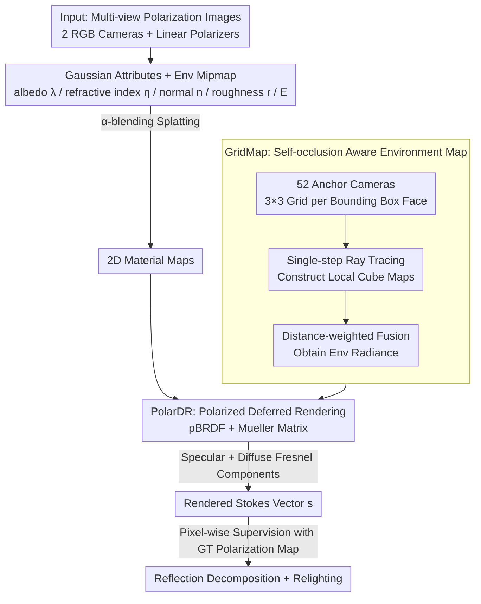

# PhyGaP: Physically-Grounded Gaussians with Polarization Cues

**Conference**: CVPR2026  
**arXiv**: [2603.14001](https://arxiv.org/abs/2603.14001)  
**Code**: Coming soon  
**Area**: 3D Vision  
**Keywords**: 3D Gaussian Splatting, Polarization Imaging, Inverse Rendering, Relighting, Reflection Decomposition, pBRDF, Environment Lighting

## TL;DR

PhyGaP is proposed to incorporate polarization cues into 2DGS optimization via Polarized Deferred Rendering (PolarDR) and introduces the self-occlusion-aware GridMap environment mapping technique to achieve accurate reflection decomposition and realistic relighting of glossy objects.

## Background & Motivation

1.  **Challenges in Reconstructing Reflective Objects**: 3DGS and its variants lack explicit geometric representation, and the splatting pipeline cannot simulate secondary light transport, resulting in limited ability to model glossy surfaces.
2.  **Insufficient Information in RGB Images**: Existing DR methods depend on precise estimation of normals, albedo, and roughness. However, standard RGB images do not encode these physical properties, leading to the failure of albedo and specular reflection decomposition.
3.  **Poor Relighting Quality**: Due to inaccurate reflection decomposition, existing methods often exhibit color shifts, unrealistic shadows, and surface discontinuities when changing lighting conditions.
4.  **Polarization Contains Rich Physical Information**: Specular reflection generates strong linear polarization, while diffuse reflection generates weak polarization with a 90° shift in polarization angle. Polarization cues are naturally suited to guide the learning of reflection properties.
5.  **Self-occlusion in Non-convex Objects**: Environment cube maps assume light sources at infinity and cannot handle self-occlusion and indirect lighting of non-convex objects, resulting in artifacts during relighting.
6.  **Existing Polarization Methods Lack Relighting Support**: PANDORA implicitly encodes the environment map, and PolGS does not decompose albedo; neither can achieve relighting through light replacement.

## Method

### Overall Architecture

PhyGaP addresses the inverse rendering of glossy/reflective objects: since standard RGB does not encode physical quantities like normals, albedo, and roughness, decomposition between albedo and specular light fails, and relighting suffers from color shifts and artifacts. Based on 2DGS + Ref-Gaussian, it maintains a learnable albedo $\boldsymbol{\lambda}$, refractive index $\eta$, normal $\mathbf{n}$, and roughness $r$ for each Gaussian primitive, plus a learnable environment cube mipmap $E$. The workflow is as follows: first, these attributes are splatted into 2D material maps via $\alpha$-blending and fed into PolarDR to calculate per-pixel polarization Stokes vectors. These are then directly supervised by ground truth polarization maps—polarization cues act as physical constraints missing in RGB. Meanwhile, GridMap incorporates indirect lighting from self-occlusion into the radiance calculation of PolarDR.

### Key Designs

**1. PolarDR: Resolving Albedo-Lighting Ambiguity using Stokes Vector Supervision**

Standard RGB only observes blended colors and cannot distinguish between albedo and reflected light. PhyGaP exploits the physical laws of polarization—strong linear polarization for specular reflection and weak polarization with a 90° angle shift for diffuse reflection—to embed pBRDF into the GS deferred rendering pipeline. The polarization state of light is represented by the Stokes vector $\mathbf{s}=[s_0, s_1, s_2, s_3]^\top$, and the interaction with the surface is modeled using the Mueller matrix. The specular component uses Fresnel coefficients $R^\perp, R^\parallel$ to calculate the degree of polarization $\beta_s$ then multiplied by specular radiance $L_s$. The diffuse component uses transmission Fresnel coefficients $T^\perp, T^\parallel$ to calculate $\beta_d$ then multiplied by diffuse radiance $L_d$. The sum of both yields the rendered Stokes vector, compared pixel-wise with the GT polarization map. In this way, the specular/diffuse decomposition is explicitly constrained by polarization, preventing degenerate ambiguous solutions. Notably, colors are not represented by spherical harmonics, as albedo should be view-independent.

**2. GridMap: Self-occlusion Aware Environment Mapping for Indirect Lighting**

Traditional environment cube maps assume light sources are at infinity, which leads to incorrect shadows when encountering self-occlusion and inter-reflection in non-convex objects. PhyGaP divides each face of the object's bounding box into a 3×3 grid and places anchor cameras at the nodes (excluding the bottom face, $N=52$ total). For each anchor, a single-step ray tracing is performed to construct a local cube map $\tilde{E}_i$ that blends the object's own color with the global environment. During rendering, the Stokes results of all local maps are fused via distance weighting:

$$\tilde{S}_d = \frac{\sum_{i=1}^{N} \|\mathbf{p}-\mathbf{c}_i\|_2 \cdot \tilde{S}_d^{(i)}}{\sum_{i=1}^{N} \|\mathbf{p}-\mathbf{c}_i\|_2}$$

Local cube maps do not require gradients and only need low-frequency updates. The overhead is significantly lower than multi-bounce ray tracing, yet it successfully recovers local occlusion information such as "nearby object shadow blocking."

### Loss & Training

The total loss combines RGB reconstruction with polarization and geometric constraints:

$$\mathcal{L} = \mathcal{L}_{\mathrm{rgb}} + \lambda_1 \mathcal{L}_{\mathrm{pol}} + \lambda_2 \mathcal{L}_{\mathrm{mask}} + \lambda_3 \mathcal{L}_{\mathrm{depth}} + \lambda_4 \mathcal{L}_{\mathrm{smooth}}$$

| Loss Term | Function |
|---|---|
| $\mathcal{L}_{\mathrm{rgb}}$ | 0.8 L1 + 0.2 DSSIM, RGB reconstruction |
| $\mathcal{L}_{\mathrm{pol}}$ | L1 loss of $s_1, s_2$, polarization reconstruction |
| $\mathcal{L}_{\mathrm{mask}}$ | Segmentation mask supervision, eliminating floater Gaussians |
| $\mathcal{L}_{\mathrm{depth}}$ | Depth-normal consistency, constraining 2DGS to align with the surface |
| $\mathcal{L}_{\mathrm{smooth}}$ | Edge-aware normal smoothing, regularizing normal variations |

## Key Experimental Results

### Main Results: Novel View Synthesis and Normal Reconstruction

Evaluation was conducted on 9 scenes (PANDORA/RMVP/SMVP/Mitsuba3 datasets). Compared to RGB methods, PhyGaP improves PSNR by an average of **2 dB** and reduces the normal cosine distance by **45.7%**.

| Method | owl PSNR↑ | frog PSNR↑ | dog PSNR↑ | teapot PSNR↑ | frog CD↓ | dog CD↓ | teapot CD↓ |
|---|---|---|---|---|---|---|---|
| Ref-Gaussian | 22.39 | 34.13 | 37.94 | 29.67 | 0.1122 | 0.0207 | 0.0093 |
| 3DGS-DR | 24.20 | 34.68 | 39.59 | 29.07 | 0.0484 | 0.0462 | 0.0325 |
| PolGS | 24.99 | 28.25 | 28.15 | - | 0.0343 | 0.0297 | - |
| **Ours** | **28.14** | **32.92** | **37.82** | **29.69** | **0.0482** | **0.0261** | **0.0079** |

### Relighting Results

| Method | EnvMap PSNR (teapot)↑ | EnvMap PSNR (matpre.)↑ | Relighting PSNR↑ | Relighting SSIM↑ | Relighting LPIPS↓ |
|---|---|---|---|---|---|
| GIR | 10.30 | 10.73 | 18.02 | 0.960 | 0.0327 |
| **Ours** | **11.50** | **17.46** | **19.18** | **0.973** | **0.0255** |

### Ablation Study

| Configuration | Relighting PSNR↑ | SSIM↑ | LPIPS↓ |
|---|---|---|---|
| w/o PolarDR & w/o GridMap | 15.56 | 0.955 | 0.0369 |
| Only PolarDR (w/o GridMap) | 17.81 | 0.967 | 0.0321 |
| **Full PhyGaP** | **19.18** | **0.973** | **0.0255** |

- PolarDR effectively excludes specular contamination from albedo, improving the quality of the environment map.
- GridMap resolves self-occlusion shadows in non-convex geometries, recovering consistent surface color.

## Highlights & Insights

-   **First Polarization GS Method Supporting Relighting**: While previous polarization methods like PANDORA and PolGS do not support relighting, PhyGaP achieves explicit reflection decomposition and light replacement.
-   **Physics-Driven Polarization Rendering**: PolarDR embeds the pBRDF model into the GS deferred rendering pipeline, using the polarization Stokes vector for direct supervision to avoid albedo-lighting ambiguity.
-   **Practical and Efficient GridMap**: Using 52 anchor cameras and distance-weighted fusion, it resolves indirect lighting without requiring scene-specific parameters. The overhead is controllable and easily parallelizable on GPUs.
-   **Supports Partial Polarization Input**: Data can be collected using only two standard RGB cameras with linear polarizers, without relying on specialized polarization cameras.

## Limitations & Future Work

-   **Insufficient Metallic Surface Modeling**: The pBRDF of metals involves complex refractive indices and phase terms, which the current model may not represent accurately.
-   **GridMap Limitations for Extreme Shapes**: Highly irregular objects or scenes with strong specular inter-reflections remain challenging.
-   **Environment Map Assumption of Infinite Light Sources**: Finite-distance light sources in real scenes can cause reconstruction bias.
-   **Multi-bounce Light Transport Not Modeled**: GridMap only performs single-step ray tracing; there is room for improvement in complex inter-reflection scenes.

## Related Work & Insights

| Method | Representation | Polarization | Reflection Decomposition | Relighting | Indirect Light |
|---|---|---|---|---|---|
| Ref-Gaussian | 2DGS+DR | ✗ | Partial | ✗ | Learned SH |
| 3DGS-DR | 3DGS+DR | ✗ | Partial | ✗ | - |
| PANDORA | NeRF | ✓ | ✓ | ✗ | Implicit |
| PolGS | 3DGS | ✓ | Partial (no albedo) | ✗ | - |
| GIR | 3DGS+DR | ✗ | ✓ | ✓ | - |
| **PhyGaP** | **2DGS+PolarDR** | **✓** | **✓ (Full)** | **✓** | **GridMap** |

## Rating

-   Novelty: ⭐⭐⭐⭐ — Integration of polarization pBRDF into GS deferred rendering and the design of GridMap for indirect lighting is a novel technical combination.
-   Experimental Thoroughness: ⭐⭐⭐⭐ — Includes 9 scenes, synthetic and real data, multi-dimensional evaluation of NVS/Normals/Decomposition/Relighting, and a complete ablation study.
-   Writing Quality: ⭐⭐⭐⭐ — Clear structure, complete derivation of formulas, and rich visualizations.
-   Value: ⭐⭐⭐⭐ — Achieves relighting capability for polarized GS for the first time, showing practical potential for VR/AR and interactive design.

<!-- RELATED:START -->

## Related Papers

- [\[CVPR 2026\] Artiverse: A Diverse and Physically Grounded Dataset for Articulated Objects](artiverse_a_diverse_and_physically_grounded_dataset_for_articulated_objects.md)
- [\[CVPR 2026\] PolarGuide-GSDR: 3D Gaussian Splatting Driven by Polarization Priors and Deferred Reflection for Real-World Reflective Scenes](polarguide-gsdr_3d_gaussian_splatting_driven_by_polarization_priors_and_deferred.md)
- [\[CVPR 2026\] AeroDGS: Physically Consistent Dynamic Gaussian Splatting for Single-Sequence Aerial 4D Reconstruction](aerodgs_physically_consistent_dynamic_gaussian_splatting_for_single-sequence_aer.md)
- [\[CVPR 2026\] IR-HGP: Physically-Aware Gaussian Inverse Rendering for High-Illumination Scenes via Generative Priors](ir-hgp_physically-aware_gaussian_inverse_rendering_for_high-illumination_scenes_.md)
- [\[ICCV 2025\] GeoSplatting: Towards Geometry Guided Gaussian Splatting for Physically-based Inverse Rendering](../../ICCV2025/3d_vision/geosplatting_towards_geometry_guided_gaussian_splatting_for_physically-based_inv.md)

<!-- RELATED:END -->
