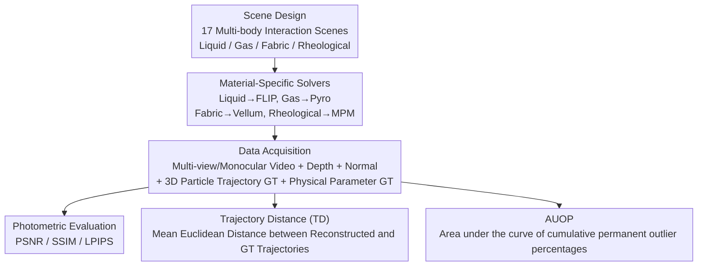

# PhysGaia: A Physics-Aware Benchmark with Multi-Body Interactions for Dynamic Novel View Synthesis

**Conference**: CVPR 2026  
**arXiv**: [2506.02794](https://arxiv.org/abs/2506.02794)  
**Code**: [https://cv.snu.ac.kr/research/PhysGaia/](https://cv.snu.ac.kr/research/PhysGaia/)  
**Area**: 3D Vision / Dynamic Scene Reconstruction  
**Keywords**: Physics-aware benchmark, Dynamic novel view synthesis, Multi-body interaction, 4D Gaussian Splatting, Physical parameter evaluation

## TL;DR
PhysGaia constructs a physics-aware benchmark dataset containing 17 scenes, covering multi-body interactions of various materials such as liquids, gases, fabrics, and rheological substances. It provides ground truth for 3D particle trajectories and physical parameters (e.g., viscosity), and proposes two new metrics, Trajectory Distance (TD) and AUOP, to quantify the physical realism of 4DGS methods, revealing significant deficiencies in the physical reasoning of existing DyNVS methods.

## Background & Motivation

**Background**: Dynamic Novel View Synthesis (DyNVS) has become a focal point in 3D vision. From NeRF to 4D Gaussian Splatting (4DGS), existing methods have made considerable progress in photorealism, enabling high-quality 4D spatio-temporal scene reconstruction from video inputs.

**Limitations of Prior Work**: (1) Existing DyNVS datasets (e.g., D-NeRF, Nerfies, DyCheck) primarily focus on appearance reconstruction quality and almost entirely ignore physical realism; (2) The few physics-related datasets (e.g., Spring-Gaus, PAC-NeRF, ScalarFlow) are limited to single materials (only rheological substances or only gas) and single-object scenes, lacking multi-body interactions; (3) Real videos, while capturing complex scenes, cannot provide ground truth for 3D trajectories and physical parameters, making it difficult to quantitatively evaluate physical reasoning capabilities.

**Key Challenge**: DyNVS is evolving from "looking real" to "behaving real" (from photorealism to physical realism), but there is a lack of benchmarks to support this transition—datasets that simultaneously possess complex multi-body interactions, diverse materials, and reliable physical ground truth are required.

**Goal**: (1) Construct a physics-aware dataset covering multi-body interaction scenes across 4 material categories; (2) Provide complete ground truth (3D trajectories + physical parameters); (3) Design physical realism metrics; (4) Reveal the physical limitations of existing methods.

**Key Insight**: Utilize professional physical solvers (FLIP, Pyro, Vellum, MPM) to ensure each scene strictly follows physical laws, generating synthetic data with accurate physical ground truth.

**Core Idea**: Generate a multi-body interaction benchmark dataset using material-specific physical solvers to evaluate DyNVS methods across both photometric and physical dimensions.

## Method

### Overall Architecture
PhysGaia aims to address a question bypassed by existing dynamic reconstruction benchmarks: do scenes reconstructed by 4DGS methods move "physically correctly" in addition to "looking correct"? To achieve this, the entire pipeline is divided into three layers. The upstream layer consists of scene design and physical simulation—selecting the most appropriate professional solvers for liquid, gas, fabric, and rheological substances to generate 17 scenes with multi-body interactions, ensuring every frame strictly adheres to physical laws. The midstream layer involves data acquisition—exporting multi-view/monocular videos, depth maps, and normal maps from the simulator, alongside 3D trajectory ground truth for each particle and physical parameters (e.g., viscosity) ground truth. The downstream layer is the evaluation system—supplementing standard photometric metrics (PSNR/SSIM/LPIPS) with two physical metrics, TD and AUOP, that directly quantify motion accuracy. By integrating these three layers, PhysGaia separately evaluates photometric realism and physical realism.

### Key Designs

**1. Material-Specific Solvers: Assigning optimal simulators to each material category**

Existing physics-aware 4DGS works almost exclusively use MPM (Material Point Method). However, MPM is inherently designed for solids and rheological substances; using it for liquids or gases leads to suboptimal precision and numerical stability. PhysGaia abandons the "one solver fits all" approach and assigns specialized solvers: FLIP (Fluid-Implicit Particle) for liquids, Pyro for gases, Vellum for fabrics, and MPM only for rheological substances. Each choice corresponds to the best simulation practice for that material class—FLIP's hybrid particle-mesh representation is more stable than SPH for incompressible fluids, and Pyro's voxel grids accurately capture thermodynamic effects like temperature and buoyancy. This targeted strategy ensures that motions in the benchmark are physically sound across all four material types.

**2. Trajectory Distance (TD): Directly measuring the error between reconstructed and ground truth trajectories**

Photometric metrics (PSNR, SSIM) only evaluate rendered images and cannot determine how particles actually move in 3D space—a particle might be rendered at the "correct" location, but its overall trajectory could be entirely wrong. TD quantifies this explicitly. Given $M$ reconstructed Gaussian primitives over $T$ frames, each reconstructed primitive $i$ is first matched to a corresponding ground truth trajectory $j(i)$ in the initial frame using nearest neighbors. The average Euclidean distance is then calculated along the entire timeline:

$$\text{TD} = \frac{1}{MT}\sum_{i}\sum_{t}\big\|X_i^{t,\text{recon}} - X_{j(i)}^{t,\text{gt}}\big\|_2$$

A lower TD indicates that the reconstructed particles not only look correct but also follow trajectories consistent with real physics.

**3. Area Under the Outlier Percentages (AUOP): Capturing the cumulative amplification of physical deviations**

TD is a global average across the timeline, which can be pulled down by a large number of accurate trajectories, potentially masking critical failures where a minority of trajectories diverge significantly and never recover. AUOP is designed to monitor this cumulative effect. For each primitive at each time step, it determines if the deviation exceeds a threshold $\delta$. A key feature is the "once an outlier, always an outlier" logic—i.e., $O_i^t = 1$ if $O_i^{t-1}=1$ or the current deviation exceeds the threshold. The area under the percentage curve of outliers over time is then calculated. This irreversible marking reflects a core phenomenon in physical simulation: small initial errors are exponentially amplified in subsequent frames, similar to the butterfly effect in chaotic systems. Thus, AUOP measures the extent to which trajectories have permanently diverged from physical reality rather than frame-level error.

### Loss & Training
PhysGaia is a benchmark dataset rather than a specific model and does not involve custom training. It additionally provides COLMAP reconstructed point clouds and ready-to-use integration pipelines for 5 4DGS methods for immediate research use.

## Key Experimental Results

### Main Results (Photometric Quality - Average across materials in monocular setting)

| Method | Liquid PSNR↑ | Gas PSNR↑ | Rheological PSNR↑ | Fabric PSNR↑ |
|------|-----------|-----------|-------------|-----------|
| D-3DGS | 22.7 | 21.9 | 20.1 | 22.1 |
| 4DGS | 24.2 | 21.7 | 19.5 | 24.9 |
| STG | 19.2 | 21.9 | 13.6 | 21.9 |
| MoSca | 20.5 | 21.2 | 17.8 | 18.6 |
| SoM | 19.6 | 20.0 | 16.7 | 20.7 |

### Ablation Study (Comparison with existing physical benchmarks)

| Benchmark | Multi-body Interaction | Dynamic Score↑ | FID↓ | KID↓ |
|------|---------|---------------|------|------|
| ScalarFlow | No | 0.391 | 293.5 | 0.255 |
| PAC-NeRF | No | N/A | 242.6 | 0.164 |
| Spring-Gaus | No | 0.372 | 261.8 | 0.171 |
| **PhysGaia (Ours)** | **Yes** | **0.444** | **207.8** | **0.118** |

### Key Findings
- **All existing methods perform significantly worse on PhysGaia than on traditional datasets**: Even in multi-view settings, the average PSNR is below 30, much lower than the performance on D-NeRF (35+). The fundamental reason is that motion complexity introduced by multi-body interactions far exceeds that of single-object deformation.
- **Rheological scenes are the most difficult to reconstruct**: They exhibit the lowest PSNR (STG only 13.6), because rheological interactions (such as jelly collisions) involve complex dynamics across multiple components that current polynomial motion models or ARAP constraints cannot capture.
- **Needle-like artifacts are a universal problem**: In multi-body collision scenes like "jelly party," all methods produce severe geometric artifacts, indicating their inability to maintain reasonable Gaussian distributions in physical contact areas.
- **PhysGaia achieves the highest Dynamic Score (0.444)**, validating that its motion complexity is significantly higher than existing benchmarks.

## Highlights & Insights
- **The "once an outlier, always an outlier" AUOP design is highly effective**: It captures a core phenomenon in physical simulation where initial deviations amplify exponentially. This irreversible outlier marking reflects the reliability of physical reasoning better than simple frame-wise error statistics.
- **The material-specific solver approach provides critical insights for 4DGS research**: Currently, almost all physics-aware 4DGS works use MPM. However, liquids (FLIP), gases (voxel grids + thermodynamics), and fabrics (Vellum/PBD) require different solvers. This identifies a previously neglected research direction.
- **Providing complete simulation node graphs and source files** allows users to customize and generate data with higher resolutions and more modalities (depth, normals, relighting), greatly enhancing the scalability of the benchmark.

## Limitations & Future Work
- **Limited to 17 scenes**: Compared to the data requirements of deep learning models, the number of scenes is relatively small, with some material categories (like gas) having only 2-3 scenes.
- **Domain gap between synthetic and real data**: Although FID/KID metrics indicate high visual fidelity, differences in texture and lighting distribution still exist between synthetic rendering and real-world photography.
- **Lack of rigid-body collision scenes**: All four material types are deformable; rigid-body collisions are not included, despite their importance in applications like robotic manipulation.
- **Initial frame matching assumption for TD**: If reconstructed Gaussian primitives have large positional errors in the initial frame, nearest-neighbor matching might lead to incorrect trajectory correspondences.

## Related Work & Insights
- **vs Spring-Gaus**: Spring-Gaus is limited to rheological substances and single objects. PhysGaia expands to 4 material types and multi-body interactions while providing richer ground truth.
- **vs PAC-NeRF**: PAC-NeRF's liquid scenes are actually high-viscosity fluids (behaving like elastomers); PhysGaia uses the FLIP solver to simulate true low-viscosity liquids.
- **vs Phystwin**: Phystwin includes 22 scenes but is limited to rheological substances and lacks ground truth physical parameters. PhysGaia is superior in terms of physical information completeness.
- **Insight**: This benchmark can drive "physics-aware 4DGS" from single-material to multi-material and multi-body interaction scenarios, particularly highlighting the challenge of integrating multiple physical solvers within a unified framework.

## Rating
- Novelty: ⭐⭐⭐⭐ First physics-aware DyNVS benchmark with multi-material multi-body interactions; novel AUOP metric design.
- Experimental Thoroughness: ⭐⭐⭐⭐ Evaluated 5 mainstream 4DGS methods and compared against 3 physical benchmarks, though analysis of TD/AUOP metrics could be more extensive.
- Writing Quality: ⭐⭐⭐⭐ Clear structure, high-quality visualizations, and well-justified choices for physical solvers.
- Value: ⭐⭐⭐⭐ Direction-setting for physics-aware dynamic scene reconstruction, although the scene count limits its practical utility in some contexts.

<!-- RELATED:START -->

## Related Papers

- [\[ICLR 2026\] Dynamic Novel View Synthesis in High Dynamic Range](../../ICLR2026/3d_vision/dynamic_novel_view_synthesis_in_high_dynamic_range.md)
- [\[CVPR 2026\] Charge: A Comprehensive Novel View Synthesis Benchmark and Dataset to Bind Them All](charge_a_comprehensive_novel_view_synthesis_benchmark_and_dataset_to_bind_them_a.md)
- [\[CVPR 2026\] Dynamic-Static Decomposition for Novel View Synthesis of Dynamic Scenes with Spiking Neurons](dynamic-static_decomposition_for_novel_view_synthesis_of_dynamic_scenes_with_spi.md)
- [\[CVPR 2026\] RF4D: Neural Radar Fields for Novel View Synthesis in Outdoor Dynamic Scenes](rf4dneural_radar_fields_for_novel_view_synthesis_in_outdoor_dynamic_scenes.md)
- [\[CVPR 2026\] MoVieS: Motion-Aware 4D Dynamic View Synthesis in One Second](movies_motion-aware_4d_dynamic_view_synthesis_in_one_second.md)

<!-- RELATED:END -->
