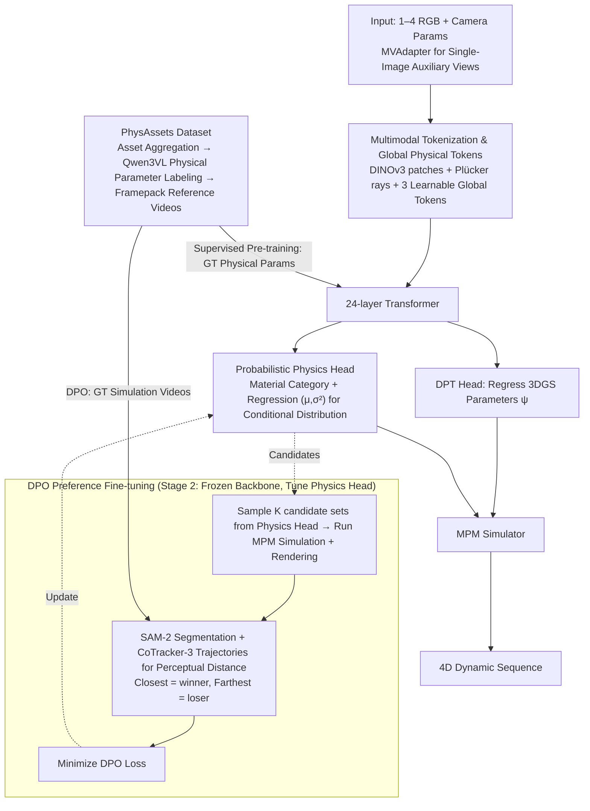

# PhysGM: Large Physical Gaussian Model for Feed-Forward 4D Synthesis

**Conference**: CVPR 2026  
**arXiv**: [2508.13911](https://arxiv.org/abs/2508.13911)  
**Code**: [Project Page](https://hihixiaolv.github.io/PhysGM.github.io/)  
**Area**: 3D Vision / Physics Simulation  
**Keywords**: 4D Synthesis, Physics-Aware Gaussian, Feed-Forward Inference, DPO Alignment, Single-Image-to-4D, MPM Simulation

## TL;DR
The first framework for feed-forward prediction of 3DGS and physical attributes (material category, Young's modulus, Poisson's ratio) from a single image. By employing a two-stage training process (supervised pre-training and DPO preference fine-tuning), it completely bypasses SDS and differentiable physics engines. Combined with the 50K+ PhysAssets dataset, it generates high-fidelity 4D physical simulations in under 1 minute, outperforming per-scene optimization methods in CLIP_sim and human preference rates.

## Background & Motivation
**Background**: Physical 4D synthesis typically requires reconstructing 3DGS from multi-view images (taking hours), manually specifying physical parameters, and then running simulations. SDS-based methods (e.g., OmniPhysGS, DreamPhysics) attempt to distill physical priors from video models but rely on computationally expensive and unstable differentiable physics engines.

**Limitations of Prior Work**: Three major bottlenecks exist: (a) dependency on pre-reconstructed 3DGS (dense multi-view and per-scene optimization); (b) physical attributes are either manually specified or optimized via SDS (inflexible/unstable); (c) simple concatenation of 3DGS and physics modules ignores physical cues within the visual appearance.

**Key Challenge**: Per-scene optimization inherently lacks generalization, requiring a fresh start for every new scene. While SDS is data-driven, it necessitates differential physics engines and remains unstable.

**Goal**: Can per-scene optimization be entirely bypassed to learn a generative model capable of feed-forward generation of complete physical 4D simulations directly from sparse inputs?

**Key Insight**: Reframe the problem from "slow iterative reconstruction" to "amortized feed-forward inference"—training a large Transformer model on large-scale data to learn universal physical priors.

**Core Idea**: A feed-forward Transformer for joint prediction of 3DGS and physical attributes, combined with probabilistic physics modeling and DPO preference fine-tuning (instead of SDS), completing 4D inference in a single forward pass.

## Method

### Overall Architecture

PhysGM addresses whether per-scene optimization can be bypassed by directly outputting simulatable physical 4D from a single image via one forward pass. Inputs consist of 1–4 RGB images plus camera parameters. Image patches are encoded using DINOv3, and per-pixel camera geometry is encoded via Plücker rays. These are concatenated with three learnable global tokens and fed into a 24-layer Transformer. The output follows two paths: a DPT Head for regressing 3DGS parameters $\psi$, and a Physics Head for predicting the physical attribute distribution $\theta$ (material category + Young's modulus/Poisson's ratio). Finally, geometry and physical parameters are passed to an MPM simulator to generate 4D dynamic sequences. For single-image inference, MVAdapter generates auxiliary back/left/right views. The pipeline is supported by two-stage training: supervised pre-training using GT physical parameters from PhysAssets, followed by DPO preference fine-tuning on the physics head with frozen backbones.

### Key Designs

**1. Multimodal Tokenization and Global Physical Tokens: Global Context for Physics Prediction**

Physical attributes (e.g., identifying metal vs. jelly) often require synthesizing the overall appearance of an object. PhysGM concatenates DINOv3 image features with Plücker ray coordinates to encode geometry and adds three learnable global tokens specifically for the physics head. These tokens aggregate appearance cues from the entire scene via attention, ensuring physical predictions are based on an "overall material impression" rather than local textures.

**2. Probabilistic Physics Attribute Prediction Head: Distributions over Point Estimates**

The same appearance might correspond to multiple physical parameters (objects that look hard may have different Young's moduli). The Physics Head uses two branches: a classification head $f_{material}(g_k) \to C$ for material categories, and a regression head outputting mean and variance $(\mu_\theta, \log\sigma_\theta^2) = f_{phys}(g_k)$. This defines a conditional distribution $P(\theta|I) = \mathcal{N}(\theta|\mu_\theta, \text{diag}(\sigma_\theta^2))$, from which parameters are sampled during inference. This modeling captures multi-modal uncertainty and enables DPO by providing multiple candidate samples.

**3. DPO Preference Fine-tuning Instead of SDS: Simulator as a Black Box**

SDS requires gradients to pass through the physics engine, which is slow and unstable. PhysGM bypasses differentiability requirements using preference learning. With the pre-trained policy frozen as $\pi_{ref}$, $K$ groups of physical parameter candidates are sampled from $\pi_\omega$. Each group undergoes MPM simulation and rendering. Perceptual distances are calculated using SAM-2 segmentation and CoTracker-3 trajectories against GT videos. The closest is labeled as 'winner' and the farthest as 'loser'. The DPO loss is minimized:

$$L_{DPO} = -\mathbb{E}\Big[\log\sigma\big(\beta\log\tfrac{\pi_\omega(\phi_w|z)}{\pi_{ref}(\phi_w|z)} - \beta\log\tfrac{\pi_\omega(\phi_l|z)}{\pi_{ref}(\phi_l|z)}\big)\Big]$$

Simulation and rendering are treated as black boxes, simplifying training by comparing output quality.

**4. PhysAssets Dataset (50K+): Enabling Pre-training and DPO**

Feed-forward paradigms require large-scale data. PhysGM aggregates assets from Objaverse, OmniObject3D, ABO, and HSSD. Material categories and physical parameters are inferred via Qwen3VL Multimodal LLM from multi-view images, and GT simulation videos are generated using Framepack. This dataset supports supervised pre-training (GT physical parameters) and DPO fine-tuning (GT simulation videos).

### Loss & Training

Two stages: Stage 1 involves large-scale supervised pre-training, jointly optimizing reconstruction loss (MSE + Alpha + LPIPS) and physics prediction loss. Stage 2 freezes the backbone and fine-tunes the physics head via DPO. Training took 3 days on 32 A800 GPUs with a batch size of 8 per GPU. MPM parameters: sub-step time $2\times10^{-5}$ s, frame time $4\times10^{-2}$ s, 50 frames per sequence.

## Key Experimental Results

### Main Results (Material-wise Comparison)

| Method | metal CLIP | jelly CLIP | plast. CLIP | snow CLIP | sand CLIP | avg CLIP | avg UPR |
|------|-----------|-----------|------------|----------|----------|---------|---------|
| OmniPhysGS | 0.215 | 0.229 | 0.214 | 0.183 | 0.205 | 0.209 | 10% |
| DreamPhysics | 0.227 | 0.246 | 0.244 | 0.207 | 0.222 | 0.229 | 17.2% |
| PhysGM (w/o DPO) | 0.270 | 0.270 | 0.255 | 0.254 | 0.298 | 0.269 | 30% |
| **PhysGM (w/ DPO)** | **0.273** | **0.277** | **0.269** | **0.255** | **0.300** | **0.275** | **42.8%** |

### Ablation Study

| Configuration | avg CLIP_sim | avg UPR | Description |
|------|-------------|---------|------|
| PhysGM w/o DPO | 0.269 | 30% | Pre-training only |
| **PhysGM w/ DPO** | **0.275** | **42.8%** | DPO significantly improves UPR (+12.8%) |

### Key Findings
- **Feed-forward beats per-scene optimization**: PhysGM outperforms SDS baselines in CLIP_sim and UPR across all material types while taking only 1 minute vs. several hours.
- **DPO improves perceptual quality**: DPO leads to moderate CLIP_sim gains but a significant 12.8% boost in UPR, indicating improved human-perceived physical realism.
- **Probabilistic modeling is essential for DPO**: Removing the probability distribution (switching to point estimation) disables DPO candidate sampling, causing fine-tuning to fail.
- **Joint training is superior**: Jointly predicting appearance and physics outperforms decoupled modules, validating that appearance contains physical cues.
- **Efficiency**: Complete 4D simulation in 1 minute compared to several hours for SDS methods.

## Highlights & Insights
- **Feed-Forward Physical Inference Paradigm**: A shift from "per-scene optimization" to "amortized inference." PhysGM proves that large models and large data can learn universal physical priors.
- **Novel DPO Application**: Migration of DPO from language model alignment to physical simulation quality alignment, utilizing non-differentiable simulation outputs to build preference pairs.
- **Elegant Probabilistic Design**: Predicting distributions instead of point estimates captures uncertainty and provides the basis for DPO sampling.

## Limitations & Future Work
- **LLM-dependent Labeling**: Physical parameters inferred by Qwen3VL might lack precision compared to professional physical measurements.
- **GT Video Quality**: Reference simulation videos generated by Framepack may not be perfectly physically realistic.
- **Material Categories**: Currently covers only 5 categories; does not handle composite materials or fluids.
- **Single Object Scenes**: Capability to handle multi-object interaction scenes remains to be verified.
- **Future Directions**: Incorporating real-world physical experiment videos; extending to fluids/cloth; supporting interactive physical control.

## Related Work & Insights
- **vs. PhysGaussian**: PhysGaussian pioneered 3DGS+MPM coupling but requiring manual parameter setting; PhysGM automates this without pre-reconstruction.
- **vs. OmniPhysGS/DreamPhysics**: These SDS methods require hours per scene; PhysGM is feed-forward and faster.
- **vs. LGM/GS-LRM**: These methods handle only static scenes; PhysGM embeds physical inference for dynamic 4D.
- **Insight**: The DPO + non-differentiable simulation paradigm can be generalized to any task requiring black-box simulator feedback (e.g., robotics, fluids).

## Rating
- Novelty: ⭐⭐⭐⭐⭐ 
- Experimental Thoroughness: ⭐⭐⭐⭐ 
- Writing Quality: ⭐⭐⭐⭐⭐ 
- Value: ⭐⭐⭐⭐⭐ 

## Key Experimental Results

### Table 1: Physical Simulation Quality Comparison (5 Materials)

| Method | metal CLIPsim | jelly CLIPsim | plasticine CLIPsim | snow CLIPsim | sand CLIPsim | Mean CLIPsim | Mean UPR |
|------|:---:|:---:|:---:|:---:|:---:|:---:|:---:|
| OmniPhysGS | 0.2149 | 0.2291 | 0.2135 | 0.1834 | 0.2047 | 0.2091 | 10% |
| DreamPhysics | 0.2273 | 0.2459 | 0.2437 | 0.2071 | 0.2217 | 0.2291 | 17.2% |
| PhysGM (w/o DPO) | 0.2698 | 0.2700 | 0.2547 | 0.2541 | 0.2980 | 0.2693 | 30% |
| **PhysGM (w/ DPO)** | **0.2732** | **0.2774** | **0.2691** | **0.2548** | **0.2997** | **0.2748** | **42.8%** |

### Table 2: Multi-view Reconstruction Quality (GSO Dataset)

| Method | Resolution | PSNR↑ | SSIM↑ | LPIPS↓ |
|------|:---:|:---:|:---:|:---:|
| LGM | 256 | 21.44 | 0.832 | 0.122 |
| PhysGM (Ours) | 256 | **25.47** | **0.916** | **0.071** |
| GS-LRM | 512 | **30.52** | 0.952 | 0.050 |
| PhysGM (Ours) | 512 | 28.95 | **0.953** | **0.039** |

### Table 3: Efficiency and Generalization Comparison

| Method | Training | Generalizable | Inference Time | CLIPsim |
|------|:---:|:---:|:---:|:---:|
| OmniPhysGS | SDS | ✗ | >12h | 0.2091 |
| DreamPhysics | SDS | ✗ | >0.5h | 0.2291 |
| **PhysGM** | **DPO** | **✓** | **<1min** | **0.2748** |

## Key Findings

- **Feed-Forward vs. Per-Scene Optimization**: PhysGM completes single-image to 4D simulation in under 1 minute, compared to >12h for OmniPhysGS and >0.5h for DreamPhysics.
- **Significant DPO Boost**: DPO improves CLIPsim from 0.2693 to 0.2748 and UPR from 30% to 42.8% (a 12.8 percentage point increase).
- **Competitive Reconstruction**: On GSO 256 resolution, PSNR is 4.03dB higher than LGM. At 512 resolution, it achieves better LPIPS than GS-LRM using only 10% of the training data.
- **Fully Automated Solution**: The only method that does not require pre-optimized 3DGS, pre-defined parameters, is generalizable, and infers in under 30s.

## Highlights & Insights

- **Paradigm Innovation**: Shifts 4D synthesis from per-scene optimization to feed-forward inference, achieving a 720× speedup over OmniPhysGS.
- **DPO for Physical Alignment**: First use of DPO in physical simulation to bypass differentiable engine limits by constructing preference pairs from black-box outputs.
- **Probabilistic Prediction**: Predicts distributions for physical attributes, supporting DPO sampling and uncertainty modeling.
- **Perceptual Labeling**: Uses SAM-2 and CoTracker-3 to automate preference labeling by quantifying fidelity relative to GT videos.
- **PhysAssets Dataset**: A 50K+ asset dataset covering diverse materials like metal, jelly, snow, and sand to fill the data gap.

## Limitations & Future Work

- **MPM Computational Bottleneck**: Simulation remains the primary time consumer at high resolutions (200³ grid), limiting real-time use.
- **Sim-to-Real Gap**: Reliance on synthetic simulation data (Framepack) limits robustness in real-world deployment due to simplified constitutive models.
- **SH Order Constraints**: Spherical harmonics are limited to order 0 (diffuse only), precluding view-dependent specular effects.
- **Depth Ambiguity**: Single-image reconstruction accuracy is constrained by occlusion and depth uncertainty.
- **Material Scope**: MLLM-inferred attribute labels for the 50K assets may lack precision compared to physical measurements.

## Related Work & Insights

- **vs. PhysGaussian**: Couplings 3DGS with MPM but requires manual tuning; PhysGM predicts attributes automatically.
- **vs. DreamPhysics/OmniPhysGS**: Uses SDS/differentiable simulators taking hours; PhysGM uses DPO to bypass differentiability.
- **vs. PhysDreamer**: Optimizes Young's modulus via SDS per-scene; PhysGM is the first to achieve cross-scene generalization.
- **vs. PhysSplat**: Uses LLM for parameters but depends on pre-reconstructed 3DGS; PhysGM is end-to-end.
- **vs. LGM/GS-LRM**: Feed-forward 3D reconstruction methods that only predict static geometry.

## Rating

- Novelty: ⭐⭐⭐⭐⭐ 
- Experimental Thoroughness: ⭐⭐⭐⭐ 
- Writing Quality: ⭐⭐⭐⭐ 
- Value: ⭐⭐⭐⭐⭐ 

<!-- RELATED:START -->

## Related Papers

- [\[CVPR 2026\] Any4D: Unified Feed-Forward Metric 4D Reconstruction](any4d_unified_feed-forward_metric_4d_reconstruction.md)
- [\[CVPR 2026\] From Rays to Projections: Better Inputs for Feed-Forward View Synthesis](from_rays_to_projections_better_inputs_for_feed-forward_view_synthesis.md)
- [\[CVPR 2026\] MoRe: Motion-aware Feed-forward 4D Reconstruction Transformer](more_motion-aware_feed-forward_4d_reconstruction_transformer.md)
- [\[CVPR 2026\] Z-Order Transformer for Feed-Forward Gaussian Splatting](z-order_transformer_for_feed-forward_gaussian_splatting.md)
- [\[CVPR 2026\] Particulate: Feed-Forward 3D Object Articulation](particulate_feed-forward_3d_object_articulation.md)

<!-- RELATED:END -->
