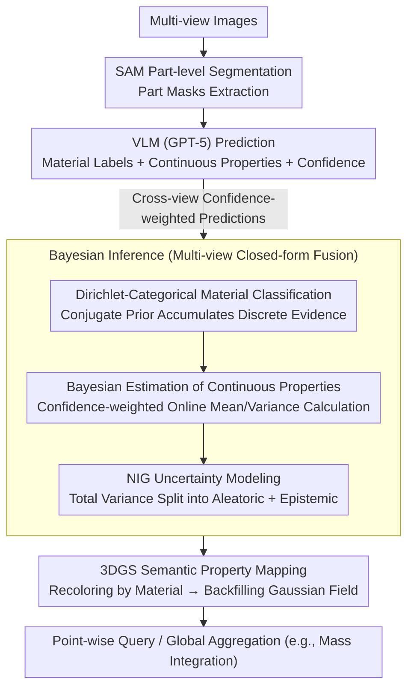

# PhysGS: Bayesian-Inferred Gaussian Splatting for Physical Property Estimation

**Conference**: CVPR 2026  
**arXiv**: [2511.18570](https://arxiv.org/abs/2511.18570)  
**Code**: [Project Home](https://samchopra2003.github.io/physgs)  
**Area**: 3D Vision  
**Keywords**: Physical property estimation, Bayesian inference, 3D Gaussian Splatting, Uncertainty quantification, Vision-language models

## TL;DR
PhysGS is proposed to embed Bayesian inference into the 3D Gaussian Splatting pipeline, utilizing Vision-Language Model (VLM) priors and multi-view confidence-weighted updates to achieve point-wise probabilistic estimation and uncertainty quantification of physical properties (friction, hardness, density, stiffness). It achieves a 22.8% improvement in Absolute Percentage Error (APE) for mass estimation and a 61.2% reduction in Shore hardness error compared to NeRF2Physics.

## Background & Motivation
**Background**: Understanding the physical properties of the environment (friction, hardness, elasticity, density, etc.) is crucial for safe robotic interaction. Existing 3D reconstruction methods (NeRF, 3DGS) mainly focus on geometry and appearance, failing to infer underlying physical attributes.

**Limitations of Prior Work**:
   - Methods like NeRF2Physics use language embeddings for zero-shot regression but do not model uncertainty, leading to fragile predictions in ambiguous regions (e.g., mud vs. asphalt).
   - Existing methods typically estimate only one or two physical properties (e.g., friction or elasticity), lacking generality.
   - Outdoor scenes are largely unexplored.
   - Two types of uncertainty (aleatoric and epistemic) resulting from sensor noise and insufficient model knowledge are not explicitly modeled.

**Key Challenge**: How to estimate multiple physical properties within a unified framework starting from visual sensors while quantifying the reliability of the estimates.

**Key Insight**: Treat each Gaussian primitive as a probabilistic entity whose belief in physical properties is refined through Bayesian posterior updates.

**Core Idea**: Utilize a Dirichlet-Categorical model to fuse discrete material classifications and a Normal-Inverse-Gamma (NIG) prior to model aleatoric and epistemic uncertainties for continuous properties.

## Method

### Overall Architecture
PhysGS aims to solve the following: starting from a set of standard multi-view images, it reconstructs not only the geometry but also point-wise estimates of the object's physical properties (friction, hardness, density, stiffness), while indicating the confidence of each estimate. The pipeline connects "vision processing—VLM querying—Bayesian fusion—mapping back to 3D Gaussian fields." Specifically, SAM is first used to segment each image into part-level masks; then, a VLM (GPT-5) predicts material labels, continuous physical properties, and its own confidence for each part. Since the same region is observed across multiple views, these confidence-weighted predictions are fed into a Bayesian inference module for gradual fusion into a posterior. Finally, the fused material-property results are mapped back onto the Gaussian field reconstructed by 3DGS, resulting in a physical property field that supports point-wise queries and global aggregation (e.g., integrating for total mass).

The core mechanism is that each Gaussian primitive no longer carries only color and geometry but is treated as an entity holding a "probabilistic belief of its physical properties," which is refined by evidence from new views via posterior updates.

### Key Designs

**1. Dirichlet-Categorical Material Classification: Closed-form fusion of multi-view material labels**

VLM material labels for a single view are often inconsistent—one image might identify a floor as dirt, while another sees it as asphalt. Basic voting loses confidence information and cannot be updated incrementally online. PhysGS models the material category as a Categorical variable and uses its conjugate prior, the Dirichlet distribution, to accumulate evidence. This allows the posterior to be updated in a closed-form manner with each new prediction without re-optimization. The recursive update of the posterior parameters is written as $\tilde{\alpha}_i \leftarrow \alpha_i(0) + \sum_{m: c_m=i} \lambda p_m$, where $p_m$ is the VLM confidence for the $m$-th prediction and $\lambda$ is the fusion step size—higher confidence predictions exert a stronger pull on the posterior. The final posterior predictive probability of a point belonging to material $i$ is the normalized $f(z=i \mid Z, \boldsymbol{\alpha}) = \tilde{\alpha}_i / \sum_j \tilde{\alpha}_j$. Conjugacy is key here: it reduces "fusion of multi-view evidence" to simple addition in a counter, making it naturally suited for streaming, incremental reconstruction.

**2. Bayesian Estimation of Continuous Properties: Online estimation of mean and variance using confidence-weighted accumulators**

Beyond material labels, continuous properties like friction coefficients and density must be estimated. These also require cross-view fusion without storing all historical observations. PhysGS maintains three confidence-weighted accumulators for each material: $W_i = \sum p_m$, $S_i = \sum p_m \psi_m$, and $Q_i = \sum p_m \psi_m^2$ (where $\psi_m$ is the $m$-th observed property value). From these, the posterior mean and variance can be calculated in closed form:

$$\mu_i = \frac{S_i}{W_i}, \qquad \sigma_i^2 = \frac{Q_i}{W_i} - \mu_i^2$$

Since the material of a Gaussian point is itself uncertain (as given by the previous design), its final property distribution is a mixture of Gaussians weighted by the material posterior probabilities: $f(\psi \mid Z, \boldsymbol{\alpha}) = \sum_i \frac{\tilde{\alpha}_i}{\sum_j \tilde{\alpha}_j} \mathcal{N}(\mu_i, \sigma_i^2)$. This estimation relies solely on accumulating these three scalars, requiring no storage of historical observations, thus allowing updates during reconstruction.

**3. Normal-Inverse-Gamma Uncertainty Modeling: Splitting total uncertainty into "perception noise" and "insufficient knowledge"**

For robots, "how unreliable the estimated friction is" is as important as the value itself. Unreliability stems from two sources: aleatoric uncertainty (stochastic noise in sensors/perception that cannot be eliminated by more observations) and epistemic uncertainty (lack of model knowledge or insufficient observations that can be reduced). PhysGS models the joint posterior of the mean $\mu_i$ and variance $\sigma_i^2$ using an NIG distribution $p(\mu_i, \sigma_i^2 \mid \tau_i, \kappa_i, \alpha_i, \beta_i)$, which allows the total variance to be analytically decomposed:

$$\text{Var}[\psi_i] = \underbrace{\mathbb{E}[\sigma_i^2]}_{\text{aleatoric}} + \underbrace{\text{Var}[\mu_i]}_{\text{epistemic}}, \quad \mathbb{E}[\sigma_i^2] = \frac{\tilde{\beta}_i}{\tilde{\alpha}_i - 1}, \quad \text{Var}[\mu_i] = \frac{\mathbb{E}[\sigma_i^2]}{\tilde{\kappa}_i}$$

Consequently, regions with high aleatoric uncertainty indicate intrinsic perception difficulty, while high epistemic uncertainty suggests that collecting more views would be beneficial.

**4. 3DGS Semantic Property Mapping: Backfilling the posterior into the 3D Gaussian field**

The previous steps perform inference in the "material-property" semantic space; this must be projected back to 3D. PhysGS assigns a representative color to each material category determined by Bayesian inference, recolors the scene images, and uses these semantic images as input to build the 3DGS. Each reconstructed voxel is thus associated with a predicted property value, supporting point-wise queries (e.g., ground friction) and global aggregation (e.g., integrating the density field for total mass).

### Loss & Training
- Reconstruction using the `splatfacto-big` variant from Nerfstudio, 20k iterations on a single RTX A5000.
- VLM utilizes GPT-5 with structured vision-text prompts to obtain material labels, property values, and confidence scores.

## Key Experimental Results

### Main Results—Mass Estimation (ABO-500 test set, 100 objects)

| Method | ADE↓ (kg) | ALDE↓ | APE↓ | MnRE↑ |
|------|---------|--------|------|-------|
| Image2mass | 12.496 | 1.792 | 0.976 | 0.341 |
| 2D CNN | 15.431 | 1.609 | 14.459 | 0.362 |
| LLaVA | 17.328 | 1.893 | 1.837 | 0.306 |
| NeRF2Physics | 8.730 | **0.771** | 1.061 | **0.552** |
| **Ours (PhysGS)** | **8.254** | 0.999 | **0.819** | 0.474 |

### Ablation Study (ABO-500 val set)

| Configuration | ADE↓ | APE↓ | Description |
|------|------|------|------|
| NeRF2Physics | 9.786 | 0.931 | Baseline |
| PhysGS (w/o Bayesian) | 9.728 | 0.717 | No Bayesian update |
| **Ours (PhysGS)** | **9.187** | **0.715** | Full model |

### Key Findings
- PhysGS reduces APE by 22.8% (1.061 → 0.819) and ADE by 5.5% compared to NeRF2Physics.
- Bayesian inference reduces ADE by 5.6% compared to the variant without Bayesian updates.
- Shore hardness error is reduced by 61.2%, and kinetic friction coefficient error is reduced by 18.1%.
- Regions of high aleatoric uncertainty correspond to high sensor noise or material identification difficulty, while high epistemic uncertainty corresponds to regions with insufficient evidence, aligning with intuition.

## Highlights & Insights
- **Theoretical Elegance**: Combining Bayesian inference with 3DGS by treating Gaussian primitives as probabilistic entities is a natural and elegant modeling approach. The confidence-weighted online update does not require storing historical data, making it ideal for incremental reconstruction.
- **Utility of Uncertainty Decomposition**: Categorizing uncertainty into aleatoric vs. epistemic is vital for downstream robotic decision-making. For instance, robots should be more cautious or seek more observations in high epistemic uncertainty areas.
- **VLM as a Physical Prior**: Using GPT-5 as a zero-shot prior source for material identification and property estimation is viable; although its initial accuracy is limited, multi-view Bayesian fusion significantly improves it.

## Limitations & Future Work
- VLM physical property estimates are zero-shot and lack domain calibration, potentially leading to large biases for uncommon materials.
- Mass estimation depends on density estimation and volume integration; errors in volume estimation can propagate and amplify.
- NeRF2Physics still performs better on ALDE and MnRE, suggesting the Bayesian approach might introduce bias under certain metrics.
- High computational cost due to reliance on SAM segmentation and VLM inference (compared to geometry-only methods).
- Verification in outdoor scenes is primarily qualitative, lacking quantitative benchmarks.

## Related Work & Insights
- **vs. NeRF2Physics**: NeRF2Physics uses CLIP embeddings + kernel regression for property estimation without uncertainty modeling. PhysGS outperforms it on most metrics via Bayesian updates but lags in ALDE and MnRE.
- **vs. GaussianProperty**: Also based on 3DGS+VLM, but lacks Bayesian updates and uncertainty decomposition.
- **vs. EVORA/MEM**: These model uncertainty in 2D perception; PhysGS is the first work to address both physical properties and uncertainty within 3DGS.

## Rating
- Novelty: ⭐⭐⭐⭐ Innovative combination of Bayesian inference, 3DGS, and physical properties; NIG decomposition is theoretically sound.
- Experimental Thoroughness: ⭐⭐⭐ Datasets and baselines are somewhat limited; outdoor quantitative evaluation is missing.
- Writing Quality: ⭐⭐⭐⭐ Mathematical derivations are complete and clear; motivation is well-articulated.
- Value: ⭐⭐⭐⭐ Uncertainty-aware physical property estimation is of high significance for the robotics field.

<!-- RELATED:START -->

## Related Papers

- [\[CVPR 2026\] Adapting Point Cloud Analysis via Multimodal Bayesian Distribution Learning](adapting_point_cloud_analysis_via_multimodal_bayesian_distribution_learning.md)
- [\[CVPR 2026\] P2GS: Physical Prior-guided Gaussian Splatting for Photometrically Consistent Urban Reconstruction](p2gs_physical_prior-guided_gaussian_splatting_for_photometrically_consistent_urb.md)
- [\[CVPR 2026\] IDESplat: Iterative Depth Probability Estimation for Generalizable 3D Gaussian Splatting](idesplat_iterative_depth_probability_estimation_for_generalizable_3d_gaussian_sp.md)
- [\[CVPR 2026\] PhysGM: Large Physical Gaussian Model for Feed-Forward 4D Synthesis](physgm_large_physical_gaussian_4d_synthesis.md)
- [\[CVPR 2026\] PRIMU: Uncertainty Estimation for Novel Views in Gaussian Splatting from Primitive-Based Representations of Error and Coverage](primu_uncertainty_estimation_for_novel_views_in_gaussian_splatting_from_primitiv.md)

<!-- RELATED:END -->
