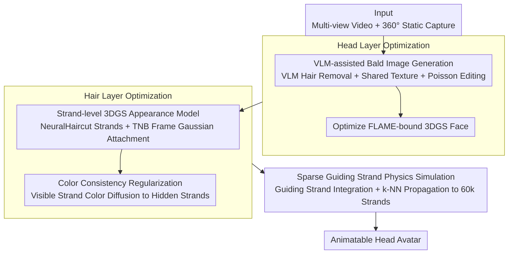

# PhysHead: Simulation-Ready Gaussian Head Avatars

**Conference**: CVPR 2026  
**arXiv**: [2604.06467](https://arxiv.org/abs/2604.06467)  
**Code**: [https://phys-head.github.io](https://phys-head.github.io)  
**Area**: 3D Vision / Head Avatars  
**Keywords**: Head Avatar Reconstruction, 3D Gaussian Splatting, Hair Physics Simulation, Layered Representation, VLM-assisted

## TL;DR
PhysHead is proposed as the first method to combine physics-driven hair dynamics with animatable 3DGS head avatars. It models the expressible face using FLAME meshes and 3DGS, models hair appearance using strands and 3DGS, and drives hair animation via a physics engine. Layered optimization for the face and hair is achieved through VLM-generated bald images.

## Background & Motivation

**Background**: Existing data-driven animatable head avatar methods (e.g., GA, GHA) achieve high-quality rendering but generally treat hair as a rigid shell attached to the head—hair does not move naturally when the head turns. Recent works have started to decouple hair and head (DELTA, MeGA), but the hair remains static. Concurrent work (HairCUP) allows for compositional decomposition but utilizes unstructured Gaussians, which do not support physics simulation.

**Limitations of Prior Work**: (1) In most avatar methods, hair is a rigid body, failing to simulate dynamic effects like wind or head shaking; (2) Data-driven hair dynamics methods (e.g., learning to fit dynamics from data) cannot generalize to unseen dynamic scenarios—it is impossible to capture all possible hair movements; (3) Strand-level representations in films/games can be simulated by physics engines but usually focus only on geometry, with appearances manually crafted by artists rather than containing realistic expressions.

**Key Challenge**: The need to simultaneously satisfy two requirements: (1) Realistic facial avatars driven by 3DMM; (2) Strand-based representations compatible with physics engines to achieve dynamic hair. Existing methods cannot satisfy both.

**Goal**: Build a head avatar that features both parametric facial control (expressions + head poses) and realistic hair animation driven by a physics engine.

**Key Insight**: Layered representation—utilizing FLAME+3DGS for the face and strands+3DGS for the hair. After separate modeling, the dynamic coupling of hair and head pose is achieved via a physics engine.

**Core Idea**: Construct a simulation-ready head avatar using a layered 3DGS representation (FLAME face layer + strand hair layer), and propose VLM-assisted bald image generation and color consistency regularization to solve occlusion issues during layered optimization.

## Method

### Overall Architecture
The input consists of multi-view videos and a 360° static capture. The method involves two-stage optimization: (1) **Head Layer Optimization**: First, hair is removed using VLM editing to generate bald training images. The FLAME-bound 3DGS facial model is optimized on these images. (2) **Hair Layer Optimization**: Atop the head layer, hair geometry is initialized by NeuralHaircut, and 3DGS primitives are attached to strand segments to optimize appearance. Finally, hair is animated through guiding strands and sparse-to-dense propagation within a physics engine.

### Key Designs

**1. VLM-assisted Bald Image Generation: Removing hair to reconstruct occluded ears and neck**

The head layer requires independent optimization of the facial avatar. In training images, hair often covers the ears, neck, and parts of the cheeks, leaving these areas without supervision signals. PhysHead generates a set of "hairless" training images: a Nano-Banana VLM automatically removes hair from the first frame, and multi-view consistent views are selected. A FLAME shared texture map $T \in \mathbb{R}^{2048 \times 2048 \times 3}$ is optimized on these sparse views via differentiable rendering. With this texture, an "appearance proxy" is rendered for each training frame's pose, and Poisson blending is used to seamlessly mix the proxy with the original facial region, resulting in a bald version of that frame. Compared to SDS distillation in HairCUP, VLM-generated bald images are of higher quality and generalize better to different skin tones; the shared texture/Poisson editing ensures no strong boundary artifacts at the seams.

**2. Strand-level 3DGS Appearance Model: Attaching realistic appearance to physical simulation strands**

To make hair both realistic and simulatable, the representation must satisfy both rendering and simulation requirements. Unstructured Gaussians render well but cannot be used in physics engines. PhysHead uses strands as the skeleton: geometry is obtained from NeuralHaircut and uniformly resampled into $m=60000$ strands with $n=16$ points each. A 3DGS primitive is attached to each strand segment, with its rotation calculated using the Frenet-Serret (TNB) frames. Each Gaussian is set as an ellipsoid elongated along the strand direction: the mean is the segment midpoint $\mathbf{g}_{\text{mean}}=(p_1+p_2)/2$, the scale along the tangent is the segment length, and the other two axes are set to a very thin constant $\mathbf{g}_{\text{scale}}=(\|p_2-p_1\|, k, k)$ where $k=0.0001$. In this way, the geometry is defined by the strands, allowing the appearance to sit on a structure directly compatible with collision detection, gravity, and wind constraints.

**3. Color Consistency Regularization: Ensuring reasonable colors for invisible inner strands**

The photometric loss for the hair layer is only calculated on visible strands within the mask. Consequently, inner and back-facing strands never seen from any view would learn random colors—appearing as glaring artifacts once exposed during hair movement. PhysHead applies a color difference regularization between each strand $i$ and its neighbors $j \in \mathcal{N}(i)$, diffusing colors from visible strands to hidden ones based on adjacency:

$$\mathcal{L}_{\text{consistency}} = \sum_{i \in \mathcal{S}} \sum_{j \in \mathcal{N}(i)} \|\mathbf{c}_i - \mathbf{c}_j\|_2^2$$

This term is activated only after several iterations of outer RGB optimization, allowing visible strands to learn accurate colors before diffusion to prevent the spread of initial errors.

**4. Sparse Guiding Strand Physics Simulation: Animating 60,000 strands using a few guiding strands**

Performing physics integration on 60,000 individual strands is computationally prohibitive. PhysHead follows standard graphics procedures: a small subset of sparse "guiding strands" is picked to form a hair particle system. Dynamics are calculated only for these guiding strands using a physics engine (semi-implicit Euler integration + iterative constraint solver), and relative displacements are propagated back to the dense strands via k-NN strand skinning with inverse-distance weighting. This maintains the visual detail of dense strands while reducing simulation scale to a manageable level, allowing the hair to respond to any head pose or external force such as wind.

### Loss & Training
Head Layer Loss: $\mathcal{L} = (1-\lambda)\mathcal{L}_1 + \lambda\mathcal{L}_{\text{D-SSIM}} + \lambda_{\text{pos}}\mathcal{L}_{\text{pos}} + \lambda_{\text{scaling}}\mathcal{L}_{\text{scaling}}$, with $\lambda=0.2$. Loss is only computed in the facial mask area.

Hair Layer Loss: $\mathcal{L}_{\text{hair}} = \mathcal{L}_{\text{rgb}} + \lambda_{\text{consistency}}\mathcal{L}_{\text{consistency}}$, where RGB loss is only computed in the hair mask area. Strand scale and rotation are fixed after initialization from TNB frames, opacity is fixed at 1, and only color and Spherical Harmonics (SH) coefficients are optimized.

## Key Experimental Results

### Main Results (Comparison with GaussianHaircut)

| Method | PSNR↑ | SSIM↑ | LPIPS↓ |
|------|-------|-------|--------|
| Prev. SOTA (GaussianHaircut) | 30.55 | 0.915 | 0.071 |
| Ours w/o $\mathcal{L}_{\text{consistency}}$ | 28.24 | 0.893 | 0.078 |
| **Ours (Full)** | **30.28** | **0.946** | **0.061** |

### Ablation Study

| Configuration | Description |
|------|------|
| W/o Color Consistency Loss | Inner strands exhibit random colors, causing severe artifacts during animation |
| W/ Color Consistency Loss | Hidden strands obtain reasonable colors suitable for physics simulation |
| Single-layer Representation | Skin peeling and poor handling of hidden regions occur during animation |
| Layered Representation (Head+Hair) | Enables independent control of expressions and hair physics simulation |

Note: Color consistency loss is best enabled after 5000 iterations to allow visible strands to learn colors before diffusing them to hidden strands.

### Key Findings
- **The core advantage of PhysHead is its animation capability rather than static reconstruction quality (where it is comparable to GaussianHaircut)**—it is the only method supporting physics-driven hair animation.
- GaussianHaircut strands penetrate the head and learn skin colors, making them unsuitable as appearance models for physics simulation.
- Compared to GA/GHA: Baseline methods show similar quality when head movement is minimal (t=0), but differences become significant during large movements (turning, nodding, wind), where baseline hair remains rigidly attached.
- Compared to HairCUP: HairCUP’s use of SDS leads to artifacts in the head layer and tends to generate identical skin tones; PhysHead’s VLM approach offers better generalization.

## Highlights & Insights
- The combination of **VLM + Differentiable Rendering + Poisson Editing** is ingenious—VLM performs rough hair removal, differentiable rendering generates a shared texture as an occlusion proxy, and Poisson editing achieves seamless blending. This workflow can be transferred to other foreground/background separation scenarios.
- **Strand-3DGS Binding**: Using TNB frames to assign elongated Gaussians to strand segments is simple yet effective—geometry is defined by strands and fixed, leaving only color and SH coefficients to be optimized, which greatly simplifies the process.
- **Converting complex continua to discrete simulatable representations**: The decoupling of "hair appearance + physics simulation"—where the physics engine handles motion and 3DGS handles rendering, connected by strand geometry—is a versatile strategy applicable to other deformable objects like clothing or fluids.

## Limitations & Future Work
- Appearance quality depends on the quality of foreground/hair masks; imperfect masks lead to incorrect layering.
- Hair geometry originates from NeuralHaircut, inheriting its limitations (e.g., poor reconstruction of curly hair).
- The realism of physics simulation depends on the quality of propagation from sparse guiding strands to dense strands; complex hairstyles may involve inaccurate propagation.
- Quantitative evaluation of animation quality (e.g., comparison with real dynamic hair videos) was not presented.
- Training requires multi-view videos and 360° static captures, which involves high data acquisition costs.

## Related Work & Insights
- **vs Gaussian Avatars (GA)**: GA uses FLAME-bound 3DGS for facial control, but hair is rigid as a 3DMM offset. PhysHead integrates GA's facial layer scheme with strand physics simulation.
- **vs GaussianHaircut**: Focuses on strand geometry and appearance reconstruction but suffers from strand penetration and skin-color leakage, and lacks animation support. PhysHead addresses these via layered optimization.
- **vs HairCUP**: Also a layered method but uses SDS for bald images (low quality, color bias) and unstructured Gaussians (no physics support). PhysHead's VLM solution is more robust, and its strand representation is simulation-ready.
- **vs Data-driven hair dynamics**: Learning dynamics from data does not generalize to unseen motions. PhysHead uses a general physics engine, generalizing to arbitrary head poses and external forces.

## Rating
- Novelty: ⭐⭐⭐⭐ Groundbreaking work in combining physics-driven strand dynamics with 3DGS head avatars; the VLM-assisted layering scheme is innovative.
- Experimental Thoroughness: ⭐⭐⭐ Qualitative comparisons clearly demonstrate animation advantages, but quantitative evaluation is limited (only static metrics) and lacks quantitative measures for animation quality.
- Writing Quality: ⭐⭐⭐⭐ Clear motivation and well-organized methodology.
- Value: ⭐⭐⭐⭐ Opens a new direction for simulation-ready head avatars and represents a significant step toward highly realistic human avatars.

<!-- RELATED:START -->

## Related Papers

- [\[CVPR 2025\] SimAvatar: Simulation-Ready Avatars with Layered Hair and Clothing](../../CVPR2025/3d_vision/simavatar_simulation-ready_avatars_with_layered_hair_and_clothing.md)
- [\[CVPR 2026\] PhysX-Anything: Simulation-Ready Physical 3D Assets from Single Image](physx-anything_simulation-ready_physical_3d_assets_from_single_image.md)
- [\[CVPR 2026\] ProgressiveAvatars: Progressive Animatable 3D Gaussian Avatars](progressiveavatars_progressive_animatable_3d_gaussian_avatars.md)
- [\[CVPR 2026\] Motion-Aware Animatable Gaussian Avatars Deblurring](motion-aware_animatable_gaussian_avatars_deblurring.md)
- [\[CVPR 2026\] Multi-view Consistent 3D Gaussian Head Avatars 'without' Multi-view Generation](multi-view_consistent_3d_gaussian_head_avatars_without_multi-view_generation.md)

<!-- RELATED:END -->
