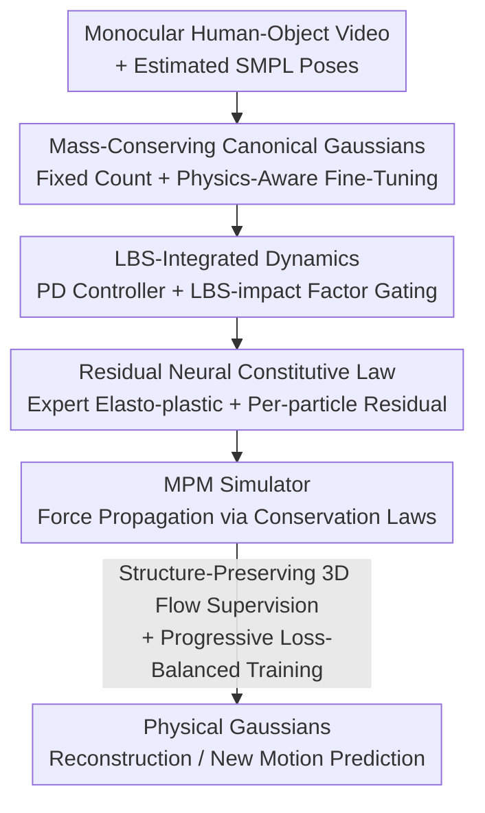

# PhysHO: Physics-Based Dynamic 3D Gaussian Human and Object from Monocular Video

**Conference**: CVPR 2026  
**Paper**: [CVF Open Access](https://openaccess.thecvf.com/content/CVPR2026/html/Jiang_PhysHO_Physics-Based_Dynamic_3D_Gaussian_Human_and_Object_from_Monocular_CVPR_2026_paper.html)  
**Code**: Project Page https://suezjiang.github.io/physho/  
**Area**: 3D Vision  
**Keywords**: Physics Reconstruction, 3D Gaussian, Human-Object Interaction, Material Point Method (MPM), Monocular Video

## TL;DR
PhysHO treats SMPL-driven Linear Blend Skinning (LBS) as an "internal driving force prior" for the human body and uses the Material Point Method (MPM) as a physics engine to propagate these forces to objects through contact. Combined with per-particle residual neural constitutive laws, it reconstructs physically plausible "human push/pull object" dynamics from monocular videos and enables extrapolation for unseen motions.

## Background & Motivation
**Background**: There are two main paths for reconstructing simulatable dynamic scenes from video. One is dynamic 3D Gaussians (4D Gaussian, Motion Basis, Deformation Fields, GART, etc.), which offer high rendering quality. The other is physics-based reconstruction, which couples differentiable renderers (NeRF/3DGS) with differentiable simulators (MPM) to infer material properties and recover object dynamics from video.

**Limitations of Prior Work**: Dynamic Gaussian methods typically overfit a time-conditioned deformation function to observed frames and **lack physical constraints**. Consequently, they cannot extrapolate to new motions or perform predictive simulations; once given a future human pose, the motion basis may fail or even cause the object structure to collapse. Physics reconstruction methods, while constrained by physics, almost exclusively **consider only gravity and ground contact**, ignoring internal driving forces actively generated by the human body. Furthermore, they rely on idealized constitutive laws (homogeneous, isotropic) that cannot fit the heterogeneity and anisotropy of real-world materials.

**Key Challenge**: In real-world "human-object interaction" scenarios, motion originates not just from gravity but from internal forces injected by humans through their limbs. These forces must be "identified" from observations yet should only act within the human body (the object should only receive force passively through contact). Simultaneously, materials vary significantly, and while pure expert constitutive laws lack expressiveness, pure neural constitutive laws easily cause the simulator to diverge and crash.

**Goal**: To achieve high-fidelity reconstruction of observed human-object dynamics from monocular video while enabling physically plausible simulation and prediction under new human motions.

**Key Insight**: The authors' key observation is that SMPL+LBS already explains "where the person is and how they move," making it a natural **interpretable prior for internal driving forces**. By using it to inform the MPM which particles should be actively driven and by how much, and allowing the MPM to propagate force under conservation laws, "active human force" can be modeled within the physics simulation.

**Core Idea**: Use LBS trajectories via a PD controller to generate driving forces, use per-particle learnable LBS-impact factors to **inject forces only into the SMPL volume**, and employ a residual neural term layered on expert constitutive laws to express heterogeneous/anisotropic materials. Optimization is made well-posed via structure-preserving 3D flow supervision.

## Method

### Overall Architecture
The input to PhysHO is a monocular "human-object interaction" video, and the output is a set of physical Gaussians capable of both reproducing observations and predicting simulations for new motions. 3D Gaussians serve as MPM simulation particles. The pipeline consists of four parts: first, learning quality-conserving, fixed-count canonical space Gaussians from "rotating body" segments with physics-aware fine-tuning; second, calculating driving forces from LBS trajectories via PD controllers, gated by LBS-impact factors to inject force only within the human body; third, modeling stress for each particle using an expert elasto-plastic constitutive law plus a per-particle residual neural constitutive law; and finally, optimizing via a progressive schedule using structure-preserving 3D flow as supervision.

### Key Designs

**1. Mass-Conserving Canonical Gaussians + Physics-Aware Fine-Tuning: Aligning Rendering Parameters with Deformation Gradients**

Physics reconstruction requires a fixed number of particles and mass conservation, so Gaussians must be pre-reconstructed in a canonical space. Unlike GART which introduces implicit skeletons, PhysHO uses the **original SMPL skeleton + fixed skinning weights** to learn canonical Gaussians $G=\{(\mu_c^i,R_c^i,S_c^i,\eta_c^i,h_c^i)\}$. The issue is that physics-driven deformation modifies the covariance through the deformation gradient $F^{i,n}$ as $\Sigma^{i,n}=F^{i,n}R_{lbs}^{i,0}S_{lbs}^{i,0}(S_{lbs}^{i,0})^\top(R_{lbs}^{i,0})^\top(F^{i,n})^\top$. Original appearance parameters are not adapted to this; using them directly causes blurry textures. Ours treats LBS Gaussian means as "expected particle positions" to estimate velocities, runs the MPM under a zero-stress setting to obtain $F^{i,n}$, and fine-tunes appearance via $\mathcal{L}_{RGB}=\|I-I^*\|_1$. This bridges "kinematic LBS" and "physics-driven deformation."

**2. LBS-Integrated Dynamics: Force Injection via LBS-impact Factors**

Addressing the challenge of identifying internal forces, Ours treats LBS position trajectories as reference motions. A PD controller calculates an additional force for each particle $f_{PD}^{i,n}=k_p(\mu_{lbs}^{i,n}-x^{i,n})+k_d(v_{lbs}^{i,n}-v^{i,n})$. However, only human particles should be driven. A per-particle learnable coefficient $\omega_i$ is introduced as a gate: $f_{ex}^{i,n}=\omega_i f_{PD}^{i,n}$. Crucially, **particles outside the SMPL template surface (object particles) are set to $\omega_i=0$**, while only particles inside the SMPL volume have learnable $\omega_i$ to control force intensity. This ensures "directed driving"—internal force originates only from the human, preventing phantom forces on the object.

**3. Residual Neural Constitutive Law: Expressing Heterogeneity on an Expert Backbone**

Classic MPM assumes homogeneity and isotropy. Even spatially varying Young's modulus $E$ and Poisson's ratio $\nu$ cannot capture anisotropy. Ours defines the neural term as a **residual on top of the expert model**: elasticity $\sigma=E(F,E,\nu)+E_\theta(F,l_e)$ and plasticity $F=P(F^{trial})+P_\theta(F^{trial},l_p)$, where $l_e,l_p$ are per-particle feature vectors. The expert term provides a robust backbone, while the residual term handles spatial heterogeneity and directional anisotropy. This ensures both expressiveness and physical stability.

**4. Structure-Preserving 3D Flow Supervision + Progressive Loss-Balanced Training**

Monocular optimization of coupled "driving + elasto-plastic dynamics" is severely under-constrained. Ours first **optimizes per-frame particle positions $x'_n$ to obtain structure-preserving 3D flow** using RGB loss, optical flow loss, and as-rigid-as-possible (ARAP) regularization: $\mathcal{L}_{SP\text{-}Flow}=\lambda_{rgb}\mathcal{L}_{rgb}+\lambda_{flow}\mathcal{L}_{flow}+\lambda_{arap}\mathcal{L}_{arap}$. This flow provides 3D supervision for the simulator. The end-to-end loss then aligns simulated positions to this flow: $\mathcal{L}_{E2E}=\lambda_{rgb}\mathcal{L}_{rgb}+\lambda_{3Dflow}\|x_{n+1}-x'_{n+1}\|_1$. A **progressive loss-balanced schedule** is used: training begins with a short window to stabilize early dynamics, later expanding to the full sequence while allocating more iterations to "hard" frames with high loss.

### Loss & Training
Density $\rho$ is manually set. The system jointly optimizes per-particle $E,\nu$, LBS-impact factors $\omega$, feature vectors $(l_e,l_p)$, and residual network parameters $E_\theta,P_\theta$. The regularization term $R=\lambda_{law}(\|E_\theta(F,l_e)\|^2+\|P_\theta(F^{trial},l_p)\|^2)+\lambda_\omega\|\omega\|^2$ constrains the residual magnitude and injected force. Training proceeds in two stages: high-quality Gaussian reconstruction (rotating body) and material property learning (dynamic interaction).

## Key Experimental Results

The evaluation uses a custom 1080p, 30 FPS monocular dataset with 8 sequences and 6 objects. Poses are obtained via off-the-shelf SMPL estimators.

### Main Results
Comparison of rendering accuracy for reconstruction and future prediction (LPIPS lower is better):

| Task | Sequence / Subset | Metric | Ours | GART | 4D-Gaus |
|------|------|------|------|------|---------|
| Recon | Square Pillow Full | LPIPS↓ | **0.1079** | 0.1282 | 0.1099 |
| Recon | Square Pillow 40-60% | LPIPS↓ | **0.1150** | 0.1322 | 0.1180 |
| Pred | Square Pillow Full | PSNR↑ | **18.94** | 18.57 | — |
| Pred | Square Pillow 30-50% | PSNR↑ | **18.18** | 16.80 | — |

Key caveat: GART and 4D-Gaus sometimes show higher PSNR/SSIM because they **continuously optimize appearance to fit the ground truth**. Ours fixes appearance to learn the physical model. However, Ours leads consistently in LPIPS, indicating better visual realism and texture preservation. In prediction, 4D-Gaus cannot extrapolate, and GART suffers from significant degradation or structural collapse.

### Ablation Study

| Configuration | PSNR↑ | SSIM↑ | LPIPS↓ | IoU↑ | Description |
|------|------|------|--------|------|------|
| Full | **24.03** | **0.9534** | **0.0652** | **0.8845** | Full model |
| w/o $l_e,l_p$ | 23.54 | 0.9436 | 0.0680 | 0.8636 | Decreased physical expressiveness |
| w/o $E_\theta,P_\theta$ | 22.26 | 0.9387 | 0.0664 | 0.8289 | Cannot recover observed dynamics |

### Key Findings
- **Residual Neural Constitutive Law ($E_\theta,P_\theta$) is most significant**: Without it, PSNR drops from 24.03 to 22.26, showing that pure expert models cannot replicate real heterogeneous materials.
- **Physics-Aware Fine-Tuning is essential**: Without it, applying deformation gradients to original covariances results in a $\sim$1.9 dB PSNR drop due to texture blurring.
- **3D Flow provides stability**: Without 3D flow supervision, the neural model overfits reconstruction errors, leading to excessive correction of the expert model and training failure.

## Highlights & Insights
- **Repurposing SMPL/LBS as a "Driving Prior"**: Instead of just constraining geometry, using LBS trajectories as PD reference motion with per-particle gating provides a clean solution to the "active vs. passive force" problem.
- **Residual Formulation for Stability**: Expert backbones combined with neural residuals allow the model to capture complex spatial heterogeneity without the divergence common in purely neural constitutive models.
- **Honest Metric Analysis**: The authors properly contextualize PSNR/SSIM disadvantages (due to fixed appearance) and use LPIPS/IoU to demonstrate superior visual and physical consistency.

## Limitations & Future Work
- **Static Camera & Gravity Alignment**: Current experiments assume a static camera and gravity aligned with the vertical axis; robustness to moving cameras is untested. ⚠️
- **Pose Estimation Dependency**: The quality of the driving prior depends on the SMPL estimator. Since reference trajectories are imperfect in non-rigid areas, pose errors can degrade driving modeling.
- **Rigid Canonical Assumption**: The use of fixed skinning weights assumes no major non-rigid deformation during the "rotating body" phase, which may fail for loose clothing.
- **Data Scale**: The dataset is relatively small (8 sequences), requiring verification across a wider range of materials and scenes.

## Related Work & Insights
- **vs. GART**: GART uses learned skinning weights for reconstruction but lacks physical constraints; it fails to extrapolate or maintain structural integrity under future poses.
- **vs. 4D-Gaussian**: 4D-Gaus uses time-conditioned deformation fields and **cannot extrapolate** at all.
- **vs. NCLaw / NeuMA**: While NCLaw uses homogeneous neural constitutive laws, PhysHO adopts a per-particle residual approach (similar to LoRA in NeuMA) to handle heterogeneous scenes.

## Rating
- Novelty: ⭐⭐⭐⭐⭐ LBS as a driving prior + per-particle gating + residual laws solves the "active human force" problem effectively.
- Experimental Thoroughness: ⭐⭐⭐⭐ Clear ablations and honest analysis, though the self-collected dataset is small.
- Writing Quality: ⭐⭐⭐⭐ Strong motivation and methodology; formula and pseudo-code are comprehensive.
- Value: ⭐⭐⭐⭐ Provides a physical paradigm for monocular human-object reconstruction relevant to VR/AR and robotics.

<!-- RELATED:START -->

## Related Papers

- [\[CVPR 2026\] Recovering Physically Plausible Human-Object Interactions from Monocular Videos](recovering_physically_plausible_human-object_interactions_from_monocular_videos.md)
- [\[CVPR 2026\] CrossHOI: Learning Cross-View Representations for Monocular 3D Human-Object Interaction Reconstruction](crosshoi_learning_cross-view_representations_for_monocular_3d_human-object_inter.md)
- [\[CVPR 2026\] Illumination-Consistent Human-Scene Reconstruction from Monocular Video](illumination-consistent_human-scene_reconstruction_from_monocular_video.md)
- [\[AAAI 2026\] MoBGS: Motion Deblurring Dynamic 3D Gaussian Splatting for Blurry Monocular Video](../../AAAI2026/3d_vision/mobgs_motion_deblurring_dynamic_3d_gaussian_splatting_for_blurry_monocular_video.md)
- [\[CVPR 2026\] Learning Explicit Continuous Motion Representation for Dynamic Gaussian Splatting from Monocular Videos](learning_explicit_continuous_motion_representation_for_dynamic_gaussian_splattin.md)

<!-- RELATED:END -->
