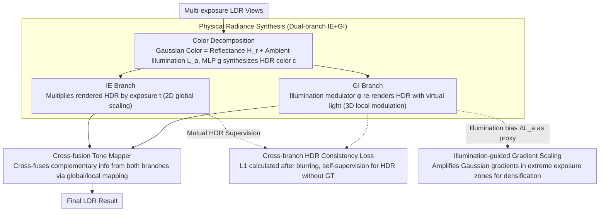

# Physically Inspired Gaussian Splatting for HDR Novel View Synthesis

**Conference**: CVPR 2026  
**arXiv**: [2603.28020](https://arxiv.org/abs/2603.28020)  
**Code**: [https://huimin-zeng.github.io/PhysHDR-GS/](https://huimin-zeng.github.io/PhysHDR-GS/)  
**Area**: 3D Vision / HDR Novel View Synthesis  
**Keywords**: HDR Novel View Synthesis, 3DGS, Physically Inspired Rendering, Dual-branch Architecture, Illumination-guided Gradient Scaling

## TL;DR
PhysHDR-GS is proposed as a physically inspired HDR novel view synthesis framework: it decomposes Gaussian color into intrinsic reflectance and adjustable ambient illumination. It utilizes complementary Image-Exposure (IE) and Gaussian-Illumination (GI) branches to capture HDR details, while a cross-branch HDR consistency loss provides explicit HDR supervision without Ground Truth (GT). Furthermore, illumination-guided gradient scaling addresses the gradient starvation issue caused by exposure bias. It outperforms HDR-GS by 2.04dB on several benchmarks while maintaining real-time rendering at 76FPS.

## Background & Motivation

**Background**: HDR Novel View Synthesis (HDR-NVS) reconstructs high dynamic range scenes by fusing LDR views of different exposures. The evolution from NeRF to 3DGS has significantly accelerated HDR-NVS, with HDR-GS using spherical harmonics for HDR color fitting + MLP tone mapping, and GaussHDR unifying 3D/2D tone mapping while merging dual-branch LDR outputs.

**Limitations of Prior Work**: (1) **Appearance Entanglement**: Object appearance is determined by material properties and environmental conditions (direct/indirect illumination). Simply scaling sensor exposure time fails to decompose these factors or reflect illumination-dependent appearance changes—exposure change $\Delta t$ leads to global intensity shifts, whereas ambient light change $\Delta L_a$ leads to local appearance variations (e.g., reflections on a lucky cat's nameplate). (2) **Implicit HDR Supervision**: HDR ground truth is typically unavailable; supervision of HDR content is only indirectly achieved through constraints on tone-mapped LDR results. However, the compression of dynamic range by tone mapping prevents effective constraints on outlier/saturated HDR values. (3) **Exposure Bias Gradient Starvation**: The slope of the tone mapping curve is extremely small in extreme zones (over/underexposed). Consequently, Gaussian primitives in these areas accumulate far less gradient than those in normally exposed regions, failing to reach the densification threshold and resulting in under-representation.

**Key Challenge**: Existing HDR-NVS methods follow the traditional HDR imaging pipeline—simulating 2D images at different brightness levels via exposure and tone mapping—but do not model illumination in 3D space, thus ignoring environment-dependent attributes of the scene.

**Goal**: (1) Decompose the distinct effects of exposure and ambient illumination on appearance; (2) Provide explicit HDR supervision in the absence of HDR GT; (3) Address gradient starvation and insufficient densification of Gaussians in extreme exposure regions.

**Key Insight**: Derived from the physical rendering equation—modeling Gaussian color as a function of intrinsic reflectance $H_r$ and ambient illumination $L_a$, where exposure $t$ and illumination $L_a$ complementarily modulate the dynamic range.

**Core Idea**: Decompose 3DGS color into reflectance and illumination. Use two complementary branches—IE for exposure-modulated images and GI for illumination-modulated Gaussians—to capture HDR details. Solve HDR supervision and gradient starvation via a cross-branch consistency loss and illumination-guided gradient scaling.

## Method

### Overall Architecture
PhysHDR-GS decomposes each Gaussian's color into intrinsic reflectance $H_r$ (an intrinsic scene property, invariant to exposure) and ambient illumination $L_a$ (adjustable), synthesizing HDR color $\mathbf{c} = g(L_a, H_r)$ via an MLP. Based on this, the framework comprises two complementary branches: (1) **IE Branch**: Applies exposure scaling $I_{HDR} \times t$ on the rendered HDR image to simulate standard camera observations; (2) **GI Branch**: Uses an illumination modulator to adjust the ambient illumination of the 3D Gaussians, rendering a relighted HDR image $\hat{I}_{HDR}$ to capture illumination-dependent appearance changes. The HDR outputs of both branches are fused into the final LDR result via a tone mapper. Two additional mechanisms are applied during training: a cross-branch HDR consistency loss allows mutual supervision between the two paths in the HDR domain to compensate for missing HDR ground truth, and illumination-guided gradient scaling compensates for insufficient densification of Gaussians in extreme exposure areas.

### Key Designs

**1. Physical Radiance Synthesis (Dual-branch IE+GI): Capture Complementary Dynamic Ranges**

Previous methods only scaled sensor exposure time, failing to decompose material from illumination or reflect illumination-dependent changes. This work returns to a simplified rendering equation $L_o(\mathbf{x},\omega_o) = L_e(\mathbf{x}) + L_a(\mathbf{x}) H_r(\mathbf{x},\omega_o)$, decomposing Gaussian color into scene-intrinsic, exposure-invariant reflectance $H_r$ and adjustable ambient illumination $L_a$, with color synthesized via an MLP $\mathbf{c}=g(L_a,H_r)$. Two complementary paths emerge: the IE branch renders an HDR image then scales it by exposure $t$ globally in 2D to pull different brightness bands into the camera response range; the GI branch operates in 3D, using an illumination modulator $\hat{L}_a = \varphi(L_a, l)$ to replace $L_a$ with virtual illumination $\hat{L}_a$ and synthesize $\hat{\mathbf{c}}=g(\hat{L}_a, H_r)$, avoiding saturation by locally adjusting radiance. Their response patterns are complementary—exposure $t$ is a global uniform scale, while ambient illumination $L_a$ is point-wise local modulation. Combining these modulations covers a dynamic range unattainable by exposure alone.

**2. Cross-branch HDR Consistency Loss: Mutual Supervision in the HDR Domain**

As HDR ground truth is generally unavailable, supervision typically relies on tone-mapped LDR results, where compression hides saturated or outlier HDR values. Seeing that IE and GI are two different paths estimating the same HDR radiance, their results should be consistent. Specifically, for each view, the illumination level $l$ is set to the exposure $t$ to make brightness levels comparable. An L1 loss is then calculated between the Gaussian-blurred versions of $I_{HDR} \times t$ and $\hat{I}_{HDR}$:

$$\mathcal{L}_{\text{cons}} = \|\mathcal{G}(I_{HDR} \times t) - \mathcal{G}(\hat{I}_{HDR})\|_1$$

Blurring ensures the constraint focuses on global illumination and low-frequency structures rather than penalizing unaligned high-frequency details. This self-supervision signal acts directly in the HDR domain, filling the gap where LDR supervision is insufficient.

**3. Illumination-guided Gradient Scaling: Compensating for Densification Bias**

Standard 3DGS determines split/clone operations based on screen-space gradient thresholds. However, the slope of tone mapping curves near extreme exposure limits is nearly zero, causing gradients in these areas to be suppressed below the densification threshold, leading to under-densified, blurry regions. Observations show that Gaussian gradients correlate with illumination bias $\Delta L_a = |L_a - \hat{L}_a|$. Thus, a scaling factor $s_a = s \cdot \sigma(|L_a - \hat{L}_a|) + 1$ (where $\sigma$ is sigmoid and $s$ is a hyperparameter) is constructed to modify the densification criterion:

$$\mathbb{I}_i(s_a)\, \frac{1}{M_i}\sum_k \Big\|\frac{\partial \mathcal{L}_k}{\partial \mu_{i,k}^{\text{ndc}}}\Big\|_2 > \tau_p$$

Gaussians with larger illumination bias are amplified more, recovering gradients suppressed by tone mapping and allowing extreme exposure regions to reach the splitting threshold.

**4. Cross-fusion Tone Mapper: Cross-fusing Complementary Information in LDR Space**

The HDR outputs from both branches must be converted to LDR. The tone mapper $f$ consists of two lightweight MLPs: $f_{tm}$ performs both global and local tone mapping on each HDR input, yielding two pairs of LDR predictions; $f_{mix}$ then cross-fuses them: $I_{LDR}^{IG} = f_{mix}(I_{LDR}^{glo}, \hat{I}_{LDR}^{loc})$ and $I_{LDR}^{GI} = f_{mix}(I_{LDR}^{glo}, I_{LDR}^{loc})$. The final LDR is the sum of both. Global mapping maintains brightness consistency while local mapping preserves details, and the cross-fusion allows complementary information from IE and GI to assist each other in the LDR domain.

### Loss & Training
The total loss is $\mathcal{L}_{\text{total}} = \lambda_1 \mathcal{L}_{\text{rec}} + \lambda_2 \mathcal{L}_{\text{cons}} + \lambda_3 \mathcal{L}_{\text{unit}}$, where $\mathcal{L}_{\text{rec}} = \gamma \mathcal{L}_{\text{MSE}} + \mathcal{L}_{\text{D-SSIM}}$ ($\gamma=0.2$) is computed across the three LDR outputs. $\lambda_1=1, \lambda_2=0.5, \lambda_3=0$ (0.5 for synthetic data). The fusion MLP is frozen for the first 10k iterations while only the tone mapping MLP is trained. Training runs for 30k iterations on a single A6000 GPU.

## Key Experimental Results

### Main Results (HDR-NeRF-Real, exp3 setup)

| Method | LDR-OE PSNR↑ | LDR-NE PSNR↑ | LPIPS↓ |
|------|-------------|-------------|--------|
| HDR-NeRF | 34.27 | 32.15 | 0.074 |
| HDR-GS | 34.87 | 31.02 | 0.029 |
| GaussHDR | 36.05 | 33.49 | 0.017 |
| GaussHDR† | 36.32 | 33.84 | 0.014 |
| **Ours†** | **36.91** | **34.15** | **0.012** |

Note: Ours† (Scaffold-GS) is 0.59dB higher than GaussHDR† on LDR-OE.

### Results on Synthetic Data (HDR-NeRF-Syn, exp3 setup)

| Method | LDR-OE PSNR↑ | LDR-NE PSNR↑ | HDR PSNR↑ |
|------|-------------|-------------|-----------|
| HDR-GS | 40.28 | 27.07 | 17.51 |
| GaussHDR† | 43.87 | 42.74 | 39.08 |
| **Ours†** | **44.26** | **43.19** | **39.21** |

### Ablation Study (HDR-NeRF-Real, exp3)

| Configuration | LDR-OE PSNR | LDR-NE PSNR |
|------|-------------|-------------|
| IE branch only | 36.18 | 33.38 |
| + GI branch | 36.27 (+0.09) | 33.46 (+0.08) |
| + HDR-cons | 36.43 (+0.16) | 33.84 (+0.38) |
| + I-GS | **36.91** (+0.48) | **34.15** (+0.31) |

### Efficiency Comparison

| Method | Render(ms) | FPS | Training(min) | Memory(MB) |
|------|---------|-----|-----------|---------|
| HDR-NeRF | 4189 | 0.24 | 500 | 11049 |
| HDR-GS | 9 | 117 | 10 | 5014 |
| GaussHDR | 19 | 53 | 28 | 5596 |
| Ours | **13** | **76** | 15 | **3274** |

### Key Findings
- **Illumination-guided Gradient Scaling (I-GS) makes the largest contribution**—providing a standalone 0.48dB Gain, demonstrating that gradient starvation in extreme exposure regions is a key bottleneck for HDR-NVS.
- **HDR consistency loss provides significant Gain**—especially a 0.38dB Gain on novel exposure (LDR-NE), proving that self-supervision in the HDR domain effectively compensates for information loss in tone mapping.
- **GI branch contributes less individually but synergizes well**—qualitative analysis shows it improves illumination-dependent appearance (e.g., table reflections) and texture distortions.
- **Excellent efficiency**—Ours is 1.43x faster than GaussHDR (76fps vs 53fps) with a memory footprint of only 3274MB (compared to 5596MB for GaussHDR), and a training time of 15min.
- Ours† achieves the best LPIPS scores across all benchmarks, indicating that physical modeling enhances perceptual quality.

## Highlights & Insights
- **The dual design of "Exposure modulates Image, Illumination modulates Gaussian"** is the core insight—exposure $t$ is global scaling in 2D, while illumination $L_a$ is local modulation in 3D. This design, derived naturally from the physical rendering equation, is more theoretically grounded than previous engineering approaches.
- **The discovery and solution for gradient starvation** have universal value—any 3DGS optimization involving non-linear mappings (like gamma correction or tone mapping) may suffer from similar gradient attenuation. Using illumination bias as a proxy for gradient scaling is a transferable finding.
- **Cross-branch self-supervision**—forcing two different paths modeling the same physical quantity (HDR radiance) to be consistent provides explicit supervision where GT is missing.
- **Real-time efficiency**—76FPS and 3274MB memory, which is 322x faster than HDR-NeRF and 1.43x faster than GaussHDR with lower memory usage.

## Limitations & Future Work
- The assumption of uniform hemispherical illumination for ambient light is less accurate for highly directional light sources (e.g., point lights/spots).
- The decomposition of reflectance $H_r$ and illumination $L_a$ relies on an MLP, which may have inherent ambiguities—one observation can be explained by multiple $(H_r, L_a)$ pairs.
- The illumination modulator $\varphi$ is data-driven, potentially limiting generalization to illumination conditions far outside the training exposure range.
- Evaluations were limited to static multi-exposure scenes; performance on dynamic scenes or single-exposure setups remains unknown.
- The GI branch's individual contribution (0.09dB) is relatively small, suggesting the effect of illumination modulation might be limited by the diversity of lighting changes in the training data.

## Related Work & Insights
- **vs HDR-GS**: HDR-GS uses SH for HDR color and an MLP for exposure-conditioned tone mapping without 3D illumination modeling. PhysHDR-GS decomposes color into reflectance/illumination and models light explicitly in 3D space.
- **vs GaussHDR**: GaussHDR is engineering-driven, unifying 3D/2D tone mapping. PhysHDR-GS is physically inspired, where branches represent specific physical modulations (2D global exposure vs 3D local illumination).
- **vs NeRF-based HDR**: Methods like HDR-NeRF are extremely slow in both training and inference (4189ms/frame). PhysHDR-GS inherits the efficiency of 3DGS (13ms/frame).

## Rating
- Novelty: ⭐⭐⭐⭐ The IE+GI dual-branch design derived from physical equations is theoretically elegant; the discovery of gradient starvation and the I-GS solution are valuable new contributions.
- Experimental Thoroughness: ⭐⭐⭐⭐⭐ Three benchmarks, two exposure settings, two backbones, complete ablations, and detailed efficiency analysis.
- Writing Quality: ⭐⭐⭐⭐ Clear derivation from physical equations to method design with intuitive diagrams.
- Value: ⭐⭐⭐⭐ The finding of gradient starvation and I-GS has general value for the 3DGS community, though HDR-NVS is a relatively niche area.

<!-- RELATED:START -->

## Related Papers

- [\[CVPR 2026\] Splatent: Splatting Diffusion Latents for Novel View Synthesis](splatent_splatting_diffusion_latents_for_novel_view_synthesis.md)
- [\[ICCV 2025\] SeHDR: Single-Exposure HDR Novel View Synthesis via 3D Gaussian Bracketing](../../ICCV2025/3d_vision/sehdr_single-exposure_hdr_novel_view_synthesis_via_3d_gaussian_bracketing.md)
- [\[CVPR 2026\] 3D Gaussian Splatting for Efficient Retrospective Dynamic Scene Novel View Synthesis with a Standardized Benchmark](3d_gaussian_splatting_for_efficient_retrospective_dynamic_scene_novel_view_synth.md)
- [\[CVPR 2026\] GeodesicNVS: Probability Density Geodesic Flow Matching for Novel View Synthesis](geodesicnvs_probability_density_geodesic_flow_matching_for_novel_view_synthesis.md)
- [\[CVPR 2026\] From None to All: Self-Supervised 3D Reconstruction via Novel View Synthesis](from_none_to_all_self-supervised_3d_reconstruction_via_novel_view_synthesis.md)

<!-- RELATED:END -->
