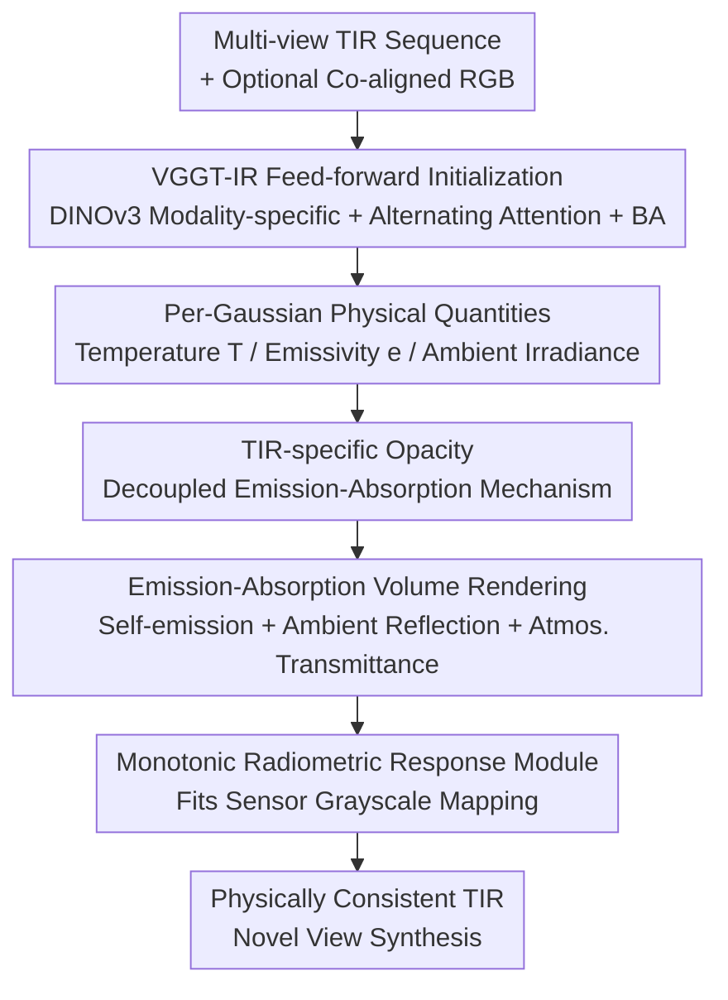

# PhysIR-Splat: Physically Consistent Thermal Infrared Radiative Transfer in 3D Gaussian Splatting

**Conference**: CVPR 2026  
**Paper**: [CVF Open Access](https://openaccess.thecvf.com/content/CVPR2026/html/Gao_PhysIR-Splat_Physically_Consistent_Thermal_Infrared_Radiative_Transfer_in_3D_Gaussian_CVPR_2026_paper.html)  
**Code**: https://github.com/JingyuanGao0919/physir-splat  
**Area**: 3D Vision  
**Keywords**: Thermal Infrared Reconstruction, 3D Gaussian Splatting, Radiative Transfer, Novel View Synthesis, Feed-forward Pose Initialization

## TL;DR
PhysIR-Splat moves beyond simply treating 3DGS color as thermal radiation. Instead, it explicitly assigns three physical quantities—temperature, emissivity, and ambient irradiance—to each Gaussian primitive and embeds the thermal infrared imaging chain ("self-emission + ambient reflection $\rightarrow$ atmospheric transmittance $\rightarrow$ radiometric response") directly into the renderer. Combined with VGGT-IR, a feed-forward initializer that consumes thermal infrared (and optional RGB) to directly regress camera poses and initial geometry, it addresses the long-standing challenge of SfM degradation in weakly textured thermal infrared scenes.

## Background & Motivation
**Background**: Thermal Infrared (TIR) 3D reconstruction restores surface radiance and temperature distributions from multi-view thermal maps, with extensive applications in medicine, industrial inspection, agriculture, and building diagnostics. Traditional methods either manually set geometry and material parameters to synthesize TIR maps using radiative transfer equations, or use RGB for SfM/MVS to reconstruct geometry before texture-mapping thermal images. Recently, 3DGS has been adapted for thermal infrared (Veta-GS, ThermalGaussian, Thermal3D-GS), improving the quality of novel view synthesis.

**Limitations of Prior Work**: Most existing TIR 3DGS methods **directly adopt visible light assumptions, treating the "color" of 3DGS as thermal radiation**, and then use an external physics-inspired module (e.g., ATF/TCM) for post-hoc correction, leading to poor physical consistency. More critically, TIR images suffer from low texture, radiation inconsistency, and Non-Uniform Correction (NUC) residuals, making keypoint detection and matching unreliable. This causes **severe SfM pose estimation degradation**, which in turn undermines 3DGS initialization and convergence—typically manifesting as "floaters" and edge tearing/blurring.

**Key Challenge**: The imaging physics of visible light (color = reflected light) and thermal infrared (grayscale = self-emitted radiation driven by the object's own temperature, nearly independent of external lighting) are fundamentally different. Forcing visible light assumptions onto TIR fails to accurately model view-dependent thermal radiation and atmospheric transmittance, while weak textures cause the "foundation" of SfM to collapse.

**Goal**: (1) Enable rendering to follow true infrared radiative transfer physics; (2) Ensure initialization is robust even in weakly textured and ghosting scenes.

**Key Insight**: The authors start from the physical essence of infrared imaging—pixel radiance = self-emission (Planck band integral) + ambient reflection, followed by atmospheric transmittance attenuation, and finally the non-linear radiometric response of the sensor. Since the physical chain is clear, it is **embedded term-by-term into the Gaussian primitives and volume rendering** rather than being corrected post-hoc. Simultaneously, a feed-forward large model, VGGT, is used to bypass keypoint-based SfM.

**Core Idea**: Assign physical quantities (temperature/emissivity/ambient irradiance) to each Gaussian and integrate infrared radiative transfer into the renderer (PhysIR-Splat), combined with a TIR-specific feed-forward initializer (VGGT-IR) to directly regress pose and geometry in one forward pass. Together, they tackle the dual bottlenecks of "rendering physical authenticity" and "initialization robustness."

## Method

### Overall Architecture
The system consists of two complementary components. **VGGT-IR** takes $N$ infrared views (with optional co-aligned RGB), extracts modality-specific features using a distilled DINOv3 encoder, fuses them via addition, and regresses camera poses, depth, and point maps through an alternating attention backbone in a single forward pass, bypassing keypoint-based SfM. A lightweight BA refines the output for 3DGS initialization. **PhysIR-Splat** uses these initial values to explicitly parameterize temperature $T$, emissivity $e$, and ambient irradiance for each Gaussian primitive. It performs emission-absorption volume rendering ("self-emission + ambient reflection $\rightarrow$ atmospheric transmittance $\rightarrow$ radiometric response") along the rays. The geometry and RGB branches are shared, while radiance and opacity are TIR-specific.

### Key Designs

**1. Per-Gaussian Physical Quantities + Emission-Absorption Rendering: Embedding the IR Chain into the Renderer**

To address the issue of treating 3DGS color as thermal radiation, the authors formulate the imaging chain based on TeV decomposition. The radiance of each primitive is $L_i=e_i\mathcal{B}(T_i)+(1-e_i)\mathcal{I}(n_i)$, where the first term is self-emission and the second is ambient reflection (reflectivity $r=1-e$). Self-emission uses the band-integrated Planck radiation $\mathcal{B}(T)=\int_{\lambda_{min}}^{\lambda_{max}}B_\lambda(T)\,d\lambda$. The authors **precompute a LUT for $\mathcal{B}(T)$ and its derivatives** to ensure end-to-end differentiability and numerical stability. Ambient irradiance is approximated via low-order Spherical Harmonics (SH)—convolving the Lambertian cosine kernel with SH yields $E_{irr}(n)\approx\sum_{l\le2,m}k_lc_{lm}Y_{lm}(n)$ (where $k_0=\pi,k_1=\tfrac{2\pi}{3},k_2=\tfrac{\pi}{4}$), defining reduced irradiance as $\mathcal{I}(n)=E_{irr}(n)/\pi$. Pixel radiance is computed via front-to-back accumulated emission-absorption volume rendering: $\tilde{\mathcal{S}}(u)=\sum_i T^{acc}_{i-1}\alpha_i^{IR}(u)T_{atm}(d_i)L_i$, where $T^{acc}_{i-1}=\prod_{j<i}(1-\alpha_j^{IR}(u))$. This **cleanly separates local absorption, path transmittance, and emission**, ensuring rendering follows IR physics rather than post-hoc corrections of visible light assumptions.

**2. TIR-Specific Opacity: Decoupling Emission-Absorption to Remove Cross-Modality Entanglement**

In visible light, opacity only encodes "light blocking," but in thermal infrared, "opacity" should reflect the absorption-emission mechanism. Using shared opacity causes cross-modality entanglement. The authors define a separate opacity for TIR: the unit peak density $\rho_i(x)=\exp[-\tfrac12(x-\mu_i)^\top\Sigma_i^{-1}(x-\mu_i)]$ integrated along the ray gives $\tau_i(u)=s_iw_i(u)$, where $\sqrt{2\pi/A_i}$ is the equivalent thickness ($A_i=d^\top\Sigma_i^{-1}d$) and $w_i(u)$ is the footprint term. Geometrically normalized constant extinction is set: for a target center opacity $\alpha^\star$, $\bar\kappa=\tfrac{-\ln(1-\alpha^\star)}{\langle\sqrt{2\pi/A_i}\rangle_i}$, $s_i=\bar\kappa\sqrt{\tfrac{2\pi}{A_i}}$, and finally $\alpha_i^{IR}(u)=1-\exp[-s_iw_i(u)]$. This opacity is **used only for TIR**, while geometry and RGB color remain shared. Ablations show that removing this (returning to shared opacity) drops average PSNR by 2.3% and increases LPIPS by 8.0%, proving that TIR-specific opacity effectively mitigates cross-modality entanglement.

**3. Atmospheric Transmittance + Monotonic Radiative Response: Completing Far-field Attenuation and Sensor Non-linearity**

The full radiative transfer covers two additional aspects. First, **Atmospheric Transmittance**: in a uniform atmosphere, $T_{atm}(d_i)=\exp(-\beta d_i)$, where $\beta$ is a learnable extinction coefficient and $d_i$ is the distance from the primitive to the camera. This is particularly important for long-range TIR acquisition to prevent overestimating far-field radiation. Second, **Radiometric Response**: radiative transfer includes weak near-ground path emission $L_{path}$, which the authors absorb into the response end using a global bias $b$ and a monotonic approximator $\psi_\theta$ (a three-layer narrow MLP + Softplus, with weights constrained by $W_\ell=\text{softplus}(\tilde W_\ell)$): $\hat Y(u)=\psi_\theta(g_s\tilde{\mathcal{S}}(u)+b)$. This ensures a **strictly monotonic** "radiance $\rightarrow$ grayscale" mapping to fit sensor non-linearity. Ablations show that removing atmospheric transmittance drops PSNR by 2.1% overall and 3.0% in outdoor scenes, confirming the necessity of far-field modeling.

**4. VGGT-IR: Feed-forward IR Initializer Bypassing Degraded SfM**

Weak textures and NUC residuals cause TIR SfM to fail. VGGT-IR is IR-centric with optional RGB: it uses two independent distilled DINOv3 ViT-L/16 encoders to map IR (and optional RGB) into a shared latent space (IR channel weights are initialized from the mean of RGB weights). After layer normalization, features are **fused via addition** (degenerating to pure IR if RGB is absent), then processed by a 12-layer alternating attention Transformer. Image tokens pass through DPT blocks for dense features, and two lightweight heads regress camera parameters $g_i=[q_i,t_i,f_i]$ and depth/point maps. A lightweight BA refines the poses. Since it regresses pose and geometry in one forward pass, it completely bypasses keypoint-based SfM. Training utilizes a PID diffusion generator to synthesize pixel-aligned IR from BlendedMVS/ScanNet++/Mapillary RGB data, mixed with real multi-spectral data.

### Loss & Training
Total loss: $\mathcal{L}_{TIR}=(1-\lambda-\lambda_{smooth}-\lambda_{emis})\mathcal{L}_1+\lambda\mathcal{L}_{SSIM}+\lambda_{smooth}\mathcal{L}_{smooth}+\lambda_{emis}\mathcal{L}_{emis}$. The smoothness term is a total variation penalty on the 4-neighborhood of the responded image $Y$. The emissivity sparsity-reflection prior $\mathcal{L}_{emis}=\tfrac1N\sum_k\phi([r_k-r_0]_+)$ ($r_k=1-e_k$, $\phi$ is Huber loss) encourages high emissivity and suppresses excessive reflection. Implementation uses PyTorch + Adam + Cosine Annealing (LR decaying to $1.6\times10^{-6}$), training for 30k iterations per scene. Target center opacity $\alpha^\star$ is 0.6 for indoor and 0.4 for outdoor, with $\lambda=0.2, \lambda_{smooth}=\lambda_{emis}=0.05$.

## Key Experimental Results

### Main Results
Comparison with IR-only methods on the TI-NSD dataset (Average column; higher PSNR/SSIM and lower LPIPS are better):

| Method | PSNR↑ | SSIM↑ | LPIPS↓ |
|------|------|------|--------|
| InstantNGP | 24.91 | 0.812 | 0.323 |
| 3DGS | 32.01 | 0.936 | 0.206 |
| Thermal3D-GS | 35.04 | 0.955 | 0.187 |
| Veta-GS | 35.97 | 0.958 | 0.169 |
| Ours | 36.47 | 0.960 | 0.158 |
| **Ours (VGGT-IR)** | **37.33** | **0.962** | **0.150** |

Compared to the previous best, Veta-GS, PhysIR-Splat+VGGT-IR improves average PSNR from 35.97 to 37.33 dB (+1.36 dB).

Comparison with IR+RGB multi-modal methods on RGBT-Scenes (averaging THERMAL/RGB):

| Method | THERMAL PSNR↑ | THERMAL LPIPS↓ | RGB PSNR↑ | RGB LPIPS↓ |
|------|------|------|------|------|
| ThermoNeRF | 22.42 | 0.297 | 17.86 | 0.294 |
| ThermalGaussian | 25.73 | 0.171 | 24.13 | 0.188 |
| Ours | 27.15 | 0.144 | 25.12 | 0.166 |
| **Ours (VGGT-IR)** | **29.09** | **0.119** | **27.44** | **0.142** |

In terms of pose accuracy, VGGT-IR outperforms COLMAP and the original VGGT on Multi-Spectral sequences (e.g., APE-Trans on desk1-xyz-dim2 drops from 0.3107 to **0.0823**).

### Ablation Study
Component-wise ablation on TI-NSD (Average, relative change to Full):

| Configuration | PSNR↑ | SSIM↑ | LPIPS↓ | Description |
|------|------|------|--------|------|
| Full | **37.33** | **0.962** | **0.150** | Complete model |
| w/o VGGT-IR | 36.47 | 0.960 | 0.158 | Back to COLMAP; outdoor drops 3.7% |
| w/o IR Opacity | 36.46 | 0.958 | 0.162 | Shared opacity; LPIPS increases 8.0% |
| w/o Atm. Atten. | 36.56 | 0.957 | 0.157 | No atmospheric transmittance; outdoor PSNR drops 3.0% |

### Key Findings
- **Complementary Components**: VGGT-IR impacts outdoor long-range scenes most, TIR-specific opacity is crucial indoors (mitigating cross-modality entanglement), and atmospheric transmittance is essential for outdoor far-field modeling.
- **Physical Validity of Emissivity**: Estimated emissivity for common materials aligns well with ideal values; only specular materials like glass/steel deviate—consistent with TIR physical limitations.
- **Pose Initialization is the Foundation**: Switching the initializer (VGGT-IR vs. COLMAP) yields consistent improvements across all scenes, confirming that SfM degradation is the primary bottleneck for TIR 3DGS.

## Highlights & Insights
- **Paradigm Shift: From "Post-hoc Correction" to "Physical Embedding"**: Most TIR 3DGS treat color as radiation and add correction modules. This paper embeds the physical chain into the renderer, making physical consistency an intrinsic property rather than a patch—a strategy applicable to other non-visible modalities (e.g., polarization, SAR).
- **TIR-Specific Opacity is the "Special Sauce"**: Recognizing that thermal infrared opacity should reflect absorption-emission rather than just blocking, and decoupling it from geometry/RGB, yields massive improvements (LPIPS +8.0%).
- **Addressing the Root Cause with Feed-Forward Models**: Rather than patching degraded SfM, the authors bypass it with VGGT-IR for robust initialization.
- **LUT + Monotonicity for Stability**: Precomputing Planck integrals as LUTs and using Softplus constraints for the response mapping ensures end-to-end differentiability and numerical stability.

## Limitations & Future Work
- **Diffuse Assumption**: The method assumes clear propagation and negligible LWIR/FIR scattering. Specular materials (glass, polished steel) remain difficult to model accurately.
- **Reliance on Synthetic IR Data**: VGGT-IR relies heavily on PID diffusion-generated IR data; the quantitative impact of the sim-to-real gap on complex real-world scenes is not fully explored. ⚠️
- **Simplified Atmospheric Model**: Exponential transmittance $\exp(-\beta d_i)$ for a uniform atmosphere may be insufficient for non-uniform atmospheres or heavy smoke/aerosols.
- **Per-Scene Calibration**: RGBT-Scenes requires a one-time per-scene color-to-temperature calibration; deployment to new cameras/color-bars still requires manual config.

## Related Work & Insights
- **vs. Thermal3D-GS**: Thermal3D-GS uses physics-inspired modules and consistency losses to **correct** rendering post-hoc while still treating color as radiation; PhysIR-Splat embeds radiative transfer directly.
- **vs. Veta-GS**: Veta-GS uses frustum masks and view-dependent deformation for thermal changes; PhysIR-Splat produces fewer floaters and sharper edges.
- **vs. ThermalGaussian**: ThermalGaussian uses cross-modal regularization; PhysIR-Splat achieves higher metrics in both THERMAL and RGB through cross-modality decoupling (TIR-specific opacity).
- **vs. VGGT**: Original VGGT works for visible light, but accumulates errors in long TIR sequences; VGGT-IR uses DINOv3 multi-modal fusion and IR-centric training to handle low texture and NUC residuals.

## Rating
- Novelty: ⭐⭐⭐⭐⭐ Embeds the full IR radiative transfer chain into the 3DGS renderer + TIR-specific opacity + feed-forward IR initialization.
- Experimental Thoroughness: ⭐⭐⭐⭐ Extensive IR-only/RGBT comparisons, pose accuracy, and emissivity analysis; lacks quantitative sim-to-real analysis.
- Writing Quality: ⭐⭐⭐⭐ Clear motivation and complete physical derivations.
- Value: ⭐⭐⭐⭐⭐ Resolves key physical consistency and SfM degradation issues in TIR 3DGS, with direct value for nighttime/low-light/smoke scene reconstruction; open-sourced.

<!-- RELATED:START -->

## Related Papers

- [\[CVPR 2026\] Thermal is Always Wild: Characterizing and Addressing Challenges in Thermal-Only Novel View Synthesis](thermal_is_always_wild_characterizing_and_addressing_challenges_in_thermal-only_.md)
- [\[CVPR 2026\] AeroDGS: Physically Consistent Dynamic Gaussian Splatting for Single-Sequence Aerial 4D Reconstruction](aerodgs_physically_consistent_dynamic_gaussian_splatting_for_single-sequence_aer.md)
- [\[CVPR 2026\] PointGS: Semantic-Consistent Unsupervised 3D Point Cloud Segmentation with 3D Gaussian Splatting](pointgs_semantic-consistent_unsupervised_3d_point_cloud_segmentation_with_3d_gau.md)
- [\[CVPR 2026\] SplatSuRe: Selective Super-Resolution for Multi-view Consistent 3D Gaussian Splatting](splatsure_selective_super-resolution_for_multi-view_consistent_3d_gaussian_splat.md)
- [\[CVPR 2026\] AnchorSplat: Feed-Forward 3D Gaussian Splatting with 3D Geometric Priors](anchorsplat_feed-forward_3d_gaussian_splatting_with_3d_geometric_priors.md)

<!-- RELATED:END -->
