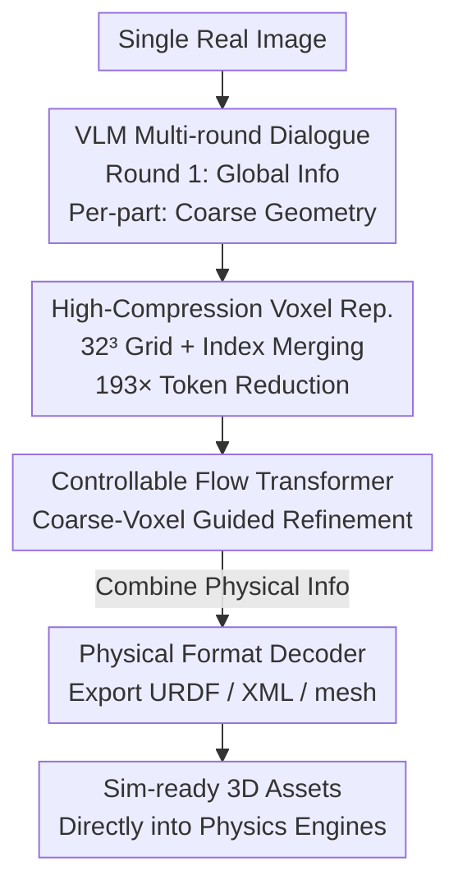

# PhysX-Anything: Simulation-Ready Physical 3D Assets from Single Image

**Conference**: CVPR 2026  
**Paper**: [CVF Open Access](https://openaccess.thecvf.com/content/CVPR2026/html/Cao_PhysX-Anything_Simulation-Ready_Physical_3D_Assets_from_Single_Image_CVPR_2026_paper.html)  
**Code**: None (Project page: https://physx-anything.github.io/)  
**Area**: 3D Vision / Embodied AI  
**Keywords**: Simulation-Ready 3D Generation, VLM, Voxel Representation, Articulated Objects, URDF

## TL;DR
Given a single real-world photo, PhysX-Anything utilizes a fine-tuned VLM through multi-round dialogues to directly generate geometry, joint structures, and physical properties. It employs a voxel representation that compresses geometry tokens by 193×, eventually exporting URDF/XML assets ready for immediate use in physics engines.

## Background & Motivation
**Background**: 3D generation is shifting from "visually appealing static meshes" to "sim-ready physical assets." Mainstream approaches fall into two categories: one focuses on global geometry and appearance (e.g., Trellis, feed-forward diffusion), while the other models part-level hierarchies (part-aware generation). Both produce high-quality visual results.

**Limitations of Prior Work**: These assets almost entirely lack critical physical and joint information—density, absolute scale, and joint constraints are missing, preventing direct import into simulators. Existing work for articulated object generation often follows a "retrieval + motion mapping" path (e.g., URDFormer, Articulate-Anything), fetching a mesh from a library and attaching plausible motions. These methods fail to provide complete joint information and generalize poorly to in-the-wild images. Work on physical deformation either assumes homogeneous materials or ignores key physical quantities. Even PhysXGen, which generates physical 3D assets, does not support plug-and-play integration into standard simulators.

**Key Challenge**: Using a VLM to unify the generation of geometry, joints, and physics encounters a hard constraint—**VLM token budgets are limited, while detailed 3D geometry sequences are extremely long**. Existing mesh-to-text serialization schemes suffer from token explosion; compression via 3D VQ-GAN introduces extra special tokens and custom tokenizers, complicating training and deployment.

**Goal**: To step-wise generate sim-ready assets from a single real image, including explicit geometry, joint structures, and physical properties, ready for deployment in physics engines.

**Key Insight**: A VLM can unify the prediction of geometry/joints/physics when paired with a high-compression voxel representation (193× reduction, no special tokens). A controllable flow transformer can then refine the coarse geometry into high-fidelity meshes for URDF/XML export.

## Method

### Overall Architecture
PhysX-Anything follows a **global-to-local** multi-round dialogue pipeline. Given a real image, the fine-tuned VLM generates "global information" in the first round—object name, category, scale, material/density/affordance/description for each part, and joint grouping/types. Subsequently, **an independent dialogue is initiated for each part**, feeding only the shared global information back into the prompt (discarding other parts' geometry to prevent context-length-induced forgetting) to output the coarse geometry on a $32^3$ voxel grid. All coarse geometries and global information form a "physical representation," which is sent to the decoder: a controllable flow transformer refines coarse voxels into high-resolution geometry, and a format decoder combines global physical data to export URDF, XML, part-level meshes, and other common formats.

### Key Designs

**1. High-Compression Voxel Representation: Fitting Geometry into VLM Token Budgets**

This design directly addresses the core contradiction between limited VLM tokens and long 3D geometry sequences. The authors abandon mesh-text serialization (token explosion) and VQ-GAN (special tokens + new tokenizer) in favor of a **coarse-to-fine** voxel strategy: the VLM handles coarse geometry on a $32^3$ grid, while details are handled by the downstream decoder. Simply converting mesh to coarse voxels reduces tokens by 74×. To further compress redundancy in sparse voxels, the $32^3$ grid is linearized into indices from $0$ to $32^3-1$; **only occupied voxels are serialized**, and adjacent occupied indices are merged into continuous ranges using hyphens `-` (e.g., `199-216` instead of enumerating each). This achieves a **193× token compression rate** without special tokens or a custom tokenizer, avoiding large-scale task-specific pre-training.

**2. Tree-Structured Physical Representation: VLM-Readable Physics and Joints**

Global information is represented in a tree-structured, VLM-friendly JSON-style format (following the PhysXGen philosophy). Compared to standard URDF files, this format provides richer physical attributes and text descriptions, facilitating VLM reasoning. The key is **joint-geometry consistency**: kinematic parameters (motion direction, axis position, range) are transformed into the voxel space. This ensures joint structures and voxel geometry share the same coordinate system. Each part includes attributes like material, density, absolute scale, and affordance, making the output "physically complete."

**3. Controllable Flow Transformer: Geometry Refinement via Coarse Voxel Guidance**

The $32^3$ coarse voxels from the VLM are too low-resolution for direct use. Taking inspiration from ControlNet, a transformer control module is added to the flow transformer architecture. **The coarse voxel representation acts as a condition** to guide the diffusion model in synthesizing fine-grained voxel geometry. The training objective is:
$$L_{geo} = \mathbb{E}_{t,x_0,\epsilon,c,V_{low}}\left\| f_\theta(x_t, c, V_{low}, t) - (\epsilon - x_0) \right\|_2^2,$$
where $V_{low}$ is the coarse voxel, $x_0$ is the fine-grained target, $\epsilon$ is Gaussian noise, $c$ is the image condition, $t$ is the timestep, and $f_\theta$ is the controllable flow transformer. Noisy samples are obtained via interpolation $x_t = (1-t)x_0 + t\epsilon$. Once fine voxels are obtained, a pre-trained structured latent diffusion model generates meshes/radiance fields/3D Gaussians. Nearest-neighbor algorithms partition the mesh into part-level components based on voxel ownership before exporting the final formats. Qwen2.5 is used as the base VLM.

### Loss & Training
The core training objective is $L_{geo}$ (geometry refinement loss in flow matching form). The VLM is fine-tuned on the self-built PhysX-Mobility dataset using customized multi-round dialogues to learn both global descriptions (overall physics and structural attributes) and local information (part-level geometry).

## Key Experimental Results

### Main Results
PhysX-Anything was compared against URDFormer, Articulate-Anything, and PhysXGen on the PhysX-Mobility test set. Most notably, the **absolute scale error dropped from 43.44 (PhysXGen) to 0.30** (a >99% relative improvement), thanks to strong VLM priors. It also achieved the highest scores in description quality due to the VLM's inherent text-friendliness.

| Method | PSNR↑ | CD↓ | F-score↑ | Abs. Scale↓ | Material↑ | Affordance↑ | Kinematics(VLM)↑ | Description↑ |
|------|-------|-----|----------|-----------|-------|---------|--------------|-------|
| URDFormer | 7.97 | 48.44 | 43.81 | – | – | – | 0.31 | – |
| Articulate-Anything | 16.90 | 17.01 | 67.35 | – | – | – | 0.65 | – |
| PhysXGen | 20.33 | 14.55 | 76.3 | 43.44 | 6.29 | 9.75 | 0.71 | 12.89 |
| **Ours** | **20.35** | **14.43** | **77.50** | **0.30** | **17.52** | **14.28** | **0.83** | **19.36** |

On in-the-wild tests (approx. 100 web images), VLM evaluation using GPT-5 showed significant leads in geometry and kinematics:

| Method | Geometry(VLM)↑ | Kinematics(VLM)↑ |
|------|-----------|------------------|
| URDFormer | 0.29 | 0.31 |
| Articulate-Anything | 0.61 | 0.64 |
| PhysXGen | 0.65 | 0.61 |
| **Ours** | **0.94** | **0.94** |

In user studies (14 volunteers, 1568 valid ratings, 0–5 normalized), PhysX-Anything achieved near-perfect human preference scores (Geometry 0.98, Absolute Scale 0.95, Kinematics 0.94, Description 0.96), far exceeding PhysXGen (Geometry 0.61).

### Ablation Study
Comparison of three compact representations (original mesh and vertex quantization caused OOM and were excluded). Results show: **the higher the token compression and the better the explicit structure preservation, the more complete the geometry.** Other representations suffered significant degradation due to token budget limits.

| Representation | PSNR↑ | CD↓ | F-Score↑ | Abs. Scale↓ | Material↑ | Affordance↑ | Kinematics(VLM)↑ | Description↑ |
|------|-------|-----|----------|-----------|-------|---------|--------------|-------|
| PhysX-Anything-Voxel | 16.96 | 17.81 | 63.10 | 0.40 | 12.32 | 11.63 | 0.39 | 17.38 |
| PhysX-Anything-Index | 18.21 | 16.27 | 68.70 | 0.30 | 13.35 | 12.04 | 0.76 | 17.97 |
| **Ours (Full)** | **20.35** | **14.43** | **77.50** | **0.30** | **17.52** | **14.28** | **0.94** | **19.36** |

### Key Findings
- **Representation is the Performance Driver**: From pure Voxel → Index → Full "Index + Range Merging," PSNR rose from 16.96 to 20.35 and Kinematics(VLM) from 0.39 to 0.94. Nearly all metrics improved monotonically, showing that the compression strategy helps the VLM learn more complete geometry within a limited budget.
- **VLM Priors Boost Physical Attributes**: Absolute scale error was slashed from 43.44 to 0.30. Gains in materials, affordance, and descriptions confirm that text-friendly VLMs excel at aligning physical properties with part semantics.
- **True Simulation Readiness**: Assets like faucets, cabinets, lighters, and glasses can be directly imported into MuJoCo-style simulators for contact-intensive robotic policy learning, proving that "sim-ready" is a functional reality.

## Highlights & Insights
- **Token Compression as a Core Geometric Modeling Task**: The 193× compression relies on a simple serialization trick (voxel indexing + hyphenated range merging) without special tokens, bypassing the training complexity of VQ-GAN. This trick is transferable to any task requiring structured geometry/layout generation via VLMs.
- **Multi-round Dialogue + Global Context Retention**: Part geometries are generated independently while sharing global context. This mitigates context forgetting in long prompts and naturally supports objects with an arbitrary number of parts.
- **Unified Voxel Coordinate Space**: Transforming joint parameters into the voxel space ensures coordinate consistency between geometry and kinematics, a critical detail for direct simulation compatibility.

## Limitations & Future Work
- Coarse geometry is fixed at $32^3$ voxels; extremely fine structures (thin plates, thin rods) may be lost at the coarse stage. The limits of the refinement stage remain to be explored ⚠️.
- Although PhysX-Mobility doubles the categories (47 classes, 2K+ objects), it still relies on manual annotations from PartNet-Mobility, limiting coverage of long-tail real-world categories and soft/non-rigid objects.
- Physical properties (density, material) are inferred via VLM text rather than measured. Accuracy on rare materials requires caution.
- Future directions: Higher/adaptive voxel resolution, support for soft and multi-material objects, and closed-loop calibration between physical attribute prediction and real-world simulation.

## Related Work & Insights
- **vs. PhysXGen**: Both generate physical 3D assets, but PhysXGen uses a diffusion paradigm and its outputs are not natively compatible with standard simulators. This work uses a VLM paradigm + tree-structured representation + voxel geometry to export URDF/XML, reducing scale error from 43.44 to 0.30.
- **vs. URDFormer / Articulate-Anything**: These use retrieval + motion mapping with limited joint info and poor generalization. This work synthesizes geometry and physics from scratch, showing significantly stronger generalization (in-the-wild geometry 0.94 vs. 0.29/0.61).
- **vs. ShapeLLM-Omni / MeshLLM / LLaMA-Mesh**: These are VLM-based, but ShapeLLM-Omni uses 3D VQ-VAE (special tokens + new tokenizer) and others use simplified meshes. This work's voxel index representation offers higher compression with zero special tokens, ensuring simpler training.

## Rating
- Novelty: ⭐⭐⭐⭐⭐ First single-image to sim-ready physical 3D generation paradigm; the 193× compression logic is ingenious.
- Experimental Thoroughness: ⭐⭐⭐⭐ Comprehensive main experiments, in-the-wild tests, user studies, and ablation on representations; lacks independent ablation for architecture modules like the flow transformer.
- Writing Quality: ⭐⭐⭐⭐ Clear motivation and representation design; some implementation details should be cross-referenced with the original text.
- Value: ⭐⭐⭐⭐⭐ Directly bridges the gap between single images and simulation-ready assets, offering clear value for embodied AI and robotic policy learning.

<!-- RELATED:START -->

## Related Papers

- [\[CVPR 2026\] PhysHead: Simulation-Ready Gaussian Head Avatars](physhead_simulation-ready_gaussian_head_avatars.md)
- [\[CVPR 2026\] ArtLLM: Generating Articulated Assets via 3D LLM](artllm_generating_articulated_assets_via_3d_llm.md)
- [\[CVPR 2026\] ReWeaver: Towards Simulation-Ready and Topology-Accurate Garment Reconstruction](reweaver_towards_simulation-ready_and_topology-accurate_garment_reconstruction.md)
- [\[NeurIPS 2025\] PhysX-3D: Physical-Grounded 3D Asset Generation](../../NeurIPS2025/3d_vision/physx-3d_physical-grounded_3d_asset_generation.md)
- [\[CVPR 2026\] Human Interaction-Aware 3D Reconstruction from a Single Image](human_interaction-aware_3d_reconstruction_from_a_single_image.md)

<!-- RELATED:END -->
