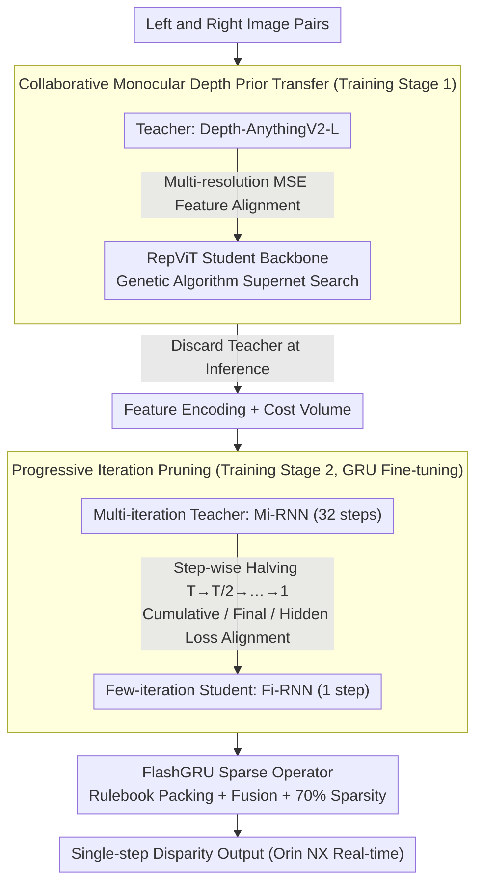

# PIP-Stereo: Progressive Iterations Pruner for Iterative Optimization based Stereo Matching

**Conference**: CVPR 2026  
**arXiv**: [2602.20496](https://arxiv.org/abs/2602.20496)  
**Code**: [GitHub](https://github.com/XPENG-Aridge-AI)  
**Area**: 3D Vision  
**Keywords**: Stereo Matching, Iterative Optimization Pruning, Edge Deployment, FlashGRU, Monocular Depth Prior Transfer

## TL;DR
Reveals spatial sparsity and temporal redundancy in iterative stereo matching disparity updates. Proposes Progressive Iterations Pruner (PIP) to compress 32 iterations into 1, a collaborative learning paradigm for depth prior transfer without independent monocular encoders, and a hardware-aware FlashGRU operator (7.28× speedup). This enables high-precision iterative stereo matching to achieve real-time inference on Jetson Orin NX (75ms/frame, 320×640) for the first time.

## Background & Motivation
**Background**: Iterative optimization-based stereo matching methods (e.g., RAFT-Stereo, IGEV, MonSter) consistently dominate accuracy leaderboards across benchmarks by utilizing Gated Recurrent Units (GRU) for iterative refinement.

**Limitations of Prior Work**:
   - The recurrent structure of GRUs faces severe deployment bottlenecks on edge devices: iterative loops in static computation graphs hinder operator fusion and are sensitive to quantization noise; high-resolution inputs demand extreme memory bandwidth.
   - These physical bottlenecks **cannot be captured by simple scalar metrics** like FLOPs or parameter count.
   - Recent state-of-the-art methods like MonSter require approximately 7.6s/frame (384×1344) on Orin NX, failing to meet real-time requirements.
   - Existing real-time methods accelerate by completely removing the RNN, significantly sacrificing generalization and accuracy.

**Key Challenge**: The trade-off between the high accuracy/generalization provided by iterative refinement and the deployment-unfriendly nature of RNNs on edge hardware.

**Key Insight**: Analysis of iterative behaviors in RAFT-Stereo and IGEV on Middlebury reveals that disparity updates are **highly sparse** (less than 1% of pixels are still updating by the 32nd iteration) and **highly redundant** (the overlap rate of update positions in adjacent iterations is >0.99).

**Core Idea**: Compress multi-step recursion into near single-step inference using progressively halved iteration pruning, supplemented by monocular prior transfer without independent encoders and hardware-aware sparse GRU.

## Method

### Overall Architecture
The core contradiction addressed is that iterative refinement yields high accuracy, but GRU recursive loops are slow and difficult to quantize on edge hardware. The proposed methodology consists of two-stage training plus a set of inference operators. The first stage implements collaborative monocular depth prior transfer, allowing the stereo matching feature encoder to absorb knowledge from a large monocular depth model during training without carrying it during inference. The second stage performs progressive iteration pruning (PIP) fine-tuning, gradually halving the original 32 iterations down to 1 by fine-tuning only the GRU modules while freezing other components. Finally, the specialized FlashGRU sparse operator is deployed during inference to accelerate the single iteration. These components target three specific bottlenecks: heavy monocular encoders, excessive iterations, and fragmented memory access in GRU operators.

### Key Designs

**1. Collaborative Monocular Depth Prior Transfer: Leverage Large Models for Training, Discard for Inference**

Methods like MonSter and DEFOM-Stereo utilize monocular depth priors but embed a complete foundation depth model as an independent encoder in the inference pipeline, incurring significant overhead. This work adopts Teacher-Student collaborative learning: the teacher is Depth-AnythingV2-L, while the student uses a backbone built with RepViT blocks. Feature alignment via MSE loss is applied to both multi-resolution context features and cost volume embeddings. Crucially, the student architecture is determined via Genetic Algorithm supernet search to optimize the allocation of RepViT blocks across four resolution layers, balancing high-frequency details and abstract semantics. Once trained, the student retains the teacher's knowledge while the teacher is discarded, keeping the inference pipeline lightweight.

**2. Progressive Iteration Pruning (PIP): Compressing 32-step Recursion to 1-step via Distillation**

To address the bottleneck of 32 GRU recursions, PIP avoids the accuracy drop of direct truncation by using step-wise halving: $T \to T/2 \to T/4 \to \cdots \to 1$. In each stage, a "few-iteration" student approximates a "multi-iteration" teacher. Formally, considering the multi-iteration RNN (Mi-RNN) as a discrete dynamical system $\mathbf{z}_{t+1} = \mathcal{F}_\theta(\mathbf{z}_t)$, the few-iteration RNN (Fi-RNN) $\mathbf{z}_{s+1} = \mathcal{G}_\phi(\mathbf{z}_s)$ is trained to approximate the $r$-step composition $\mathcal{F}^{(r)}$, enabling the student to mimic $r$ teacher steps in a single step.

To ensure trajectory equivalence, three losses constrain the accumulated updates, final results, and hidden states:

$$\mathcal{L}_{\text{cum}} = \sum_s \Big\|\sum_{k=1}^s \mathbf{d}_k^{\text{Fi}} - \sum_{k=1}^s \bar{\mathbf{d}}_k^{\text{Mi}}\Big\|_2^2,\quad \mathcal{L}_{\text{final}} = \|\mathbf{d}_S^{\text{Fi}} - \Psi(\mathbf{z}_T^{\text{Mi}})\|_2^2,\quad \mathcal{L}_{\text{hid}} = \sum_s \|\mathbf{z}_s^{\text{Fi}} - \mathbf{z}_{rs}^{\text{Mi}}\|_2^2$$

$\mathcal{L}_{\text{cum}}$ aligns accumulated disparity updates to maintain the "integral" trajectory; $\mathcal{L}_{\text{final}}$ anchors the final disparity; $\mathcal{L}_{\text{hid}}$ aligns the student's hidden state at step $s$ with the teacher's at step $rs$. This effectively learns a coarse-grained operator to approximate a fine-grained multi-step composition while preserving trajectory characteristics.

**3. FlashGRU: Accelerating the Single GRU step via I/O-Aware GPU Memory Access Optimization**

FlashGRU focuses on I/O-aware reordering of sparse GRU memory access on the GPU. It consists of three components: first, a multi-resolution Rulebook that identifies pixels requiring updates via importance maps and creates a static bi-directional index map to pack sparse pixels into contiguous GPU buffers; second, recurrent operator fusion that implements expanded recursive calculations as a temporal fused kernel to minimize memory write-backs; third, a 70% sparsity constraint that executes updates only for top-k important pixels. Combined, these provide a **7.28× speedup**, **76.6% peak memory reduction**, and **80.9% reduction in global memory requests** at 2K resolution compared to native ConvGRU.

### Loss & Training
The total loss during the PIP stage is the sum of three components: $\mathcal{L} = \mathcal{L}_{\text{cum}} + \mathcal{L}_{\text{final}} + \mathcal{L}_{\text{hid}}$. Only GRU modules are fine-tuned while others remain frozen. The training set includes SceneFlow, CREStereo, TartanAir, SintelStereo, FallingThings, and InStereo2K.

## Key Experimental Results

### Main Results (In-domain Performance, 384×1344, Orin NX FP32)

| Method | Iterations | SceneFlow EPE↓ | ETH3D Bad-1↓ | KITTI15 D1-all↓ | Latency(s)↓ |
|------|--------|---------------|-------------|----------------|---------|
| MonSter++ | 32 | 0.37 | 0.25 | 1.37 | 7.63 |
| DEFOM-Stereo | 32 | 0.42 | 0.70 | 1.33 | 5.05 |
| IGEV | 12 | 0.49 | 1.12 | 1.59 | 1.29 |
| RT-MonSter++ | 4 | 0.76 | 1.32 | 1.69 | 0.79 |
| **PipStereo (Ours)** | **1** | **0.45** | **0.35** | **1.44** | **0.44** |

### Comparison with Real-time Methods

| Method | Iterations | SceneFlow EPE↓ | ETH3D Bad-1↓ | KITTI15 D1-all↓ | Latency(s)↓ |
|------|------|---------------|-------------|----------------|---------|
| CoEx | ✗ | 0.67 | 19.78 | 2.02 | 0.17 |
| HITNet | ✗ | 0.55 | 2.79 | 1.98 | 0.44 |
| FastACVNet+ | ✗ | 0.59 | 5.62 | 2.01 | 0.27 |
| **PipStereo (Ours)** | 1 | **0.45** | **0.35** | **1.44** | 0.44 |

### Key Findings
- PipStereo achieves accuracy near IGEV (12 iterations) with only 1 iteration: Bad-1 on ETH3D decreased from 1.12 to 0.35 (-73.4%), and SceneFlow EPE decreased from 0.49 to 0.45 (-13.5%).
- PipStereo significantly outperforms all non-RNN real-time methods in terms of accuracy.
- Execution on Jetson Orin NX (320×640) takes only 75ms (FP16); 19ms on RTX 4090.
- FlashGRU achieves 7.28× speedup at 2K resolution, with greater benefits at higher resolutions.

## Highlights & Insights
- **Empirical Analysis of Iteration Redundancy**: Visualizing update positions and hit ratios provides intuitive evidence that iterative refinement performs little meaningful work after 10 steps, establishing a solid foundation for pruning.
- **Dynamical System Perspective for Pruning**: Formalizing iteration pruning as learning a coarse-grained operator ensures theoretical elegance and practical efficacy, with minimal accuracy loss per halving step.
- **FlashGRU Engineering**: Moves beyond reducing compute to deep analysis of GPU memory access patterns (I/O-aware), using structured sparsity and compact packing to reduce write-backs. This hardware-algorithm co-design is highly instructive for edge deployment.
- **Prior Transfer without Independent Encoders**: Successfully leverages knowledge from foundation models while maintaining a lightweight inference pipeline, fulfilling the "train heavy, infer light" paradigm.

## Limitations & Future Work
- Extreme compression down to 1 iteration still incurs accuracy costs on certain metrics compared to multi-step methods (e.g., KITTI 2012 Out-2).
- FlashGRU offers limited marginal gains when the iteration count is extremely low (e.g., exactly 1 iteration).
- Supernet search is customized for specific frameworks and requires re-searching for other architectures.
- Current validation focuses on the IGEV family; applicability to RAFT-Stereo (zero-initialization paradigm) requires further verification.

## Related Work & Insights
- **vs. RT-IGEV++ / RT-MonSter++**: These accelerate via iteration truncation or backbone reduction, which causes severe accuracy loss. PIP maintains accuracy through distillation-based progressive pruning.
- **vs. Real-time Methods (CoEx, HITNet, etc.)**: These remove RNNs entirely for custom architectures, sacrificing generalization for speed. PipStereo preserves the essence of iterative optimization while compressing it to the limit.
- **vs. MonSter / DEFOM-Stereo**: These embed full monocular depth foundation models, leading to high inference overhead. PipStereo's collaborative learning eliminates the need for the teacher network during inference.

## Rating
- Novelty: ⭐⭐⭐⭐⭐ Analysis of redundancy combined with PIP and hardware-aware GRU forms a complete logical chain.
- Experimental Thoroughness: ⭐⭐⭐⭐⭐ Extremely thorough, including in-domain/out-domain testing across hardware and performance profiling.
- Writing Quality: ⭐⭐⭐⭐ Technical details are solid, though some sections are slightly verbose.
- Value: ⭐⭐⭐⭐⭐ First to enable real-time iterative stereo matching on edge devices, providing direct value for autonomous driving deployment.

<!-- RELATED:START -->

## Related Papers

- [\[CVPR 2026\] Lite Any Stereo: Efficient Zero-Shot Stereo Matching](lite_any_stereo_efficient_zero-shot_stereo_matching.md)
- [\[CVPR 2026\] Fast-FoundationStereo: Real-Time Zero-Shot Stereo Matching](fast-foundationstereo_real-time_zero-shot_stereo_matching.md)
- [\[CVPR 2025\] Consistency-aware Self-Training for Iterative-based Stereo Matching](../../CVPR2025/3d_vision/consistency-aware_self-training_for_iterative-based_stereo_matching.md)
- [\[CVPR 2026\] GS-ASM: 2DGS-Supervised Active Stereo Matching](gs-asm_2dgs-supervised_active_stereo_matching.md)
- [\[CVPR 2026\] PromptStereo: Zero-Shot Stereo Matching via Structure and Motion Prompts](promptstereo_zero-shot_stereo_matching_via_structure_and_motion_prompts.md)

<!-- RELATED:END -->
