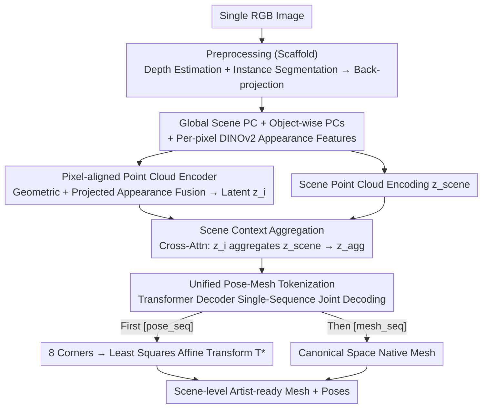

# PixARMesh: Autoregressive Mesh-Native Single-View Scene Reconstruction

**Conference**: CVPR 2026  
**arXiv**: [2603.05888](https://arxiv.org/abs/2603.05888)  
**Code**: [Project Page](https://mlpc-ucsd.github.io/PixARMesh)  
**Area**: 3D Vision  
**Keywords**: Single-view scene reconstruction, autoregressive mesh generation, native mesh, artist-ready, compositional 3D

## TL;DR
The study proposes PixARMesh, the first autoregressive framework for single-view scene reconstruction in native mesh space (rather than SDF). By enhancing point cloud encoders with pixel-aligned image features and global scene context, and predicting object poses and meshes simultaneously within a unified token sequence, it achieves scene-level SOTA on 3D-FRONT while outputting compact, editable, artist-ready meshes.

## Background & Motivation
**Background**: Single-view 3D scene reconstruction is a long-standing ill-posed problem. Compositional generation paradigms have recently gained attention due to advancements in large-scale object-level reconstruction models (e.g., TRELLIS, CLAY).

**Limitations of Prior Work**:
   - Monolithic methods (e.g., Panoptic3D, Uni-3D) are limited by voxel resolution and the finite expressiveness of feed-forward decoders.
   - Compositional methods (e.g., Gen3DSR, DeepPriorAssembly) require completing occlusions before generation, followed by optimization-based layout estimation—often leading to local optima.
   - MIDI avoids layout optimization but generates directly in normalized scene coordinates and still utilizes SDF.
   - **All existing methods rely on SDF representations**, requiring Marching Cubes for surface extraction, which produces over-triangulated, overly smooth, high-poly meshes unsuitable for editing.

**Key Challenge**: Mesh generation models (MeshGPT, EdgeRunner, BPT) are restricted to single-object outputs; no existing method has scaled them to scene-level reconstruction.

**Key Insight**: Utilize pre-trained object-level autoregressive mesh generators (EdgeRunner/BPT) by enhancing their point cloud encoders to incorporate appearance and global context, enabling joint pose and mesh prediction via a unified token sequence.

**Core Idea**: Jointly predict object poses (tokenized as bounding box corners) and native meshes (tokenized as vertices/faces) in a single autoregressive sequence, bypassing SDF extraction and post-processing layout optimization.

## Method

### Overall Architecture
PixARMesh aims to directly output the native meshes of every object in a scene from a single RGB image, including their positions and orientations, without using SDF or post-hoc layout optimization. The process is divided into two phases. The first phase generates "point cloud cues from images" using established tools: depth estimation and instance segmentation partition the image, and per-pixel depth is back-projected into 3D points. This yields a global scene point cloud and several object-level point clouds, preserving DINOv2 appearance features for each pixel. The second phase involves the trained component: an enhanced point cloud encoder that fuses geometry and appearance while injecting global scene context. Finally, a Transformer decoder jointly predicts the object pose sequence followed by the mesh vertex/face sequence in a single token stream. Essentially, the core is to decode "placement" and "form" jointly within the same autoregressive sequence.



### Key Designs

**1. Pixel-aligned Point Cloud Encoder: Incorporating Appearance Cues**

Original models like EdgeRunner/BPT are single-object mesh generators whose encoders only process coordinates. This is insufficient for single-view scenes where objects are heavily occluded, making it impossible to infer complete geometry from visible points alone. PixARMesh recovers image appearance by projecting each 3D point $p$ in the instance point cloud $P_i$ back to the image plane $(u,v)=\text{Proj}(K,p)$ using camera intrinsics. The DINOv2 feature $\mathbf{f}_p^{\text{img}}$ from the corresponding pixel is concatenated with the point's geometric feature $\mathbf{f}_p^{\text{pc}}$ and fed into a Transformer fusion block. A set of learnable query vectors then aggregates these point-wise features into a compact latent code $\mathbf{z}_i$. This binds texture, material, and semantic cues to each point, allowing the encoder to hallucinate occluded parts more reliably.

**2. Scene Context Aggregation: Global Scene Awareness**

Observing an isolated cluster of points for one object is insufficient for accurate shape completion or precise pose estimation. However, scenes often contain identical or similar objects (e.g., rows of chairs), where the geometry of neighbors serves as a strong supplementary cue. To leverage this, PixARMesh first normalizes all point clouds within a **unified scene coordinate system** rather than individually per object, preserving spatial relationships. The global scene point cloud is encoded into $\mathbf{z}_{\text{scene}}$, which the object latents aggregate via cross-attention:

$$\mathbf{z}_i^{\text{agg}} = \text{CrossAttn}(q=\mathbf{z}_i,\ k=\mathbf{z}_{\text{scene}},\ v=\mathbf{z}_{\text{scene}})$$

This aggregated $\mathbf{z}_i^{\text{agg}}$ serves as the condition for the decoder. Ablation studies show this module provides the largest contribution (reducing scene CD from 57.78 to 39.30), particularly under heavy occlusion.

**3. Unified Pose-mesh Tokenization: Encoding "Placement" as Mesh Tokens**

To output pose and mesh in a single sequence without inventing a separate token set for pose, PixARMesh represents object pose as a gravity-aligned 7-DoF bounding box defined by its **8 corner 3D coordinates**. These coordinates reuse the existing coordinate vocabulary of the mesh generator. For EdgeRunner, each point is split into three tokens `<x><y><z>` (24 tokens for 8 corners); for BPT, each point uses two tokens `<block_id><offset_id>` (16 tokens total). The unified sequence structure is:

```
<bos> [pose_seq] <sep> [mesh_seq] <eos>
```

The pose segment accounts for only 16–24 tokens, which is negligible compared to mesh sequences that often exceed a thousand tokens, yet it embeds layout information into the same vocabulary space at zero cost. During inference, a least-squares fit on the 8 decoded corners determines the affine transform $\mathbf{T}^\star$ to move the canonical mesh into its scene position. Joint decoding proves more accurate than a two-stage approach as pose and mesh serve as conditions for each other.

### Loss & Training
The model uses standard next-token cross-entropy: $\mathcal{L}_{\text{ce}} = -\sum_t \log p_\theta(s_t \mid s_{<t}, \mathbf{z}_{\text{agg}})$, where pose and mesh tokens are predicted uniformly. During training, $\pm 0.02$ jitter is added to depth values to simulate monocular depth estimation errors, making the model robust to upstream noise. Training on 8×H100 GPUs takes approximately 2 days for the EdgeRunner variant and 18 hours for the BPT variant.

## Key Experimental Results

### Main Results (3D-FRONT Dataset)

| Method | Scene CD↓(×10⁻³) | Scene CD-S↓ | Scene F-Score↑ | Object CD↓ | Object F-Score↑ |
|------|---------------|-----------|-------------|---------|-------------|
| InstPIFu | 213.4 | 124.9 | 13.72% | 44.74 | 29.63% |
| MIDI | 156.3 | 79.3 | 24.83% | 6.71 | 72.69% |
| DepR | 153.2 | 56.4 | 25.00% | **2.57** | **89.66%** |
| **Ours-ER** | **98.8** | **49.1** | **33.55%** | 4.04 | 82.27% |
| **Ours-BPT** | **98.4** | **47.6** | 32.26% | 4.57 | 80.30% |

### Ablation Study (Necessity of Joint Pose-Mesh Modeling)

| Configuration | Scene CD↓ | Scene F-Score↑ | Object CD↓ | Object F-Score↑ |
|------|---------|-------------|---------|-------------|
| EdgeRunner-FT (No Layout) | 119.8 | 27.81% | 4.75 | 80.57% |
| Two-stage (Separate Models) | 99.8 | 33.32% | 4.75 | 80.85% |
| **Ours (Joint)** | **98.8** | **33.55%** | **4.04** | **82.27%** |

### Ablation Study (Module Contribution, using GT Input)

| Image Features | Scene Context | Scene CD↓ | Scene F-Score↑ | Object CD↓ |
|---------|----------|---------|-------------|---------|
| ✗ | ✗ | 57.78 | 41.02% | 5.29 |
| ✓ | ✗ | 55.44 | 42.84% | 5.56 |
| ✗ | ✓ | 39.30 | 44.67% | 3.64 |
| ✓ | ✓ | 39.88 | 46.15% | 4.04 |

### Key Findings
- PixARMesh achieves comprehensive SOTA in scene-level metrics, reducing scene CD from DepR's 153.2 to 98.4 (-36%) and improving F-Score from 25% to 33.6%.
- Object-level accuracy remains higher in DepR (CD 2.57 vs 4.04) because diffusion-generated SDFs provide higher geometric precision. However, PixARMesh outputs compact artist-ready meshes (thousands of faces) compared to the dense, high-poly outputs of SDF methods.
- **Scene context aggregation is the most critical module**: its inclusion reduces scene CD from 57.78 to 39.30, a significantly larger contribution than image features alone.
- Joint modeling outperforms two-stage approaches: object CD drops from 4.75 to 4.04, proving that geometry generation benefits from pose reasoning.
- The EdgeRunner variant outperforms the BPT variant due to higher quantization resolution preserving more geometric detail.

## Highlights & Insights
- **First extension of autoregressive mesh generation to scene-level**: Breaks the limitation that mesh generation models only work for single objects. Achieves unified pose and mesh decoding via a concise token sequence without post-processing layout optimization.
- **Clever vocabulary-sharing pose tokenization**: Reuses the mesh vocabulary for bounding box corner coordinates, resulting in zero additional vocabulary overhead and adding only 16-24 tokens.
- **Emergent effects of joint modeling**: Pose prediction and mesh generation facilitate each other—geometric information aids localization, while pose context aids geometric completion, a synergy unattainable in two-stage schemes.
- **Graphics-ready output**: Meshes are directly usable in graphics applications (editing, rendering, simulation), whereas SDF-based Marching Cubes outputs require heavy post-processing.

## Limitations & Future Work
- Object-level geometric precision is lower than diffusion-based SDF methods like DepR; autoregressive meshes naturally struggle with fine surface details.
- Currently trained only on 3D-FRONT indoor furniture, limiting object variety.
- Dependence on Grounded-SAM and Depth Pro means errors in upstream models propagate through the system.
- Autoregressive decoding speed decreases as the number of objects increases (sequence length grows linearly).

## Related Work & Insights
- **vs DepR**: DepR uses depth-guided diffusion in SDF space, yielding finer geometry (CD 2.57 vs 4.04) but inferior scene layout (Scene CD 153.2 vs 98.8). Its output requires surface extraction.
- **vs MIDI**: MIDI generates SDFs in normalized scene space to avoid layout optimization but still requires Marching Cubes and shows lower scene-level accuracy than PixARMesh.
- **vs Original EdgeRunner / BPT**: These are single-object models; PixARMesh scales them to scenes by injecting pixel-aligned features and scene context.

## Rating
- Novelty: ⭐⭐⭐⭐⭐ First mesh-native scene reconstruction; elegant unified tokenization for pose and mesh.
- Experimental Thoroughness: ⭐⭐⭐⭐ Solid results on synthetic and real data; strong ablations, though could benefit from comparison with more mesh generation baselines.
- Writing Quality: ⭐⭐⭐⭐⭐ Clear writing with a complete logical chain from motivation to design and experiments.
- Value: ⭐⭐⭐⭐⭐ Establishes a new paradigm for mesh-native scene reconstruction with significant implications for future work.

<!-- RELATED:START -->

<div class="related-papers" markdown="1">

[1] **MeshGPT: Generating Triangle Meshes with Graph-Convolutional Tokenizers**, CVPR 2024.
[2] **EdgeRunner: Auto-regressive 3D Mesh Generation with 1D Tokenizer**, arXiv 2024.
[3] **BPT: Binary Partition Trees for Visualizing and Generating 3D Meshes**, arXiv 2025.

</div>

<!-- RELATED:END -->

## Related Papers

- [\[ICLR 2026\] QuadGPT: Native Quadrilateral Mesh Generation with Autoregressive Models](../../ICLR2026/3d_vision/quadgpt_native_quadrilateral_mesh_generation_with_autoregressive_models.md)
- [\[CVPR 2026\] Coherent Human-Scene Reconstruction from Multi-Person Multi-View Video in a Single Pass](coherent_humanscene_reconstruction_from_multiperso.md)
- [\[CVPR 2026\] FlashMesh: Faster and Better Autoregressive Mesh Synthesis via Structured Speculation](flashmesh_faster_and_better_autoregressive_mesh_synthesis_via_structured_specula.md)
- [\[CVPR 2026\] MeshWeaver: Sparse-Voxel-Guided Surface Weaving for Autoregressive Mesh Generation](meshweaver_sparse-voxel-guided_surface_weaving_for_autoregressive_mesh_generatio.md)
- [\[CVPR 2026\] SmokeSVD: Smoke Reconstruction from A Single View via Progressive Novel View Synthesis and Refinement with Diffusion Models](smokesvd_smoke_reconstruction_from_a_single_view_via_progressive_novel_view_synt.md)

</div>

<!-- RELATED:END -->
