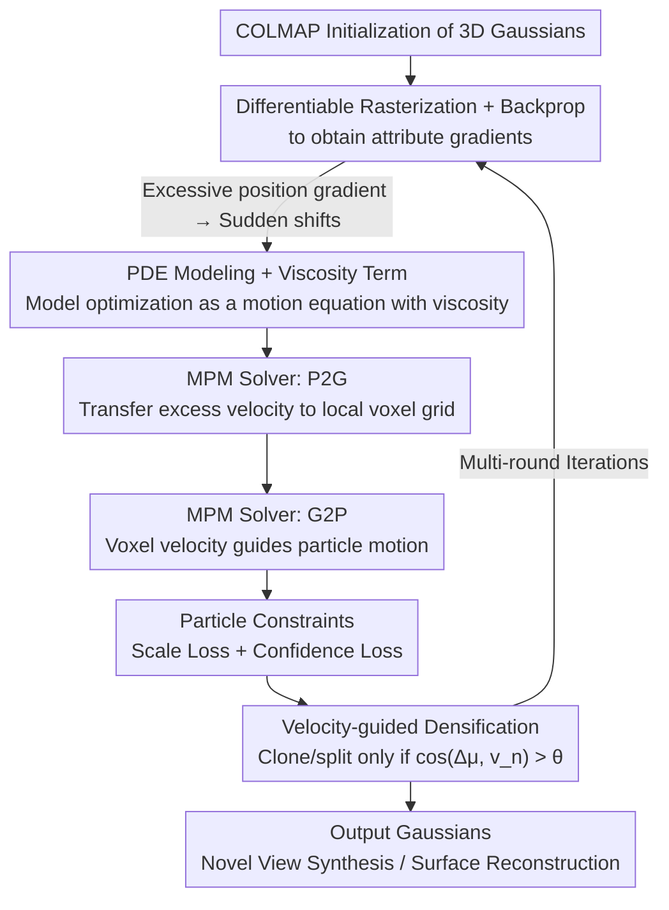

# Plug-and-Play PDE Optimization for 3D Gaussian Splatting: Toward High-Quality Rendering and Reconstruction

**Conference**: CVPR 2026  
**Paper**: [CVF Open Access](https://openaccess.thecvf.com/content/CVPR2026/html/Mo_Plug-and-Play_PDE_Optimization_for_3D_Gaussian_Splatting_Toward_High-Quality_Rendering_CVPR_2026_paper.html)  
**Code**: None  
**Area**: 3D Vision  
**Keywords**: 3D Gaussian Splatting, PDE Optimization, Material Point Method (MPM), Novel View Synthesis, Surface Reconstruction

## TL;DR
The authors theoretically reformulate the optimization process of 3DGS as a partial differential equation (PDE) and introduce a "viscosity term" to suppress sudden changes in the positions of small Gaussians. This PDE is solved numerically on a voxel velocity field using the P2G/G2P transfers from the Material Point Method (MPM). Together with scale/confidence constraints and velocity-guided densification, they propose a plug-and-play optimization framework named PDEO. Integrating PDEO into various 3DGS-based pipelines simultaneously improves rendering and surface reconstruction quality while significantly reducing GPU memory footprint.

## Background & Motivation
**Background**: 3DGS explicitly represents 3d scenes using anisotropic 3D Gaussians, achieving real-time high-quality novel view synthesis via fast splatting. It has emerged as one of the most powerful radiance field reconstruction paradigms since NeRF, and has been extended to surface reconstruction tasks by works like 2DGS, RaDeGS, and SuGaR.

**Limitations of Prior Work**: In complex scenes, 3DGS suffers from blurring and floaters. The authors observe that while large Gaussians excel at filling empty spaces but fail to represent high-frequency details (leading to "over-reconstruction" and visible blur), small Gaussians capture details but tend to generate numerous floaters in regions poorly aligned with training viewpoints. Existing approaches (such as AbsGS and Fregs) address this by employing more aggressive densification to split large Gaussians into smaller ones. However, this practically fits the scene through an excessive number of Gaussians, which is inefficient for both storage and rendering.

**Key Challenge**: Through gradient analysis (Sec. 3.2), the authors pinpoint the root cause: when the Gaussian scale is very small, the **magnitude of position gradients is significantly larger than that of other attributes (color, opacity, scale, rotation)**, i.e., $\frac{\partial L}{\partial \boldsymbol{\mu}_i}\gg\frac{\partial L}{\partial \mathbf{c}_i}\sim\frac{\partial L}{\partial o_i}\sim\frac{\partial L}{\partial \mathbf{s}_i}$. Consequently, the optimizer tends to drastically move the positions of small Gaussians to fit the scene, thereby suppressing the optimization of other attributes. This abrupt positional shifting leads to redundant and ambiguous geometric structures. Existing gradient stabilization methods (e.g., gradient clipping, normalization, weight decay) are heuristic and inevitably destroy gradient information.

**Goal**: Stabilize the optimization of small Gaussians at the "dynamics" level without relying on lossy techniques like clipping or normalization, while preserving the integrity of the original gradient information.

**Key Insight**: The authors draw an analogy between the step-by-step iterative optimization in 3DGS and fluid simulation. Particle positions in fluids remain stable and controllable because of the "viscosity term" in their equations of motion. If the 3DGS optimization can be written as a PDE, one can explicitly introduce a viscosity term to suppress positional mutations, similar to modifying fluid dynamics equations.

**Core Idea**: Model the 3DGS optimization process as a PDE with a viscosity term, solve it numerically using the Material Point Method (MPM), and let the position updates of small Gaussians be smoothed by the neighboring average velocity to stabilize optimization and eliminate floaters.

## Method

### Overall Architecture
PDEO (PDE-based Optimization) is a plug-and-play optimization framework designed for existing 3DGS pipelines. Given the initial 3D Gaussians obtained from COLMAP, it outputs optimized Gaussian representations suitable for novel view synthesis or surface reconstruction. Building upon the original "differentiable rasterization $\rightarrow$ backward pass to produce attribute gradients" pipeline, it intercepts and reprocesses the updates to Gaussian **positions**. Specifically, the 3DGS optimization is theoretically formulated as a PDE with a viscosity term (4.1), which is then numerically solved on a voxel velocity field via P2G/G2P transfers from MPM (4.2). P2G stores the "excessive velocity" of particles into voxel grids, and G2P interpolates the voxel velocities back to guide particle motion. Meanwhile, scale and confidence losses are applied to constrain Gaussians into "small-scale, high-confidence" particle-like representations (4.3). Finally, the velocity field guides the cloning and splitting during densification.

### Key Designs

**1. Modeling 3DGS Optimization as a PDE with Viscosity: Suppressing sudden shifts in small Gaussians via fluid viscosity**

The primary challenge is that small Gaussians have excessively large position gradients, causing them to move too drastically in a single step. By viewing Gaussian attributes as functions of time $t$, the original 3DGS position update $\boldsymbol{\mu}_i^{t+1}=\boldsymbol{\mu}_i^{t}+\sigma\frac{\partial L^t}{\partial \boldsymbol{\mu}_i^t}$ defines a discrete velocity $\boldsymbol{v}_i^t=\boldsymbol{\mu}_i^{t+1}-\boldsymbol{\mu}_i^t$. Differentiating with respect to time yields the "equation of motion" for 3DGS optimization:

$$\frac{d\boldsymbol{v}_i^t}{dt}=\frac{\partial \boldsymbol{v}_i^t}{\partial t}+\boldsymbol{v}_i^t\cdot\triangledown\boldsymbol{v}_i^t=\frac{\sigma^2}{2}\sum_{\gamma_i^t\in\Gamma_i^t}\triangledown\left(\frac{\partial L^t}{\partial \gamma_i^t}\right)^2$$

Comparing this with the Navier-Stokes equations for fluids, fluid motion is stable due to the viscosity term $\upsilon\triangledown\cdot\triangledown\boldsymbol{v}$, which acceleration-corrects particles to align with their neighboring average velocity, essentially "mixing" the velocity of an individual particle with its neighbors. The authors adopt this term, rewriting the motion equation to include $(1-\lambda_g)\triangledown\cdot\triangledown\boldsymbol{v}_i^t$. The corresponding discrete position update becomes:

$$\boldsymbol{\mu}_i^{t+1}=\boldsymbol{\mu}_i^{t}+\sigma\frac{\partial L^t}{\partial \boldsymbol{\mu}_i^t}+\frac{1-\lambda_g}{|N_i|}\sum_{j\in N_i}(\boldsymbol{v}_j^t-\boldsymbol{v}_i^t)$$

This formulation adds a correction term to the original gradient step, drawing the particle's velocity toward the average velocity of its neighborhood $N_i$. This is effective because the viscosity term does not clip or truncate gradients (which would lose information); instead, it modifies the governing equation. Theoretically, as loss $L\to0$, the kinetic energy smoothly decays to zero over time $t$. Viscosity does not alter the final solution at $t\to\infty$, meaning it only suppresses transient oscillations while fully preserving the original gradient information.

**2. Numerical Solving via MPM's P2G/G2P on a Voxel Velocity Field: Replacing expensive neighborhood searches with grid-based transfers**

Directly computing the velocity differences for the neighborhood $N_i$ of each Gaussian is computationally expensive. The authors treat 3D Gaussians as "material particles" in MPM and partition the scene space into a voxel grid to construct a **velocity field**, approximating the viscosity term via two stages: Particle-to-Grid (P2G) and Grid-to-Particle (G2P).

P2G: The "excessive velocity" $\triangle\boldsymbol{\mu}_i^t$ (i.e., position gradient) of the particles is aggregated into the velocity of voxel $V_n$:

$$\boldsymbol{v}_n^{t+1}=\lambda_g\boldsymbol{v}_n^t+\frac{1-\lambda_g}{|R_n^t|}\sum_{g_i\in R_n^t}\triangle\boldsymbol{\mu}_i^t$$

where $R_n^t$ denotes the set of particles located within voxel $V_n$. This step dynamically "absorbs" a portion of the particles' high-energy velocity into the grid, dampening excessive displacements that could trigger sudden shifts.

G2P: The voxel velocity is then used as the average motion tendency within that cell to guide individual particles:

$$\triangle\hat{\boldsymbol{\mu}}_i^t=\lambda_p\triangle\boldsymbol{\mu}_i^t+(1-\lambda_p)\boldsymbol{v}_n^t,\quad \boldsymbol{\mu}_i^{t+1}=\boldsymbol{\mu}_i^t+\triangle\hat{\boldsymbol{\mu}}_i^t$$

where $\lambda_p$ suppresses the particle's own instantaneous velocity, and $(1-\lambda_p)$ integrates the grid-level velocity guidance. Via this transfer process, conflicting high-frequency mutations within the same voxel cancel each other out, while particles receive consistent motion guidance. The viscosity term is thus seamlessly integrated into the optimization. The authors demonstrate in the supplementary material that $\lambda_g$ does not alter the total gradient weight, meaning this approach stabilizes position updates without any loss of gradient information.

**3. Particle Constraints: Scale and confidence losses forcing Gaussians to become "small and solid" particles**

The PDE/MPM formulation assumes that particles are scaleless and solid. However, Gaussians have non-zero scales and can be semi-transparent, which violates this assumption. To resolve this, two constraints are introduced to encourage Gaussians to act more like physical particles.

The scale loss penalizes excessively large Gaussian scales: $L_s=\frac{1}{|G_k|}\sum_{g_i\in G_k}\max(s^*-\beta,0)$, where $s^*$ is the maximum scale of Gaussian $g_i$, $\beta$ is a margin, and $G_k$ is the set of visible Gaussians under viewpoint $k$. This suppresses large Gaussians, forcing the system to utilize smaller Gaussians to represent high-frequency details.
The confidence loss pushes the opacity values toward the extremes of 0 or 1: $L_t=\frac{1}{|G_k|}\sum |o_i-\lfloor 1.99\,o_i\rfloor|_2^2$ (note: equation notation is slightly complex; please refer to the paper for precise implementation details). This forces opacity to binary bounds, producing "high-confidence, non-transparent" solid particles. Together, these constraints satisfy the particle assumption: small scales preserve detail, and high confidence eliminates hazy, semi-transparent floaters.

**4. Velocity-Guided Gaussian Densification: Splitting/cloning guided by the alignment between particle and voxel velocities**

Standard 3DGS relies on the average magnitude of view-space position gradients to trigger densification. From a PDE perspective, this signal can be noisy. The authors instead utilize the velocity field: they calculate the cosine similarity between the particle velocity $\triangle\boldsymbol{\mu}_i$ and its corresponding voxel velocity $\boldsymbol{v}_n$. Cloning or splitting for Gaussian $g_i$ is executed only if $\cos(\triangle\boldsymbol{\mu}_i,\boldsymbol{v}_n)>\theta_p$. The underlying physical intuition is that when a particle moves in the same direction as the local average motion, it confirms a genuine need for more density to cover the region. Conversely, divergent directional shifts imply transient oscillations where densification should be avoided. This leads to highly precise densification, explaining why the method drastically reduces memory usage while enhancing overall reconstruction quality.

### Loss & Training
The overall loss function adds two particle constraints to the rendering loss of the base method: $L=L_{\text{render}}+\omega_s L_s+\omega_t L_t$. Key hyperparameters and configurations include: $\lambda_g=0.8$, $\lambda_p=0.8$, $\psi=0.2$, $\theta_p=120^\circ$, $\beta=0.6$, $\omega_t=\omega_s=0.04$, and $\tau$ increases progressively from 1 to 2.5 during training. The MPM component is implemented via a custom CUDA backend, initializing with a $64\times64\times64$ voxel grid that adaptively merges grid cells. All experiments are conducted on a single V100 GPU. During evaluation, all baselines run with their default parameter configurations to ensure a fair comparison.

## Key Experimental Results

### Main Results
Novel view synthesis is evaluated on Mip-NeRF360 (6 scenes), Tanks&Temples (7 scenes), and ScanNet++ (4 scenes); surface reconstruction is assessed on DTU (15 scenes) and Tanks&Temples (7 scenes). Integrating PDEO into various 3DGS baselines yields consistent quality improvements, smaller memory footprints (Mem), and higher FPS.

| Dataset | Metric | Baseline Method | + PDEO | Description |
|--------|------|---------|-------|------|
| Mip-NeRF360 | PSNR↑ | SpecGS 27.96 | SpecGS+PDEO **28.81** | Best combination, Mem 1147 $\rightarrow$ 99.6 |
| Tanks&Temples | PSNR↑ | MCMC 21.03 | MCMC+PDEO **22.77** | +1.74 gain, Mem 691 $\rightarrow$ 210 |
| Mip-NeRF360 | FPS↑ | 3DGS 163.1 | 3DGS+PDEO 225.5 | Faster rendering, Mem 295 $\rightarrow$ 186 |
| Tanks&Temples | FPS↑ | GES 64.1 | GES+PDEO 176.0 | GPU memory nearly halved |

Surface Reconstruction (DTU, Chamfer Distance (CD) ↓, lower is better; parentheses indicate relative change):

| Method | CD Mean↓ |
|------|----------|
| RaDeGS | 0.70 |
| 3DGS+PDEO | 1.34 (-0.22) |
| 2DGS+PDEO | 0.82 (-0.08) |
| RaDeGS+PDEO | **0.68** (-0.02) |

Tanks&Temples Surface Reconstruction (F1↑): RaDeGS 0.316 $\rightarrow$ RaDeGS+PDEO **0.445**, MILO 0.397 $\rightarrow$ MILO+PDEO **0.475** (both reaching state-of-the-art for their respective bases).

### Ablation Study
Evaluated on Mip-NeRF360 with GES as the baseline:

| Configuration | PSNR↑ | SSIM↑ | LPIPS↓ | Mem↓ | Description |
|------|-------|-------|--------|------|------|
| Baseline (GES) | 27.71 | 0.844 | 0.224 | 369 | Original method |
| w/o P2G and G2P | 27.51 | 0.830 | 0.227 | 240 | Removing viscosity solver leads to obvious quality degradation |
| w/o Our Densification | 27.96 | 0.834 | 0.230 | 136 | Without velocity-guided densification |
| w/o Scale Loss | 27.75 | 0.831 | 0.236 | 132 | Without scale constraints |
| w/o Confidence Loss | 27.87 | 0.845 | 0.219 | 177 | Without confidence constraints |
| Full | 27.99 | 0.834 | 0.232 | 133 | Complete model, reducing memory from 369 to 133 |

Hyperparameter sensitivity: Deviating $\lambda_g$ or $\lambda_p$ from 0.8 (tested with 0.5 and 0.9) degrades PSNR (e.g., Full ($\lambda_p = 0.9$) falls to 27.56), indicating that setting coefficients around 0.8 is the optimal trade-off.

### Key Findings
- **P2G/G2P (the viscosity term) is crucial for stability**: Removing it drops the PSNR of GES from 27.99 to 27.51 with a degraded SSIM. Qualitative results show that floaters and artifacts reappear—confirming its role in suppressing "small Gaussian position jitter."
- **Dramatic memory reduction is a major byproduct**: The full model requires only $\sim 1/3$ of the baseline's memory (369 $\rightarrow$ 133) and boosts FPS. This proves that the performance gains do not stem from packing more Gaussians, but from a cleaner geometry optimization that yields fewer Gaussians.
- **Confidence loss has a relatively small direct impact on PSNR** (PSNR drops slightly to 27.87 when removed), but working alongside scale loss forces Gaussians to adhere to physical particle assumptions, proving vital for removing semi-transparent artifacts and blur.

## Highlights & Insights
- **Treating the optimizer as a dynamical system**: Instead of performing lossy gradient clipping or normalization on raw values, the optimization process is reformulated as a PDE. Modifying the equations of motion with fluid-like viscosity suppresses transient jitter without altering the final converged solution (as theoretically proven)—representing a highly elegant perspective.
- **Computing neighborhood averages in $O(\text{grid})$ time via MPM**: P2G storing and G2P transferring velocity onto voxel fields maps the expensive neighbor-wise operations into a grid, making the viscosity term highly practical.
- **Directly addressing the root cause through gradient analysis**: Identifying that the positional gradient dominates other attributes (i.e., $\frac{\partial L}{\partial\boldsymbol{\mu}}\gg$ others) explains the emergence of floaters and blur. The subsequent components are logically grounded in resolving this direct cause.
- **True Plug-and-Play capability**: Seamlessly integrates and generalizes across 3DGS, GES, MipGS, 2DGS, RaDeGS, MCMC, SpecGS, PGSR, and MILO. This concept of "modeling optimization as a PDE with viscosity" holds strong transfer potential for other point-cloud or particle-based representations.

## Limitations & Future Work
- Introducing MPM voxel grids and P2G/G2P transfers increases implementation complexity and introduces custom CUDA dependencies, which can hinder reproduction; the code has not yet been open-sourced.
- The system involves several hyperparameters ($\lambda_g, \lambda_p, \theta_p, \beta, \omega_s, \omega_t, \tau$). Ablations indicate sensitivity around $\lambda_g / \lambda_p$, leaving it to be seen if a single set of default parameters generalizes well across diverse environments.
- The absolute geometric accuracy on surface reconstruction for certain combinations is not outstanding (e.g., 3DGS+PDEO on DTU CD is still 1.34). PDEO functions as a universal enhancer rather than a magic bullet that elevates weaker baselines to absolute SOTA; the best results still rely on strong geometric baselines (like RaDeGS or MILO).
- Because the viscosity term pulls particles towards local average motions, it may theoretically over-smooth regions with distinct, sharp geometric discontinuities, which is an aspect not fully detailed in the work.

## Related Work & Insights
- **vs AbsGS / Fregs (Densification-based approach)**: Prior works use aggressive densification, splitting large Gaussians into massive numbers of small Gaussians to counter blur, which increases storage and rendering costs. This work achieves the opposite (reducing memory to $\sim 1/3$) by stabilizing optimization instead of stacking units.
- **vs Gradient clipping / BN / Weight decay (Gradient stabilization-based approach)**: These techniques are heuristic and lose valuable gradient information. In contrast, this approach modifies the governing PDE. The viscosity term only dampens transient oscillations without altering the final optimization trajectory.
- **vs 2DGS / RaDeGS / SuGaR (Geometry constraint-based approach)**: These works extract meshes by enforcing explicit geometric constraints. PDEO avoids explicit geometric priors, optimizing structures by eliminating redundant floaters, and can be overlaid directly onto these methods for further quality gains.

## Rating
- Novelty: ⭐⭐⭐⭐⭐ Formulating 3DGS optimization as a PDE with viscosity and solving it via MPM is a highly original and self-contained approach.
- Experimental Thoroughness: ⭐⭐⭐⭐ Covers novel view synthesis and surface reconstruction, runs multiple baselines across datasets, and includes hyperparameter analysis; however, the lack of open-source code and moderate absolute reconstruction precision on some baselines are drawbacks.
- Writing Quality: ⭐⭐⭐⭐ The progression from motivation to theory and methodology is clearly laid out, with minor OCR math symbols but overall solid readability.
- Value: ⭐⭐⭐⭐⭐ Exceptionally practical. Plug-and-play behavior, universal performance gains, and significant GPU memory reductions make it highly valuable to the 3DGS community.

<!-- RELATED:START -->

## Related Papers

- [\[CVPR 2026\] 3D Gaussian Splatting with Self-Constrained Priors for High Fidelity Surface Reconstruction](3d_gaussian_splatting_with_self-constrained_priors_for_high_fidelity_surface_rec.md)
- [\[CVPR 2025\] Evolving High-Quality Rendering and Reconstruction in a Unified Framework with Contribution-Adaptive Regularization](../../CVPR2025/3d_vision/evolving_high-quality_rendering_and_reconstruction_in_a_unified_framework_with_c.md)
- [\[CVPR 2026\] STAC: Plug-and-Play Spatio-Temporal Aware Cache Compression for Streaming 3D Reconstruction](stac_plug-and-play_spatio-temporal_aware_cache_compression_for_streaming_3d_reco.md)
- [\[CVPR 2026\] DirectFisheye-GS: Enabling Native Fisheye Input in Gaussian Splatting with Cross-View Joint Optimization](directfisheye-gs_enabling_native_fisheye_input_in_gaussian_splatting_with_cross-.md)
- [\[CVPR 2026\] Depth Peeling for High-Fidelity Gaussian-Enhanced Surfel Rendering](depth_peeling_for_high-fidelity_gaussian-enhanced_surfel_rendering.md)

<!-- RELATED:END -->
