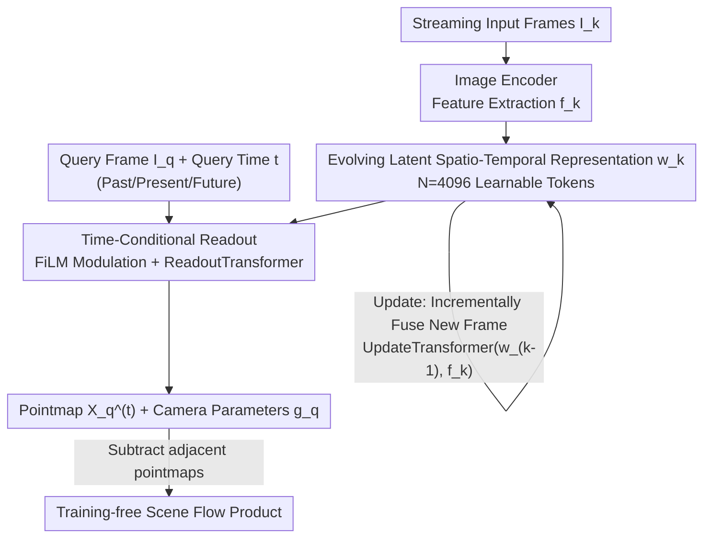

# Point4Cast: Streaming Dynamic Scene Reconstruction and Forecasting

**Conference**: CVPR 2026  
**Paper**: [CVF Open Access](https://openaccess.thecvf.com/content/CVPR2026/html/Liu_Point4Cast_Streaming_Dynamic_Scene_Reconstruction_and_Forecasting_CVPR_2026_paper.html)  
**Code**: Project Page https://merl.com/research/highlights/point4cast (Open source code not explicitly provided)  
**Area**: 3D Vision  
**Keywords**: Streaming Reconstruction, Dynamic Scenes, Pointmap Forecasting, Spatio-Temporal Representation, Feed-forward 3D

## TL;DR
Point4Cast utilizes a "continuously evolving latent spatio-temporal representation" to uniformly process streaming video frames. It can reconstruct 3D pointmaps for past and current frames while feed-forwardly **forecasting pointmaps and camera parameters for future timestamps**. It also derives scene flow in a training-free manner, setting new SOTA benchmarks on PointOdyssey and TAPVid-3D for both dynamic scene reconstruction and the newly proposed "3D pointmap forecasting" task.

## Background & Motivation
**Background**: Feed-forward 3D reconstruction has seen rapid progress recently. DUSt3R and MASt3R directly regress pixel-wise pointmaps in a common coordinate system from two images. FASt3R and VGGT extend this to multi-view and large-scale training, while Cut3R, StreamingVGGT, and Point3R introduce "memory" mechanisms to support streaming inputs. These methods have significantly improved the recovery of dense 3D geometry from 2D frames.

**Limitations of Prior Work**: Existing methods can only reconstruct instantaneous geometry for **observed timestamps**. Given observations up to the current frame, they output pointmaps for "now," failing to answer what the scene will look like in the next 0.5 seconds. In fields like autonomous driving, embodied intelligence, and AR/VR, reconstruction alone is insufficient; agents must **anticipate the future** (e.g., whether a pedestrian will enter the lane) to react in time.

**Key Challenge**: Reconstruction and forecasting have traditionally been treated as separate tasks. A naive approach to combine them involves using a video generation model to extrapolate future RGB frames and passing them to a reconstruction model, or calculating scene flow between the last two pointmaps and extrapolating. However, errors in these pipelines **accumulate rapidly over time** and require additional generators, optical flow modules, or supervision signals.

**Goal**: To achieve three objectives within a single feed-forward framework: (1) provide temporally consistent pointmaps for any observed frame at any query time; (2) provide reasonable predictions for the **future** beyond the last observation; and (3) generate scene flow without additional training.

**Key Insight**: The authors observe that if a **latent representation that evolves continuously across time** is maintained to encode scene structure and dynamics, then "reconstruction" and "forecasting" become mere readouts of the same representation at different query timestamps $t$. Past, present, and future are unified at the representation level; the only difference is the query time.

**Core Idea**: Maintain a latent spatio-temporal representation $\mathbf{w}_k$ that updates with each frame. Use an "Update" mechanism to absorb new observations and a "Time-Conditional Readout" to decode pointmaps at any $t$, incorporating both reconstruction and forecasting into a single mechanism.

## Method

### Overall Architecture
Point4Cast processes a continuous stream of monocular video frames $\{I_k\}$. The system maintains a latent spatio-temporal representation $\mathbf{w}_k \in \mathbb{R}^{N\times C}$ ($N=4096$ learnable tokens, $C=1024$), encoding the understanding of the scene's past, present, and future after observing $k$ frames. The pipeline consists of two types of operations:

- **Update**: For each incoming frame $I_k$, an image encoder extracts features $\mathbf{f}_k$. The UpdateTransformer then fuses these with the previous state $\mathbf{w}_{k-1}$ to obtain the new state $\mathbf{w}_k = \text{Update}(\mathbf{w}_{k-1}, I_k)$.
- **Readout**: Given any query frame $I_q$ ($q\le k$) and any query time $t$ (which can be earlier than, equal to, or later than the last observation), $\mathbf{w}_k$ is first modulated via FiLM-style time conditioning to obtain $\mathbf{s}^{(t)}$. Then, the ReadoutTransformer fuses query frame features with $\mathbf{s}^{(t)}$ to decode the pointmap $\hat{\mathbf{X}}_q^{(t)}$ and camera parameters $\hat{\mathbf{g}}_q$ for that timestamp.

Since pointmaps read out at different times are aligned to the same coordinate system, **scene flow** is obtained simply by subtracting pointmaps of adjacent timestamps, requiring no additional modules.

### Key Designs

**1. Continuously Evolving Latent Spatio-Temporal Representation: Packaging "Past/Present/Future" into One Set of Tokens**

To address the limitation where reconstruction only provides instantaneous geometry, the authors avoid outputting pointmaps for each frame independently. Instead, they maintain a global latent state $\mathbf{w}_k \in \mathbb{R}^{N\times C}$. It is randomly initialized as $\mathbf{w}_0$ and evolves each time a new frame is absorbed. This representation is not tied to any specific timestamp but encodes the **structure + dynamics** of the scene. Thus, "querying the past" and "querying the future" are symmetric—both are just different temporal slices read from the same state. This design unifies reconstruction and forecasting within one framework.

**2. Update: Incrementally Absorbing New Observations via Interleaved Self/Cross-Attention**

To support streaming input, the state must refresh online with each frame. The Update stage first encodes the new frame into $M$ image tokens $\mathbf{f}_k = \text{Encoder}(I_k)$ using an image encoder (initialized from the ViT backbone of VGGT), then feeds them into the UpdateTransformer: $\mathbf{w}_k = \text{UpdateTransformer}(\mathbf{w}_{k-1}, \mathbf{f}_k)$. This transformer uses interleaved self-attention and cross-attention between $\mathbf{f}_k$ and $\mathbf{w}_{k-1}$ to achieve **bidirectional information exchange**—allowing new observations to update the state while letting the existing state constrain the interpretation of the new frame. This iterative refinement ensures the representation reflects an updated understanding after each frame and naturally adapts to variable-length streams.

**3. Time-Conditional Readout: Using FiLM Modulation to Read Any Timestamp from a Single State**

Having the state is not enough; the key is how to "read" the geometry at a specified time $t$. The Readout stage maps the query time embedding $e_t = \text{Embed}(t)$ into scale/shift parameters $\gamma = W_\gamma e_t, \beta = W_\beta e_t$, applying FiLM-style conditional normalization to the state:

$$\mathbf{s}^{(t)}[i,:] = \gamma \odot \frac{\mathbf{w}_k[i,:] - \mu_i}{\sigma_i} + \beta,\quad \forall i\in\{1,\dots,N\}$$

The modulated state $\mathbf{s}^{(t)}$ is "tuned" to the scene configuration at the query time. The query frame features $\mathbf{f}_q$ and a learnable pose token $\mathbf{z}$ are then fed into the ReadoutTransformer to fuse with $\mathbf{s}^{(t)}$. Finally, $\text{Head}_{\text{map}}$ decodes the pointmap and $\text{Head}_{\text{cam}}$ decodes camera parameters. Ablations show that FiLM modulation outperforms "sinusoidal/learned embeddings + cross-attention," indicating that **flexible temporal conditioning** is core to unifying reconstruction and forecasting.

**4. Training-free Scene Flow Product: Letting Motion Emerge from Pointmaps**

Because pointmaps read out at different $t$ are aligned to the same coordinate system, point-wise displacement between adjacent timestamps can be directly calculated:

$$\mathbf{F}_q^{(t\rightarrow t+1)} = \hat{\mathbf{X}}_q^{(t+1)} - \hat{\mathbf{X}}_q^{(t)}$$

Consequently, dense, geometrically consistent scene flow becomes a natural byproduct of inference, **without any specialized flow heads or flow supervision**. This validates that the latent representation implicitly models 3D motion and allows the method to output consistent 3D point trajectories across past, present, and future.

### Loss & Training
Training is performed in an "online streaming" manner to mirror inference: all trainable modules are fine-tuned starting from VGGT pre-trained weights. For a video $V=\{I_k\}_{k=1}^T$, the state $\mathbf{w}_k$ is updated with a new frame at each step. Subsequently, pointmaps and camera parameters are read out for all observed frames $q\le k$ and all timestamps $1\le t\le T$, supervised by $\ell_1$ loss:

$$\mathcal{L}_q^{(t)} = \|\hat{\mathbf{X}}_q^{(t)} - \mathbf{X}_q^{(t)}\|_1 + \lambda_{\text{cam}}\|\hat{\mathbf{g}}_q - \mathbf{g}_q\|_1$$

The total loss is averaged over all frames, queries, and timestamps. The training data mixes Kubric, PointOdyssey, Stereo4D, and a synthetic set rendered in Blender using Mixamo motions and BlenderKit scenes. Data lacking ground truth point clouds uses pseudo-depth labels generated by off-the-shelf monocular depth estimators. A curriculum training strategy is used: starting with controlled synthetic motion and progressing to real complex scenes. Training is conducted on 8 A100 (80GB) GPUs using AdamW.

## Key Experimental Results

### Main Results
Evaluation is conducted on PointOdyssey (synthetic dynamic scenes) and TAPVid-3D (real scenes, **zero-shot**, not in the training set). Reconstruction uses Chamfer distance Accuracy (Acc.)/Completion (Comp.) (lower is better), and camera pose uses relative translation/rotation errors (RTE/RRE) after Sim(3) alignment. Point4Cast can utilize either CUT3R or VGGT backbones.

| Dataset | Metric | Ours (VGGT) | VGGT (Offline) | CUT3R (Streaming) | StreamVGGT |
|--------|------|-----------|-----------|------------|-----------|
| PointOdyssey | Acc.↓ | **0.428** | 0.464 | 0.530 | 0.525 |
| PointOdyssey | Comp.↓ | **0.472** | 0.491 | 0.557 | 0.569 |
| TAPVid-3D (Zero-shot) | Acc.↓ | **0.711** | 0.757 | 0.869 | 0.817 |
| TAPVid-3D (Zero-shot) | Comp.↓ | **0.476** | 0.491 | 0.657 | 0.569 |

Regardless of the backbone, Point4Cast's pointmap quality and camera error outperform offline (MonST3R/VGGT) and streaming (CUT3R/StreamVGGT) baselines. The gain is particularly significant on the zero-shot TAPVid-3D, demonstrating robust generalization.

**Forecasting Task**: For each baseline, two forecasting variants are constructed: "Frame Generation" (extrapolating RGB via a video generation model then reconstructing) and "Scene Flow Extrapolation" (extrapolating via pointmaps of the last two frames). Point4Cast performs **inherent** forecasting through time-conditional readout without external generators.

| Dataset | Period | Metric | Ours (VGGT, Inherent) | Best Baseline Variant |
|--------|------|------|----------------|------------|
| PointOdyssey | Next Frame | Acc.↓ | **0.481** | 0.509 (MonST3R Frame Gen) |
| PointOdyssey | Future 10 Frames | Acc.↓ | **0.533** | 0.603 (StreamVGGT Frame Gen) |
| TAPVid-3D | Next Frame | Acc.↓ | **0.810** | 0.881 (VGGT Frame Gen) |
| TAPVid-3D | Future 10 Frames | Acc.↓ | **1.259** | 1.271 (MonST3R Frame Gen) |

Baseline errors for frame generation/flow extrapolation accumulate rapidly, while Point4Cast remains more stable due to the unified spatio-temporal representation.

**Scene Flow** (PointOdyssey, EPE↓ / Acc↑, ⚠️ Note: Acc here refers to scene flow accuracy, higher is better): Point4Cast (VGGT backbone) estimates EPE 1.355 / Acc 0.848 and forecasts EPE 1.619 / Acc 0.766, **comprehensively outperforming** the strongest baseline MonST3R (EPE 2.058 / Acc 0.741), despite using no flow supervision.

### Ablation Study
Ablation of temporal conditioning methods (PointOdyssey, Acc./Comp. lower is better):

| Temporal Embedding | Conditioning Method | Acc.↓ | Comp.↓ |
|---------|-----------|-------|--------|
| Sinusoidal | Cross-Attention | 0.470 | 0.502 |
| Learned Embedding | Cross-Attention | 0.437 | 0.492 |
| Learned Embedding | FiLM (Ours) | **0.428** | **0.472** |

### Key Findings
- **Temporal conditioning is critical**: Learned embeddings outperform sinusoidal ones, and FiLM modulation yields the largest gain—flexible time-conditioning is vital for both reconstruction and forecasting accuracy.
- **Backbone-agnostic**: Results are robust whether using CUT3R or VGGT; the framework is modular and allows for replacing the streaming backbone without altering the architecture.
- **Strong zero-shot generalization**: Excels on TAPVid-3D despite it not being in training, suggesting the representation learns transferable dynamic priors.
- **Motion degrades smoothly over time**: Error increases further into the future (consistent with long-range forecasting difficulty), but Point4Cast's degradation is much gentler than error-accumulating baselines.
- **Inference speed**: Approximately 20 fps, comparable to CUT3R.

## Highlights & Insights
- **Unifying reconstruction and forecasting as "different temporal readouts of the same state"**: This is the most significant design. Past, present, and future are symmetric within the latent representation, eliminating the need for video generators or separate forecasting branches, fundamentally avoiding pipeline error accumulation.
- **Free scene flow**: Because pointmaps are aligned across time in the same coordinate system, subtracting them yields flow with zero additional training or inference overhead. This concept of "geometric consistency automatically yielding motion" can be transferred to any temporal model outputting aligned pointmaps or depth.
- **FiLM-style temporal modulation**: Using $(\gamma, \beta)$ to "tune" a scalar time into the normalized state is a lightweight yet effective conditioning method, more efficient and accurate than cross-attention. This is worth reusing in other conditional temporal generation tasks.
- **Modular backbone replacement**: Directly reusing initializations for VGGT's ViT/DPT/camera heads proves that this framework acts as a "spatio-temporal layer added to feed-forward reconstructors," making it engineering-friendly.

## Limitations & Future Work
- **Unmodeled uncertainty**: The authors note that future forecasting is inherently multi-modal, while current outputs are deterministic. Modeling uncertainty is planned.
- **Degradation over long time horizons**: Error for 10 frames in the future is significantly higher than for the next frame; long-range forecasting remains an open problem.
- **Reliance on pseudo-depth supervision**: Some training data uses off-the-shelf monocular depth estimators for ground truth, so quality is limited by these estimators (though this impact is not quantified in the paper).
- **Relatively small training scale**: The authors admit the mixed dataset is much smaller than massive corpora like VGGT, relying instead on diversity. Scaling training could lead to further gains.
- **Code availability**: It is not explicitly stated if the code will be open-sourced, providing only a project page and code stubs in the supplementary material.

## Related Work & Insights
- **vs VGGT / FASt3R (Feed-forward Reconstruction)**: These focus on large-scale multi-view reconstruction but only output **instantaneous** geometry. This work adds spatio-temporal representation to their backbones to complete the forecasting capability.
- **vs CUT3R / StreamingVGGT (Streaming Memory)**: These also maintain persistent memory for online reconstruction, but the memory only serves to "reconstruct observed frames." Point4Cast's state can be read at any query time, inherently supporting future forecasting.
- **vs MonST3R (Dynamic Scene Reconstruction)**: While MonST3R is designed for dynamic scenes, it remains focused on frame-by-frame instantaneous geometry. This paper unifies reconstruction, forecasting, and scene flow.
- **vs Video Frame Prediction / Scene Flow Forecasting**: The former extrapolates in 2D pixel space, and the latter interpolates from sparse keypoints. Point4Cast predicts directly on **dense 3D pointmaps** and can track any 3D point trajectory without extra training.

## Rating
- Novelty: ⭐⭐⭐⭐⭐ Proposes the "streaming 2D frames → 3D pointmap forecasting" task and elegantly unifies reconstruction/forecasting/flow through a spatio-temporal representation.
- Experimental Thoroughness: ⭐⭐⭐⭐ Two datasets + zero-shot + multi-task + dual backbones; comprehensive, though ablations are fewer (primarily on temporal conditioning) with fine-grained analysis relegated to the supplementary.
- Writing Quality: ⭐⭐⭐⭐ Clear motivation, complete formulas, and easy-to-follow flow; some implementation details are in the supplementary.
- Value: ⭐⭐⭐⭐⭐ Provides a modular, deployable unified framework for "continuous 3D perception + anticipation" in autonomous driving, embodied AI, and AR/VR.

<!-- RELATED:START -->

## Related Papers

- [\[CVPR 2026\] SLARM: Streaming and Language-Aligned Reconstruction Model for Dynamic Scenes](slarm_streaming_and_language-aligned_reconstruction_model_for_dynamic_scenes.md)
- [\[CVPR 2026\] Space-Time Forecasting of Dynamic Scenes with Motion-aware Gaussian Grouping](space-time_forecasting_of_dynamic_scenes_with_motion-aware_gaussian_grouping.md)
- [\[CVPR 2026\] Stabilizing Streaming Video Geometry via Dynamic Feature Normalization](stabilizing_streaming_video_geometry_via_dynamic_feature_normalization.md)
- [\[CVPR 2026\] AeroGS: Scale-Aware Gaussian Splatting for Pose-Free Dynamic UAV Scene Reconstruction](aerogs_scale-aware_gaussian_splatting_for_pose-free_dynamic_uav_scene_reconstruc.md)
- [\[CVPR 2026\] ReFlow: Self-correction Motion Learning for Dynamic Scene Reconstruction](reflow_self-correction_motion_learning_for_dynamic_scene_reconstruction.md)

<!-- RELATED:END -->
