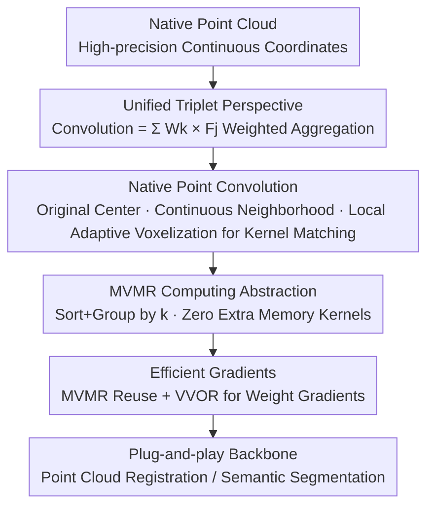

# PointCNN++: Performant Convolution on Native Points

**Conference**: CVPR 2026  
**Paper**: [CVF Open Access](https://openaccess.thecvf.com/content/CVPR2026/html/Li_PointCNN_Performant_Convolution_on_Native_Points_CVPR_2026_paper.html)  
**Code**: https://github.com/ant-research/pointelligence  
**Area**: 3D Vision  
**Keywords**: Point Cloud Convolution, Sparse Convolution, GPU Operator, Point Cloud Registration, Semantic Segmentation

## TL;DR
PointCNN++ generalizes sparse convolution from "voxels" to "native points"—convolution centers reside directly on high-precision original coordinates, neighborhoods are searched in continuous space, and local adaptive voxelization is applied only as the final step to pair kernels. By abstracting computation as an MVMR (Matrix-Vector Multiplication and Reduction) problem with handwritten GPU kernels, it achieves zero additional memory consumption. This allows it to surpass voxel-based methods in efficiency and memory savings while maintaining geometric precision, achieving SOTA in point cloud registration (99.8% Recall on KITTI) and semantic segmentation (78.2% mIoU on nuScenes) as a plug-and-play backbone.

## Background & Motivation
**Background**: Point cloud convolution learning has long been split into two paths. One is **voxel-based** (e.g., O-CNN, SPConv, MinkowskiEngine, TorchSparse), which globally voxelizes continuous space into sparse grids and performs sparse convolutions, leveraging sparsity for high performance. The other is **point-based** (e.g., PointCNN, KPConv, PointConv), which preserves original point precision but must "transform" irregular points into regular dense tensors (transform-then-convolve).

**Limitations of Prior Work**: Both paths suffer from critical flaws. Voxel-based methods perform global voxelization at the **beginning** of the pipeline, which is a lossy sampling: original points $p$ are forced to snap to voxel centers, neighborhoods use Chebyshev distance on quantized grids (excluding points that should be included), and kernel precision is **coupled** to global voxel size. Once voxel size is fixed, it creates a "prior error floor" that acts as a fatal bottleneck for tasks like registration that rely on sub-voxel feature uniqueness. Point-based methods preserve precision, but the "irregular-to-regular" transformation introduces additional computation, learnable parameters, massive padding, and memory access—the primary cause of GPU inefficiency for point clouds.

**Key Challenge**: Precision and performance have been treated as a permanent "trade-off"—choose either precision (point-based) and be slow, or speed (voxel-based) and lose precision.

**Goal**: Treat this trade-off as a conflict that can be mitigated through holistic computation design rather than an inherent destiny, achieving both the performance of voxel-based methods and the precision of point-based methods.

**Key Insight**: The authors reframe convolution through a **unified convolution triplet perspective**—any convolution is a weighted aggregation over a set of triplets $T=\{(i,j,k)\}$, where triplets answer three questions: where to place the center, how to pair the neighborhood, and which kernel to use. 2D and 3D voxel convolutions are merely special cases of this formula on "discrete regular data." Therefore, voxel convolution is simply a **quantized degenerate special case** of "native point convolution," and there is no need to degenerate from the start.

**Core Idea**: Generalize sparse convolution from discrete voxels to continuous native points (centers and neighborhoods remain on original coordinates, with local voxelization for kernel matching only in the final step), and rewrite this generalized operator as an MVMR computing primitive with handwritten GPU kernels to achieve "high fidelity" and "high performance" simultaneously.

## Method

### Overall Architecture
PointCNN++ is a **co-design** of the operator and the computing system: the upper layer redefines "what convolution looks like" (native point convolution), while the lower layer redesigns "how it runs fast on GPU" (MVMR abstraction + specialized kernels). Both are indispensable—a generalized operator only provides value if it is sufficiently performant.

The framework consists of: "Unified Perspective → Operator Definition → Computing Abstraction → GPU Kernels → Backpropagation." Using the unified triplet formula:

$$F^{out}_i = \sum_{(i,j,k)\in T} W_k \times F^{in}_j$$

Convolution is abstracted as weighted summation over the triplet set $T$ ($F^{in}_j\in\mathbb{R}^{C_{in}}$ is neighbor features, $W_k\in\mathbb{R}^{C_{out}\times C_{in}}$ is the kernel, $F^{out}_i\in\mathbb{R}^{C_{out}}$ is the output). The fundamental difference between convolutions lies only in "how $T$ is constructed." Native point convolution constructs $T$ entirely on original continuous coordinates, introducing local voxelization only during kernel pairing. This computation is mapped to MVMR primitives, using sorted and grouped GPU kernels to minimize memory access, with the same kernels shared for forward and backward passes.

### Key Designs

**1. Native Point Convolution: Keeping centers and neighborhoods on original coordinates, local voxelization for kernel matching only.**

This directly addresses the error floor caused by the "global voxelization first" approach of voxel methods. Native point convolution reconstructs the triplet $T$ in three steps: ❶ **Convolution Centers** $P^{out}_i\in\mathbb{R}^3$ take original high-precision coordinates; ❷ **Neighborhood Pairing** $(i, j)$ uses these precise centers to search neighbors in continuous space using radius search (preferred over KNN for spatial locality consistency); ❸ **Kernel Pairing** $(j, k)$ performs **local adaptive voxelization** centered at $P^{out}_i$ within each neighborhood to map neighbor points $P^{in}_j$ to the corresponding kernel weight $W_k$. The first two steps maintain original precision, with quantization occurring only in the third step, where local centering improves pairing quality.

The key decoupling is: **Kernel resolution is no longer dictated by global voxel size; it is determined by the "fineness of the kernel itself."** The same neighborhood can use $3^3$ or $5^3$ kernels as needed, whereas in voxel convolution, a $5^3$ kernel on a $3^3$ quantized neighborhood would be wasted. The authors prove that voxel convolution is a degenerate case requiring three steps of degradation: snapping centers, voxel-space searching, and coupling kernel resolution to global voxel size.

**2. MVMR Abstraction + Sorting/Grouping: High-performance GPU kernels with zero extra memory.**

Generality brings flexibility but also computing challenges. The im2col approach used in image convolution fails here because materializing neighborhoods into regular tensors requires padding each to a maximum size, leading to $N_{in}\times K\times C_{in}$ extra memory ($K$ times the original data, where $K=t^3$).

The authors abstract Equation (1) as **MVMR (Matrix-Vector Multiplication and Reduction)**. A naive "one thread per triplet" approach repeatedly reads $W$ from global memory, with memory access volume approximately:

$$|T|\times\big(\underbrace{C_{out}\times C_{in}}_{\text{Read }W}+\underbrace{C_{in}}_{\text{Read }F^{in}}+\underbrace{C_{out}}_{\text{Atomic Write }F^{out}}\big)$$

Reading $W$ is the bottleneck. Since the result is independent of triplet order, the authors **sort $T$ by $k$** and split it into continuous groups of length $L$. Since $K\ll|T|$, the Pigeonhole Principle ensures almost all triplets in a group share the same $k$ (the expected unique $k$ per group is $\approx 1+\tfrac{L\times K}{|T|}\to 1$). Consequently, each group reads $W_k$ into on-chip memory once, reducing global memory access by approximately $O(1/L)$:

$$\tfrac{|T|}{L}\times C_{out}\times C_{in}+L\times C_{in}+L\times C_{out}$$

Sorting by $k$ is superior to $i$ or $j$ because $K\ll N_{in}\simeq N_{out}$, maximizing group uniqueness. For parallelism, kernels are tiled into $B_{out}\times B_{in}$ blocks, with a warp processing group MVMs. Algorithm 1 only performs memory access or atomic writes when $j/k/i$ actually change, achieving **zero extra memory footprint**—the only overhead is the parallel GPU sort, which has negligible latency (hyperparameters $L{=}128, B_{out}{=}B_{in}{=}32$).

**3. Efficient Backpropagation: MVMR Reuse + VVOR for Weight Gradients.**

Training requires efficient backpropagation. Gradients with respect to input features:

$$\nabla_{F^{in}_j}L=\sum_{(i,j,k)\in T} W_k^{\top}\times\nabla_{F^{out}_i}L$$

take the same MVMR structure as the forward pass (replacing weights with their transpose), allowing direct reuse of the optimized kernels. Gradients with respect to weight kernels:

$$\nabla_{W_k}L=\sum_{(i,j,k)\in T}\nabla_{F^{out}_i}L\otimes F^{in}_j$$

are abstracted as **VVOR (Vector-Vector Outer product and Reduction)**, using a dedicated kernel following the same sorting-grouping-warp principles. These specialized kernels ensure the entire training pipeline is native and memory-efficient.

## Key Experimental Results

### Operator-level Performance (Micro-benchmarks)
On a ResNet-18 backbone with $C_{in}{=}64, C_{out}{=}128, K{=}3^3$ across 10 S3DIS scenes (RTX 4090), PointCNN++ achieves the **lowest memory consumption**, significantly lower than voxel methods and an **order of magnitude lower** than point-based baselines (due to avoiding padding/materialization). End-to-end forward+backward latency is also faster than all baselines. Interestingly, "degenerating" this method into a voxel variant slightly increases speed, likely due to better cache hits on "center" kernels.

### Downstream Task I: Point Cloud Registration (KITTI)
Replacing the MinkowskiEngine backbone of FCGF with PointCNN++ without other changes:

| Method | Architecture | RTE(m)↓ | RRE(°)↓ | Recall(%)↑ | Param |
|------|------|---------|---------|------------|-------|
| Regformer (2023) | PNpp+Attn | 0.22 | 0.058 | 94.6 | 3.12M |
| Predator (2021) | KP+GCN | 0.35 | 0.081 | 93.9 | 158.42M |
| DGR (2020) | MkEngine | 0.35 | 0.090 | 92.1 | 244.68M |
| UMEReg (2024) | MkEngine | 0.49 | 0.490 | 79.6 | 7.17M |
| **Ours** | **PointCNN++** | **0.19** | **0.060** | **99.8** | 8.75M |

RTE is nearly halved to 0.19m, and Recall reaches nearly perfect 99.8% with the lowest standard deviation. On 3Match, it maintains FMR at ~99.3% across various point densities (5000→250).

### Downstream Task II: Semantic Segmentation (nuScenes)

| Operator | mIoU(%)↑ | mAcc(%)↑ | Memory(GB)↓ | Time/Iter↓ |
|------|----------|----------|-----------|-------------|
| KPConv (Point-based) | - | - | 17.03 | 23.82 |
| MinkowskiEngine (Voxel-based) | 74.4 | 81.7 | 2.61 | 0.131 |
| **PointCNN++ (Ours)** | **78.2** | **85.3** | **2.43** | **0.102** |

Replacing only the core operator: mIoU improves by **3.8%** over MinkowskiEngine, while use less memory and being faster. KPConv is effectively unusable due to training time (~116 days).

### Key Findings
- **Precision and Performance are not mutually exclusive**: Keeping centers and neighborhoods on original coordinates while using MVMR kernels solves both problems.
- **Gains stem from "Engine Replacement"**: Improvements occur without modifying network structure or task-specific tuning.
- **Decoupling kernel resolution from receptive field** is critical for high-precision tasks—voxel methods couple them, losing sub-voxel feature uniqueness.

## Highlights & Insights
- **Unified Narrative**: Reframing voxel convolution as a degenerate special case of native point convolution provides a clean theoretical justification for the approach.
- **Operator-Kernel Co-design**: Addresses the true bottleneck of point-based methods (memory access and padding) rather than just mathematical complexity. The "sort to gain locality" strategy is transferable to other sparse operators.
- **Zero Extra Memory**: Achieving performance without materializing neighborhoods into regular tensors (im2col) makes the method practical for large-scale scenes.

## Limitations & Future Work
- **Dependency on Handwritten Kernels**: Implementation relies on Triton with fixed hyperparameters; cross-hardware optimization might require auto-tuning.
- **Voxel Acceleration Mystery**: The reason why the voxel-degenerate variant is faster remains a hypothesis involving cache hits.
- **"Plug-and-play" Restriction**: The paper focuses on replacing operators rather than integrating with advanced modules (e.g., Geometric Transformers); combining these is left for future work.

## Related Work & Insights
- **vs. Voxel Methods**: Shows that utilizing sparsity does not require global voxelization.
- **vs. Point Methods**: Eliminates the need for expensive "X-Transform" or kernel point transformations by using optimized native kernels.
- **vs. cuDNN Implicit GEMM**: Inspired by cuDNN's approach of lazy materialization on-chip to avoid memory overhead, applied to irregular point cloud convolutions.

## Rating
- Novelty: ⭐⭐⭐⭐⭐ 
- Experimental Thoroughness: ⭐⭐⭐⭐ 
- Writing Quality: ⭐⭐⭐⭐⭐ 
- Value: ⭐⭐⭐⭐⭐ 

<!-- RELATED:START -->

## Related Papers

- [\[CVPR 2026\] Linear Fundamental Matrix Estimation from 7 or 5 Points](linear_fundamental_matrix_estimation_from_7_or_5_points.md)
- [\[CVPR 2026\] PoseMaster: A Unified 3D Native Framework for Stylized Pose Generation](posemaster_a_unified_3d_native_framework_for_stylized_pose_generation.md)
- [\[CVPR 2026\] PixARMesh: Autoregressive Mesh-Native Single-View Scene Reconstruction](pixarmesh_autoregressive_mesh-native_single-view_scene_reconstruction.md)
- [\[CVPR 2026\] DirectFisheye-GS: Enabling Native Fisheye Input in Gaussian Splatting with Cross-View Joint Optimization](directfisheye-gs_enabling_native_fisheye_input_in_gaussian_splatting_with_cross-.md)
- [\[CVPR 2025\] Seurat: From Moving Points to Depth](../../CVPR2025/3d_vision/seurat_from_moving_points_to_depth.md)

<!-- RELATED:END -->
