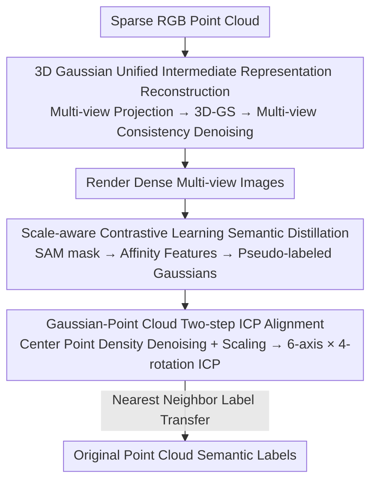

# PointGS: Semantic-Consistent Unsupervised 3D Point Cloud Segmentation with 3D Gaussian Splatting

**Conference**: CVPR 2026  
**Paper**: [CVF Open Access](https://openaccess.thecvf.com/content/CVPR2026/html/Song_PointGS_Semantic-Consistent_Unsupervised_3D_Point_Cloud_Segmentation_with_3D_Gaussian_CVPR_2026_paper.html)  
**Code**: https://github.com/SebastianYIXIAO/pointGS  
**Area**: 3D Vision  
**Keywords**: Unsupervised Point Cloud Segmentation, 3D Gaussian Splatting, SAM, Cross-modal Semantic Distillation, ICP Registration

## TL;DR
PointGS reconstructs sparse point clouds into a dense 3D Gaussian field as a unified intermediate representation. It extracts 2D masks from rendered images using SAM and distills semantics into Gaussian primitives through scale-aware contrastive learning. After a two-step ICP to align Gaussians back to the original point cloud for nearest-neighbor label transfer, it outperforms existing unsupervised methods on S3DIS (+2.8% mIoU) and ScanNet-v2 (+0.9% mIoU) without manual annotations or point cloud pre-training.

## Background & Motivation

**Background**: Fully supervised point cloud segmentation methods are mature but rely on dense point-wise annotations, which is extremely costly for large-scale indoor scenes. To bypass the annotation burden, unsupervised methods follow two paths: clustering-based approaches (GrowSP, U3DS³, LogoSP) or leveraging 2D pre-trained foundation models (SAM, DINOv2) to inject semantic priors (P2P, PointDC, Segment3D).

**Limitations of Prior Work**: Pure clustering methods capture only local geometric similarity and cannot distinguish between "geometrically similar but semantically different" objects—for example, a wall and a notice board hanging on it are both planar but belong to different categories. Methods introducing 2D priors face a fundamental modality mismatch: when sparse point clouds are projected to 2D, the lack of occlusion and depth information causes foreground and background points to overlap (e.g., the conference room example in Fig. 1). When SAM generates masks on these semantically confused projections, 3D segmentation quality degrades significantly.

**Key Challenge**: A domain gap exists between discrete 3D points and continuous 2D pixels. Attempting complex point-pixel alignment or additional 3D pre-training to resolve ambiguity increases complexity and harms cross-view semantic consistency.

**Goal**: Seamlessly transfer 2D semantic priors to sparse point clouds without introducing manual annotations, point cloud pre-training, or complex alignment procedures.

**Key Insight**: The authors observe that 3D Gaussian Splatting (3D-GS) possesses two properties that address these issues: first, replacing discrete points with continuously overlapping Gaussian ellipsoids fills spatial holes and encodes occlusion, ensuring foreground objects block the background in rendered images and preventing SAM from producing "mixed-semantic" masks; second, the differentiable rendering of 3D-GS preserves native 3D spatial relationships in 2D images, ensuring distilled semantics possess inherent 3D consistency.

**Core Idea**: Use 3D-GS as a unified intermediate representation to bridge the discrete-continuous gap—reconstruct first, distill SAM semantics on rendered images, and finally align back to the original point cloud. The entire pipeline avoids complex 2D-3D alignment or extra 3D pre-training.

## Method

### Overall Architecture
The input to PointGS is a sparse indoor point cloud with RGB $P=\{p_i\}_{i=1}^N,\ p_i\in\mathbb{R}^6$, and the output is a semantic label $l_i\in\{1,\dots,K\}$ for each point, achieved without manual supervision. The pipeline consists of three serial steps: ① Project the sparse point cloud into multi-view images based on predefined viewpoints, reconstruct a dense Gaussian field using 3D-GS, and perform multi-view consistency denoising; ② Render dense images from the Gaussian field, extract 2D masks using SAM, and distill semantics into the affinity features of each Gaussian via scale-aware contrastive learning to obtain pseudo-labeled Gaussians; ③ Extract Gaussian cluster centers, perform density-based denoising and scaling, and execute a two-step ICP to align the Gaussians back to the original point cloud coordinate system, finally transferring labels via nearest neighbor.

### Key Designs

**1. 3D Gaussians as a Unified Intermediate Representation: Filling sparse holes and eliminating projection ambiguity using continuous ellipsoids**

This step directly addresses the pain point of foreground-background overlap in sparse projections. The authors first project the point cloud into multi-view images according to predefined views and then reconstruct a dense Gaussian field using 3D-GS. The differentiable rasterization of 3D-GS calculates color $C(u)=\sum_{i=1}^ {|G_u|}\alpha_{g_i(u)}c_{g_i(u)}\prod_{j=1}^{i-1}(1-\alpha_{g_j(u)})$ at pixel $u$ using alpha blending. The depth-sorted blending allows foreground Gaussians to occlude background signals—this is the key: foreground blocks background in the rendered images, preventing SAM from being deceived by "mixed-semantic" projections. To remove reconstructed Gaussian noise, the authors introduce **multi-view consistency checks** inspired by SuGaR: if a Gaussian primitive does not participate in rendering in more than three adjacent views, it is deleted, reducing semantic interference from the background. Compared to direct sparse point projection, rendered images are more continuous and dense, making 2D→3D semantic transfer more reliable.

**2. Scale-aware Contrastive Learning for SAM Semantic Distillation: Consistently transferring view-specific 2D masks to 3D Gaussians**

SAM generates a set of binary masks $M^{(v)}=\{M_j^{(v)}\}$ for the $v$-th view, but these are view-specific and must be back-propagated to 3D Gaussians for cross-view consistency. Following SAGA, the authors assign a learnable affinity feature $f_g\in\mathbb{R}^D$ to each Gaussian and modulate it using a scale gate $S(s)$ (linear layer + sigmoid) based on granularity $s$ to obtain $f_g^s=S(s)\odot f_g$. This resolves multi-granularity ambiguity where the same Gaussian belongs to different objects or parts at different scales. Supervision is provided by mask correspondences sorted by 3D scale $s_{M}$: if two pixels share a mask, the mask correlation is $\mathrm{Corr}_m=1$, otherwise 0. Feature correlation is defined by the cosine similarity of gated features $\mathrm{Corr}_f(s,u_1,u_2)=\langle F^s(u_1),F^s(u_2)\rangle$. The contrastive loss is $L_{corr}=(1-2\cdot \mathrm{Corr}_m)\cdot\max(\mathrm{Corr}_f,0)$, with a regularization term on the norm of rendered features. The scale $s_M=2\sqrt{\mathrm{std}(X)^2+\mathrm{std}(Y)^2+\mathrm{std}(Z)^2}$ is calculated from the standard deviation of 3D coordinates after back-projecting the mask (⚠️ refer to the original paper for formula details). This consistently distills semantics into the Gaussians, resulting in pseudo-labeled Gaussians.

**3. Two-step ICP Alignment + Nearest Neighbor Label Transfer: Transferring semantics across coordinate systems**

Reconstruction and rendering cause the Gaussian coordinate system to differ from the original point cloud in scale and orientation, leading to misalignment during label transfer. The authors first extract the geometric centers $P_G$ of the Gaussian ellipsoids and perform two operations: first, **density denoising and scaling**, using kernel density $\hat\rho_i=\sum_{j\neq i}\exp(-\|p_i-p_j\|_2^2/2h^2)$ to estimate density per point, retaining high-density contour points based on a threshold $\tau$, and scaling the Gaussian points to the original point cloud's scale using the diameter ratio $s=\mathrm{diam}(P_O)/\mathrm{diam}(P_G')$. Second, a **two-step ICP** is performed. Since points in indoor scenes follow a cubic distribution, a single ICP often falls into local optima. Thus, the authors define six axial directions $\{\pm e_x,\pm e_y,\pm e_z\}$ and four rotations $\{0°, 90°, 180°, 270°\}$ for each, repeating ICP for all 24 combinations and selecting the optimal solution based on RMSE. After alignment, Gaussian labels $l_n^G$ are transferred to each original point $b_m$ using nearest neighbor $n^*(m)=\arg\min_n\|b_m-p_n\|_2$. Ablation shows this step recovers performance from catastrophic levels caused by misalignment.

### Loss & Training
The core training objective is the scale-aware contrastive loss $L_{corr}$ on Gaussian affinity features (summed over sampled pixel pairs) plus a rendered feature norm regularization $L_{norm}(u)=1-\|F(u)\|_2$. Other steps (3D-GS reconstruction, multi-view consistency check, ICP, nearest-neighbor transfer) are geometric processing and not learnable objectives. Regarding efficiency, on a single RTX 3090, 3D-GS reaches ~43.27 it/s and SAM ~0.35 fps. The authors run 10,000 3D-GS iterations per scene to balance speed and quality, with a projection resolution of 770×770.

## Key Experimental Results

### Main Results
Evaluation was performed on two indoor benchmarks without using official multi-view images (only RGB from point clouds); mIoU/oAcc/mAcc are reported after aligning predicted clusters with GT using the Hungarian algorithm.

| Dataset | Metric | PointGS | Prev. SOTA (LogoSP) | Gain |
|--------|------|---------|--------------------|------|
| ScanNet-v2 val | mIoU(%) | 36.7 | 35.8 | +0.9 |
| S3DIS Area5 | mIoU(%) | 49.3 | 46.5 | +2.8 |
| S3DIS Area5 | mAcc(%) | 66.1 | 55.9 | +10.2 |
| S3DIS Area5 | oAcc(%) | 76.6 | 82.8 | −6.2 |

The oAcc is lower than GrowSP/LogoSP; the authors explain that oAcc is dominated by large-scale classes like ceilings, walls, and floors. The improvement in mIoU/mAcc indicates that PointGS is more accurate in locating small objects and near-planar objects (like wall-mounted notice boards), even identifying objects beyond GT labels.

### Ablation Study
Incremental module addition on S3DIS Area5 (Table 5):

| Configuration | mIoU(%) | Description |
|------|---------|------|
| Baseline Projection (No 3D-GS) | 13.1 | Direct projection of sparse points |
| + 3D-GS (Unaligned) | 3.3 | Coordinate system mismatch, collapse |
| + 2-Step ICP | 27.5 | Performance recovered after alignment (+24.2) |
| + Affinity Feature | 49.2 | Contrastive distillation, another +21.7 |
| + Multi-view Check (Full) | 49.3 | Denoising fine-tuning (+0.1) |

### Key Findings
- **Two-step ICP and affinity features are the two pillars**: Adding 3D-GS without alignment causes mIoU to plunge from 13.1 to 3.3, proving Gaussian-point cloud alignment is indispensable; affinity features (scale-aware contrastive distillation) alone bring +21.7 mIoU, the core source of semantics.
- **Sensitivity to projection hyperparameters**: Increasing view count $V$ from 50 to 150 raises mIoU from 35.9% to 49.3%, with 200 views only yielding 49.4% (150 was selected). Optimal angle intervals are $\Delta_{elev}=0.5°,\Delta_{azim}=7.5°$; larger intervals (0.9°/9.5°) cause a drop to 36.2%. Surround-style projection (49.3%) outperforms tiled projection (45.9%).
- **Scale gate depends on the scene**: Scale Gate = 0.4 is optimal for S3DIS; ScanNet performs better with 0.3 due to more small objects—smaller values amplify fine-grained channels, benefiting small objects but sacrificing large-object consistency.

## Highlights & Insights
- **3D-GS as a "Translation Medium" rather than a rendering end-goal**: Historically, 3D-GS is used for novel view synthesis. This work reverses its role, using its density and occlusion encoding to "fix" the projection ambiguity of sparse point clouds, allowing SAM to work on clean rendered images. This shift in perspective is clever, essentially trading reconstruction quality for semantic consistency.
- **Brute-force 6-axis × 4-rotation ICP is practical**: The cubic distribution of indoor scenes makes ICP prone to local optima. Instead of complex initialization, the authors simply enumerate 24 orientations and pick the one with the lowest RMSE—simple, yet ablation proves it rescues the score from 3.3 to 27.5.
- **Transferability**: The paradigm of "reconstructing into a continuous intermediate → distilling 2D foundation model semantics on the intermediate → aligning back to original modality" is instructive for any task where "sparse/discrete modalities seek to leverage 2D foundation model semantics" (e.g., sparse LiDAR, medical point clouds).

## Limitations & Future Work
- **Strong dependence on 3D-GS reconstruction quality and speed**: Each scene requires 10,000 3D-GS iterations + SAM rendering inference (SAM at only 0.35 fps), making the pipeline heavy and difficult to scale to real-time or large outdoor scenes.
- **Lower oAcc**: Performance on large classes (wall/floor/ceiling) lags behind clustering methods, indicating a lack of global consistency on large areas, possibly due to over-segmentation.
- **Hyperparameter sensitivity**: View count, angle intervals, and Scale Gate require tuning per dataset, lacking an adaptive mechanism; the paper acknowledges Scale Gate requires manual adjustment per scene.
- **Indoor only**: Validation was limited to indoor S3DIS / ScanNet; outdoor, dynamic, or large-scale outdoor scenes were not tested.

## Related Work & Insights
- **vs. LogoSP / GrowSP (Clustering-based)**: These rely on local geometric similarity for superpoint merging, failing to distinguish geometrically similar but semantically different objects. PointGS introduces SAM semantic priors, performing better on small and near-planar objects (higher mIoU/mAcc) at the cost of a heavier pipeline and slightly lower oAcc for large classes.
- **vs. PointDC / P2P / Segment3D (2D Prior-based)**: These methods use 2D models directly on sparse projections, suffering from projection overlap and semantic confusion during back-projection. PointGS transforms discrete points into continuous Gaussians to eliminate projection ambiguity at the source, without complex 2D-3D alignment or extra 3D pre-training.
- **vs. SAGA / GARField (Scale-aware features)**: Borrowed their scale-gated affinity features but transformed a "user-prompted segmentation" scenario into fully automatic unsupervised segmentation—using autonomous SAM masks instead of user prompts and focusing on transferring semantics back to original point clouds.

## Rating
- Novelty: ⭐⭐⭐⭐ Using 3D-GS as a discrete-continuous bridge to solve projection semantic confusion is a novel perspective, though components (3D-GS, SAGA, SAM, ICP) are largely existing techniques.
- Experimental Thoroughness: ⭐⭐⭐⭐ Two benchmarks + modular ablation + hyperparameter sensitivity analysis are comprehensive, though limited to indoor scenes and SOTA gains on ScanNet are only +0.9.
- Writing Quality: ⭐⭐⭐⭐ Clear three-step pipeline description, intuitive diagrams; technical formulas rely on the appendix.
- Value: ⭐⭐⭐⭐ The "reconstruct as intermediate, then distill 2D foundation model" paradigm is insightful for sparse modalities; code is open-sourced.

<!-- RELATED:START -->

## Related Papers

- [\[CVPR 2026\] Image-to-Point Cloud Feature Back-Projection for Multimodal Training of 3D Semantic Segmentation](image-to-point_cloud_feature_back-projection_for_multimodal_training_of_3d_seman.md)
- [\[CVPR 2026\] GaussianZoom: Progressive Zoom-in Generative 3D Gaussian Splatting with Geometric and Semantic Guidance](gaussianzoom_progressive_zoom-in_generative_3d_gaussian_splatting_with_geometric.md)
- [\[CVPR 2026\] LangRef3DGS: Natural Language-Guided 3D Referential Segmentation from Partial Observations via 3D Gaussian Splatting](langref3dgs_natural_language-guided_3d_referential_segmentation_from_partial_obs.md)
- [\[CVPR 2026\] GeoFree-CoSeg: Unsupervised Point Cloud-Image Cross-Modal Co-Segmentation Without Geometric Alignment](geofree-coseg_unsupervised_point_cloud-image_cross-modal_co-segmentation_without.md)
- [\[CVPR 2026\] PhysIR-Splat: Physically Consistent Thermal Infrared Radiative Transfer in 3D Gaussian Splatting](physir-splat_physically_consistent_thermal_infrared_radiative_transfer_in_3d_gau.md)

<!-- RELATED:END -->
