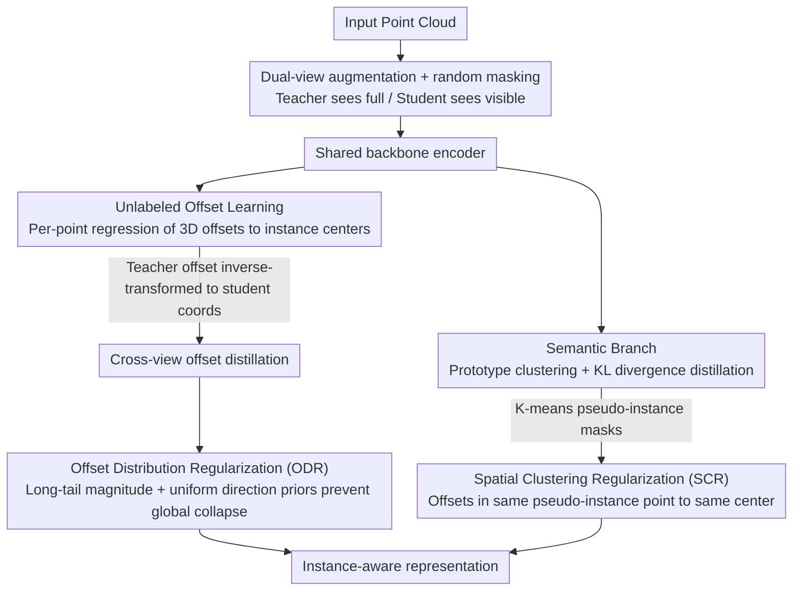

# PointINS: Instance-Aware Self-Supervised Learning for Point Clouds

**Conference**: CVPR 2026  
**arXiv**: [2603.25165](https://arxiv.org/abs/2603.25165)  
**Code**: None  
**Area**: 3D Vision  
**Keywords**: Point cloud self-supervised learning, instance-aware, geometric reasoning, offset learning, panoptic segmentation

## TL;DR

PointINS proposes the first self-supervised point cloud framework that explicitly learns semantic consistency and geometric reasoning. By incorporating an unlabeled offset branch with Offset Distribution Regularization (ODR) and Spatial Clustering Regularization (SCR), it achieves an average improvement of +3.5% mAP in indoor instance segmentation and +4.1% PQ in outdoor panoptic segmentation.

## Background & Motivation

While point cloud self-supervised learning (SSL) has made significant progress in semantic segmentation, existing methods (contrastive learning, masked modeling) essentially reinforce semantic invariance—making features of points within the same semantic category as similar as possible.

**Key Challenge**: There is a contradiction between semantic invariance and instance discriminability. Distinguishing different instances of the same category (e.g., two adjacent chairs) requires preserving fine-grained geometric relationships, whereas existing SSL methods often suppress this geometric sensitivity to prevent features from collapsing into low-level geometric cues like normals or poses.

**Key Insight**: The authors argue that the "geometric proximity" required for instance awareness is a high-level relational property, distinct from the low-level geometric cues considered as shortcuts. This aligns with supervised instance/panoptic segmentation frameworks—a semantic branch handles categories while an offset branch handles instance clustering, together enhancing holistic understanding.

## Method

### Overall Architecture

PointINS addresses a task previously avoided: enabling self-supervised point cloud models to understand not just "what category" but "which specific instance" a point belongs to. It follows a teacher-student self-distillation framework where a point cloud is processed into two views via random augmentation and partial masking; the student sees only visible subsets, while the teacher sees the complete point cloud, with the teacher's output supervising the student. In addition to the standard semantic branch (prototype clustering + KL divergence distillation for pulling similar points together), it introduces an **offset branch**: each point predicts a 3D offset vector pointing towards the geometric center of its instance. While the semantic branch handles "what," the offset branch handles "belonging," allowing the model to achieve true instance awareness. To overcome the lack of ground-truth labels for the offset branch, the paper utilizes two regularizations (ODR and SCR) to prevent training collapse.

### Key Designs

**1. Unlabeled Offset Learning: Directing each point to its instance center**

The core of instance awareness is recognizing that two adjacent chairs, though semantically identical, are distinct instances—a capability often suppressed by semantic invariance-focused contrastive/masking methods. PointINS transforms this into an offset regression task: an offset head is attached to the backbone in the teacher-student architecture to map features into 3D offset vectors, indicating the direction toward the instance's geometric center. A critical detail is that because the two views undergo different augmentations (rotation, flipping, scaling), the "correct offset direction" for the same point differs across views. The paper tracks the transformation matrix of each augmentation to inverse-transform the teacher's offsets back into the student's coordinate system for distillation, ensuring geometrically consistent cross-view supervision. Since no ground-truth centers exist, the teacher's offsets are first shaped by ODR to serve as valid targets.

**2. Offset Distribution Regularization (ODR): Using scene statistics to prevent global collapse**

Unlabeled offset regression is prone to collapse—where all offsets tend toward zero or a single direction, achieving low loss without learning. ODR addresses this by extracting two stable statistical regularities from real-world scenes as priors: first, the offset **magnitude** follows a stable long-tail distribution (most points are near the center, few are far); second, the offset **direction** is approximately uniformly distributed on a unit sphere (instance centers are surrounded by points from all directions). Aligning the empirical distribution of predicted offsets with these two priors provides a global constraint: deviations from the expected distribution are penalized. Zero or unidirectional collapses, which violate the long-tail or uniformity properties, are naturally excluded. These priors come from the data itself without manual annotation, providing zero-cost global supervision.

**3. Spatial Clustering Regularization (SCR): Leveraging semantic clustering for local geometric consistency**

While ODR manages the global distribution shape, it does not regulate local behavior—points within the same instance might still predict offsets pointing in different directions. SCR fills this gap by performing K-means clustering on the semantic branch's features to generate "pseudo-instance masks." Within each pseudo-instance, it constrains all points' offsets to point toward the same center. This constraint converts semantic judgments ("what") into geometric supervision ("belonging"), allowing the semantic branch's clustering results to provide local consistency signals for the offset branch. This creates a positive feedback loop between the branches. The trade-off is that pseudo-instances from unsupervised clustering can be imprecise, particularly in dense instance areas, which is noted as a limitation.

### Loss & Training

Total Loss = Semantic Distillation Loss (KL Divergence) + Offset Distillation Loss + ODR Loss + SCR Loss. Cross-view distillation is calculated in both directions. The teacher is updated via the student using Exponential Moving Average (EMA).

## Key Experimental Results

### Main Results

| Dataset | Task | PointINS | Prev. SOTA | Gain |
|--------|------|----------|---------|------|
| ScanNet | Instance Seg mAP | +3.5% avg | Sonata/DOS | +2.5~4.6% |
| ScanNet200 | Instance Seg mAP | Significant Gain | — | — |
| nuScenes | Panoptic Seg PQ | +4.1% avg | Sonata/DOS | +3.4~4.8% |
| SemanticKITTI | Panoptic Seg PQ | Gain | — | — |

The method consistently outperforms existing self-supervised methods across five datasets.

### Ablation Study

| Configuration | Indoor mAP | Outdoor PQ | Description |
|------|---------|---------|------|
| Semantic branch only (Baseline) | Baseline | Baseline | No instance awareness |
| + Offset branch (No regularization) | Collapsed | Collapsed | Validate regularization necessity |
| + Offset + ODR | Improved | Improved | Global distribution constraints effective |
| + Offset + ODR + SCR | Optimal | Optimal | Further improvement in local consistency |

### Key Findings

- Both ODR and SCR are essential: ODR prevents collapse, while SCR provides local consistency; neither can be omitted.
- Improvements are particularly significant under the linear probing setting, indicating that the learned representations are inherently higher quality beyond just fine-tuning effects.
- Semantic segmentation performance remains unaffected or slightly improved, showing that introducing geometric reasoning does not compromise semantic understanding.

## Highlights & Insights

- **Insight into Semantic-Geometric Synergy**: Migrating the dual-branch design of supervised instance segmentation to self-supervised learning, designing SSL objectives from the perspective of "mimicking supervised architectures."
- **Statistical Priors as Free Supervision**: Distributional characteristics of offsets (long-tail magnitude + uniform direction) are inherent properties of natural scenes. Utilizing them as regularization serves as a cost-free supervision signal.
- **Advancement Toward 3D Foundation Models**: Instance awareness is an indispensable capability for 3D foundation models; PointINS opens an important direction for unified 3D representation learning.

## Limitations & Future Work

- Pseudo-instance masks generated by K-means clustering are not precise enough, especially in dense instance regions.
- Offset distribution priors may vary across different scene types (indoor vs. outdoor).
- Current validation is limited to point cloud sparse convolution and Transformer backbones; more architectures remain to be tested.
- Future work could explore more refined pseudo-instance generation methods or incorporate temporal information.

## Related Work & Insights

- **vs. Sonata/DOS**: These methods focus on semantic consistency but ignore instance awareness; PointINS explicitly introduces geometric reasoning to address this deficiency.
- **vs. Supervised Instance Segmentation**: The offset branch design in PointINS is inspired by supervised methods like PointGroup, but the innovation lies in labeling-free training.
- **vs. 2D SSL (DINO/MAE)**: 3D SSL faces additional geometric sensitivity challenges, requiring a balance between avoiding low-level shortcuts and preserving high-level geometric relationships.

## Rating

- Novelty: ⭐⭐⭐⭐⭐ First 3D self-supervised framework to explicitly learn instance awareness; elegant ODR/SCR design.
- Experimental Thoroughness: ⭐⭐⭐⭐⭐ 5 datasets, 3 evaluation protocols, comprehensive ablations.
- Writing Quality: ⭐⭐⭐⭐ Clear motivation, complete technical details.
- Value: ⭐⭐⭐⭐⭐ Significant advancement for 3D foundation models.

<!-- RELATED:START -->

## Related Papers

- [\[CVPR 2026\] Towards Foundation Models for 3D Scene Understanding: Instance-Aware Self-Supervised Learning for Point Clouds](towards_foundation_models_for_3d_scene_understanding_instance-aware_self-supervi.md)
- [\[CVPR 2026\] Deformation-based In-Context Learning for Point Cloud Understanding](deformation-based_in-context_learning_for_point_cloud_understanding.md)
- [\[CVPR 2026\] GaussianGrow: Geometry-aware Gaussian Growing from 3D Point Clouds with Text Guidance](gaussiangrow_geometry-aware_gaussian_growing_from_3d_point_clouds_with_text_guid.md)
- [\[CVPR 2025\] Sonata: Self-Supervised Learning of Reliable Point Representations](../../CVPR2025/3d_vision/sonata_self-supervised_learning_of_reliable_point_representations.md)
- [\[CVPR 2026\] Vista4D: Video Reshooting with 4D Point Clouds](vista4d_video_reshooting_with_4d_point_clouds.md)

<!-- RELATED:END -->
