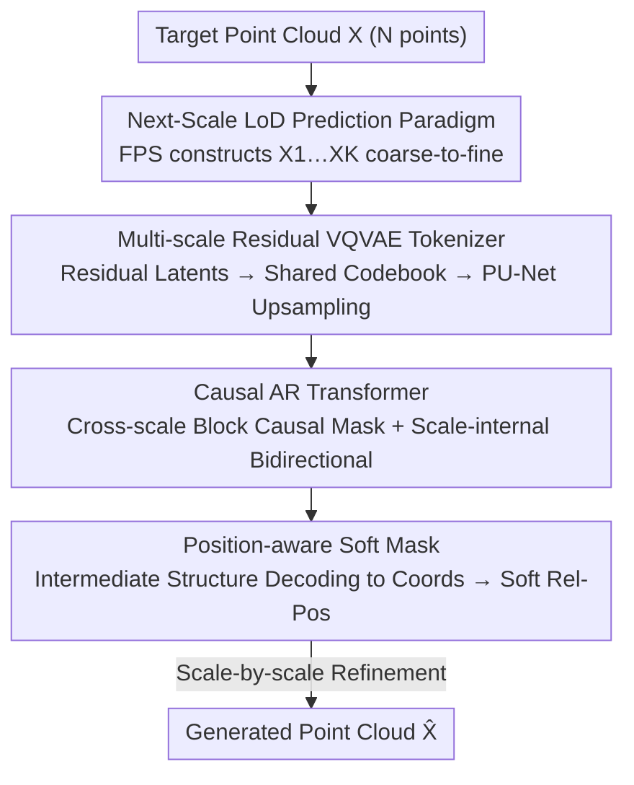

# PointNSP: Autoregressive 3D Point Cloud Generation with Next-Scale Level-of-Detail Prediction

**Conference**: CVPR 2026  
**Paper**: [CVF Open Access](https://openaccess.thecvf.com/content/CVPR2026/html/Meng_PointNSP_Autoregressive_3D_Point_Cloud_Generation_with_Next_Scale_Level_of_Detail_Prediction_CVPR_2026_paper.html)  
**Code**: https://pointnsp.pages.dev (Project Page)  
**Area**: 3D Vision  
**Keywords**: Point Cloud Generation, Autoregressive, Next-scale Prediction, Permutation Invariance, Level-of-Detail

## TL;DR
PointNSP transforms autoregressive point cloud generation from "point-by-point prediction" to "next-scale LoD prediction"—first determining the global structure at low resolution then refining geometry scale-by-scale. This is achieved via a multi-scale VQVAE and a causal Transformer with block-wise causal masks, maintaining the permutation invariance of point sets. It is the first autoregressive paradigm to achieve SOTA generation quality on ShapeNet, outperforming strong diffusion baselines in parameters, training, and sampling efficiency.

## Background & Motivation

**Background**: 3D point cloud generation has long been dominated by diffusion models (PVD, LION, TIGER). While high in quality, they require hundreds to thousands of denoising steps, are sensitive to noise schedules, and incur high costs for dense point clouds. Autoregressive (AR) models offer attractive sampling efficiency due to fewer steps, but their quality has lagged behind diffusion.

**Limitations of Prior Work**: AR models must impose an artificial order on inherently unordered point sets—PointGrow sorts by the z-axis, ShapeFormer flattens voxelized grids in row-major order, PointGPT uses Morton codes, and AutoSDF treats them as latent sequences with random permutations. This "flattening into 1D sequences" collapses global shape generation into local prediction.

**Key Challenge**: Fixed sequence ordering imposes unidirectional dependencies, strengthening short-range continuity but weakening the ability to model long-range dependencies. This makes it difficult to maintain global structural properties like symmetry, geometric consistency, and large-scale spatial patterns. Fundamentally, it violates the permutation invariance of point sets—ordering the same shape's points differently leads to different modeled distributions.

**Goal**: Can permutation-invariant autoregressive modeling be achieved for 3D point clouds?

**Key Insight**: The authors leverage the Level-of-Detail (LoD) principle from shape modeling—a shape can be expressed through multiple resolution levels from coarse to fine. If each step predicts a "complete shape at the next scale" rather than the "next point," each step corresponds to a full 3D shape under a given LoD. This maintains structural coherence and is naturally permutation-invariant, inspired by "next-resolution prediction" in the image-domain VAR.

**Core Idea**: Replace "next-point prediction" with "next-scale LoD prediction," changing the autoregressive objective from $\prod_i p(x_i\mid x_{<i})$ to $\prod_k p(X_k\mid X_{<k})$ (where $X_k$ is the global shape at resolution $s_k$). This allows for rich bidirectional interactions within each scale and causal dependencies across scales, aligning with the permutation-invariant nature of point sets while avoiding fragile fixed orderings.

## Method

### Overall Architecture
PointNSP uses two-stage training. **Stage I** employs FPS to recursively downsample the target point cloud $X$ ($s_K=N$ points) into a coarse-to-fine causal LoD sequence $X_1,\dots,X_K$. A multi-scale residual VQVAE is then trained: a permutation-equivariant network extracts residual latent features for each scale, which are quantized into tokens $Q=(q_1,\dots,q_K)$ using a shared codebook. Reconstruction $\hat X$ is achieved by summing contributions across scales via PU-Net-style upsampling. **Stage II** trains a causal Transformer on the token sequence $([start],q_1,\dots,q_{K-1})$ to predict $(q_1,\dots,q_K)$. It uses block causal masks across scales (scale $k$ only attends to $<k$) and full bidirectional attention within each scale, injecting geometric position information via position-aware soft masks from "intermediate structure decoding." Generation proceeds by upsampling and refining scale-by-scale from the coarsest level, equivalent to an autoregressive upsampling process.

### Key Designs

**1. Next-Scale LoD Prediction Paradigm: Replacing Fragile Point-wise Sequences with Permutation-Invariant Multi-scale Factorization**

This is the core contribution. The distribution of point-wise AR $p(x_1,\dots,x_N)=\prod_i p(x_i\mid x_{<i})$ depends on token order and does not satisfy $p(\pi(x_1,\dots,x_N))=p(x_1,\dots,x_N),\forall\pi\in S_N$. PointNSP instead constructs a coarse-to-fine causal sequence $X_1,\dots,X_K$ ($X_k\in\mathbb{R}^{s_k\times3}$ is the global shape at resolution $s_k$) and learns $p(X_1,\dots,X_K)=\prod_{k=1}^K p(X_k\mid X_{<k})$, where the upsampling rates satisfy $r_{K-1}\times\cdots\times r_1\times s_1=s_K$. Crucially, **FPS** is used to iteratively construct $X_{k-1}=\mathrm{FPS}(X_k),X_K=X$. Since FPS depends only on Euclidean distances between points and not their input order, it is naturally permutation-invariant and ensures uniform spatial coverage at every scale. The stochasticity of FPS also allows for data augmentation by creating multiple LoD trajectories for the same point cloud. Each step represents "a full 3D shape under a specific LoD," avoiding the collapse of 3D structures into 1D sequences and following a more structured, efficient generation trajectory than the repeated denoising of diffusion models.

**2. Multi-scale Residual VQVAE Tokenizer: Encoding Complementary Information Across Scales**

To convert the LoD sequence into discrete tokens, the authors learn a tokenizer in the latent feature space rather than 3D coordinate space. A permutation-equivariant network (such as PointNet++, PointNeXt, or PVCNN) first extracts point-wise features $f^0$. Then, each scale's latent features are extracted **residually**: $f_k=\mathrm{query}(f^{k-2}-\tilde f_{k-1},X_k)$, forcing each scale to capture only complementary information not represented at coarser levels to minimize redundancy. A **shared codebook** $Z\in\mathbb{R}^{V\times d}$ is used for quantization to token $q_k^i=\arg\min_v\|z_v-f_k[i]\|_2$. Each scale's contribution $\tilde f_k=\phi_k(\mathrm{upsampling}(z_k,s_K))$ is upsampled to the highest resolution via PU-Net-style upsampling (duplicate + reshape: $z_k(s_k\times d)\to z_k(s_k r\times d)$). Finally, all contributions are summed $\hat f=\sum_k\tilde f_k$ and decoded via MLP to $\hat X$. This "duplicate + reshape" upsampling maintains permutation equivariance; ablation shows it outperforms voxel-based upsampling.

**3. Block Causal Mask + Position-aware Soft Mask: Cross-scale Causality and Scale-internal Bidirectional Geometric Injection**

3D structures have strong local geometric inductive biases, which standard causal Transformers struggle to capture both within and across scales. **Across scales**, the authors construct a block-diagonal causal mask $M=\mathrm{diag}[M_1,\dots,M_K]$, where each diagonal block $M_k$ ($s_k\times s_k$) is fully open—allowing full bidirectional interaction within a scale, treating $q_k$ as a complete shape, while scale $k$ can only attend to $q_{<k}$ to prevent leakage. A one-hot scale embedding is also added. **Within scales**, since bidirectional Transformers lack inherent position information and depth dilutes relative positions, a position-aware soft mask $M_k^p=\mathrm{Softmax}((P_kW_p)(P_kW_p)^T)$ is used to encode soft relative positions. To address the absence of explicit 3D coordinates at this stage, the authors use **intermediate structure decoding**: decoding the intermediate shape $X_k=D(\sum_{m=1}^k\phi_m(\mathrm{upsampling}(z_m,s_m)))$ from ground-truth tokens up to step $k$, then calculating absolute position encodings $P_k$ via trigonometric functions (predicted tokens $\hat q_k$ are used during inference). Position encodings based on token indices are avoided as they would break permutation equivariance. The loss is per-token cross-entropy, averaged first within scales $L_k=\frac1{s_k}\sum_i L_k^i$ and then across scales $L_{total}=\frac1K\sum_k L_k$.

### Loss & Training
Stage I VQVAE reconstruction loss is $L_{recon}=L_{CD}(X,\hat X)+L_{EMD}(X,\hat X)+\sum_{k=1}^K\|f_k-\mathrm{sg}(z_k)\|_2^2$, where CD and EMD measure point cloud similarity from complementary perspectives, and the stop-gradient $\mathrm{sg}[\cdot]$ aligns the latent features $f_k$ with quantized vectors $z_k$. Stage II is the cross-entropy for next-scale tokens. Two size variants, PointNSP-s and PointNSP-m, are provided.

## Key Experimental Results

### Main Results
On ShapeNetv2 (PointFlow preprocessing) with the standard 2048-point setup, the primary metric is **1-NN Accuracy** (measuring both quality and diversity; closer to 50% is better), calculated using CD (Chamfer Distance) and EMD (Earth Mover's Distance). Below are results for standard random split single-class generation (values closer to 50 are better, ↓ indicates lower is better):

| Model | Type | Mean CD ↓ | Mean EMD ↓ |
|------|------|-----------|------------|
| TIGER | Diffusion | 60.46 | 57.08 |
| LION | Diffusion | 61.75 | 57.59 |
| PointGPT | AR | 63.44 | 62.24 |
| CanonicalVAE | AR | 68.72 | 66.29 |
| **PointNSP-m** | **AR** | **59.65** | **56.13** |

PointNSP-m not only sets a new AR SOTA (improving Mean CD from 63.44 to 59.65 over PointGPT) but also outperforms the strongest diffusion baseline, TIGER (60.46). On the LION split, its Mean CD of 58.04 is also the best. The lightweight PointNSP-s is also highly competitive.

### Ablation Study
Ablation of architectural components on ShapeNet (Table 4, lower CD/EMD is better):

| Upsampling | Pos Mask | FPS Aug | Embedding | Mean CD ↓ | Mean EMD ↓ |
|------------|----------|----------|-----------|-----------|------------|
| Voxel | ✓ | | SE | 64.25 | 60.53 |
| PU-Net | ✓ | | SE | 63.86 | 59.95 |
| PU-Net | ✓ | | SE+A-PE | 62.19 | 58.23 |
| PU-Net | ✓ | ✓ | SE+L-PE | 60.62 | 57.34 |
| PU-Net | ✓ | ✓ | SE+A-PE (Full) | **59.65** | **56.13** |

### Key Findings
- **PU-Net upsampling outperforms Voxel**: Its permutation-equivariant design provides a better starting point (64.25 → 63.86) and is key to maintaining structure.
- **Position-aware soft masks + Absolute Position Encoding (A-PE) contribute significantly**: Combined with FPS augmentation, they drive Mean CD from 62.19 down to 59.65, proving that injecting geometry into scale-internal bidirectional attention is vital. Index-based position encodings are explicitly avoided.
- **Greater advantage in dense and multi-class scenarios**: PointNSP's lead is more pronounced in 8192-point dense generation. In 55-class unconditional generation, it significantly outperforms PVD, PointGPT, LION, and TIGER, showing stronger generalization.
- **Efficiency lead**: For 2048 points, PointNSP-s requires 125 GPU-h for training, 3.21s for sampling, and has only 22M parameters, far superior to LION (550 GPU-h / 31.2s / 60M), TIGER (164 / 23.6 / 55M), and PointGPT (185 / 5.32 / 46M). PointNSP-m achieves the highest quality while remaining the second most efficient.

## Highlights & Insights
- **Properly applying VAR's "next-resolution" to 3D point clouds with permutation invariance**: While VAR's next-resolution prediction in images was for efficiency, the authors recognize its natural fit for "unordered data"—bidirectional within scales and causal across scales allows point sets to escape fixed orderings. This is a brilliant adaptation of a 2D paradigm to 3D.
- **FPS for both LoD construction and data augmentation**: Using FPS for hierarchy ensures permutation invariance, while leveraging its stochasticity to create multiple trajectories for the same shape for augmentation is an economical design choice.
- **Intermediate structure decoding solves the "coordinates vs. position encoding" chicken-and-egg problem**: In Stage II, where explicit 3D geometry is not yet present, decoding intermediate shapes from current tokens to compute position encodings is a clever approach applicable to other "token-first, geometry-later" tasks.
- **Simultaneous Quality and Efficiency**: The AR paradigm finally matches or exceeds diffusion in quality while maintaining faster sampling and smaller parameter sizes, offering real value for resource-constrained 3D generation.

## Limitations & Future Work
- **Dependency on VQVAE discretization quality**: In a two-stage pipeline, codebook and quantization errors propagate to generation. Hyperparameters like codebook size $V$, number of scales $K$, and upsampling rates require tuning.
- **Position encoding depends on intermediate decoding accuracy**: During inference, intermediate shapes are decoded from predicted tokens; if early scales are biased, position encodings become noisy, posing a risk of error accumulation (⚠️ this propagation was not deeply analyzed).
- **Validation limited to synthetic object-level point clouds (ShapeNet)**: Performance on scene-level data, real-world scans (with noise/occlusions), or large-scale LiDAR has not been tested; scalability was only demonstrated up to 8192 points.
- **Theoretical guarantees of permutation invariance are in the Appendix**: The main text provides design intuition, but rigorous proof relies on Appendix 6.

## Related Work & Insights
- **vs. Diffusion (PVD / LION / TIGER)**: Diffusion relies on hundreds to thousands of denoising steps and is sensitive to noise schedules and expensive for dense data. PointNSP follows a structured coarse-to-fine upsampling trajectory, surpassing TIGER's quality with nearly 10x faster sampling (3.21s vs 23.6s) and less than half the parameters.
- **vs. Point-wise AR (PointGrow / PointGPT / CanonicalVAE)**: These flatten point clouds into 1D sequences (z-sort / Morton / spiral), breaking permutation invariance and collapsing global structure. PointNSP predicts the whole scale's shape at each step, preserving structure and invariance, improving quality from 63.44 (PointGPT) to 59.65.
- **vs. VAR (Image next-resolution prediction)**: While borrowing the multi-scale causal paradigm, PointNSP is specifically designed for unordered point sets via FPS-LoD construction, PU-Net upsampling, and the removal of index-based position encodings, making "next-scale" truly compatible with point clouds.

## Rating
- Novelty: ⭐⭐⭐⭐⭐ First to bring AR point cloud generation to SOTA quality; the next-scale LoD paradigm + permutation-invariant design is a structural contribution.
- Experimental Thoroughness: ⭐⭐⭐⭐⭐ Covers standard/dense/multi-class generation, completion/upsampling downstream tasks, efficiency, and component ablations across two splits and scales.
- Writing Quality: ⭐⭐⭐⭐ Clear motivation and step-by-step diagrams, though notation is dense and some parts rely on the appendix (e.g., proof of invariance).
- Value: ⭐⭐⭐⭐⭐ Achieves both quality and efficiency, opening a new path for AR 3D generation with potential as a foundation model; project page is public.

<!-- RELATED:START -->

## Related Papers

- [\[NeurIPS 2025\] ARMesh: Autoregressive Mesh Generation via Next-Level-of-Detail Prediction](../../NeurIPS2025/3d_vision/armesh_autoregressive_mesh_generation_via_next-level-of-detail_prediction.md)
- [\[CVPR 2026\] AvatarPointillist: AutoRegressive 4D Gaussian Avatarization](avatarpointillist_autoregressive_4d_gaussian_avatarization.md)
- [\[CVPR 2026\] RayNova: Scale-Temporal Autoregressive World Modeling in Ray Space](raynova_scale-temporal_autoregressive_world_modeling_in_ray_space.md)
- [\[CVPR 2026\] MeshRipple: Structured Autoregressive Generation of Artist-Meshes](meshripple_structured_autoregressive_generation_of_artist-meshes.md)
- [\[CVPR 2026\] FACE: A Face-based Autoregressive Representation for High-Fidelity and Efficient Mesh Generation](face_a_face-based_autoregressive_representation_for_high-fidelity_and_efficient_.md)

<!-- RELATED:END -->
