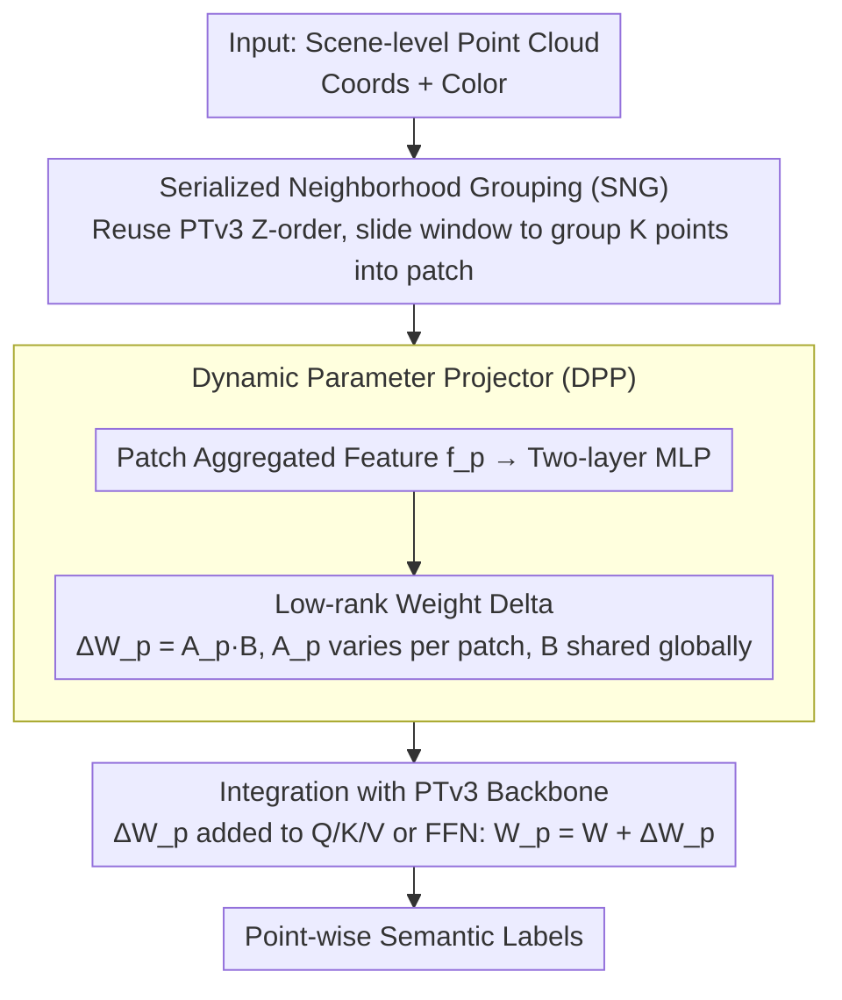

# PointTPA: Dynamic Network Parameter Adaptation for 3D Scene Understanding

**Conference**: CVPR 2026  
**arXiv**: [2604.04933](https://arxiv.org/abs/2604.04933)  
**Code**: [https://github.com/H-EmbodVis/PointTPA](https://github.com/H-EmbodVis/PointTPA)  
**Area**: 3D Vision / Point Cloud Understanding  
**Keywords**: Point Cloud Semantic Segmentation, Test-time Parameter Adaptation, Dynamic Networks, Parameter-Efficient Fine-Tuning, Scene-level Understanding

## TL;DR

The PointTPA framework is proposed, utilizing two lightweight modules—Serialized Neighborhood Grouping (SNG) and Dynamic Parameter Projector (DPP)—to generate customized network parameters for each input scene during inference. With an increase of <2% in parameter count, it achieves 78.4% mIoU on ScanNet, surpassing current Parameter-Efficient Fine-Tuning (PEFT) methods.

## Background & Motivation

**Background**: Scene-level point cloud understanding (e.g., indoor semantic segmentation) is a core task in 3D vision. With the emergence of powerful pre-trained backbones like Point Transformer v3 (PTv3) and Sonata, a natural paradigm is "pre-train + fine-tune"—pre-training on large-scale data and then fine-tuning on the target task. Parameter-Efficient Fine-Tuning (PEFT) methods (such as LoRA, Adapter, VPT, etc.) have migrated from NLP/2D vision to the 3D point cloud domain, aiming to adapt pre-trained models using a small number of trainable parameters.

**Limitations of Prior Work**: (1) Existing PEFT methods (including 3D-specific methods like DAPT, PointGST, and IDPT) use **static parameters** for inference after training—all test samples share the same set of adaptation parameters, failing to adjust dynamically based on different scene characteristics; (2) The challenge of scene-level point clouds lies in the massive variations in geometric complexity, category distribution, and spatial layout—some scenes are dominated by large planes (e.g., empty conference rooms), while others are filled with small objects (e.g., cluttered kitchens); (3) Static parameters show suboptimal adaptation when facing such high inter-scene variability, as a single set of parameters cannot be optimal for both simple and complex scenes simultaneously.

**Key Challenge**: PEFT aims to "achieve performance close to full fine-tuning with few parameters," but the inherent limitations of static parameters prevent a small parameter set from covering all scene variations. Resolving this contradiction requires making the parameters themselves a function of the input.

**Goal**: Design a test-time parameter adaptation mechanism that allows network parameters to adjust dynamically based on the characteristics of the input scene while maintaining extremely low parameter overhead.

**Key Insight**: The authors observe that scene-level point clouds can be decomposed into locally consistent patches—where points within a patch share similar geometric and semantic attributes. By generating customized network weights for each patch, fine-grained adaptation can be achieved at the local level while maintaining parameter efficiency through weight-sharing mechanisms.

**Core Idea**: Use a Dynamic Parameter Projector to generate a weight delta specific to each input patch based on its features, achieving "one set of parameters per scene" during test-time adaptation.

## Method

### Overall Architecture

PointTPA is built upon the PTv3 backbone. The input is a scene-level point cloud (with coordinates, colors, etc.), which is first organized into a sequence of locally consistent patches via Serialized Neighborhood Grouping (SNG). Then, at each layer of the backbone, the Dynamic Parameter Projector (DPP) dynamically generates a parameter increment (weight delta) for that layer based on the current patch features, which is added to the pre-trained weights for adaptive inference. The output is per-point semantic labels. Throughout the process, the trainable parameters of the SNG and DPP modules account for <2% of the backbone parameters.

### Key Designs

**1. Serialized Neighborhood Grouping (SNG): Partitioning scenes into "locally consistent" patches at near-zero cost**

To generate exclusive parameters for each local region, the first step is to partition the unordered point cloud into appropriately granular blocks. SNG avoids expensive operations like FPS + kNN, which would significantly increase computation; instead, it reuses the serialization already performed by PTv3 (e.g., Z-order space-filling curves). Since points near each other in space are generally adjacent in the 1D sequence, simply sliding a window of size $K$ across the sequence generates patches of spatially neighboring points with similar geometric attributes. Patches are chosen as the granularity because single-point parameters are computationally explosive and offer insufficient context, while scene-level parameters are too coarse to distinguish between a conference room and a cluttered kitchen.

**2. Dynamic Parameter Projector (DPP): Making network weights a "function of the input" rather than fixed constants**

This is the core distinction between PointTPA and static PEFT. For every layer and each patch's aggregated feature $\mathbf{f}_p \in \mathbb{R}^{d}$, the DPP uses a lightweight projection network (two-layer MLP + activation) to map it to a weight increment $\Delta W_p = \text{MLP}(\mathbf{f}_p) \in \mathbb{R}^{d_{\text{out}} \times d_{\text{in}}}$. During inference, the weights used for all points within that patch are the base weights plus this increment:

$$W_p = W + \Delta W_p$$

To minimize parameters, DPP employs a low-rank decomposition, allowing only the patch-dependent half to vary with the input while the other half is shared globally:

$$\Delta W_p = A_p B,\quad A_p \in \mathbb{R}^{d_{\text{out}} \times r},\ B \in \mathbb{R}^{r \times d_{\text{in}}},\ r \ll d$$

Compared to LoRA (where $\Delta W = AB$ is fixed after training), DPP's $A_p$ is calculated from the current patch features. Consequently, for geometrically complex patches (e.g., chair legs), it generates more precise extraction parameters, while for simple patches (e.g., planes), it yields smoother parameters. This "on-demand deformation" allows a small number of parameters to cover wider scene variation.

**3. Integration with PTv3 Backbone: Structural insertion following window attention**

The deltas generated by the DPP are added to the Q/K/V projection matrices or Feed-Forward Network (FFN) weights in each PTv3 self-attention layer. Conveniently, PTv3's serialized window attention inherently assumes spatial locality; points within the same window belong to the same or adjacent patches, allowing parameter application to align directly with windows without additional grouping. During backpropagation, gradients flow through the DPP projection network (learning "how to generate parameters from features") and optionally through un-frozen layers of the backbone.

### Loss & Training

A standard semantic segmentation cross-entropy loss is used: $\mathcal{L} = -\frac{1}{N}\sum_{i=1}^{N}\sum_{c=1}^{C} y_{ic} \log \hat{p}_{ic}$, where $N$ is the number of points and $C$ is the number of categories. During training, most of the pre-trained backbone is frozen, and only the SNG and DPP modules (<2% parameters) are trained. Two fine-tuning modes are supported: (1) **Linear Probing + PointTPA**—backbone frozen, training only the head and PointTPA; (2) **Decoder Probing + PointTPA**—fine-tuning the decoder and PointTPA. Pre-trained weights are sourced from Sonata (a large-scale 3D model based on PTv3).

## Key Experimental Results

### Main Results (Comparison across benchmarks)

| Dataset | Method | Type | mIoU (%) ↑ | Trainable Parameters |
|--------|------|------|-----------|-----------|
| ScanNet val | Linear Probing | Baseline | ~73 | Head only |
| ScanNet val | LoRA | PEFT | ~75 | <3% |
| ScanNet val | DAPT | 3D PEFT | ~76 | <3% |
| ScanNet val | PointGST | 3D PEFT | ~76 | <3% |
| ScanNet val | **PointTPA (Lin)** | **Dynamic PEFT** | **78.4** | **<2%** |
| ScanNet val | Full Fine-Tuning | Full | ~79 | 100% |
| ScanNet200 val | Linear Probing | Baseline | ~30 | Head only |
| ScanNet200 val | **PointTPA (Lin)** | **Dynamic PEFT** | **Significant Gain** | **<2%** |
| S3DIS Area5 | **PointTPA** | **Dynamic PEFT** | **Competitive** | **<2%** |
| ScanNet++ val | **PointTPA** | **Dynamic PEFT** | **Competitive** | **<2%** |

### Ablation Study

| Config | ScanNet mIoU (%) | Params | Notes |
|------|-----------------|--------|------|
| PTv3 + Linear Probing | ~73 | Min | Frozen backbone baseline |
| + SNG only | ~74.5 | Minimal increase | Grouping only, no dynamic params |
| + DPP only (Global) | ~76 | <1.5% | Dynamic params without local grouping |
| **+ SNG + DPP (PointTPA)** | **78.4** | **<2%** | **Full Model** |
| DPP rank r=4 | ~77.5 | <1.5% | Lower rank projection |
| DPP rank r=16 | ~78.4 | <2% | Default setting |
| DPP rank r=32 | ~78.5 | <3% | Higher rank, marginal gain |

### Key Findings

- **PointTPA achieves performance close to Full Fine-Tuning (~79%) with <2% parameters**, narrowing the gap between PEFT and FFT.
- **SNG and DPP are complementary**: SNG provides logical local grouping, while DPP generates adaptive parameters on those groups; both are essential.
- **Dynamic vs. static advantage is more pronounced in complex scenarios**: On ScanNet200 (fine-grained 200-class segmentation), PointTPA shows larger gains over static PEFT because more categories introduce more scene variation.
- **Inference overhead is controllable**: DPP parameter generation adds only ~5-10% to inference time due to its lightweight two-layer MLP design.
- **The rank $r$ has a sweet spot**: $r=16$ provides the best balance between accuracy and parameter count, with diminishing returns beyond this point.

## Highlights & Insights

- **The core insight of dynamic parameters is universal**: Changing network parameters from "static constants" to "functions of the input" is an idea that can migrate from 3D point clouds to 2D vision, NLP, and other PEFT domains.
- **Zero-overhead grouping in SNG is clever**: Reusing PTv3’s serialization order avoids extra clustering computation; this "utilization of existing structures" is a noteworthy design pattern.
- **FFN-level parameter efficiency**: 78.4% vs ~79% mIoU with a 50x difference in parameter count is highly valuable for edge deployment where storage and computation are restricted.
- **Connection to HyperNetworks**: DPP is essentially a HyperNetwork—a small network generating parameters for a larger one. PointTPA’s contribution lies in successfully applying this to 3D PEFT and proving its effectiveness.

## Limitations & Future Work

- Currently only validated on semantic segmentation; tasks like 3D object detection, instance segmentation, and point cloud registration remain to be explored.
- The weight delta generated by DPP is constrained by the low-rank assumption—extreme scene distributions requiring high-rank changes might need more flexible generation mechanisms.
- SNG grouping depends on PTv3's serialization strategy; adapting to other backbones (e.g., MinkowskiNet, SparseConvNet) would require redesigning the grouping scheme.
- Test-time parameter adaptation introduces input-dependent computation paths, making inference not entirely deterministic—different patch groupings of the same input might lead to minute result variations.
- Integration/relationships with test-time training (TTT) and test-time augmentation (TTA) remain to be explored.

## Related Work & Insights

- **vs LoRA (Hu et al. 2022)**: LoRA uses a fixed low-rank increment $\Delta W = AB$, where parameters are input-independent. PointTPA’s DPP can be viewed as an "input-conditioned LoRA" where the $A$ matrix is a function of the input.
- **vs DAPT (Zhou et al. 2024)**: DAPT also focuses on 3D PEFT but uses static adapters. PointTPA achieves better results under similar parameter budgets via dynamic parameters.
- **vs HyperNetwork (Ha et al. 2017)**: While HyperNetworks generate parameters for entire networks, PointTPA localizes this concept—generating increments only at the patch level.
- **Insight**: The dynamic parameter approach could be combined with prompt tuning—dynamically adjusting network weights while also generating dynamic input prompts.

## Rating

- **Novelty**: ⭐⭐⭐⭐ Combining test-time dynamic adaptation with 3D PEFT is novel; SNG and DPP are cleverly designed though not conceptually complex.
- **Experimental Thoroughness**: ⭐⭐⭐⭐⭐ Comprehensive coverage of 4 datasets, multiple fine-tuning modes, detailed ablations, parameter efficiency, and timing analysis.
- **Writing Quality**: ⭐⭐⭐⭐ Method descriptions are clear and experiments are well-documented.
- **Value**: ⭐⭐⭐⭐ Provides a new direction for efficient fine-tuning in 3D scene understanding, with dynamic mechanisms showing significant transfer potential.

<!-- RELATED:START -->

## Related Papers

- [\[CVPR 2026\] Consistent Instance Field for Dynamic Scene Understanding](consistent_instance_field_for_dynamic_scene_understanding.md)
- [\[CVPR 2026\] Lifting Unlabeled Internet-level Data for 3D Scene Understanding](lifting_unlabeled_internet-level_data_for_3d_scene_understanding.md)
- [\[CVPR 2026\] Curvature-Aware Captioning: Leveraging Geodesic Attention for 3D Scene Understanding](curvature-aware_captioning_leveraging_geodesic_attention_for_3d_scene_understand.md)
- [\[CVPR 2026\] RISE: Single Static Radar-based Indoor Scene Understanding](rise_single_static_radar-based_indoor_scene_understanding.md)
- [\[CVPR 2025\] PMA: Towards Parameter-Efficient Point Cloud Understanding via Point Mamba Adapter](../../CVPR2025/3d_vision/pma_towards_parameter-efficient_point_cloud_understanding_via_point_mamba_adapte.md)

<!-- RELATED:END -->
