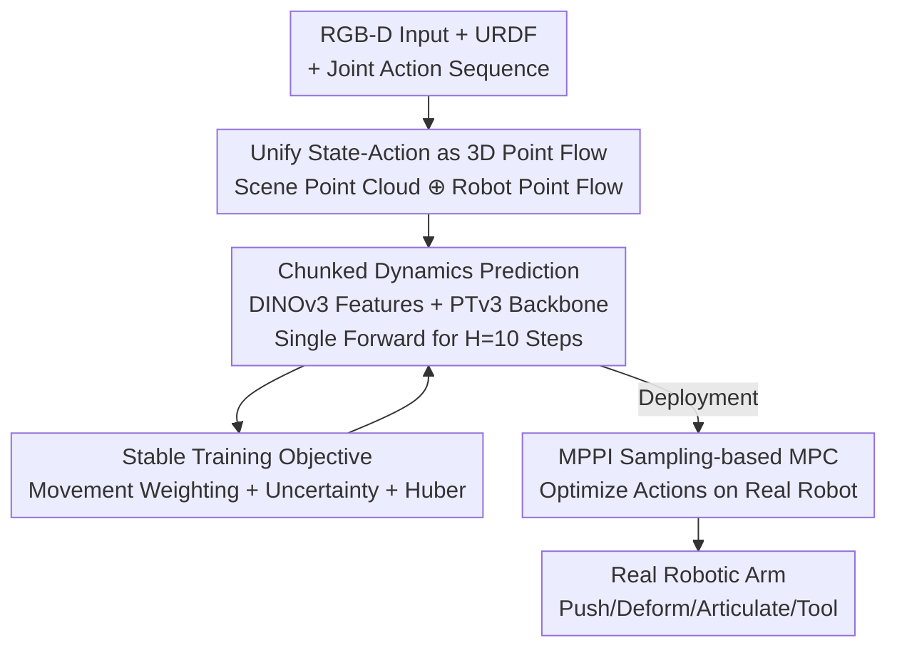

# PointWorld: Scaling 3D World Models for In-The-Wild Robotic Manipulation

**Conference**: CVPR 2026  
**Paper**: [CVF Open Access](https://openaccess.thecvf.com/content/CVPR2026/html/Huang_PointWorld_Scaling_3D_World_Models_for_In-The-Wild_Robotic_Manipulation_CVPR_2026_paper.html)  
**Code**: None (Authors promise to open source code/dataset/checkpoint at point-world.github.io)  
**Area**: 3D Vision / Robotics / World Models  
**Keywords**: 3D World Models, Point Flow, Robotic Manipulation, MPC, Cross-Embodiment Transfer

## TL;DR
PointWorld represents scene states and robot actions as a unified set of 3D point flows. By using a large pre-trained point cloud backbone to learn "how scene points move given an action" across approximately 2 million trajectories, a single checkpoint can drive real robotic arms to complete tasks involving rigid body pushing, deformable objects, articulated objects, and tool use from a single RGB-D input in a zero-shot manner.

## Background & Motivation
**Background**: Robotic world models predict "how the environment evolves given the current state and robot action." Mainstream approaches fall into three categories: physics-based models (accurate but suffer from sim-to-real gaps and require scene-by-scene modeling); learning-based dynamics models (learnable from interaction data but often rely on inductive biases like full observability, object priors, or material priors); and large-scale video generation models (visually realistic but lacking explicit action conditioning and physical consistency).

**Limitations of Prior Work**: Existing methods still exhibit a significant gap from the human ability to predict deformation, articulation, contact, and stability at a glance, especially in open-world, in-the-wild scenarios with sparse perceptual input. Crucially, actions are typically represented in **embodiment-specific** spaces (joint angles, end-effector poses), preventing data sharing across different robots and hindering large-scale training.

**Key Challenge**: There is a modality inconsistency between state (from perception like RGB-D) and action (from embodiment-specific low-dimensional commands). Consequently, it is difficult for models to ingest massive heterogeneous data while clearly modeling "how robot geometry acts upon the scene." To scale, state and action must first be placed into a **unified and scalable** representation.

**Goal**: To train a **single, generalizable** pre-trained 3D world model capable of spatially aligned, action-conditioned predictions from in-the-wild single RGB-D inputs, which can be directly used for real robot control.

**Key Insight**: The authors' philosophy is "unify for scaling"—both state and action are represented as point flows in 3D physical space. Scene State = all-scene point cloud back-projected from RGB-D; Action = dense 3D point trajectories extrapolated through forward kinematics using known robot geometry (URDF + joint sequences).

**Core Idea**: Modeling the 3D world is equivalent to "predicting point-wise displacements of the scene under perturbations from a sequence of robot point flows." Using unified 3D point flows to carry both state and action is analogous to "next-token prediction" but applied to 3D space and temporal interactions.

## Method

### Overall Architecture
PointWorld learns a dynamics network $F_\theta: \mathcal{S} \times \mathcal{A} \to \mathcal{S}$, but instead of single-step updates, it performs **chunked multi-step prediction**: a single forward pass predicts future states for $H$ steps $F_\theta^H:(s_t, a_{t:t+H-1}) \to s_{t+1:t+H}$, with $H=10$ and 0.1s per step. The input is a single (or few) calibrated RGB-D frame, and the output is the step-by-step 3D displacement of every point in the scene over the next second. The pipeline involves: converting actions to robot point flows → concatenating with scene point clouds → extracting scene features via frozen DINOv3 and robot points via temporal embeddings → predicting scene point flow using a PTv3 backbone → employing sampling-based MPC for real-world action execution.

### Key Designs

**1. Unifying State and Action as 3D Point Flows: Sharing Representations Across Perception and Heterogeneous Embodiments**

This is the foundation of the work, directly addressing the conflict of modality mismatch. The state $s_t = \{(p_{t,i}, f_i^S)\}_{i=1}^{N_S}$ is a set of point flows, each with a 3D position $p_{t,i}\in\mathbb{R}^3$ and time-invariant features—obtained by masking the robot pixels and back-projecting the rest. This avoids assuming objectness or material priors and eliminates the need for a separate point tracker during inference. Actions are also point flows, but instead of RGB-D, they are **extrapolated** through forward kinematics using known robot geometry: given a joint sequence $\{q_{t+k}\}$, robot surface points are sampled at time $t$, attached to corresponding links, and propagated to yield an ordered robot point set as $a_{t+k}$. This ensures "imagined actions" are **fully observable** (even if contact occurs in occluded regions) and naturally embodiment-agnostic—joint angles and end-effector poses are unified into this point flow representation, allowing data from different robots (e.g., Franka and bimanual humanoids) to be trained together. For efficiency, points are only sampled from the grippers.

**2. Chunked Dynamics Prediction: Scaling Scene Point Flow Regression with Off-the-shelf Backbones and Pre-trained 2D Features**

To scale while modeling robot-scene interaction clearly, the authors avoid custom architectures and instead concatenate the initial scene points with temporally stacked robot points into **one point cloud** for processing by the PointTransformerV3 (PTv3) backbone. Scene points use frozen DINOv3 features (providing implicit objectness priors without explicit segmentation), and robot points use temporal embeddings. A shared MLP head then predicts the displacement for every scene point at each step within the chunk. PTv3 is chosen because its point serialization corresponds to the local grouping in Graph-Based Neural Dynamics (GBND), while its U-Net hierarchy enables long-range attention on coarsened point sets. This allows scaling parameters to 957× the size of GBND with only moderate increases in memory and latency, overcoming GBND's memory bottlenecks and reliance on noisy message passing for long-range effects. Chunked prediction achieves ~0.1s real-time latency, facilitating the evaluation of numerous candidate trajectories in MPC.

**3. Stable Training Objective: Movement Weighting + Uncertainty Regularization + Huber Loss for Sparse and Noisy Real Data**

Full-scene prediction faces two challenges: first, robots typically only move a small fraction of the scene (1–5%), making standard L2 signals extremely sparse; second, real-world data is noisy. The authors address the former with **movement weighting**: a soft movement likelihood $m_{k,i}=\sigma(\kappa(\delta_{k,i}-\tau))$ is calculated for each point/step based on ground truth displacement $\delta_{k,i}$, then normalized into weights $w_{k,i}=m_{k,i}/\sum_{k,i} m_{k,i}$ to focus the loss on moving points. For the latter, **aleatoric uncertainty regularization** is used: the model predicts a scalar log-variance $s_{k,i}$ for each point/step, and Huber loss is applied to the residuals. The complete objective is:

$$\frac{1}{2}\sum_{k,i} w_{k,i}\left(\rho_\delta(\hat{P}_{t+k,i}-P_{t+k,i})\,e^{-s_{k,i}} + s_{k,i}\right)$$

where $\rho_\delta$ is the element-wise Huber loss. The intuition is that movement weighting alone amplifies noise, while the uncertainty head and robust loss suppress weights and reduce overfitting, together enabling stable training on real data.

**4. MPPI Sampling-based MPC: Direct Planning with the Pre-trained World Model as an "Imaginer"**

To demonstrate that a single pre-trained checkpoint can control robots without demonstrations, PointWorld is embedded into a Model Predictive Path Integral (MPPI) controller. Samples of $K$ end-effector trajectories are generated using time-correlated cubic spline noise; each candidate is converted to robot point flow actions, rolled out by PointWorld to generate scene point flows, and assigned a cost $J^{(\ell)}$. The nominal trajectory is iteratively refined via weighted averaging with $\omega_\ell\propto\exp(-J^{(\ell)}/\beta)$. The task cost $c_{\text{task}}(s_k)=\frac{1}{|I_{\text{task}}|}\sum_{i\in I_{\text{task}}}\|p_{k,i}-g_i\|_2^2$ measures the mean squared distance of task-relevant points to target positions—a goal representation applicable to rigid, deformable, and articulated objects.

### Loss & Training
The core training objective is the formula above (Movement Weighting × Huber × Uncertainty Regularization). The model is trained on DROID (Franka, real) and BEHAVIOR-1K (bimanual humanoid, sim), totaling ~2 million trajectories / 500 hours. In fine-tuning experiments, using only 1/20 (approx. 5%) of the original training iterations allows PointWorld to approach or exceed expert models trained from scratch.

## Key Experimental Results

### Main Results (Backbone Comparison + Scaling Roadmap)

| Backbone | Params (Rel. to GBND) | Latency (ms) | $\ell_2$ mover↓ | $\ell_2$ static↓ |
|------|------|------|------|------|
| GBND (Baseline) | 1.00× | 13.46 | 0.0390 | 0.0066 |
| PointNet | 1.03× | 5.93 | 0.0369 | 0.0084 |
| Transformer | 41.06× | 30.43 | 0.0339 | 0.0071 |
| PTv3-132M | 127× | 69.60 | 0.0324 | 0.0061 |
| PTv3-411M | 399× | 102.47 | 0.0315 | 0.0059 |
| PTv3-1B | 958× | 123.65 (≈0.12s) | **0.0312** | **0.0056** |

Scaling Roadmap (DROID Test Set mover $\ell_2$): Moving from the GBND baseline of 0.0386 to modernizing the backbone, stabilizing the training objective, introducing pre-trained features, and scaling the model results in a final error of ~0.0312, with each step providing consistent gains.

### Ablation Study (Action Representation + Generalization)
Action representation comparison (Figure 6, lower is better, units: mover $\ell_2$):

| Action Repr. | DROID (Real) | B1K (Sim) | Description |
|------|------|------|------|
| Gripper Point Flow (Ours) | **Lowest** | **Lowest** | Efficient contact reasoning, positive cross-embodiment transfer |
| Full Body (3000 pts) | Higher | Higher | Gradients pass through many non-contact points; high overhead |
| Full Body (500 pts) | Higher | Mid | Insufficient resolution; poor contact depiction |
| End-effector Pose (Low-dim) | Mid | High | Performs better than dense full-body on real data |
| Joint Angles (Low-dim) | Mid | High | Similar to above |

Generalization/Transfer (Table 2, mover $\ell_2$, D=DROID / B=B1K / H=held-out real):

| Setting | D→D | B→B | D→B | B→D | D+B→H | From Scratch |
|------|------|------|------|------|------|------|
| Zero-shot | 0.0315 | 0.0087 | 0.1460 | 0.0558 | 0.0300 | 0.0293 |
| Fine-tune (1/20 iter) | – | – | 0.0107 | 0.0378 | 0.0272 | 0.0293 |

Real-robot zero-shot MPC success rate: Tissue box pushing 70%, scarf folding 80%, drawer 90%, microwave 30%, broom/duster tool use 60% each.

### Key Findings
- **PTv3 is critical for scaling**: It allows scaling parameters to 958× GBND while maintaining manageable latency/memory; GBND is limited by memory spikes and local message passing.
- **Gripper Point Flow > Full Body > Low-dim Actions**: Dense spatial representation of contact outperforms low-dimensional ones in simulation. However, on noisy real data, full-body point flows can be detrimental as non-contact points drown out sparse signals. Sampling only gripper points balances efficiency and contact characterization.
- **Predictable Scaling Laws**: Prediction error decreases linearly in log-space across both parameter (50M–1B) and data (5%–100%) scales.
- **Real-to-Sim transfer is superior to Sim-to-Real**: Pre-training on real data yields better transfer, likely due to higher scene diversity.

## Highlights & Insights
- **Scaling via Unified Representation**: Integrating state and action into 3D point flows is a powerful way to bridge heterogeneous embodiment data. Extrapolating actions via forward kinematics makes them fully observable, bypassing the issue of occluded contact points.
- **Recipe-centric Approach**: Instead of designing custom architectures, the authors systematically identify which "levers" (backbone, objective, features, scale) are effective, providing a reproducible scaling manual for 3D world models.
- **Real-time Performance for Control**: The ~0.1s forward pass is the engineering key to real-time evaluation of trajectories in MPC, distinguishing it from diffusion-based models with multi-second latencies.

## Limitations & Future Work
- **Weak Zero-shot Cross-domain Transfer**: The zero-shot mover $\ell_2$ for D→B is 0.1460, significantly worse than in-domain performance; fine-tuning remains necessary.
- **Reliance on Calibration and URDF**: Representation depends on known robot geometry and calibrated extrinsic parameters, which may not be available in all scenarios.
- **Inconsistent Success Rates**: Tasks like microwave opening (articulated) only reach 30%, indicating that fine reasoning for contact/articulation is still unstable for some tasks.
- **Data Pipeline Complexity**: Generating 3D labels for real data requires a complex three-stage pipeline (FoundationStereo, VGGT, CoTracker3), covering only ~60% of DROID.

## Related Work & Insights
- **vs. Video World Models (Pixel States)**: Video models offer realistic frames but lack explicit action conditioning and physical consistency. PointWorld emphasizes contact and geometry over appearance via 3D flows.
- **vs. Traditional Dynamics Models (e.g., GBND)**: Traditional models often require object-specific priors or per-scene modeling. PointWorld is a single model pre-trained on in-the-wild, partially observable data scaled to 1B parameters.
- **vs. 2D Flow/Point Tracking**: PointWorld lifts 2D trajectories to 3D scene flow for supervision and can reason about interactions in occluded areas.

## Rating
- Novelty: ⭐⭐⭐⭐⭐ Unified 3D point flow is a simple yet powerful innovation for scaling.
- Experimental Thoroughness: ⭐⭐⭐⭐⭐ Systematic ablations and real-world zero-shot validation on 2M trajectories.
- Writing Quality: ⭐⭐⭐⭐ Clear logic, essentially a scaling manual, though many details are deferred to the appendix.
- Value: ⭐⭐⭐⭐⭐ Provides a clear roadmap and data for scaling 3D world models.

<!-- RELATED:START -->

## Related Papers

- [\[CVPR 2026\] ConsisVLA-4D: Advancing Spatiotemporal Consistency in Efficient 3D-Perception and 4D-Reasoning for Robotic Manipulation](consisvla-4d_advancing_spatiotemporal_consistency_in_efficient_3d-perception_and.md)
- [\[CVPR 2026\] NeoVerse: Enhancing 4D World Model with in-the-wild Monocular Videos](neoverse_enhancing_4d_world_model_with_in-the-wild_monocular_videos.md)
- [\[NeurIPS 2025\] DynaRend: Learning 3D Dynamics via Masked Future Rendering for Robotic Manipulation](../../NeurIPS2025/3d_vision/dynarend_learning_3d_dynamics_via_masked_future_rendering_for_robotic_manipulati.md)
- [\[CVPR 2026\] Real2Edit2Real: Generating Robotic Demonstrations via a 3D Control Interface](real2edit2real_generating_robotic_demonstrations_via_a_3d_control_interface.md)
- [\[ICCV 2025\] RoboTron-Mani: All-in-One Multimodal Large Model for Robotic Manipulation](../../ICCV2025/3d_vision/robotron-mani_all-in-one_multimodal_large_model_for_robotic_manipulation.md)

<!-- RELATED:END -->
