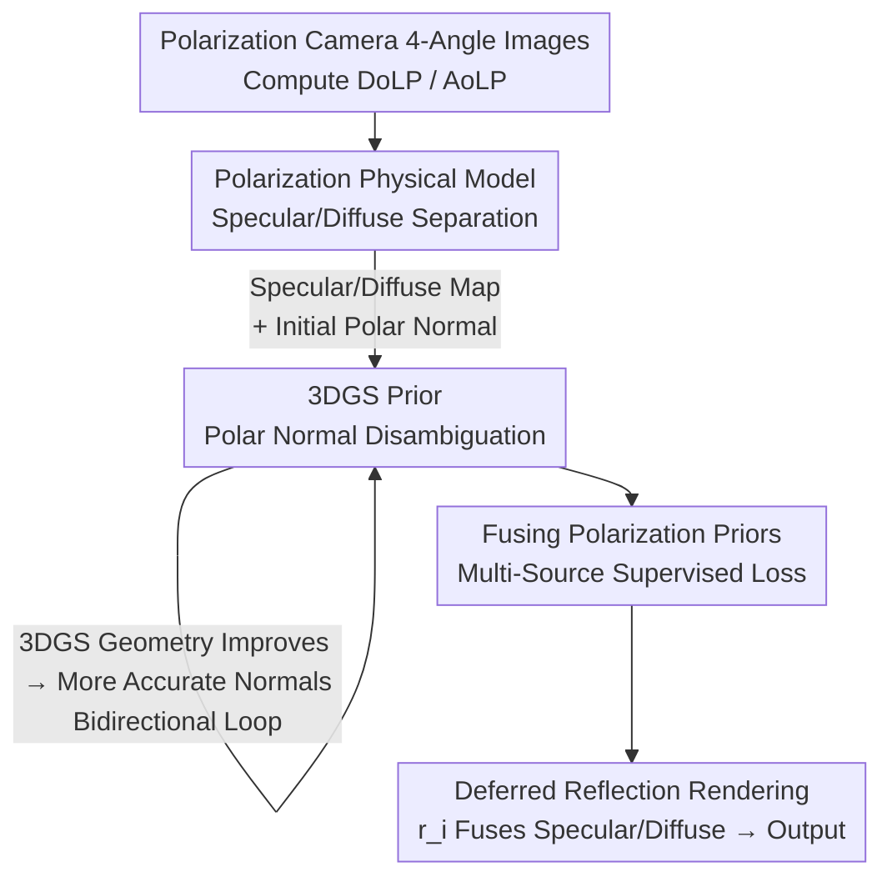

# PolarGuide-GSDR: 3D Gaussian Splatting Driven by Polarization Priors and Deferred Reflection for Real-World Reflective Scenes

**Conference**: CVPR 2026  
**Paper**: [CVF Open Access](https://openaccess.thecvf.com/content/CVPR2026/html/Shan_PolarGuide-GSDR_3D_Gaussian_Splatting_Driven_by_Polarization_Priors_and_Deferred_CVPR_2026_paper.html)  
**Code**: To be confirmed  
**Area**: 3D Vision  
**Keywords**: 3D Gaussian Splatting, polarization imaging, specular reflection reconstruction, deferred shading, normal estimation

## TL;DR
PolarGuide-GSDR embeds polarization physical priors into the deferred reflection optimization of 3D Gaussian Splatting (3DGS) for the first time. It first separates specular/diffuse reflection using a polarization physical model, then corrects the inherent orientation ambiguity of polarization normals using the geometric priors of 3DGS. Finally, it employs multi-source supervision—comprising the separated specular map, diffuse map, disambiguated normals, and RGB images—to guide Gaussian rendering. This achieves higher reconstruction quality, more accurate normals, and real-time frame rates simultaneously in complex real-world reflective scenes.

## Background & Motivation
**Background**: In multi-view 3D reconstruction, NeRF has introduced high-quality novel view synthesis using implicit radiance fields, while 3DGS explicitly models scenes using sparse 3D Gaussian primitives. 3DGS significantly accelerates training and achieves real-time novel view synthesis while maintaining high rendering quality, mitigating the bottlenecks of slow training and inefficient rendering in NeRF. However, neither method performs well on specular reflective scenes.

**Limitations of Prior Work**: Polarization-assisted NeRFs (e.g., PANDORA, NeRSP, GNeRP, NeISF) estimate normals and materials via inverse rendering. However, they generally rely on object masks, incur high training costs, and are only validated in ideal indoor environments, making them difficult to scale to large or complex real-world scenes. Meanwhile, although 3DGS models view-dependent colors using Spherical Harmonics (SH), the directional frequency of low-order SH is insufficient to represent the high-frequency details of specular highlights. Consequently, during training, the model tends to use "floaters" (fictional Gaussian primitives) to fit the highlights, which degrades the geometry, especially on non-planar surfaces. Even with improvements like 3DGS-DR (deferred shading) and Ref-GS (directional encoding), relying solely on RGB supervision remains hindered by the directional sensitivity of specular reflections and reflection-geometry entanglement.

**Key Challenge**: Specular reflections are highly entangled with geometry and illumination. Relying solely on RGB pixel supervision cannot decouple "what is reflection" from "what is the real surface structure," leading to geometry corrupted by highlights. Although polarization images naturally carry physical cues closely related to surface normals and material reflectance, utilizing them effectively remains difficult. Existing polarization schemes either resort to NeRF-based inverse rendering (which is costly and mask-dependent) or rely on purely static polarization geometry disambiguation (which has limited accuracy and suffers from error accumulation and propagation).

**Goal**: Inject polarization priors into 3DGS without relying on strong material/view assumptions or requiring masks, enabling real-time rendering while achieving high-fidelity geometry and reflection details in both specular and diffuse regions.

**Key Insight**: Polarization imaging can simultaneously capture intensity, color, and polarization direction. Based on this, the authors leverage "reflection separation" and "normal priors"—the two tasks polarization excels at most—as supervision signals. Meanwhile, they utilize the progressively improving geometry of 3DGS during convergence to back-correct the inherent orientation ambiguity of the polarization normals themselves, establishing a bidirectional, iterative prior feedback loop.

**Core Idea**: Separate specular and diffuse reflections using a polarization physical model to obtain initial normals, and then resolve the $\pi$ and $\pi/2$ ambiguities of the polarization normals using 3DGS geometric priors. This establishes a bidirectionally coupled, cyclic optimization loop of "Polarization $\leftrightarrow$ 3DGS", culminating in multi-source supervised deferred reflection rendering.

## Method

### Overall Architecture
PolarGuide-GSDR consists of three tightly coupled modules. The input consists of images captured by a polarization camera at four polarization angles $(0, \pi/4, \pi/2, 3\pi/4)$, and the output is a Gaussian scene capable of real-time rendering with more accurate geometry and appearance in reflective regions.

The pipeline operates as follows: first, the Degree of Linear Polarization (DoLP) and Angle of Linear Polarization (AoLP) are calculated from the four-channel polarization images. The first module employs a polarization physical model to separate the image-level specular reflection map $I_{sp}$ and diffuse reflection map $I_{dp}$, estimating the initial polarization normal $n_{pol}$ from the DoLP and AoLP. However, this initial normal suffers from inherent orientation ambiguities of $\pi$ and $\pi/2$. Thus, the second module constructs a candidate normal set using a coarse geometric prior from a pre-trained 3DGS, selects the most consistent orientation based on cosine similarity, and applies supervision only in polarization-reliable regions using a DoLP threshold. Crucially, as the 3DGS geometry improves during training, the disambiguation becomes increasingly accurate, which in turn feeds more accurate normals back to the 3DGS, forming a bidirectional loop. The third module, built upon the deferred reflection framework of 3DGS-DR, combines the "specular map + diffuse map + disambiguated normal + RGB" into a four-way joint loss to supervise Gaussian rendering. Finally, the specular and diffuse outputs are fused using each Gaussian's specular reflection intensity scalar $r_i$ to synthesize the final image. Note that polarization cues only serve as supervision during training; no polarization inputs are required during inference.

### Key Designs

**1. Specular and Diffuse Separation via Polarization Physical Model: Decoupling reflections at the image level using Stokes vectors to provide physically consistent supervision priors for 3DGS**

3DGS lacks illumination modeling and reflection separation mechanisms, making it unable to accurately reconstruct the spatial distribution of specular and diffuse reflections in real-world scenes. While polarization-assisted NeRFs rely on view-dependent queries for inverse rendering, 3DGS lacks an explicit view-dependent query mechanism. The authors bypass inverse rendering and directly perform separation at the image level using a polarization physical model. Surface reflected light is dominated by the polarizing BRDF and can be decomposed into polarized specular reflection, polarized diffuse reflection, and unpolarized diffuse reflection. The latter is largely negligible in real scenes, so only the specular component $S_{sp}$ and the diffuse component $S_{dp}$ are modeled (corresponding to Fresnel reflection and subsurface scattering, respectively). From the four polarization-angle images $I_{0^\circ}, I_{45^\circ}, I_{90^\circ}, I_{135^\circ}$, the Stokes vector components are calculated as $S_0 = 0.5\,(I_{0^\circ}+I_{45^\circ}+I_{90^\circ}+I_{135^\circ})$, $S_1 = I_{0^\circ}-I_{90^\circ}$, and $S_2 = I_{45^\circ}-I_{135^\circ}$, which yields the Degree of Linear Polarization (DoLP):

$$\text{DoLP} = \frac{\sqrt{S_1^2 + S_2^2}}{S_0}.$$

The specular reflection map is modulated by the polarization angle following $\cos(2\theta)$: $I_{sp}(\phi_{pol}) = \frac{I_{sp}^{\max}+I_{sp}^{\min}}{2} + \frac{I_{sp}^{\max}-I_{sp}^{\min}}{2}\cos(2\theta)$, while the diffuse reflection map differs in phase by $\pi/2$. For efficiency, the authors assume $S_d \approx S_i - S_{sp}$ as the initial value for separation, with approximation errors compensated for in the subsequent intensity map fusion stage. The value of this step is that it directly separates "where the reflection is" and "where the real surface color is" using physical quantities rather than letting 3DGS guess from RGB inputs. This fundamentally reduces the tendency to use floaters to fit highlights (the authors place mathematical derivation details in the supplementary material, ⚠️ refer to the original text for exactness).

**2. Polar Normal Disambiguation Based on 3DGS Priors: Using geometric priors + DoLP threshold filtering to construct a bidirectional loop between Polarization $\leftrightarrow$ 3DGS**

Polarization normals suffer from an inherent, unavoidable issue: the periodic relationship between AoLP and the normal's azimuthal angle leads to both $\pi$ and $\pi/2$ directional ambiguities. In addition, regions with low DoLP exhibit weak polarization characteristics, making normal estimation highly unreliable. Coupled with the fact that the specular component itself is not excluded, the normals calculated by Eq.(6) can also be corrupted by highlights. The authors address this in two ways: first, they obtain the azimuthal angle $\sigma = \frac{1}{2}\,\text{atan2}(S_2, S_1)$ using AoLP, and the angle of incidence $i$ using DoLP and refractive index, assembling the polarization normal $n_{pol} = (\sin i\cos\sigma,\ \sin i\sin\sigma,\ \cos i)$. Next, they construct a candidate set $C = \{n_{pol}, -n_{pol}, R_{\pi/2}(n_{pol}), -R_{\pi/2}(n_{pol})\}$ (where $R_{\pi/2}$ represents a $90^\circ$ rotation around the $z$-axis), and resolve ambiguities by selecting the candidate most consistent with the coarse geometric prior of 3DGS via cosine similarity. Second, they introduce a threshold $\tau$, applying polarization normal supervision only in highly reliable regions where DoLP $> \tau$, preventing low DoLP regions from degrading training.

The real ingenuity lies in the "bidirectional loop": relying solely on a static coarse geometric prior (e.g., from 3DGS at 3k iterations) to perform correction still leaves noticeable errors in regions like windshields. However, as training progresses, the 3DGS geometry becomes more accurate, and consequently, the disambiguation becomes more precise. These refined normals in turn supervise 3DGS. Even if the initial correction is incorrect, this loop progressively resolves the $\pi$ and $\pi/2$ ambiguities, avoiding the accumulated errors and propagation typical of static disambiguation. This transforms the relation between polarization and 3DGS from unidirectional prior feeding into mutual error correction.

**3. Multi-Source Supervised Loss Fusing Polarization Priors: Constraining specular, diffuse, and normal components via four loss terms on a deferred reflection framework**

The rendering pipeline is built on top of 3DGS-DR. Deferred shading decomposes rendering into two branches: the Gaussian splatting branch handles the base spatial distribution and coarse color, while the deferred reflection branch handles specular reflection effects. These two branches are fused into the final image using the specular reflection intensity scalar $r_i$ of each Gaussian. However, 3DGS-DR lacks physical prior constraints on specular, diffuse, and normal components, making it prone to generating artifacts (floaters) and unrealistic reflections when modeling reflection fields. The authors utilize the polarization priors obtained from Modules 1 and 2 to apply physically consistent supervision to all three factors, constructing four loss terms: the image reconstruction loss $L_{rgb}$ ($L_1$ + D-SSIM to supervise the fused final image against ground truth), the specular supervision loss $L_{refl}$ (aligning the rendered specular map with $I_{sp}$), the diffuse supervision loss $L_{base}$ (aligning the rendered diffuse map with $I_{dp}$), and the normal supervision loss $L_{normal}$.

The normal loss incorporates a DoLP mask and a candidate set: $L_{normal} = \frac{1}{N}\sum 1_{\text{DoLP}>\tau}\cdot \min_{c\in C}\,[1 - \cos(n_{pred}, c)]$, which supervises the cosine distance between the predicted normal and the closest candidate in $C$ only within high-DoLP regions. This circumvents ambiguity (by letting the network converge toward the nearest reasonable direction) while masking out unreliable areas. The total loss is formulated as $L_{total} = \eta_{rgb}L_{rgb} + \eta_{refl}L_{refl} + \eta_{base}L_{base} + \eta_{normal}L_{normal}$, where weights $\lambda$ and $\eta$ are tuned through experiments to balance rendering quality, specular/diffuse accuracy, and geometric consistency. Ablation studies show that specular map supervision suppresses normal errors caused by highlights, while normal supervision helps locate and reconstruct highlight structures, demonstrating strong complementarity between the two.

## Key Experimental Results

### Main Results
Evaluated on 5 real indoor/outdoor scenes, and compared with polarization-assisted NeRF (GNeRP) as well as Gaussian-based methods (3DGS, 3DGS-DR, Ref-GS) under identical data and training configurations. The table below lists the PSNR $\uparrow$ (bold scenes are from the authors' self-collected dataset, which features rich reflection contents):

| Scene | GNeRP | 3DGS | 3DGS-DR | Ref-GS | Ours |
|------|-------|------|---------|--------|------|
| Gnome (Indoor) | 17.65 | 19.37 | 21.13 | 21.65 | **22.54** |
| Gundam (Indoor) | 15.42 | 22.78 | 22.93 | 22.85 | **23.32** |
| Automotive&Glass (Outdoor) | 13.20 | 18.21 | 18.31 | 17.78 | **19.29** |
| Black ceramic cup (Indoor) | 15.77 | 25.18 | 25.57 | 26.48 | **26.67** |
| Stagnant water (Outdoor) | 17.55 | 22.65 | 23.00 | 23.01 | **23.51** |

Ours achieves the best PSNR across all 5 scenes: gaining about 1 dB on reflection-rich scenes (Gnome, Automotive & Glass, Black ceramic cup), and improving by about 0.5 dB on Gundam (sparse views/weak reflection) and Stagnant water (limited reflective areas). SSIM and LPIPS are also leading in most cases (e.g., Gnome achieves the best SSIM of 0.890 and LPIPS of 0.216). The authors emphasize that since the method specifically targets reflective regions, overall PSNR is not the sole metric—recovering reflection details is more critical.

In terms of rendering efficiency (FPS $\uparrow$), although Ours is slower than vanilla 3DGS (approx. 180–280 FPS) due to deferred reflection, it still maintains real-time performance:

| Scene | 3DGS-DR | Ref-GS | Ours |
|------|---------|--------|------|
| Gnome | 53.73 | 50.21 | 43.57 |
| Gundam | 71.69 | 24.48 | 64.86 |
| Automotive&Glass | 118.30 | 43.23 | 104.63 |
| Black ceramic cup | 108.83 | 36.70 | 81.52 |
| Stagnant water | 102.02 | 23.43 | 95.30 |

The frame rate of Ours is comparable to 3DGS-DR and generally significantly higher than Ref-GS, preserving real-time rendering capabilities.

### Ablation Study
Table 2 verifies the complementarity of "specular map supervision" and "polarization normal supervision" (PSNR $\uparrow$). `Ours only PolarNormal` retains only normal supervision, while `Ours w/o PolarNormal` removes normal supervision; both configurations implement only a single branch of supervision:

| Scene | 3DGS-DR (Baseline) | only PolarNormal | w/o PolarNormal | PolarGuide-GSDR |
|------|----------------|------------------|-----------------|-----------------|
| Gnome | 21.13 | 19.687 | 19.26 | **22.54** |
| Gundam | 22.93 | 22.97 | 22.93 | **23.32** |
| Automotive&Glass | 18.31 | 17.84 | 18.74 | **19.27** |
| Black ceramic cup | 25.57 | 24.98 | 25.20 | **26.67** |
| Stagnant water | 23.00 | 22.61 | 22.67 | **23.32** |

### Key Findings
- **Dual-Branch Supervision is Indispensable**: Performance drops when only a single branch of supervision is retained. For some scenes (e.g., the single-branch configurations on Gnome and Automotive&Glass), the performance even falls below the 3DGS-DR baseline which does not use polarization information. Fully joint supervision of both the specular map and normals is required to achieve optimal results across all scenes, proving their strong complementarity.
- **Gain is Positively Correlated with Reflection Richness**: Scenes with abundant reflective elements (Automotive&Glass, Black ceramic cup) show the largest gains (~1 dB). For Gnome (sparse views, low light, fewer reflections), the PSNR improvement primarily stems from decreased artifacts. Gundam and Stagnant water, which have limited reflective areas, exhibit moderate gains of ~0.5 dB.
- **Clarity and Quality of Normals**: 3DGS-DR lacks explicit normal supervision, resulting in high surface noise and cluttered structures. Ref-GS performs reasonably well but lacks sufficient smoothness. By combining polarization normal priors, specular supervision, and a DoLP mask, Ours achieves significantly smoother and more accurate normals.
- ⚠️ Minor numerical discrepancies exist between the full model PSNR in the ablation table (Table 2) (19.27 for Automotive&Glass, 23.32 for Stagnant water) and the main table (Table 1) (19.29, 23.51); refer to the original paper for definitive values.

## Highlights & Insights
- **First Integration of Polarization Priors into 3DGS Optimization**: While polarization was previously used primarily in NeRF, this is the first work to apply polarization for reflection separation + normal supervision in 3DGS deferred reflection, striking a balance between interpretability and real-time performance.
- **"Bidirectional Loop" Bypasses the Chicken-and-Egg Disambiguation Dilemma**: Polarization normals require good geometry for disambiguation, whereas good geometry requires accurate normal supervision. The authors let both cooperate by mutually correcting errors and progressively converging during training. This bypasses the typical error accumulation of static disambiguation. This paradigm is transferable to any scenario where "priors are ambiguous but downstream optimization can back-propagate corrections."
- **Image-Level Physical Separation as Supervision Instead of Inverse Rendering**: Bypassing NeRF's expensive inverse rendering and avoiding the need for masks, the pipeline directly employs the Stokes physical model to split specular/diffuse reflections at the image level. This makes the engineering lighter and easier to scale to large, real-world scenes.
- **Construction of the First Full-Scene Multi-View Polarization Dataset**: Addressing the sparsity of views and limited reflection details in existing polarization datasets, the authors collected a multi-view polarization dataset covering complex indoor and outdoor scenarios (strong specular car glass, black ceramic cups, outdoor puddles), which serves as a valuable asset for the community.

## Limitations & Future Work
- **Assumption of a Constant Refractive Index**: Assuming a constant refractive index of 1.5 for non-conductive materials may introduce inaccuracies for broader material types, though the authors state that multi-source constraints enable reasonable generalization to conductive materials (e.g., car surfaces).
- **Dependency on Polarization Camera Collection**: Training requires polarization images from four angles. Although inference is polarization-free and polarizing cameras are becoming more accessible, it still poses an acquisition overhead compared to purely RGB-based approaches.
- **Limited Gain in Weakly Reflective/Sparse-View Scenes**: In environments with weak reflections or sparse views (e.g., Gnome, Gundam, Stagnant water), PSNR gains are limited to around 0.5 dB. The method's strength is highly specialized for reflection-rich scenes.
- **Dependence on Pre-trained 3DGS Geometry as a Starting Prior**: The disambiguation loop starts with a coarse geometry (e.g., 3k iteration 3DGS). If the initial geometry fails drastically over large regions (e.g., due to poor COLMAP initialization), whether the loop can successfully recover remains to be further investigated.

## Related Work & Insights
- **vs. Polarization + NeRF (PANDORA / NeRSP / GNeRP / NeISF)**: These methods rely on neural inverse rendering to estimate normals and materials, requiring masks, suffering from slow training, and mostly validating on ideal indoor scenes. In contrast, Ours leverages the explicit representation of 3DGS + image-level physical separation, requiring no masks, maintaining real-time frame rates, and operating on real-world complex scenes.
- **vs. 3DGS-DR**: Ours utilizes 3DGS-DR's deferred reflection framework as a baseline. However, 3DGS-DR relies solely on RGB supervision without physical priors, which easily yields floaters and unrealistic reflections when modeling reflection fields. Ours introduces three-way polarization supervision (specular, diffuse, and normal), achieving more accurate reflection separation and geometry.
- **vs. Ref-GS**: Ref-GS incorporates directional encoding and illumination decomposition based on 3DGS-DR to enhance reflections, but still relies strictly on RGB supervision and exhibits a severely degraded frame rate. Ours implements physical polarization priors for supervision, yielding higher quality while significantly outperforming Ref-GS in rendering speed.
- **vs. Pure Polarization Static Disambiguation Schemes**: Purely static polarization-based geometric disambiguations offer limited accuracy where errors propagate and accumulate. Ours dynamically and cyclically clarifies the polarization normal ambiguity using 3DGS geometry, fundamentally alleviating accumulated errors.

## Rating
- Novelty: ⭐⭐⭐⭐⭐ First to embed polarization priors into 3DGS deferred reflection, introducing a novel perspective with the bidirectional Polarization $\leftrightarrow$ 3DGS cyclic disambiguation design.
- Experimental Thoroughness: ⭐⭐⭐⭐ Dynamic validations on 5 real scenes + robust ablation studies; however, the evaluation relies primarily on PSNR/SSIM/LPIPS, and some implementation details as well as algebraic derivations are deferred to the supplementary material.
- Writing Quality: ⭐⭐⭐⭐ Clear motivation and logical construction of the three modules, alongside complete formulations; there are minor numerical discrepancies in some tables.
- Value: ⭐⭐⭐⭐ Real-time + high-fidelity reflection reconstruction is highly practical for real-world scenarios, and the work contributes the first full-scene multi-view polarization dataset.

<!-- RELATED:START -->

## Related Papers

- [\[CVPR 2026\] ICTPolarReal: A Polarized Reflection and Material Dataset of Real World Objects](ictpolarreal_a_polarized_reflection_and_material_dataset_of_real_world_objects.md)
- [\[CVPR 2026\] RT-Splatting: Joint Reflection-Transmission Modeling with Gaussian Splatting](rt-splatting_joint_reflection-transmission_modeling_with_gaussian_splatting.md)
- [\[CVPR 2026\] SketchFaceGS: Real-Time Sketch-Driven Face Editing and Generation with Gaussian Splatting](sketchfacegs_real-time_sketch-driven_face_editing_and_generation_with_gaussian_s.md)
- [\[CVPR 2026\] AnchorSplat: Feed-Forward 3D Gaussian Splatting with 3D Geometric Priors](anchorsplat_feed-forward_3d_gaussian_splatting_with_3d_geometric_priors.md)
- [\[CVPR 2026\] Iris: Bringing Real-World Priors into Diffusion Model for Monocular Depth Estimation](iris_bringing_realworld_priors_into_diffusion_model_for_monocular_depth_estimation.md)

<!-- RELATED:END -->
