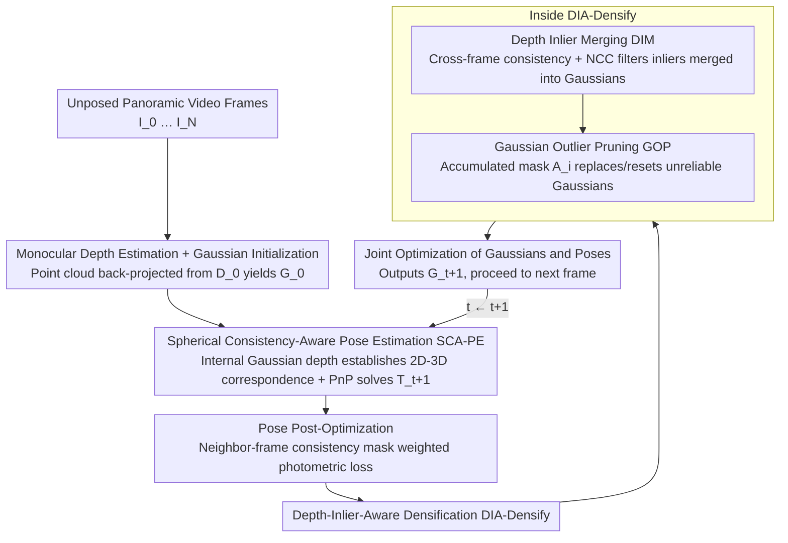

# Pose-Free Omnidirectional Gaussian Splatting for 360-Degree Videos with Consistent Depth Priors

**Conference**: CVPR 2026  
**Paper**: [CVF Open Access](https://openaccess.thecvf.com/content/CVPR2026/html/Zhuang_Pose-Free_Omnidirectional_Gaussian_Splatting_for_360-Degree_Videos_with_Consistent_Depth_CVPR_2026_paper.html)  
**Code**: https://github.com/zcq15/PFGS360  
**Area**: 3D Vision  
**Keywords**: Omnidirectional 3DGS, Pose-Free Reconstruction, Spherical Consistency, Monocular Depth Prior, Novel View Synthesis  

## TL;DR
PFGS360 proposes a pose-free omnidirectional 3D Gaussian Splatting framework **without SfM pose priors**: it directly establishes 2D–3D correspondences between the reconstructed Gaussians and unposed panoramic frames using a "spherical consistency-aware pose estimator," robustly recovers camera poses via PnP, and then fuses multi-frame consistent monocular depth inliers and prunes outlier Gaussians via "depth-inlier-aware densification." This achieves novel view synthesis and pose estimation performance on OB3D / Ricoh360 that significantly outperforms existing pose-free and even pose-aware methods (+4.42 dB PSNR gain in NVS, with pose error reduced by an order of magnitude).

## Background & Motivation

**Background**: Utilizing panoramas for omnidirectional 3D Gaussian Splatting is a key technology for VR walkthroughs and indoor visualization. However, existing omnidirectional 3DGS methods (such as ODGS, OmniGS, etc.) almost always require running a slow and unstable SfM pipeline beforehand to obtain camera poses and sparse seed points.

**Limitations of Prior Work**: In the perspective view domain, mature pose-free 3DGS methods (which bypass SfM and optimize camera poses via rendering gradient backpropagation) already exist, but **directly applying them to panoramas leads to failure**. This is due to two reasons: first, the spherical projection of panoramas causes the Jacobian of 3DGS to heavily amplify Gaussian errors near the poles, making the pose gradients unstable; second, the spherical affine approximation used in omnidirectional 3DGS leads to inconsistent projection errors across different regions, further corrupting pose gradients, especially across frames with large viewpoint variations. Consequently, both camera poses and rendering quality degrade.

**Key Challenge**: The success of perspective-view pose-free methods relies on two pillars: ① using photometric loss to backpropagate gradients for pose optimization, and ② relying on monocular depth or 3D vision foundation models (VFMs) to provide dense geometric priors as seed points. However, both pillars crumble in the panoramic domain: unstable gradients from spherical rasterization render ① ineffective; and VFMs, trained for perspective views, fail to provide reliable 2D–3D correspondences for panoramas, rendering ② ineffective. Furthermore, monocular depth estimation (MDE) is inherently inconsistent and inaccurate across multiple frames, which leaves a proliferation of outliers when directly fed into Gaussians.

**Goal**: Split the problem into two sub-problems: (a) achieving stable and accurate pose estimation on panoramas while **bypassing unstable rasterization gradients**; (b) extracting reliable geometric information to perform high-fidelity densification under the premise that multi-frame depth priors are **inconsistent**.

**Key Insight**: Instead of optimizing poses via spherical rasterization gradients, the authors return to the classic **PnP (Perspective-n-Point) pose solver**, which does not rely on rendering gradients and is inherently more stable. Concurrently, instead of utilizing any external VFMs, it directly leverages the **internal depth prior from the already reconstructed Gaussians** to establish 2D–3D correspondences with new frames. The depth prior inconsistency problem is then filtered out using cross-frame spherical reprojection consistency.

**Core Idea**: Replace "spherical rasterization gradient backpropagation" with "reconstructed Gaussians' internal depth + spherical reprojection consistency mask + PnP solver" to recover camera poses, and replace "indiscriminatingly inserting monocular depth" with "depth inliers filtered by cross-frame consistency + NCC similarity" to perform densification, thereby achieving high-fidelity omnidirectional reconstruction without SfM.

## Method

### Overall Architecture
Given an unposed panoramic video sequence $I_0, I_1, \dots, I_N$, PFGS360 is a **frame-by-frame incremental** reconstruction pipeline: it first estimates the depth map $D_0$ of the first frame $I_0$ using a monocular depth model, and back-projects it to a 3D point cloud to initialize the omnidirectional Gaussians $G_0$. Subsequently, for each new frame $I_{t+1}$, two steps are executed sequentially: first, its camera pose $T_{t+1}$ is estimated using **Spherical Consistency-Aware Pose Estimation (SCA-PE)**; then, the current Gaussians $G_t$ are densified using **Depth-Inlier-Aware Densification (DIA-Densify)**. Finally, joint optimization of the Gaussians $G_t$ and all visited camera poses is performed, and the optimized Gaussians are treated as $G_{t+1}$ for the next frame's loop. The two modules are executed sequentially, linked by a shared "spherical reprojection consistency" mechanism: the pose module uses the consistency mask to filter corresponding points, while the densification module uses it to filter depth inliers.

### Key Designs

**1. Spherical Consistency-Aware Pose Solver: Establishing 2D–3D Correspondences via Gaussians' Own Depth, Bypassing Unstable Rendering Gradients**

To address the limitation where spherical rasterization gradients amplify errors at the poles and are unstable under large viewpoint variations, the authors no longer backpropagate gradients to optimize camera poses but instead return to the PnP solver. To perform PnP, 2D–3D correspondences are required. The authors source these from the **internal depth of the already reconstructed Gaussians $G_t$**: rendering a depth map $D^k_r$ for each visited view $I_k$ provides a scale-consistent geometric prior across frames. However, as 3DGS is optimized via photometric loss, it often overfits appearance and introduces local geometric errors. Therefore, untrustworthy depths must be filtered out first.

The filtering method is **spherical reprojection consistency**: a pixel $m_i$ in the source image $I_{src}$ is projected using its pose and depth to the reference image $I_{ref}$ as $m_j$, and then projected back to the source image as $m_i'$. Meanwhile, the spherical tangential angle error and depth error are checked to ensure they are within thresholds:

$$C_{src,ref}(\mathbf{x}) = \mathcal{I}\big(\mathcal{L}_{tan}(\mathbf{m}_i,\mathbf{m}'_i) \le \epsilon_{tan}\big) \cap \mathcal{I}\big(\text{abs}(\|\mathbf{x}_i\|-\|\mathbf{x}'_i\|)/\|\mathbf{x}_i\| \le \epsilon_{dep}\big)$$

where $\mathcal{I}(\cdot)$ is the indicator function, $\epsilon_{tan}=0.008$, and $\epsilon_{dep}=0.05$. For each visited frame $I_k$, the cross-frame consistency map is computed as $M^k_{con}=C_{k,t}\times C_{k,k-1}$, capturing both local consistency of adjacent frames and global consistency of multiple frames. Next, **SIFT** (which is more robust than deep networks for panoramic matching) is used to extract feature correspondences between visited frames and the new frame $I_{t+1}$, which, combined with the rendered depth, yields a set of 2D–3D correspondences $(\mathbf{x}_k, \mathbf{m}_{t+1})$. Finally, the pose $T_{t+1}$ is computed by minimizing the **spherical consistency-weighted reprojection error**:

$$T = \arg\min \sum \lambda\, \mathcal{L}_{tan}(\mathbf{x}_k,\mathbf{m}_{t+1}),\quad \lambda = \sin(\mathbf{m}'_k)\sin(\mathbf{m}_{t+1}) M^k_{con}(\mathbf{x}_k)$$

The tangential angle error is defined as $\mathcal{L}_{tan}(\mathbf{x}_k,\mathbf{m}_{t+1}) = 2\sqrt{\frac{1-\mathbf{m}'_k\mathbf{m}_{t+1}}{1+\mathbf{m}'_k\mathbf{m}_{t+1}}}$. The $\sin$ terms in the coefficient $\lambda$ perform spherical balancing (compensating for non-uniform sampling between the poles and the equator), while $M^k_{con}$ downweights correspondences with low consistency. This preserves the rendering-gradient-independent stability of PnP while explicitly suppressing the pollution of poses by Gaussian geometric errors—this is the key to its robustness under large viewpoint changes.

**2. Pose Post-Optimization: Weighting Photometric Loss via Neighbor-Frame Consistency Mask to Prevent Noise from Misleading Poses**

PnP provides a coarse pose, which still needs refinement. The authors found that optimizing camera poses solely via photometric loss while fixing Gaussian parameters yields poor results: inaccurate geometry of reconstructed Gaussians combined with unobserved missing regions in new frames injects noise into the photometric loss, misleading the pose optimization. The fix is to introduce a **neighbor-frame consistency mask** $M^k_{adj}=C_{k,k-1}\times C_{k,k+1}$ as a loss weight, ensuring only reliable regions consistent across preceding and succeeding frames participate in the optimization:

$$\mathcal{L}_{photo} = (1-\lambda_{dssim}) M_{adj}\,\mathcal{L}_{l1}(I',I) + \lambda_{dssim} M_{adj}\,\mathcal{L}_{dssim}(I',I)$$

where $\lambda_{dssim}=0.2$. The mask filters out unreliable regions (geometric errors, missing observations) from the loss, making pose refinement more robust.

**3. Depth Inlier Merging (DIM): Dual Filtering with Cross-Frame Consistency + NCC, Merging Only Credible Monocular Depth into Gaussians**

The limitation of densification is that monocular depth (MDE) is inconsistent across multiple frames and often flattens details into overly smooth surfaces. DIM uses three filters to select "depth inliers": first, it computes consistent/inconsistent regions $M^k_{con}$ and $M^k_{inc}$ on the rendered depth $D^k_r$. Second, using the consistency mask, it aligns the monocular depth $D^k_m$ to the scale of the current 3DGS—via linear alignment $D^k_a=\lambda_s D^k_m+\lambda_t$, where parameters are fitted as $\lambda_s,\lambda_t=\arg\min\sum M^k_{con}\cdot(\lambda_s D^k_m+\lambda_t-D^k_r)^2$, yielding region $M^k_{con,a}$ satisfying adjacent-frame consistency. However, geometric consistency alone is insufficient (erroneous depth that is overly smooth can be "consistently wrong" across frames). Therefore, borrowing from patch-based MVS, a third filter using **normalized cross-correlation (NCC) similarity** is introduced:

$$M^k_{ncc} = \mathcal{I}\big(\mathcal{F}(I_k,\mathcal{W}(I_{k-1},D^k_a)) > \mathcal{F}(I_k,\mathcal{W}(I_{k-1},D^k_r))\big)$$

where $\mathcal{W}(I_{ref},D_{src})$ warps the reference image to the source viewpoint using depth, and $\mathcal{F}$ is the NCC function. This means the aligned monocular depth is deemed more credible only if the warped image using the aligned monocular depth fits the ground-truth image better than that using the rendered depth. Finally, the inlier region $M^k_{inlier}=M^k_{inc}\cap M^k_{con,a}\cap M^k_{ncc}$ merges all credible 3D points from visited frames into the Gaussians, specifically filling in regions where "rendered depth is inconsistent ($M^k_{inc}$) but monocular depth is credible"—i.e., where Gaussians are missing or incorrect.

**4. Gaussian Outlier Pruning (GOP): Deleting Gaussians Replaced by Depth Inliers, and Resetting Opacity for Remaining Outliers**

While DIM adds correct points, outlier Gaussians still remain in the original set. GOP uses an accumulated mask to quantify how much each Gaussian "deserves to be replaced":

$$A_i = \frac{\sum_{j\in \mathcal{I}^{max}_i} \omega_{i,j} M_j}{\sum_{j\in \mathcal{I}^{max}_i} \omega_{i,j}}$$

where $M_j$ takes the value of $M^k_{con}$ or $M^k_{inc}$ (or the inlier mask) at pixel $j$, and $\mathcal{I}^{max}_i$ is the set of pixel indices where the $i$-th Gaussian has the highest rendering weight $\omega$ across all visited images. The rules are straightforward: Gaussians with $A^{inlier}_i>0.8$ have been successfully replaced by depth inliers and are pruned directly; outliers satisfying $A^{inlier}_i\le 0.8 \cap A^{inc}_i>0.8$ have their opacity reset to their initial value (giving them another chance to be optimized rather than crudely deleted). DIM is responsible for "adding correct ones" and GOP is responsible for "deleting incorrect ones"; their synergy keeps the densification clean—evidenced by the +1.11 dB PSNR gain from GOP in the ablation study.

### Loss & Training
Pose post-optimization utilizes photometric loss weighted by the consistency mask (L1 + DSSIM, with $\lambda_{dssim}=0.2$). At the end of each frame, joint optimization of Gaussian parameters and all visited camera poses is performed. The implementation is based on PyTorch + Nerfstudio, with the omnidirectional 3DGS rasterization modified from gsplat. UniK3D is selected as the default monocular depth model (as it outputs absolute depth with the best adjacent-frame consistency). All experiments were completed on a single RTX 4090 GPU.

## Key Experimental Results

### Main Results
Datasets: OB3D (synthetic, including indoor/outdoor, Egocentric/NonEgocentric trajectories, with GT poses) and Ricoh360 (real-world captures, featuring distortion, motion blur, overexposure, and dynamic human occlusions). Baselines include pose-free methods (CF-3DGS, HT-3DGS, 3R-GS) and pose-aware methods (ODGS, OmniGS).

OB3D Novel View Synthesis (PSNR, higher is better):

| Subset | Metric | CF-3DGS | HT-3DGS | 3R-GS | ODGS (pose-aware) | OmniGS (pose-aware) | Ours |
|------|------|---------|---------|-------|------|--------|------|
| Egocentric-mean | PSNR | 25.14 | 25.39 | 31.15 | 27.76 | 31.35 | **35.77** |
| Egocentric-mean | LPIPS | 0.253 | 0.242 | 0.086 | 0.204 | 0.137 | **0.057** |
| NonEgo-mean | PSNR | 22.31 | 22.56 | 23.39 | 25.79 | 26.75 | **30.81** |
| NonEgo-mean | LPIPS | 0.330 | 0.314 | 0.238 | 0.249 | 0.253 | **0.113** |

Ours outperforms the runner-up by 4.42 dB on Egocentric and 4.06 dB on NonEgocentric, **even exceeding pose-aware methods that use GT pose priors**.

OB3D Pose Estimation ($RPE_t$, lower is better):

| Subset | CF-3DGS | HT-3DGS | 3R-GS | Ours |
|------|---------|---------|-------|------|
| Egocentric-all | 3.181 | 3.375 | 0.380 | **0.018** |
| NonEgo-all | 1.813 | 2.199 | 1.303 | **0.040** |

The pose error is reduced by an order of magnitude compared to the runner-up. 3R-GS, relying on MASt3R-SfM, performs respectably on short-motion Egocentric videos but fails almost entirely on outdoor NonEgocentric scenes with large motion (where reliable matches are scarce), while ours remains robust across all trajectories.

Ricoh360 real-world NVS: Ours achieves 28.05 dB PSNR, outperforming the runner-up ODGS (26.27 dB) by 1.78 dB, with SSIM (0.867) and LPIPS (0.134) also being the best.

### Ablation Study
On the OB3D NonEgocentric subset, components are progressively added to the baseline modified from CF-3DGS:

| Configuration | PSNR | $RPE_t$ | Description |
|------|------|-------|------|
| B (baseline) | 20.17 | 3.684 | Global Gaussians + Joint Optimization |
| B+PnP | 27.50 | 0.229 | Naive PnP Poses |
| B+SCA-PE | 28.99 | 0.077 | Replaced with Spherical Consistency-Aware Solver |
| B+SCA-PE+DIM | 29.70 | 0.057 | Added Depth Inlier Merging |
| B+SCA-PE+DIM+GOP | 30.81 | 0.040 | Full Model (with Gaussian Outlier Pruning added) |

Depth Model Ablation:

| Depth Model | PSNR | $RPE_t$ | Description |
|----------|------|-------|------|
| DepthAnywhere | 29.22 | 0.389 | Affine-invariant loss, scale consistency across frames is hard to guarantee |
| DA2 | 30.61 | 0.441 | Scale-invariant loss, cross-frame inconsistency persists |
| UniK3D | **30.81** | **0.040** | Absolute depth, best neighbor-frame consistency |

### Key Findings
- **SCA-PE outperforms naive PnP by a large margin**: Going from B+PnP to B+SCA-PE, the $RPE_t$ falls from 0.229 to 0.077 (a ~66% reduction), and PSNR increases by 1.49 dB. This demonstrates that spherical consistency weighting is crucial for filtering out Gaussian geometric errors, and it is not a matter of "just switching to any PnP solver."
- **DIM (adding points) and GOP (deleting points) are both indispensable**: Adding DIM improves PSNR by +0.71 dB but leaves outliers that cause distortion in scenes like classroom or lone-monk; further incorporating GOP increases PSNR by another +1.11 dB and completely eliminates artifacts.
- **The "neighbor-frame consistency" of the depth model dictates system performance**: UniK3D (which outputs absolute depth) yields a pose $RPE_t$ (0.040) that is far superior to affine-invariant/scale-invariant DepthAnywhere (0.389) and DA2 (0.441). This indicates that even with the scale alignment of DIM, cross-frame inconsistencies in the source depth will drag down pose accuracy.

## Highlights & Insights
- **"Bypassing gradients" over "fixing gradients"**: Faced with unstable spherical rasterization gradients, the authors did not force a mathematical fix on the Jacobian. Instead, they reverted to the classic PnP with consistency weighting, leveraging an engineering-wise more stable path to solve the problem—this "track-changing" mindset is highly reusable for other gradient-ill-conditioned tasks.
- **Multi-purpose consistency mask**: A single spherical reprojection consistency mechanism $M_{con}$ serves three purposes: filtering 2D–3D correspondences for the pose solver, weighting the photometric loss, and filtering depth inliers for densification. This design is highly elegant and computationally efficient.
- **NCC as a "finishing blow" for geometric consistency**: Recognizing that "cross-frame geometric consistency" can be deceived by "consistently incorrect, overly smooth depth," the authors added an image-level NCC similarity filter. This classic patch-MVS trick is cleverly adapted for 3DGS densification.
- **Pose-free but outperforming pose-aware**: Bypassing SfM yet outperforming ODGS/OmniGS (which use GT poses) demonstrates that a "self-consistent internal geometric prior" can sometimes be more reliable than an "external but mismatched prior."

## Limitations & Future Work
- **Heavy reliance on frame-by-frame incremental fusion and video continuity**: The framework is a frame-by-frame sequential pipeline requiring sufficient overlap between adjacent frames to compute consistency masks and SIFT matches. For sparsely captured views, large inter-frame jumps, or non-video panoramic image collections, cross-frame consistency fails.
- **Pose accuracy is highly sensitive to neighbor-frame consistency of monocular depth**: The ablation shows that using affine/scale-invariant depth models degrades $RPE_t$ nearly tenfold, illustrating that the system's robustness is partially outsourced to the scale consistency of the MDE model. Caution is needed when choosing depth models for new domains.
- **Heuristic thresholding**: Thresholds like $\epsilon_{tan}=0.008$, $\epsilon_{dep}=0.05$, and the pruning threshold of 0.8 are fixed hyperparameters. The paper lacks a sensitivity analysis, leaving their robustness across different scenes or resolutions questionable.
- **Future directions**: Potential improvements include making consistency masks learnable/adaptive or integrating global bundle adjustment (BA) to alleviate frame-by-frame drift, allowing the method to handle non-continuous panoramic inputs.

## Related Work & Insights
- **vs CF-3DGS / HT-3DGS**: These methods estimate camera poses via adjacent-frame monocular Gaussian rendering alignment. Errors accumulate over sequences, and under spherical projection, small depth errors are amplified into huge distortions, severely hindering photometric pose optimization. In contrast, ours avoids error accumulation and gradient instability via PnP + consistency masks, reducing pose error by an order of magnitude.
- **vs 3R-GS**: 3R-GS reprojects panoramas into multiple overlapping perspective patches and retrieves poses and sparse points using MASt3R-SfM. While competitive on short-motion Egocentric videos, it fails on outdoor NonEgocentric scenes with large motion and sparse reliable matches. Ours directly establishes correspondences in the panoramic domain using the Gaussians' internal depth, remaining stable across all trajectories.
- **vs Perspective Pose-Free + VFM Methods (e.g., MASt3R-based)**: These rely on 3D VFMs trained on perspective views to provide 2D–3D correspondences. However, VFMs cannot provide stable matches on panoramas, and high-resolution panoramic inference is slow. Ours utilizes no external VFMs, achieving self-sufficiency.
- **vs ODGS / OmniGS (pose-aware)**: These methods require SfM or ground-truth pose priors. Ours requires no poses but still outperforms them in NVS, demonstrating that frame-by-frame fusion of depth inliers provides richer seed points than sparse SfM initialization.

## Rating
- Novelty: ⭐⭐⭐⭐⭐ First pose-free omnidirectional 3DGS pipeline. The combination of "correspondences from Gaussian internal depth + spherical consistency-weighted PnP" is highly ingenious.
- Experimental Thoroughness: ⭐⭐⭐⭐ Solid inclusion of synthetic and real-world datasets, NVS and pose estimation tasks, and model/depth-model ablations. However, it lacks a hyperparameter sensitivity analysis and runtime/speed comparisons.
- Writing Quality: ⭐⭐⭐⭐ Motivations are logically structured, and the pipeline diagram is clear. Some equations suffered minor damage during PDF extraction and required cross-checking with the original text.
- Value: ⭐⭐⭐⭐⭐ Directly addresses the critical pain point of removing SfM from panoramic VR reconstruction, substantially outperforming prior arts and even pose-aware baselines. Code is open-sourced.

<!-- RELATED:START -->

## Related Papers

- [\[CVPR 2026\] E2EGS: Event-to-Edge Gaussian Splatting for Pose-Free 3D Reconstruction](e2egs_event-to-edge_gaussian_splatting_for_pose-free_3d_reconstruction.md)
- [\[CVPR 2026\] VGGT-360: Geometry-Consistent Zero-Shot Panoramic Depth Estimation](vggt-360_geometry-consistent_zero-shot_panoramic_depth_estimation.md)
- [\[CVPR 2026\] AeroGS: Scale-Aware Gaussian Splatting for Pose-Free Dynamic UAV Scene Reconstruction](aerogs_scale-aware_gaussian_splatting_for_pose-free_dynamic_uav_scene_reconstruc.md)
- [\[CVPR 2026\] ODGS-SLAM: Omnidirectional Gaussian Splatting SLAM](odgs-slam_omnidirectional_gaussian_splatting_slam.md)
- [\[CVPR 2025\] SelfSplat: Pose-Free and 3D Prior-Free Generalizable 3D Gaussian Splatting](../../CVPR2025/3d_vision/selfsplat_pose-free_and_3d_prior-free_generalizable_3d_gaussian_splatting.md)

<!-- RELATED:END -->
