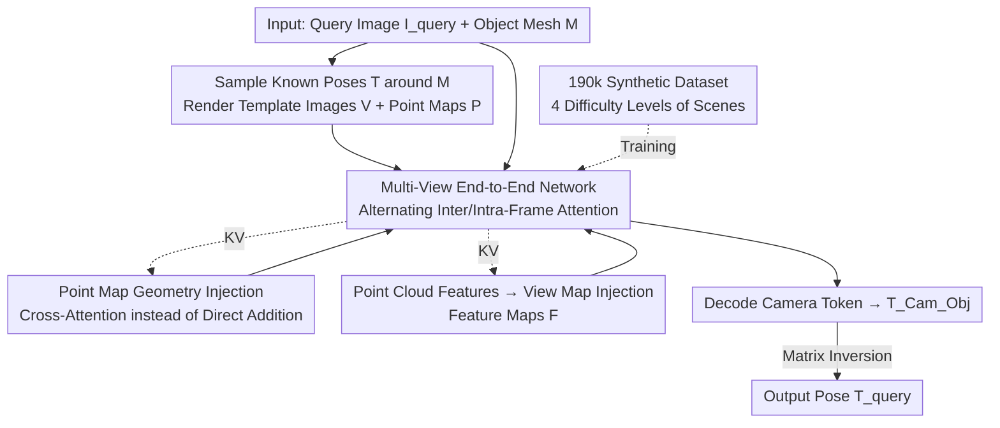

# PoseGAM: Robust Unseen Object Pose Estimation via Geometry-Aware Multi-View Reasoning

**Conference**: CVPR 2026  
**Paper**: [CVF Open Access](https://openaccess.thecvf.com/content/CVPR2026/html/Chen_PoseGAM_Robust_Unseen_Object_Pose_Estimation_via_Geometry-Aware_Multi-View_Reasoning_CVPR_2026_paper.html)  
**Code**: https://windvchen.github.io/PoseGAM (Project Page)  
**Area**: 3D Vision  
**Keywords**: 6D pose estimation, unseen objects, multi-view foundation models, geometry injection, synthetic dataset

## TL;DR
PoseGAM adapts multi-view geometry foundation models like VGGT for 6D object pose estimation, allowing the network to directly perform end-to-end pose regression by processing a "query image + a set of template rendered images with known poses". This completely discards the explicit feature matching of traditional match-then-localize pipelines. Through cross-attention, it injects the object's point maps and point cloud geometry features in the form of "view maps", achieving an average AR improvement of 5.1% across 5 BOP datasets (+17.6% on TUD-L).

## Background & Motivation
**Background**: 6D object pose estimation aims to predict the rotation and translation of an object relative to the camera. For unseen objects, the mainstream approach is match-then-localize or match-then-refine: first explicitly establishing feature correspondences between the query image and the object's 3D model/a set of template images with known poses, and then solving for the pose using geometric solvers like PnP or least squares.

**Limitations of Prior Work**: The accuracy of the entire pipeline is severely bottlenecked by the "matching" step—once the feature matching is unreliable (due to weak texture, occlusion, or large appearance discrepancies), even the best subsequent geometric solver cannot salvage it, and the pose estimation fails. Essentially, the matching quality defines the performance ceiling of the system.

**Key Challenge**: Explicit matching is both the core and the weak spot of these methods. It heavily relies on the assumption of "appearance consistency between the query and the reference." However, a natural domain gap (differences in lighting, materials, and reflections) exists between CAD model renderings and real-world photographs, where matching is highly prone to failure.

**Goal**: Is it possible to bypass explicit matching altogether and use an end-to-end network to directly reason the pose from images while minimizing dependence on camera imaging priors?

**Key Insight**: The authors notice that multi-view geometry foundation models like DUSt3R, VGGT, and π³ can already reason 3D geometry and camera poses directly from multiple RGB images without relying on traditional Structure-from-Motion (SfM). Pose estimation is fundamentally a form of "camera-object relative geometry" reasoning. If the query image and the multi-view template images of the object are fed into such an architecture, the network should be able to directly reason the object pose while leveraging their large-scale pre-trained weights.

**Core Idea**: Replace "explicit feature matching + geometric solvers" with a "multi-view foundation model + explicit geometry injection"—injecting the object's point maps and point cloud features into the network as view maps via cross-attention, paired with a synthetic dataset containing 190,000 objects to resolve the domain gap.

## Method

### Overall Architecture
Given an object mesh $\mathcal{M}$ and a query image $I_{\text{query}}$ containing the object, the goal is to estimate the transform $T_{\text{query}}$ from the object to the camera. The workflow is as follows: first, sample a set of known camera poses $\mathcal{T}$ around $\mathcal{M}$ to render multi-view RGB template images $\mathcal{V}$ and corresponding point maps $\mathcal{P}$. The query image (with the foreground segmented) and the template images are encoded into image tokens, and each image is paired with a camera token—the camera tokens of the template images are calculated from known intrinsic and extrinsic parameters, whereas the camera token of the query image is a learnable embedding (as it is the unknown target to be solved). Meanwhile, a geometry feature extractor encodes the object into a global representation, which is then distributed to each view to form view-specific feature maps $\mathcal{F}$. The point maps $\mathcal{P}$ and feature maps $\mathcal{F}$ are used as key-value pairs to be injected into the backbone via cross-attention. The network backbone alternates between inter-frame and intra-frame self-attention (inheriting from VGGT). Finally, the camera token of the query image is decoded into the camera-to-object transform $T^{\text{Cam}}_{\text{Obj}}$, and matrix inversion yields the final $T_{\text{query}}$.

### Key Designs

**1. Multi-View End-to-End Pose Network: Eliminating Explicit Matching via Joint Reasoning**

Traditional methods are bottlenecked by matching quality, so PoseGAM bypasses matching entirely. It feeds the query image and $N$ template rendering images with known poses together into a feedforward multi-view network inherited from VGGT: each image is first encoded into image tokens $X_i = (x_i^{(1)}, \dots, x_i^{(L)})$ using a pre-trained DINOv2, paired with a camera token $c_i$; the template images' $c_i$ are encoded from known intrinsics and extrinsics, while the query image is assigned an additional **learnable query camera token** $c_{\text{query}}$—this is a key design that explicitly models the "unknown pose" as a token to be filled by the network. The total number of tokens processed by the network is $\underbrace{(L+1)}_{\text{intra-frame}} \times (N+1)$ (inter-frame). The backbone alternates between inter-frame and intra-frame self-attention, allowing the query view and all template views to fully interact. Finally, only ground-truth camera poses are used to supervise the decoded output of the query camera token. Consequently, the pose is no longer solved in a two-stage "match-then-localize" manner but is reasoned at once by the network in a multi-view context, fundamentally avoiding matching failures.

**2. Cross-Attention Injection of Point Map Geometry: Supplementing Foundation Models with Object 3D Priors**

Off-the-shelf multi-view foundation models only process images and lack awareness of the actual 3D model of the object, which is known in pose estimation and should not be wasted. However, directly inserting geometric info can be problematic. The authors first render the object $\mathcal{M}$ under poses $\mathcal{T}$ into depth maps, and then back-project them to world coordinates using camera intrinsics to obtain point maps $\mathcal{P}=\{P_i\}$ ($\text{Object } \mathcal{M} \overset{\mathcal{T}}{\to} \text{Depth Maps} \to \text{Point Maps } \mathcal{P}$), where each point map is passed through a lightweight convolution to obtain point map tokens. A naive approach would be to directly add these tokens to the RGB image tokens, but this severely shifts the input distribution away from the "natural images" that pre-trained models are accustomed to, disrupting knowledge transfer (in ablation studies, PTv3 + View Format with direct addition drops AUC@3 to 2.4). Thus, the authors use cross-attention $\mathrm{CA}(Q \leftarrow \text{multiview tokens}, KV \leftarrow \text{geometry tokens})$—inserting a cross-attention layer before each self-attention layer, allowing the multi-view tokens to actively "query" the geometric tokens instead of forcefully adding them. This injects 3D priors without corrupting the pre-trained distribution.

**3. "View-Mapping" of Point Cloud Features: Aligning Sequential Geometry Tokens with Multi-View Reasoning**

Since point maps alone are insufficient, the authors also aim to inject higher-level geometric semantics, extracting global representations using an off-the-shelf point cloud network (PointTransformer v3). The input consists of point clouds with point-wise color and normals, and the output is point-wise features. The challenge is that feeding these raw point-wise features in sequential format $\mathbb{R}^{L\times C}$ directly into the network prevents the model from exploiting them efficiently (as shown by the significantly worse performance of the raw format in ablation studies). The authors observe that **re-organizing the point-wise features into a view map format** $\mathbb{R}^{N\times H\times W\times C}$ based on spatial coordinates yields much better results because it naturally aligns with the organization of visual inputs. Specifically, the coordinate channels in the point maps are replaced with the extracted feature vectors to form feature maps $\mathcal{F}$ ($\text{Point Clouds} \overset{\text{PCNet}}{\to} \text{Per-Point Features} \overset{\text{Disperse}}{\to} \text{Feature Maps } \mathcal{F}$). These are similarly converted to tokens via a lightweight convolution and added to the point map tokens to jointly form the KV pairs for cross-attention. This "view map" representation is a highly practical finding of this work: sequential geometric tokens are incompatible with multi-view reasoning paradigms, whereas converting them to view maps bridges this gap.

**4. 190k Synthetic Dataset: Forcing Domain Gap Robustness via Four-Tier Difficulty Scenes**

To make the method robust to real-world scenes, the appearance gap between CAD renderings and real images must be resolved. The authors build a large-scale synthetic dataset of over 190,000 objects (aggregating Toys4K, 3D-FUTURE, ABO, HSSD, and Objaverse, filtered by geometric quality, and re-baking textures to eliminate rendering inconsistencies across platforms). For each object, 50 camera poses are sampled using a spherical Hammersley sequence to render texture and geometric maps (depth/normal/mask). Crucially, the query images are rendered under **four progressive difficulty levels**:
① Centered objects (fixed lighting, centered object, simplest);
② Off-center objects (random camera and look-at perturbations, object shifted from the center with partial occlusions, requiring $>30\%$ of vertices projected into the frame to be valid);
③ Off-center + varying illumination (introducing 800+ HDR environment maps and Cycles physical rendering to create heavy shading/color temperature/specular variations);
④ Appearance editing (injecting noise via DDIM inversion followed by FLUX text-conditional diffusion to repaint textures, keeping geometry but changing appearance). This specifically simulates the most challenging case of "structural alignment but appearance discrepancy," with pitch restricted to 15°–60° and yaw $\pm 60°$ to avoid generation failures. This progressive difficulty directly targets the "appearance consistency" assumption of multi-view foundation models.

## Key Experimental Results

### Main Results
Evaluated on 5 BOP core datasets (LM-O, T-LESS, TUD-L, IC-BIN, YCB-V, all unseen during training) using the standard BOP AR metric. All methods are evaluated without refinement networks or multi-hypothesis strategies, using only CAD models + detection/segmentation masks, and RGB query images.

| Method | LM-O | T-LESS | TUD-L | IC-BIN | YCB-V | Average |
|------|------|--------|-------|--------|-------|------|
| GigaPose | 29.9 | 27.3 | 30.2 | 23.1 | 29.0 | 27.9 |
| FoundPose | 39.6 | 33.8 | 46.7 | 23.9 | 45.2 | 37.8 |
| RayPose | 42.1 | **36.9** | 48.3 | 21.8 | 46.2 | 39.1 |
| VGGT (Direct Transfer) | 10.6 | 12.8 | 30.0 | 14.5 | 13.5 | 16.3 |
| **PoseGAM (Ours)** | **43.0** | 34.1 | **56.8** | **24.3** | **47.4** | **41.1** |

The average AR is improved by 5.1% relative to the prior best (RayPose 39.1). On TUD-L, the improvement is 17.6% (48.3 $\to$ 56.8), which the authors attribute to TUD-L being a single-object, low-occlusion scenario that matches the synthetic training distribution best. The original VGGT direct transfer yields only 16.3, confirming that "no geometry injection + sensitivity to appearance discrepancies" makes foundation models poorly suited for pose tasks.

### Ablation Study
Ablations use a sub-sampled dataset and report AUC@N (combining rotation accuracy ARA and translation accuracy ATA).

| Configuration | AUC@3↑ | AUC@5↑ | AUC@10↑ | AUC@30↑ | Description |
|------|--------|--------|---------|---------|------|
| V+T (RGB+Camera Poses only) | 15.07 | 29.72 | 53.62 | 77.77 | No geometry, weakest |
| V+T+P (with Point Maps) | 25.94 | 41.63 | 61.24 | 80.26 | Point maps significantly boost low-threshold accuracy |
| V+T+P+F (Full) | 28.18 | 45.51 | 65.31 | 84.30 | Adding feature maps achieves optimal performance |
| V+T+{D,P}+F (add Depth Maps) | 28.75 | 45.60 | 65.16 | 84.30 | Marginal gains (information redundancy) |

| Geometry Injection Strategy | AUC@3↑ | AUC@30↑ | Description |
|------|--------|---------|------|
| PTv3 + Raw Sequential Format | 23.88 | 79.52 | Sequential format is hard to exploit |
| PTv3 + View Map (Direct Addition) | 2.419 | 41.81 | Destroys pre-trained distribution, near collapse |
| PTv3 + View Map (Cross-Attention) | 28.18 | 84.30 | Proposed scheme, optimal |

### Key Findings
- **How geometry is injected is more important than what is injected**: Under the same PTv3 view-map features, "direct addition" yields an AUC@3 of only 2.4, representing a near-collapse in training. In contrast, using cross-attention surges to 28.2. This is because direct addition corrupts the input distribution of the pre-trained model. This is the most dramatic comparison in the paper.
- **View-map representation > raw sequence**: Re-organizing point-wise features into a view-map format (28.18) is significantly superior to raw sequential formats (23.88), proving that geometric representations must align with the organization of visual inputs.
- **Full view coverage is crucial**: FPS sampling (28.18) far outperforms random sampling (14.23) because random sampling often misses certain orientations of the object. Increasing the number of views from 5 $\to$ 10 $\to$ 20 monotonically increases AUC@3 from 11.46 $\to$ 28.18 $\to$ 33.59.
- **Pre-trained weights are vital**: Training from scratch yields an AUC@3 of only 5.10, while initializing from VGGT directly boosts it to 28.18. Fine-tuning the geometric network PTv3 (28.18) is also superior to keeping it frozen (25.00).
- **Color information is beneficial**: Adding texture color to VecSet geometric features increases accuracy by about 3 points, as colored geometric features align more easily with RGB features during attention.

## Highlights & Insights
- **Elegant formulation of "pose as an unknown token"**: Modeling the target pose as a learnable camera token for the query image allows the network to fill it in within a multi-view context. This naturally transforms pose estimation into a "camera reasoning" sub-problem that foundation models excel at, making the reuse of pre-trained weights highly intuitive.
- **"View-mapping" is a highly transferable trick**: When injecting sequential geometry/point cloud features into a vision transformer, dispersing them into an $N\times H\times W\times C$ view-map format before fusion performs much better than directly feeding sequential tokens. This concept of alignment can be transferred to any "point cloud feature + multi-view vision backbone" fusion scenario.
- **The lesson of cross-attention vs. direct addition is valuable**: When injecting external modalities, avoid crudely adding them to pre-trained tokens (which disrupts input distributions and leads to collapse). Instead, use cross-attention to let the original modality query the new modality. This is a general principle for preserving pre-trained knowledge.
- **Four-tier dataset difficulty addresses the weakness of foundation models**: Particularly, the fourth tier uses diffusion models to repaint appearances while preserving geometry, synthesizing "structurally aligned but appearance-discrepant" samples. This directly challenges the "appearance consistency" assumption core to multi-view models. Such a target-oriented data generation strategy is highly instructional.

## Limitations & Future Work
- The authors acknowledge that the object is assumed to **remain rigidly static** between the query and the reference model. Under non-rigid/articulated motions, the pose estimation will fail; the future direction is to introduce deformable components to decouple rigid motions and local deformations.
- Training rely primarily on solid, opaque objects, and the method will likely fail for **transparent/reflective objects**, where background semantics and reflections mislead geometric reasoning. Preprocessing like background suppression/specular removal or expanding such training data could address this.
- The method is heavily dependent on large-scale synthetic data and pre-trained weights from multi-view foundation models, resulting in high replication costs (190k object rendering + VGGT/PTv3 dual pre-training). It also requires a known CAD model and a detection mask as input, rather than being a pure RGB zero-prior method.
- Performance keeps improving as the number of views increases from 10 $\to$ 20 (AUC@3 28.18 $\to$ 33.59), showing that the default configuration may not be saturated. However, more views translate to higher inference costs, and the accuracy-efficiency trade-off has not been fully explored.

## Related Work & Insights
- **vs. match-then-localize / match-then-refine (MegaPose, GigaPose, GenFlow, FoundPose)**: They explicitly build feature correspondences between the query and model/templates and solve with PnP, placing a ceiling on accuracy due to matching quality. This work performs end-to-end regression without explicit matching, making it more robust when matching is unreliable and achieving higher average AR.
- **vs. RayPose (feedforward + multi-view diffusion)**: Both are feedforward and bypass explicit matching, but RayPose uses multi-view diffusion. This work adopts a deterministic VGGT-style multi-view attention with explicit geometry injection, achieving superior performance (41.1 vs. 39.1 average AR), especially in single-object scenarios like TUD-L.
- **vs. VGGT / π³ / DUSt3R (Multi-view foundation models)**: They only take images, can only estimate relative camera poses, and assume appearance consistency. This work injects known 3D geometry (point maps + point cloud feature view maps) into their architectures and resolves the domain gap with synthetic data, extending them from "scene geometric reconstruction" to "object 6D pose." Direct transfer of VGGT yields only 16.3 while this work achieves 41.1.

## Rating
- Novelty: ⭐⭐⭐⭐ Extending multi-view geometry foundation models to 6D pose and designing view-map-based geometry injection is a fresh direction, though built upon mature architectures like VGGT.
- Experimental Thoroughness: ⭐⭐⭐⭐⭐ Evaluated on 5 BOP datasets with multi-dimensional ablation studies covering input modalities, injection methods, view strategies, and fine-tuning strategies. The control experiments (such as PTv3 direct addition collapse) are highly convincing.
- Writing Quality: ⭐⭐⭐⭐ The motivation-methodology-ablation logic is very clear, and the trade-offs of geometry injection are thoroughly discussed, though some equation formatting (original LaTeX) was slightly cluttered.
- Value: ⭐⭐⭐⭐ SOTA results + a 190k object dataset provide practical reference value for unseen object pose estimation and the "foundation model adaptation + geometry injection" paradigm.

<!-- RELATED:START -->

## Related Papers

- [\[CVPR 2026\] PoseGaussian: 6D Pose Estimation for Unseen Objects via Sparse-View Object-Level 3D Gaussian Splatting](posegaussian_6d_pose_estimation_for_unseen_objects_via_sparse-view_object-level_.md)
- [\[CVPR 2026\] OrienPose: Orientation-Guided Novel View Synthesis for Single-Image Unseen Object Pose Estimation](orienpose_orientation-guided_novel_view_synthesis_for_single-image_unseen_object.md)
- [\[CVPR 2026\] ConceptPose: Training-Free Zero-Shot Object Pose Estimation using Concept Vectors](conceptpose_training-free_zero-shot_object_pose_estimation_using_concept_vectors.md)
- [\[CVPR 2026\] WildPose: A Unified Framework for Robust Pose Estimation in the Wild](wildpose_a_unified_framework_for_robust_pose_estimation_in_the_wild.md)
- [\[CVPR 2026\] ComPose: A Unified Completion-Pose Framework for Robust Category-Level Object Pose Estimation](compose_a_unified_completion-pose_framework_for_robust_category-level_object_pos.md)

<!-- RELATED:END -->
