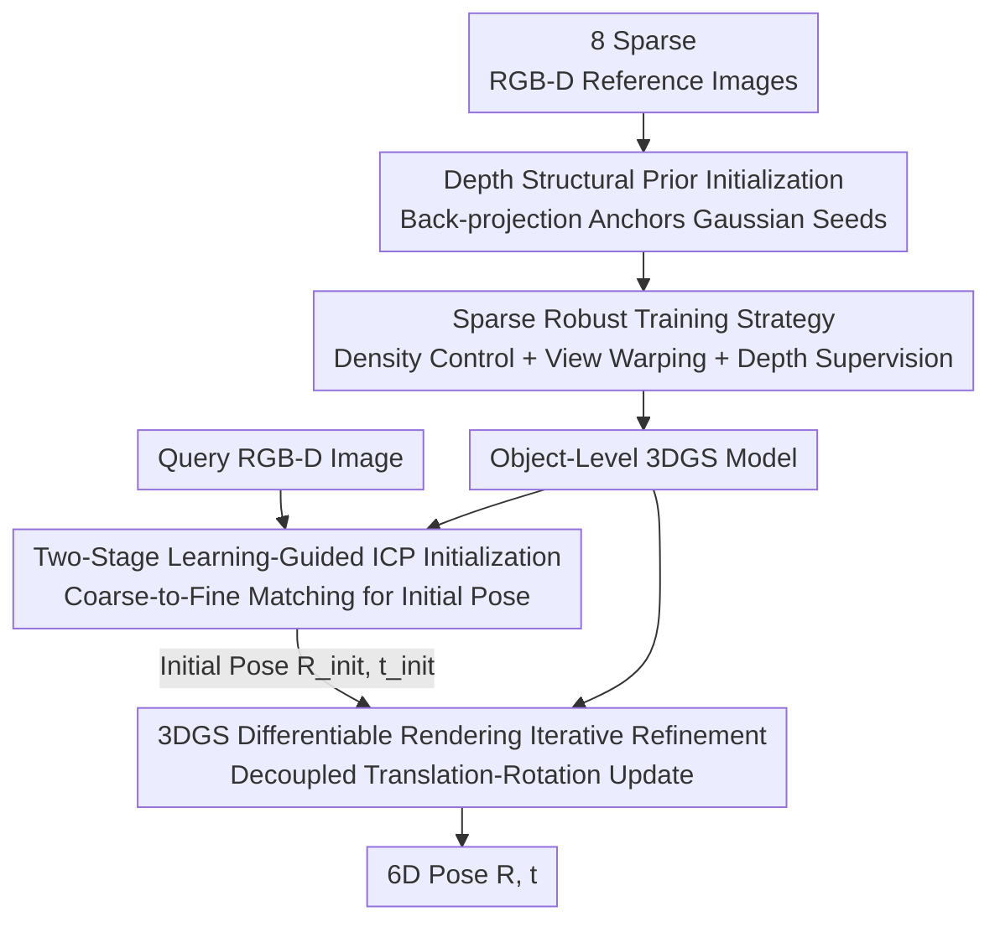

# PoseGaussian: 6D Pose Estimation for Unseen Objects via Sparse-View Object-Level 3D Gaussian Splatting

**Conference**: CVPR 2026  
**Paper**: [CVF Open Access](https://openaccess.thecvf.com/content/CVPR2026/html/Shi_PoseGaussian_6D_Pose_Estimation_for_Unseen_Objects_via_Sparse-View_Object-Level_CVPR_2026_paper.html)  
**Code**: To be confirmed  
**Area**: 3D Vision  
**Keywords**: 6D Pose Estimation, Unseen Objects, 3D Gaussian Splatting, Sparse Views, Differentiable Rendering

## TL;DR
Without CAD models, PoseGaussian utilizes only 8 sparse RGB-D reference images. It first initializes an object-level 3DGS using depth priors and suppresses floaters and overfitting with a sparse robust training strategy. Subsequently, a "two-stage learning-guided ICP for initial pose + 3DGS differentiable rendering iterative refinement" framework is employed to estimate the 6D pose of unseen objects, outperforming baselines using 16 views in sparse-view settings on LINEMOD / GenMOP.

## Background & Motivation

**Background**: 6D pose estimation (predicting the 3D translation $t$ and 3D rotation $R$ of an object in the camera coordinate system) is a key technology for robotic grasping, AR/VR, and autonomous driving. Instance-level methods achieve high accuracy but require annotations and high-quality CAD models for each object, rendering them unable to generalize to unseen objects. Category-level methods leverage shared shape priors to improve intra-class generalization; however, their performance drops significantly once the test objects fall outside the training categories or exhibit substantial intra-class variations.

**Limitations of Prior Work**: Recent "model-free" paradigms rely solely on reference images as priors to reconstruct object geometry and appearance, subsequently solving for poses via rendering consistency or geometric registration. However, both of its sub-routes suffer from severe limitations: implicit reconstruction based on NeRF yields high quality but is slow in both training and rendering, lacking real-time capability; explicit reconstruction based on 3DGS is fast in training and rendering, yet almost entirely relies on **dense multi-view inputs and SfM initialization**. When reference views are sparse and textures are weak, SfM initialization easily fails, leading to floaters and appearance overfitting, which directly undermines the stability of downstream pose estimation.

**Key Challenge**: Despite the appealing efficiency of 3DGS, it is highly sensitive to the quantity and quality of views. The desire for practical utility (utilizing as few as 8 views) naturally conflicts with the need for reliability (stable reconstruction and accurate poses) under sparse, low-texture conditions. Furthermore, even if a 3DGS is barely reconstructed, computing an accurate pose from this coarse model remains a core challenge.

**Goal**: Under the model-free and sparse-view setting, the objective is to reconstruct a stable object-level 3DGS for unseen objects while estimating highly accurate 6D poses, which is decomposed into three sub-problems: "stable reconstruction -> good initialization -> pose refinement".

**Key Insight**: The authors draw inspiration from the success of sparse-view NeRF; specifically, introducing **depth structural priors** as supervision significantly mitigates initialization failure and overfitting (e.g., DS-NeRF embeds SfM depth into the ray-termination distribution). Consequently, this concept is adapted to 3DGS: using the depth back-projection of RGB-D to directly anchor Gaussian seeds onto the object surface, bypassing SfM from the very beginning.

**Core Idea**: The fragile SfM reconstruction is replaced with "depth prior initialization + sparse robust training." This is then chained with "learning-guided ICP for initialization + 3DGS differentiable rendering for training-free refinement" to construct a three-stage pipeline that does not rely on task-specific networks and generalizes to unseen objects.

## Method

### Overall Architecture
PoseGaussian is a three-stage framework. The input consists of 8 sparse RGB-D reference images of an unseen object and a query RGB-D image with an unknown pose. The output is the 6D pose $\{R, t\}$ of the object in the query image.

- **Stage 1: Sparse-View 3DGS Reconstruction (Sec 3.2)**: Back-projects RGB-D depth to construct point clouds as structural priors to initialize the object-level 3DGS, followed by adaptive density control, view-warping augmentation, and joint photometric-depth supervision to obtain a robust, floater-free object model $G_\text{target}$.
- **Stage 2: Two-Stage Learning-Guided ICP Initialization (Sec 3.3)**: Constructs point clouds from both the 3DGS model and the query image, feeds them into KPConv-FPN to extract multi-scale features, performs coarse-to-fine correspondence matching, and solves for a robust initial pose $\{s, R_\text{init}, t_\text{init}\}$ using ICP.
- **Stage 3: 3DGS Differentiable Rendering Iterative Refinement (Sec 3.4)**: Treats the 3DGS renderer as a differentiable refiner, iteratively updating the pose via "render-compare-backpropagate". This optimization prioritizes appearance consistency augmented by scale-normalized depth alignment, with decoupled updates for translation and rotation.

### Key Designs

**1. Depth Structural Prior Initialization: Anchoring Gaussian seeds using RGB-D back-projected point clouds to completely avoid SfM failures**

Traditional 3DGS relies on SfM for initialization, which frequently fails in sparse, low-texture settings, leading to geometric ambiguity and floaters. This work adopts a depth structural prior: for the $i$-th reference view, pixels within the mask $M_i$ are back-projected into the world coordinate system via depth, yielding the point set $P_i = \{T_i^{-1}(D_i(u,v)\,K^{-1}[u,v,1]^\top)\mid (u,v)\in M_i\}$, which are then combined into the total point cloud $P_t = \bigcup_{i=1}^{N} P_i$, where $K$ denotes the camera intrinsics, $D_i(u,v)$ is the depth, and $T_i\in SE(3)$ represents the baseline camera pose. To address pixel misalignment and mixed depth at RGB-depth boundaries, light erosion is first applied to mask boundaries to remove edge artifacts, and KNN-based robust outlier rejection is executed: for each point, the average distance to its $k$-nearest neighbors $\bar d_i$ is calculated, and an adaptive threshold $\tau$ is built from the global mean $\mu_d$ and standard deviation $\sigma_d$. Points with $\bar d_i > \tau$ are classified as outliers and removed. Each point in the cleaned point cloud serves as a Gaussian center $\mu$, RGB is mapped to spherical harmonic colors $c$, and the average distance in local neighborhoods is used as the isotropic initial scale. In this manner, seeds are directly anchored to the object surface, and subsequent optimization only needs to fine-tune rather than "grow geometry from scratch," thereby significantly stabilizing reconstruction under sparse views.

**2. Sparse Robust Training Strategy: Adaptive density control, view-warping augmentation, and joint photometric-depth supervision to suppress floaters and overfitting**

Initialization alone is insufficient, as overfitting and redundancy still occur during the training phase under sparse views. This work synergistically deploys three strategies. **Adaptive density control** departs from standard 3DGS, which aggressively prunes points using a fixed opacity threshold. Instead, it accumulates volume rendering weights to gauge each Gaussian's long-term average contribution, **pruning a splat only when its opacity resides in the lowest 5% and its contribution is also in the lowest tier**. This reduces redundancy while preserving high-quality splats. Concurrently, global densification is replaced with **directional densification**: positional gradient norms are calculated periodically, and Gaussians are split along their principal axes only when they exceed a threshold, better covering fine structures and borders. **View-warping augmentation** applies small pose perturbations $\delta T$ (rotation of $1$–$3°$, translation within $0.5\%$–$1.5\%$ of the object scale) to each real RGB-D reference view. This constructs pseudo-views via depth forward-projection, which are trained alongside the original images. This expands the dataset in the camera pose space, forcing the model to learn "view-consistent geometric appearance" rather than memorizing inputs. **Joint supervision** combines the photometric term $L_\text{rgb}=\lambda_1\|\hat I - I\|_1 + \lambda_2 L_\text{D-SSIM}(\hat I, I)$ and the depth term $L_\text{depth}=\|\hat D - D\|_1$ into the total loss $L_\text{total}=\lambda_1\|\hat I - I\|_1 + \lambda_2 L_\text{D-SSIM} + \lambda_d L_\text{depth}$. Training incorporates a "high-to-low" annealing strategy: the contribution of $\lambda_d$ is amplified during the first 30% of iterations to anchor geometry, and spherical harmonics (SH) degrees are restricted to 0–1 to suppress high-frequency overfitting. Subsequently, the photometric weight is gradually increased, and the SH degree is raised to 2–3 to refine texture boundaries.

**3. Two-Stage Learning-Guided ICP Initializer: Coarse-to-fine geometric matching for robust initial poses, replacing fragile similarity retrieval**

Differentiable rendering refinement is highly sensitive to the initial pose, easily falling into local optima if initialization is poor. After obtaining $G_\text{target}$, a point cloud $P_G=\{\mu_i\mid i\in G_\text{target}\ \&\ \alpha_i\ge 0.7\}$ is extracted from the 3DGS model (using an opacity threshold of 0.7, as low-opacity points contribute minimally to rendering and are mostly outliers), and $P_Q=\{d_i\cdot K^{-1}\cdot(u_i,v_i,1)^\top\mid (u_i,v_i)\in M_\text{tar}\}$ is back-projected from the query image. Both point clouds are fed into KPConv-FPN to extract multi-scale features: low-resolution features are used for global coarse matching (Coarsepoint Matching Module to ensure global geometric consistency), while high-resolution features are utilized for dense local matching (Local Superpoint Matching, incorporating an optimal transport layer to enhance local patch matching quality). Finally, ICP is performed on all retained correspondences to solve for the similarity transformation $\{s, R_\text{init}, t_\text{init}\}=\arg\min_{s,R,t}\sum_{(p,q)\in\hat C_p}\|sRp + t - q\|^2$. Compared to similarity-retrieval-based selectors such as Gen6D/Cas6D, this geometric coarse-to-fine registration produces significantly lower initialization errors (swapping it with their selectors leads to the steepest performance drop in ablation studies).

**4. 3DGS Differentiable Rendering Iterative Refiner: Treating the renderer as a training-free refiner with decoupled translation-rotation updates to prevent coupled drift**

Equipped with a robust initialization, the 3DGS splattering renderer is directly utilized as a differentiable refiner, performing iterative "render-compare-backpropagate" loops. Unlike methods requiring extra CNN/Transformer refinement heads, it does not rely on task-specific learnable parameters, presenting superior generalization to unseen instances. In each step, the pose is updated as $T_{k+1}=\Delta T_k T_k$, where $\Delta T_k=(\Delta R_k, \Delta t_k)$. Mirroring FoundationPose, the increment is decoupled into translation $\Delta t_k$ and rotation $\Delta R_k$, with the **rotation applied around the object's centroid** to prevent drift caused by translation-rotation coupling. Given camera intrinsics, the rendered image under pose $T$ is $C(T)=R_\text{gs}(G_\text{object}, K, T)$. The loss $L_\text{pose}=L_t + L_R$ is driven primarily by appearance consistency, comparing the rendered image with the query via SSIM and MS-SSIM. However, because appearance is insensitive to pure translation along the $z$-axis, a **scale-normalized depth alignment term** is incorporated: $L_\text{SNDA}=\frac{1}{|\Omega|}\sum_{u\in\Omega}\sqrt{(\hat D(u;T)/\hat s - D(u)/s_z)^2 + \varepsilon^2}$, where $\hat D$ is the rendered depth, $D$ is the sensor depth, $\hat s, s_z$ are normalization scales computed from their respective median depths, and $\varepsilon$ is the Charbonnier constant for robustness. The optimization employs "translation-then-rotation" decoupling: $t_{k+1}=t_k+\arg\min_{\Delta t} L_t([R_k\mid t_k+\Delta t])$, followed by $R_{k+1}=\arg\min_{\Delta R} L_R(\Delta R\,R_k\mid t_{k+1})\cdot R_k$. This leverages fast 3DGS differentiable rendering to efficiently iterate towards highly accurate poses.

### Loss & Training
During the reconstruction stage, the total loss is a joint photometric-depth supervision $L_\text{total}=\lambda_1\|\hat I-I\|_1+\lambda_2 L_\text{D-SSIM}+\lambda_d L_\text{depth}$, combined with a "high-to-low" depth weight annealing strategy and progressive SH degrees from 0–1 to 2–3. The loss in the pose refinement stage is $L_\text{pose}=L_t+L_R$, where the translation term includes SSIM + SNDA, and the rotation term contains SSIM + MS-SSIM. Optimization uses Adam for 10,000 iterations with cosine learning rate annealing. Adaptive density control begins at step 500 and ends at step 6,000 (densification occurs every 500 steps with a linearly decaying probability to 0, and pruning occurs every 100 steps). For each object, 8 RGB-D reference views are selected, and 2 slightly perturbed view-warped views are synthesized for each real view.

## Key Experimental Results

Datasets: Trained on synthetic data MegaPose and Google Scanned Objects, evaluated on **LINEMOD (13 objects)** and **GenMOP (10 objects)**, with qualitatively evaluated real-world scenes captured by a RealSense D435i. Metrics: ADD(S)-0.1d recall is used for LINEMOD, and GenMOP additionally reports Prj-5 (recall with 5-pixel projection error); the Average Recall (AR) of VSD/MSSD/MSPD from BOP is used for ablation. Depth maps are estimated by ZoeDepth, and masks are generated by CNOS.

### Main Results

LINEMOD (ADD(S)-0.1d mean): Under abundant views (>200), Ours (87.2) outperforms the latest baseline IG-6DoF (85.1) by approximately 2.1%; more importantly, **Ours with only 8 views (54.30) outperforms all baselines using 16 views** (Gen6D 44.62 / Cas6D 47.83 / OnePose++ 40.30), demonstrating significantly superior robustness to sparse views. Because Gen6D and OnePose++ cannot obtain dense templates and complete SfM reconstructions, their matching and initialization suffer from severe instability.

| Dataset | Setting | Ours | IG-6DoF | Gen6D | Cas6D | OnePose++ |
|--------|------|------|---------|-------|-------|-----------|
| LINEMOD | >200 views | **87.2** | 85.1 | 73.3 | – | 76.9 |
| LINEMOD | Sparse (Ours 8 vs Baselines 16) | **54.30** | – | 44.62 | 47.83 | 40.30 |

GenMOP (abundant 200 views, average of two metrics): The full PoseGaussian achieves the best average on both ADD-0.1d and Prj-5; under the 8-view sparse setting, it also nearly matches the performance of baselines using 16 views.

| Metric | Setting | Ours | IG-6DoF | Cas6D | Gen6D | OnePose++ |
|------|------|------|---------|-------|-------|-----------|
| ADD-0.1d | 200 views | **59.53** | 56.10 | 53.52 | 49.54 | 44.60 |
| Prj-5 | 200 views | **88.42** | 86.34 | 87.52 | 82.77 | 79.87 |
| ADD-0.1d | Sparse (Ours 8 vs Baselines 16) | 27.56 | – | 37.01 | 34.00 | 24.19 |
| Prj-5 | Sparse (Ours 8 vs Baselines 16) | 71.69 | – | 77.28 | 72.11 | 35.75 |

⚠️ Note: On GenMOP under the 8-view setting, Ours (27.56 ADD-0.1d) is lower than Cas6D with 16 views (37.01), which falls into the category of "using fewer views to approach rather than comprehensively surpass". The original paper also only states "nearly matches", requiring attention to the different view budgets during horizontal comparison.

### Ablation Study

Pose estimation component ablation (LINEMOD, Pose ACC + three AR metrics): Removing any of the components results in a substantial performance drop. In particular, **replacing the proposed initializer with Gen6D/Cas6D's similarity selector leads to the most severe decline** (Pose ACC drops from 87.5 to 68.7 / 71.4), underscoring that the geometric-driven two-stage ICP initialization is the crucial factor for accuracy.

| Configuration | Pose ACC | AR_MSPD | AR_MSSD | AR_VSD | Description |
|------|----------|---------|---------|--------|------|
| A: Full Model | **87.5** | **71.4** | **55.4** | **71.4** | Full |
| A0: w/o Adaptive Density Control | 85.0 | 67.3 | 48.9 | 67.1 | Drops 2.5 |
| A1: w/o View-Warping Augment. | 85.9 | 68.9 | 50.6 | 68.5 | Drops 1.6 |
| A2: Modified 3DGS -> Vanilla 3DGS | 82.1 | 64.2 | 45.2 | 63.8 | Drops 5.4, proves importance of structural prior + sparse training |
| A3: Initializer -> Gen6D Selector | 68.7 | 53.7 | 44.8 | 55.7 | Drops 18.8, most critical |
| A4: Initializer -> Cas6D Selector | 71.4 | 55.6 | 45.3 | 57.4 | Drops 16.1 |
| A5: 3DGS Refiner -> Gen6D Refiner | 79.2 | 67.4 | 52.1 | 66.2 | Drops 8.3, proves training-free refinement generalizes better |

### Key Findings
- **Initializer yields the highest contribution**: Swapping the two-stage ICP with a similarity selector (A3/A4) causes Pose ACC to plummet by 16–19 points—far exceeding the 1–3 point drops from removing density control or view warping. This demonstrates that a solid initial pose is critical for differentiable rendering refinement.
- **Structural prior + sparse training significantly combats sparsity**: The ablation on the number of reconstruction views (Figure 8) shows that Ours is far more stable than vanilla 3DGS in the 8–32 view range. With 8 views, vanilla 3DGS exhibits blurred appearance and sparse, fragmented point clouds, whereas Ours shows denser geometry, cleaner boundaries, and heavily suppressed floaters.
- **Training-free refinement generalizes better**: Replacing the 3DGS refiner with a learnable refinement head from Gen6D (A5) drops performance by 8.3 points, validating that "3DGS differentiable optimization, independent of task-specific parameters, yields stronger cross-instance generalization."
- **Efficiency**: On a single RTX 3090 Ti, pose estimation takes approximately 0.67s per frame (0.25s for ICP initialization + 0.42s for iterative refinement); the 10k-iteration reconstruction of an 8-view object averages 2.21 minutes.

## Highlights & Insights
- **Decoupled "depth-prior initialization + training-free rendering refinement"**: The former utilizes RGB-D to directly anchor Gaussian seeds to the object surface, thereby neutralizing SfM failure from the root; the latter repurposes the 3DGS renderer as a differentiable refiner, bypassing task-specific networks. Both designs directly address the pain points of "sparsity + unseen objects" and operate independently, offering a clean conceptual flow.
- **Clever "contribution-based pruning" in adaptive density control**: Instead of aggressively pruning points based solely on a fixed opacity threshold, it accumulates long-term rendering contributions and only prunes when both opacity and contribution are in the lowest tier. This prevents the erroneous deletion of critical Gaussians under sparse-view conditions—a trick highly transferable to any sparse-view 3DGS reconstruction task.
- **Scale-normalized depth alignment resolves appearance blind spots**: The authors astutely identified that appearance losses are insensitive to pure translations along the $z$-axis. Consequently, they incorporated the SNDA term, which aligns the rendered depth with the sensor depth after normalizing them by their respective medians, serving as a precise remedy for geometric blind spots in differentiable rendering-based pose optimization.
- **Decoupled translation-rotation + rotation around centroid**: Preventing coupled drift, this engineering detail is highly practical for stabilizing pose iteration convergence.

## Limitations & Future Work
- **Dependency on RGB-D and reliable masks**: The entire pipeline for prior initialization and point cloud construction is built upon depth (either sensors or ZoeDepth estimations) and CNOS masks. When depth noise is severe or masks are inaccurate, the back-projected point clouds become noisy, making the system unsuitable for pure RGB scenarios.
- **Inferior to dense baselines at the limit of sparsity**: On GenMOP under the 8-view setting, the ADD-0.1d remains lower than some 16-view baselines, indicating that "8 views matching 16 views" is more evident in LINEMOD, and cross-dataset sparse robustness is not universally superior.
- **Still requires 2.21 minutes of reconstruction per object**: Although faster than NeRF, each unseen object still requires an individual 3DGS to be trained, leaving a gap before achieving the practical target of "plug-and-play, zero-training."
- **Promising directions for improvement**: Replacing the depth prior with monocular depth combined with multi-view self-supervised consistency to eliminate the RGB-D dependency; or exploring cross-object shared 3DGS priors to amortize the per-object reconstruction overhead.

## Related Work & Insights
- **vs GS-Pose / IG-6DoF**: These methods also reconstruct 3DGS first and refine poses using rendering comparisons, but they heavily depend on dense reference views and SfM initialization. Ours uses depth-prior initialization + sparse training strategies to reduce the required views to 8, establishing sparse-view robustness as its core advantage.
- **vs Gen6D / Cas6D / OnePose++ (model-free baselines)**: They rely on dense template matching or SfM point cloud reconstruction paired with matching networks to estimate poses, which are highly unstable under sparse and low-texture conditions. Ours employs a geometrically driven two-stage learning-guided ICP to provide initial poses; ablations show that swapping this with their selectors results in a 16–19 point drop.
- **vs NeRF-based implicit reconstruction (DS-NeRF / RegNeRF, etc.)**: This work borrows their concept of "using depth structural priors as supervision" but instantiates it within the explicit and highly efficient 3DGS framework. This enables faster training and rendering, whilst utilizing the depth prior for initialization, training supervision, and refinement alignment simultaneously.

## Rating
- Novelty: ⭐⭐⭐⭐ Systematically combining depth-prior initialization, sparse robust training, geometric ICP initialization, and training-free rendering refinement into a sparse-view 6D pose pipeline represents a solid block of combinational innovations.
- Experimental Thoroughness: ⭐⭐⭐⭐ Evaluation covers two standard benchmarks, real-world scenes, module ablation, view-quantity ablation, and runtime analysis. However, certain metrics under the sparse setting fall short of dense baselines, and a larger-scale evaluation on unseen objects is missing.
- Writing Quality: ⭐⭐⭐⭐ The three-stage description is clear, with math equations and figures well-integrated. However, the differences in view budgets during horizontal comparison of certain metrics could be more explicitly labeled.
- Value: ⭐⭐⭐⭐ Delivering a practical solution under three stringent real-world constraints—no CAD templates, only 8 views, and unseen objects—provides direct utility and reference value for applications like robotic grasping.

<!-- RELATED:START -->

## Related Papers

- [\[CVPR 2026\] PoseGAM: Robust Unseen Object Pose Estimation via Geometry-Aware Multi-View Reasoning](posegam_robust_unseen_object_pose_estimation_via_geometry-aware_multi-view_reaso.md)
- [\[CVPR 2026\] OrienPose: Orientation-Guided Novel View Synthesis for Single-Image Unseen Object Pose Estimation](orienpose_orientation-guided_novel_view_synthesis_for_single-image_unseen_object.md)
- [\[CVPR 2026\] Exploring 6D Object Pose Estimation with Deformation](exploring_6d_object_pose_estimation_with_deformation.md)
- [\[ECCV 2024\] 6DGS: 6D Pose Estimation from a Single Image and a 3D Gaussian Splatting Model](../../ECCV2024/3d_vision/6dgs_6d_pose_estimation_from_a_single_image_and_a_3d_gaussia.md)
- [\[ECCV 2024\] Omni6D: Large-Vocabulary 3D Object Dataset for Category-Level 6D Object Pose Estimation](../../ECCV2024/3d_vision/omni6d_large-vocabulary_3d_object_dataset_for_category-level_6d_object_pose_esti.md)

<!-- RELATED:END -->
