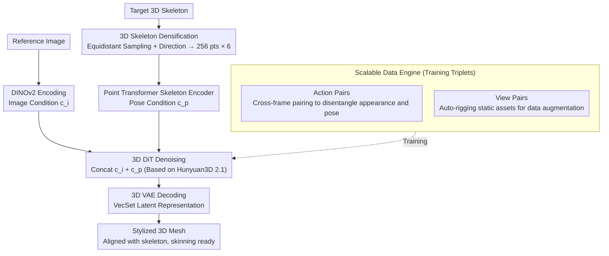

# PoseMaster: A Unified 3D Native Framework for Stylized Pose Generation

**Conference**: CVPR 2026  
**arXiv**: [2506.21076](https://arxiv.org/abs/2506.21076)  
**Code**: None (Not yet open-sourced)  
**Area**: 3D Vision / Image Generation  
**Keywords**: 3D Pose Stylization, Skeleton Encoder, 3D Native Generation, Data Engine, End-to-End

## TL;DR
PoseMaster proposes a 3D native approach that unifies pose stylization and 3D generation into an end-to-end framework. It directly utilizes 3D skeletons as pose control signals (instead of 2D skeleton maps), designs a skeleton densification strategy and a Point Transformer encoder to extract fine-grained spatial topological features. Trained through a large-scale "Image-Skeleton-Mesh" triplet data engine, it achieves SOTA results in pose normalization and arbitrary pose stylization.

## Background & Motivation

**Background**: The goal of 3D pose stylization is to generate 3D assets that maintain character identity while strictly following a target pose. Current mainstream methods adopt a cascade pipeline: first using a 2D base model (e.g., ControlNet) to generate pose-stylized images based on 2D skeleton maps, and then using a 3D reconstruction model (e.g., LRM) to lift the images into 3D assets. Representative methods include CharacterGen, StdGen, and SKDream.

**Limitations of Prior Work**: (1) **Inevitable error propagation**: Artifacts, occlusions, and inconsistencies introduced during the 2D generation stage are directly amplified during the 3D reconstruction stage, leading to geometric distortions; (2) **Inherent ambiguity in 2D skeleton maps**: 2D projections lose critical depth information and spatial relationships, failing to resolve self-occlusions or complex topological structures. This severely limits the precision of the final 3D pose—a single 2D pose can correspond to infinite 3D poses.

**Key Challenge**: Existing methods essentially manipulate poses in 2D space before attempting 3D recovery, but 2D manipulation inherently loses 3D information that cannot be compensated for during the lifting stage. Direct pose control in 3D space is required.

**Goal**: (1) Eliminate error accumulation caused by the 2D-to-3D cascade; (2) Provide unambiguous 3D spatial pose control; (3) Address the scarcity of large-scale Image-Skeleton-Mesh training data.

**Key Insight**: Inject 3D skeletons directly into the 3D native generation workflow as conditional signals for the diffusion model, using a unified end-to-end model to simultaneously complete pose stylization and 3D geometric generation.

**Core Idea**: Replace 2D skeletons with 3D skeletons as pose conditions to implement end-to-end pose stylization within a 3D native generation framework, eliminating cascade errors.

## Method

### Overall Architecture
PoseMaster addresses a direct task: given a character reference image and a target 3D skeleton, it generates a 3D mesh that preserves character identity and strictly adheres to the target pose in a single step, bypassing the traditional "2D-pose-then-3D-lift" route. The pipeline is built on Hunyuan3D 2.1, featuring a 3D VAE (encoding mesh into VecSet latent representations) and a 3D Diffusion Transformer (DiT). The reference image is encoded by DINOv2 into image conditions $c_i$, and the target skeleton is encoded by a specialized skeleton encoder into pose conditions $c_p$. Both sets of tokens are concatenated and fed into the DiT for denoising. Crucially, pose control occurs in 3D space from start to finish—3D skeletons, 3D native generation, without any lossy 2D projection steps.

### Key Designs

**1. 3D Skeleton Densification: Providing topological orientation for sparse joints to eliminate ambiguity**

Standard 3D skeletons are merely sequences of joint coordinates, sufficient for simple poses like A-pose or T-pose, but insufficient for complex joints like crossed fingers or entwined legs where isolated points cannot clarify depth ordering. PoseMaster "paints" every bone segment: interpolating equidistant points (approx. 0.005 spacing) along the segment. The number of samples correlates with bone length to maintain density, and the direction vector (start point to end point) is assigned to all sample animation points on that segment. Thus, each point carries 3D coordinates and 3D orientation, transforming the skeleton into $P \in \mathbb{R}^{N \times 6}$, which is finally downsampled via FPS to 256 points. Specifically, a femur bone originally defined by hip and knee endpoints becomes dozens of points labeled with a "downward" direction, allowing the network to explicitly read the bone's flow and affiliation rather than guessing from isolated coordinates.

**2. Point Transformer Skeleton Encoder: Modeling point relationships in 3D space for unambiguous geometric priors**

With the dense point cloud, an encoder is needed to compress it into conditions for the DiT. PoseMaster applies positional encoding (PE) to the coordinate part $P_c$, concatenates it with direction features $P_f$, projects them to 1024 dimensions, and passes them through two stacked Point Transformer Blocks to obtain the pose condition:

$$c_p = \phi_2(\phi_1(\mathcal{T}([PE(P_c), P_f])))$$

Point Transformer is selected over standard MLPs for its inherent ability to capture spatial relationships between points via self-attention. This contrasts sharply with 2D pose methods that render skeletons into 2D Openpose maps for ControlNet; PoseMaster models entirely within the 3D coordinate system, preserving depth and topology to provide the DiT with unambiguous geometric priors.

**3. Scalable Data Engine: Resolving pose-disentangled training data scarcity with static assets and auto-rigging**

End-to-end training requires numerous "same character, different pose" Image-Skeleton-Mesh triplets. Existing animatable 3D assets (like ReadyPlayerMe) are scarce and stylistically limited. PoseMaster uses two complementary routes. The dynamic route (Action Pairs) starts with datasets like ReadyPlayerMe, VRoid, and Playbox, rendering multiple frames of action sequences and cross-pairing them—pairing the image from Frame A with the skeleton and mesh from Frame B. This forces the model to disentangle "appearance" from "pose." The static route (View Pairs) utilizes massive static datasets like Objaverse, Objaverse-XL, and HumanRig, rendering multi-view images. Skeletons are extracted if available or generated via auto-rigging models. A single-view image is then paired with the full 3D skeleton and mesh. All meshes are processed into watertight versions, and normalization parameters are synchronized with the skeletons to ensure spatial alignment. Together, these routes aggregate over 500K unique humanoid objects.

### Loss & Training
The model is trained using a Conditional Flow Matching objective $\mathbb{E}_{t,x_0,x_1,c_i,c_p}\|v_\theta(x,t,c_i,c_p) - (x_1-x_0)\|_2^2$. The image encoder and VAE are frozen, while the DiT and skeleton encoder are jointly optimized with a learning rate of $1 \times 10^{-5}$. Data augmentation includes 15% probability random rotation ($\pm 30^{\circ}$) for images and random translation/scaling/rotation for 3D skeletons and meshes. Notably, for Classifier-Free Guidance (CFG), the pose condition $c_p$ is always retained during dropout, while the image condition $c_i$ is dropped, effectively forcing the skeleton to unconditionally dictate the pose while the image controls the appearance.

## Key Experimental Results

### Main Results (Pose Normalization - VRoid Test Set)

| Method | MAE↓ | SIM↑ | Uni3D-I↑ | ULIP-I↑ |
|------|------|------|----------|---------|
| CharacterGen | 6.38 | 0.905 | 0.343 | 0.146 |
| StdGen | 4.97 | 0.930 | 0.398 | 0.160 |
| Trellis* | 5.39 | 0.926 | 0.398 | 0.157 |
| Hunyuan3D 2.1* | 5.89 | 0.920 | 0.398 | 0.150 |
| **PoseMaster** | **4.59** | **0.938** | **0.402** | **0.161** |

### Ablation Study (Arbitrary Pose Stylization + Skeleton Guidance Effect)

| Method | MAE↓ | SIM↑ | Uni3D-I↑ | Description |
|------|------|------|----------|------|
| Trellis (w/ target pose image) | 7.20 | 0.904 | 0.306 | Baseline has target image advantage |
| Hunyuan3D 2.1 (w/ target pose image) | 6.75 | 0.911 | 0.285 | Same as above |
| **PoseMaster (w/ source image + 3D skeleton)** | **5.28** | **0.935** | **0.313** | Outperforms even with less info |
| Hunyuan3D 2.1 (No skeleton guidance) | 6.56 | 0.916 | 0.301 | Baseline for skeleton effect |
| **PoseMaster (With skeleton guidance)** | **4.82** | **0.946** | **0.315** | Skeleton significantly improves geometry |

### Key Findings
- **PoseMaster comprehensively outperforms cascade methods in pose normalization**: MAE drops from 4.97 (StdGen) to 4.59. The key advantage is avoiding structural distortions during the 2D normalization stage.
- **Arbitrary pose stylization results are highly persuasive**: Even when baselines are given target pose images (a massive information advantage), PoseMaster (given only source images and 3D skeletons) remains significantly superior (MAE 5.28 vs 6.75-7.20), proving that pure image input cannot resolve topological ambiguity from self-occlusion.
- **Dense representation vs. sparse joints**: Qualitative results show sparse joints fail to convey complex movements, leading to incorrect topologies; dense point clouds with direction vectors significantly improve control precision.
- **Skeleton guidance benefits standard image-to-3D tasks**: Even in same-pose reconstruction, adding skeletons reduces MAE from 6.56 to 4.82, indicating skeletons act as geometric anchors to mitigate depth ambiguity in monocular reconstruction.

## Highlights & Insights
- **CFG Design**: Setting the skeleton condition as "required" (0% dropout) ensure $\hat{v}_\theta = v_\theta(x_t,t,c_p,\emptyset) + \lambda(v_\theta(x_t,t,c_p,c_i) - v_\theta(x_t,t,c_p,\emptyset))$. This ensures the skeleton maintains control over the generation process while the image only affects appearance, preventing pose accuracy from being diluted by identity preservation.
- **Animation-Ready Meshes**: Since the generated mesh is strictly aligned with the skeleton in 3D space, it can be directly integrated into skinning models (e.g., UniRig) for automatic rigging, bypassing tedious retargeting steps.
- **Data Strategy**: The combination of Action Pairs and View Pairs addresses the bottleneck of animatable asset scarcity. By "activating" static assets through auto-rigging, the model significantly raises the ceiling for data scale and stylistic diversity.

## Limitations & Future Work
- **Humanoid Only**: The data engine and skeleton encoder are tailored for humanoid skeletons and do not support animals or non-humanoid characters.
- **Dependency on Hunyuan3D 2.1**: Generalization capabilities may be limited by the performance ceiling of the underlying 3D generation model.
- **Lack of Fine-grained Control**: While effective for large bone segments, the densification strategy provides too few sampling points for extremely short segments like fingers, limiting dexterity.
- **Texture Evaluation**: Metrics focus on geometric quality; texture fidelity and lighting consistency remain unquantified.

## Related Work & Insights
- **vs. CharacterGen/StdGen**: These are cascade methods (2D pose transfer → 3D reconstruction). PoseMaster’s end-to-end paradigm fundamentally eliminates error propagation between steps.
- **vs. SKDream**: SKDream uses 2D ControlNet-style control but remains limited by 2D projection ambiguity. PoseMaster’s 3D skeleton provides explicit depth and topology.
- **vs. CraftsMan/Trellis**: These 3D native models lack pose control; PoseMaster introduces precise pose controllability via its skeleton encoder.
- **Insight**: The concept of using 3D skeletons as conditional signals can be extended to other controllable 3D tasks, such as hand gesture generation or 4D human generation based on motion sequences.

## Rating
- Novelty: ⭐⭐⭐⭐⭐ 3D skeleton conditioning + end-to-end paradigm is pioneering; densification is simple yet effective.
- Experimental Thoroughness: ⭐⭐⭐⭐ Fair comparison (outperforming baselines with information advantages); solid ablation, though lacks user study.
- Writing Quality: ⭐⭐⭐⭐ Clear motivation, detailed method description, and high-quality figures.
- Value: ⭐⭐⭐⭐⭐ Establishes a new paradigm for 3D pose stylization; high utility for animation-ready mesh generation.

<!-- RELATED:START -->

## Related Papers

- [\[CVPR 2026\] WildPose: A Unified Framework for Robust Pose Estimation in the Wild](wildpose_a_unified_framework_for_robust_pose_estimation_in_the_wild.md)
- [\[CVPR 2026\] ComPose: A Unified Completion-Pose Framework for Robust Category-Level Object Pose Estimation](compose_a_unified_completion-pose_framework_for_robust_category-level_object_pos.md)
- [\[CVPR 2026\] Native and Compact Structured Latents for 3D Generation](native_and_compact_structured_latents_for_3d_generation.md)
- [\[CVPR 2026\] TEXTRIX: Latent Attribute Grid for Native Texture Generation and Beyond](textrix_latent_attribute_grid_for_native_texture_generation_and_beyond.md)
- [\[CVPR 2026\] Event Structural Valley: A Unified Theoretical and Practical Framework for Event Camera Autofocus](event_structural_valley_a_unified_theoretical_and_practical_framework_for_event_.md)

<!-- RELATED:END -->
