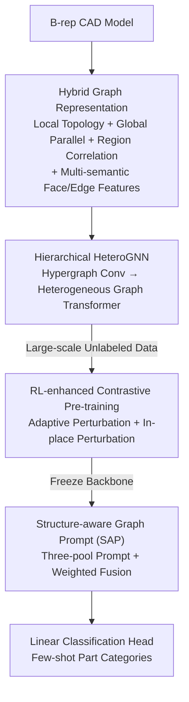

# PP-Brep: Few-Shot B-rep Classification with Hybrid Graph Representation

**Conference**: CVPR 2026  
**Paper**: [CVF Open Access](https://openaccess.thecvf.com/content/CVPR2026/html/Hao_PP-Brep_Few-Shot_B-rep_Classification_with_Hybrid_Graph_Representation_CVPR_2026_paper.html)  
**Code**: None  
**Area**: 3D Vision / CAD / Graph Neural Networks  
**Keywords**: B-rep Classification, Few-Shot Learning, Hybrid Graph Representation, Contrastive Pre-training, Graph Prompt

## TL;DR
This paper deconstructs the B-rep model of CAD into a three-layer hybrid graph (local topology graph + global parallel graph + region correlation hypergraph), paired with a hierarchical heterogeneous GNN. It utilizes RL-adaptive perturbation for contrastive pre-training to learn general representations and structure-aware graph prompts for few-shot fine-tuning. It significantly outperforms general graph prompt methods at 1/3/5-shot on the TraceParts-11 and FabWave-31 part datasets.

## Background & Motivation
**Background**: In industrial manufacturing, 3D CAD parts need to be classified according to geometry and topology (to facilitate design reuse and automation). CAD models are naturally stored as B-rep (boundary representation), consisting of faces, edges, vertices, and their adjacency relationships. Mainstream approaches either use 2D CNNs after multi-view rendering or parse B-rep directly into graphs for GNNs (UV-Net, BRepNet, AAGNet, etc.), but these rely on large amounts of labeled samples for supervised training.

**Limitations of Prior Work**: Labeled data for new part categories is extremely scarce in industrial scenarios, and supervised pipelines cannot adapt quickly. Recent shifts toward "unsupervised pre-training" learn general representations from unlabeled data, but evaluations still use linear probing, which requires many downstream labels—essentially failing to solve the few-shot problem of recognizing new classes with only a few samples.

**Key Challenge**: B-rep structural information is multi-level (local adjacency of single faces, remote constraints like symmetry/alignment across faces, and functional unit-level structures like holes/bosses/pockets). However, existing graph representations often only model the "face-face adjacency" layer, losing remote geometric relationships and functional structures. Simultaneously, the existing "pre-training + downstream" route follows generative pre-training + traditional fine-tuning; under few-shot conditions, fine-tuning leads to catastrophic overfitting, and the path of "contrastive pre-training + parameter-efficient prompt tuning" hasn't been validated for B-rep few-shot classification.

**Goal**: (1) Design a B-rep graph representation capable of characterizing local, global, and regional structures simultaneously; (2) Construct a few-shot classification framework that does not rely on retraining the entire backbone.

**Key Insight**: Since single-layer adjacency graphs provide insufficient information, three complementary graphs are used to explicitly encode topology at different scales. Since fine-tuning overfits in few-shot settings, the backbone is frozen, and only lightweight structure-aware prompts are learned.

**Core Idea**: Use a "hybrid multi-layer graph representation + RL-enhanced contrastive pre-training + structure-aware graph prompt" to bridge large-scale unlabeled CAD pre-training and few-shot downstream classification.

## Method
The entire system consists of two major components: first, converting a B-rep model into a **hybrid graph representation** (three-layer graph topology + multi-semantic geometric features), and then using the **PP-Brep framework** (hierarchical heterogeneous GNN backbone + RL contrastive pre-training + structure-aware prompt tuning) to complete few-shot classification. Pre-training is performed on the DeepCAD dataset with 170,000 unlabeled models, while downstream tasks use only 1/3/5 samples per class.

### Overall Architecture
The input is a B-rep CAD model, and the output is its part category. The intermediate process involves: ① Parsing the B-rep into a hybrid graph (three types of topological edges + face/edge features); ② Extracting node representations using a hierarchical heterogeneous GNN through hypergraph convolution and heterogeneous graph Transformer stages; ③ Pre-training the backbone on large-scale unlabeled data using contrastive learning with RL-adaptive perturbations; ④ Freezing the backbone and training only the Structure-Aware Prompt (SAP) and a linear classification head for each downstream few-shot task.

### Key Designs

**1. Hybrid Graph Representation: Supplementing Structural Loss via Three Complementary Layers + Multi-semantic Features**

This is the core remedy for the "insufficiency of single-layer face-face adjacency graphs." The authors encode a B-rep by layering three types of graphs:

- **Local Topology Graph $G_{adj}$**: An adjacency graph is built with faces as nodes and edges as graph edges. Kruskal's Minimum Spanning Tree (MST) is run using Euclidean distances between face centroids as weights to simplify the original adjacency graph into an MST, reducing model complexity while retaining the basic topological skeleton.
- **Global Parallel Graph $G_{par}$**: Captures remote constraints that are far apart in $G_{adj}$ but geomtrically strongly correlated (symmetry, alignment). All non-adjacent planar face pairs $(F_i, F_j)$ are traversed; if the angle between their normal vectors is less than a threshold (e.g., $1^\circ$), a parallel edge is added.
- **Region Correlation Hypergraph $H_{reg}$**: Expresses functional unit-level (hole, boss, pocket) structures. Face centroids are treated as a 3D point cloud, and Farthest Point Sampling (FPS) selects $K$ seed points $S=[S_1,\dots,S_K]$. Each seed performs a Ball Query to group neighboring face nodes. Topological consistency correction is applied (removing isolated nodes not connected to others in the cluster), and the remaining nodes form a hyperedge. Finally, an adjacency closure inference is performed—if the entire neighborhood of a boundary node belongs to a hyperedge, it is merged.

These three layers cover "local skeleton → remote constraints → functional regions." Accompanied by **multi-semantic geometric feature encoding**, faces and edges are assigned parametric and non-parametric features. Face non-parametric features $F_{np}$ are $8\times32\times32$ grid samples in the UV domain compressed to 128D via 2D CNN; parametric features $F_p$ linearly embed 16D scalars into four 32D groups (surface type/area/structural properties/differential geometric properties) then concatenated to 128D. The final face descriptor is $F_{face}=\mathrm{Concat}(F_p, F_{np})$. Adjacency edge features $E_{adj}$ similarly concatenate non-parametric (1D CNN encoding UV path samples) and parametric (convexity/length/curve type) features.

**2. Hierarchical HeteroGNN: Hypergraph Conv + Heterogeneous Graph Transformer Two-stage Fusion**

The hybrid graph contains three heterogeneous edge types. The authors design a two-stage backbone: The first stage performs $n$ layers of hypergraph convolution to update nodes $X_{i+1}=\mathrm{ReLU}(\mathrm{HypergraphConv}(X_i, H_{reg}))$, integrating regional information. The second stage passes $X_n$ into $m$ layers of a Heterogeneous Graph Transformer, propagating through the local topology and global parallel graphs using TransformerConv: $X'_{adj}=\mathrm{TransformerConv}(X_n^j, G_{adj}, E_{adj})$ and $X'_{par}=\mathrm{TransformerConv}(X_n^j, G_{par}, E_{par})$. These are fused using learnable normalized weights:

$$X_n^{j+1}=\mathrm{ReLU}\big(\alpha_{adj}^{(j)} X'_{adj}+\alpha_{par}^{(j)} X'_{par}\big)$$

Node representations $\bar X$ undergo global average pooling for graph-level representation during pre-training. This backbone is shared by pre-training and prompt tuning. During inference, the input is $X_0+p$ (prompt-augmented node features).

**3. RL-enhanced Contrastive Pre-training: Adaptive Perturbation with Actor-Critic + In-place Perturbation for Memory Efficiency**

Pre-training follows SimGRACE (InfoNCE contrast between an anchor view $z_1$ and an augmented view $z_2$ obtained by perturbing the backbone):

$$\mathcal{L}_{CL}=-\frac{1}{B}\sum_{i=1}^{B}\log\frac{\exp(\mathrm{sim}(z_{1,i}, z_{2,i})/\tau)}{\sum_{k=1}^{B}\exp(\mathrm{sim}(z_{1,i}, z_{2,k})/\tau)}$$

To address issues with fixed perturbation intensity and memory usage, an Actor-Critic controller $C$ outputs perturbation intensity $\rho$ based on state $s$ (anchor view $z_1$). The negative contrastive loss $-\mathrm{EMA}(\mathcal{L}_{CL})$ serves as the reward $r$, optimizing $\mathcal{L}_{RL}=-A\cdot\log\pi(\rho|s)+(r-V(s))^2$. Furthermore, "**in-place perturbation**" is used: original parameters $\theta_{orig}$ are cached, Gaussian noise is added to the current parameters based on $\rho$ to get $\theta'$, $z_2$ is computed under `torch.no_grad()`, parameters are restored to $\theta_{orig}$ from cache, and $z_1$ is computed with gradients. This reduced single-epoch time from ~1104s to 19.31s at batch=8192.

**4. Structure-aware Graph Prompt (SAP): Context-specific Prompts for Few-shot Fine-tuning**

To prevent catastrophic overfitting, the backbone is frozen. SAP maintains three learnable token pools $P_{adj}, P_{par}, P_{reg}$. For each node $i$ in $X_0$, neighborhood aggregation on $G_{adj}, G_{par}, H_{reg}$ yields context-aware features $h_{adj}, h_{par}, h_{reg}$. These act as queries to generate structure-specific prompt vectors $p_{adj}, p_{par}, p_{reg}$ from the pools, fused with learnable weights:

$$p=\alpha_{adj}\,p_{adj}+\alpha_{par}\,p_{par}+\alpha_{reg}\,p_{reg}$$

The generated $p$ is added element-wise to $X_0$, and $(X_0+p)$ is fed into the frozen backbone.

## Loss & Training
The process consists of two stages: The pre-training stage jointly optimizes the contrastive loss $\mathcal{L}_{CL}$ (updating backbone $\theta$) and the RL loss $\mathcal{L}_{RL}$ (updating controller $\phi$ every $k$ steps). The downstream stage freezes the backbone and trains only the SAP token pools, fusion weights, and linear classification head.

## Key Experimental Results

### Main Results
Pre-training used DeepCAD (~170k models); downstream evaluation used FabWave-31 (31 classes) and TraceParts-11 (11 classes) with Full-set K-Shot (K=1/3/5).

1-shot results on TraceParts-11:

| Method | Accuracy(%) | F1(%) | AUROC(%) |
|------|-------------|-------|----------|
| PSP | 34.85 | 28.36 | 61.21 |
| sim+EP | 61.06 | 58.32 | 87.03 |
| sim+GPF | 60.19 | 59.54 | 90.67 |
| MultiGprompt | 68.63 | 68.02 | 89.89 |
| GCoT | 63.46 | 65.51 | 86.04 |
| **Ours** | **73.35** | **73.18** | **94.79** |

Ours demonstrates the strongest scalability as K increases: on FabWave-31, Accuracy improved from 72.98% (1-shot) to 87.55% (5-shot), a Gain of 14.57%, whereas MultiGprompt only improved by ~10%.

### Ablation Study
Evaluated on FabWave-31 1-shot.

Hybrid graph components (Table 3):

| Configuration | Accuracy(%) | F1(%) | AUROC(%) |
|------|-------------|-------|----------|
| No Edges | 51.43 | 34.57 | 62.18 |
| + $G_{adj}$ | 57.08 | 45.87 | 70.34 |
| + $G_{par}$ | 60.95 | 64.57 | 88.02 |
| Full (+ $H_{reg}$) | 72.89 | 72.60 | 91.53 |

Pre-training and fine-tuning strategies: Ours (RL) achieved 72.89% Accuracy, significantly higher than SimGRACE (67.50%). Fine-Tuning resulted in 43.82% (overfitting) compared to SAP's 72.89%. In-place perturbation reduced epoch time from 1104.23s to 19.31s without performance loss.

### Key Findings
- **Region correlation hypergraph is most significant**: Adding $H_{reg}$ to $G_{adj}+G_{par}$ boosted accuracy by +11.9%, indicating functional unit-level structures are vital for CAD part classification.
- **Prompting vs. Fine-tuning gap**: SAP reached 72.89% while Fine-tuning only managed 43.82%, proving prompt tuning is the correct approach for few-shot settings.
- **In-place perturbation is an engineering breakthrough**: 57x speedup makes contrastive learning feasible at the 170k model scale.
- **Failure modes**: Threaded parts are easily confused, as threads introduce noisy near-parallel edges in $G_{par}$, drowning out distinctive head geometry.

## Highlights & Insights
- **Three-layer heterogeneous graph design targets the core problem**: Local MST for skeletons, parallel graphs for remote symmetry, and hypergraphs for functional regions match human intuition for CAD parts.
- **In-place perturbation is a reusable trick**: Bypassing the memory bottleneck of SimGRACE via "cache → noise → no_grad → restore" allows 57x speedup, adaptable to any model-perturbation self-supervised scenario.
- **RL-controlled perturbation**: Converting augmentation intensity from a fixed hyperparameter to a dynamic decision based on sample difficulty is a clever integration of curriculum learning into contrastive pre-training.

## Limitations & Future Work
- Threaded parts with dense near-parallel edges fill the global parallel graph with noise.
- Sensitivity to hyperparameters like the parallel graph threshold ($1^\circ$) or FPS seed count $K$ was not fully analyzed.
- Validation was limited to 3D CAD/B-rep data; transferability to mesh or point clouds and performance on a larger number of categories remain unexplored.

## Related Work & Insights
- **vs. UV-Net / BRepNet**: These model face-face adjacency graphs for supervised classification. Ours introduces global parallel and regional hypergraphs to capture remote constraints and functional structures, using few-shot pre-training + prompting.
- **vs. SimGRACE / GraphCL**: Ours builds on SimGRACE but uses RL to make perturbations adaptive and in-place perturbations to solve memory bottlenecks.
- **vs. MultiGprompt / GCoT**: General graph prompts drop significantly on the difficult FabWave-31 dataset, whereas the structure-aware prompt (SAP) exhibits much better scalability.

## Rating
- Novelty: ⭐⭐⭐⭐ The combination of hybrid graphs, RL-adaptive perturbation, and SAP is a new route for B-rep few-shot classification.
- Experimental Thoroughness: ⭐⭐⭐⭐ Comprehensive cross-dataset evaluations, but missing hyperparameter sensitivity analysis.
- Writing Quality: ⭐⭐⭐⭐ Clear framework diagrams and thorough failure analysis.
- Value: ⭐⭐⭐⭐ High industrial demand for CAD classification; the in-place perturbation optimization is particularly practical.

<!-- RELATED:START -->

<!-- RELATED:END -->

## Related Papers

- [\[CVPR 2026\] SCOPE: Scene-Contextualized Incremental Few-Shot 3D Segmentation](scope_scene-contextualized_incremental_few-shot_3d_segmentation.md)
- [\[CVPR 2026\] Few-Shot Incremental 3D Object Detection in Dynamic Indoor Environments](few-shot_incremental_3d_object_detection_in_dynamic_indoor_environments.md)
- [\[CVPR 2026\] EmoTaG: Emotion-Aware Talking Head Synthesis on Gaussian Splatting with Few-Shot Personalization](emotag_emotion-aware_talking_head_synthesis_on_gaussian_splatting_with_few-shot_.md)
- [\[CVPR 2026\] CLIPoint3D: Language-Grounded Few-Shot Unsupervised 3D Point Cloud Domain Adaptation](clipoint3d_language-grounded_few-shot_unsupervised_3d_point_cloud_domain_adaptat.md)
- [\[ECCV 2024\] CaesarNeRF: Calibrated Semantic Representation for Few-Shot Generalizable Neural Rendering](../../ECCV2024/3d_vision/caesarnerf_calibrated_semantic_representation_for_few-shot_generalizable_neural_.md)

<!-- RELATED:END -->
