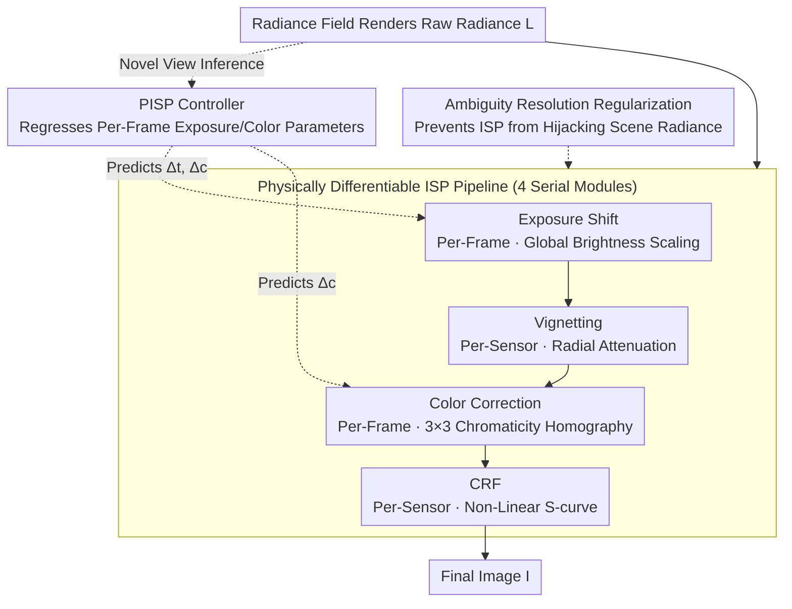

# PPISP: Physically-Plausible Compensation and Control of Photometric Variations in Radiance Field Reconstruction

**Conference**: CVPR 2026  
**Paper**: [CVF Open Access](https://openaccess.thecvf.com/content/CVPR2026/html/Deutsch_PPISP_Physically-Plausible_Compensation_and_Control_of_Photometric_Variations_in_Radiance_CVPR_2026_paper.html)  
**Code**: https://github.com/nv-tlabs/pisp  
**Area**: 3D Vision / Radiance Field Reconstruction / Novel View Synthesis  
**Keywords**: Radiance Field Reconstruction, Photometric Consistency, Differentiable ISP, Novel View Synthesis, Camera Imaging Modeling

## TL;DR
PPISP integrates a **physically differentiable ISP post-processing pipeline** (exposure shift -> vignetting -> color correction -> camera response function) after radiance field reconstruction. It models multi-view photometric inconsistencies by explicitly decoupling them into "per-sensor" and "per-frame" attributes. Additionally, it trains a **controller** to predict per-frame parameters for novel views, mimicking the auto-exposure/auto-white-balance of real cameras. This enables fair evaluation without ground-truth (GT) target images, achieving SOTA performance on multiple benchmarks.

## Background & Motivation
**Background**: Multi-view reconstruction methods such as 3DGS/NeRF can synthesize high-fidelity novel views, but their core assumption relies on **photometric consistency**—the color of the same 3D point should remain consistent across different viewpoints. In real-world captures, camera optical properties (vignetting, lens) and ISP settings (exposure time, white balance) change over time, resulting in contradictions in tone, brightness, and contrast among multiple input images of the same scene, which directly violates this assumption.

**Limitations of Prior Work**: The mainstream remedy is to add optimizable parameters per frame/per camera to absorb these photometric residuals—typically via GLO latent vectors in NeRF-W, affine color transformations in URF, or bilateral grids in BilaRF. However, these methods suffer from three systematic issues: (1) **Excessive capacity is counterproductive**: although high-capacity, weakly constrained modules can boost the PSNR of training views, they overfit to and reconstruct factors that do not belong to photometric variation, thereby degrading novel view quality; (2) **Inexplicable and uncontrollable**: the parameters learned by GLO/BilaRF act as black-box latent variables, making manual adjustment of brightness or white balance impossible; (3) **Infeasible for novel views**: since parameters are optimized independently per frame, it is impossible to determine their values when synthesizing entirely new viewpoints.

**Key Challenge**: The root cause is that existing modules **entangle "per-sensor intrinsic properties" with "per-frame capture settings"**. Vignetting and camera response functions (CRFs) are fixed camera-specific characteristics constant throughout the video, whereas exposure and white balance vary per frame as adjusted automatically by the ISP. Tangling these two aspects prevents generalization to novel views and forces evaluation protocols to **peek at the GT target image** (aligning via affine/quadratic polynomials before calculating metrics), which deviates from real-world scenarios (where GT novel views are unavailable during deployment) and masks the true differences between different methods.

**Goal**: (1) Decouple these two types of effects in a physically-plausible manner; (2) Enable auto-determination of correct exposure and color for novel views without requiring GT images; (3) Provide an intuitive and controllable manual adjustment interface.

**Key Insight**: Since the problem stems from "inaccurate modeling of the camera imaging process", one should **faithfully model the image formation process of real cameras**—where exposure, vignetting, color, and CRF each play their distinct roles under strict physical constraints (e.g., the exposure module can only scale overall brightness), naturally leading to decoupling.

**Core Idea**: Replace black-box appearance modules with a **physically-grounded differentiable ISP pipeline**, and employ a **controller** that mimics the camera's auto-exposure/white-balance to regress per-frame parameters for novel views.

## Method

### Overall Architecture
PPISP is a **reconstruction-agnostic post-processing operator**: after the radiance field (3DGUT / GSplat / Zip-NeRF) renders the "raw radiance" $\mathbf{L}$, it passes through four physical modules sequentially to yield the final image $\mathbf{I}$. Training is divided into two phases. The first phase **jointly optimizes** the scene representation and the four ISP modules for 30k steps (the individual ISP parameters of each frame/camera are learned alongside reconstruction). The second phase freezes everything and trains only the **controller** for 5k steps, teaching it to predict per-frame parameters directly from the rendered radiance, thereby eliminating novel view inference dependency on training-frame-specific parameters.

The four modules are strictly ordered according to camera imaging physics: the first three (exposure, vignetting, color) perform **linear** operations on radiance, and the final CRF performs a **non-linear** mapping, corresponding to the imaging model of Debevec & Malik. Among them, vignetting and CRF are **per-sensor** (shared across the sequence), while exposure shift and color correction are **per-frame**—this per-sensor/per-frame partitioning is precisely where the "decoupling" is realized.

### Key Designs

**1. Decoupled Physical ISP Pipeline: Explicitly Modeling Multi-View Appearance Variations by Separating "Per-Sensor Intrinsics" and "Per-Frame Settings"**

Addressing the pain point that "existing modules entangle camera-specific intrinsics and per-frame settings, resulting in excessive capacity and overfitting", PPISP replaces black boxes with four modules, each having **distinct physical meanings and strictly constrained scopes of action**. **Exposure shift** uses a base-2 power function to scale radiance globally per frame, $\mathbf{I}^{\mathrm{exp}} = \mathbf{L}\,2^{\Delta t}$, mimicking the exposure value (EV) in photography, with $\Delta t$ defined per frame—it can only adjust global brightness and cannot alter colors. **Vignetting** follows Goldman's model to represent radial attenuation per color channel using a polynomial of the squared distance to the optical center: $v(r)=\mathrm{clip}_{(0,1)}(1+\alpha_1 r^2+\alpha_2 r^4+\alpha_3 r^6)$, where the optical center $\boldsymbol{\mu}$ and coefficients $\boldsymbol{\alpha}$ are optimizable (initialized to the image center and $\boldsymbol{\alpha}=0$); since it is per-channel, it can model colored vignetting. To decouple **color correction** from exposure, a $3\times3$ homography $\mathbf{H}$ operates on RG chromaticity and intensity (following Finlayson's representation), with intensity normalized via $n(\mathbf{x};\mathbf{H})$ to ensure it remains unchanged after transformation—this completely separates "white balance/color gamut adjustment" from "brightness adjustment"; $\mathbf{H}$ is constructed via cross products of predefined source/target chromaticity pairs using four chromaticity shifts $\Delta\mathbf{c}_k\ (k\in\{R,G,B,W\})$ (inspired by DeTone et al.). The **CRF** models the non-linear mapping from sensor irradiance to color using split-by-half power curves with four learning parameters $(\tau,\eta,\xi,\gamma)$, where the S-curve maintains $C^1$ continuity at the inflection point $\xi$ by setting $a, b$, followed by a gamma correction $[\cdot]^\gamma$. Each module is restricted to its designated physical task; physical constraints naturally prevent it from over-reconstructing scene properties—the fundamental reason why it does not degrade performance on novel views.

**2. PISP Controller: Enabling Auto-Exposure/White-Balance for Novel Views, Independent of GT Target Images**

The aforementioned exposure shift $\Delta t$ and chromaticity shifts $\{\Delta\mathbf{c}_k\}$ are **optimized per frame** and are only valid for training camera poses; no corresponding values exist when rendering an entirely new view—which is why prior methods are forced to "peek at the GT". PPISP resolves this by training a controller $\mathcal{T}(\cdot)$ to regress these parameters directly from the rendered raw radiance map: $(\Delta t,\{\Delta\mathbf{c}_k\}) = \mathcal{T}(\mathbf{L})$. Its role corresponds to auto-exposure (AE) and auto-white-balance (AWB) in real cameras—determining how much to expose and how to adjust white balance based on the image content. Structurally, it consists of a coarse feature extractor ($1\times1$ convolution + pooling to a $5\times5$ grid) followed by an MLP regressor with multiple output heads. Training occurs in the second phase: scene reconstruction and all per-camera ISP parameters are frozen, and the regressed parameters from the controller are sent through the ISP pipeline to optimize the controller using the same photometric loss as in the first phase. Consequently, during inference, novel views can self-consistently determine their appearance without requiring any GT pixels, making "fair evaluation without GT" possible for the first time. Moreover, scalar controls such as exposure compensation or EXIF bias can optionally be concatenated to the regressor inputs, facilitating metadata integration or manual control.

**3. Ambiguity Resolution Regularization: Preventing ISP Parameters from "Hijacking" Brightness and Color Belonging to Scene Radiance**

Joint optimization of scene radiance and ISP parameters possesses an inherent ambiguity—the same image can be rendered as "brighter scene + lower exposure" or "dimmer scene + higher exposure"; brightness and color can be arbitrarily transferred between the two sides. Without constraints, the ISP modules may overfit, violating their physical meaning. PPISP employs a Huber loss $\mathcal{L}_\delta$ along with four regularization terms to anchor parameters within physically reasonable ranges. The **brightness term** penalizes average exposure shift across frames $\frac{1}{F}\sum_f \Delta t^{(f)}$ (keeping average exposure close to 0 to prevent overall shift); the **color term** penalizes average chromaticity shift across frames $\frac{1}{F}\sum_f \Delta\mathbf{c}_k^{(f)}$; the **cross-channel variance term** $\mathrm{Var}_k(\boldsymbol{\theta}_{m,k})$ shrinks the per-channel parameter variance of vignetting/CRF modules to avoid local color casts; the **physical vignetting term** penalizes optical center shift $\lVert\boldsymbol{\mu}_k\rVert_2^2$ and softly constrains $\alpha_j\le0$ using $[\alpha_j]_+^2$ (ensuring attenuation rather than enhancement). The total regularization $\mathcal{L}_{\mathrm{reg}}=\mathcal{L}_b+\mathcal{L}_c+\mathcal{L}_{\mathrm{var}}+\mathcal{L}_{\mathrm{vig}}$ enforces strict boundaries on "who is responsible for brightness and who is responsible for color", serving as a crucial guarantee for the success of physical decoupling.

### Loss & Training
Two-phase training: **Phase 1** jointly optimizes the radiance field + the four ISP modules for 30k steps (with MCMC sampling enabled for 3DGS/3DGUT), monitored by photometric loss + the aforementioned $\mathcal{L}_{\mathrm{reg}}$. **Phase 2** freezes the reconstruction and all per-camera ISP parameters to train the controller alone for 5k steps using the same photometric loss. As an overall post-processing operator, it can be plug-and-played into various radiance field methods like 3DGUT, GSplat, and Zip-NeRF.

## Key Experimental Results

### Main Results
Evaluated on Mip-NeRF 360, Tanks & Temples, BilaRF, HDR-NeRF, Waymo (9 static sequences), and the self-collected PPISP dataset (4 scenes × 3 cameras: iPhone 13 Pro, Nikon Z7, OM-1). Metrics include PSNR, SSIM, LPIPS, and RawNeRF-style affine-aligned **PSNR-C** (note that PSNR-C assumes access to the GT target image and can hide method discrepancies; the authors clarify that this is for reference only).

Novel view synthesis comparison using 3DGUT as the backbone (selected from Table 1, ↑ is better / LPIPS↓ is lower):

| Dataset | Method | PSNR↑ | PSNR-C↑ | SSIM↑ | LPIPS↓ |
|--------|------|------|------|------|------|
| BilaRF | + BilaRF | 21.41 | 25.63 | 0.764 | 0.371 |
| BilaRF | + ADOP | 22.95 | 25.73 | 0.802 | 0.376 |
| BilaRF | + PPISP (w/ ctrl.) | **24.12** | 25.92 | **0.820** | **0.349** |
| Mip-NeRF 360 | Base 3DGUT | 27.74 | 27.65 | 0.821 | 0.262 |
| Mip-NeRF 360 | + BilaRF | 24.97 | 26.64 | 0.801 | 0.260 |
| Mip-NeRF 360 | + PPISP (w/ ctrl.) | **28.15** | **28.06** | 0.821 | 0.264 |
| Tanks & Temples | + BilaRF | 19.78 | 23.46 | 0.770 | 0.298 |
| Tanks & Temples | + ADOP | 20.28 | 24.20 | 0.769 | 0.323 |
| Tanks & Temples | + PPISP (w/ ctrl.) | **24.62** | **25.25** | **0.809** | **0.285** |

Key Observation: On Tanks & Temples, PPISP's PSNR (24.62) even outperforms BilaRF's PSNR-C (23.46, which peeks at GT) by nearly 1.2 dB. On datasets with naturally minimal photometric variation like Mip-NeRF 360, high-capacity modules like BilaRF/ADOP actually degraded the base performance of 27.74 to 24.97/26.42, whereas PPISP improved it to 28.15—confirming the "capacity overfitting" pain point. These gains successfully transfer from 3DGUT to 3DGS and Zip-NeRF backbones.

### Ablation Study
The core ablation focuses on the presence/absence of the controller (w/o ctrl. indicates zero per-frame correction for novel views), as well as the gap between PSNR and PSNR-C:

| Configuration | Key Phenomenon | Explanation |
|------|---------|------|
| PPISP w/o ctrl. | Novel views can only use zero correction | Serves as the lower bound when per-frame parameters are not predicted |
| PPISP w/ ctrl. | PSNR is close to PSNR-C| The AE/AWB learned by the controller is almost equivalent to peeking at GT for post-hoc affine alignment |

Taking Tanks & Temples / 3DGUT as an example: w/o ctrl. PSNR increases from 21.52 to 24.62 w/ ctrl., representing a ~3.1 dB improvement yielded by the controller. On most datasets, the PSNR with the controller closely approaches its PSNR-C, demonstrating that the controller **faithfully predicts the required appearance correction for each frame**, with BilaRF being the only notable exception. The paper also provides a capacity-overfitting analysis (Sec. 5.4) supporting the conclusion that "high-capacity appearance modules inflate PSNR on training views but degrade novel views."

### Key Findings
- The controller is the largest contributor to novel view quality: removing it forces novel views to fallback to zero correction, causing the largest performance decline (~3 dB on Tanks & Temples).
- Physical constraints + regularization ensure that PPISP does not degrade the backbone on datasets with minimal photometric variation, whereas black-box methods generally drop performance on such datasets—demonstrating that capacity overfitting is a real pitfall.
- The closeness of PSNR to PSNR-C can be directly used as a metric to measure "whether the controller has learned the AE/AWB behavior of a real camera."

## Highlights & Insights
- **Exposing the "cheating" of evaluation protocols**: The authors explicitly point out that the existing protocol of peeking at the GT for post-hoc affine alignment is unrealistic and covers up discrepancies between methods. They quantify this via the PSNR vs. PSNR-C comparison, and then make "GT-free evaluation" truly viable via a controller—this is a methodological contribution rather than just benchmark optimization.
- **Physical constraints acting as regularization**: The design where four modules "each govern their own domain without overstepping" acts as a strong inductive bias, which is more fundamental than "adding regularization to shrink model capacity"; this explains why the method improves performance even on datasets with minimal photometric variations.
- **Controller as learnable AE/AWB**: Integrating established camera auto-exposure/white-balance mechanisms into radiance field post-processing is a highly transferable idea for any rendering task requiring "appearance determination for novel views" (e.g., relighting, HDR synthesis, cross-camera reconstruction).
- Plug-and-play capability into 3DGUT, GSplat, and Zip-NeRF, and support for concatenating EXIF metadata into the controller render it highly practical for engineering deployment.

## Limitations & Future Work
- The controller exhibits clear bias on the BilaRF dataset (the largest gap between PSNR and PSNR-C), indicating that for some complex, pixel-wise photometric variations, a controller with purely per-frame global parameters lacks sufficient expressiveness.
- The pipeline models relatively "regularized" ISP effects (exposure, vignetting, white balance, CRF), and may still struggle with local color shifts or highly non-linear tone mapping (evidenced by the authors specifically adding cross-channel variance regularization to suppress local color deviations).
- The self-collected PPISP dataset features only 4 scenes × 3 cameras, which is limited in scale; the ADOP baseline required a ~100× increase in CRF regularization strength for stability, introducing implementation-level caveats in cross-method comparison.
- Future Directions: Extending the controller from global parameters to spatially adaptive ones (requiring caution to avoid falling back into the "capacity overfitting" trap); incorporating richer camera metadata priors.

## Related Work & Insights
- **vs. GLO (NeRF-W) / GS-W**: These methods use per-image latent vectors to absorb appearance variations, which is smooth but acts as a black box and can easily entangle geometry/reflectance, leaving novel view parameters unresolved. PPISP uses physical modules for decoupling and a controller to address novel view parameters.
- **vs. URF / BilaRF**: URF uses per-image affine color transformations while BilaRF employs per-pixel affine matrices via bilateral grids. These have massive capacity but lack interpretability, and require peeking at the GT for novel views. PPISP is physically constrained in capacity, controllable, and does not require GT.
- **vs. ADOP**: The closest prior work which also explicitly models exposure/white balance/CRF/vignetting, but PPISP achieves better decoupling between exposure shift and white balance, utilizes a more compact CRF model, and adds a controller to predict novel view parameters.
- **vs. HDR-NeRF / Huang et al. / Niemeyer et al.**: The latter recover CRF from multi-exposure setups or learn 3D exposure neural fields (predicting exposure per 3D point). PPISP follows a per-frame plus controller approach, which aligns closer to the semantics of actual camera AE/AWB.

## Rating
- Novelty: ⭐⭐⭐⭐ Physically decoupled ISP + controller to resolve novel view parameters and enable GT-free evaluation; a solid approach that directly addresses pain points in existing protocols.
- Experimental Thoroughness: ⭐⭐⭐⭐⭐ 5+ public datasets + self-collected multi-camera dataset, covering three backbones (3DGUT/3DGS/Zip-NeRF); the PSNR vs. PSNR-C comparison design is highly ingenious.
- Writing Quality: ⭐⭐⭐⭐ Physical modeling is clearly described with complete equations; despite having multiple modules, the logical flow is smooth.
- Value: ⭐⭐⭐⭐⭐ Plug-and-play, controllable, promotes fair evaluation without GT, and offers high value for real-world scene reconstruction deployment.

<!-- RELATED:START -->

## Related Papers

- [\[CVPR 2026\] Recovering Physically Plausible Human-Object Interactions from Monocular Videos](recovering_physically_plausible_human-object_interactions_from_monocular_videos.md)
- [\[CVPR 2026\] Geometric-Photometric Event-based 3D Gaussian Ray Tracing](geometric-photometric_event-based_3d_gaussian_ray_tracing.md)
- [\[CVPR 2026\] Radiance Meshes for Volumetric Reconstruction](radiance_meshes_for_volumetric_reconstruction.md)
- [\[CVPR 2026\] DiffSoup: Direct Differentiable Rasterization of Triangle Soup for Extreme Radiance Field Simplification](diffsoup_direct_differentiable_rasterization_of_triangle_soup_for_extreme_radian.md)
- [\[CVPR 2026\] OLATverse: A Large-scale Real-world Object Dataset with Precise Lighting Control](olatverse_a_large-scale_real-world_object_dataset_with_precise_lighting_control.md)

<!-- RELATED:END -->
