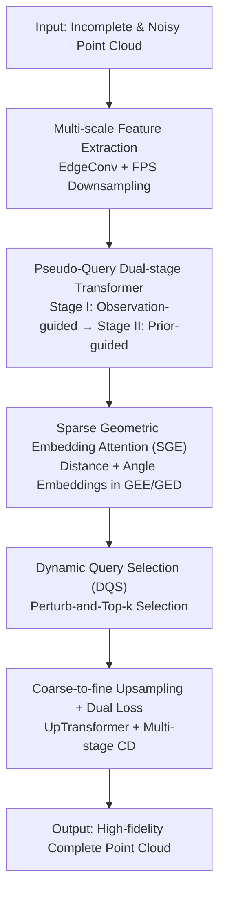

# PQDT: Pseudo-Query Dual Transformer for Robust Point Cloud Restoration

**Conference**: CVPR 2026  
**Paper**: [CVF Open Access](https://openaccess.thecvf.com/content/CVPR2026/html/Wu_PQDT_Pseudo-Query_Dual_Transformer_for_Robust_Point_Cloud_Restoration_CVPR_2026_paper.html)  
**Code**: https://github.com/ins-uni-bonn/PQDT  
**Area**: 3D Vision  
**Keywords**: Point cloud restoration, pseudo-query, Transformer, geometric embedding, dynamic query selection

## TL;DR
PQDT utilizes a "Pseudo-Query Dual-stage Transformer" to unify three types of point cloud degradations—completion, denoising, and deformation. It first generates a batch of noise-resistant pseudo-query anchors guided by observations, then refines them using shape priors. Combined with sparse geometric embedding attention and dynamic query selection, it achieves new SOTA performance on ShapeNet-55/34 and three newly established degradation datasets.

## Background & Motivation

**Background**: Real-world point clouds often suffer from simultaneous degradations including incompleteness, noise, outliers, and uneven density due to sensor precision and self/mutual occlusion. Mainstream point cloud completion methods follow an encoder-decoder route: extracting local points into 1D global features (bottleneck) via PointNet/PointNet++, and then decoding them into complete shapes (e.g., PCN, FoldingNet). Subsequent works like SnowflakeNet, SeedFormer, and PoinTr model the task as set-to-set translation, while AnchorFormer employs discriminative anchors instead of global projections.

**Limitations of Prior Work**: Decoding from a global bottleneck "pools" away fine-grained geometry, leading to the loss of local details. While seed/query-based methods preserve locality, their seeds are directly derived from input points. If the input contains noise, outliers, or geometric distortion, the seeds become contaminated, causing reconstruction quality to fluctuate sharply with input quality and resulting in poor robustness.

**Key Challenge**: Existing methods either over-rely on the input (failing when the input is corrupted) or over-rely on global priors (blurring details). There is a lack of a mechanism that adaptively adjusts between "fidelity to observation" and "reliance on learned shape priors" based on input quality.

**Goal**: To design a unified backbone with **point-cloud-only input** that adaptively recovers high-quality geometry under any combination of completion, deformation, and denoising degradations, without needing 2D image assistance.

**Key Insight**: The authors observe that instead of growing queries directly from contaminated inputs, it is better to generate "intermediate proxy entities" that refer to observations without being strictly bound by them, followed by two stages of purification and refinement.

**Core Idea**: The introduction of "pseudo-queries" auxiliary entities splits the Transformer into two complementary stages—**observation-guided** and **prior-guided**—coordinated with dynamic query selection to dynamically weight "input evidence" versus "shape priors."

## Method

### Overall Architecture
Given an incomplete and noisy input point cloud $\mathcal{P}^f_{src}$, PQDT first extracts coarse-level point features $\mathcal{F}^c_{src}$ via a lightweight transition-down module (DGCNN EdgeConv head + lightweight Transformer with layer-wise FPS downsampling) to obtain source queries $\mathcal{Q}_{src}=\{\mathcal{P}^c_{src},\mathcal{F}^c_{src}\}$. It then enters the dual Transformer: **Stage I (Observation-guided)** uses spherical sampled points $\mathcal{Q}_{sph}$ as static query initialization, encodes the input with a Geometric Embedding Encoder (GEE, $M_{E_1}$), and decodes via a Geometric Embedding Decoder (GED, $M_{D_1}$) in a DETR-like manner to generate intermediate entities. These are filtered via Dynamic Query Selection (DQS, $S_1$) to produce pseudo-queries $\mathcal{Q}_{ps}=\{\mathcal{P}_{pq},\mathcal{F}_{pq}\}$. **Stage II (Prior-guided)** feeds $\mathcal{Q}_{ps}$ into a second encoder $M_{E_2}$, augmented with randomly sampled input points, followed by refinement via $S_2$. Global pooled features $f_{g1}, f_{g2}$ from both encoders are aggregated to produce solid queries $\mathcal{Q}$. Finally, the GED decoder $M_{D_2}$ decodes $\mathcal{Q}$ and refined features $\mathcal{V}$ into point proxies $\mathcal{H}$, which are upsampled into the fine point cloud $\mathcal{P}^f_{pred}$ via a coarse-to-fine UpTransformer.

### Key Designs

**1. Pseudo-Query Dual-stage Transformer: Decoupling Observation Fidelity and Prior Trust**

This is the core of the paper, addressing the issue where corrupted inputs lead to corrupted seeds. While standard methods decode queries directly from global features/input seeds, PQDT splits the translation into two stages: $\mathcal{Q}_{ps}=S_1(M_{D_1}(\mathcal{Q}_{sph}, M_{E_1}(\mathcal{Q}_{src})), \mathcal{P}^c_{src})$ and $\mathcal{V},\mathcal{Q}=S_2(M_{E_2}(\mathcal{Q}_{ps}), \mathcal{P}^f_{src})$, with final $\mathcal{H}=M_{D_2}(\mathcal{Q},\mathcal{V})$. Stage I allows queries to attend broadly to the encoded input to "stabilize" coarse geometry from distorted observations, producing pseudo-queries. They are "pseudo" because they are **not used directly for decoding** but serve as intermediate anchors for further purification. Stage II refines these queries under stronger shape priors and performs "resampling and balancing" by aggregating $f_{g1}, f_{g2}$: the network relies more on shape priors in pseudo-queries when the input is sparse/damaged, and retains more input points as queries when the input is clean. This "stabilize-then-refine" mechanism makes it more robust than single-stage methods like AnchorFormer.

**2. Sparse Geometric Embedding Attention (SGE): Transformation-Invariant Spatial Awareness**

To address insufficient positional encoding in point cloud Transformers, the authors construct dense geometric structure embeddings $r_{i,j}=\mathbf{r}^D_{i,j}\mathbf{W}^D+\max_x\{\mathbf{r}^A_{i,j,x}\mathbf{W}^A\}$, where $\mathbf{r}^D$ encodes pairwise distances and $\mathbf{r}^A$ encodes triplet angles (both transformation invariants). To reduce the $O(M^2)$ cost, a sparse version $\mathcal{R}_s$ is constrained to $k$-nearest neighbors, reducing complexity to $\mathbb{R}^{M\times k\times C_e}$. Attention scores are calculated as $\text{head}=\text{softmax}\!\left(\frac{Q(K_f+K_r)^\top}{\sqrt{d_h}}\right)(V_f+V_r)$, injecting geometric cues directly into keys and values. This is integrated across $M_{E_1}, M_{E_2}, M_{D_1}, M_{D_2}$ to capture both local and global structures.

**3. Dynamic Query Selection (DQS): Representative Point Selection via Perturbed Top-k**

Since the quality of $\mathcal{H}$ depends on $\mathcal{Q}$ and $\mathcal{Q}_{ps}$, DQS ($S_1, S_2$) adaptively filters redundant or noisy candidates. Unlike learnable Gumbel-Top-k, the authors use a non-learnable **Perturb-and-Top-k**: candidate features are normalized $Z_{cand}$, Gumbel noise $g_i$ is added to get scores $s_i=z_i+\beta g_i$ (noise scale $\beta$ annealed from 1.0 to 0), and indices $I=\text{Top-}k(\{s_i\})$ are selected using a straight-through estimator for gradients. This controlled randomness encourages exploration and acts as a data-dependent regularizer, improving generalization over deterministic Top-k.

**4. Coarse-to-fine Upsampling & Dual Loss: Stabilizing Coarse Geometry**

After obtaining high-dimensional point proxies $\mathcal{H}$, they are treated as initial features $\mathcal{H}^\uparrow_0$ with query coordinates $\mathcal{P}_Q$ as seeds. The UpTransformer performs iterative refinement $\mathcal{P}^\uparrow_{l+1},\mathcal{H}^\uparrow_{l+1}=\text{UpTrans}(\mathcal{P}_Q,\mathcal{P}^\uparrow_l,\mathcal{H}^\uparrow_l)$. This avoids independent patch generation (like folding/MLP) and instead uses geometric context. Training uses multi-stage $L_1$ Chamfer Distance (CD): $\mathcal{L}_{rec}=\sum_{i=1}^{L}\text{CD}_{\ell 1}(\mathcal{P}^\uparrow_i,\text{FPS}(\mathcal{G},|\mathcal{P}^\uparrow_i|))$, where ground truth (GT) is downsampled to match the prediction point count. An additional constraint $\mathcal{L}_{pq}=\text{CD}_{\ell 1}(\mathcal{P}_{pq},\text{FPS}(\mathcal{G},|\mathcal{P}_{pq}|))$ ensures pseudo-queries align with the true geometry.

## Key Experimental Results

> Metrics: **CD** (Chamfer Distance, lower is better; CD-S/M/H indicate Simple/Moderate/Hard incompleteness); **F-Score@1%** (geometric matching at 1% threshold, higher is better).

### Main Results

PQDT leads across ShapeNet-55/34 tasks. On the CD-H (Hard) setting, it improves by 0.13 over AnchorFormer:

| Dataset Setting | Metric | PQDT | AnchorFormer | AdaPoinTr | SeedFormer |
|-----------------|--------|------|--------------|-----------|------------|
| 55 Categories Avg | $\text{CD}_{\ell 2}$ ↓ | **0.68** | 0.76 | 0.81 | 0.92 |
| 55 Categories Avg | F1 ↑ | **0.570** | 0.558 | 0.503 | 0.472 |
| 55 Categories Hard| CD-H ↓ | **1.13** | 1.26 | 1.24 | 1.49 |
| 34 Seen Cats | $\text{CD}_{\ell 2}$ ↓ | **0.60** | 0.70 | 0.73 | 0.83 |
| 21 Unseen Cats | $\text{CD}_{\ell 2}$ ↓ | **0.99** | 1.19 | 1.23 | 1.34 |

It also leads on the three new degradation datasets, especially on industrial free-form surfaces (PFS), where $\text{CD}_{\ell 2}$ is **76.8%** lower than the runner-up:

| Dataset | Metric | PQDT | Sub-optimal Baseline |
|---------|--------|------|----------------------|
| ShapeNet-Deform | $\text{CD}_{\ell 2}$ ↓ / F1 ↑ | **1.01 / 0.290** | 1.03 / 0.288 (AdaPoinTr) |
| ShapeNetCar-Occ | $\text{CD}_{\ell 2}$ ↓ / F1 ↑ | **0.82 / 0.261** | 0.85 / 0.251 (AdaPoinTr) |
| PFS | $\text{CD}_{\ell 2}$ ↓ / F1 ↑ | **0.16 / 0.834** | 0.69 / 0.603 (AdaPoinTr) |

### Ablation Study

Evolution from vanilla Transformer on ShapeNetCar-Occ:

| Config | Query | Seed | PE | $\text{CD}_{\ell 2}$ ↓ | F1 ↑ |
|--------|-------|------|----|----|----|
| A (Baseline) | Normal | Linear Proj. | Coord | 0.857 | 0.243 |
| B (+Pseudo+DQS) | Pseudo | Linear Proj. | Coord | 0.840 | 0.255 |
| C (+Query Dec.) | Pseudo | Query Dec. | Coord | 0.827 | 0.258 |
| PQDT (+GE) | Pseudo | Query Dec. | GE | **0.818** | **0.261** |

### Key Findings
- **Pseudo-Query + DQS contribute most**: Step B significantly reduces CD (-0.017) and increases F1 (+0.012), validating the dual-stage structure.
- **Query-based seed decoding** (replacing linear projection) further improves stability.
- **Geometric Embedding (GE)** provides the final performance gain.
- **Attention Visualization**: Unlike AnchorFormer's diffuse attention, PQDT's Stage II attention is highly concentrated on geometrically relevant regions, confirming the "coarse-to-fine" refinement mechanism.

## Highlights & Insights
- **Pseudo-queries as transferable intermediate representations**: Instead of growing queries from corrupted inputs, generating "semi-finished" anchors for later purification is a valuable design for any generative task with varying input quality.
- **Perturb-and-Top-k Stability**: The non-learnable approach is more stable than Gumbel-Top-k, with annealed noise acting as a robust data-dependent regularizer.
- **Sparse GE** injects distance/angle invariants into attention while controlling costs via $k$-NN, suitable for other point cloud Transformers.
- **Unified Benchmark**: Handling completion/deformation/denoising with one backbone on datasets like PFS (industrial car-in-white scenarios) shows clear practical orientation.

## Limitations & Future Work
- **Point-cloud-only**: Multi-modal methods (SuperPC, PCDreamer) were excluded from comparison; performance with 2D fused information is unexplored.
- **Synthetic-to-Real Gap**: Degradations are synthetic (Gabor noise, LiDAR ray-casting); generalization to real sensor data is not fully quantified.
- **Inference Overhead**: Dual stages and DQS likely increase runtime/parameters, which were not detailed in the main text.
- **Future Directions**: Extending pseudo-queries to colored/semantic point clouds or combining with diffusion-based generation for extreme missing data.

## Related Work & Insights
- **vs AnchorFormer**: Both use intermediate entities, but AnchorFormer is single-stage and noise-sensitive. PQDT is more robust (CD-H 0.99 vs 1.12).
- **vs AdaPoinTr**: AdaPoinTr uses auxiliary denoising tasks; PQDT uses a structural dual-stage mechanism to handle multiple degradations systematically.
- **vs PoinTr**: PQDT adopts the set-to-set paradigm but splits it into observation-guided and prior-guided stages with GE attention.
- **vs SuperPC (Diffusion/Multi-modal)**: SuperPC requires 2D images; PQDT is a pure 3D backbone.

## Rating
- Novelty: ⭐⭐⭐⭐ Combination of pseudo-query dual-stage and Perturb-and-Top-k is innovative.
- Experimental Thoroughness: ⭐⭐⭐⭐⭐ Comprehensive coverage across standard and custom degradation datasets.
- Writing Quality: ⭐⭐⭐⭐ Method is clear, though some symbols require careful diagram cross-referencing.
- Value: ⭐⭐⭐⭐ Robust backbone for practical industrial applications like the PFS dataset.

<!-- RELATED:START -->

## Related Papers

- [\[CVPR 2026\] GGPT: Geometry-Grounded Point Transformer](ggpt_geometry_grounded_point_transformer.md)
- [\[CVPR 2026\] LitePT: Lighter Yet Stronger Point Transformer](litept_lighter_yet_stronger_point_transformer.md)
- [\[CVPR 2026\] MORE-STEM: Long-Short MemOry REcall and Spatio-TEmporal Consistency Model for Query-Driven 3D/4D Point Cloud Segmentation](more-stem_long-short_memory_recall_and_spatio-temporal_consistency_model_for_que.md)
- [\[CVPR 2026\] SuP: Sub-cloud Driven Point Cloud Registration](sup_sub-cloud_driven_point_cloud_registration.md)
- [\[CVPR 2026\] Towards Visual Query Localization in the 3D World](towards_visual_query_localization_in_the_3d_world.md)

<!-- RELATED:END -->
