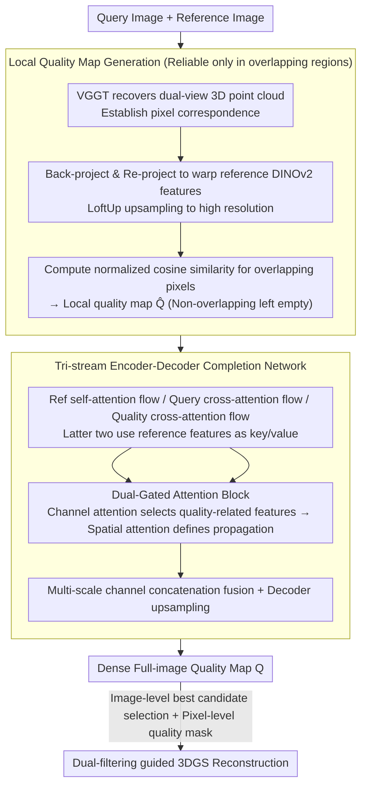

# PR-IQA: Partial-Reference Image Quality Assessment for Diffusion-Based Novel View Synthesis

**Conference**: CVPR 2026  
**arXiv**: [2604.04576](https://arxiv.org/abs/2604.04576)  
**Code**: [https://github.com/Kakaomacao/PR-IQA](https://github.com/Kakaomacao/PR-IQA)  
**Area**: 3D Vision / Image Quality Assessment  
**Keywords**: Image Quality Assessment, Cross-reference, Novel View Synthesis, 3D Gaussian Splatting, Diffusion Models

## TL;DR

This paper proposes PR-IQA, a cross-reference image quality assessment method that first computes geometrically consistent local quality maps in multi-view overlapping regions and then "completes" the quality information into non-overlapping regions via a reference-conditioned cross-attention network. This generates dense quality maps approaching full-reference accuracy, which are integrated into the 3DGS pipeline through a dual-filtering strategy to significantly improve sparse-view 3D reconstruction quality.

## Background & Motivation

**Background**: Diffusion models are increasingly important in sparse-view Novel View Synthesis (NVS)—they can generate pseudo-ground truth images to compensate for missing perspectives in 3D reconstruction pipelines like 3DGS. However, diffusion-generated images often contain photometric and geometric inconsistencies, and using them directly for supervision damages reconstruction quality.

**Limitations of Prior Work**: Full-Reference IQA (FR-IQA, e.g., PSNR/SSIM/LPIPS) requires pixel-aligned ground truth images, which are unavailable in NVS scenarios. No-Reference IQA (NR-IQA) does not require references but struggles to capture high-level geometric inconsistencies in diffusion-generated images. Cross-Reference IQA (CR-IQA) utilizes reference images from different poses for evaluation, but existing methods either only perform simple patch-level similarity (e.g., CrossScore uses SSIM), lacking semantic understanding, or are only effective in overlapping regions (e.g., MEt3R), leaving assessment dead zones.

**Key Challenge**: CR-IQA faces a dilemma—reliable quality estimates can be obtained via geometric alignment in overlapping regions, but non-overlapping regions cannot be directly evaluated. Simple patch similarity methods do not depend on overlap but have low accuracy; geometrically consistent methods have high accuracy but incomplete coverage.

**Goal**: Design a CR-IQA method that simultaneously leverages the geometric reliability of overlapping regions and the contextual reasoning capability of non-overlapping regions to generate dense full-image quality maps.

**Key Insight**: Reformulate the quality assessment of non-overlapping regions as a "quality map completion" problem—similar to image inpainting, but completing quality scores instead of pixels. Use reference images to provide cross-view context to guide the completion.

**Core Idea**: First calculate reliable local quality maps in overlapping regions, then use a reference-conditioned cross-attention network to "complete" local quality into dense full-image maps, achieving full-reference level accuracy without ground truth.

## Method

### Overall Architecture

The core challenge PR-IQA addresses is providing dense quality scores for diffusion-generated novel view images without pixel-aligned ground truth. The approach divides the image into "directly evaluable" and "non-evaluable" parts. The first stage calculates a reliable but partial quality map $\hat{Q}$ in the **geometrically overlapping regions** between the query and reference images—where true references are available for alignment, estimation is credible. The second stage treats this incomplete quality map as "anchors" and uses a tri-stream encoder-decoder network, utilizing the cross-view context provided by the reference image, to "complete" quality scores in non-overlapping regions, ultimately outputting a dense quality map $Q$. The process resembles image inpainting, replacing pixels with quality scores.

### Key Designs

**1. Local Quality Map Generation: Establishing reliable quality anchors in alignable overlapping regions**

Non-overlapping regions are difficult to assess due to lack of corresponding references; therefore, the method first solidifies the assessable overlapping regions. Specifically, VGGT is used to simultaneously recover dense 3D point clouds for both query and reference images to establish pixel correspondence. Then, reference DINOv2 features are warped to the query view coordinate system via back-projection and re-projection, followed by LoftUp to upsample features to high resolution. For each overlapping pixel $i$, the quality score is the normalized cosine similarity between the warped reference feature and the query feature:

$$\hat{Q}(i) = \text{CosSim}\big(F_q^{\text{DINO}}(i),\, F_{r \to q}^{\text{DINO}}(i)\big)$$

Non-overlapping pixels are left blank. This is reliable because geometric alignment ensures comparisons occur at spatially consistent homologous points, while DINOv2 features provide high-level semantic discriminative power—their combination makes quality estimation in overlapping regions sufficiently reliable to serve as the only "ground truth" for subsequent completion. Removing this branch in ablation causes SRCC to drop from 0.622 to 0.464, proving it is the foundation of the method.

**2. Tri-stream Encoder-Decoder Completion Network: Decoupling cross-view alignment and quality propagation**

Relying solely on overlapping quality scores is insufficient; they must be propagated to the entire image. The network features three encoding streams: the reference image uses a self-attention encoder $\text{Enc}_{\text{self}}^r$ to extract its own context, the query image uses a cross-attention encoder $\text{Enc}_{\text{cross}}^q$, and the local quality map uses a cross-attention encoder $\text{Enc}_{\text{cross}}^p$. Both cross-attention streams use reference features as key/value, explicitly injecting "how the reference view sees it" evidence at every scale. After each stage, query features and quality map features are fused via channel concatenation, and the decoder progressively upsamples to restore the full-resolution quality map. This design decouples "cross-view alignment" (via the reference branch) from "quality propagation" (via the local quality map branch).

**3. Dual-Gated Attention Block: Selecting quality-related features and determining propagation**

Quality completion essentially answers two questions: "which features are quality-related" and "to which positions should the reliable quality be propagated." This block draws inspiration from CBAM to solve these questions sequentially: first, channel attention (MLP-based re-calibration after max/avg pooling) filters for quality-related feature channels; then, spatial attention (spatial refinement via Q/K/V projection and softmax) determines the propagation direction. Decoupling "what features" and "where to propagate" is more stable than a single attention mechanism handling both tasks, allowing quality scores to flow from overlapping regions along semantically relevant paths.

### Loss & Training

The total loss consists of three parts: $\mathcal{L} = 0.5 \cdot \mathcal{L}_1^{\text{IQA}} + 1.0 \cdot \mathcal{L}_{\text{JSD}} + 0.25 \cdot \mathcal{L}_{\text{PLCC}}$. $\mathcal{L}_1^{\text{IQA}}$ ensures pixel-level accuracy, Jensen-Shannon Divergence $\mathcal{L}_{\text{JSD}}$ aligns the global score distribution, and Pearson Correlation Coefficient loss $\mathcal{L}_{\text{PLCC}}$ enforces linear consistency. Two variants are trained: targeting DINOv2 similarity maps or SSIM maps. The training uses the MFR dataset, with VDM generating 3 variants per frame, totaling 120k training pairs.

## Key Experimental Results

### IQA Performance (PLCC/SRCC, higher is better)

| Method | Type | Mip-NeRF 360 PLCC | Mip-NeRF 360 SRCC | Tanks&Temples PLCC | Tanks&Temples SRCC |
|------|------|-----------|-----------|-----------|-----------|
| LPIPS | FR-IQA† | 0.557 | 0.472 | 0.591 | 0.590 |
| PIQE | NR-IQA | 0.144 | 0.161 | 0.194 | 0.201 |
| PaQ-2-PiQ | NR-IQA | -0.088 | -0.107 | 0.039 | 0.118 |
| CrossScore | CR-IQA | 0.094 | 0.090 | 0.237 | 0.272 |
| PuzzleSim | CR-IQA | 0.304 | 0.327 | 0.351 | 0.369 |
| MEt3R* | CR-IQA | 0.105 | 0.129 | 0.142 | 0.153 |
| **Ours (DINOv2)** | CR-IQA | **0.555** | **0.622** | **0.573** | **0.650** |

### IQA-Guided 3DGS Reconstruction

| IQA Method | Mip-NeRF PSNR↑ | Mip-NeRF SSIM↑ | Mip-NeRF LPIPS↓ | T&T PSNR↑ | T&T SSIM↑ |
|---------|----------------|----------------|-----------------|-----------|-----------|
| Vanilla 3DGS | 16.08 | 0.461 | 0.415 | 15.30 | 0.509 |
| ViewCrafter (No IQA) | 16.18 | 0.474 | 0.453 | 15.77 | 0.523 |
| CrossScore | 16.31 | 0.476 | 0.431 | 15.86 | 0.537 |
| PuzzleSim | 16.35 | 0.482 | 0.423 | 15.94 | 0.541 |
| **Ours (DINOv2)** | **16.76** | **0.493** | **0.414** | **16.24** | **0.551** |
| DINOv2† (FR) | 17.18 | 0.498 | 0.399 | 16.78 | 0.562 |

### Ablation Study

| Variant | Mip-NeRF PLCC | Mip-NeRF SRCC | T&T PLCC | T&T SRCC | Note |
|------|--------------|--------------|----------|----------|------|
| Reverse attention order | 0.540 | 0.609 | 0.517 | 0.584 | Channel→Spatial is better |
| W/o channel attention | 0.554 | 0.611 | 0.571 | 0.633 | Channel attention helps |
| W/o reference branch | 0.544 | 0.613 | 0.553 | 0.637 | Reference provides context |
| W/o local quality map branch | 0.421 | 0.464 | 0.452 | 0.438 | **Most critical component** |
| Full model | 0.555 | 0.622 | 0.573 | 0.650 | - |

### Key Findings

- **Local quality map is the most critical input**: Removing it leads to an SRCC drop from 0.622 to 0.464 (-25.4%), far exceeding the impact of removing the reference branch (-1.4%). This proves that geometrically aligned quality estimation in overlapping regions is the foundation of the method.
- **PR-IQA approaches full-reference accuracy**: On Mip-NeRF 360, SRCC 0.622 vs. LPIPS (FR) 0.472 shows that PR-IQA even outperforms some FR metrics in terms of correlation, indicating effective cross-view information utilization compensates for the lack of ground truth.
- **NR-IQA is largely ineffective in NVS scenarios**: Negative correlation for PaQ-2-PiQ indicates general no-reference metrics cannot detect geometric inconsistencies in diffusion-generated images.
- **PR-IQA significantly outperforms other CR methods in 3DGS**: PSNR 16.24 vs. 15.94 for PuzzleSim on T&T, approaching the upper bound set by FR-IQA (DINOv2) at 16.78.

## Highlights & Insights

- **"Quality map completion" reformulation** is highly ingenious. It transforms the core difficulty of CR-IQA (evaluation of non-overlapping regions) into an image inpainting-like problem. This enables the direct reuse of mature reconstruction techniques like cross-attention and multi-scale fusion.
- **Dual-filtering strategy** tightly integrates IQA with 3DGS training—image-level selection of the best candidates combined with pixel-level quality masks to supervise only high-confidence regions.
- **Tri-stream encoder design** decouples "cross-view alignment" and "quality propagation." Injecting cross-view evidence via reference-conditioned cross-attention at every scale is significantly more effective than late fusion.

## Limitations & Future Work

- Dependency on VGGT for 3D correspondence and DINOv2 for feature extraction; the performance of these pretrained models directly affects the reliability of the local quality map.
- The completion network requires separate training for different FR targets (DINOv2-SIM or SSIM), lacking a unified quality representation.
- The quality threshold $\tau=50$ is heuristic; adaptive thresholding strategies for different scenarios remain to be explored.
- Validation is limited to pseudo-ground truth generated by specific video diffusion models (ViewCrafter); applicability to others (e.g., SV3D) is unknown.

## Related Work & Insights

- **vs MEt3R**: MEt3R also uses geometric alignment for CR-IQA but is restricted to overlapping regions. PR-IQA eliminates evaluation dead zones through its completion network, leading significantly in SRCC (0.622 vs 0.129).
- **vs CrossScore**: CrossScore uses cross-attention to estimate SSIM maps but operates at a patch level without geometric awareness. PR-IQA significantly outperforms CrossScore even on the SSIM target (0.556 vs 0.325).
- **vs PuzzleSim**: PuzzleSim uses feature-level cosine similarity, showing some correlation but lacking precision. PR-IQA’s geometric alignment + completion strategy provides more accurate quality estimation.

## Rating

- Novelty: ⭐⭐⭐⭐ Reformulating CR-IQA as quality map completion is novel; tri-stream design is well-reasoned.
- Experimental Thoroughness: ⭐⭐⭐⭐⭐ Comprehensive IQA comparison across three datasets + 3DGS application + detailed ablation.
- Writing Quality: ⭐⭐⭐⭐ Methods are clearly described; visual comparisons and motivations are strong.
- Value: ⭐⭐⭐⭐ Directly addresses the practical pain point of assessing diffusion-generated views for 3D tasks.

<!-- RELATED:START -->

## Related Papers

- [\[CVPR 2026\] SmokeSVD: Smoke Reconstruction from A Single View via Progressive Novel View Synthesis and Refinement with Diffusion Models](smokesvd_smoke_reconstruction_from_a_single_view_via_progressive_novel_view_synt.md)
- [\[CVPR 2026\] Splatent: Splatting Diffusion Latents for Novel View Synthesis](splatent_splatting_diffusion_latents_for_novel_view_synthesis.md)
- [\[CVPR 2026\] From None to All: Self-Supervised 3D Reconstruction via Novel View Synthesis](from_none_to_all_self-supervised_3d_reconstruction_via_novel_view_synthesis.md)
- [\[CVPR 2026\] R3-PCQA: Ray-Reprojection-Reinforcement for No-Reference 3D Point Cloud Quality Assessment](r3-pcqa_ray-reprojection-reinforcement_for_no-reference_3d_point_cloud_quality_a.md)
- [\[CVPR 2026\] Thermal is Always Wild: Characterizing and Addressing Challenges in Thermal-Only Novel View Synthesis](thermal_is_always_wild_characterizing_and_addressing_challenges_in_thermal-only_.md)

<!-- RELATED:END -->
