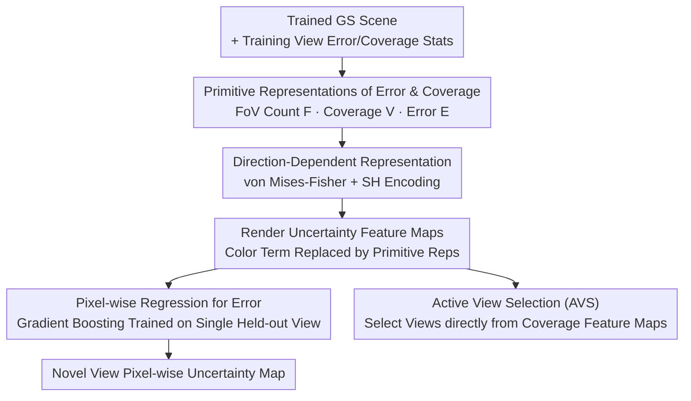

# PRIMU: Uncertainty Estimation for Novel Views in Gaussian Splatting from Primitive-Based Representations of Error and Coverage

**Conference**: CVPR 2026  
**Paper**: [CVF Open Access](https://openaccess.thecvf.com/content/CVPR2026/html/Gottwald_PRIMU_Uncertainty_Estimation_for_Novel_Views_in_Gaussian_Splatting_from_CVPR_2026_paper.html)  
**Code**: https://osvia.org/PRIMU  
**Area**: 3D Vision  
**Keywords**: Gaussian Splatting, Uncertainty Estimation, Novel View Synthesis, Active View Selection, Post-processing

## TL;DR
PRIMU is a **post-processing** uncertainty estimation (UE) framework for Gaussian Splatting (GS). It back-projects rendering error, coverage, and field-of-view (FoV) statistics from training views onto each Gaussian primitive to construct a set of "uncertainty feature maps" renderable from any novel view. A gradient boosting regressor, trained on a single held-out view, then directly predicts pixel-wise error. This approach achieves new SOTA results in both RGB and depth uncertainty estimation and enables active view selection using coverage feature maps.

## Background & Motivation

**Background**: Gaussian Splatting (GS) replaces the neural networks of NeRF with a collection of learnable 3D Gaussian primitives (position, covariance, opacity, color), offering fast rendering and explicit representation. To deploy GS in safety-critical scenarios like robotics or medical imaging, it is essential to quantify the reliability of rendered novel views via Uncertainty Estimation (UE).

**Limitations of Prior Work**: Most existing GS-based UE methods perform **per-primitive parameter uncertainty estimation**. These either utilize Fisher Information (FisherRF) or learn distributions over Gaussian parameters to calculate variance through multiple samplings (var3DGS, manifold), which is then rendered into pixel-wise uncertainty. Such methods often require modifications to the standard GS training/rendering pipeline, incur high computational overhead, or sacrifice rendering quality. Furthermore, they typically estimate "parameter blurriness" rather than actual "rendering error."

**Key Challenge**: Parameter uncertainty is not equivalent to the **prediction error** (the actual deviation in rendered color or depth). GS primitives often misalign with real geometry (correct appearance but biased depth), and simply quantifying parameter variance fails to capture these discrepancies.

**Goal**: To develop a **purely post-processing** UE that does not modify the GS pipeline or degrade rendering quality, directly predicting rendering/depth error to naturally align with downstream tasks (error estimation, view selection).

**Key Insight**: The authors observe that uncertainty arises from two interpretable sources: **insufficient training view coverage** (regions observed by few training views) and **reconstruction error in training views**. Back-projecting this information from 2D training views to 3D Gaussian primitives creates an interpretable representation that can be re-rendered from any novel view.

**Core Idea**: Replace per-primitive parameter variance with "primitive-based representations of error and coverage." Error, coverage, and FoV statistics are back-projected onto primitives, rendered into uncertainty feature maps, and then decoded into pixel-wise error using a lightweight regressor.

## Method

### Overall Architecture
PRIMU runs **after** GS training is complete without modifying the rendering or optimization. The process follows four steps: ① Collect statistics for each Gaussian primitive from training views, including the number of views observing it (FoV count), its contribution strength (coverage), and its contribution to reconstruction error (error). These are back-projected to form **Gaussian primitive representations**. ② Extend these into **direction-dependent** versions using von Mises-Fisher (vMF) spherical distributions and Spherical Harmonics (SH) encoding to make the UE view-aware. ③ Render **uncertainty feature maps** from any novel viewpoint by substituting the color term $c_k$ in the GS rendering formula with the aforementioned primitive representations. ④ Feed a set of feature maps into a pixel-wise **regression model** (gradient boosting), trained using the ground-truth error of a single held-out view, to output dense pixel-wise uncertainty for novel views. The representation includes 13 manual feature maps (1 FoV count + 6 coverage + 6 error).

### Key Designs

**1. Primitive Representations of Error and Coverage: Back-projecting Uncertainty Sources**

This is the foundation of the work, addressing the limitation that parameter variance misses real error. The authors define three primitive-level scalars. **FoV Count** $F(k)=|\Omega_k|$ records the number of training views whose frustum contains the $k$-th primitive ($\Omega_k$ is the set of views)—fewer views imply lower trust. **Coverage Representation** $V(k)=\max_{v\in\Omega}\text{agg}_{\bar x\in v(k)}\alpha_k(\bar x)T_k(\bar x)$ uses the primitive's contribution factor (opacity $\alpha_k \times$ cumulative transmittance $T_k$, the weight in GS rendering) aggregated ($\text{agg}\in\{\max,\text{sum},\text{mean}\}$) over visible pixels and maximized across training views to measure how strongly a primitive is covered by at least one view. **Error Representation** $E(k)=\text{mean}_{v\in\Omega}\text{agg}_{\bar x\in v(k)} e_{\bar x}\,\alpha_k(\bar x)T_k(\bar x)$ multiplies each contribution by the pixel-level $\ell_1$ reconstruction error $e_{\bar x}$ to characterize the primitive's contribution to overall rendering error. Coverage and error representations can optionally **omit the opacity term $\alpha_k$** to highlight semi-transparent Gaussians that still impact reconstruction. The key is "welding" 2D stats to 3D primitives so they re-render with the scene.

**2. Direction-Dependent Representation: View-Aware Uncertainty**

Uncertainty varies with direction as GS color is view-dependent. The authors use the von Mises-Fisher (vMF) distribution—the spherical analogue of a Normal distribution $f(\vec x;\vec\nu,\kappa)=\frac{\kappa}{2\pi\sinh(\kappa)}e^{\kappa\vec\nu^\top\vec x}$, where $\vec\nu$ is the mean direction and $\kappa$ controls concentration. Normalizing its peak to 1, they weight contributions to get direction-dependent versions: $V^*(k,\vec d)=\max_{v\in\Omega}\text{agg}\,\alpha_k T_k\, e^{\kappa\vec\nu_v^\top\vec d-\kappa}$, and similarly for $E^*(k,\vec d)$, where $\vec\nu_v$ is the training view direction and $\vec d$ is the evaluation direction. This effectively places a scaled vMF distribution around each primitive along its observed training view directions. For efficient rendering, these are encoded via **Spherical Harmonics**, mirroring GS's own color encoding.

**3. Rendering to Feature Maps + Pixel-wise Regression**

To convert primitive scalars into pixel-wise uncertainty, the authors reuse the GS rendering formula $C(\bar x)=\sum_k c_k(\vec d)\alpha_k(\bar x)T_k(\bar x)$, replacing color $c_k$ with a primitive representation to produce an **uncertainty feature map**. A subset of these maps is fed into a pixel-wise gradient boosting regressor. It is trained on the real error $e_{\bar x}=\|R(\bar x)-\hat R(\bar x)\|_1$ of **only one held-out view**, yet generalizes to other views and scenes. Ablations show gradient boosting significantly outperforms linear regression, especially in object-centric settings.

**4. Active View Selection (AVS)**

To select the most informative next training view, PRIMU-AVS **skips the regressor** entirely and uses a single direction-dependent, max-aggregated coverage feature map without opacity ${V^{(\alpha=1)}_{\max}}^*$. The goal is to maximize the volume of Gaussian primitives covered by the selected view. For new views, it selects the one with the **lowest mean pixel value** in this coverage map—representing the direction where current views provide the poorest coverage. It outperforms FisherRF and manifold on MipNeRF360 without using any held-out data.

### Loss & Training
PRIMU introduces no new loss for GS (post-processing). Only the pixel-wise regressor is "trained" using the $\ell_1$ error of a single held-out view. GS metrics (PSNR/SSIM/LPIPS) remain unchanged, a core advantage over stochastic sampling methods.

## Key Experimental Results

> Metrics: **AUSE** (Area Under the Sparsification Error, smaller is better); **Pears.** (Pearson correlation between uncertainty and error maps, higher is better).

### Main Results (Rendering Error UE)

Across LF, MipNeRF360, and LLFF datasets, PRIMU outperforms existing GS UE methods in AUSE and Pearson correlation while maintaining standard GS quality:

| Dataset | Metric | PRIMU* | PRIMU | FisherRF | manifold | var3DGS |
|---------|--------|--------|-------|----------|----------|---------|
| LF | AUSE ↓ | **0.286** | 0.291 | 0.753 | 0.435 | 0.688 |
| LF | Pears. ↑ | **0.351** | 0.337 | -0.13 | 0.099 | 0.102 |
| MipNeRF360 | AUSE ↓ | **0.378** | 0.391 | 0.738 | 0.52 | 0.52 |
| LLFF | AUSE ↓ | **0.281** | 0.284 | 0.988 | 0.545 | 0.476 |

The advantage in Depth UE (LF dataset) is even more pronounced, with Pearson correlation reaching 0.72:

| Method | AUSE ↓ | Pears. ↑ |
|--------|--------|----------|
| PRIMU* | **0.118** | **0.728** |
| PRIMU | 0.115 | 0.722 |
| BayesRays | 0.173 | 0.243 |
| FisherRF | 0.305 | 0.105 |
| manifold | 0.436 | 0.036 |

### Ablation Study

Isolated studies on Object-centric vs. Whole Scene, Single vs. Multiple views, and Regressor type (LF/TUM subsets):

| Setting | Model | Rendering UE AUSE ↓ | Depth UE AUSE ↓ |
|---------|-------|---------------------|-----------------|
| Whole Scene · 1 View | PRIMU (grad.) | 0.244 | 0.112 |
| Obj. Centric · 1 View | PRIMU (grad.) | **0.072** | **0.071** |
| Obj. Centric · 1 View | reg. FisherRF (grad.) | 0.119 | 0.133 |
| Obj. Centric · Multi-View | PRIMU (grad.) | 0.06 | 0.099 |
| Obj. Centric · 1 View | PRIMU (lin.) | 0.254 | 0.202 |

Active View Selection (MipNeRF360, after 20 views):

| Method | PSNR ↑ | SSIM ↑ | LPIPS ↓ |
|--------|--------|--------|---------|
| PRIMU-AVS | **20.721** | **0.625** | **0.34** |
| FisherRF | 20.392 | 0.586 | 0.363 |
| manifold† | 20.102 | 0.610 | 0.351 |

### Key Findings
- **Object-centric settings significantly outperform whole scenes**: AUSE < 0.1 and Pearson > 0.8 are achievable with one held-out view in centered scenes.
- **Gradient Boosting > Linear Regression**: Suggests a strong non-linear relationship between feature maps and error.
- **FoV Count + Max-pooled (No Opacity) Coverage maps are most informative**: FoV reflects regional visibility, while no-opacity coverage highlights semi-transparent Gaussians.
- **Cross-scene generalization**: Regressors can migrate to unseen scenes, implying feature maps capture a low-dimensional essence of UE.
- **Direction-dependency** provides small, stable gains for rendering UE but has little effect on depth UE.

## Highlights & Insights
- **"Back-protecting 2D error to 3D for re-rendering" is an elegant post-processing paradigm**: It uses the rendering engine itself as the UE propagator without degrading quality.
- **Direct error prediction vs. Parameter variance**: Explicitly distinguishing predictive uncertainty from parameter uncertainty is fundamental for downstream tasks and is a key differentiator from FisherRF.
- **"Free" Active View Selection**: Using a simple coverage map to find the "worst-covered" direction outperforms methods explicitly modeling information gain.
- **Ready for deployment**: 13 manual feature maps + light regression can be easily integrated into existing GS pipelines.

## Limitations & Future Work
- **Hand-crafted features**: 13 feature maps were manually designed; the optimal set might vary across datasets.
- **Whole-scene performance**: AUSE rises from <0.1 to 0.24+, indicating background/panorama UE requires further improvement.
- **Label noise**: Motion blur in datasets like TUM introduces 2D inconsistencies that affect regression labels.
- **Future Directions**: Making feature construction or aggregation learnable or optimizing them jointly with direction-dependent representations.

## Related Work & Insights
- **vs. FisherRF**: FisherRF estimates parameter uncertainty via the Fisher Information Matrix diagonal; PRIMU predicts actual error (predictive uncertainty), outperforming it even in view selection.
- **vs. var3DGS / manifold**: These require modified training and sampling, which increases compute; PRIMU is pure post-processing and achieves better AUSE/Pearson.
- **vs. BayesRays (NeRF)**: BayesRays is a Bayesian post-processing method for NeRF (depth UE only); PRIMU is designed for GS and handles both RGB and depth.

## Rating
- Novelty: ⭐⭐⭐⭐ The back-projection UE paradigm is a distinct and clever evolution for GS. 
- Experimental Thoroughness: ⭐⭐⭐⭐⭐ Extremely detailed across four datasets, multiple tasks, and ablations.
- Writing Quality: ⭐⭐⭐⭐ Clear motivation, though the density of feature names and tables requires focused reading.
- Value: ⭐⭐⭐⭐ A plug-and-play UE for GS that doesn't compromise quality—highly practical for safety-critical deployment.

<!-- RELATED:START -->

## Related Papers

- [\[CVPR 2026\] Coverage Optimization for Camera View Selection](coverage_optimization_for_camera_view_selection.md)
- [\[CVPR 2026\] Guardians of the Hair: Rescuing Soft Boundaries in Depth, Stereo, and Novel Views](guardians_of_the_hair_rescuing_soft_boundaries_in_depth_stereo_and_novel_views.md)
- [\[ICLR 2026\] Uncertainty Matters in Dynamic Gaussian Splatting for Monocular 4D Reconstruction](../../ICLR2026/3d_vision/uncertainty_matters_in_dynamic_gaussian_splatting_for_monocular_4d_reconstructio.md)
- [\[CVPR 2026\] Learning Compact 3D Representations from Feed-Forward Novel View Synthesis](learning_compact_3d_representations_from_feed-forward_novel_view_synthesis.md)
- [\[CVPR 2026\] Disco-GS: Gaussian Splatting in Dynamic Color Lighting](disco-gs_gaussian_splatting_in_dynamic_color_lighting.md)

<!-- RELATED:END -->
