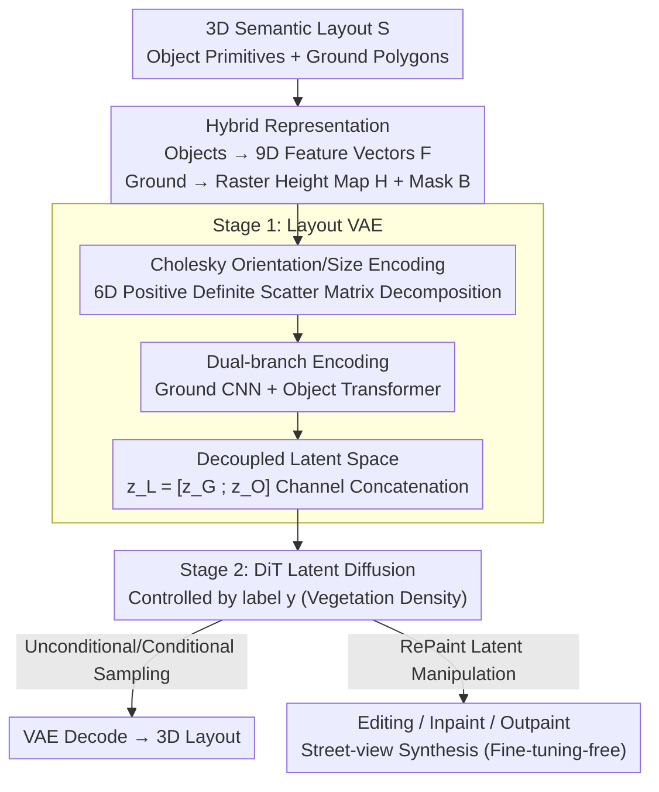

# PrITTI: Primitive-based Generation of Controllable and Editable 3D Semantic Urban Scenes

**Conference**: CVPR 2026  
**arXiv**: [2506.19117](https://arxiv.org/abs/2506.19117)  
**Code**: https://raniatze.github.io/pritti/ (Available; source code on project homepage)  
**Area**: 3D Vision / Diffusion Models  
**Keywords**: 3D semantic scene generation, primitive representation, latent space diffusion, editability, autonomous driving simulation

## TL;DR
PrITTI replaces voxels with a hybrid representation of "vectorized object primitives (cuboid/ellipsoid) + rasterized ground." It first utilizes a Layout VAE to compress 3D urban semantic layouts into a structured 2D latent space, then trains a Latent Diffusion Transformer (DiT) for controllable generation. It achieves SOTA on KITTI-360 with lower memory requirements, faster inference, and superior editability, naturally supporting downstream tasks such as scene editing, inpainting, outpainting, and street-view synthesis.

## Background & Motivation

**Background**: Large-scale 3D urban scene generation with semantic structures is fundamental to digital world modeling and autonomous driving simulation—enabling the creation of virtual worlds for safety verification, long-tail scenario testing, and perception/planning data synthesis. The vast majority of existing methods model 3D urban environments as **voxel grids** or hierarchical voxel structures (e.g., SemCity, PDD, XCube).

**Limitations of Prior Work**: Voxel representations suffer from three fundamental flaws. ① Memory grows cubically with resolution, making large scenes prohibitively expensive; ② Fixed spatial resolution limits detail, where tall objects (buildings, trees) are often "truncated" or distorted; ③ Editing is difficult—even translating a single car requires identifying and updating all related voxels and filling vacated areas, while boundaries between objects and background (e.g., car vs. road) are inherently blurry, making editing extremely cumbersome.

**Key Challenge**: Voxels are inherently **dense, fixed-resolution, and non-semantic** representations, whereas urban scene generation realistically requires **compact, compositional, and locally editable** representations. The choice of representation directly determines the extent of controllability and editability achievable, creating a fundamental tension between the two.

**Goal**: To find a memory-efficient, compositional representation that supports instance-level local editing for controllable and editable 3D semantic urban scene generation.

**Key Insight**: The authors advocate for a return to primitives—assembling scenes using a small number of semantically clear 3D elements (cuboids, ellipsoids, ground polygons). While primitives have been used in shape abstraction and scene parsing, they remain largely unexplored in **generative** settings, particularly for 3D semantic urban scenes. The difficulty lies in the fact that while cuboids/ellipsoids can be parameterized uniformly, ground polygons have arbitrary shapes and variable vertex counts, making them difficult to encode uniformly.

**Core Idea**: Breaking the impasse with a "hybrid representation"—**objects use parameterized primitives (vectors), while the ground uses rasterized BEV height maps (images)**. A two-stage "Layout VAE to 2D latent space → Latent space diffusion" approach is employed, with the latent space decoupled in the channel dimension for ground and objects, thereby unlocking controllable generation and fine-tuning-free local editing.

## Method

### Overall Architecture
PrITTI decomposes a 3D semantic layout $\mathcal{S}$ into two types of elements: object instances encoded as primitive feature vectors $\mathbf{F}$, and ground polygons rasterized into height maps $\mathbf{H}$ and occupancy masks $\mathbf{B}$. The pipeline consists of two stages: The first stage trains a **Layout VAE (LVAE)** using dual "raster + vector" branches of encoders/decoders to compress the layout into a compact 2D joint latent space $\mathbf{z}_\mathcal{L}$. The second stage trains a **DiT Diffusion Transformer** on this frozen latent space for controllable generation based on scene labels $y$. During inference, the diffusion model samples latent codes (unconditional or conditional on $y$), which are then decoded by the VAE into new 3D layouts. A RePaint-based latent space manipulation strategy allows downstream tasks like inpainting, outpainting, and editing to reuse the same pre-trained model **without any fine-tuning**.

### Key Designs

**1. Hybrid Representation of Object Vectors + Ground Raster: Leveraging Strengths of Arbitrary Ground Shapes and Parameterized Objects**

The prior limitation was that "cuboids/ellipsoids can be parameterized uniformly, but ground polygons have arbitrary shapes and variable vertex counts." PrITTI avoids a one-size-fits-all representation by dividing and conquering. The **ground** consists of 5 semantic classes (road, sidewalk, parking, terrain, ground). It employs ray-casting along the gravity direction to rasterize extruded 3D polygons into BEV height maps $\mathbf{H}\in\mathbb{R}^{H\times W\times 5}$ and binary occupancy masks $\mathbf{B}\in\{0,1\}^{H\times W\times 5}$, which are suitable for convolutional networks. **Objects** utilize 11 primitive classes (vegetation cuboid/ellipsoid, large/small vehicles, two-wheelers, humans, large/small buildings, poles, traffic control, others). Each primitive is represented by a 9D feature vector $\mathbf{f}_i\in[0,1]^9$, comprising a normalized 3D center $\mathbf{t}_i\in\mathbb{R}^3$ and 6D Cholesky parameters $\mathbf{c}_i\in\mathbb{R}^6$. The entire layout is $\boldsymbol{\mathcal{L}}=\{\mathbf{H},\mathbf{B},\mathbf{F}\}$, where $\mathbf{F}\in\mathbb{R}^{M\times 9}$ stores all $M$ object primitives. Compared to voxels, this representation is resolution-independent, has constant and low memory (only 2.52 MB per scene, with 2.50 MB for raster and only 0.02 MB for primitives), and defines objects at an instance level, allowing direct manipulation of single primitives for translation, scaling, or rotation.

**2. Orientation + Size Encoding via Cholesky Decomposition: Eliminating Rotation Symmetry Ambiguity with Unique 6D Parameterization**

Encoding object orientation and size using quaternions or eigen-decomposition often results in **multi-solution ambiguity** due to rotation symmetry (e.g., quaternion sign ambiguity where $q$ and $-q$ are equivalent). This leads to discontinuities in the loss surface during training and unstable optimization. PrITTI represents the 3D extent of an object as a positive definite scatter matrix and applies Cholesky decomposition to obtain 6D parameters $\mathbf{c}_i\in\mathbb{R}^6$, **jointly encoding orientation and size**. Since Cholesky decomposition is unique for positive definite matrices, it naturally eliminates ambiguities caused by rotation symmetry, improving training stability. Synthetic experiments using single vehicle primitives with random scales and yaw angles show that with increasing training samples, the mean IoU3D of Cholesky encoding rises steadily and stabilizes, while quaternion baselines saturate or even **degenerate as data increases** due to loss discontinuities.

**3. Channel-wise Decoupled Joint Latent Space + Dual-branch VAE: Segregating Ground and Objects for Ground-conditioned Object Generation**

The LVAE uses two encoders for the two modalities. The **Ground Encoder** $\mathcal{E}_\mathcal{G}$ (CNN) encodes raster maps into $\mathbf{z}_\mathcal{G}\in\mathbb{R}^{h\times w\times c}$ ($h=H/2^d$). The **Object Encoder** $\mathcal{E}_\mathcal{O}$ first appends a 10D learnable class embedding and a binary padding flag to each primitive's feature vector (padded to a fixed number per class for batch training), resulting in $\boldsymbol{\mathcal{F}}\in\mathbb{R}^{N\times 20}$. It passes through a Transformer encoder to model inter-primitive relationships, then uses **scatter-mean** to distribute features onto a 2D latent grid based on each primitive's normalized 2D center, averaging overlaps. This maintains permutation invariance while preserving spatial structure in the latent space. The two latent codes are concatenated along channels to form $\mathbf{z}_\mathcal{L}=[\mathbf{z}_\mathcal{G};\mathbf{z}_\mathcal{O}]\in\mathbb{R}^{h\times w\times 2c}$. During **decoding**, the latent code is split back: the ground uses a convolutional decoder $\mathcal{D}_\mathcal{G}$ to reconstruct raster maps, while the objects use a DETR-style Transformer decoder $\mathcal{D}_\mathcal{O}$—treating $\mathbf{z}_\mathcal{O}$ patches as tokens for key/value, with learnable object queries per class outputting $\boldsymbol{Q}\in\mathbb{R}^{N\times d_L}$ to predict centers $\hat{\mathbf{t}}_i$, Cholesky parameters $\hat{\mathbf{c}}_i$, and existence probabilities $\hat{p}_i$. The key benefit of this decoupled "ground/object channel split" is the ability to **inpaint only object channels while fixing ground channels**, achieving zero-shot "object generation conditioned on ground" (e.g., generating cars specifically on roads).

**4. RePaint-style Latent Space Manipulation: Zero-shot Inpainting, Outpainting, and Editing with a Single Pre-trained Model**

The second stage trains a diffusion model $\epsilon_\theta(\mathbf{z}_\mathcal{L}^t,t,y)$ on the frozen LVAE latent space. The scene label $y$ controls vegetation density (low/medium/high), injected via a Transformer backbone with adaLN-Zero, and MSE is used to predict Gaussian noise. Downstream editing leverages **RePaint**: a binary mask identifies editable regions in the 2D latent space. During sampling, denoising of unknown regions is **synchronized** with noisy versions of known regions, enabling local editing while maintaining global structure (e.g., redrawing only the left half of a scene). **Outpainting** uses a sliding window strategy to extend layouts—each new block overlaps by 50% with adjacent blocks to ensure spatial consistency, first expanding along primary directions and then filling corners. All these tasks reuse the same latent space manipulation mechanism without per-task fine-tuning.

### Loss & Training
The Stage 1 (LVAE) objective function combines raster loss, vector loss, and KL divergence on the joint latent space. **Ground Raster**: Height maps use L1 loss (averaged only on occupied pixels), and occupancy masks use binary cross-entropy (BCE). **Object Primitives**: Predicted instances and ground truths are first matched **within each category** using the Hungarian algorithm. The matching cost comprises (i) BCE for existence probability, (ii) L1 for center position, and (iii) L1 for Cholesky parameters. Post-matching, losses are calculated per category, normalized by the number of true instances in the batch, and averaged. Stage 2 (DiT): Diffusion is trained on joint latent codes from the frozen LVAE using a DiT-B backbone and DDPM noise schedule, with 250-step DDPM sampling. During layout reconstruction, height maps are merged into a single height field and extruded as triangle meshes, while primitives with probability above a threshold are placed according to predicted centers and Cholesky parameters, handling both sparse and dense scenes.

## Key Experimental Results

Dataset: KITTI-360, each layout covering $64\,\text{m}\times 64\,\text{m}$ centered on the ego-vehicle, grouped into 16 classes based on semantic and scale similarity. The split includes **61,913 training / 1,233 test** poses; Argoverse 2 results are provided in the supplement. Implementation uses raster resolution $H=W=256$, downsampling factor $d=8$, and latent channels $c=32$. Object encoders/decoders use 6 Transformer layers each; the decoder handles $N=514$ object queries. Diffusion uses DiT-B + DDPM. Baselines include voxel methods SemCity, PDD, and XCube.

### Main Results (Stage 1: 3D Semantic Scene Reconstruction, finest resolution $256^2\times 32$)

| Method | Size (MB)↓ | IoU↑ | mIoU↑ |
|------|-----------|------|-------|
| SemCity | 8.00 | 81.75 | 70.52 |
| SemCity-1M (1M Queries) | 8.00 | **97.69** | **93.81** |
| XCube | 3.05 | **99.97** | 79.47 |
| **Ours (voxelized)** | **2.52** | 90.58 | 70.27 |

Ours requires only 2.52 MB per scene (2.50 MB raster + 0.02 MB primitives), significantly lower than SemCity (8.00 MB) and XCube (3.05 MB). Note that Ours is natively a primitive representation and must be **forcibly voxelized** for comparison (introducing errors not present in native voxel methods); even so, reconstruction quality remains competitive. While voxel methods can save memory at low resolutions (e.g., SemCity $128^2\times16$), they fail to scale—high resolutions either cause memory explosions or severe artifacts during upsampling, presenting a clear "memory vs. reconstruction quality" trade-off; Ours remains **resolution-independent with constant, low memory**.

### Main Results (Stage 2: 3D Semantic Scene Generation)

Generation is evaluated using Precision, Recall, FID, and Inception Score (IS) for fidelity and diversity. Reference and generated sets are rendered as $256^2$ bird's-eye semantic maps. Ours samples equal numbers for low/medium/high vegetation labels using 250-step DDPM without classifier-free guidance, whereas baselines use unconditional generation. The paper reports that Ours **outperforms voxel baselines** in generation quality, diversity, and editability while maintaining lower memory and faster inference. ⚠️ Specific FID/IS/Prec./Rec. values were not in the provided excerpt; refer to Tab. 3 in the original paper.

### Ablation Study (Tab. 2: Latent Space Splitting and Joint Training)

| Configuration | Raster MSE ($\times10^{-2}$)↓ | IoU↑ | AP3D↑ | AP3D@50↑ | Description |
|------|------|------|-------|----------|------|
| Default (Full) | 0.75 | 99.96 | **62.12** | **46.96** | Joint latent + splitting at decoding |
| w/o latent split | 3.55 | 99.70 | 53.78 | 39.09 | Both decoders use joint latent $\mathbf{z}_\mathcal{L}$ |
| w/o objects | 0.59 | 99.96 | — | — | Ground branch only |
| w/o ground | — | — | 60.28 | 46.37 | Object branch only |

### Key Findings
- **Latent splitting is crucial**: Removing "channel-wise splitting" causes AP3D to drop from 62.12 to 53.78 and Raster MSE to worsen from 0.0075 to 0.0355, indicating that each decoder benefits from domain-specific features and that sharing the same representation for both ground and objects causes interference.
- **Joint training facilitates semantic alignment**: Compared to independent training, separate training slightly improves height map MSE (0.0059 vs. 0.0075), but joint training yields higher AP3D (62.12 vs. 60.28)—the shared latent space promotes semantic alignment, allowing objects to be **placed in a context-aware manner** (e.g., cars on roads).
- **Cholesky outperforms quaternions**: Synthetic experiments show that as training data increases, Cholesky mean IoU3D rises steadily and is more stable, while quaternion baselines saturate or degenerate (due to sign ambiguity causing loss discontinuities), confirming the value of unique parameterization in eliminating rotation symmetry ambiguity.

## Highlights & Insights
- **The "Object Vector + Ground Raster" hybrid representation** is the most ingenious aspect of the paper: it does not dogmatically adhere to a single representation but acknowledges that "parameterized objects" and "arbitrary ground shapes" are fundamentally different, allowing each to use the most suitable medium before unifying them in a 2D latent grid—achieving the compactness/editability of primitives while avoiding the difficulty of encoding complex polygons.
- **Orientation + size encoding via 6D Cholesky decomposition** is a directly transferable trick: any task requiring 3D box orientation/size regression (3D detection, layout generation, pose estimation) can use Cholesky decomposition of a positive definite scatter matrix instead of quaternions to eliminate rotation symmetry ambiguity and stabilize training.
- **Channel-wise decoupling provides a "free" capability**: Segregating ground and objects into different channel groups, originally intended to prevent interference, inadvertently unlocks "object generation conditioned on ground" without supervision—an emergent capability of representation design rather than additional training objectives.
- **Shared latent mechanism for generation and editing**: By leveraging RePaint to transform editing, inpainting, and outpainting into "latent local denoising," the model is pre-trained once and applied to downstream tasks with zero fine-tuning, which is highly efficient for engineering.

## Limitations & Future Work
- **Forced voxelization for comparison**: Ours is natively based on primitives; for reconstruction comparisons, it must be voxelized, introducing external errors. Thus, reconstruction metrics in Tab. 1 are not entirely fair; its true advantages lie in generation and editing.
- **Representation is an abstract semantic layer, not geometric detail**: Ours emphasizes "controllable semantic layouts" rather than appearance or geometric fidelity. It generates abstract scenes composed of cuboids/ellipsoids; photo-realistic street views must be synthesized downstream.
- **Controllability currently focuses on vegetation density**: The control label $y$ in the main paper focuses on vegetation density (low/medium/high). While it is claimed to generalize to other categories (see supplement), the controllable dimensions in the main experiments are relatively singular.
- **Dependence on primitive annotations**: The method requires datasets with 3D primitive annotations (KITTI-360 / Argoverse 2). Scenes lacking such annotations would require additional labeling or fitting workflows.
- ⚠️ Since this summary is based on truncated text, precise values for the generation table (FID/IS/Prec./Rec.) are omitted; please refer to Tab. 3 and the supplemental material in the original paper.

## Related Work & Insights
- **vs. Voxel Methods (SemCity / PDD / XCube)**: These use voxel grids or hierarchical voxels with latent diffusion, limited by cubic memory, fixed resolution, and difficulty in editing. Ours uses a hybrid primitive + raster representation that is resolution-independent, memory-efficient, and instance-level editable.
- **vs. 2D Abstract Layout Generation (e.g., SLEDGE)**: These methods use agent bounding boxes or lane graphs for 2D abstraction. Ours directly models **3D** scenes with richer primitive types, more semantic classes, and more flexible ground geometry than 2D polylines.
- **vs. Indoor/Object-level Primitive Generation (SPAGHETTI / SALAD)**: Past primitive generation focused on single objects or indoor scenes for part-level abstraction. Ours maps each primitive to an **object instance** for 3D semantic layout generation, supporting scene-level operations and representing the first systematic exploration of primitives in outdoor large-scale generative settings.
- **vs. Appearance-driven 3D Scene Generation (NeRF / 3DGS)**: These pursue photo-realism but treat the scene as a whole, lacking explicit object-level structure. Ours prioritizes controllable semantic layouts, trading appearance for instance-level control and high-level manipulation capabilities.

## Rating
- Novelty: ⭐⭐⭐⭐⭐ The first framework to use coarse 3D bounding primitives for city-scale controllable and editable 3D semantic scene generation. The hybrid representation + Cholesky encoding + decoupled latent space are all highly innovative.
- Experimental Thoroughness: ⭐⭐⭐⭐ Complete KITTI-360 main experiments + Argoverse 2 + multiple ablations, though precise generation values were absent from this excerpt (⚠️ see original paper).
- Writing Quality: ⭐⭐⭐⭐ Clear motivation and well-explained representation design; hybrid representation and latent details are somewhat dense.
- Value: ⭐⭐⭐⭐⭐ Low memory, editable, and fine-tuning-free downstream applications provide direct utility for autonomous driving simulation and digital world modeling.

<!-- RELATED:START -->

## Related Papers

- [\[CVPR 2026\] WeatherCity: Urban Scene Reconstruction with Controllable Multi-Weather Transformation](weathercity_urban_scene_reconstruction_with_controllable_multi-weather_transform.md)
- [\[CVPR 2026\] DepthFocus: Controllable Depth Estimation for See-Through Scenes](depthfocus_controllable_depth_estimation_for_see-through_scenes.md)
- [\[CVPR 2026\] VAD-GS: Visibility-Aware Densification for 3D Gaussian Splatting in Dynamic Urban Scenes](vad-gs_visibility-aware_densification_for_3d_gaussian_splatting_in_dynamic_urban.md)
- [\[CVPR 2026\] Residual Primitive Fitting of 3D Shapes with SuperFrusta](residual_primitive_fitting_of_3d_shapes_with_superfrusta.md)
- [\[CVPR 2026\] MajutsuCity: Language-driven Aesthetic-adaptive City Generation with Controllable 3D Assets and Layouts](majutsucity_language-driven_aesthetic-adaptive_city_generation_with_controllable.md)

<!-- RELATED:END -->
