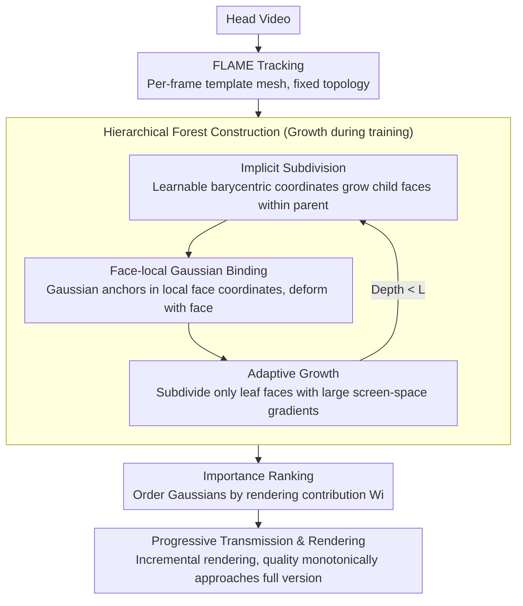

# ProgressiveAvatars: Progressive Animatable 3D Gaussian Avatars

**Conference**: CVPR 2026  
**arXiv**: [2603.16447](https://arxiv.org/abs/2603.16447)  
**Code**: [GitHub](https://ustc3dv/ProgressiveAvatars)  
**Area**: 3D Vision  
**Keywords**: Progressive 3D representation, animatable head avatars, 3D Gaussian Splatting, streaming, adaptive subdivision

## TL;DR
Proposes ProgressiveAvatars, a progressive avatar representation based on adaptive implicit subdivision of template meshes to construct hierarchical 3DGS. It supports progressive transmission and rendering under varying bandwidth and computation constraints—obtaining a usable avatar with only 5% of the data (2.6MB), with subsequent incremental loading smoothly improving quality to levels comparable with SOTA methods.

## Background & Motivation
**Background**: High-fidelity real-time head avatars are key technologies for immersive interaction. 3DGS has become the mainstream explicit representation due to its efficient rendering. Methods like GaussianAvatars, FlashAvatar, and MeGA have achieved high-quality animatable avatars.

**Limitations of Prior Work**:
   - In dynamic multi-user scenarios like social VR, transmitting high-fidelity avatars as traditional static assets leads to severe startup latency and bandwidth spikes; users must wait for the full download to see any rendering.
   - Existing 3DGS avatars lack an incremental loading mechanism, preventing the smooth accumulation of details during transmission.
   - Existing LOD methods (LoDAvatar, ArchitectHead) rely on discrete LOD switching paradigms, requiring storage of multiple independent model copies, leading to significant storage redundancy and resource switching latency.
   - Uniform subdivision (LoDAvatar) over-refines smooth regions while under-refining high-frequency areas, wasting resources.

**Key Challenge**: How to achieve progressive transmission and rendering within a unified asset, supporting immediate animatable rendering at any transmission ratio without introducing discrete asset switching or storage redundancy.

**Key Insight**: Construct hierarchical 3DGS in face-local coordinate systems on the FLAME template mesh, growing details on demand via adaptive implicit subdivision and implementing continuous streaming prioritized by importance scores.

**Core Idea**: Construct a hierarchical forest through adaptive implicit subdivision on template mesh faces, utilizing importance scores for each face to achieve progressive transmission and rendering via incremental loading.

## Method

### Overall Architecture
This paper addresses how to turn a high-fidelity 3DGS avatar into a "streamable" asset, allowing users to render a usable avatar after receiving only a small portion of the data, which then smoothly gains clarity as more data flows in. The pipeline starts with a head video, using FLAME to track per-frame template meshes. During training, 3D Gaussians are bound to FLAME triangular faces, and hierarchical trees are grown recursively on each face based on screen-space gradients. During inference/transmission, Gaussians are assigned importance scores and sent in descending order; the receiver incrementally adds each batch to the scene for immediate re-rendering. Consequently, a single asset supports all intermediate states from a "5% coarse version" to a "100% fine version."

### Key Designs

**1. Implicit Subdivision: Growing child faces inside parents via learnable barycentric coordinates instead of explicit vertices**

Uniform subdivision is problematic because it unconditionally splits every triangular face into fixed shapes, regardless of where refinement is needed or the geometry of different facial regions. This work adopts implicit subdivision: for a parent face $f=(i,j,k)$, new vertices are not placed at edge midpoints but interpolated using barycentric coordinates $\mathbf{p}=\beta_1\mathbf{v}_i+\beta_2\mathbf{v}_j+\beta_3\mathbf{v}_k$. The weights are initialized to $(1/3,1/3,1/3)$ and optimized under simplex constraints (non-negative and summing to 1). "Implicit" refers to the fact that it does not create new fixed vertices/topologies; instead, it allows learnable barycentric points to slide within the parent face to optimal detail locations. When expressions or poses change, the same barycentric mapping calculates new positions on the deformed mesh, naturally following the face.

**2. Face-local Gaussian Binding: Anchoring Gaussians in face-local coordinates to deform with the face**

To ensure the avatar is animatable at any transmission stage, Gaussians cannot be hard-coded in world coordinates. This work treats each face in the hierarchy as a local coordinate system. Gaussian rotation, scale, and center are defined relative to the face: $\mathbf{R}=\Delta\mathbf{R}\,\mathbf{r}$, $\mathbf{S}=\Delta\mathbf{S}\,s$, $\boldsymbol{\mu}=s\,\mathbf{r}\,\Delta\boldsymbol{\mu}+\mathbf{t}$, where $\mathbf{r}$ is the face-normal aligned rotation, $\mathbf{t}$ is the face centroid, and $s$ is the mean edge length. $\Delta\mathbf{R}, \Delta\mathbf{S}, \Delta\boldsymbol{\mu}$ are trainable residuals. As faces deform with FLAME, $\mathbf{r}, \mathbf{t}, s$ update, and attached Gaussians transform automatically, maintaining a consistent appearance across levels—a prerequisite for progressive transmission where coarse and fine layers share the same binding logic.

**3. Adaptive Growth: Subdividing only leaf faces with high screen-space gradients to focus budget on high-frequency regions**

Subdividing all faces uniformly wastes Gaussians on smooth areas like cheeks. Adaptive growth accumulates screen-space gradients $g_i$ for each face at the current maximum level $\ell_{\max}$ during training. Every $k$ iterations, leaf faces with $g_i>\varepsilon$ are subdivided to grow new children with bound Gaussians, repeating until a maximum depth $L$ is reached. High gradients indicate high reconstruction error and information density, causing the tree to grow deeper in high-frequency regions (eyes, mouth) and remain shallow in smooth areas, achieving a better quality-cost trade-off.

**4. Importance Ranking and Progressive Transmission: Ordering Gaussians by rendering contribution for monotonic quality improvement**

While the hierarchy determines *where* details grow, streaming requires knowing *what to send first*. This work calculates an importance score for each face as the sum of its bound Gaussians' rendering contributions across all pixels: $W_i=\sum_{j\in\mathcal{G}_i}\sum_p \alpha_{j,p}T_{j,p}$ (where $\alpha$ is opacity and $T$ is transmittance). Gaussians are transmitted from highest to lowest $W_i$. This minimizes color drift between partial and full renders—the most impactful points arrive first, ensuring that every received increment monotonically improves quality.

### Loss & Training
- Multi-level Joint Supervision: $\mathcal{L}_{\text{rgb}} = \sum_{\ell \in \mathcal{S}} w_\ell [(1-\lambda_s)\mathcal{L}_1 + \lambda_s \mathcal{L}_{\text{ssim}}]$
- Coarse-to-fine Optimization: Initialize max depth to 1, increase depth and trigger adaptive subdivision every 50k iterations.
- Regularization: $\mathcal{L}_{\text{scale}}$ (scale constraint) + $\mathcal{L}_{\text{pos}}$ (position constraint) to prevent Gaussians from deviating too far from their bound faces.
- Total Loss: $\mathcal{L} = \mathcal{L}_{\text{rgb}} + \lambda_{\text{scale}}\mathcal{L}_{\text{scale}} + \lambda_{\text{pos}}\mathcal{L}_{\text{pos}}$
- Adam optimizer, 60k iterations, adaptive expansion every 2k iterations.

## Key Experimental Results

### Main Results (NeRSemble Dataset, varying transmission budgets)

| Transm. Ratio | NVS PSNR↑ | NVS SSIM↑ | NVS LPIPS↓ | #Gaussians | Data Size | FPS |
|---------------|-----------|-----------|------------|------------|-----------|-----|
| 5% (Base)     | 27.89     | 0.851     | 0.186      | 10,144     | 2.60MB    | 291 |
| 25%           | 29.14     | 0.892     | 0.080      | 37,302     | 9.56MB    | 278 |
| 50%           | 30.03     | 0.904     | 0.073      | 84,132     | 21.56MB   | 258 |
| 100%          | 31.47     | 0.929     | 0.068      | 169,438    | 43.42MB   | 260 |
| GaussianAvatars| 31.10    | 0.937     | 0.064      | 163,829    | 41.90MB   | 271 |

### Comparison with SOTA

| Method          | NVS PSNR↑ | NVS LPIPS↓ | NES PSNR↑ | NES LPIPS↓ |
|-----------------|-----------|------------|-----------|------------|
| PointAvatar     | 25.8      | 0.097      | 23.4      | 0.102      |
| GaussianAvatars | 31.1      | 0.064      | 25.8      | 0.076      |
| Ours (5%)       | 27.9      | 0.186      | 25.1      | 0.176      |
| **Ours (100%)** | **31.5**  | 0.068      | **25.9**  | 0.080      |

### Key Findings
- Only 5% of the data (2.6MB) provides a usable avatar (PSNR 27.89), whereas GaussianAvatars must wait for nearly all data to render.
- PSNR at 100% transmission (31.47) exceeds GaussianAvatars (31.10), with slightly better NES (New Expression Synthesis) results.
- Framerate remains consistently between 258-291 FPS (RTX 4090, 550×802); the increase in Gaussians does not cause significant FPS drops.
- Adaptive subdivision outperforms uniform subdivision: higher reconstruction quality given the same Gaussian count, with deeper subdivision in high-frequency regions like beards.
- Multi-level supervision is vital for progressive transmission: supervising only the finest level leads to low levels failing to learn the full avatar (PSNR drops from 29.87 to 20.06 at 35% budget without it).

## Highlights & Insights
- **From Discrete LOD to Continuous Progressive Stream**: A core paradigm shift. Unlike traditional LOD requiring multiple independent models and switching latencies, ProgressiveAvatars uses a single continuous asset supporting immediate rendering at any ratio. This is directly valuable for latency-sensitive Social VR.
- **Adaptive Implicit Subdivision is Significantly More Efficient**: Better quality-cost trade-offs are achieved by growing deeper trees in high-frequency regions (eyes, mouth, beard) while keeping smooth regions shallow.
- **Importance Ranking Ensures Monotonic Quality Improvement**: Transmitting high-contribution Gaussians first ensures that each increment maximizes rendering quality improvement.
- **Face-local Binding + Barycentric Mapping**: Guaranteed animatability at any transmission stage, which is the key technical differentiator.

## Limitations & Future Work
- LPIPS at 100% transmission (0.068) is slightly inferior to GaussianAvatars (0.064), indicating a small gap in perceived quality.
- Max hierarchy depth $D=4$ limits the ultimate attainable granularity.
- Validated only on the NeRSemble dataset; generalization to more characters or complex scenes remains unknown.
- Importance scores are pre-computed and fixed during training, preventing dynamic adjustment based on the runtime viewpoint.
- Progressive transmission priority strategies for multiple avatars in a shared scene are not discussed.

## Related Work & Insights
- **vs GaussianAvatars**: Both share face-bound Gaussian designs, but GaussianAvatars lacks hierarchical structure and progressive transmission. ProgressiveAvatars achieves comparable quality with a 2.6MB-ready progressive experience.
- **vs LoDAvatar**: LoDAvatar also uses LOD on template meshes but employs uniform subdivision with manual masks. ProgressiveAvatars' adaptive growth is more elegant and higher quality.
- **vs GA+LightGaussian (discrete compression)**: GA+LG requires 227.2MB to store 10 LOD levels, whereas ProgressiveAvatars requires only a 43.4MB single asset supporting continuous rendering at any scale.

## Rating
- Novelty: ⭐⭐⭐⭐ Innovative paradigm shift from discrete LOD to continuous progressive streaming; elegant adaptive subdivision design.
- Experimental Thoroughness: ⭐⭐⭐⭐ Extensive progressive transmission simulations and ablations, though validated on limited datasets.
- Writing Quality: ⭐⭐⭐⭐ Clear motivation and detailed methodology.
- Value: ⭐⭐⭐⭐ Significant practical value for latency-sensitive 3D avatar transmission in VR/Telepresence.

## Related Papers

- [\[CVPR 2026\] Motion-Aware Animatable Gaussian Avatars Deblurring](motion-aware_animatable_gaussian_avatars_deblurring.md)
- [\[CVPR 2026\] HyperGaussians: High-Dimensional Gaussian Splatting for High-Fidelity Animatable Face Avatars](hypergaussians_high-dimensional_gaussian_splatting_for_high-fidelity_animatable_.md)
- [\[CVPR 2026\] FlexAvatar: Flexible Large Reconstruction Model for Animatable Gaussian Head Avatars with Detailed Deformation](flexavatar_flexible_large_reconstruction_model_for_animatable_gaussian_head_avat.md)
- [\[CVPR 2026\] PhysHead: Simulation-Ready Gaussian Head Avatars](physhead_simulation-ready_gaussian_head_avatars.md)
- [\[CVPR 2026\] Zero-Shot Reconstruction of Animatable 3D Avatars with Cloth Dynamics from a Single Image](zero-shot_reconstruction_of_animatable_3d_avatars_with_cloth_dynamics_from_a_sin.md)

<!-- RELATED:END -->

<!-- RELATED:START -->

## Related Papers

- [\[CVPR 2026\] Motion-Aware Animatable Gaussian Avatars Deblurring](motion-aware_animatable_gaussian_avatars_deblurring.md)
- [\[CVPR 2026\] Tavatar: Topology-Aware Gaussian Attribute Derivation for Animatable Human Avatars](tavatar_topology-aware_gaussian_attribute_derivation_for_animatable_human_avatar.md)
- [\[CVPR 2026\] HyperGaussians: High-Dimensional Gaussian Splatting for High-Fidelity Animatable Face Avatars](hypergaussians_high-dimensional_gaussian_splatting_for_high-fidelity_animatable_.md)
- [\[CVPR 2026\] FlexAvatar: Flexible Large Reconstruction Model for Animatable Gaussian Head Avatars with Detailed Deformation](flexavatar_flexible_large_reconstruction_model_for_animatable_gaussian_head_avat.md)
- [\[CVPR 2026\] Zero-Shot Reconstruction of Animatable 3D Avatars with Cloth Dynamics from a Single Image](zero-shot_reconstruction_of_animatable_3d_avatars_with_cloth_dynamics_from_a_sin.md)

<!-- RELATED:END -->
