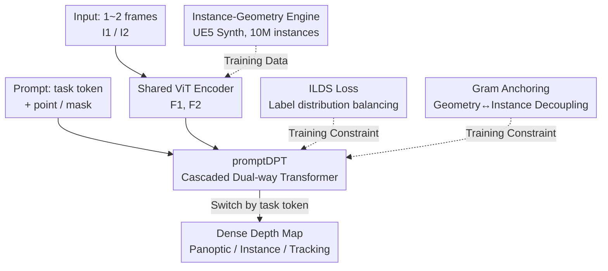

# PromptDepth: Efficient and Promptable Geometric 3D Vision Model for Embodied Intelligence

**Conference**: CVPR 2026  
**Paper**: [CVF Open Access](https://openaccess.thecvf.com/content/CVPR2026/html/Wang_PromptDepth_Efficient_and_Promptable_Geometric_3D_Vision_Model_for_Embodied_CVPR_2026_paper.html)  
**Code**: https://promptdepth.github.io (Project page, committed to open source)  
**Area**: 3D Vision  
**Keywords**: Geometric 3D Perception, Depth Estimation, Promptable Model, Embodied Intelligence, Instance-aware

## TL;DR
PromptDepth unifies "panoptic depth, instance depth, tracking depth, and stereo depth" into a single **promptable** dense prediction task. A feed-forward network learns geometric representations, switching outputs via different task tokens/points/mask prompts. Combined with ILDS loss and Gram Anchoring to resolve training conflicts between panoptic and instance depth, the model achieves SOTA on multiple benchmarks using only synthetic data. It doubles inference speed and is designed for real-time 3D understanding in embodied agents.

## Background & Motivation

**Background**: Embodied agents (robot grasping, navigation) require real-time 3D scene understanding and object interaction on compute-constrained platforms. A "Go-to-Grasp-and-Place" pipeline involves mapping, localization, instance recognition, and object tracking, all within tolerable latency. Existing geometric 3D models (DUSt3R, VGGT, MapAnything, Depth Anything, etc.) show strong performance in depth estimation, dense point cloud reconstruction, and 3D point tracking.

**Limitations of Prior Work**: These models are "impractical" for embodied scenarios in two ways. First, **efficiency**: many SOTA models require long sequences of frames for a single forward pass (suitable for offline, not online) and employ redundant prediction heads for multi-tasking, which contradicts the "minimal prediction" needs of real-time systems. Second, **lack of instance interaction**: many foundation models understand geometry but not instances, which are the actual "operable" objects in embodied systems. Simply combining 3D models with promptable segmentation models like SAM into a "mixture of experts" introduces significant latency; diffusion or Gaussian splatting-based instance-aware 3D mapping is not run-time friendly due to iterative processes or implicit projections.

**Key Challenge**: An inherent conflict exists between geometric and instance representations. Geometric representations must preserve textures and fine-grained correspondence between distant parts of the same object. Conversely, strong instance representations require features of the same object to be similar, pulling geometrically distant features together and destroying geometric correspondence, which leads to panoptic depth degradation. Multiple prediction heads also cause functional overlap—point maps and depth maps both contain geometric information, making redundant computation wasteful.

**Goal**: To create a **unified, efficient, and flexible** vision model capable of both geometric 3D understanding and instance-level interaction, quickly generating various dense depth maps (scene/instance/tracking) based on prompts.

**Core Idea**: Following the "minimal prediction" principle, the network learns a single geometric representation while leaving the "specific prediction target" to be activated by **prompts**. A promptable dense prediction Transformer (promptDPT) replaces redundant multi-head decoders. ILDS loss and Gram Anchoring resolve dual conflicts in label distribution and latent space between panoptic and instance depth. A synthetic data engine is used to bridge the lack of real "geometry-instance" paired data.

## Method

### Overall Architecture
PromptDepth is a feed-forward network taking up to two corresponding images $I_1, I_2 \in \mathbb{R}^{w\times h\times 3}$ (single image for monocular, two for stereo) and outputting dense depth maps $d_1, d_2 \in \mathbb{R}^{w\times h}$. The pipeline consists of: a **symmetrical vision encoder with fully shared parameters** (DINO backbone) encoding images into visual features $F_1, F_2$; a **prompt encoder** (following SAM) encoding visual cues like points $p_i$ and masks $m_j$ into sparse $F_p$ and dense $F_m$ representations; and the core **promptDPT decoder**, which jointly processes image features and `[task token, prompt]` using cascaded dual-way Transformers. The final depth map is output via a dot product of sparse and dense embeddings. Training uses **ILDS loss** to balance label distribution and **Gram Anchoring** to decouple geometry and instance representations.

The key feature: the same weights and decoder head can "switch modes" based on the input task token (monocular/stereo/instance/tracking) and point/mask prompts, enabling various tasks without extra computational overhead.

### Key Designs

**1. promptDPT: Replacing Redundant Multi-head Decoders with "Minimal Prediction + Prompting"**

To address the inefficiency of overlapping multi-head functions, the authors propose that the network learns **one geometric representation** and uses prompts to activate specific predictions. A set of learnable **task tokens** $F_t$ represent four tasks: monocular, stereo, instance query, and tracking. The decoder is a **cascaded dual-way Transformer**: a "dense dual-way block" performs implicit geometric alignment between stereo views and mask tracking, refining $F_1, F_2$ into aligned features $\hat F_1, \hat F_2$ via cross-attention (degenerating to self-attention for monocular where $F_2=F_1$); followed by a "sparse dual-way block" for point/task interactions. The process is defined as $(F'_t, F'_p),(F'_1,F'_2)=\text{PromptDPT}([F_t,F_p],(F_1,F_2))$. The output $\hat d$ is generated via a **dot product** between task sparse embeddings $F'_t$ and dense embeddings $(F'_1,F'_2)$, rather than training convolutional heads from scratch. Task switching merely involves changing the token.

Two prompt injection methods are used: for masks, the dense block fuses $F_1$ and $F_m$ via Hadamard product for tracking; for points, $F_p$ is concatenated with instance tokens. All outputs are unified in the format of "depth maps."

**2. ILDS Loss: Adaptive Weighting for Single Depth Maps to Flatten Instance Zero-Bias**

Unifying panoptic and instance depth training is hindered by **label distribution imbalance**. In instance depth maps, large areas of zero-value backgrounds dominate. While Dice loss helps in segmentation, it is inapplicable to dense regression. Starting from the scale-and-shift invariant loss $L_{ssi}(d,\hat d)=\frac{1}{h*w}\sum_{i,j}|d^*-\hat d^*|$ (where $d^*, \hat d^*$ are normalized GT and predictions), the authors introduce "Label Distribution Smoothing."

Unlike dataset-wide statistics, ILDS computes frequency **within a single depth map**: a smoothed density $\tilde f_D(d_g)=\int_{d^*_m} k(d^*_m,d_g)p(d^*_m)\,d^*_m$ is defined, where $k$ is a symmetric kernel. To handle false positives in early training, $d^*_m=\max(d^*,\hat d^*)$ is used. Adaptive weights are assigned as $w(d^*_m)=1/\tilde f_{norm}(\arg\min_{d_g}|d^*_m-d_g|)$. The final loss integrates these weights:

$$L_{ilds}=\frac{1}{h*w}\sum_{i,j} w(d^*_m)\,|d^*-\hat d^*|.$$

Intuitively, sparse foreground pixels in instance maps are up-weighted while background zeros are suppressed, synchronizing instance and panoptic depth in logit space.

**3. Gram Anchoring: Constraining Patch Similarity in Latent Space to Prevent Representation Conflict**

ILDS handles label distribution, but a second conflict exists in latent space: joint training of geometry and instance representations leads to "representation collapse" as high-level semantics destroy geometric details. Using a "Gram Anchoring" strategy, the authors regularize geometry and instance features.

A **curriculum learning** approach is used: first, only panoptic depth supervises the geometric representation $X_G$. During instance training, intermediate vision encoder features $X_S$ are aligned to $X_G$. Crucially, the constraint applies **only to patch similarity (Gram matrix) rather than the features themselves**, allowing features to move freely while preserving relationships: $L_{gram}=|X_G^T X_G - X_S^T X_S|$. The final objective is $L_{total}=L_{ilds}+\lambda L_{gram}$, where $\lambda=2$. Ablations show training collapses without $L_{gram}$.

**4. Instance-Geometry Engine: Filling the "Geometry-Instance" Gap with UE5 Rendering**

Real-world datasets lack well-aligned geometry-instance pairs. The authors built a synthetic data engine using Unreal Engine's Movie Render Queue (MRQ) to produce **pixel-perfect aligned** instance masks, depth maps, optical flow, and camera poses while rendering photorealistic images. The dataset spans 100 environments with over **10 million unique object instances**. **Ours** is trained solely on synthetic data yet shows robust zero-shot capabilities on real benchmarks.

### Loss & Training
Two-stage curriculum learning. Stage 1: Geometry learning with full supervision on panoptic depth. Stage 2: Interactive fine-tuning for promptable predictions (instance/stereo tracking). Each sample batch combines 8 instance prompt maps, 8 stereo tracking maps, and panoptic maps (19 frames total per data pair) to reduce reprocessing overhead and enhance robustness. AdamW optimizer with $5e-5$ initial learning rate; vision encoder is regularized at $5e-6$, while prompt encoder and Transformers use $4e-5$. Input resized to 518 short-side. Training/inference on 4×48GB RTX 4090.

## Key Experimental Results

### Main Results

Zero-shot Monocular Relative Depth (ViT-B vs. others' ViT-L/G):

| Dataset | Metric | Ours (ViT-B) | Next Best | Note |
|--------|------|------|------|------|
| KITTI | rel ↓ | **0.075** | 0.075 (DAv2 ViT-G) | Matches best with smaller backbone |
| Sintel | rel ↓ | **0.191** | 0.235 (DA-AC) | Significant lead, strong OOD |
| NYU | σ1.25 ↑ | **98.0** | 98.0 (VGGT/DAv2) | Matches best |
| ETH3D | σ1.25 ↑ | **98.3** | 97.6 (MapAnything) | SOTA |
| Diode | σ1.25 ↑ | **95.5** | 95.4 (DAv2 ViT-G) | SOTA |

Online Stereo Depth (adjacent frames):

| Dataset | Metric | Ours (ViT-B) | VDA (ViT-B) | Note |
|--------|------|------|------|------|
| KITTI | RMSE ↓ | **3.338** | 3.710 | Outperforms VDA |
| Sintel | RMSE ↓ | **2.668** | 4.657 | Drastic error reduction |
| Sintel | δ1 ↑ | **0.756** | 0.732 | Beats ViT-G VGGT (0.672) |

Zero-shot Video Object Tracking (J&F-Mean): 83.3 on DAVIS-17 (with MRQ) and 76.8 on YouTube-VOS. Competitive in zero-shot categories (compared to 90.7 for supervised SAM2).

### Ablation Study

Impact of ILDS and Gram Anchoring (KITTI Depth + Interactive Segmentation mIoU):

| Config | Abs rel ↓ | δ1 ↑ | mIoU ↑ | Note |
|------|-----------|------|--------|------|
| Single-task (Lssi / Ldice) | 0.081 | 0.942 | 67.0 | Trained separately |
| Multi-task w/o $L_{gram}$ | 0.091 | 0.924 | 62.4 | Training collapse |
| Multi-task w/o $L_{ilds}$ | 0.085 | 0.927 | 66.8 | Label imbalance issue |
| Full | **0.075** | **0.945** | **67.1** | Mutual reinforcement |

Latency (RTX 4090): Monocular **Ours** 39.09ms vs. SAM+DAv2 95.53ms (~2.4× faster); Stereo **Ours** 44.92ms vs. SAM2+VDA 188.46ms (~4× faster). On GraspNet, **Ours** achieves ~26 FPS for real grasping vs. <10 FPS for VGGT+SAM.

### Key Findings
- **Gram Anchoring prevents collapse**: $L_{gram}$ is essential for preventing geometry/instance interference. Removing it drops mIoU from 67.1 to 62.4 and increases Abs rel from 0.075 to 0.091.
- **Smaller backbone outperforms larger ones**: ViT-B beats ViT-L/G models (VGGT, DAv2) on most benchmarks, indicating gains from unified representation and synthetic data rather than parameter count.
- **Unified model beats expert mixtures**: Interactive segmentation on GraspNet exceeds SAM, likely due to the engine's focus on "whole instance" data.
- **Synthetic training enables real-world generalization**: Training solely on synthetic data achieves SOTA on real benchmarks; +MRQ further improves tracking.

## Highlights & Insights
- **"Minimal Prediction + Promptable" is the efficiency lever**: Moving from multiple heads to a single representation with task tokens provides task switching with zero overhead, enabling a 2~4× speedup over "3D + SAM" combinations.
- **Per-image label smoothing is clever**: ILDS uses intra-image frequency statistics and $\max(d^*,\hat d^*)$ to stabilize the logit space for instance depth, solving the imbalance caused by background zeros.
- **Gram matrix constraints preserve details**: $|X_G^TX_G - X_S^TX_S|$ allows features to adapt for semantics while anchoring patch relationships, resolving the conflict between geometric detail and instance similarity.
- **Synthetic engine as a controllable asset**: The UE5+MRQ pipeline circumvents the scarcity of real geometry-instance pairs and allows tuning of resolution and dynamic objects.

## Limitations & Future Work
- **Trade-off in long-term memory**: Efficiency gains for real-time inference limit long-term memory, posing challenges for keypoint tracking and dense matching for large-scale 3D reconstruction.
- **Domain gap**: While zero-shot performance is strong, domain gaps may emerge in complex real-world lighting/materials not covered by the synthetic data.
- **Tracking stability**: Current tracking lacks long-term correlation for occlusions; lightweight memory modules could be integrated.
- **Prompt expansion**: Extending prompts from points/masks to language instructions for direct embodied command coupling is a natural next step.

## Related Work & Insights
- **vs. Multi-view Stereo (MVS, e.g., VGGT/MapAnything)**: MVS models aggregate views for offline geometry with high latency. **Ours** uses adjacent frames to prioritize stereo accuracy for real-time needs, with ViT-B outperforming their larger backbones.
- **vs. SAM Mixture of Experts**: Combination schemes introduce high latency; PromptDepth integrates both into a single forward pass.
- **vs. Instance-aware Depth**: **Ours** uses ILDS+Gram to resolve task interference, proving that "mutual reinforcement" can be achieved in a discriminative framework.
- **vs. DUSt3R / DPT**: While inspired by DUSt3R, **Ours** replaces the DPT head with sparse×dense dot products and task tokens for zero-overhead task switching.

## Rating
- Novelty: ⭐⭐⭐⭐⭐ "Minimal prediction + promptable" for dense 3D perception is a novel structural approach.
- Experimental Thoroughness: ⭐⭐⭐⭐ Coverage of depth, tracking, and segmentation is extensive, though more long-term embodied closed-loop testing is needed.
- Writing Quality: ⭐⭐⭐ Ideas are clear, but some grammatical/spelling flaws exist; formulas should be cross-referenced with the original text.
- Value: ⭐⭐⭐⭐⭐ Provides an efficient, flexible 3D foundation for embodied AI; data engine and promptable paradigm are highly reusable.

<!-- RELATED:START -->

## Related Papers

- [\[CVPR 2026\] GeoCodeBench: Benchmarking PhD-Level Coding in 3D Geometric Computer Vision](benchmarking_phd-level_coding_in_3d_geometric_computer_vision.md)
- [\[CVPR 2026\] Landscape-Awareness for Geometric View Diffusion Model](landscape-awareness_for_geometric_view_diffusion_model.md)
- [\[CVPR 2026\] SAGE: Scalable Agentic 3D Scene Generation for Embodied AI](sage_scalable_agentic_3d_scene_generation_for_embodied_ai.md)
- [\[CVPR 2026\] Pano360: Perspective to Panoramic Vision with Geometric Consistency](pano360_perspective_to_panoramic_vision_with_geometric_consistency.md)
- [\[CVPR 2026\] Zero-Shot Depth Completion with Vision-Language Model](zero-shot_depth_completion_with_vision-language_model.md)

<!-- RELATED:END -->
