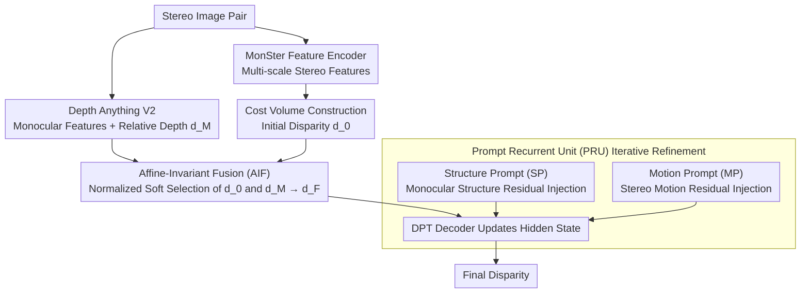

# PromptStereo: Zero-Shot Stereo Matching via Structure and Motion Prompts

**Conference**: CVPR 2026  
**arXiv**: [2603.01650](https://arxiv.org/abs/2603.01650)  
**Code**: [GitHub](https://github.com/Windsrain/PromptStereo)  
**Area**: 3D Vision  
**Keywords**: Zero-shot Stereo Matching, Monocular Depth Priors, Prompt Iterative Refinement, DPT Decoder, Affine-Invariant Fusion

## TL;DR
This paper proposes the Prompt Recurrent Unit (PRU), which utilizes the DPT decoder of monocular depth foundation models as an iterative refinement module (replacing GRU). By injecting monocular structural cues and stereo motion cues through Structure and Motion Prompts via residual addition, it achieves state-of-the-art (SOTA) zero-shot stereo matching performance without destroying monocular priors, reducing error by nearly 50% on Middlebury 2021.

## Background & Motivation
**Background**: Zero-shot stereo matching has gained significant attention. Leveraging the strong generalization of monocular depth foundation models (e.g., Depth Anything V2), recent methods enhance generalization by adapting pre-trained features.

**Limitations of Prior Work**:
   - Existing methods (MonSter, DEFOM-Stereo, BridgeDepth) mainly use monocular models to extract robust features for cost volume construction and initial disparity estimation, but the **iterative refinement stage** still relies on traditional GRUs, which is a neglected but critical stage for zero-shot generalization.
   - Three fundamental limitations of GRU: (a) It is trained independently of visual foundation models and cannot inherit strong priors; (b) Hidden states are restricted to a narrow range (tanh/sigmoid), making it difficult to handle extreme disparity variations; (c) It fuses inputs and hidden states through direct convolution, which distorts the original state and compresses external inputs.

**Key Challenge**: How to enable the iterative refinement module to inherit strong monocular priors while effectively fusing motion cues specific to stereo matching.

**Key Insight**: The DPT decoder is a multi-scale refinement structure, sharing structural similarities with the coarse-to-fine updates of a GRU. This suggests the pre-trained DPT decoder can be directly used as a recurrent unit.

**Core Idea**: Replace the GRU with a pre-trained DPT decoder and inject stereo-specific structure and motion cues as prompts via residual addition. This allows inheriting monocular priors without modifying the decoder architecture.

## Method

### Overall Architecture
Based on MonSter. Input stereo pair → Depth Anything V2 extracts monocular features + relative depth → MonSter feature encoder extracts multi-scale stereo features → Cost volume construction + initial disparity regression → Affine-Invariant Fusion (AIF) combines initial disparity and monocular depth into a reliable starting point → PRU iterative refinement (injecting Structure and Motion Prompts via residuals at each step) → Final disparity output.

### Key Designs

**1. Affine-Invariant Fusion (AIF): Combining locally accurate but globally shifted initial disparity with globally consistent but scale-ambiguous monocular depth.**

The quality of iterative refinement depends heavily on the initial disparity. The cost-volume regressed initial disparity $\mathbf{d}_0$ has high local precision but lacks global consistency; the monocular relative depth $\mathbf{d}_M$ from Depth Anything V2 has correct global structure but unknown affine transformation (scale and shift). AIF aligns them before fusion: apply affine-invariant normalization $\hat{\mathbf{d}} = (\mathbf{d} - t(\mathbf{d})) / s(\mathbf{d})$ to both, where $t$ is the median and $s$ is the Median Absolute Deviation (MAD)—using robust statistics to resist outliers. After normalization, $\mathbf{d}_M$ is projected back to disparity space $\mathbf{d}_M' = s(\mathbf{d}_0) \cdot \hat{\mathbf{d}}_M + t(\mathbf{d}_0)$, removing its affine ambiguity. Finally, a pixel-wise confidence map $\mathbf{c}$ is predicted to perform soft selection: $\mathbf{d}_F = \mathbf{c} \odot \mathbf{d}_0 + (1-\mathbf{c}) \odot \mathbf{d}_M'$.

**2. Prompt Recurrent Unit (PRU): Using the DPT decoder of the monocular model as the iterative unit to inherit foundation model priors.**

The core contribution. Instead of using a traditional GRU, the authors utilize the 4-level DPT refinement layers from Depth Anything V2 initialized with pre-trained weights. Hidden states are initialized by concatenating left features and warped right features. The reset gate is removed, leaving only the update gate $\mathbf{z}_k = \sigma(\text{ConvBlock}([\cdot]))$, updating as $\mathbf{h}_{k+1}^i = (1-\mathbf{z}_k) \odot \mathbf{h}_k^i + \mathbf{z}_k \odot \hat{\mathbf{h}}_k^i$. Range clipping is removed to provide sufficient representational space for extreme disparities.

**3. Structure Prompt (SP): Injecting monocular structure via residual addition.**

To avoid distorting the inherited DPT representations with standard convolution, SP uses prompt-style injection. It calculates the difference between current disparity and monocular depth in normalized space $\mathbf{D} = |\hat{\mathbf{d}}_k - \hat{\mathbf{d}}_M|$ to identify structural deviations. This, combined with frozen monocular features $\mathbf{F}_M$, is encoded into a structure prompt $\mathbf{P}_S$ and added to the hidden state: $\mathbf{h} = \mathbf{h} + \text{ConvBlock}(\mathbf{P}_S)$.

**4. Motion Prompt (MP): Providing stereo motion signals to the monocular-only DPT decoder.**

Since the DPT decoder lacks stereo correspondence information, MP encodes the current local cost volume $\mathbf{V}_k$ and disparity $\mathbf{d}_k$ into a motion prompt $\mathbf{P}_M^k = \text{Encoder}(\mathbf{V}_k, \mathbf{d}_k)$, followed by residual injection $\mathbf{h} = \mathbf{h} + \text{ConvBlock}(\mathbf{P}_M^k)$. SP ensures structural correctness, while MP ensures matching accuracy.

### Loss & Training
- Follows IGEV-Stereo: $\mathcal{L} = \|\mathbf{d}_0 - \mathbf{d}_{gt}\|_{\text{smooth}} + \sum_{k=1}^K \gamma^{K-k} \|\mathbf{d}_k - \mathbf{d}_{gt}\|_1$ with $\gamma = 0.9$.
- 16 training iterations, 32 inference iterations.
- DINOv2 encoder and monocular feature branches are frozen.
- Optimized using AdamW on 4×RTX 4090 with a one-cycle LR of 2e-4.

## Key Experimental Results

### Main Results — Zero-Shot Generalization (SceneFlow Training)

| Method | KITTI12 EPE↓ | KITTI15 Bad3↓ | Midd-T Bad2↓ | Midd-2021 Bad2↓ | ETH3D Bad1↓ |
|------|-------------|-------------|-------------|----------------|------------|
| RAFT-Stereo | 0.90 | 5.68 | 11.07 | 11.11 | 2.61 |
| IGEV-Stereo | 1.03 | 6.03 | 9.95 | 10.00 | 4.05 |
| MonSter | 0.93 | 5.52 | 8.97 | 15.55 | 3.20 |
| BridgeDepth | 0.83 | 4.69 | 7.84 | 15.92 | 1.26 |
| DEFOM-Stereo | 0.83 | 4.99 | 6.77 | 8.62 | 2.40 |
| **Ours** | **0.79** | **4.59** | **6.03** | **8.26** | **1.56** |

### Main Results — Infinite Training Set

| Method | Midd-T Bad2↓ | Midd-2021 Bad2↓ | ETH3D Bad1↓ |
|------|-------------|----------------|------------|
| FoundationStereo† | 3.11 | 7.14 | 0.67 |
| MonSter | 5.51 | 12.43 | 1.25 |
| BridgeDepth | 3.36 | 13.66 | 1.22 |
| **Ours** | **3.90** | **5.97** | **0.97** |

### Key Findings
- Compared to the baseline MonSter, PromptStereo reduces error on Middlebury 2021 by nearly 50% (15.55→8.26 under SceneFlow; 12.43→5.97 under "Infinite" setting).
- Ranks first across almost all metrics under the SceneFlow setting. Under the infinite setting, it outperforms FoundationStereo on Midd-2021 and ETH3D despite using fewer resources.
- PRU provides visual understanding and representation capacity that GRUs lack.
- Residual prompt injection is superior to direct convolutional fusion for preserving foundation model priors.

## Highlights & Insights
- **Clever use of decoder as a recurrent unit**: The structural similarity between DPT and multi-scale GRUs makes the substitution natural, giving PRU foundation-level representation capabilities.
- **Prompt-based information injection**: Residual addition $\mathbf{h} = \mathbf{h} + \text{ConvBlock}(\mathbf{P})$ is gentler than convolution and prevents distorting pre-trained features.
- **Flexibility**: Removing the reset gate and opening the hidden state range is crucial for expressing extreme disparities in close-up scenes.
- **Robust Statistics**: Using median + MAD for normalization in AIF is a robust way to handle outliers during disparity-depth fusion.

## Limitations & Future Work
- The DPT decoder in PRU may affect inference speed; detailed module-wise timing was not provided.
- Performance on the Booster dataset (reflective/transparent surfaces) remains limited when trained only on SceneFlow.
- Fine-tuning the DPT decoder might risk bias if training data is not sufficiently diverse.
- Prompt injection currently focuses on the highest resolution; multi-layer prompt injection remains unexplored.

## Related Work & Insights
- **vs MonSter**: MonSter only uses Depth Anything V2 for feature extraction and initialization. PromptStereo extends priors to the refinement stage, halving errors on Midd-2021.
- **vs BridgeDepth**: BridgeDepth uses monocular priors to guide a GRU, which has limited capacity. PRU's pre-trained decoder offers significantly more power.
- **vs FoundationStereo**: While FoundationStereo relies on massive data/models, PromptStereo achieves comparable or better generalization in similar settings.

## Rating
- Novelty: ⭐⭐⭐⭐⭐ Replacing GRU with a pre-trained DPT decoder is a paradigm-shifting design.
- Experimental Thoroughness: ⭐⭐⭐⭐⭐ Extensive benchmarks and comprehensive ablation studies.
- Writing Quality: ⭐⭐⭐⭐ Precise analysis of GRU limitations.
- Value: ⭐⭐⭐⭐⭐ Sets a new direction for iterative refinement in zero-shot stereo matching.

<!-- RELATED:START -->

## Related Papers

- [\[CVPR 2026\] Lite Any Stereo: Efficient Zero-Shot Stereo Matching](lite_any_stereo_efficient_zero-shot_stereo_matching.md)
- [\[CVPR 2025\] FoundationStereo: Zero-Shot Stereo Matching](../../CVPR2025/3d_vision/foundationstereo_zero-shot_stereo_matching.md)
- [\[CVPR 2026\] Fast-FoundationStereo: Real-Time Zero-Shot Stereo Matching](fast-foundationstereo_real-time_zero-shot_stereo_matching.md)
- [\[CVPR 2026\] What Makes Good Synthetic Training Data for Zero-Shot Stereo Matching?](what_makes_good_synthetic_training_data_for_zero-shot_stereo_matching.md)
- [\[CVPR 2026\] PIP-Stereo: Progressive Iterations Pruner for Iterative Optimization based Stereo Matching](pip-stereo_progressive_iterations_pruner_for_iterative_optimization_based_stereo.md)

<!-- RELATED:END -->
