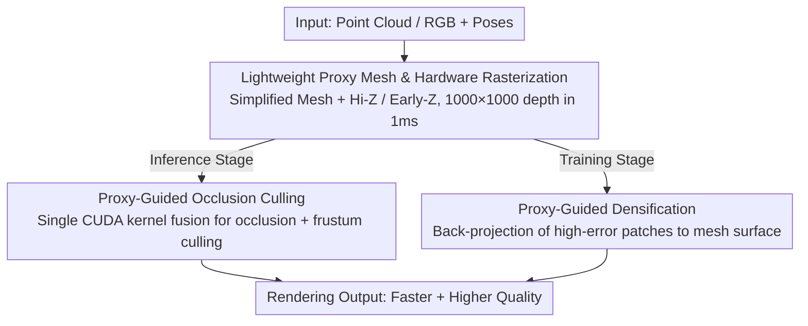

# Proxy-GS: Unified Occlusion Priors for Training and Inference in Structured 3D Gaussian Splatting

**Conference**: CVPR 2026  
**Paper**: [CVF Open Access](https://openaccess.thecvf.com/content/CVPR2026/html/Gao_Proxy-GS_Unified_Occlusion_Priors_for_Training_and_Inference_in_Structured_CVPR_2026_paper.html)  
**Code**: To be confirmed  
**Area**: 3D Vision  
**Keywords**: Gaussian Splatting, Occlusion Culling, Proxy Mesh, Level of Detail (LOD), Large-scale Rendering

## TL;DR
Proxy-GS utilizes a "lightweight proxy mesh + hardware rasterization" to generate an occlusion depth map in under 1 ms. This depth map is used both during inference to cull occluded anchors/Gaussians for accelerated rendering and during training to guide anchor densification onto visible surfaces. Compared to Octree-GS, it achieves a 3×+ FPS improvement in heavily occluded large-scale urban scenes while simultaneously enhancing rendering quality.

## Background & Motivation
**Background**: 3D Gaussian Splatting (3DGS) achieves real-time photorealistic rendering using explicit Gaussian primitives. Subsequent structured MLP variants, such as Scaffold-GS and Octree-GS, use "anchors + MLP decoders" to dynamically generate Gaussian attributes per view, significantly improving the representation of details and view-dependent effects while supporting LOD via octrees to reduce the number of distant anchors.

**Limitations of Prior Work**: MLP decoding introduces additional overhead during inference. As scene scale and the number of primitives increase, the cost of decoding and rasterization becomes more pronounced. Existing pruning methods sacrifice quality, and LOD only culls distant objects based on camera distance but is **entirely occlusion-unaware**. Real urban streets and multi-room indoor scenes are full of occlusions, where a large number of anchors fall into regions blocked by walls or buildings, contributing nothing to the final frame while increasing decoding burden.

**Key Challenge**: Visualization by the authors reveals a severe mismatch between anchors participating in decoding and "anchors truly needed for rendering"—a large proportion of anchors correspond to heavily occluded areas. In other words, anchor selection in existing structured Gaussians only optimizes for fitting RGB images without explicitly modeling "who blocks whom," leading to redundant decoding and spatially inconsistent anchor-Gaussian bindings.

**Goal**: To use a **unified** occlusion prior to solve two issues simultaneously: culling occluded anchors/Gaussians during inference to increase speed, and avoiding the growth of invalid anchors in occluded regions during training to improve quality.

**Key Insight**: Consumer-grade GPUs possess dedicated hardware rasterization units (ROP/depth testing). If a coarse "proxy mesh" is available, a conservative Z-buffer can be obtained as a per-pixel visibility prior using a nearly-free hardware depth-only pass.

**Core Idea**: Construct a lightweight proxy mesh, use hardware rasterization to produce a 1000×1000 occlusion depth map in under 1 ms, and utilize this same depth map for both "inference culling" and "training densification."

## Method

### Overall Architecture
Proxy-GS is built upon MLP-based Octree-GS. The input consists of point clouds/RGB-D with poses of a large-scale scene, and the output is high-quality novel-view rendering with faster speeds. The pipeline revolves around a "proxy system": a coarse proxy mesh is constructed offline. During rendering, hardware rasterization generates an occlusion depth map (<1 ms) for each frame. This map serves two purposes: in the **inference stage**, it is fed into a CUDA kernel for occlusion culling, discarding anchors behind objects before MLP decoding; in the **training stage**, it guides anchor densification by back-projecting new anchors onto the proxy mesh surface, preventing the growth of useless anchors in occluded regions.

### Key Designs

**1. Lightweight Proxy Mesh & Hardware Rasterization: Near-Free Occlusion Queries**

The prerequisite for this method is obtaining the "who blocks whom" relationship from any viewpoint without significant time cost. The authors construct a **coarse proxy mesh**: for outdoor large scenes, existing dense point clouds or those generated by COLMAP are converted to meshes. For indoor scenes where SfM failed due to lack of texture, MapAnything (using COLMAP poses + RGB) is used to generate dense point clouds. Finally, surface simplification is performed to keep only coarse geometric structures. This proxy is sufficient for high-speed depth-only rendering via hardware fixed-function units. To further accelerate, the mesh is divided into fine-grained clusters, and Hierarchical Z-buffer (Hi-Z) culling is used to discard invisible clusters. Early-Z is enabled in the fragment stage, and the fragment shader is simplified to only write depth. This pipeline can reduce the time to obtain $1000^2$ resolution depth maps to **under 1 ms** in complex urban scenes, and the depth map remains on the GPU for subsequent CUDA consumption, avoiding GPU-CPU-GPU round-trip overhead.

**2. Proxy-Guided Occlusion Culling: Fusing Occlusion and Frustum Culling**

With the depth map, occlusion culling can be merged with existing frustum culling into a single CUDA kernel during inference. For each anchor/point, its NDC coordinates $(x_{ndc}, y_{ndc}, z_{ndc})$ are checked: points behind the camera or near the near clipping plane ($z_h \le \tau, \tau=10^{-4}$) are marked invalid. Points are then mapped to discrete pixel indices $(u,v)$. For valid pixels, hardware depth $z_{hw} \in [0,1]$ is retrieved from the depth map and converted to a linear camera-space depth $d_{mesh}$. With a small safety margin $\gamma$, the term $\hat d$ is obtained. The final culling criterion is a depth test:

$$\text{Cull}(p) = \begin{cases} \text{true}, & z_h > \hat d(x_{pix}, y_{pix}) \\ \text{false}, & z_h \le \hat d(x_{pix}, y_{pix}) \end{cases}$$

Essentially, points whose camera-space depth is behind the corresponding pixel in the depth map are culled. Areas with invalid depth, such as the sky, are conservatively not culled. Compared to methods like OccluGaussian which use cluster-based coarse-grained reasoning, this **per-pixel** filtering better aligns with actual rendering costs while preserving detail.

**3. Proxy-Guided Densification: Directing New Anchors to Visible Surfaces**

Culling during inference is insufficient. If training still follows the original "growth at high gradient regions" strategy, many junk anchors will grow behind the proxy mesh which will never be decoded, causing spatial inconsistency. Therefore, the proxy prior is **reused** during training: inspired by Mvg-splatting, anchors are explicitly projected onto the proxy mesh surface. Since the depth map is precomputed, the L1 error can be measured per patch to identify high-error areas. Specifically, the average pixel loss $\ell_P$ is calculated for each patch, and patches satisfying $\ell_P > \tau, \tau = 3\bar\ell$ (where $\bar\ell$ is the frame average) are selected. For each selected patch, the center pixel depth is used to back-project into 3D as a new anchor position $\hat p_P$. To prevent redundancy, a proxy grid with cell size $h$ is maintained, allowing at most $K$ anchors per cell (controlled by a counter $\kappa[\cdot]$). This ensures new anchors grow on high-error surfaces that are actually visible and avoids clustering.

### Loss & Training
The method reuses the default initialization and LOD strategies of Octree-GS, training for 40k iterations. For fair comparison, the densification threshold of all baselines is unified to $10^{-4}$ to match Octree-GS quality. Training is performed on a single A100-40GB, while inference is conducted on a consumer-grade RTX 4090 to reflect real-world deployment.

## Key Experimental Results

### Main Results
On the heavily occluded large-scale urban dataset MatrixCity (divided into 5 blocks), Proxy-GS significantly outperforms baselines in both quality and speed. For instance, on the most occluded Block 5:

| Dataset (Block 5) | Method | PSNR↑ | SSIM↑ | LPIPS↓ | FPS↑ |
|--------|------|------|------|------|------|
| MatrixCity | 3DGS | 20.70 | 0.697 | 0.425 | 121 |
| MatrixCity | Octree-GS | 21.41 | 0.731 | 0.375 | 48 |
| MatrixCity | **Proxy-GS** | **21.68** | **0.744** | **0.362** | **151** |

Compared to the MLP-based Octree-GS, PSNR increases by 0.27, and FPS jumps from 48 to 151 (approx. 3.1×). This holds true on real-world data; in the heavily occluded Small City street view, speed increases by 2.73× (FPS 51→139) with a slight PSNR increase (23.03→23.09). In sparsely occluded aerial scenes like Berlin or CUHK-LOWER, Proxy-GS introduces almost no overhead, confirming that it "acts when there is occlusion and doesn't drag when there isn't."

### Ablation Study
Decomposition of training/inference strategies on Block 5 (Average anchor = avg. anchors decoded per frame):

| ID | Configuration | PSNR↑ | FPS↑ | Avg anchor | Description |
|------|------|------|------|------|------|
| 1 | Octree-GS Baseline | 21.41 | 48 | 719k | No proxy used |
| 2 | Inference-only Culling | 19.06 | 165 | 82k | 3× speedup but train-infer inconsistency drops quality |
| 3 | + Proxy Rendering in Training | 21.50 | 147 | 93k | Consistency restored, quality exceeds baseline |
| 4 | + Proxy-Guided Densification (Full) | **21.68** | 143 | 106k | Further quality gain, FPS stable with ID 3 |

### Key Findings
- **Train-Inference Consistency is Crucial**: Using occlusion culling only at test time (ID 2) reduces anchors from 719k to 82k and boosts FPS to 165, but because anchors grew during training without occlusion knowledge, PSNR drops to 19.06. Integrating the proxy into training (ID 3) immediately restores and improves quality.
- **Densification Further Enhances Quality**: Proxy-guided densification ensures anchors grow on visible high-error surfaces, raising PSNR to 21.68 while maintaining FPS.
- **Robustness to Proxy Quality**: Reducing the proxy mesh from 108MB to 824KB (1% resolution) has minimal impact on quality, as urban scenes consist of large planar surfaces where coarse proxies retain visibility structures. However, applying noise to vertices disrupts geometry and occlusion boundaries, leading to significant degradation.
- **Orthogonality with Other Accelerators**: Replacing the 3DGS renderer with FlashGS or a hardware rasterizer shows additive gains, suggesting Proxy-GS primarily optimizes anchors and can be stacked with kernel-level accelerations.

## Highlights & Insights
- **Unified Depth Map for Both Training and Inference**: Using the same proxy depth map for both culling and densification guidance unifies "acceleration" and "quality improvement"—two goals that often conflict—under a single occlusion prior.
- **Leveraging Hardware Fixed-Function Units**: Instead of writing custom CUDA soft-rasterizers, the authors leverage the GPU's hardware rasterizer (Hi-Z + Early-Z + depth-only) to obtain $1000^2$ depth in 1 ms, a clever utilization of underused graphics hardware.
- **Occlusion-Awareness vs. LOD**: The authors identify a blind spot where existing LOD methods only cull by distance. Occlusion culling is a separate, undervalued dimension of acceleration that can be overlaid on any LOD or pruning framework.

## Limitations & Future Work
- **Dependency on Proxy Mesh Quality**: The method is sensitive to vertex noise. Indoor scenes rely on large reconstruction models like MapAnything to generate initial geometry; if geometric reconstruction fails, the occlusion prior will be inaccurate.
- **Scene-Dependent Gains**: In sparsely occluded scenes (e.g., aerial views), the improvement is limited as there are fewer redundant elements to prune.
- **Conservative Culling Trade-offs**: Sky regions are conservatively not culled, and the cross-scene generalization of hyperparameters like safety margin $\gamma$, patch threshold $3\bar\ell$, and cell limit $K$ requires further discussion.

## Related Work & Insights
- **vs. Octree-GS / Scaffold-GS**: These use anchor structures and LOD to reduce distant anchors but are occlusion-unaware. Proxy-GS provides a 3× speedup and quality boost by adding an occlusion prior.
- **vs. Pruning Methods**: Pruning reduces Gaussian count to gain speed but often loses detail; Proxy-GS culls "occluded and thus zero-contribution" anchors, making it a lossless or even gainful reduction.
- **vs. OccluGaussian**: The latter uses coarse-grained cluster-based occlusion. Proxy-GS provides per-pixel filtering, which is more precise and closer to physical rendering costs.
- **vs. Ye et al. (Pre-rendered Depth)**: They use surfel rendering for depth, which is less efficient than the lightweight proxy + hardware rasterization approach presented here.

## Rating
- Novelty: ⭐⭐⭐⭐ The unified training/inference use of proxy depth maps via hardware rasterization is clever, though proxy meshes and culling have historical precedents.
- Experimental Thoroughness: ⭐⭐⭐⭐ Covers various scenes (urban, aerial, indoor), with clear ablations on consistency and densification, and tests for proxy robustness.
- Writing Quality: ⭐⭐⭐⭐ The motivation regarding anchor mismatch is convincing. Formulae are complete, though some appendix references are slightly informal.
- Value: ⭐⭐⭐⭐ Direct engineering value for large-scale real-time 3DGS deployment (e.g., VR city tours), with orthogonality to existing accelerators.

<!-- RELATED:START -->

## Related Papers

- [\[CVPR 2026\] NVGS: Neural Visibility for Occlusion Culling in 3D Gaussian Splatting](nvgs_neural_visibility_for_occlusion_culling_in_3d_gaussian_splatting.md)
- [\[CVPR 2026\] 3D Gaussian Splatting at Arbitrary Resolutions with Compact Proxy Anchors](3d_gaussian_splatting_at_arbitrary_resolutions_with_compact_proxy_anchors.md)
- [\[CVPR 2026\] Unified Primitive Proxies for Structured Shape Completion](unified_primitive_proxies_for_structured_shape_completion.md)
- [\[CVPR 2026\] Disco-GS: Gaussian Splatting in Dynamic Color Lighting](disco-gs_gaussian_splatting_in_dynamic_color_lighting.md)
- [\[CVPR 2026\] Urban-GS: A Unified 3D Gaussian Splatting Framework for Compact and High-Fidelity Aerial-to-Street Reconstruction](urban-gs_a_unified_3d_gaussian_splatting_framework_for_compact_and_high-fidelity.md)

<!-- RELATED:END -->
